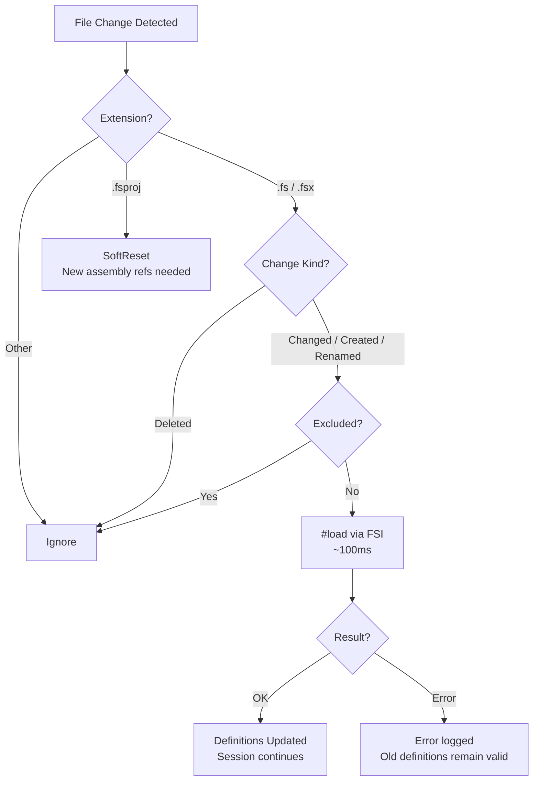

### 🔥 SageFs 🔥

**The definitive F# Interactive experience.**

Enhanced F# REPL with hot reloading, project support, and built-in AI integration.
One tool. One command. Everything you need.

[](LICENSE)
[](https://dotnet.microsoft.com)

> **Note:** This is a fork. There is no NuGet package available yet. Build from source to use.

---

## 🚀 Quick Start

```bash
# Build from source
dotnet build -c Release
dotnet pack SageFs.Server -c Release -o SageFs.Server/nupkg

# Install globally
dotnet tool install -g --add-source ./SageFs.Server/nupkg SageFs.cli

# Run with a project or solution
SageFs --proj YourProject.fsproj
SageFs --sln YourSolution.sln

# Or just run (auto-detects .sln/.slnx/.fsproj in current dir)
SageFs
```

SageFs starts with:
- ✅ MCP server on port 37749 (for AI agents)
- ✅ File watcher with incremental `#load` reload (~100ms per change)
- ✅ Hot reloading (redefine functions, refresh browser)
- ✅ Project dependencies loaded with iterative dependency resolution
- ✅ Modern REPL with autocomplete
- ✅ Shadow-copied assemblies (no DLL locks)
- ✅ Daemon mode with sub-process session management
- ✅ Code diagnostics and autocomplete via MCP

---

## ✨ Key Features

### 🤖 **Built-in AI Integration (MCP)**

MCP (Model Context Protocol) server runs automatically on port 37749. AI agents receive server instructions on connect explaining available capabilities. Tools are affordance-gated — only tools valid for the current session state are available.

**IMPORTANT:** SageFs must always run in a **visible terminal window** so the user can see all code and results. Never run it as a background process.

```bash
# MCP SSE endpoint (for AI agents):
http://localhost:37749/sse

# Direct exec endpoint (no session ID required):
curl -X POST http://localhost:37749/exec \
  -H "Content-Type: application/json" \
  -d '{"code": "let x = 42;;"}'
```

**MCP Tools:**
| Tool | Description |
|------|-------------|
| `send_fsharp_code` | Execute F# code in the REPL. Each `;;` marks a transaction boundary. |
| `check_fsharp_code` | Type-check code without executing. Returns compiler diagnostics. |
| `get_completions` | Get code completions at a cursor position. |
| `cancel_eval` | Cancel a running evaluation. |
| `load_fsharp_script` | Load and execute an `.fsx` file with partial progress preservation. |
| `get_recent_fsi_events` | View recent evaluations, errors, and script loads with timestamps. |
| `get_fsi_status` | Get session health, loaded projects, and statistics. |
| `get_startup_info` | Loaded projects, enabled features, and CLI arguments. |
| `get_available_projects` | Discover `.fsproj` and `.sln`/`.slnx` files in the working directory. |
| `reset_fsi_session` | Soft reset — fresh session, DLL locks retained. |
| `hard_reset_fsi_session` | Full reset — release DLL locks, optionally rebuild, fresh session. |
| `create_session` | Create a new isolated worker session (daemon mode). |
| `list_sessions` | List all active worker sessions with metadata. |
| `stop_session` | Stop a specific worker session by ID. |

**Tool Response Format:**

Every tool response leads with the submitted code, followed by the result or error with compiler diagnostics:

```
Code: let x = 42
Result: val x: int = 42
```

```
Code: let x = nonExistent()
Error: Operation could not be completed due to earlier error
Diagnostics:
  [error] The value or constructor 'nonExistent' is not defined.
```

**Console Echo:**

All code submitted via MCP tools or `/exec` is echoed to the visible terminal:

```
>
type Dog = {
  Name: string
  Breed: string
}
```

The `>` prompt appears on its own line, followed by the code with preserved indentation — fully copyable.

### 🔄 **Hot Reloading**

Hot reloading works by redefining functions at runtime — changes take effect on the next browser refresh.

```fsharp
// Define a mutable handler
let mutable handleHome (ctx: HttpContext) =
    task {
        ctx.Response.ContentType <- "text/html"
        do! ctx.Response.WriteAsync("<h1>Hello, World!</h1>")
    }

// Later, redefine it in the REPL:
handleHome <- fun (ctx: HttpContext) ->
    task {
        ctx.Response.ContentType <- "text/html"
        do! ctx.Response.WriteAsync("<h1>Updated without restart!</h1>")
    }
;;
// Refresh browser - changes appear instantly! 🔥
```

See `test-hot-reload.fsx` for a complete working example.

### 👁️ **File Watching & Incremental Reload**

SageFs watches your source files and automatically reloads changes via FSI `#load` — no restart, no hard reset. Changes take effect in ~100ms.



**Key behaviors:**
- `.fs`/`.fsx` changes → incremental `#load` (~100ms), not hard reset (30-60s)
- `.fsproj` changes → soft reset (new assembly references needed)
- Failed `#load` is atomic — compile errors discard the load, old definitions remain valid
- Files in `bin/`, `obj/`, temp files (`~`, `.tmp`) are automatically excluded

**Controlling what's watched:**

```bash
# Disable file watching entirely
SageFs --no-watch

# Exclude patterns (glob syntax, planned)
# Uses same conventions as dotnet watch:
# <Watch Include="..." /> and Watch="false" in .fsproj
```

### 📦 **Project & Solution Support**

SageFs automatically loads your project dependencies with smart warm-up:

```bash
SageFs --proj MyProject.fsproj  # Load one project
SageFs --sln MySolution.sln     # Load entire solution (.sln and .slnx supported)
SageFs                          # Auto-detect in current directory
```

**Warm-up features:**
- Iterative dependency resolution — retries failed opens after dependencies load
- `[<RequireQualifiedAccess>]` modules detected and skipped gracefully
- Shadow-copied assemblies prevent DLL locks on project files
- Progress displayed in real-time during namespace/module loading

### ⚡ **Modern REPL Experience**

- Autocompletion via [PrettyPrompt](https://github.com/waf/PrettyPrompt)
- Command history
- Syntax highlighting
- Multi-line editing

### 🎯 **Computation Expression Simplification**

Top-level `let!` bindings in computation expressions are automatically transformed to work at the REPL.

### 🌐 **Aspire Project Detection**

SageFs detects .NET Aspire AppHost projects and auto-configures DCP/Dashboard paths. Hot reload won't work for orchestrated services (they run as separate processes). Load your F# web project directly instead:

```bash
# ✅ For hot reload:
SageFs --proj MyWebProject.fsproj

# ⚠️ Limited (no hot reload for services):
SageFs --proj AppHost.fsproj
```

### 📝 **Enhanced Directives**

```fsharp
#open MyModule.fs     // Import a file's open statements
:exec myFile.fs       // Execute a top-level program file
:e myFile.fs          // Short form of :exec
:pwd                  // Show current directory
:q                    // Quit
:help                 // Show help
```

---

## 📖 Usage

### Basic Commands

```bash
SageFs                          # Start with auto-detection
SageFs --proj MyApp.fsproj      # Load specific project
SageFs --sln MySolution.sln     # Load entire solution
SageFs --use script.fsx         # Load and run script on startup
SageFs --help                   # Show all options
```

### MCP Configuration

```bash
SageFs                          # MCP on default port 37749
SageFs --mcp-port 8080          # Custom port
SageFs --no-mcp                 # Disable MCP server
```

### File Watching

```bash
SageFs                          # File watcher enabled by default
SageFs --no-watch               # Disable file watching
```

### Daemon Mode

```bash
SageFs -d                       # Start headless daemon (no REPL)
SageFs -d --proj MyApp.fsproj   # Daemon with project loaded
SageFs --bare                   # Bare session — no project/solution loading, quick startup
```

Daemon mode runs SageFs as a headless server with MCP + HTTP endpoints. Sub-process worker sessions can be created via MCP tools (`create_session`, `list_sessions`, `stop_session`). A `~/.SageFs/daemon.json` discovery file is written for client connections.

### ASP.NET Features

```bash
SageFs                          # Auto-detect web frameworks
SageFs --no-web                 # Disable ASP.NET features
```

---

## 🤖 AI Agent Configuration

### GitHub Copilot CLI

Add to your MCP config:

```json
{
  "mcpServers": {
    "SageFs": {
      "type": "sse",
      "url": "http://localhost:37749/sse",
      "headers": {},
      "tools": ["*"]
    }
  }
}
```

### Claude Desktop

Add to your MCP settings:

```json
{
  "mcpServers": {
    "SageFs": {
      "command": "SageFs",
      "args": [],
      "env": {}
    }
  }
}
```

---

## 🧪 Testing

```bash
# Run all tests (uses Expecto — run via dotnet run, not dotnet test)
dotnet run --project SageFs.Tests

# Run specific test suites
dotnet run --project SageFs.Tests -- --filter "Snapshot"
dotnet run --project SageFs.Tests -- --filter "MCP Adapter"
dotnet run --project SageFs.Tests -- --filter "WarmUp"
```

Tests include:
- **Snapshot tests** (Verify) — locked-in output formats for echo, eval results, status
- **Property-based tests** (FsCheck via Expecto) — warm-up retry, statement splitting
- **Unit tests** — MCP adapter formatting, benign error detection, diagnostics
- **File watcher tests** — glob pattern matching, trigger/exclude logic, change action routing

---

## 🏗️ Architecture

SageFs supports two modes:

### Embedded Mode (default)
Single process with REPL + MCP server + hot reload. Everything runs in one process.

### Daemon Mode (`SageFs -d`)
Headless server with sub-process session management:
1. **Daemon Process** — HTTP/SSE/MCP server, SessionManager supervisor
2. **Worker Processes** — Isolated FSI sessions communicating via named pipes
3. **SessionManager** — Erlang-style supervisor with spawn/monitor/restart and exponential backoff

Core components:
- **F# Interactive Engine** — FCS-based eval with middleware pipeline
- **MCP Server** — HTTP/SSE endpoints for AI agents
- **Affordance State Machine** — `SessionState` DU controls tool availability per lifecycle phase
- **File Watcher** — Incremental `#load` reload on `.fs`/`.fsx` changes (~100ms)
- **Hot Reload Engine** — Runtime function redefinition
- **Project Loader** — Ionide.ProjInfo for dependency resolution
- **Shadow Copy** — Assemblies copied to temp dir to prevent DLL locks
- **DDD Type Safety** — `SageFsError`, `SessionMode`, `CompletionKind`, `SessionStatus`, `DiagnosticSeverity` DUs

---

## 📊 Project Status

**Current Version**: 0.2.44
**Target Framework**: .NET 10.0
**Stability**: Beta — 293 tests passing
**1.0 Scope**: ✅ Complete

### What's Done
- ✅ Daemon mode with sub-process worker sessions
- ✅ SessionManager (Erlang-style supervisor with exponential backoff restart)
- ✅ MCP server with 14 tools (eval, diagnostics, completions, session management)
- ✅ Affordance-driven state machine (tools gated by session lifecycle)
- ✅ DDD type safety (SageFsError, SessionMode, CompletionKind, SessionStatus DUs)
- ✅ File watcher with incremental `#load` reload (~100ms, not hard reset)
- ✅ Exclude patterns (glob syntax) and `--no-watch` flag
- ✅ Hot reload (redefine functions, refresh to see changes)
- ✅ Project/solution loading (`.fsproj`, `.sln`, `.slnx`)
- ✅ Iterative dependency resolution with retry
- ✅ Shadow-copy DLL lock prevention
- ✅ Event sourcing with Marten (when `SageFs_CONNECTION_STRING` set)
- ✅ Code diagnostics (`check_fsharp_code`) and autocomplete (`get_completions`)
- ✅ Eval cancellation (`cancel_eval`)
- ✅ Console echo for all MCP/exec submissions
- ✅ Bare mode (`--bare`) for quick sessions without project loading
- ✅ Aspire project detection and configuration
- ✅ Computation expression simplification
- ✅ Modern REPL via PrettyPrompt

### Architecture Direction

SageFs is evolving toward a **multi-frontend immediate-mode architecture** — a single core rendering pipeline that serves terminal, web (Datastar SSE), Neovim, VSCode, and GPU (Raylib/ImGui) frontends.

**Key architectural decisions:**
- **Custom Elm loop** — `update : Msg -> Model -> Model * Cmd list`, ~40 lines of F#, no framework dependency
- **Immediate-mode rendering** — `UI = render(state)`, no retained widget trees, no diffing
- **Fleury-style `RegionFlags`** — widget features as composable flags (Scrollable, Editable, Focusable), not discriminated union widget kinds
- **Affordance-driven HATEOAS** — every UI element carries its possible actions; domain decides what's *possible*, adapters decide how to *render*
- **Tree-sitter foundation** — `ionide/tree-sitter-fsharp` for syntax highlighting, structural navigation, and incremental parsing
- **Push-based reactive streaming** — single `SageFsEvent` bus, all frontends subscribe via `IObservable<SageFsEvent>`

See [docs/repl-tui-research.md](docs/repl-tui-research.md) for the full research document.

---

## 📜 License

MIT License — see [LICENSE](LICENSE) for details

---

## 🙏 Acknowledgments

- [PrettyPrompt](https://github.com/waf/PrettyPrompt) — Modern REPL experience
- [Ionide.ProjInfo](https://github.com/ionide/proj-info/) — Project file parsing
- [ModelContextProtocol](https://modelcontextprotocol.io/) — AI integration standard

---

**Made with ❤️ for the F# community**
