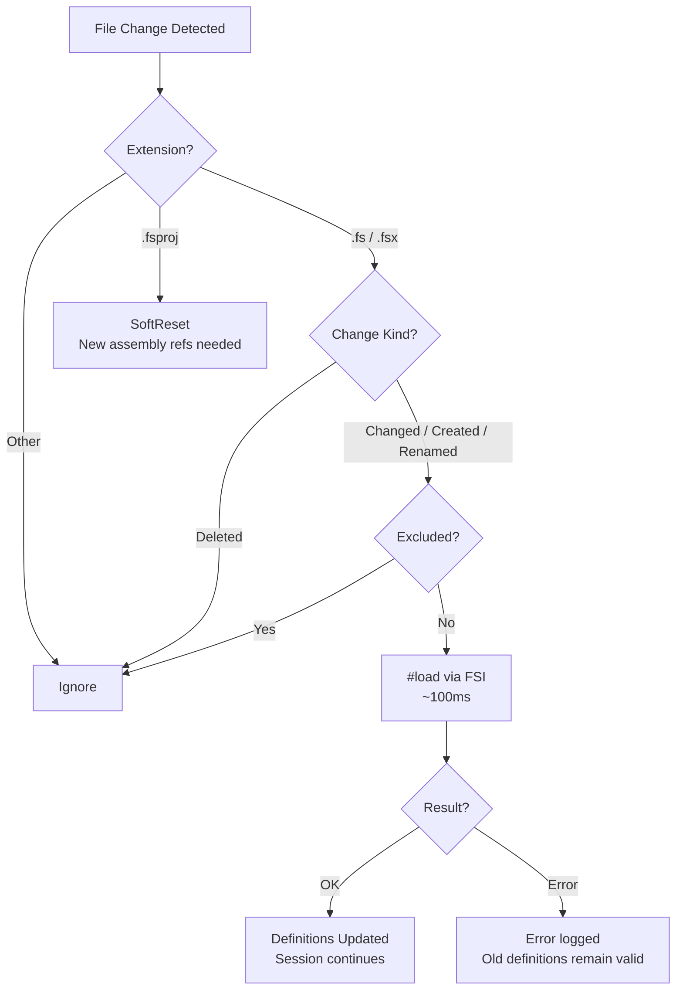

```
   ▄████████    ▄████████    ▄██████▄     ▄████████    ▄████████    ▄████████
  ███    ███   ███    ███   ███    ███   ███    ███   ███    ███   ███    ███
  ███    █▀    ███    ███   ███    █▀    ███    █▀    ███    █▀    ███    █▀
  ███          ███    ███  ▄███         ▄███▄▄▄      ▄███▄▄▄       ███
▀███████████ ▀███████████ ▀▀███ ████▄  ▀▀███▀▀▀     ▀▀███▀▀▀     ▀███████████
         ███   ███    ███   ███    ███   ███    █▄    ███                 ███
   ▄█    ███   ███    ███   ███    ███   ███    ███   ███           ▄█    ███
 ▄████████▀    ███    █▀    ████████▀    ██████████   ███         ▄████████▀

                 ⚡ Sage Mode for F# Development ⚡
```

# SageFs

**Sage Mode for F# development.** Enter a heightened state of awareness over your entire codebase.

SageFs is a live F# development server — a daemon that sees your code, understands your types, watches your files, streams to AI agents, and renders to any frontend. It's not just a REPL. It's the nervous system of your F# workflow.

[](LICENSE)
[](https://dotnet.microsoft.com)

## 🔥 Hot Reload in Action

<p align="center">
  
</p>

> Edit F# → `#load` in SageFs → Harmony patches the running code → browser updates instantly. Colors, trails, physics — all changed live while the game keeps playing. No restart, no rebuild, no state lost.

---

## 🚀 Quick Start

```bash
# Build from source
dotnet build -c Release
dotnet pack SageFs -c Release -o SageFs/nupkg

# Install globally
dotnet tool install -g --add-source ./SageFs/nupkg SageFs

# Run with a project or solution
sagefs --proj YourProject.fsproj
sagefs --sln YourSolution.sln

# Or just run (auto-detects .sln/.slnx/.fsproj in current dir)
sagefs
```

SageFs runs as a **daemon with a watchdog** — always alive, always watching. Everything else is a window into it:

- ✅ MCP server for AI agents (SSE push, not polling)
- ✅ File watcher with automatic `#load` reload (~100ms per change)
- ✅ Hot reloading — file changes auto-detour mutable handlers, refresh to see it
- ✅ Multiple frontends — TUI, GUI (Raylib), web dashboard, REPL client, AI agents
- ✅ Multi-session management — create, switch, stop isolated FSI sessions
- ✅ Project dependencies loaded with iterative dependency resolution
- ✅ Shadow-copied assemblies (no DLL locks)
- ✅ Sub-process session management (Erlang-style supervisor)
- ✅ Code diagnostics and completions via MCP
- ✅ Watchdog keeps the daemon alive — crashes restart automatically
- ✅ Live dashboard at `http://localhost:{port+1}/dashboard` (Falco + Datastar SSE)

---

## ✨ Key Features

### 🤖 **AI-Native Development (MCP)**

SageFs is built for AI-assisted development from the ground up. The MCP (Model Context Protocol) server runs automatically — AI agents receive live instructions explaining available capabilities, gated by session state. Tools appear and disappear based on what's actually possible right now.

```bash
# MCP SSE endpoint (for AI agents):
http://localhost:37749/sse
```

**MCP Tools:**
| Tool | Description |
|------|-------------|
| `send_fsharp_code` | Execute F# code in the REPL. Each `;;` marks a transaction boundary. |
| `check_fsharp_code` | Type-check code without executing. Returns compiler diagnostics. |
| `get_completions` | Get code completions at a cursor position. |
| `cancel_eval` | Cancel a running evaluation. |
| `load_fsharp_script` | Load and execute an `.fsx` file with partial progress preservation. |
| `get_recent_fsi_events` | View recent evaluations, errors, and script loads with timestamps. |
| `get_fsi_status` | Get session health, loaded projects, and statistics. |
| `get_startup_info` | Loaded projects, enabled features, and CLI arguments. |
| `get_available_projects` | Discover `.fsproj` and `.sln`/`.slnx` files in the working directory. |
| `explore_namespace` | Browse types, functions, and sub-namespaces in a .NET namespace. |
| `explore_type` | Browse members, constructors, and properties of a .NET type. |
| `get_elm_state` | Query the Elm model's render regions (editor, output, diagnostics, sessions). |
| `reset_fsi_session` | Soft reset — fresh session, DLL locks retained. |
| `hard_reset_fsi_session` | Full reset — release DLL locks, optionally rebuild, fresh session. Warmup timeout prevents stuck state. |
| `create_session` | Create a new isolated worker session (daemon mode). |
| `list_sessions` | List all active worker sessions with metadata. |
| `stop_session` | Stop a specific worker session by ID. |

**Tool Response Format:**

Every tool response leads with the submitted code, followed by the result or error with compiler diagnostics:

```
Code: let x = 42
Result: val x: int = 42
```

```
Code: let x = nonExistent()
Error: Operation could not be completed due to earlier error
Diagnostics:
  [error] The value or constructor 'nonExistent' is not defined.
```

**Console Echo:**

All code submitted via MCP tools or `/exec` is echoed to the visible terminal:

```
>
type Dog = {
  Name: string
  Breed: string
}
```

The `>` prompt appears on its own line, followed by the code with preserved indentation — fully copyable.

### 🔄 **Hot Reloading**

Hot reloading is **wired end-to-end**. When you save a `.fs` or `.fsx` file, SageFs automatically:

1. Detects the change via file watcher
2. Reloads the file via `#load` (~100ms)
3. Applies Harmony method detours to redirect mutable handlers
4. Your next browser refresh shows the updated code — no restart needed

```fsharp
// Define a mutable handler in your web app
let mutable handleHome (ctx: HttpContext) =
    task {
        ctx.Response.ContentType <- "text/html"
        do! ctx.Response.WriteAsync("<h1>Hello, World!</h1>")
    }

// Edit the file, save — SageFs auto-reloads and detours:
// handleHome now serves the updated response
// Refresh browser - changes appear instantly! 🔥
```

The file watcher monitors all project directories. Disable with `--no-watch`.

See `test-hot-reload.fsx` for a complete working example.

### 👁️ **File Watching & Incremental Reload**

SageFs watches your source files and automatically reloads changes via FSI `#load` — no restart, no hard reset. Changes take effect in ~100ms.



**Key behaviors:**
- `.fs`/`.fsx` changes → incremental `#load` (~100ms), not hard reset (30-60s)
- `.fsproj` changes → soft reset (new assembly references needed)
- Failed `#load` is atomic — compile errors discard the load, old definitions remain valid
- Files in `bin/`, `obj/`, temp files (`~`, `.tmp`) are automatically excluded

**Controlling what's watched:**

```bash
# Disable file watching entirely
sagefs --no-watch

# Exclude patterns (glob syntax, planned)
# Uses same conventions as dotnet watch:
# <Watch Include="..." /> and Watch="false" in .fsproj
```

### 📦 **Project & Solution Support**

SageFs automatically loads your project dependencies with smart warm-up:

```bash
sagefs --proj MyProject.fsproj  # Load one project
sagefs --sln MySolution.sln     # Load entire solution (.sln and .slnx supported)
sagefs                          # Auto-detect in current directory
```

**Warm-up features:**
- Iterative dependency resolution — retries failed opens after dependencies load
- `[<RequireQualifiedAccess>]` modules detected and skipped gracefully
- Shadow-copied assemblies prevent DLL locks on project files
- Progress displayed in real-time during namespace/module loading

### ⚡ **REPL Experience**

`sagefs connect` provides a REPL client that connects to the running daemon over HTTP:
- Command history (persisted in `~/.SageFs/connect_history`)
- Per-eval timing shown inline
- Auto-starts the daemon if not running

**REPL commands:**
| Command | Description |
|---------|-------------|
| `#help` | Show available commands |
| `#status` | Session status, eval stats, uptime |
| `#sessions` | List all active sessions |
| `#switch <id>` | Switch to a session by ID (or partial match) |
| `#create [dir]` | Create a new session (optional working directory) |
| `#stop <id>` | Stop a session by ID |
| `#reset` | Soft reset the current session |
| `#hard-reset` | Full reset with rebuild |
| `#diag` | Show compiler diagnostics |
| `#clear` | Clear output |
| `#quit` | Exit (`#exit`, `#q` also work) |

### 🖥️ **Terminal UI (TUI)**

`sagefs tui` launches a full terminal UI client with panes for editor, output, diagnostics, and sessions:

```bash
sagefs tui                       # Launch TUI client
```

- Four-pane layout: editor, output, diagnostics, sessions
- Tab/Shift+Tab to cycle focus between panes
- Session navigation: ↑/↓ to select, Enter to switch, x to stop, n to create
- Number keys 1-9 for quick session jump, Ctrl+Tab to cycle
- Layout presets for different workflows
- All keyboard shortcuts displayed in-app

### 🎮 **GUI (Raylib)**

`sagefs gui` launches a native GPU-rendered GUI with the same four-pane layout:

```bash
sagefs gui                       # Launch Raylib GUI client
```

- Same Elm-driven layout as TUI — editor, output, diagnostics, sessions
- Font size control (Ctrl+Plus/Minus, range 8-48)
- Click sessions to switch, keyboard shortcuts for navigation
- Pane resizing and layout presets
- Bundled with the `sagefs` tool — no separate build required

### 🎯 **Computation Expression Simplification**

Top-level `let!` bindings in computation expressions are automatically transformed to work at the REPL.

### 🌐 **Aspire Project Detection**

SageFs detects .NET Aspire AppHost projects and auto-configures DCP/Dashboard paths. Hot reload won't work for orchestrated services (they run as separate processes). Load your F# web project directly instead:

```bash
# ✅ For hot reload:
sagefs --proj MyWebProject.fsproj

# ⚠️ Limited (no hot reload for services):
sagefs --proj AppHost.fsproj
```

### 📝 **Enhanced Directives**

```fsharp
#open MyModule.fs     // Import a file's open statements
:exec myFile.fs       // Execute a top-level program file
:e myFile.fs          // Short form of :exec
:pwd                  // Show current directory
:q                    // Quit
:help                 // Show help
```

---

## 📖 Usage

### Basic Commands

```bash
sagefs                          # Start daemon (auto-detects projects)
sagefs --proj MyApp.fsproj      # Load specific project
sagefs --sln MySolution.sln     # Load entire solution
sagefs --use script.fsx         # Load and run script on startup
sagefs --help                   # Show all options
```

### Frontends

```bash
sagefs connect                  # REPL client (text-based, over HTTP)
sagefs tui                      # Terminal UI (4-pane layout)
sagefs gui                      # Raylib GUI (native GPU window)
# Dashboard auto-starts at http://localhost:{port+1}/dashboard
```

All frontends connect to the same running daemon — they're different windows into the same state.

### MCP Configuration

```bash
sagefs                          # MCP on default port 37749
sagefs --mcp-port 8080          # Custom port
sagefs --no-mcp                 # Disable MCP server
```

### File Watching

```bash
sagefs                          # File watcher enabled by default
sagefs --no-watch               # Disable file watching
```

### Daemon Mode

```bash
sagefs --proj MyApp.fsproj      # Daemon by default
sagefs -d --proj MyApp.fsproj   # Explicit daemon flag (backward compat alias)
sagefs --supervised             # Run under watchdog supervisor (auto-restart on crash)
sagefs --bare                   # Bare session — no project/solution loading, quick startup
sagefs connect                  # Connect REPL client to running daemon
sagefs tui                      # Launch terminal UI client
sagefs gui                      # Launch Raylib GUI client
sagefs stop                     # Stop running daemon
sagefs status                   # Show daemon info
```

SageFs runs as a daemon by default — a headless server with MCP + HTTP endpoints and a **watchdog** that keeps it alive. If the process crashes, the watchdog restarts it automatically with exponential backoff.

Sub-process worker sessions can be created via any frontend or MCP tools (`create_session`, `list_sessions`, `stop_session`). Clients discover the running daemon via HTTP health-check probing.

The REPL, terminal UI, GUI, web dashboard, and AI agents are all **clients** that connect to the running daemon — they don't embed SageFs, they talk to it.

### 🖥️ Live Dashboard

SageFs includes a **Falco + Datastar** live dashboard that runs alongside the MCP server:

```bash
# Dashboard is auto-started on MCP port + 1
# If MCP runs on 37749, dashboard is at:
http://localhost:37750/dashboard
```

The dashboard uses **Server-Sent Events (SSE)** with **Datastar** for real-time DOM morphing:
- **Session status** — current state (Ready/WarmingUp/Evaluating/Faulted) with color-coded badges
- **Session metadata** — uptime, working directory, project tags, last activity, eval count
- **Multi-session management** — create, switch, stop sessions with loading indicators and duplicate guards
- **Eval stats** — count, avg/min/max duration
- **Output panel** — live streaming of eval results and errors
- **Diagnostics panel** — compiler warnings and errors
- **Eval input** — submit F# code directly from the browser (Ctrl+Enter)
- **Keyboard shortcuts** — session navigation (↑/↓/Enter/x/n/1-9/Ctrl+Tab)
- **Server status** — auto-detects server-down and displays reconnection banner

### Per-Directory Configuration

Create `.SageFs/config.fsx` in any project directory to configure SageFs defaults:

```fsharp
// .SageFs/config.fsx
let projects = ["src/MyApp.fsproj"; "tests/MyApp.Tests.fsproj"]
let autoLoad = true
let initScript = Some "setup.fsx"
let defaultArgs = ["--no-warn:1182"]
```

**Precedence**: Manual CLI args > `.SageFs/config.fsx` > auto-discovery.

SageFs also auto-discovers `.SageFs/init.fsx` or `.SageFsrc` as startup scripts evaluated in the FSI session.

### ASP.NET Features

```bash
sagefs                          # Auto-detect web frameworks
sagefs --no-web                 # Disable ASP.NET features
```

---

## 🤖 AI Agent Configuration

### GitHub Copilot CLI

Add to your MCP config:

```json
{
  "mcpServers": {
    "SageFs": {
      "type": "sse",
      "url": "http://localhost:37749/sse",
      "headers": {},
      "tools": ["*"]
    }
  }
}
```

### Claude Desktop

Add to your MCP settings:

```json
{
  "mcpServers": {
    "SageFs": {
      "command": "SageFs",
      "args": [],
      "env": {}
    }
  }
}
```

---

## 🧪 Testing

```bash
# Run all tests (uses Expecto — run via dotnet run, not dotnet test)
dotnet run --project SageFs.Tests

# Run specific test suites
dotnet run --project SageFs.Tests -- --filter "Snapshot"
dotnet run --project SageFs.Tests -- --filter "MCP Adapter"
dotnet run --project SageFs.Tests -- --filter "WarmUp"
```

Tests include:
- **Snapshot tests** (Verify) — locked-in output formats for dashboard HTML, echo, eval results
- **Property-based tests** (FsCheck via Expecto) — warm-up retry, statement splitting, render contracts
- **Unit tests** — MCP adapter formatting, benign error detection, diagnostics
- **ElmLoop resilience tests** — Update/Render/OnModelChanged/Effect throw survival, multi-failure sequences
- **Watchdog tests** — restart decisions, grace periods, exponential backoff, give-up
- **File watcher tests** — glob pattern matching, trigger/exclude logic, change action routing
- **Hot reload tests** — file watcher → worker integration, method detouring, auto-reload pipeline
- **Editor tests** — cursor movement, text editing, selection operations
- **Session tests** — creation, switching, stopping, reset behavior, navigation across UIs
- **Session creation UX tests** — duplicate guard, loading indicators, flag lifecycle
- **Multi-UI consistency tests** — SSE roundtrip, render determinism, dispatch naming parity
- **Dashboard snapshot tests** — HTML output verification for all dashboard panels

---

## 🏗️ Architecture

SageFs is a **daemon-first architecture**. The server is always the center — every frontend is a client.

```
                          ┌─────────────┐
                          │  Watchdog   │
                          │  (restart)  │
                          └──────┬──────┘
                                 │ monitors
                          ┌──────▼──────┐
              ┌───────────┤ SageFs      ├───────────┐
              │           │ Daemon      │           │
              │           └──┬──┬──┬──┬─┘           │
              │              │  │  │  │             │
         ┌────▼───┐   ┌─────▼┐ │  │ ┌▼─────┐  ┌───▼────┐
         │Connect │   │ TUI  │ │  │ │ GUI  │  │  Web   │
         │ REPL   │   │      │ │  │ │Raylib│  │(SSE)   │
         └────────┘   └──────┘ │  │ └──────┘  └────────┘
                          ┌────▼┐ │
                          │Nvim │ │
                          └─────┘ │
                          ┌───────▼───┐
                          │ AI Agents │
                          │  (MCP)    │
                          └───────────┘
```

### How It Works

1. **Daemon Process** — The core. Runs FSI engine, MCP server, file watcher, hot reload, live dashboard. Managed by a watchdog that auto-restarts on crash with exponential backoff.
2. **Worker Sessions** — Isolated FSI sessions spawned as sub-processes, supervised Erlang-style by the SessionManager.
3. **Elm Architecture** — Pure `update : Msg → Model → Model × Effect list` loop drives all UI state. `SageFsEffectHandler` bridges pure state to real infrastructure.
4. **Clients** — `sagefs connect` (REPL), `sagefs tui` (terminal UI), `sagefs gui` (Raylib GPU), web dashboard, Neovim, AI agents all connect to the daemon. They don't embed SageFs — they're windows into it.

There is no "embedded mode". The daemon IS SageFs.

Core components:
- **F# Interactive Engine** — FCS-based eval with middleware pipeline
- **MCP Server** — HTTP/SSE endpoints for AI agents and clients
- **Live Dashboard** — Falco + Datastar SSE dashboard at `/dashboard`
- **Watchdog** — Monitors daemon health, restarts on crash with backoff
- **SessionManager** — Erlang-style supervisor: spawn/monitor/restart worker sessions
- **Affordance State Machine** — `SessionState` DU controls tool availability per lifecycle phase
- **File Watcher** — Incremental `#load` reload on `.fs`/`.fsx` changes (~100ms)
- **Hot Reload Engine** — Runtime function redefinition
- **Project Loader** — Ionide.ProjInfo for dependency resolution
- **Shadow Copy** — Assemblies copied to temp dir to prevent DLL locks
- **DDD Type Safety** — `SageFsError`, `SessionMode`, `CompletionKind`, `SessionStatus`, `DiagnosticSeverity` DUs

---

## 📊 Project Status

**Target Framework**: .NET 10.0
**Version**: 0.4.19
**Stability**: Active development — 800+ tests across 53 test files
**Test Framework**: Expecto + Verify snapshots + FsCheck property tests

### What's Done
- ✅ Daemon with sub-process worker sessions
- ✅ SessionManager (Erlang-style supervisor with exponential backoff restart)
- ✅ MCP server with 17 tools (eval, diagnostics, completions, session management, namespace/type exploration, Elm state)
- ✅ Affordance-driven state machine (tools gated by session lifecycle)
- ✅ DDD type safety (SageFsError, SessionMode, CompletionKind, SessionStatus DUs)
- ✅ Elm Architecture core — SageFsMsg, SageFsModel, SageFsUpdate, SageFsRender, SageFsEffectHandler
- ✅ SageFsEffectHandler — bridges pure Elm loop to SessionManager/worker infrastructure
- ✅ Collectible AssemblyLoadContext for namespace discovery (prevents stale DLLs after rebuild)
- ✅ Activity-based build timeout (30s inactivity / 10min max) — won't kill long-but-active builds
- ✅ File watcher wired end-to-end — auto-reloads `.fs`/`.fsx` on save (~100ms)
- ✅ Hot reload via Harmony method detouring — file change → `#load` → detour → browser refresh
- ✅ Project/solution loading (`.fsproj`, `.sln`, `.slnx`)
- ✅ Shadow-copy DLL lock prevention
- ✅ Event sourcing with Marten (when `SAGEFS_CONNECTION_STRING` set)
- ✅ Code diagnostics and autocomplete via MCP
- ✅ Eval cancellation
- ✅ Console echo for all MCP/exec submissions
- ✅ Aspire project detection and configuration
- ✅ **Terminal UI** (`sagefs tui`) — 4-pane terminal client with session management
- ✅ **Raylib GUI** (`sagefs gui`) — native GPU-rendered client, bundled with tool
- ✅ **REPL client** (`sagefs connect`) — text-based REPL with full session commands
- ✅ **Live dashboard** (Falco + Datastar SSE) — session status, eval, diagnostics, browser eval
- ✅ Multi-session support — create, switch, stop, navigate with keyboard/mouse/partial ID
- ✅ Session creation guard — loading indicators and duplicate prevention across all UIs
- ✅ Session navigation — ↑/↓/Enter/x/n/1-9/Ctrl+Tab across TUI, GUI, dashboard
- ✅ Pane resizing and layout presets in TUI and GUI
- ✅ Daemon-first architecture — `SageFs` starts daemon by default, all frontends are clients
- ✅ Watchdog module (pure + impure) with TDD — restart decisions, grace periods, exponential backoff
- ✅ `--supervised` flag for daemon mode with auto-restart
- ✅ HTTP health-check daemon discovery — no daemon.json file needed
- ✅ Per-directory config — `.SageFs/config.fsx` with projects, autoLoad, initScript, defaultArgs
- ✅ Persistent REPL history in `~/.SageFs/connect_history`
- ✅ `GET /events` SSE endpoint — push-based Elm state changes to any subscriber
- ✅ Dashboard server-down detection — auto-detects connection loss, displays reconnection banner
- ✅ ElmLoop resilience — try/catch guards prevent dispatch loop crashes from callback exceptions
- ✅ Hard reset warmup timeout (5 min) — prevents stuck WarmingUp state, transitions to Faulted
- ✅ Hard reset progress logging — phase-by-phase status (build, shadow copy, FSI creation, namespace scanning)
- ✅ Stale shadow directory cleanup — auto-removes old `sagefs-shadow-*` temp dirs during hard reset

### What's Next
- 🔲 Connected UI tracking — show MCP, terminal, browser connections per session
- 🔲 Session persistence across daemon restarts
- 🔲 System tray launcher

### Where It's Going

SageFs is a **multi-frontend immediate-mode architecture** — a single core engine that serves REPL, terminal UI, web (Datastar SSE), GPU (Raylib), Neovim, and AI agents through one unified Elm event bus.

**Architectural pillars (all implemented):**
- **Custom Elm loop** — `update : Msg -> Model -> Model * Effect list`, pure F#, no framework dependency. `SageFsEffectHandler` bridges pure state updates to real infrastructure (SessionManager, worker proxies)
- **Immediate-mode rendering** — `UI = render(state)`, no retained widget trees
- **Affordance-driven HATEOAS** — every element carries its possible actions; domain decides what's *possible*, adapters decide how to *render*
- **Push-based reactive streaming** — single `SageFsEvent` bus, all frontends subscribe via SSE
- **Frontend-agnostic rendering** — RenderRegion protocol: editor, output, diagnostics, sessions regions consumed by all UIs

The goal: you write F# domain logic once, and SageFs renders it everywhere — terminal, browser, editor, GPU window. Sage Mode sees all.

See [docs/repl-tui-research.md](docs/repl-tui-research.md) for the full research document.

---

## 📜 License

MIT License — see [LICENSE](LICENSE) for details

---

## 🙏 Acknowledgments

- [FsiX](https://github.com/soweli-p/FsiX) — The original F# Interactive experience that inspired SageFs
- [PrettyPrompt](https://github.com/waf/PrettyPrompt) — Powered the original REPL experience (removed in v0.3.1)
- [Falco](https://github.com/pimbrouwers/Falco) — Functional web framework for the dashboard
- [Falco.Datastar](https://github.com/pimbrouwers/Falco.Datastar) — Datastar SSE integration for live UI
- [Raylib-CSharp](https://github.com/ChrisDill/Raylib-cs) — GPU-rendered native GUI frontend
- [Harmony](https://github.com/pardeike/Harmony) — Runtime method patching for hot reload
- [Ionide.ProjInfo](https://github.com/ionide/proj-info/) — Project file parsing
- [ModelContextProtocol](https://modelcontextprotocol.io/) — AI integration standard

---

**Enter Sage Mode. See everything. 🐸**
