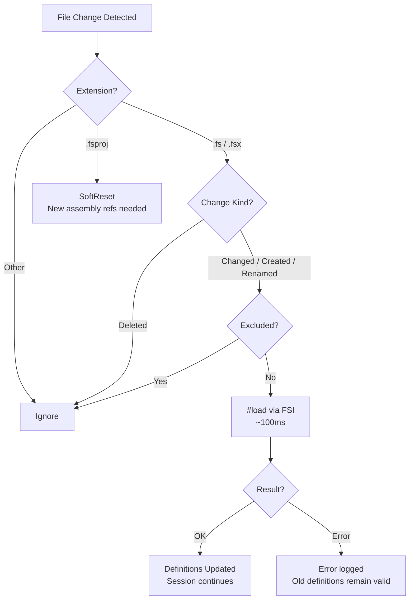

```
   ▄████████    ▄████████    ▄██████▄     ▄████████    ▄████████    ▄████████
  ███    ███   ███    ███   ███    ███   ███    ███   ███    ███   ███    ███
  ███    █▀    ███    ███   ███    █▀    ███    █▀    ███    █▀    ███    █▀
  ███          ███    ███  ▄███         ▄███▄▄▄      ▄███▄▄▄       ███
▀███████████ ▀███████████ ▀▀███ ████▄  ▀▀███▀▀▀     ▀▀███▀▀▀     ▀███████████
         ███   ███    ███   ███    ███   ███    █▄    ███                 ███
   ▄█    ███   ███    ███   ███    ███   ███    ███   ███           ▄█    ███
 ▄████████▀    ███    █▀    ████████▀    ██████████   ███         ▄████████▀

                 ⚡ Sage Mode for F# Development ⚡
```

# SageFs

**Sage Mode for F# development.** Enter a heightened state of awareness over your entire codebase.

SageFs is a live F# development server — a daemon that sees your code, understands your types, watches your files, streams to AI agents, and renders to any frontend. It's not just a REPL. It's the nervous system of your F# workflow.

[](LICENSE)
[](https://dotnet.microsoft.com)

---

## 🚀 Quick Start

```bash
# Build from source
dotnet build -c Release
dotnet pack SageFs -c Release -o SageFs/nupkg

# Install globally
dotnet tool install -g --add-source ./SageFs/nupkg SageFs

# Run with a project or solution
sagefs --proj YourProject.fsproj
sagefs --sln YourSolution.sln

# Or just run (auto-detects .sln/.slnx/.fsproj in current dir)
sagefs
```

SageFs runs as a **daemon with a watchdog** — always alive, always watching. Everything else is a window into it:

- ✅ MCP server for AI agents (SSE push, not polling)
- ✅ File watcher with incremental `#load` reload (~100ms per change)
- ✅ Hot reloading — redefine functions, refresh browser
- ✅ Project dependencies loaded with iterative dependency resolution
- ✅ Shadow-copied assemblies (no DLL locks)
- ✅ Sub-process session management (Erlang-style supervisor)
- ✅ Code diagnostics and completions via MCP
- ✅ Watchdog keeps the daemon alive — crashes restart automatically

---

## ✨ Key Features

### 🤖 **AI-Native Development (MCP)**

SageFs is built for AI-assisted development from the ground up. The MCP (Model Context Protocol) server runs automatically — AI agents receive live instructions explaining available capabilities, gated by session state. Tools appear and disappear based on what's actually possible right now.

```bash
# MCP SSE endpoint (for AI agents):
http://localhost:37749/sse
```

**MCP Tools:**
| Tool | Description |
|------|-------------|
| `send_fsharp_code` | Execute F# code in the REPL. Each `;;` marks a transaction boundary. |
| `check_fsharp_code` | Type-check code without executing. Returns compiler diagnostics. |
| `get_completions` | Get code completions at a cursor position. |
| `cancel_eval` | Cancel a running evaluation. |
| `load_fsharp_script` | Load and execute an `.fsx` file with partial progress preservation. |
| `get_recent_fsi_events` | View recent evaluations, errors, and script loads with timestamps. |
| `get_fsi_status` | Get session health, loaded projects, and statistics. |
| `get_startup_info` | Loaded projects, enabled features, and CLI arguments. |
| `get_available_projects` | Discover `.fsproj` and `.sln`/`.slnx` files in the working directory. |
| `reset_fsi_session` | Soft reset — fresh session, DLL locks retained. |
| `hard_reset_fsi_session` | Full reset — release DLL locks, optionally rebuild, fresh session. |
| `create_session` | Create a new isolated worker session (daemon mode). |
| `list_sessions` | List all active worker sessions with metadata. |
| `stop_session` | Stop a specific worker session by ID. |

**Tool Response Format:**

Every tool response leads with the submitted code, followed by the result or error with compiler diagnostics:

```
Code: let x = 42
Result: val x: int = 42
```

```
Code: let x = nonExistent()
Error: Operation could not be completed due to earlier error
Diagnostics:
  [error] The value or constructor 'nonExistent' is not defined.
```

**Console Echo:**

All code submitted via MCP tools or `/exec` is echoed to the visible terminal:

```
>
type Dog = {
  Name: string
  Breed: string
}
```

The `>` prompt appears on its own line, followed by the code with preserved indentation — fully copyable.

### 🔄 **Hot Reloading**

Hot reloading works by redefining functions at runtime — changes take effect on the next browser refresh.

```fsharp
// Define a mutable handler
let mutable handleHome (ctx: HttpContext) =
    task {
        ctx.Response.ContentType <- "text/html"
        do! ctx.Response.WriteAsync("<h1>Hello, World!</h1>")
    }

// Later, redefine it in the REPL:
handleHome <- fun (ctx: HttpContext) ->
    task {
        ctx.Response.ContentType <- "text/html"
        do! ctx.Response.WriteAsync("<h1>Updated without restart!</h1>")
    }
;;
// Refresh browser - changes appear instantly! 🔥
```

See `test-hot-reload.fsx` for a complete working example.

### 👁️ **File Watching & Incremental Reload**

SageFs watches your source files and automatically reloads changes via FSI `#load` — no restart, no hard reset. Changes take effect in ~100ms.



**Key behaviors:**
- `.fs`/`.fsx` changes → incremental `#load` (~100ms), not hard reset (30-60s)
- `.fsproj` changes → soft reset (new assembly references needed)
- Failed `#load` is atomic — compile errors discard the load, old definitions remain valid
- Files in `bin/`, `obj/`, temp files (`~`, `.tmp`) are automatically excluded

**Controlling what's watched:**

```bash
# Disable file watching entirely
sagefs --no-watch

# Exclude patterns (glob syntax, planned)
# Uses same conventions as dotnet watch:
# <Watch Include="..." /> and Watch="false" in .fsproj
```

### 📦 **Project & Solution Support**

SageFs automatically loads your project dependencies with smart warm-up:

```bash
sagefs --proj MyProject.fsproj  # Load one project
sagefs --sln MySolution.sln     # Load entire solution (.sln and .slnx supported)
sagefs                          # Auto-detect in current directory
```

**Warm-up features:**
- Iterative dependency resolution — retries failed opens after dependencies load
- `[<RequireQualifiedAccess>]` modules detected and skipped gracefully
- Shadow-copied assemblies prevent DLL locks on project files
- Progress displayed in real-time during namespace/module loading

### ⚡ **REPL Experience**

- Autocompletion and syntax highlighting (currently via PrettyPrompt — being replaced with custom rendering for multi-frontend support)
- Command history
- Multi-line editing

### 🎯 **Computation Expression Simplification**

Top-level `let!` bindings in computation expressions are automatically transformed to work at the REPL.

### 🌐 **Aspire Project Detection**

SageFs detects .NET Aspire AppHost projects and auto-configures DCP/Dashboard paths. Hot reload won't work for orchestrated services (they run as separate processes). Load your F# web project directly instead:

```bash
# ✅ For hot reload:
sagefs --proj MyWebProject.fsproj

# ⚠️ Limited (no hot reload for services):
sagefs --proj AppHost.fsproj
```

### 📝 **Enhanced Directives**

```fsharp
#open MyModule.fs     // Import a file's open statements
:exec myFile.fs       // Execute a top-level program file
:e myFile.fs          // Short form of :exec
:pwd                  // Show current directory
:q                    // Quit
:help                 // Show help
```

---

## 📖 Usage

### Basic Commands

```bash
sagefs                          # Start with auto-detection
sagefs --proj MyApp.fsproj      # Load specific project
sagefs --sln MySolution.sln     # Load entire solution
sagefs --use script.fsx         # Load and run script on startup
sagefs --help                   # Show all options
```

### MCP Configuration

```bash
sagefs                          # MCP on default port 37749
sagefs --mcp-port 8080          # Custom port
sagefs --no-mcp                 # Disable MCP server
```

### File Watching

```bash
sagefs                          # File watcher enabled by default
sagefs --no-watch               # Disable file watching
```

### Daemon Mode

```bash
sagefs -d                       # Start headless daemon (no REPL)
sagefs -d --proj MyApp.fsproj   # Daemon with project loaded
sagefs --bare                   # Bare session — no project/solution loading, quick startup
```

SageFs runs as a daemon by default — a headless server with MCP + HTTP endpoints and a **watchdog** that keeps it alive. If the process crashes, the watchdog restarts it automatically with exponential backoff.

Sub-process worker sessions can be created via MCP tools (`create_session`, `list_sessions`, `stop_session`). A `~/.SageFs/daemon.json` discovery file is written for client connections.

The REPL, terminal UI, web frontend, Neovim integration, and AI agents are all **clients** that connect to the running daemon — they don't embed SageFs, they talk to it.

### ASP.NET Features

```bash
sagefs                          # Auto-detect web frameworks
sagefs --no-web                 # Disable ASP.NET features
```

---

## 🤖 AI Agent Configuration

### GitHub Copilot CLI

Add to your MCP config:

```json
{
  "mcpServers": {
    "SageFs": {
      "type": "sse",
      "url": "http://localhost:37749/sse",
      "headers": {},
      "tools": ["*"]
    }
  }
}
```

### Claude Desktop

Add to your MCP settings:

```json
{
  "mcpServers": {
    "SageFs": {
      "command": "SageFs",
      "args": [],
      "env": {}
    }
  }
}
```

---

## 🧪 Testing

```bash
# Run all tests (uses Expecto — run via dotnet run, not dotnet test)
dotnet run --project SageFs.Tests

# Run specific test suites
dotnet run --project SageFs.Tests -- --filter "Snapshot"
dotnet run --project SageFs.Tests -- --filter "MCP Adapter"
dotnet run --project SageFs.Tests -- --filter "WarmUp"
```

Tests include:
- **Snapshot tests** (Verify) — locked-in output formats for echo, eval results, status
- **Property-based tests** (FsCheck via Expecto) — warm-up retry, statement splitting
- **Unit tests** — MCP adapter formatting, benign error detection, diagnostics
- **File watcher tests** — glob pattern matching, trigger/exclude logic, change action routing

---

## 🏗️ Architecture

SageFs is a **daemon-first architecture**. The server is always the center — every frontend is a client.

```
                          ┌─────────────┐
                          │  Watchdog   │
                          │  (restart)  │
                          └──────┬──────┘
                                 │ monitors
                          ┌──────▼──────┐
              ┌───────────┤ SageFs      ├───────────┐
              │           │ Daemon      │           │
              │           └──┬───┬───┬──┘           │
              │              │   │   │              │
         ┌────▼───┐   ┌─────▼─┐ │ ┌─▼─────┐   ┌───▼────┐
         │Terminal │   │ Web   │ │ │Neovim │   │ VSCode │
         │ REPL   │   │(SSE)  │ │ │Client │   │ Client │
         └────────┘   └───────┘ │ └───────┘   └────────┘
                          ┌─────▼─────┐
                          │ AI Agents │
                          │  (MCP)    │
                          └───────────┘
```

### How It Works

1. **Daemon Process** — The core. Runs FSI engine, MCP server, file watcher, hot reload. Managed by a watchdog that auto-restarts on crash with exponential backoff.
2. **Worker Sessions** — Isolated FSI sessions spawned as sub-processes, supervised Erlang-style by the SessionManager.
3. **Clients** — REPL, web UI, Neovim, VSCode, AI agents all connect to the daemon via MCP/HTTP/SSE. They don't embed SageFs — they're windows into it.

There is no "embedded mode". The daemon IS SageFs.

Core components:
- **F# Interactive Engine** — FCS-based eval with middleware pipeline
- **MCP Server** — HTTP/SSE endpoints for AI agents and clients
- **Watchdog** — Monitors daemon health, restarts on crash with backoff
- **SessionManager** — Erlang-style supervisor: spawn/monitor/restart worker sessions
- **Affordance State Machine** — `SessionState` DU controls tool availability per lifecycle phase
- **File Watcher** — Incremental `#load` reload on `.fs`/`.fsx` changes (~100ms)
- **Hot Reload Engine** — Runtime function redefinition
- **Project Loader** — Ionide.ProjInfo for dependency resolution
- **Shadow Copy** — Assemblies copied to temp dir to prevent DLL locks
- **DDD Type Safety** — `SageFsError`, `SessionMode`, `CompletionKind`, `SessionStatus`, `DiagnosticSeverity` DUs

---

## 📊 Project Status

**Target Framework**: .NET 10.0
**Stability**: Active development — 400 tests passing
**Test Framework**: Expecto + Verify snapshots + FsCheck property tests

### What's Done
- ✅ Daemon with sub-process worker sessions
- ✅ SessionManager (Erlang-style supervisor with exponential backoff restart)
- ✅ MCP server with 14 tools (eval, diagnostics, completions, session management)
- ✅ Affordance-driven state machine (tools gated by session lifecycle)
- ✅ DDD type safety (SageFsError, SessionMode, CompletionKind, SessionStatus DUs)
- ✅ Elm Architecture core — SageFsMsg, SageFsModel, SageFsUpdate, SageFsRender, SageFsEffectHandler
- ✅ SageFsEffectHandler — bridges pure Elm loop to SessionManager/worker infrastructure
- ✅ Collectible AssemblyLoadContext for namespace discovery (prevents stale DLLs after rebuild)
- ✅ Build timeout (120s) prevents hard reset from hanging forever
- ✅ File watcher with incremental `#load` reload (~100ms, not hard reset)
- ✅ Hot reload (redefine functions, refresh to see changes)
- ✅ Project/solution loading (`.fsproj`, `.sln`, `.slnx`)
- ✅ Shadow-copy DLL lock prevention
- ✅ Event sourcing with Marten (when `SAGEFS_CONNECTION_STRING` set)
- ✅ Code diagnostics and autocomplete via MCP
- ✅ Eval cancellation
- ✅ Console echo for all MCP/exec submissions
- ✅ Aspire project detection and configuration
- ✅ Core domain types: Editor, ElmLoop, RenderPipeline, SageFsEvent, SageFsView
- ✅ SessionDisplay types for UI rendering

### What's Next
- 🔲 Wiring ElmLoop to daemon — connect SageFsEffectHandler dispatch to live SessionManager
- 🔲 Watchdog process for daemon auto-restart
- 🔲 Remove embedded mode — daemon-only architecture
- 🔲 REPL as a client connecting to daemon
- 🔲 Replace PrettyPrompt with custom rendering — PrettyPrompt assumes it owns the terminal and can't render into a grid region, making it incompatible with the multi-frontend architecture

### Where It's Going

SageFs is evolving into a **multi-frontend immediate-mode architecture** — a single core engine that serves terminal, web (Datastar SSE), Neovim, VSCode, and GPU (Raylib/ImGui) frontends through one unified event bus.

**Architectural pillars:**
- **Custom Elm loop** — `update : Msg -> Model -> Model * Effect list`, pure F#, no framework dependency. `SageFsEffectHandler` bridges pure state updates to real infrastructure (SessionManager, worker proxies)
- **Immediate-mode rendering** — `UI = render(state)`, no retained widget trees
- **Affordance-driven HATEOAS** — every element carries its possible actions; domain decides what's *possible*, adapters decide how to *render*
- **Tree-sitter foundation** — `ionide/tree-sitter-fsharp` for syntax highlighting and structural navigation
- **Push-based reactive streaming** — single `SageFsEvent` bus, all frontends subscribe via `IObservable<SageFsEvent>`
- **Neovim-inspired UI protocol** — draw primitives + grid regions, frontend-agnostic rendering

The goal: you write F# domain logic once, and SageFs renders it everywhere — terminal, browser, editor, GPU window. Sage Mode sees all.

See [docs/repl-tui-research.md](docs/repl-tui-research.md) for the full research document.

---

## 📜 License

MIT License — see [LICENSE](LICENSE) for details

---

## 🙏 Acknowledgments

- [FsiX](https://github.com/soweli-p/FsiX) — The original F# Interactive experience that inspired SageFs
- [PrettyPrompt](https://github.com/waf/PrettyPrompt) — Modern REPL experience
- [Ionide.ProjInfo](https://github.com/ionide/proj-info/) — Project file parsing
- [ModelContextProtocol](https://modelcontextprotocol.io/) — AI integration standard

---

**Enter Sage Mode. See everything. 🐸**
