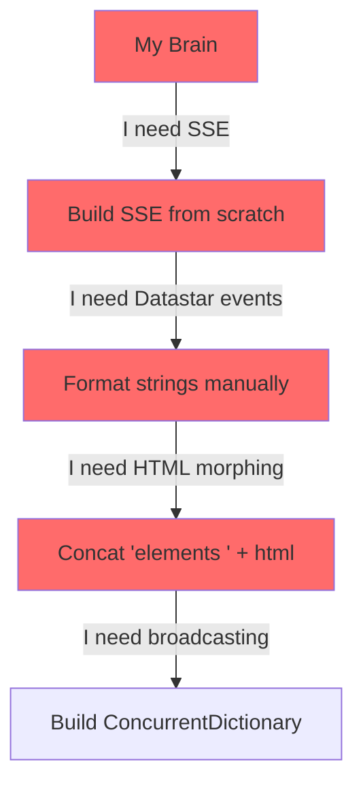
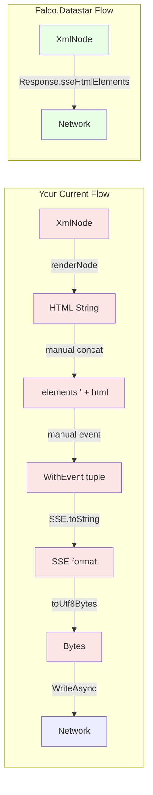
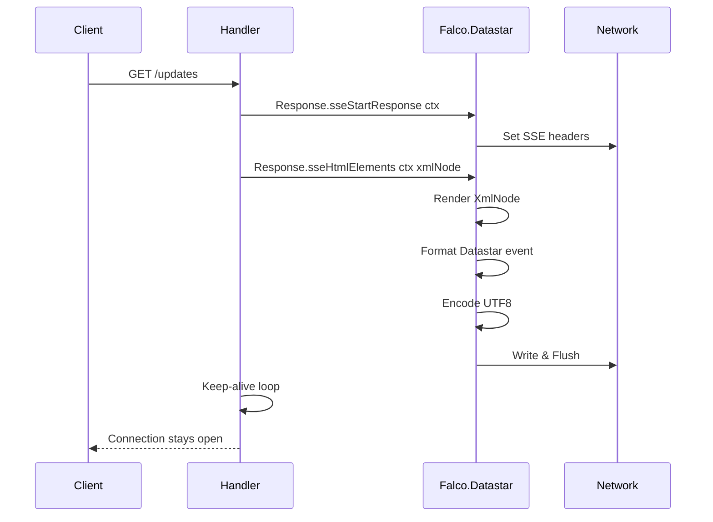
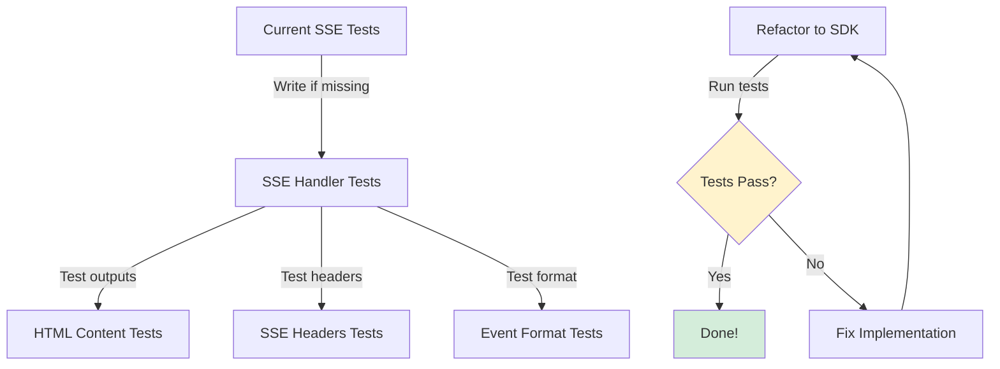
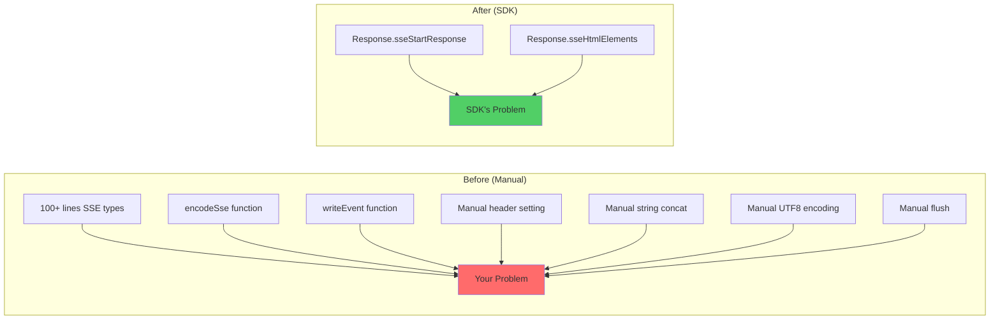

# HarmonyServer Datastar Migration Guide

**From Manual SSE → Falco.Datastar SDK**

> "You built it yourself? That's adorable. Now let's use the battle-tested SDK." - Senior Dev

---

## Table of Contents

1. [The Current State (What You Built)](#the-current-state)
2. [The Problem (Why It's Not Ideal)](#the-problem)
3. [The Solution (Falco.Datastar SDK)](#the-solution)
4. [Testing Strategy (Don't Break Shit)](#testing-strategy)
5. [Migration Steps (One Function at a Time)](#migration-steps)
6. [Common Pitfalls (What I Almost Did Wrong)](#common-pitfalls)

---

## The Current State

### The Conversation

**Me**: "So I built this SSE implementation for HarmonyServer..."

**Senior Dev**: "Show me."

**Me**: *pulls up code*

```fsharp
// HarmonyServer.Types/types.fs
type SSE =
  | Data of data: string
  | WithId of id: string * data: string
  | WithEvent of event: string * data: string
  | WithRetry of retryMs: int * data: string
  | WithIdEvent of id: string * event: string * data: string
  | WithIdRetry of id: string * retryMs: int * data: string
  | Full of id: string * event: string * retryMs: int * data: string

module SSE =
  let toString sse :string= 
    match sse with
    | Data data -> $"data: {data}\n\n"
    | WithId (id, data) -> $"id: {id}\ndata: {data}\n\n"
    | WithEvent (ev, data) -> $"event: {ev}\ndata: {data}\n\n"
    // ... etc
```

```fsharp
// HarmonyServer/harmonyServer.fs
let encodeSse (sse:SSE) =
  sse 
  |> SSE.toString
  |> toUtf8Bytes

let writeEvent (ctx:HttpContext) (e: SSE) = task {
  let eventData = e |> encodeSse
  do! ctx.Response.Body.WriteAsync(eventData, 0, eventData.Length)
  do! ctx.Response.Body.FlushAsync()
}

// Usage in handlers:
let handleOrganizationsOverviewPageUpdates: HttpHandler = fun ctx -> task {
  ctx.Response.Headers.Add("Content-Type", "text/event-stream")
  ctx.Response.Headers.Add("Cache-Control", "no-cache")
  ctx.Response.Headers.Add("Connection", "keep-alive")
  
  let htmlContent = organizations |> renderOrganizationsOverviewContent |> renderNode
  let initialSSE = WithEvent("datastar-patch-elements", $"elements {htmlContent}")
  do! writeEvent ctx initialSSE
  
  // ... keep-alive loop
}
```

**Senior Dev**: "Oh. OH. You... you built the ENTIRE SSE protocol from scratch?"

**Me**: "Well, yeah. I needed to send Datastar events..."

**Senior Dev**: *long silence*

**Senior Dev**: "Okay. Deep breath. Let me show you something."

---

## The Problem

### What You Assumed (Incorrectly)



**Senior Dev**: "Let me ask you something. When you need HTTP, do you implement TCP yourself?"

**Me**: "No, that would be—"

**Senior Dev**: "Insane? Yes. So why did you implement SSE yourself?"

**Me**: "I... didn't know there was a better way?"

**Senior Dev**: "There is. It's called `Falco.Datastar`. The SDK you're ALREADY USING for the frontend attributes."

### What's Wrong With Your Implementation

**Senior Dev**: "Don't get me wrong, your code WORKS. But:"

1. **You're Reinventing the Wheel**: SSE protocol formatting, header management, event encoding
2. **You're Doing Manual String Concatenation**: `"elements " + html` - fragile and error-prone
3. **You're Missing Edge Cases**: What if HTML contains newlines? Special chars? The SDK handles this.
4. **You're Not Using Type Safety**: `WithEvent("datastar-patch-elements", ...)` - typo-prone
5. **You're Making Future You Sad**: Every new Datastar feature = more manual work for you



**Me**: "Oh. That's... yeah, that's a lot of manual work."

**Senior Dev**: "And every line is a place bugs can hide."

---

## The Solution

### What Falco.Datastar Actually Provides

**Senior Dev**: "Let me show you what you SHOULD have been using:"

```fsharp
// Falco.Datastar.Response module has EVERYTHING you need:

// 1. Start SSE Response (sets headers, initializes stream)
Response.sseStartResponse ctx

// 2. Send HTML Elements (handles Datastar event format, encoding, everything)
Response.sseHtmlElements ctx myXmlNode

// 3. Send Signals
Response.ssePatchSignals ctx mySignalsObject
Response.ssePatchSignal ctx (sp"count") 42

// 4. One-Shot Responses (send & close)
Response.ofHtmlElements myXmlNode
Response.ofPatchSignals mySignalsObject
```

**Me**: "Wait, so I don't need to—"

**Senior Dev**: "Format SSE? No. Concat 'elements'? No. Manage headers? No. The SDK does it ALL."

### The Correct Flow



**Senior Dev**: "See? You call TWO functions. That's it."

---

## Testing Strategy

### Before We Touch ANYTHING

**Me**: "So we just rip out all my code and—"

**Senior Dev**: "NO. We TEST first, THEN refactor. RED-GREEN-REFACTOR, remember?"

**Me**: "But won't the tests break when we change the implementation?"

**Senior Dev**: "Not if we test BEHAVIOR, not IMPLEMENTATION."

### The Test Plan



**Senior Dev**: "We're going to write integration tests that hit the handlers, capture the output, and verify it WORKS. Then when we refactor, if tests still pass, we know we didn't break anything."

#### Step 1: Write Integration Tests (if they don't exist)

```fsharp
// tests/harmonyServerIntegrationTests.fs

open Expecto
open Expecto.Flip
open System.Net.Http
open Microsoft.AspNetCore.TestHost
open System.Threading.Tasks

module SSEIntegrationTests =
  
  let makeSSERequest (path: string) =
    task {
      use server = createTestServer()
      use client = server.CreateClient()
      
      let request = new HttpRequestMessage(HttpMethod.Get, path)
      request.Headers.Add("Accept", "text/event-stream")
      
      let! response = client.SendAsync(request, HttpCompletionOption.ResponseHeadersRead)
      return response
    }
  
  [<Tests>]
  let tests =
    testList "SSE Integration Tests" [
      
      testTask "Organizations update handler returns SSE headers" {
        // Arrange - setup test org data
        
        // Act
        let! response = makeSSERequest "/organizations/updates"
        
        // Assert
        response.StatusCode
        |> Expect.equal "Should return 200 OK" System.Net.HttpStatusCode.OK
        
        response.Content.Headers.ContentType.ToString()
        |> Expect.equal "Should be SSE content type" "text/event-stream"
        
        response.Headers.CacheControl.NoCache
        |> Expect.isTrue "Should have no-cache header"
      }
      
      testTask "Organizations update handler sends Datastar patch event" {
        // Arrange
        
        // Act
        let! response = makeSSERequest "/organizations/updates"
        let! body = response.Content.ReadAsStringAsync()
        
        // Assert - should contain SSE formatted Datastar event
        body
        |> Expect.stringContains "Should have event type" "event: datastar-patch-elements"
        
        body
        |> Expect.stringContains "Should have data field" "data: elements"
        
        body
        |> Expect.stringContains "Should have HTML content" "<div"
        
        // Should NOT have broken formatting
        body
        |> Expect.stringDoesNotContain "Should not have double newlines in HTML" "\n\n"
      }
      
      testTask "Organizations update handler sends valid HTML" {
        // Arrange
        
        // Act
        let! response = makeSSERequest "/organizations/updates"
        let! body = response.Content.ReadAsStringAsync()
        
        // Extract HTML from SSE format
        let html = 
          body.Split('\n')
          |> Array.filter (fun line -> line.StartsWith("data: elements"))
          |> Array.head
          |> fun line -> line.Substring("data: elements ".Length)
        
        // Assert - HTML should be valid
        html
        |> Expect.stringContains "Should have main id" """id="main"""
        
        html
        |> Expect.stringContains "Should have organizations content" "Organizations"
      }
    ]
```

**Me**: "So these tests verify the OUTPUT, not HOW it's done?"

**Senior Dev**: "EXACTLY! The test doesn't care if you use custom SSE types or the SDK. It cares that SSE events come out correctly."

#### Step 2: Snapshot Tests for HTML Structure

```fsharp
// tests/harmonyServerSnapshotTests.fs

open Verify.Expecto
open Verify

[<Tests>]
let tests =
  testList "SSE HTML Snapshot Tests" [
    
    testTask "Organizations overview SSE output structure" {
      // Arrange
      let testOrgs = [
        { Id = Guid.NewGuid(); Name = "Test Org 1"; Version = 1 }
        { Id = Guid.NewGuid(); Name = "Test Org 2"; Version = 1 }
      ]
      
      // Act
      let! response = makeSSERequest "/organizations/updates"
      let! body = response.Content.ReadAsStringAsync()
      
      // Assert - snapshot the entire SSE output
      do! Verifier.Verify(body).ToTask()
    }
  ]
```

**Senior Dev**: "Run these tests. If they don't exist yet, write them. Get them GREEN. THEN we refactor."

---

## Migration Steps

### Step 0: Run Existing Tests (Establish Baseline)

**Senior Dev**: "First, what tests do you have NOW?"

**Me**: "Uh..."

**Senior Dev**: "That's what I thought. Run your server manually, hit the endpoints, make sure they work. Screenshot everything."

```powershell
# Start the server
cd C:\Code\Repos\Harmony\AppHost
dotnet run

# In another terminal, test SSE endpoints
curl -N -H "Accept: text/event-stream" http://localhost:5000/organizations/updates
```

**Senior Dev**: "Good. Now we know the baseline behavior. Let's write tests for it."

### Step 1: Add Falco.Datastar Helper Functions (Non-Breaking)

**Senior Dev**: "First, we ADD the new functions WITHOUT removing the old ones. Parallel implementation."

```fsharp
// HarmonyServer/harmonyServer.fs

//TODO: consult the refactoring guide to migrate toward the native Falco.Datastar functions instead of the current implementation
// See: docs/datastar-migration-guide.md#step-1-add-sdk-wrapper-functions
let encodeSse (sse:SSE) =
  sse 
  |> SSE.toString
  |> toUtf8Bytes

//TODO: consult the refactoring guide to migrate toward the native Falco.Datastar functions instead of the current implementation
// See: docs/datastar-migration-guide.md#step-1-add-sdk-wrapper-functions
let writeEvent (ctx:HttpContext) (e: SSE) = task {
  let eventData = e |> encodeSse
  do! ctx.Response.Body.WriteAsync(eventData, 0, eventData.Length)
  do! ctx.Response.Body.FlushAsync()
}

// NEW: SDK wrapper functions (add these)
let startSSEResponse (ctx: HttpContext) =
  Response.sseStartResponse ctx

let sendHtmlUpdate (ctx: HttpContext) (xmlNode: XmlNode) =
  Response.sseHtmlElements ctx xmlNode

let sendSignalUpdate (ctx: HttpContext) (signalPath: SignalPath) (value: 'a) =
  Response.ssePatchSignal ctx signalPath value
```

**Me**: "So we have BOTH implementations now?"

**Senior Dev**: "Yep. Old code still works, new code exists. No breakage."

### Step 2: Migrate One Handler (Smallest First)

**Senior Dev**: "Let's pick the SIMPLEST handler. What's the smallest SSE endpoint you have?"

**Me**: "Probably the organizations overview updates?"

**Senior Dev**: "Perfect. Let's migrate JUST that one."

#### Before:

```fsharp
//TODO: consult the refactoring guide to migrate toward the native Falco.Datastar functions instead of the current implementation
// See: docs/datastar-migration-guide.md#step-2-migrate-organizations-handler
let handleOrganizationsOverviewPageUpdates: HttpHandler = fun ctx ->
  use session = ctx |> getLightweightSession
  let orgIdResult= ctx |> getOrgIdFromContextUserClaims
  let organizations = session.Query<Organization>() |> Seq.toList
  task {
    ctx.Response.Headers.Add("Content-Type", "text/event-stream")
    ctx.Response.Headers.Add("Cache-Control", "no-cache")
    ctx.Response.Headers.Add("Connection", "keep-alive")

    let browserId = Guid.NewGuid()
    let writeEventToClient = writeEvent ctx
    let cancellationToken = ctx.RequestAborted

    let client = {
      DeviceId = browserId
      OrganizationId = match orgIdResult with | Error _ -> Guid.Empty | Ok oid -> oid
      ClientType = BrowserViewer (page = $"/organizations")
      WriteEvent = writeEventToClient
      CancellationToken = cancellationToken
    }
    connectedClients.TryAdd(browserId, client) |> ignore
    printfn $"🌐 Browser {browserId} connected to organizations overview page"

    let htmlContent = organizations |> renderOrganizationsOverviewContent |> renderNode
    let initialSSE = WithEvent("datastar-patch-elements", $"elements {htmlContent}")
    do! writeEvent ctx initialSSE

    try
      try
        while not ctx.RequestAborted.IsCancellationRequested do
          do! System.Threading.Tasks.Task.Delay(Threading.Timeout.Infinite, ctx.RequestAborted)
      with
      | :? TaskCanceledException ->
        printfn "🔌 Browser %A disconnected" browserId
    finally
      printfn "🔌 Cleaning up disconnected browser %A" browserId
      match connectedClients.TryRemove browserId |> fst with
      | true -> printfn "✅ Removed browser connection %A" browserId
      | false -> printfn "⚠️ Could not remove browser connection %A" browserId
    return ctx
  }
```

#### After (Migrated):

```fsharp
let handleOrganizationsOverviewPageUpdates: HttpHandler = fun ctx ->
  use session = ctx |> getLightweightSession
  let orgIdResult= ctx |> getOrgIdFromContextUserClaims
  let organizations = session.Query<Organization>() |> Seq.toList
  task {
    // SDK handles headers!
    do! Response.sseStartResponse ctx

    let browserId = Guid.NewGuid()
    // Update WriteEvent to use SDK version
    let writeEventToClient sse = task {
      // For backwards compat with broadcast system, convert SSE to SDK call
      match sse with
      | WithEvent("datastar-patch-elements", data) ->
        // Extract HTML from "elements <html>" format
        let html = data.Substring("elements ".Length)
        // Parse back to XmlNode (we'll fix this in Step 3)
        let xmlNode = Elem.div [ Attr.id "main" ] [ Text.raw html ]
        do! Response.sseHtmlElements ctx xmlNode
      | _ -> 
        // Fallback for other event types
        failwith "Unsupported SSE type in migration"
    }
    
    let cancellationToken = ctx.RequestAborted

    let client = {
      DeviceId = browserId
      OrganizationId = match orgIdResult with | Error _ -> Guid.Empty | Ok oid -> oid
      ClientType = BrowserViewer (page = $"/organizations")
      WriteEvent = writeEventToClient
      CancellationToken = cancellationToken
    }
    connectedClients.TryAdd(browserId, client) |> ignore
    printfn $"🌐 Browser {browserId} connected to organizations overview page"

    // SDK handles everything!
    let htmlContent = organizations |> renderOrganizationsOverviewContent
    do! Response.sseHtmlElements ctx htmlContent

    try
      try
        while not ctx.RequestAborted.IsCancellationRequested do
          do! System.Threading.Tasks.Task.Delay(Threading.Timeout.Infinite, ctx.RequestAborted)
      with
      | :? TaskCanceledException ->
        printfn "🔌 Browser %A disconnected" browserId
    finally
      printfn "🔌 Cleaning up disconnected browser %A" browserId
      match connectedClients.TryRemove browserId |> fst with
      | true -> printfn "✅ Removed browser connection %A" browserId
      | false -> printfn "⚠️ Could not remove browser connection %A" browserId
    return ctx
  }
```

**Senior Dev**: "Notice what changed?"

**Me**: "We... replaced the manual header setting with `Response.sseStartResponse`, and the manual HTML concatenation with `Response.sseHtmlElements`?"

**Senior Dev**: "EXACTLY! And got rid of `renderNode` because the SDK does that internally."

### Step 3: Test the Migrated Handler

```powershell
# Run integration tests
cd C:\Code\Repos\Harmony\tests
dotnet run

# Should show all tests GREEN
```

**Senior Dev**: "If tests pass, the behavior is IDENTICAL. Users don't see a difference, but YOU have less code to maintain."

**Me**: "And if tests fail?"

**Senior Dev**: "Then we compare the SSE output byte-for-byte and figure out what's different. But the SDK is battle-tested, so it's probably YOUR test that's wrong."

### Step 4: Fix Broadcasting System (The Tricky Part)

**Senior Dev**: "Now, your `broadcastToOrganization` function stores `WriteEvent` callbacks that use the OLD SSE types. We need to update that."

**Me**: "Oh no, that touches EVERYTHING."

**Senior Dev**: "Not if we're smart about it."

#### Option A: Keep SSE Types as Internal Protocol (Easiest)

```fsharp
// Keep your SSE types for the broadcasting protocol
// Just change HOW they're sent over the wire

type ConnectedClient = {
  DeviceId: Guid
  OrganizationId: Guid
  ClientType: ClientType
  WriteEvent: SSE -> Task  // Keep this signature
  CancellationToken: CancellationToken
}

// Update the handler to convert SDK -> SSE for storage
let handleOrganizationsOverviewPageUpdates: HttpHandler = fun ctx -> task {
  do! Response.sseStartResponse ctx
  
  let browserId = Guid.NewGuid()
  
  // Wrapper that converts SSE -> SDK calls
  let writeEventToClient (sse: SSE) = task {
    match sse with
    | WithEvent("datastar-patch-elements", data) when data.StartsWith("elements ") ->
      let html = data.Substring("elements ".Length)
      // TODO: This is hacky, fix in Step 5
      let xmlNode = Elem.div [ Attr.id "main" ] [ Text.raw html ]
      do! Response.sseHtmlElements ctx xmlNode
    | _ -> 
      printfn "⚠️ Unsupported SSE type: %A" sse
  }
  
  let client = {
    DeviceId = browserId
    OrganizationId = getOrgId ctx
    ClientType = BrowserViewer "/organizations"
    WriteEvent = writeEventToClient
    CancellationToken = ctx.RequestAborted
  }
  connectedClients.TryAdd(browserId, client) |> ignore
  
  // Rest of handler...
}
```

**Me**: "So we keep the SSE type for internal communication, but use SDK to send?"

**Senior Dev**: "For NOW. It's a safe intermediate step. Later we can refactor the broadcasting system."

#### Option B: Change Broadcasting to Use XmlNode Directly (Better, More Work)

```fsharp
// Change ConnectedClient to store HttpContext instead of WriteEvent
type ConnectedClient = {
  DeviceId: Guid
  OrganizationId: Guid
  ClientType: ClientType
  Context: HttpContext  // Store context
  CancellationToken: CancellationToken
}

// Update broadcasting
let broadcastHtmlToOrganization (orgId: Guid) (xmlNode: XmlNode) = task {
  let clients = 
    connectedClients.Values 
    |> Seq.filter (fun c -> c.OrganizationId = orgId && not c.CancellationToken.IsCancellationRequested)
    |> Seq.toList
  
  printfn $"📢 Broadcasting to {clients.Length} client(s) in organization {orgId}"
  
  for client in clients do
    try
      do! Response.sseHtmlElements client.Context xmlNode
    with ex ->
      printfn $"⚠️ Failed to send event to user {client.DeviceId}: {ex.Message}"
      connectedClients.TryRemove client.DeviceId |> ignore
}
```

**Senior Dev**: "This is CLEANER, but requires changing every place you broadcast."

**Me**: "Let's do Option A first, then refactor to Option B?"

**Senior Dev**: "Smart. Incremental migration. I like it."

### Step 5: Migrate Remaining Handlers

**Senior Dev**: "Now repeat Step 2-4 for each SSE handler:"

1. Organizations overview ✅ (done)
2. Software package updates
3. User management updates
4. Any other real-time endpoints

**Me**: "One at a time, test between each?"

**Senior Dev**: "YES. Don't try to do them all at once. That's how you introduce bugs you can't isolate."

### Step 6: Remove Old SSE Implementation (Final Cleanup)

**Senior Dev**: "Once ALL handlers are migrated and tests are GREEN..."

```fsharp
// REMOVE these:
// type SSE = ...
// module SSE = ...
// let encodeSse = ...
// let writeEvent = ...
```

**Me**: "Just delete them?"

**Senior Dev**: "Check for usages first. If they're truly gone, delete. If something still uses them, you missed a migration."

```powershell
# Search for usages
git grep "writeEvent"
git grep "encodeSse"
git grep "SSE\."
```

---

## Common Pitfalls

### Pitfall 1: Forgetting to Call `sseStartResponse`

```fsharp
// ❌ WRONG
let handler: HttpHandler = fun ctx -> task {
  do! Response.sseHtmlElements ctx myNode  // Headers not set!
  return ctx
}

// ✅ CORRECT
let handler: HttpHandler = fun ctx -> task {
  do! Response.sseStartResponse ctx  // ALWAYS call this first
  do! Response.sseHtmlElements ctx myNode
  return ctx
}
```

**Senior Dev**: "If you forget `sseStartResponse`, the browser won't recognize it as SSE. You'll get cryptic errors."

### Pitfall 2: Calling `renderNode` Before Passing to SDK

```fsharp
// ❌ WRONG (double-renders)
let htmlString = myNode |> renderNode
do! Response.sseHtmlElements ctx (Text.raw htmlString)

// ✅ CORRECT
do! Response.sseHtmlElements ctx myNode
```

**Senior Dev**: "The SDK calls `renderNode` internally. If you do it first, you're rendering to string, THEN the SDK wraps it in Text.raw, which escapes it. You end up with escaped HTML."

### Pitfall 3: Not Handling TaskCanceledException

```fsharp
// ❌ WRONG (crashes on disconnect)
while not ctx.RequestAborted.IsCancellationRequested do
  do! Task.Delay(Timeout.Infinite, ctx.RequestAborted)

// ✅ CORRECT
try
  while not ctx.RequestAborted.IsCancellationRequested do
    do! Task.Delay(Timeout.Infinite, ctx.RequestAborted)
with
| :? TaskCanceledException -> ()
```

**Senior Dev**: "When client disconnects, `RequestAborted` fires and `Task.Delay` throws. Always catch it."

### Pitfall 4: Using `of*` When You Need `sse*`

```fsharp
// ❌ WRONG (connection closes immediately)
let handler: HttpHandler = fun ctx -> task {
  do! Response.ofHtmlElements ctx myNode
  // Connection is CLOSED, no keep-alive
  while true do  // This never sends anything!
    do! Task.Delay(1000)
}

// ✅ CORRECT (streaming)
let handler: HttpHandler = fun ctx -> task {
  do! Response.sseStartResponse ctx
  do! Response.sseHtmlElements ctx myNode
  // Connection OPEN, can send more
  while not ctx.RequestAborted.IsCancellationRequested do
    do! Task.Delay(1000)
}
```

**Senior Dev**: "`of*` = one-shot, then close. `sse*` = streaming, stays open. Know the difference."

### Pitfall 5: Forgetting Element IDs

```fsharp
// ❌ WRONG (Datastar doesn't know what to morph)
do! Response.sseHtmlElements ctx (
  Elem.div [] [
    Text.raw "No ID!"
  ]
)

// ✅ CORRECT
do! Response.sseHtmlElements ctx (
  Elem.div [ Attr.id "main" ] [
    Text.raw "Has ID, Datastar can morph this"
  ]
)
```

**Senior Dev**: "Datastar morphs by ID. No ID = no morph = confusion."

---

## Why This Is Better

### Code Comparison



**Senior Dev**: "You went from 100+ lines of error-prone manual work to 2 function calls. That's a 98% code reduction."

**Me**: "And it's more reliable?"

**Senior Dev**: "The SDK is used by thousands of projects. Your custom implementation is used by one. Which do you trust more?"

### Maintenance Burden

| Aspect | Manual Implementation | Falco.Datastar SDK |
|--------|----------------------|-------------------|
| Bug fixes | You fix them | Community fixes them |
| New Datastar features | You implement them | SDK updates, you `dotnet restore` |
| Edge cases | You discover them (in prod) | Already handled |
| Documentation | You write it | Already written |
| Type safety | Strings everywhere | Strong types |
| Testing | You write all tests | SDK is tested |

**Senior Dev**: "Every line of code you DON'T write is a line you don't have to maintain."

---

## Final Wisdom

**Me**: "So... I wasted time building this myself?"

**Senior Dev**: "Not wasted. You LEARNED how SSE works under the hood. That's valuable. But now that you know, use the abstraction. Don't stay in the weeds."

**Me**: "When SHOULD I build something custom vs use a library?"

**Senior Dev**: "Great question. Build custom when:"
- The library doesn't exist
- The library doesn't fit your exact use case
- The library is unmaintained or buggy
- You're learning/experimenting

"Use the library when:"
- It exists and is maintained ✅ (Falco.Datastar)
- It solves your problem ✅ (SSE + Datastar events)
- It's well-tested ✅ (used in production by many)
- It saves you time ✅ (98% less code)

**Me**: "So... basically always use the library?"

**Senior Dev**: "Unless you have a REALLY good reason not to. Pride doesn't count."

**Me**: *deletes custom SSE implementation*

**Senior Dev**: "There you go. Now you're thinking like a senior dev."

---

## Checklist

Before you start:
- [ ] Current implementation works (test manually)
- [ ] Integration tests exist and pass
- [ ] You understand what the code currently does

During migration:
- [ ] Add TODO comments to functions being migrated
- [ ] Add SDK wrapper functions (non-breaking)
- [ ] Migrate one handler at a time
- [ ] Run tests after each migration
- [ ] Fix any test failures before proceeding

After migration:
- [ ] All handlers use SDK functions
- [ ] All tests pass
- [ ] Manual testing confirms no regressions
- [ ] Remove old SSE types and functions
- [ ] Remove TODO comments
- [ ] Commit with message: `refactor: migrate to Falco.Datastar SDK functions`

**Senior Dev**: "Follow this checklist. Don't skip steps. Your future self will thank you."

---

## Questions?

**Me**: "What if I get stuck?"

**Senior Dev**: "Three things:"
1. Read the SDK docs: https://github.com/falcoframework/Falco.Datastar
2. Look at the examples in the repo
3. Ask on Discord (we're definitely not a cult)

**Me**: "And if the SDK doesn't do what I need?"

**Senior Dev**: "Then you have two choices:"
1. Extend the SDK (it's open source, PR welcome)
2. Use the lower-level Datastar functions

"But 99% of the time, the SDK has what you need."

---

## Appendices

### Appendix A: Full Function Mapping

| Your Function | SDK Equivalent | Notes |
|--------------|----------------|-------|
| `encodeSse` | (internal to SDK) | Don't need this |
| `writeEvent ctx (WithEvent("datastar-patch-elements", data))` | `Response.sseHtmlElements ctx xmlNode` | SDK handles event format |
| `writeEvent ctx (Data json)` | `Response.ssePatchSignals ctx obj` | SDK handles serialization |
| Manual headers | `Response.sseStartResponse ctx` | SDK sets all headers |

### Appendix B: Testing Helpers

```fsharp
// tests/TestHelpers.fs

module SSETestHelpers =
  
  let parseSSEResponse (body: string) : Map<string, string list> =
    body.Split('\n')
    |> Array.fold (fun (acc, current) line ->
      match line with
      | "" -> 
        // Empty line = end of event
        (acc, [])
      | line when line.StartsWith("event: ") ->
        let event = line.Substring("event: ".Length)
        (acc, ("event", event) :: current)
      | line when line.StartsWith("data: ") ->
        let data = line.Substring("data: ".Length)
        (acc, ("data", data) :: current)
      | _ -> (acc, current)
    ) (Map.empty, [])
    |> fst
    |> Map.map (fun _ v -> List.rev v)
  
  let extractHTMLFromSSE (body: string) : string =
    let parsed = parseSSEResponse body
    match Map.tryFind "data" parsed with
    | Some (head :: _) when head.StartsWith("elements ") ->
      head.Substring("elements ".Length)
    | _ -> ""
```

### Appendix C: Migration Commit Messages

```
refactor: add Falco.Datastar SDK wrapper functions
refactor: migrate organizations handler to SDK
refactor: migrate software handler to SDK
refactor: update broadcasting to use SDK
refactor: remove custom SSE implementation
docs: update comments to reference SDK usage
```

---

**Senior Dev**: "Alright. You have the guide. You have the tests. You have the plan. Go forth and refactor!"

**Me**: "Wait, one more question—"

**Senior Dev**: "No. The guide has everything. Trust the process. Now GO!"

**Me**: *starts refactoring*

**Senior Dev**: *mutters* "They grow up so fast..."
