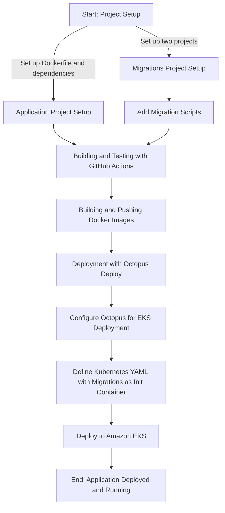
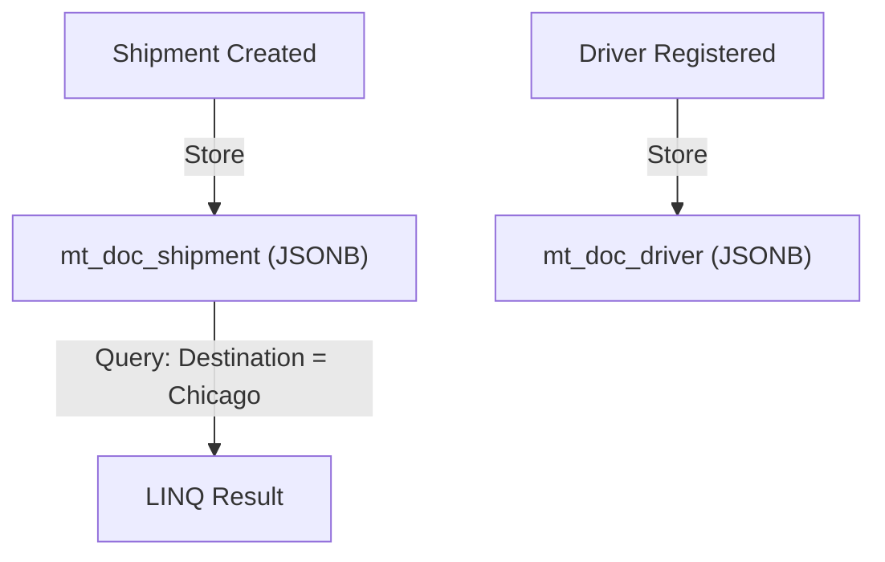
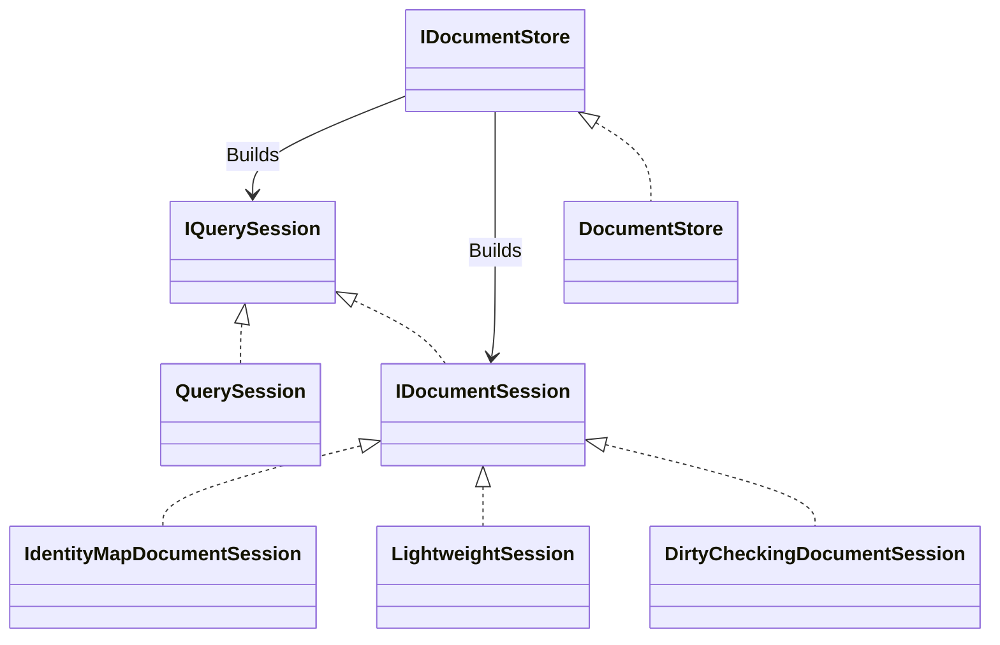
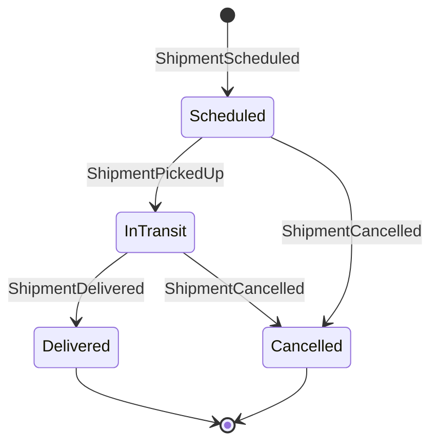
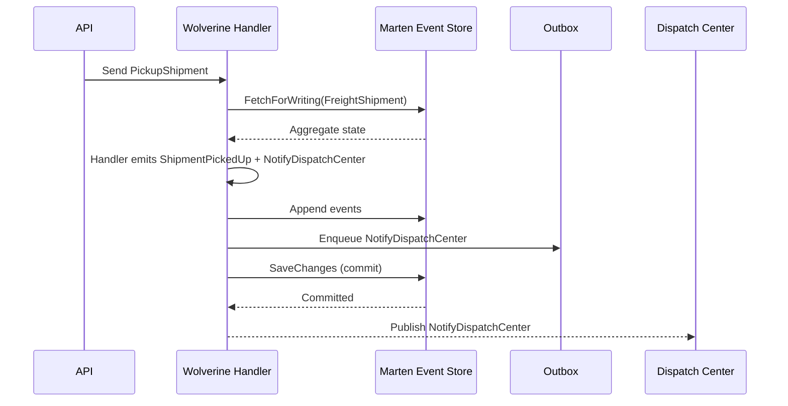
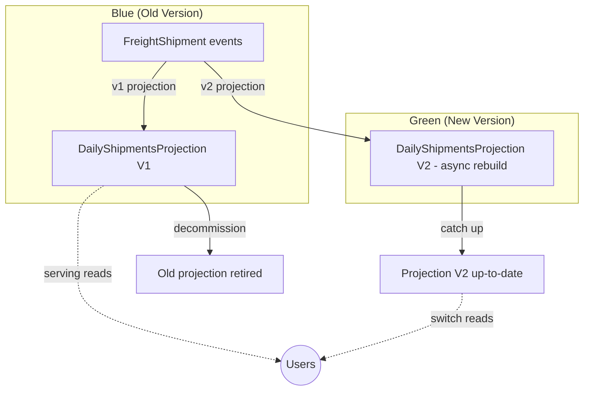

# Advanced querying with Postgresql SQL

Besides Linq queries or simple raw SQL queries via `session.Query<T>("where...")`, it is also possible to do even more complex SQL queries via `session.AdvancedSql.QueryAsync<T>()`.
With this method Marten does not try to add any missing parts to the SQL query, instead you have to provide the whole query string yourself.

Marten just makes some assumptions on how the schema of the SQl query result must look like, in order to be able to map the query result to documents, scalars or other JSON serializable types.
With `AdvancedSql.QueryAsync` / `AdvancedSql.Query` it is even possible to return multiple documents, objects and scalars as a tuple. Currently up to three result types can be queried for.

The following rules must be followed when doing queries with `AdvancedSql.QueryAsync` / `AdvancedSql.Query`:

* If a document should be returned, the SQL `SELECT` statement must contain all the columns required by Marten to build
  the document in the correct order. Which columns are needed depends on the session type and if any meta data are
  mapped to the document.
* When having multiple return types, the columns required for each type must be enclosed in a SQL `ROW` statement.
* For non-document types the column `data` must return the JSON that will be deserialized to this type.

For document types the correct order of columns in the result is:

1. `id` - must always be present, except for `QuerySession`
2. `data` - must always be present
3. `mt_doc_type` - must be present only with document hierarchies
4. `mt_version` - only when versioning is enabled
5. `mt_last_modified` - only if this metadata is enabled
6. `mt_created_at` - only if this metadata is enabled
7. `correlation_id` - only if this metadata is enabled
8. `causation_id` - only if this metadata is enabled
9. `last_modified_by` - only if this metadata is enabled
10. `mt_deleted` - only if this metadata is enabled
11. `mt_deleted_at` - only if this metadata is enabled

You can always check the correct result column order, by inspecting the command text created from a Linq query: `var commandText = session.Query<T>().ToCommand().CommandText;`

Querying for a simple scalar value can be done like this:

```cs
var schema = session.DocumentStore.Options.Schema;
var name = (await session.AdvancedSql.QueryAsync<string>(
    $"select data ->> 'Name' from {schema.For<DocWithMeta>()} limit 1",
    CancellationToken.None)).First();
```

snippet source | anchor

Or for multiple scalars returned as a tuple:

```cs
var (number,text, boolean) = (await session.AdvancedSql.QueryAsync<int, string, bool>(
    "select row(5), row('foo'), row(true) from (values(1)) as dummy",
    CancellationToken.None)).First();
```

snippet source | anchor

You can also query for any arbitrary JSON that will get deserialized:

```cs
var result = (await session.AdvancedSql.QueryAsync<Foo, Bar>(
    "select row(json_build_object('Name', 'foo')), row(json_build_object('Name', 'bar')) from (values(1)) as dummy",
    CancellationToken.None)).First();
```

snippet source | anchor

Querying for documents requires to return the correct columns:

```cs
var schema = session.DocumentStore.Options.Schema;
var docs = await session.AdvancedSql.QueryAsync<DocWithoutMeta>(
    $"select id, data from {schema.For<DocWithoutMeta>()} order by data ->> 'Name'",
    CancellationToken.None);
```

snippet source | anchor

If metadata are available, remember to add the correct metadata columns to the result. The order of the columns is
important!:

```cs
var schema = session.DocumentStore.Options.Schema;
var doc = (await session.AdvancedSql.QueryAsync<DocWithMeta>(
    $"select id, data, mt_version from {schema.For<DocWithMeta>()} where data ->> 'Name' = 'Max'",
    CancellationToken.None)).First();
```

snippet source | anchor

You can also query for multiple related documents and scalar, e.g. for paging:

```cs
session.Store(new DocWithMeta { Id = 1, Name = "Max" });
session.Store(new DocDetailsWithMeta { Id = 1, Detail = "Likes bees" });
session.Store(new DocWithMeta { Id = 2, Name = "Michael" });
session.Store(new DocDetailsWithMeta { Id = 2, Detail = "Is a good chess player" });
session.Store(new DocWithMeta { Id = 3, Name = "Anne" });
session.Store(new DocDetailsWithMeta { Id = 3, Detail = "Hates soap operas" });
session.Store(new DocWithMeta { Id = 4, Name = "Beatrix" });
session.Store(new DocDetailsWithMeta { Id = 4, Detail = "Likes to cook" });
await session.SaveChangesAsync();

var schema = session.DocumentStore.Options.Schema;
IReadOnlyList<(DocWithMeta doc, DocDetailsWithMeta detail, long totalResults)> results =
    await session.AdvancedSql.QueryAsync<DocWithMeta, DocDetailsWithMeta, long>(
        $"""
        select
          row(a.id, a.data, a.mt_version),
          row(b.id, b.data, b.mt_version),
          row(count(*) over())
        from
          {schema.For<DocWithMeta>()} a
        left join
          {schema.For<DocDetailsWithMeta>()} b on a.id = b.id
        where
          (a.data ->> 'Id')::int > 1
        order by
          a.data ->> 'Name'
        limit 2
        """,
        CancellationToken.None);

results.Count.ShouldBe(2);
results[0].totalResults.ShouldBe(3);
results[0].doc.Name.ShouldBe("Anne");
results[0].detail.Detail.ShouldBe("Hates soap operas");
results[1].doc.Name.ShouldBe("Beatrix");
results[1].detail.Detail.ShouldBe("Likes to cook");
```

snippet source | anchor

All `AdvancedSql` methods also support parameters:

```cs
var schema = theSession.DocumentStore.Options.Schema;

schema.DatabaseSchemaName.ShouldBe("public");
schema.EventsSchemaName.ShouldBe("public");
```

snippet source | anchor

For sync queries you can use the `AdvancedSql.Query<T>(...)` overloads.

When you need to query for large datasets, the `AdvancedSql.StreamAsync<>(...)` methods can be used. They will return
an IAsyncEnumerable<>, which you can use to iterate over the result set. See:

```cs
session.Store(new DocWithMeta { Id = 1, Name = "Max" });
session.Store(new DocDetailsWithMeta { Id = 1, Detail = "Likes bees" });
session.Store(new DocWithMeta { Id = 2, Name = "Michael" });
session.Store(new DocDetailsWithMeta { Id = 2, Detail = "Is a good chess player" });
session.Store(new DocWithMeta { Id = 3, Name = "Anne" });
session.Store(new DocDetailsWithMeta { Id = 3, Detail = "Hates soap operas" });
session.Store(new DocWithMeta { Id = 4, Name = "Beatrix" });
session.Store(new DocDetailsWithMeta { Id = 4, Detail = "Likes to cook" });
await session.SaveChangesAsync();

var schema = session.DocumentStore.Options.Schema;

var asyncEnumerable = session.AdvancedSql.StreamAsync<DocWithMeta, DocDetailsWithMeta, long>(
        $"""
        select
          row(a.id, a.data, a.mt_version),
          row(b.id, b.data, b.mt_version),
          row(count(*) over())
        from
          {schema.For<DocWithMeta>()} a
        left join
          {schema.For<DocDetailsWithMeta>()} b on a.id = b.id
        where
          (a.data ->> 'Id')::int > 1
        order by
          a.data ->> 'Name'
        """,
        CancellationToken.None);

var collectedResults = new List<(DocWithMeta doc, DocDetailsWithMeta detail, long totalResults)>();
await foreach (var result in asyncEnumerable)
{
    collectedResults.Add(result);
}
```

snippet source | anchor

Using this you can resolve schemas:

```cs
var schema = theSession.DocumentStore.Options.Schema;

schema.DatabaseSchemaName.ShouldBe("public");
schema.EventsSchemaName.ShouldBe("public");
```

snippet source | anchor

And documents/aggregates:

```cs
var schema = theSession.DocumentStore.Options.Schema;

schema.For<Account>().ShouldBe("public.mt_doc_account");
schema.For<Company>().ShouldBe("public.mt_doc_company");
schema.For<User>().ShouldBe("public.mt_doc_user");

// `qualified: false` returns the table name without schema
schema.For<Account>(qualified: false).ShouldBe("mt_doc_account");
schema.For<Company>(qualified: false).ShouldBe("mt_doc_company");
schema.For<User>(qualified: false).ShouldBe("mt_doc_user");
```

snippet source | anchor

And also marten event tables:

```cs
schema.ForStreams().ShouldBe("public.mt_streams");
schema.ForEvents().ShouldBe("public.mt_events");
schema.ForEventProgression().ShouldBe("public.mt_event_progression");

schema.ForStreams(qualified: false).ShouldBe("mt_streams");
schema.ForEvents(qualified: false).ShouldBe("mt_events");
schema.ForEventProgression(qualified: false).ShouldBe("mt_event_progression");
```

snippet source | anchor

---

---
url: /events/projections/aggregate-projections.md
---
# Aggregate Projections

*Aggregate Projections* in Marten combine some sort of grouping of events and process them to create a single
aggregated document representing the state of those events. These projections come in two flavors:

**Single Stream Projections** create a rolled up view of all or a segment of the events within a single event stream.
These projections are done either by using the `SingleStreamProjection<TDoc, TId>` base type or by creating a "self aggregating" `Snapshot`
approach with conventional `Create/Apply/ShouldDelete` methods that mutate or evolve the snapshot based on new events.

**Multi Stream Projections** create a rolled up view of a user-defined grouping of events across streams.
These projections are done by sub-classing the `MultiStreamProjection<TDoc, TId>` class and is further described in [Multi-Stream Projections](/events/projections/multi-stream-projections).
An example of a multi-stream projection might be a "query model" within an accounting system of some sort that rolls up
the value of all unpaid invoices by active client.

You can *also* use a `MultiStreamProjection` to create views that are a segment of a single stream over time or version.
Imagine that you have a system that models the activity of a bank account with event sourcing. You could use a `MultiStreamProjection` to create a view that summarizes the activity of a single bank account within a calendar month.

::: tip
The ability to use explicit code to define projections was hugely improved in the Marten 8.0 release.
:::

Within your aggregation projection, you can express the logic about how Marten combines events into a view
through either [conventional methods](/events/projections/conventions) (original, old school Marten) or through [completely explicit code](/events/projections/explicit).

Within an aggregation, you have advanced options to:

* Use event metadata
* Enrich event data with other Marten or external data
* Append all new events or send messages in response to projection updates with [side effects](/events/projections/side-effects)

## Simple Example

The most common usage is to create a "write model" that projects the current state
for a single stream, so on that note, let's jump into a simple example.

::: info
The original author of Marten is huge into epic fantasy book series, hence the silly original problem
domain in the very oldest code samples. Hilariously to him, Marten has fielded and accepted pull requests that
corrected our modeling of the timeline of the Lord of the Rings in sample code.
:::


Let's say that we're building a system to track the progress of a traveling party on a quest within an epic
fantasy series like "The Lord of the Rings" or the "Wheel of Time" and we're using event sourcing to capture
state changes when the "quest party" adds or subtracts members. We might very well need a "write model" for
the current state of the quest for our command handlers like this one:

```cs
public sealed record QuestParty(Guid Id, List<string> Members)
{
    // These methods take in events and update the QuestParty
    public static QuestParty Create(QuestStarted started) => new(started.QuestId, []);
    public static QuestParty Apply(MembersJoined joined, QuestParty party) =>
        party with
        {
            Members = party.Members.Union(joined.Members).ToList()
        };

    public static QuestParty Apply(MembersDeparted departed, QuestParty party) =>
        party with
        {
            Members = party.Members.Where(x => !departed.Members.Contains(x)).ToList()
        };

    public static QuestParty Apply(MembersEscaped escaped, QuestParty party) =>
        party with
        {
            Members = party.Members.Where(x => !escaped.Members.Contains(x)).ToList()
        };
}
```

snippet source | anchor

For a little more context, the `QuestParty` above might be consumed in a command handler like this:

```cs
public record AddMembers(Guid Id, int Day, string Location, string[] Members);

public static class AddMembersHandler
{
    public static async Task HandleAsync(AddMembers command, IDocumentSession session)
    {
        // Fetch the current state of the quest
        var quest = await session.Events.FetchForWriting<QuestParty>(command.Id);
        if (quest.Aggregate == null)
        {
            // Bad quest id, do nothing in this sample case
        }

        var newMembers = command.Members.Where(x => !quest.Aggregate.Members.Contains(x)).ToArray();

        if (!newMembers.Any())
        {
            return;
        }

        quest.AppendOne(new MembersJoined(command.Id, command.Day, command.Location, newMembers));
        await session.SaveChangesAsync();
    }
}
```

snippet source | anchor

## How Aggregation Works

::: tip
It's possible to build your own aggregation projections from scratch with the lower level `IProjection` abstraction --
and we've worked with plenty of folks who did over the years -- but just know that the Marten community has invested a lot
of effort over the years into optimizing the internals of the aggregation projections for performance and capability.
:::

::: info
When running with an `Inline` projection lifecycle, the workflow is mostly the same, but Marten can skip the "slicing"
step for single stream projections. By and large, the Marten team recommends almost always running multi-stream projections
asynchronously and probably running single stream projections that utilize enrichment asynchronously as well.
:::

Just to understand a little bit more about the capabilities of Marten's aggregation projections, let's look at the diagram
below that tries to visualize the runtime workflow of aggregation projections inside of the [Async Daemon](/events/projections/async-daemon) background
process:


1. The Daemon is constantly pushing a range of events at a time to an aggregation projection. For example, `Events 1,000 to 2,000 by sequence number`
2. The aggregation "slices" the incoming range of events into a group of `EventSlice` objects that establishes a relationship between the identity
   of an aggregated document and the events that should be applied during this batch of updates for that identity. To be more concrete, a single stream
   projection for `QuestParty` would be creating an `EventSlice` for each quest id it sees in the current range of events. Multi-stream projections
   will have some kind of custom "slicing" or grouping. For example, maybe in our `Quest` tracking system we have a multi-stream projection that
   tries to track how many monsters of each type are defeated. That projection might "slice" by looking for all `MonsterDefeated` events
   across all streams and group or slice incoming events by the type of monster. The "slicing" logic is automatic for [single stream projections](/events/projections/single-stream-projections), but will require
   explicit configuration or explicitly written logic for [multi stream projections](/events/projections/multi-stream-projections).
3. Once the projection has a known list of all the aggregate documents that will be updated by the current range of events, the projection will
   fetch each persisted document, first from any active aggregate cache in memory, then by making a single batched request to the
   Marten document storage for any missing documents and adding these to any active cache (see [Optimizing Performance](/events/optimizing) for more information about the potential caching).
4. The projection will execute any [event enrichment](/events/projections/enrichment) against the now known group of `EventSlice`. This process gives you a hook to
   efficiently "enrich" the raw event data with extra data lookups from Marten document storage or even other sources.
5. Most of the work as a developer is in the application or "Evolve" step of the diagram above. After the "slicing", the aggregation has turned the range of raw event data into
   `EventSlice` objects that contain the current snapshot of a projected document by its identity (if one exists), the identity itself, and the events from within that original range
   that should be applied on top of the current snapshot to "evolve" it to reflect those events. This can be coded either with the conventional [Apply/Create/ShouldDelete methods](/events/projections/conventions) or using [explicit code](/events/projections/explicit) --
   which is almost inevitably means a `switch` statement. Using the `QuestParty` example again, the aggregation projection would get an `EventSlice` that contains the identity of
   an active quest, the snapshot of the current `QuestParty` document that is persisted by Marten, and the new `MembersJoined` et al events that should be applied to the existing
   `QuestParty` object to derive the new version of `QuestParty`.
6. *Just* before Marten persists all the changes from the application / evolve step, you have the [`RaiseSideEffects()` hook](/events/projections/side-effects) to potentially raise "side effects" like
   appending additional events based on the now updated state of the projected aggregates or publishing the new state of an aggregate through messaging ([Wolverine](https://wolverinefx.net/guide/durability/marten/) has first class support for Marten projection side effects through its Marten integration into the full "Critter Stack")
7. For the current event range and event slices, Marten will send all aggregate document updates or deletions, new event appending operations, and even outboxed, outgoing messages sent via side effects
   (if you're using the Wolverine integration) in batches to the underlying PostgreSQL database. I'm calling this out because we've constantly found in
   Marten development that command batching to PostgreSQL is a huge factor in system performance and the async daemon has been designed to try to minimize the number of network round trips between your application and PostgreSQL at every turn.
8. Assuming the transaction succeeds for the current event range and the operation batch in the previous step, Marten will call "after commit" observers. This notification for example will
   release any messages raised as a side effect and actually send those messages via whatever is doing the actual publishing (probably Wolverine).

::: tip
Marten happily supports immutable data types for the aggregate documents produced by projections, but also happily supports
mutable types as well. The usage of the application code is a little different though.
:::

::: info
Starting with Marten 8.0, we've tried somewhat to conform to the terminology used by the [Functional Event Sourcing Decider](https://thinkbeforecoding.com/post/2021/12/17/functional-event-sourcing-decider) paper by Jeremie Chassaing. To that end, the API now refers to a "snapshot" that really just means *a* version of the projection and "evolve" as the step of applying new events to an existing "snapshot" to calculate a new "snapshot."
:::

## Aggregate Caching

See the content on aggregate caching in [Optimizing Performance](/events/optimizing).

## Strong Typed Identifiers&#x20;

::: info
The rise of Strong Typed Identifiers has not been the most pleasant experience for the Marten and
Wolverine teams as these types are "neither fish, nor fowl" in the way the internals have to constantly
wrap or unwrap these things. As the technical leader of Marten is of the Gen X cohort, Jeremy believes
[this movie scene](https://www.youtube.com/watch?v=350kq0anjq0) exactly encapsulates his feelings about the work we've had to do to support Strong Typed
Identifiers throughout the "Critter Stack."
:::

Marten supports using strong-typed identifiers as the document identity for aggregated documents. Here's an example:

```cs
[StronglyTypedId(Template.Guid)]
public readonly partial struct PaymentId;

public class Payment
{
    [JsonInclude] public PaymentId? Id { get; private set; }

    [JsonInclude] public DateTimeOffset CreatedAt { get; private set; }

    [JsonInclude] public PaymentState State { get; private set; }

    public static Payment Create(IEvent<PaymentCreated> @event)
    {
        return new Payment
        {
            Id = new PaymentId(@event.StreamId), CreatedAt = @event.Data.CreatedAt, State = PaymentState.Created
        };
    }

    public void Apply(PaymentCanceled @event)
    {
        State = PaymentState.Canceled;
    }

    public void Apply(PaymentVerified @event)
    {
        State = PaymentState.Verified;
    }
}
```

snippet source | anchor

Just note that for single stream aggregations, your strong typed identifier types will need to wrap either a `Guid` or
`string` depending on your application's `StreamIdentity`.

At this point, the `FetchForWriting` and `FetchForLatest` APIs do not directly support strongly typed identifiers and you
will have to just pass in the wrapped, primitive value like this:

```cs
private async Task use_fetch_for_writing_with_strong_typed_identifier(PaymentId id, IDocumentSession session)
{
    var stream = await session.Events.FetchForWriting<Payment>(id.Value);
}
```

snippet source | anchor

## Aggregate by Stream

See [Single Stream Projections and Snapshots](./single-stream-projections).

## Stream Aggregations

See [Single Stream Projections and Snapshots](./single-stream-projections).

## Using Event Metadata

You can incorporate the event metadata that Marten collects within the aggregation projection.

Read more about that in [Using Metadata](./using-metadata).

## Raising Events, Messages, or other Operations in Aggregation Projections&#x20;

See [Side Effects](./side-effects) for more information.

---

---
url: /scenarios/aggregates-events-repositories.md
---
# Aggregates, Events, Repositories

::: warning
This approach was popular years ago at the time that Marten was first released, but at this point the Marten team
strongly recommends against using the approach shown in this example. Our recommendation is to use some form of the
[Decider Pattern](https://thinkbeforecoding.com/post/2021/12/17/functional-event-sourcing-decider). Definitely see the
Wolverine [Aggregate Handler Workflow](https://wolverinefx.net/guide/durability/marten/event-sourcing.html) for a low ceremony approach to the "Decider" pattern with Marten.
:::

This use case demonstrates how to capture state changes in events and then replaying that state from the database. This is done by first introducing some supporting infrastructure, then implementing a model of invoice, together with invoice lines, on top of that.

## Scenario

To model, capture and replay the state of an object through events, some infrastructure is established to dispatch events to their respective handlers. This is demonstrated in the `AggregateBase` class below - it serves as the basis for objects whose state is to be modeled.

```cs
// Infrastructure to capture modifications to state in events
public abstract class AggregateBase
{
    // For indexing our event streams
    public string Id { get; protected set; }

    // For protecting the state, i.e. conflict prevention
    // The setter is only public for setting up test conditions
    public long Version { get; set; }

    // JsonIgnore - for making sure that it won't be stored in inline projection
    [JsonIgnore] private readonly List<object> _uncommittedEvents = new List<object>();

    // Get the deltas, i.e. events that make up the state, not yet persisted
    public IEnumerable<object> GetUncommittedEvents()
    {
        return _uncommittedEvents;
    }

    // Mark the deltas as persisted.
    public void ClearUncommittedEvents()
    {
        _uncommittedEvents.Clear();
    }

    protected void AddUncommittedEvent(object @event)
    {
        // add the event to the uncommitted list
        _uncommittedEvents.Add(@event);
    }
}
```

snippet source | anchor

With the first piece of infrastructure implemented, two events to capture state changes of an invoice are introduced. Namely, creation of an invoice, accompanied by an invoice number, and addition of lines to an invoice:

```cs
public sealed class InvoiceCreated
{
    public int InvoiceNumber { get; }

    public InvoiceCreated(int invoiceNumber)
    {
        InvoiceNumber = invoiceNumber;
    }
}

public sealed class LineItemAdded
{
    public decimal Price { get; }
    public decimal Vat { get; }
    public string Description { get; }

    public LineItemAdded(decimal price, decimal vat, string description)
    {
        Price = price;
        Vat = vat;
        Description = description;
    }
}
```

snippet source | anchor

With the events in place to present the deltas of an invoice, an aggregate is implemented, using the infrastructure presented above, to create and replay state from the described events.

```cs
public sealed class Invoice: AggregateBase
{
    public Invoice(int invoiceNumber)
    {
        if (invoiceNumber <= 0)
        {
            throw new ArgumentException("Invoice number needs to be positive", nameof(invoiceNumber));
        }

        // Instantiation creates our initial event, capturing the invoice number
        var @event = new InvoiceCreated(invoiceNumber);

        // Call Apply to mutate state of aggregate based on event
        Apply(@event);

        // Add the event to uncommitted events to use it while persisting the events to Marten events store
        AddUncommittedEvent(@event);
    }

    private Invoice()
    {
    }

    // Enforce any contracts on input, then raise event capturing the data
    public void AddLine(decimal price, decimal vat, string description)
    {
        if (string.IsNullOrEmpty(description))
        {
            throw new ArgumentException("Description cannot be empty", nameof(description));
        }

        var @event = new LineItemAdded(price, vat, description);

        // Call Apply to mutate state of aggregate based on event
        Apply(@event);

        // Add the event to uncommitted events to use it while persisting the events to Marten events store
        AddUncommittedEvent(@event);
    }

    public override string ToString()
    {
        var lineItems = string.Join(Environment.NewLine, lines.Select(x => $"{x.Item1}: {x.Item2} ({x.Item3}% VAT)"));
        return $"{lineItems}{Environment.NewLine}Total: {Total}";
    }

    public decimal Total { get; private set; }

    private readonly List<Tuple<string, decimal, decimal>> lines = new List<Tuple<string, decimal, decimal>>();

    // Apply the deltas to mutate our state
    private void Apply(InvoiceCreated @event)
    {
        Id = @event.InvoiceNumber.ToString(CultureInfo.InvariantCulture);

        // Ensure to update version on every Apply method.
        Version++;
    }

    // Apply the deltas to mutate our state
    private void Apply(LineItemAdded @event)
    {
        var price = @event.Price * (1 + @event.Vat / 100);
        Total += price;
        lines.Add(Tuple.Create(@event.Description, price, @event.Vat));

        // Ensure to update version on every Apply method.
        Version++;
    }
}
```

snippet source | anchor

The implemented invoice protects its state by not exposing mutable data, while enforcing its contracts through argument validation. Once an applicable state modification is introduced, either through the constructor (which numbers our invoice and captures that in an event) or the `Invoice.AddLine` method, a respective event capturing that data is recorded.

Lastly, to persist the deltas described above and to replay the state of an object from such persisted data, a repository is implemented. The said repository pushes the deltas of an object to event stream, indexed by the ID of the object.

```cs
public sealed class AggregateRepository
{
    private readonly IDocumentStore store;

    public AggregateRepository(IDocumentStore store)
    {
        this.store = store;
    }

    public async Task StoreAsync(AggregateBase aggregate, CancellationToken ct = default)
    {
        await using var session = await store.LightweightSerializableSessionAsync(token: ct);
        // Take non-persisted events, push them to the event stream, indexed by the aggregate ID
        var events = aggregate.GetUncommittedEvents().ToArray();
        session.Events.Append(aggregate.Id, aggregate.Version, events);
        await session.SaveChangesAsync(ct);
        // Once successfully persisted, clear events from list of uncommitted events
        aggregate.ClearUncommittedEvents();
    }

    public async Task<T> LoadAsync<T>(
        string id,
        int? version = null,
        CancellationToken ct = default
    ) where T : AggregateBase
    {
        await using var session = await store.LightweightSerializableSessionAsync(token: ct);
        var aggregate = await session.Events.AggregateStreamAsync<T>(id, version ?? 0, token: ct);
        return aggregate ?? throw new InvalidOperationException($"No aggregate by id {id}.");
    }
}
```

snippet source | anchor

With the last infrastructure component in place, versioned invoices can now be created, persisted and hydrated through Marten. For this purpose, first an invoice is created:

```cs
var invoice = new Invoice(42);

invoice.AddLine(100, 24, "Joo Janta 200 Super-Chromatic Peril Sensitive Sunglasses");
invoice.AddLine(200, 16, "Happy Vertical People Transporter");
```

snippet source | anchor

Then, with an instantiated & configured Document Store (in this case with string as event stream identity) a repository is bootstrapped. The newly created invoice is then passed to the repository, which pushes the deltas to the database and clears them from the to-be-committed list of changes. Once persisted, the invoice data is replayed from the database and verified to match the data of the original item.

```cs
var repository = new AggregateRepository(theStore);

await repository.StoreAsync(invoice);

var invoiceFromRepository = await repository.LoadAsync<Invoice>(invoice.Id);

Assert.Equal(invoice.ToString(), invoiceFromRepository.ToString());
Assert.Equal(invoice.Total, invoiceFromRepository.Total);
```

snippet source | anchor

With this infrastructure in place and the ability to model change as events, it is also possible to replay back any previous state of the object. For example, it is possible to see what the invoice looked with only the first line added:

```cs
var invoiceFromRepository = await repository.LoadAsync<Invoice>(invoice.Id, 2);

Assert.Equal(124, invoiceFromRepository.Total);
```

snippet source | anchor

Lastly, to prevent our invoice from getting into a conflicted state, the version attribute of the item is used to assert that the state of the object has not changed between replaying its state and introducing new deltas:

```cs
var invoice = CreateInvoice();
var invoiceWithSameIdentity = CreateInvoice();

await repository.StoreAsync(invoice);

await Assert.ThrowsAsync<EventStreamUnexpectedMaxEventIdException>(() =>
    repository.StoreAsync(invoiceWithSameIdentity)
);
```

snippet source | anchor

---

---
url: /events/projections/conventions.md
---
# Aggregation with Conventional Methods

## Aggregate Creation

::: tip
As of Marten 7, if your aggregation projection has both a `Create()` function or constructor for an event type, and
an `Apply()` method for the same event type, Marten will only call one or the other method depending on whether the
aggregate already exists **but never both** for one single event.
:::

Aggregates can initially be created behind the scenes by Marten if there's a no-arg constructor function on the aggregate
document type -- which doesn't have to be public by the way.

You can also use a constructor that takes an event type as shown in this sample of a `Trip` stream aggregation:

```cs
public class Trip
{
    // Probably safest to have an empty, default
    // constructor unless you can guarantee that
    // a certain event type will always be first in
    // the event stream
    public Trip()
    {
    }

    // Create a new aggregate based on the initial
    // event type
    internal Trip(TripStarted started)
    {
        StartedOn = started.Day;
        Active = true;
    }

    public Guid Id { get; set; }
    public int EndedOn { get; set; }

    public double Traveled { get; set; }

    public string State { get; set; }

    public bool Active { get; set; }

    public int StartedOn { get; set; }
    public Guid? RepairShopId { get; set; }

    // The Apply() methods would mutate the aggregate state
    internal void Apply(Arrival e) => State = e.State;
    internal void Apply(Travel e) => Traveled += e.TotalDistance();

    internal void Apply(TripEnded e)
    {
        Active = false;
        EndedOn = e.Day;
    }

    // We think stream aggregation is mostly useful for live aggregations,
    // but hey, if you want to use a aggregation as an asynchronous projection,
    // you can also specify when the aggregate document should be deleted
    internal bool ShouldDelete(TripAborted e) => true;
    internal bool ShouldDelete(Breakdown e) => e.IsCritical;
    internal bool ShouldDelete(VacationOver e) => Traveled > 1000;
}
```

snippet source | anchor

Or finally, you can use a method named `Create()` on a projection type as shown in this sample:

```cs
public class TripProjection: SingleStreamProjection<Trip, Guid>
{
    public TripProjection()
    {
        DeleteEvent<TripAborted>();

        DeleteEvent<Breakdown>(x => x.IsCritical);

        DeleteEvent<VacationOver>((trip, _) => trip.Traveled > 1000);
    }

    // These methods can be either public, internal, or private but there's
    // a small performance gain to making them public
    public void Apply(Arrival e, Trip trip) => trip.State = e.State;

    public void Apply(Travel e, Trip trip)
    {
        Debug.WriteLine($"Trip {trip.Id} Traveled " + e.TotalDistance());
        trip.Traveled += e.TotalDistance();
        Debug.WriteLine("New total distance is " + e.TotalDistance());
    }

    public void Apply(TripEnded e, Trip trip)
    {
        trip.Active = false;
        trip.EndedOn = e.Day;
    }

    public Trip Create(IEvent<TripStarted> started)
    {
        return new Trip { Id = started.StreamId, StartedOn = started.Data.Day, Active = true };
    }
}
```

snippet source | anchor

The `Create()` method has to return either the aggregate document type or `Task<T>` where `T` is the aggregate document type. There must be an argument for the specific event type or `IEvent<T>` where `T` is the event type if you need access to event metadata. You can also take in an `IQuerySession` if you need to look up additional data as part of the transformation or `IEvent` in addition to the exact event type just to get at event metadata.

## Applying Changes to the Aggregate Document

::: tip
`Apply()` methods or `ProjectEvent<T>()` method calls can also use interfaces or abstract types that are implemented by specific event types, and
Marten will apply all those event types that can be cast to the interface or abstract type to that method when executing the projection.
:::

To make changes to an existing aggregate, you can either use inline Lambda functions per event type with one of the overloads of `ProjectEvent()`:

```cs
public class TripProjection: SingleStreamProjection<Trip, Guid>
{
    public TripProjection()
    {
        ProjectEvent<Arrival>((trip, e) => trip.State = e.State);
        ProjectEvent<Travel>((trip, e) => trip.Traveled += e.TotalDistance());
        ProjectEvent<TripEnded>((trip, e) =>
        {
            trip.Active = false;
            trip.EndedOn = e.Day;
        });

        ProjectEventAsync<Breakdown>(async (session, trip, e) =>
        {
            var repairShop = await session.Query<RepairShop>()
                .Where(x => x.State == trip.State)
                .FirstOrDefaultAsync();

            trip.RepairShopId = repairShop?.Id;
        });
    }
}
```

snippet source | anchor

I'm not personally that wild about using lots of inline Lambdas like the example above, and to that end, Marten now supports the `Apply()` method convention. Here's the same `TripProjection`, but this time using methods to mutate the `Trip` document:

```cs
public class TripProjection: SingleStreamProjection<Trip, Guid>
{
    public TripProjection()
    {
        DeleteEvent<TripAborted>();

        DeleteEvent<Breakdown>(x => x.IsCritical);

        DeleteEvent<VacationOver>((trip, _) => trip.Traveled > 1000);
    }

    // These methods can be either public, internal, or private but there's
    // a small performance gain to making them public
    public void Apply(Arrival e, Trip trip) => trip.State = e.State;

    public void Apply(Travel e, Trip trip)
    {
        Debug.WriteLine($"Trip {trip.Id} Traveled " + e.TotalDistance());
        trip.Traveled += e.TotalDistance();
        Debug.WriteLine("New total distance is " + e.TotalDistance());
    }

    public void Apply(TripEnded e, Trip trip)
    {
        trip.Active = false;
        trip.EndedOn = e.Day;
    }

    public Trip Create(IEvent<TripStarted> started)
    {
        return new Trip { Id = started.StreamId, StartedOn = started.Data.Day, Active = true };
    }
}
```

snippet source | anchor

The `Apply()` methods can accept any combination of these arguments:

1. The actual event type
2. `IEvent<T>` where the `T` is the actual event type. Use this if you want access to the [event metadata](/events/metadata) like versions or timestamps.
3. `IEvent` access the event metadata. It's perfectly valid to accept both `IEvent` for the metadata and the specific event type just out of convenience.
4. `IQuerySession` if you need to do additional data lookups
5. The aggregate type

The valid return types are:

1. `void` if you are mutating the aggregate document
2. The aggregate type itself, and this allows you to use immutable aggregate types
3. `Task` if you are mutating the aggregate document with the use of external data read through `IQuerySession`
4. `Task<T>` where `T` is the aggregate type. This allows you to use immutable aggregate types while also using external data read through `IQuerySession`

## Deleting the Aggregate Document

In asynchronous or inline projections, receiving a certain event may signal that the projected document is now obsolete and should be deleted from
document storage. If a certain event type always signals a deletion to the aggregated view, you can use this mechanism inside of the constructor function of your
aggregate projection type:

```cs
public class TripProjection: SingleStreamProjection<Trip, Guid>
{
    public TripProjection()
    {
        // The current Trip aggregate would be deleted if
        // the projection encountered a TripAborted event
        DeleteEvent<TripAborted>();
    }
}
```

snippet source | anchor

If the deletion of the aggregate document needs to be done by testing some combination of the current aggregate state, the event,
and maybe even other document state in your Marten database, you can use more overloads of `DeleteEvent()` as shown below:

```cs
public class TripProjection: SingleStreamProjection<Trip, Guid>
{
    public TripProjection()
    {
        // The current Trip aggregate would be deleted if
        // the Breakdown event is "critical"
        DeleteEvent<Breakdown>(x => x.IsCritical);

        // Alternatively, delete the aggregate if the trip
        // is currently in New Mexico and the breakdown is critical
        DeleteEvent<Breakdown>((trip, e) => e.IsCritical && trip.State == "New Mexico");

        DeleteEventAsync<Breakdown>(async (session, trip, e) =>
        {
            var anyRepairShopsInState = await session.Query<RepairShop>()
                .Where(x => x.State == trip.State)
                .AnyAsync();

            // Delete the trip if there are no repair shops in
            // the current state
            return !anyRepairShopsInState;
        });
    }
}
```

snippet source | anchor

Another option is to use a method convention with a method named `ShouldDelete()`, with this equivalent using the `ShouldDelete() : bool` method convention:

```cs
public class TripProjection: SingleStreamProjection<Trip, Guid>
{
    // The current Trip aggregate would be deleted if
    // the Breakdown event is "critical"
    public bool ShouldDelete(Breakdown breakdown) => breakdown.IsCritical;

    // Alternatively, delete the aggregate if the trip
    // is currently in New Mexico and the breakdown is critical
    public bool ShouldDelete(Trip trip, Breakdown breakdown)
        => breakdown.IsCritical && trip.State == "New Mexico";

    public async Task<bool> ShouldDelete(IQuerySession session, Trip trip, Breakdown breakdown)
    {
        var anyRepairShopsInState = await session.Query<RepairShop>()
            .Where(x => x.State == trip.State)
            .AnyAsync();

        // Delete the trip if there are no repair shops in
        // the current state
        return !anyRepairShopsInState;
    }
}
```

snippet source | anchor

The `ShouldDelete()` method can take any combination of these arguments:

1. The actual event type
2. `IEvent<T>` where the `T` is the actual event type. Use this if you want access to the [event metadata](/events/metadata) like versions or timestamps.
3. `IQuerySession` if you need to do additional data lookups
4. The aggregate type

Additionally, `ShouldDelete()` methods should return either a `Boolean` or `Task<Boolean>` if doing data lookups with `IQuerySession` -- and we'very strongly recommend using strictly asynchronous APIs if running the projection asynchronously or using `SaveChangesAsync()` when executing projections inline.

---

---
url: /events/projections/explicit.md
---
# Aggregation with Explicit Code

A major goal of Marten 8.0 was to improve our user's ability to utilize explicit code for defining projection
"evolve" logic. Sometimes because users disliked the conventional method approach, but also because the conventional
approach breaks down with complicated workflows like projection data that is soft-deleted, but maybe "un-deleted" in
a reentrant workflow.

Inside of both `SingleStreamProjection<TDoc, TId>` and `MultiStreamProjection<TDoc, TId>`, you can choose to use explicit
code by overriding *one and only one* of these methods:

1. `Evolve` -- simple workflows where all you ever do is create, update, or delete projected views with just the event data
2. `EvolveAsync` -- `Evolve`, but with the ability to look up extra data with `IQuerySession`
3. `DetermineAction` -- more complex workflows where you might have reentrant states or utilize [soft deletes](/documents/deletes) for the persisted projection data
4. `DetermineActionAsync` -- `DetermineAction`, but with access to `IQuerySession` for extra data look ups during projection

The simplest and most common usage is to override the synchronous `Evolve` method that can update a projected document
through only the event data:

```cs
public class AppointmentProjection: SingleStreamProjection<Appointment, Guid>
{
    public AppointmentProjection()
    {
        // Make sure this is turned on!
        Options.CacheLimitPerTenant = 1000;
    }

    public override Appointment Evolve(Appointment snapshot, Guid id, IEvent e)
    {
        switch (e.Data)
        {
            case AppointmentRequested requested:
                snapshot = new Appointment()
                {
                    Status = AppointmentStatus.Requested,
                    Requirement = new Licensing(requested.SpecialtyCode, requested.StateCode),
                    PatientId = requested.PatientId,
                    Created = e.Timestamp,
                    SpecialtyCode = requested.SpecialtyCode
                };
                break;

            case AppointmentRouted routed:
                snapshot.BoardId = routed.BoardId;
                break;

            case ProviderAssigned assigned:
                snapshot.ProviderId = assigned.ProviderId;
                break;

            case AppointmentEstimated estimated:
                snapshot.Status = AppointmentStatus.Scheduled;
                snapshot.EstimatedTime = estimated.Time;
                break;

            case AppointmentStarted:
                snapshot.Status = AppointmentStatus.Started;
                snapshot.Started = e.Timestamp;
                break;

            case AppointmentCompleted:
                snapshot.Status = AppointmentStatus.Completed;
                snapshot.Completed = e.Timestamp;
                break;
        }

        return snapshot;
    }
}
```

snippet source | anchor

If your "evolve" step will require some data lookups or need to utilize any kind of asynchronous service, use
`EvolveAsync`:

```cs
public override ValueTask<LetterCounts> EvolveAsync(LetterCounts snapshot, Guid id, IQuerySession session, IEvent e, CancellationToken cancellation)
{
    // THIS projection isn't doing anything here, but you *could* use IQuerySession
    switch (e.Data)
    {
        case AEvent _:
            snapshot.ACount++;
            break;

        case BEvent _:
            snapshot.BCount++;
            break;

        case CEvent _:
            snapshot.CCount++;
            break;

        case DEvent _:
            snapshot.DCount++;
            break;
    }

    return new ValueTask<LetterCounts>(snapshot);
}
```

snippet source | anchor

`Evolve` and `EvolveAsync` work by taking in a the current snapshot of the projected document and a single event, then
returning the updated version of the projected document -- or returning `null` to tell Marten to delete the projected
document.

Now, if you need a more complicated workflow, use the `DetermineAction` or `DetermineActionAsync()` methods that let
you work with all the events and the incoming version of the projected document, and return to Marten a tuple
telling Marten *what* to do next and what the updated version of the projection should be.

Here's one example from the tests that was meant to test our ability to model reentrant workflows with soft-deleted projection
data (because users have absolutely wanted to do that over the years):

```cs
public class StartAndStopProjection: SingleStreamProjection<StartAndStopAggregate, Guid>
{
    public StartAndStopProjection()
    {
        // This is an optional, but potentially important optimization
        // for the async daemon so that it sets up an allow list
        // of the event types that will be run through this projection
        IncludeType<Start>();
        IncludeType<End>();
        IncludeType<Restart>();
        IncludeType<Increment>();
    }

    public override (StartAndStopAggregate?, ActionType) DetermineAction(StartAndStopAggregate? snapshot, Guid identity,
        IReadOnlyList<IEvent> events)
    {
        var actionType = ActionType.Store;

        if (snapshot == null && events.HasNoEventsOfType<Start>())
        {
            return (snapshot, ActionType.Nothing);
        }

        var eventData = events.ToQueueOfEventData();
        while (eventData.Any())
        {
            var data = eventData.Dequeue();
            switch (data)
            {
                case Start:
                    snapshot = new StartAndStopAggregate
                    {
                        // Have to assign the identity ourselves
                        Id = identity
                    };
                    break;

                case Increment when snapshot is { Deleted: false }:

                    if (actionType == ActionType.StoreThenSoftDelete)
                        continue;

                    // Use explicit code to only apply this event
                    // if the snapshot already exists
                    snapshot.Increment();
                    break;

                case End when snapshot is { Deleted: false }:
                    // This will be a "soft delete" because the snapshot type
                    // implements the IDeleted interface
                    snapshot.Deleted = true;
                    actionType = ActionType.StoreThenSoftDelete;
                    break;

                case Restart when snapshot == null || snapshot.Deleted:
                    // Got to "undo" the soft delete status
                    actionType = ActionType.UnDeleteAndStore;
                    snapshot.Deleted = false;
                    break;
            }
        }

        return (snapshot, actionType);
    }

}
```

snippet source | anchor

and another example:

```cs
public class HardDeletedStartAndStopProjection: SingleStreamProjection<HardDeletedStartAndStopAggregate, Guid>
{
    public HardDeletedStartAndStopProjection()
    {
        // This is an optional, but potentially important optimization
        // for the async daemon so that it sets up an allow list
        // of the event types that will be run through this projection
        IncludeType<Start>();
        IncludeType<End>();
        IncludeType<Restart>();
        IncludeType<Increment>();
    }

    public override (HardDeletedStartAndStopAggregate?, ActionType) DetermineAction(HardDeletedStartAndStopAggregate? snapshot, Guid identity,
        IReadOnlyList<IEvent> events)
    {
        var actionType = ActionType.Store;

        if (snapshot == null && events.HasNoEventsOfType<Start>())
        {
            return (snapshot, ActionType.Nothing);
        }

        var eventData = events.ToQueueOfEventData();
        while (eventData.Any())
        {
            var data = eventData.Dequeue();
            switch (data)
            {
                case Start:
                    snapshot = new HardDeletedStartAndStopAggregate
                    {
                        // Have to assign the identity ourselves
                        Id = identity
                    };
                    break;

                case Increment when snapshot is { }:
                    // Use explicit code to only apply this event
                    // if the snapshot already exists
                    snapshot.Increment();
                    break;

                case End when snapshot is {}:
                    actionType = ActionType.HardDelete;
                    snapshot = null;
                    break;

                case Restart when snapshot == null:
                    // Got to "undo" the soft delete status
                    actionType = ActionType.Store;
                    snapshot = new HardDeletedStartAndStopAggregate { Id = identity };
                    break;
            }
        }

        return (snapshot, actionType);
    }

}
```

snippet source | anchor

---

---
url: /events/appending.md
---
# Appending Events

::: tip
For CQRS style command handlers that append events to an existing event stream, the Marten team very
strongly recommends the [FetchForWriting](/scenarios/command_handler_workflow) API. This API is used underneath
the Wolverine [Aggregate Handler Workflow](https://wolverinefx.net/guide/durability/marten/event-sourcing.html) that is probably the very simplest possible way to build command handlers
with Marten event sourcing today.
:::

With Marten, events are captured and appended to logical "streams" of events. Marten provides
methods to create a new stream with the initial events, append events to an existing stream, and
also to append events with some protection for concurrent access to single streams.

The event data is persisted to two tables:

1. `mt_events` -- stores the actual event data and some metadata that describes the event
2. `mt_streams` -- stores information about the current state of an event stream. There is a foreign key
   relationship from `mt_events` to `mt_streams`

Events can be captured by either starting a new stream or by appending events to an existing stream. In addition, Marten has some tricks up its sleeve for dealing
with concurrency issues that may result from multiple transactions trying to simultaneously append events to the same stream.

## "Rich" vs "Quick" Appends&#x20;

::: tip
Long story short, the new "Quick" model appears to provide much better performance and scalability.
:::

Before diving into starting new event streams or appending events to existing streams, just know that there are two different
modes of event appending you can use with Marten:

```cs
var builder = Host.CreateApplicationBuilder();
builder.Services.AddMarten(opts =>
    {
        // This is the default Marten behavior from 4.0 on
        opts.Events.AppendMode = EventAppendMode.Rich;

        // Lighter weight mode that should result in better
        // performance, but with a loss of available metadata
        // within inline projections
        opts.Events.AppendMode = EventAppendMode.Quick;
    })
    .UseNpgsqlDataSource();
```

snippet source | anchor

The classic `Rich` mode will append events in a two step process where the local session will first determine all possible
metadata for the events about to be appended such that inline projections can use event versions and the global event sequence
numbers at the time that the inline projections are created.

::: warning
If you are using `Inline` projections with the "Quick" mode, just be aware that you will not have access to the final
event sequence or stream version at the time the projections are built. Marten *is* able to set the stream version into
a single stream projection document built `Inline`, but that's done on the server side. Just be warned.
:::

The newer `Quick` mode eschews version and sequence metadata in favor of performing the event append and stream creation
operations with minimal overhead. The improved performance comes at the cost of not having the `IEvent.Version` and `IEvent.Sequence`
information available at the time that inline projections are executed.

From initial load testing, the "Quick" mode appears to lead to a 40-50% time reduction Marten's process of appending
events. Your results will vary of course. Maybe more importantly, the "Quick" mode seems to make a large positive
in the functioning of the asynchronous projections and subscriptions by preventing the event "skipping" issue that
can happen with the "Rich" mode when a system becomes slow under heavy loads. Lastly, the Marten team believes that the
"Quick" mode can alleviate concurrency issues from trying to append events to the same stream without utilizing optimistic
or exclusive locking on the stream.

If using inline projections for a single stream (`SingleStreamProjection` or *snapshots*) and the `Quick` mode, the Marten team
highly recommends using the `IRevisioned` interface on your projected aggregate documents so that Marten can "move" the version
set by the database operations to the version of the projected documents loaded from the database later. Mapping a custom member
to the `Revision` metadata will work as well.

## Starting a new Stream

You can **optionally** start a new event stream against some kind of .Net type that theoretically marks the type of stream you're capturing.
Marten does not yet use this type as anything more than metadata, but our thought is that some projections would key off this information and in a future version use that aggregate type to perform versioned snapshots of the entire stream. We may also make the aggregate type optional so that you could just supply either a string to mark the "stream type" or work without a stream type.

As usual, our sample problem domain is the Lord of the Rings style "Quest." For now, you can either start a new stream and let Marten assign the Guid id for the stream:

```cs
public async Task start_stream_with_guid_stream_identifiers(IDocumentSession session)
{
    var joined = new MembersJoined { Members = new[] { "Rand", "Matt", "Perrin", "Thom" } };
    var departed = new MembersDeparted { Members = new[] { "Thom" } };

    // Let Marten assign a new Stream Id, and mark the stream with an aggregate type
    // 'Quest'
    var streamId1 = session.Events.StartStream<Quest>(joined, departed).Id;

    // Or pass the aggregate type in without generics
    var streamId2 = session.Events.StartStream(typeof(Quest), joined, departed);

    // Or instead, you tell Marten what the stream id should be
    var userDefinedStreamId = Guid.NewGuid();
    session.Events.StartStream<Quest>(userDefinedStreamId, joined, departed);

    // Or pass the aggregate type in without generics
    session.Events.StartStream(typeof(Quest), userDefinedStreamId, joined, departed);

    // Or forget about the aggregate type whatsoever
    var streamId4 = session.Events.StartStream(joined, departed);

    // Or start with a known stream id and no aggregate type
    session.Events.StartStream(userDefinedStreamId, joined, departed);

    // And persist the new stream of course
    await session.SaveChangesAsync();
}
```

snippet source | anchor

For stream identity (strings vs. Guids), see [event store configuration](/events/configuration).

Note that `StartStream` checks for an existing stream and throws `ExistingStreamIdCollisionException` if a matching stream already exists.

## Appending Events

::: tip
`AppendEvent()` will create a new stream for the stream id if it does not already exist at the time that `IDocumentSession.SaveChanges()` is called.
:::

If you have an existing stream, you can later append additional events with `IEventStore.Append()` as shown below:

```cs
var joined = new MembersJoined { Members = new[] { "Rand", "Matt", "Perrin", "Thom" } };
var departed = new MembersDeparted { Members = new[] { "Thom" } };

session.Events.Append(id, joined, departed);

await session.SaveChangesAsync();
```

snippet source | anchor

## Mandatory Stream Types&#x20;

::: warning
Absolutely use this flag on new development work or when you want to take advantage of the optimized projection rebuilds
introduced in Marten 7.30, but be aware of the consequences outlined in this section.
:::

The default behavior in Marten is to allow you to happily start event streams without a stream type marker (the "T" in `StartStream<T>()`),
but in some cases there are optimizations that Marten can do for performance if it can assume the stream type marker
is present in the database:

* The optimized single stream projection rebuilds
* Specifying event filtering on a projection running asynchronously where Marten cannot derive the event types itself --
  like you'd frequently encounter with projections using explicit code instead of the aggregation method conventions

To make the stream type markers mandatory, you can use this flag in the configuration:

```cs
var builder = Host.CreateApplicationBuilder();
builder.Services.AddMarten(opts =>
{
    opts.Connection(builder.Configuration.GetConnectionString("marten"));

    // Force users to supply a stream type on StartStream, and disallow
    // appending events if the stream does not already exist
    opts.Events.UseMandatoryStreamTypeDeclaration = true;
});
```

snippet source | anchor

This causes a couple side effects that **force stricter usage of Marten**:

1. Marten will throw a `StreamTypeMissingException` exception if you call a `StartStream()` overload that doesn't include the stream type
2. Marten will throw a `NonExistentStreamException` if you try to append events to a stream that does not already exist

## Optimistic Versioned Append

::: tip
This may not be very effective as it only helps you detect changes between calling `AppendOptimistic()`
and `SaveChangesAsync()`.
:::

You can also use the new `AppendOptimistic()` method to do optimistic concurrency with the event
stream version with an automatic stream version lookup like this:

```cs
public async Task append_optimistic(IDocumentSession session, Guid streamId, object[] events)
{
    // This is doing data access, so it's an async method
    await session.Events.AppendOptimistic(streamId, events);

    // Assume that there is other work happening right here...

    await session.SaveChangesAsync();
}
```

snippet source | anchor

## Serialized Access to the Stream

The `AppendExclusive()` method will actually reserve a database lock on the stream itself until the
`IDocumentSession` is saved or disposed. That usage is shown below:

```cs
public async Task append_exclusive(IDocumentSession session, Guid streamId)
{
    // You *could* pass in events here too, but doing this establishes a transaction
    // lock on the stream.
    await session.Events.AppendExclusive(streamId);

    var events = determineNewEvents(streamId);

    // The next call can just be Append()
    session.Events.Append(streamId, events);

    // This will commit the unit of work and release the
    // lock on the event stream
    await session.SaveChangesAsync();
}
```

snippet source | anchor

This usage will in effect serialize access to a single event stream.

## Tombstone Events

It's an imperfect world, and sometimes transactions involving Marten events will fail in process. That historically caused issues with Marten's asynchronous projection support when there were "gaps"
in the event store sequence due to failed transactions. Marten V4 introduced support for "tombstone" events where Marten tries to insert placeholder rows in the events table with the
event sequence numbers that failed in a Marten transaction. This is done strictly to improve the functioning of the [async daemon](/events/projections/async-daemon) that looks for gaps in the event sequence to "know" how
far it's safe to process asynchronous projections. If you see event rows in your database of type "tombstone", it's representative of failed transactions (maybe from optimistic concurrency violations,
transient network issues, timeouts, etc.).

Where this is not *yet* formal support in Marten's API surface for deleting "tombstone" events, it is
perfectly safe to delete tombstone events from your database:

* At any time if you do not use any asynchronous projections and do not use the async daemon at runtime
* Where the `seq_id` column value is less than the "high water mark" of the async daemon. You can find the "high water mark"
  value from the `mt_event_progression` table or through this API call:

```cs
public static async Task ShowDaemonDiagnostics(IDocumentStore store)
{
    // This will tell you the current progress of each known projection shard
    // according to the latest recorded mark in the database
    var allProgress = await store.Advanced.AllProjectionProgress();
    foreach (var state in allProgress) Console.WriteLine($"{state.ShardName} is at {state.Sequence}");

    // This will allow you to retrieve some basic statistics about the event store
    var stats = await store.Advanced.FetchEventStoreStatistics();
    Console.WriteLine($"The event store highest sequence is {stats.EventSequenceNumber}");

    // This will let you fetch the current shard state of a single projection shard,
    // but in this case we're looking for the daemon high water mark
    var daemonHighWaterMark = await store.Advanced.ProjectionProgressFor(new ShardName(ShardState.HighWaterMark));
    Console.WriteLine($"The daemon high water sequence mark is {daemonHighWaterMark}");
}
```

snippet source | anchor

---

---
url: /events/archiving.md
---
# Archiving Event Streams

Like most (all?) event stores, Marten is designed around the idea of the events being persisted to a single file, immutable
log of events. All the same though, there are going to be problem domains where certain event streams become obsolete. Maybe
because a workflow is completed, maybe through time based expiry rules, or maybe because a customer or user is removed
from the system. To help optimize Marten's event store usage, you can take advantage of the stream archiving to
mark events as archived on a stream by stream basis.

::: warning
You can obviously use pure SQL to modify the events persisted by Marten. While that might be valuable in some cases,
we urge you to be cautious about doing so.
:::

The impact of archiving an event stream is:

* In the "classic" usage of Marten, the relevant stream and event rows are marked with an `is_archived = TRUE`
* With the "opt in" table partitioning model for "hot/cold" storage described in the next section, the stream and event rows are
  moved to the archived partition tables for streams and events
* The [async daemon](/events/projections/async-daemon) subsystem process that processes projections and subscriptions in a background process automatically ignores
  archived events -- but that can be modified on a per projection/subscription basis
* Archived events are excluded by default from any event data queries through the LINQ support in Marten

To mark a stream as archived, it's just this syntax:

```cs
public async Task SampleArchive(IDocumentSession session, string streamId)
{
    session.Events.ArchiveStream(streamId);
    await session.SaveChangesAsync();
}
```

snippet source | anchor

As in all cases with an `IDocumentSession`, you need to call `SaveChanges()` to commit the
unit of work.

::: tip
At this point, you will also have to manually delete any projected aggregates based on the event streams being
archived if that is desirable
:::

The `mt_events` and `mt_streams` tables both have a boolean column named `is_archived`.

Archived events are filtered out of all event Linq queries by default. But of course, there's a way
to query for archived events with the `IsArchived` property of `IEvent` as shown below:

```cs
var events = await theSession.Events
    .QueryAllRawEvents()
    .Where(x => x.IsArchived)
    .ToListAsync();
```

snippet source | anchor

You can also query for all events both archived and not archived with `MaybeArchived()`
like so:

```cs
var events = await theSession.Events.QueryAllRawEvents()
    .Where(x => x.MaybeArchived()).ToListAsync();
```

snippet source | anchor

## Hot/Cold Storage Partitioning&#x20;

::: warning
This option will only be beneficial if you are being aggressive about marking obsolete, old, or expired event data
as archived.
:::

Want your system using Marten to scale and perform even better than it already does? If you're leveraging
event archiving in your application workflow, you can possibly derive some significant performance and scalability
improvements by opting into using PostgreSQL native table partitioning on the event and event stream data
to partition the "hot" (active) and "cold" (archived) events into separate partition tables.

The long and short of this option is that it keeps the active `mt_streams` and `mt_events` tables smaller, which pretty
well always results in better performance over time.

The simple flag for this option is:

```cs
var builder = Host.CreateApplicationBuilder();
builder.Services.AddMarten(opts =>
{
    opts.Connection("some connection string");

    // Turn on the PostgreSQL table partitioning for
    // hot/cold storage on archived events
    opts.Events.UseArchivedStreamPartitioning = true;
});
```

snippet source | anchor

::: warning
If you are turning this option on to an existing system, you may want to run the database schema migration script
by hand rather than trying to let Marten do it automatically. The data migration from non-partitioned to partitioned
will probably require system downtime because it actually has to copy the old table data, drop the old table, create the new
table, copy all the existing data from the temp table to the new partitioned table, and finally drop the temporary table.
:::

## Archived Event&#x20;

::: tip
The `Archived` type moved into the shared JasperFx.Events library for Marten 8.0.
:::

Marten has a built in event named `Archived` that can be appended to any event stream:

```cs
namespace JasperFx.Events;

/// <summary>
/// The presence of this event marks a stream as "archived" when it is processed
/// by a single stream projection of any sort
/// </summary>
public record Archived(string Reason);
```

When this event is appended to an event stream *and* that event is processed through any type of single stream projection
for that event stream (snapshot or what we used to call a "self-aggregate", `SingleStreamProjection`, or `CustomProjection` with the `AggregateByStream` option),
Marten will automatically mark that entire event stream as archived as part of processing the projection. This applies for
both `Inline` and `Async` execution of projections.

Let's try to make this concrete by building a simple order processing system that might include this
aggregate:

```cs
public class Item
{
    public string Name { get; set; }
    public bool Ready { get; set; }
}

public class Order
{
    // This would be the stream id
    public Guid Id { get; set; }

    // This is important, by Marten convention this would
    // be the
    public int Version { get; set; }

    public Order(OrderCreated created)
    {
        foreach (var item in created.Items)
        {
            Items[item.Name] = item;
        }
    }

    public void Apply(IEvent<OrderShipped> shipped) => Shipped = shipped.Timestamp;
    public void Apply(ItemReady ready) => Items[ready.Name].Ready = true;

    public DateTimeOffset? Shipped { get; private set; }

    public Dictionary<string, Item> Items { get; set; } = new();

    public bool IsReadyToShip()
    {
        return Shipped == null && Items.Values.All(x => x.Ready);
    }
}
```

snippet source | anchor

Next, let's say we're having the `Order` aggregate snapshotted so that it's updated every time new events
are captured like so:

```cs
var builder = Host.CreateApplicationBuilder();
builder.Services.AddMarten(opts =>
{
    opts.Connection("some connection string");

    // The Order aggregate is updated Inline inside the
    // same transaction as the events being appended
    opts.Projections.Snapshot<Order>(SnapshotLifecycle.Inline);

    // Opt into an optimization for the inline aggregates
    // used with FetchForWriting()
    opts.Projections.UseIdentityMapForAggregates = true;
})

// This is also a performance optimization in Marten to disable the
// identity map tracking overall in Marten sessions if you don't
// need that tracking at runtime
.UseLightweightSessions();
```

snippet source | anchor

Now, let's say as a way to keep our application performing as well as possible, we'd like to be aggressive about archiving
shipped orders to keep the "hot" event storage table small. One way we can do that is to append the `Archived` event
as part of processing a command to ship an order like so:

```cs
public static async Task HandleAsync(ShipOrder command, IDocumentSession session)
{
    var stream = await session.Events.FetchForWriting<Order>(command.OrderId);
    var order = stream.Aggregate;

    if (!order.Shipped.HasValue)
    {
        // Mark it as shipped
        stream.AppendOne(new OrderShipped());

        // But also, the order is done, so let's mark it as archived too!
        stream.AppendOne(new Archived("Shipped"));

        await session.SaveChangesAsync();
    }
}
```

snippet source | anchor

If an `Order` hasn't already shipped, one of the outcomes of that command handler executing is that the entire event stream
for the `Order` will be marked as archived.

::: info
This was originally conceived as a way to improve the Wolverine aggregate handler workflow usability while also encouraging
Marten users to take advantage of the event archiving feature.
:::

::: info
When an `Archived` event is appended to a stream (as described above), Marten will mark the entire event stream as archived once that event is processed.

As a result, asynchronous multi-stream projections will no longer process any other events from that stream, even if those events appear earlier in the sequence or were added in a different session and have not yet been processed.

If you rely on asynchronous multi-stream projections and need all events to be processed before archiving, you can work around this by either:

* Writing the `Archived` event as a side effect within your asynchronous projection, after all other events have been processed, or
* Delaying the archiving by publishing a scheduled or delayed message (for example, when using Marten together with Wolverine) that appends the `Archived` event after projection completion.

This ensures all prior events are fully projected before the stream is marked as archived.
:::

---

---
url: /events/projections/healthchecks.md
---
# Async Daemon HealthChecks

::: tip INFO
The healthcheck is available in the [Marten.AspNetCore](https://www.nuget.org/packages/Marten.AspNetCore) package.
:::

Marten supports a customizable [HealthChecks](https://learn.microsoft.com/en-us/aspnet/core/host-and-deploy/health-checks?view=aspnetcore-7.0).
This can be useful when running the async daemon in a containerized environment such as Kubernetes.
Especially if you experience `ProgressionProgressOutOfOrderException` errors in async projections.

The check will verify that no projection's progression lags more than `maxEventLag` behind the `HighWaterMark`.
The default `maxEventLag` is 100. Read more about events progression tracking and `HighWaterMark` in [Async Daemon documentation](/events/projections/async-daemon).

The `maxEventLag` setting controls how far behind the `HighWaterMark` any async projection is allowed to lag before it's considered unhealthy.
E.g. if the `HighWaterMark` is 1000 and an a system with 3 async projections `ProjA`, `ProjB` and `ProjC` are processed respectively to sequence number 899, 901 and 901 then the system will be considered unhealthy with a `maxEventLag` of 100 (1000 - 899 = 101), BUT healthy with a `mavEventLag` of 101 or higher.

::: tip INFO
The healthcheck will only be checked against `Async` projections
:::

## Example configuration:

```cs
// Add HealthCheck
Services.AddHealthChecks().AddMartenAsyncDaemonHealthCheck(maxEventLag: 500);

// Map HealthCheck Endpoint
app.MapHealthChecks("/health");
```

If you want to add some time toleration for the healthcheck, you may use additional parameter `maxSameLagTime`.
It treats as unhealthy projections same as described below, but ONLY IF the same projection lag remains for the given time.

### Example use case #1

Assuming that `maxEventLag` = `100` and `maxSameLagTime` = `TimeSpan.FromSeconds(30)`:

* `HighWaterMark` is 1000 and async projection was processed to sequence number 850 at 2024-02-07 01:30:00 -> 'Healthy'
* `HighWaterMark` is 1000 and async projection was processed to sequence number 850 at 2024-02-07 01:30:30 -> 'Unhealthy'

It's unhealthy, because the projection haven't progressed since last healthcheck and `maxSameLagTime` elapsed on the same sequence number.

### Example use case #2

Assuming that `maxEventLag` = `100` and `maxSameLagTime` = `TimeSpan.FromSeconds(30)`:

* `HighWaterMark` is 1000 and async projection was processed to sequence number 850 at 2024-02-07 01:30:00 -> 'Healthy'
* `HighWaterMark` is 1000 and async projection was processed to sequence number 851 at 2024-02-07 01:30:30 -> 'Healthy'

It's healthy, because the projection progressed since last healthcheck.

## Example configuration:

```cs
// Add HealthCheck
Services.AddHealthChecks().AddMartenAsyncDaemonHealthCheck(maxEventLag: 500, maxSameLagTime: TimeSpan.FromSeconds(30));

// Map HealthCheck Endpoint
app.MapHealthChecks("/health");
```

---

---
url: /events/projections/async-daemon.md
---
# Async Projections Daemon

The *Async Daemon* is the nickname for Marten's built in asynchronous projection processing engine. The current async daemon from Marten V4 on requires no other infrastructure
besides Postgresql and Marten itself. The daemon itself runs inside an [IHostedService](https://docs.microsoft.com/en-us/aspnet/core/fundamentals/host/hosted-services?view=aspnetcore-5.0\&tabs=visual-studio) implementation in your application. The **daemon is disabled by default**.

The *Async Daemon* will process events **in order** through all projections registered with an
asynchronous lifecycle.

First, some terminology:

* *Projection* -- a projected view defined by the `IProjection` interface and registered with Marten. See also [Projections](/events/projections/).
* *Projection Shard* -- a logical segment of events that are executed separately by the async daemon
* *High Water Mark* -- the furthest known event sequence that the daemon "knows" that all events with that sequence or lower can be safely processed in order by projections. The high water mark will frequently be a little behind the highest known event sequence number if outstanding gaps in the event sequence are detected.

There are only two basic things to configure the *Async Daemon*:

1. Register the projections that should run asynchronously
2. Set the `StoreOptions.AsyncMode` to either `Solo` or `HotCold` (more on what these options mean later in this page)

As an example, this configures the daemon to run in the current node with a single active projection:

```cs
var host = await Host.CreateDefaultBuilder()
    .ConfigureServices(services =>
    {
        services.AddMarten(opts =>
            {
                opts.Connection("some connection string");

                // Register any projections you need to run asynchronously
                opts.Projections.Add<TripProjectionWithCustomName>(ProjectionLifecycle.Async);
            })
            // Turn on the async daemon in "Solo" mode
            .AddAsyncDaemon(DaemonMode.Solo);
    })
    .StartAsync();
```

snippet source | anchor

Likewise, we can configure the daemon to run in *HotCold* mode like this:

```cs
var host = await Host.CreateDefaultBuilder()
    .ConfigureServices(services =>
    {
        services.AddMarten(opts =>
            {
                opts.Connection("some connection string");

                // Register any projections you need to run asynchronously
                opts.Projections.Add<TripProjectionWithCustomName>(ProjectionLifecycle.Async);
            })
            // Turn on the async daemon in "HotCold" mode
            // with built in leader election
            .AddAsyncDaemon(DaemonMode.HotCold);
    })
    .StartAsync();
```

snippet source | anchor

::: tip
If you are experiencing any level of "stale high water" detection or getting log messages about "event skipping" with
Marten, you want to at least consider switching to the [QuickAppend](https://martendb.io/events/appending.html#rich-vs-quick-appends) option. The `QuickAppend`
mode is faster, and is substantially less likely to lead to gaps in the event sequence which in turn helps the async daemon
run more smoothly.
:::

## How the Daemon Works


First off, in production usage, events should be continuously flowing into the event storage within a Marten-ized PostgreSQL
database. Part of the [Async Daemon](/events/projections/async-daemon) is a little agent that constantly watches your
database to now where the *high water mark* that means the highest assigned event sequence number where it's safe to
process asynchronous projections and subscriptions to. At the same time, the async daemon always knows what the current progression
by event sequence number is for each individual asynchronous projection. Assuming that the "high water mark" is higher than
the current progression point, the daemon

## Solo vs. HotCold

As of right now, the daemon can run as one of two modes:

1. *Solo* -- the daemon will be automatically started when the application is bootstrapped and all projections and projection shards will be started on that node. The assumption with Solo
   is that there is never more than one running system node for your application.
2. *HotCold* -- the daemon will use a built in [leader election](https://en.wikipedia.org/wiki/Leader_election) function individually for each
   projection on each tenant database and **ensure that each projection is running on exactly one running process**.

::: tip
When running in `HotCold` mode, Marten will monitor the Postgres advisory lock by running a `SELECT pg_catalog.pg_sleep(60)` query to detect if the database restarts or fails-over.
Without this monitoring, Marten will not be aware of the lock loss and multiple async daemons can start running concurrently across multiple nodes, causing application failure.

Some monitoring tools erroneously report this query as "load", however this query simply sleeps for 60 seconds and **does not** consume any database resources.
If this monitoring is undesirable for your scenario, you can opt-out by setting `options.Events.UseMonitoredAdvisoryLock` to false when configuring Marten.
:::

## Projection Distribution

If your Marten store is only using a single database, Marten will distribute projections by projection type. If your store is using
[separate databases for multi-tenancy](/configuration/multitenancy), the async daemon will group all projections for a single
database on the same executing node as a purposeful strategy to reduce the total number of connections to the databases.

::: tip
The built in capability of Marten to distribute projections is somewhat limited, and it's still likely that all projections
will end up running on the first process to start up. If your system requires better load distribution for increased scalability,
contact [JasperFx Software](https://jasperfx.net) about their "Critter Stack Pro" product.
:::

## Daemon Logging

The daemon logs through the standard .Net `ILogger` interface service registered in your application's underlying DI container. In the case of the daemon having to skip
"poison pill" events, you can see a record of this in the `DeadLetterEvent` storage in your database (the `mt_doc_deadletterevent` table) along with the exception. Use this to fix underlying issues
and be able to replay events later after the fix.

## PgBouncer

If you use Marten's async daemon feature *and* [PgBouncer](https://www.pgbouncer.org/), make sure you're aware of some
[Npgsql configuration settings](https://www.npgsql.org/doc/compatibility.html#pgbouncer) for best usage with Marten. Marten's
async daemon uses [PostgreSQL Advisory Locks](https://www.postgresql.org/docs/current/explicit-locking.html) to help distribute work across an application cluster, and PgBouncer can
throw off that functionality without the connection settings in the Npgsql documentation linked above.

::: tip
If you are also using [Wolverine](https://wolverinefx.net), its ability to [distribute Marten projections and subscriptions](https://wolverinefx.net/guide/durability/marten/distribution.html) does not depend on advisory
locks and also spreads work out more evenly through a cluster.
:::

## Error Handling

\*\*In all examples, `opts` is a `StoreOptions` object. Besides the basic [Polly error handling](/configuration/retries#resiliency-policies),
you have these three options to configure error handling within your system's usage of asynchronous projections:

```cs
using var host = await Host.CreateDefaultBuilder()
    .ConfigureServices(services =>
    {
        services.AddMarten(opts =>
            {
                // connection information...

                opts.Projections.Errors.SkipApplyErrors = true;
                opts.Projections.Errors.SkipSerializationErrors = true;
                opts.Projections.Errors.SkipUnknownEvents = true;

                opts.Projections.RebuildErrors.SkipApplyErrors = false;
                opts.Projections.RebuildErrors.SkipSerializationErrors = false;
                opts.Projections.RebuildErrors.SkipUnknownEvents = false;
            })
            .AddAsyncDaemon(DaemonMode.HotCold);
    }).StartAsync();
```

snippet source | anchor

| Option                    | Description                                                                                                                      | Continuous Default | Rebuild Default |
|---------------------------|----------------------------------------------------------------------------------------------------------------------------------|--------------------|-----------------|
| `SkipApplyErrors`         | Should errors that occur in projection code (i.e., not Marten or PostgreSQL related errors) be skipped during Daemon processing? | True               | False           |
| `SkipSerializationErrors` | Should errors from serialization or upcasters be ignored and that event skipped during processing?                               | True               | False           |
| `SkipUnknownEvents`       | Should unknown event types be skipped by the daemon?                                                                             | True               | False           |

In all cases, if a serialization, apply, or unknown error is encountered and Marten is not configured to skip that type of
error, the individual projection will be paused. In the case of projection rebuilds, this will immediately stop the rebuild
operation. By default, all of these errors are skipped during continuous processing and enforced during rebuilds.

::: tip
Skipping unknown event types is important for "blue/green" deployment of system changes where a new application version
introduces an entirely new event type.
:::

## Poison Event Detection

See the section on error handling. Poison event detection is a little more automatically integrated into Marten 7.0.

## Accessing the Executing Async Daemon

Marten supports access to the executing instance of the daemon for each database in your system.
You can use this approach to track progress or start or stop individual projections like so:

```cs
public static async Task accessing_the_daemon(IHost host)
{
    // This is a new service introduced by Marten 7.0 that
    // is automatically registered as a singleton in your
    // application by IServiceCollection.AddMarten()

    var coordinator = host.Services.GetRequiredService<IProjectionCoordinator>();

    // If targeting only a single database with Marten
    var daemon = coordinator.DaemonForMainDatabase();
    await daemon.StopAgentAsync("Trip:All");

    // If targeting multiple databases for multi-tenancy
    var daemon2 = await coordinator.DaemonForDatabase("tenant1");
    await daemon.StopAllAsync();
}
```

snippet source | anchor

## Testing Async Projections&#x20;

::: tip
This method works by polling the progress tables in the database, so it's usable regardless of where or how you've started
up the async daemon in your code.
:::

Asynchronous projections can be a little rough to test because of the timing issues (is the daemon finished with my new events yet?).
To that end, Marten introduced an extension method called `IDocumentStore.WaitForNonStaleProjectionDataAsync()` to help your tests "wait" until any asynchronous
projections are caught up to the latest events posted at the time of the call.

You can see the usage below from one of the Marten tests where we use that method to just wait until the running projection
daemon has caught up:

```cs
[Fact]
public async Task run_simultaneously()
{
    StoreOptions(x => x.Projections.Add(new DistanceProjection(), ProjectionLifecycle.Async));

    NumberOfStreams = 10;

    var agent = await StartDaemon();

    // This method publishes a random number of events
    await PublishSingleThreaded();

    // Wait for all projections to reach the highest event sequence point
    // as of the time this method is called
    await theStore.WaitForNonStaleProjectionDataAsync(15.Seconds());

    await CheckExpectedResults();
}
```

snippet source | anchor

The basic idea in your tests is to:

1. Start the async daemon running continuously
2. Set up your desired system state by appending events as the test input
3. Call the `WaitForNonStaleProjectionDataAsync()` method **before** checking the expected outcomes of the test

There is also another overload to wait for just one tenant database in the case of using a database per tenant. The default
overload **will wait for the daemon of all known databases to catch up to the latest sequence.**

### Accessing the daemon from IHost:

If you're integration testing with the `IHost` (e.g. using Alba) object, you can access the daemon and wait for non stale data like this:

```cs
[Fact]
public async Task run_simultaneously()
{
    var host = await StartDaemonInHotColdMode();

    StoreOptions(x => x.Projections.Add(new DistanceProjection(), ProjectionLifecycle.Async));

    NumberOfStreams = 10;

    var agent = await StartDaemon();

    // This method publishes a random number of events
    await PublishSingleThreaded();

    // Wait for all projections to reach the highest event sequence point
    // as of the time this method is called
    await host.WaitForNonStaleProjectionDataAsync(15.Seconds());

    await CheckExpectedResults();
}
```

snippet source | anchor

## Diagnostics

The following code shows the diagnostics support for the async daemon as it is today:

```cs
public static async Task ShowDaemonDiagnostics(IDocumentStore store)
{
    // This will tell you the current progress of each known projection shard
    // according to the latest recorded mark in the database
    var allProgress = await store.Advanced.AllProjectionProgress();
    foreach (var state in allProgress) Console.WriteLine($"{state.ShardName} is at {state.Sequence}");

    // This will allow you to retrieve some basic statistics about the event store
    var stats = await store.Advanced.FetchEventStoreStatistics();
    Console.WriteLine($"The event store highest sequence is {stats.EventSequenceNumber}");

    // This will let you fetch the current shard state of a single projection shard,
    // but in this case we're looking for the daemon high water mark
    var daemonHighWaterMark = await store.Advanced.ProjectionProgressFor(new ShardName(ShardState.HighWaterMark));
    Console.WriteLine($"The daemon high water sequence mark is {daemonHighWaterMark}");
}
```

snippet source | anchor

## Command Line Support

If you're using [Marten's command line support](/configuration/cli), you have the new `projections` command to help
manage the daemon at development or even deployment time.

To just start up and run the async daemon for your application in a console window, use:

```bash
dotnet run -- projections
```

To interactively select which projections to run, use:

```bash
dotnet run -- projections -i
```

or

```bash
dotnet run -- projections --interactive
```

To list out all the known projection shards, use:

```bash
dotnet run -- projections --list
```

To run a single projection, use:

```bash
dotnet run -- projections --projection [shard name]
```

or

```bash
dotnet run -- projections -p [shard name]
```

To rebuild all the known projections with both asynchronous and inline lifecycles, use:

```bash
dotnet run -- projections --rebuild
```

To interactively select which projections to rebuild, use:

```bash
dotnet run -- projections -i --rebuild
```

To rebuild a single projection at a time, use:

```bash
dotnet run -- projections --rebuild -p [shard name]
```

If you are using multi-tenancy with multiple Marten databases, you can choose to rebuild the
projections for only one tenant database -- but note that this will rebuild the entire database
across all the tenants in that database -- by using the `--tenant` flag like so:

```bash
dotnet run -- projections --rebuild --tenant tenant1
```

## Using the Async Daemon from DocumentStore

All of the samples so far assumed that your application used the `AddMarten()` extension
methods to configure Marten in an application bootstrapped by `IHostBuilder`. If instead you
want to use the async daemon from just an `IDocumentStore`, here's how you do it:

```cs
public static async Task UseAsyncDaemon(IDocumentStore store, CancellationToken cancellation)
{
    using var daemon = await store.BuildProjectionDaemonAsync();

    // Fire up everything!
    await daemon.StartAllAsync();

    // or instead, rebuild a single projection
    await daemon.RebuildProjectionAsync("a projection name", 5.Minutes(), cancellation);

    // or a single projection by its type
    await daemon.RebuildProjectionAsync<TripProjectionWithCustomName>(5.Minutes(), cancellation);

    // Be careful with this. Wait until the async daemon has completely
    // caught up with the currently known high water mark
    await daemon.WaitForNonStaleData(5.Minutes());

    // Start a single projection shard
    await daemon.StartAgentAsync("shard name", cancellation);

    // Or change your mind and stop the shard you just started
    await daemon.StopAgentAsync("shard name");

    // No, shut them all down!
    await daemon.StopAllAsync();
}
```

snippet source | anchor

## Open Telemetry and Metrics&#x20;

::: info
All of these facilities are used automatically by Marten.
:::

See [Open Telemetry and Metrics](/otel) to learn more about exporting Open Telemetry data and metrics
from systems using Marten.

If your system is configured to export metrics and Open Telemetry data from Marten like this:

```cs
// This is passed in by Project Aspire. The exporter usage is a little
// different for other tools like Prometheus or SigNoz
var endpointUri = builder.Configuration["OTEL_EXPORTER_OTLP_ENDPOINT"];
Console.WriteLine("OLTP endpoint: " + endpointUri);

builder.Services.AddOpenTelemetry().UseOtlpExporter();

builder.Services.AddOpenTelemetry()
    .WithTracing(tracing =>
    {
        tracing.AddSource("Marten");
    })
    .WithMetrics(metrics =>
    {
        metrics.AddMeter("Marten");
    });
```

snippet source | anchor

*And* you are running the async daemon in your system, you should see potentially activities for each running projection
or subscription with the prefix: `marten.{Subscription or Projection Name}.{shard key, basically always "all" at this point}`:

* `execution` -- traces the execution of a page of events through the projection or subscription, with tags for the tenant id, event sequence floor and ceiling, and database name
* `loading` -- traces the loading of a page of events for a projection or subscription. Same tags as above
* `grouping` -- traces the grouping process for projections that happens prior to execution. This does not apply to subscriptions. Same tags as above

In addition, there are three metrics built for every combination of projection or subscription shard on each
Marten database (in the case of using separate databases for multi-tenancy), again using the same prefix as above
with the addition of the Marten database identifier in the case of multi-tenancy through separate databases like \`marten.{database name}.{projection or subscription name}.all.\*:

* `processed` - a counter giving you an indication of how many events are being processed by the currently running subscription or projection shard
* `gap` - a histogram telling you the "gap" between the high water mark of the system and the furthest progression of the running subscription or projection.
* `skipped` - added in Marten 8.6, a counter telling you how many events were skipped during asynchronous projection or subscription processing. Depending on how the application is
  configured, Marten may skip events because of serialization errors, unknown events, or application errors (basically, *your* code threw an exception)

::: tip
The `gap` metrics are a good health check on the performance of any given projection or subscription. If this gap
is growing, that's a sign that your projection or subscription isn't being able to keep up with the incoming
events
:::

## High Water Mark&#x20;

One of the possible issues in Marten operation is "event skipping" in the async daemon where the high water mark
detection grows "stale" because of gaps in the event sequence (generally caused by either very slow outstanding transactions or errors)
and Marten emits an error message like this in the log file:

```js
"High Water agent is stale after threshold of {DelayInSeconds} seconds, skipping gap to events marked after {SafeHarborTime} for database {Name}"
```

With the recent prevalence of [Open Telemetry](https://opentelemetry.io/) tooling in the software industry, Marten
is now emitting Open Telemetry spans and metrics around the high water mark detection in the async daemon.

First off, Marten is emitting spans named either `marten.daemon.highwatermark` in the case of
only targeting a single database, or `marten.[database name].daemon.highwatermark` in the case of
using multi-tenancy through a database per tenant. On these spans will be these tags:

* `sequence` -- the largest event sequence that has been assigned to the database at this point
* `status` -- either `CaughtUp`, `Changed`, or `Stale` meaning "all good", "proceeding normally", or "uh, oh, something is up with outstanding transactions"
* `current.mark` -- the current, detected "high water mark" where Marten says is the ceiling on where events can be safely processed
* `skipped` -- this tag will only be present as a "true" value if Marten is forcing the high water detection to skip stale gaps in the event sequence
* `last.mark` -- if skipping event sequences, this will be the last good mark before the high water detection calculated the skip

There is also a counter metric called `marten.daemon.skipping` or `marten.[database name].daemon.skipping`
that just emits and update every time that Marten has to "skip" stale events.

## Advanced Skipping Tracking&#x20;

::: info
This setting will be required and utilized by the forthcoming "CritterWatch" tool.
:::

As part of some longer term planned improvements for Marten projection/subscription monitoring and potential
administrative "healing" functions, you can opt into having Marten write out an additional table
called `mt_high_water_skips` that tracks every time the high water detection has to "skip" over stale data. You can
use this information to "know" what streams and projections may be impacted by a skip.

The flag for this is shown below:

```cs
var builder = Host.CreateApplicationBuilder();
builder.Services.AddMarten(opts =>
{
    opts.Connection(builder.Configuration.GetConnectionString("marten"));

    opts.Events.EnableAdvancedAsyncTracking = true;
});
```

snippet source | anchor

## Querying for Non Stale Data

There are some potential benefits to running projections asynchronously, namely:

* Avoiding concurrent updates to aggregated documents so that the results are accurate, especially when the aggregation is "multi-stream"
* Putting the work of building aggregates into a background process so you don't take the performance "hit" of doing that work during requests from a client

All that being said, using asynchronous projections means you're going into the realm of [eventual consistency](https://en.wikipedia.org/wiki/Eventual_consistency), and sometimes
that's really inconvenient when your users or clients expect up to date information about the projected aggregate data.

Not to worry though, because Marten will allow you to "wait" for an asynchronous projection to catch up so that you
can query the latest information as all the events captured at the time of the query are processed through the asynchronous
projection like so:

```cs
var builder = Host.CreateApplicationBuilder();
builder.Services.AddMarten(opts =>
{
    opts.Connection(builder.Configuration.GetConnectionString("marten"));
    opts.Projections.Add<TripProjection>(ProjectionLifecycle.Async);
}).AddAsyncDaemon(DaemonMode.HotCold);

using var host = builder.Build();
await host.StartAsync();

// DocumentStore() is an extension method in Marten just
// as a convenience method for test automation
await using var session = host.DocumentStore().LightweightSession();

// This query operation will first "wait" for the asynchronous projection building the
// Trip aggregate document to catch up to at least the highest event sequence number assigned
// at the time this method is called
var latest = await session.QueryForNonStaleData<Trip>(5.Seconds())
    .OrderByDescending(x => x.Started)
    .Take(10)
    .ToListAsync();
```

snippet source | anchor

Do note that this can time out if the projection just can't catch up to the latest event sequence in time. You may need to
be both cautious with using this in general, and also cautious especially with the timeout setting.

## Migrating a Projection from Inline to Async&#x20;

::: warning
This will only work correctly *if* you have system downtime before migrating the new version of the code with this option
enabled. This feature cannot support a "blue/green" deployment model. Marten needs to system to be at rest before it starts
up the projection asynchronously or there's a chance you may "skip" events in the projection.
:::

During the course of a system's lifetime, you may find that you want to change a projection that's currently running
with a lifecycle of `Inline` to running asynchronously instead. If you need to do this *and* there is no structural change
to the projection that would require a projection rebuild, you can direct Marten to start that projection at the highest
sequence number assigned by the system (not the high water mark, but the event sequence number which may be higher).

To do so, use this option when registering the projection:

```cs
opts
    .Projections
    .Snapshot<SimpleAggregate>(SnapshotLifecycle.Async, o =>
    {
        // This option tells Marten to start the async projection at the highest
        // event sequence assigned as the processing floor if there is no previous
        // async daemon progress for this projection
        o.SubscribeAsInlineToAsync();
    });
```

snippet source | anchor

Just to be clear, when Marten's async daemon starts a projection with this starting option:

1. If there is no previously recorded progression, Marten will start processing this projection with the highest assigned event sequence
   in the database as the floor and record that value as the current progress
2. If there is a previously recorded progression, Marten will start processing this projection at the recorded sequence as normal

---

---
url: /documents/querying/batched-queries.md
---
# Batched Queries

::: tip
Batched query support was optimized quite a bit in the Marten V4 release. It's now possible to work with the results of the earliest
queries in the batch before the later queries are completely processed in a background thread to enable you to optimize **your**
code that uses batch querying.
:::

For the sake of performance, if you have a case where you may need to fetch several sets of document data from Marten
at one time, you can opt to batch those queries into a single request to the underlying database to reduce network round trips.

The mechanism for doing this is the `IBatchedQuery` object that you can create with the `IQuerySession.CreateBatchQuery()` method.
The batched queries in Marten work by allowing a user to define the queries they want to run through the batch and getting back
a .Net `Task` that can be used to retrieve the actual results later after the batch is finished. When the batch is executed,
Marten combines all the queries into a single command sent to the underlying Postgresql database, then reads through all
the data returned and sets the results of the `Task` objects handed out earlier.

This functionality is demonstrated below:

```cs
// Start a new IBatchQuery from an active session
var batch = session.CreateBatchQuery();

// Fetch a single document by its Id
var user1 = batch.Load<User>("username");

// Fetch multiple documents by their id's
var admins = batch.LoadMany<User>().ById("user2", "user3");

// User-supplied sql
var toms = batch.Query<User>("where first_name == ?", "Tom");

// Where with Linq
var jills = batch.Query<User>().Where(x => x.FirstName == "Jill").ToList();

// Any() queries
var anyBills = batch.Query<User>().Any(x => x.FirstName == "Bill");

// Count() queries
var countJims = batch.Query<User>().Count(x => x.FirstName == "Jim");

// The Batch querying supports First/FirstOrDefault/Single/SingleOrDefault() selectors:
var firstInternal = batch.Query<User>().OrderBy(x => x.LastName).First(x => x.Internal);

// Kick off the batch query
await batch.Execute();

// All of the query mechanisms of the BatchQuery return
// Task's that are completed by the Execute() method above
var internalUser = await firstInternal;
Debug.WriteLine($"The first internal user is {internalUser.FirstName} {internalUser.LastName}");
```

snippet source | anchor

## Combining Compiled Queries and Batch Queries

As of v0.8.10, Marten allows you to incorporate [compiled queries](/documents/querying/compiled-queries) as part of a batch query. The Marten team is hoping that this combination will make it easier to create performant applications where you may need to aggregate many documents in a single HTTP request or other operation.

Say you have a compiled query that finds the first user with a given first name:

```cs
public class FindByFirstName: ICompiledQuery<User, User>
{
    public string FirstName { get; set; }

    public Expression<Func<IMartenQueryable<User>, User>> QueryIs()
    {
        return q => q.FirstOrDefault(x => x.FirstName == FirstName);
    }
}
```

snippet source | anchor

To use that compiled query class in a batch query, you simply use the `IBatchedQuery.Query(ICompiledQuery)` syntax shown below:

```cs
var batch = session.CreateBatchQuery();

var justin = batch.Query(new FindByFirstName { FirstName = "Justin" });
var tamba = batch.Query(new FindByFirstName { FirstName = "Tamba" });

await batch.Execute();

(await justin).Id.ShouldBe(user1.Id);
(await tamba).Id.ShouldBe(user2.Id);
```

snippet source | anchor

---

---
url: /configuration/hostbuilder.md
---
# Bootstrapping Marten

As briefly shown in the [getting started](/) page, Marten comes with the `AddMarten()` extension method for the .NET `IServiceCollection` to quickly add Marten to any ASP.NET Core or Worker Service application:

```cs
// This is the absolute, simplest way to integrate Marten into your
// .NET application with Marten's default configuration
builder.Services.AddMarten(options =>
{
    // Establish the connection string to your Marten database
    options.Connection(builder.Configuration.GetConnectionString("Marten")!);

    // If you want the Marten controlled PostgreSQL objects
    // in a different schema other than "public"
    options.DatabaseSchemaName = "other";

    // There are of course, plenty of other options...
})

// This is recommended in new development projects
.UseLightweightSessions()

// If you're using Aspire, use this option *instead* of specifying a connection
// string to Marten
.UseNpgsqlDataSource();
```

snippet source | anchor

The `AddMarten()` method will add these service registrations to your application:

1. `IDocumentStore` with a *Singleton* lifetime. The document store can be used to create sessions, query the configuration of Marten, generate schema migrations, and do bulk inserts.
2. `IDocumentSession` with a *Scoped* lifetime for all read and write operations. **By default**, this is done with the `IDocumentStore.OpenSession()` method and the session created will have the identity map behavior
3. `IQuerySession` with a *Scoped* lifetime for all read operations against the document store.

For more information, see:

* [Dependency injection in ASP.NET Core](https://docs.microsoft.com/en-us/aspnet/core/fundamentals/dependency-injection) for more explanation about the service lifetime behavior.
* Check [identity map mechanics](/documents/identity) for an explanation of Marten session behavior
* Check [storing documents and unit of work](/documents/sessions) for session basics

At runtime, when your application needs to resolve `IDocumentStore` for the first time, Marten will:

1. Resolve a `StoreOptions` object from the initial `AddMarten()` configuration
2. Apply all registered `IConfigureMarten` services to alter that `StoreOptions` object
3. Apply all registered `IAsyncConfigureMarten` services to alter that `StoreOptions` object
4. Reads the `IHostEnvironment` for the application if it exists to try to determine the main application assembly and paths for generated code output
5. Attaches any `IInitialData` services that were registered in the IoC container to the `StoreOptions` object
6. *Finally*, Marten builds a new `DocumentStore` object using the now configured `StoreOptions` object

This model is comparable to the .Net `IOptions` model.

## Register DocumentStore with AddMarten()

::: tip INFO
All the examples in this page are assuming the usage of the default IoC container `Microsoft.Extensions.DependencyInjection`, but Marten can be used with any IoC container or with no IoC container whatsoever.
:::

First, if you are using Marten completely out of the box with no customizations (besides attributes on your documents), you can just supply a connection string to the underlying Postgresql database like this:

```cs
var connectionString = Configuration.GetConnectionString("postgres");

// By only the connection string
services.AddMarten(connectionString);
```

snippet source | anchor

The second option is to supply a [nested closure](https://martinfowler.com/dslCatalog/nestedClosure.html) to configure Marten inline like so:

```cs
var connectionString = Configuration.GetConnectionString("postgres");

services.AddMarten(opts =>
{
    opts.Connection(connectionString);
});

// In a "Production" environment, we're turning off the
// automatic database migrations and dynamic code generation
services.CritterStackDefaults(x =>
{
    x.Production.GeneratedCodeMode = TypeLoadMode.Static;
    x.Production.ResourceAutoCreate = AutoCreate.None;
});
```

snippet source | anchor

Lastly, if you prefer, you can pass a Marten `StoreOptions` object to `AddMarten()` like this example:

```cs
var connectionString = Configuration.GetConnectionString("postgres");

// Build a StoreOptions object yourself
var options = new StoreOptions();
options.Connection(connectionString);

services.AddMarten(options);

// In a "Production" environment, we're turning off the
// automatic database migrations and dynamic code generation
services.CritterStackDefaults(x =>
{
    x.Production.GeneratedCodeMode = TypeLoadMode.Static;
    x.Production.ResourceAutoCreate = AutoCreate.None;
});
```

snippet source | anchor

## Using NpgsqlDataSource&#x20;

::: tip
You will have to use the `NpgsqlDataSource` registration if you want to opt into Npgsql logging. See the [Npgsql documentation on logging](https://www.npgsql.org/doc/diagnostics/logging.html?tabs=console)
for more information.
:::

You can also use the [NpgsqlDataSource](https://www.npgsql.org/doc/basic-usage.html#data-source) to configure Marten connection settings. From [Npgsql docs](https://www.npgsql.org/doc/basic-usage.html#data-source):

> The data source represents your PostgreSQL database and can hand out connections to it or support direct execution of SQL against it. The data source encapsulates the various Npgsql configuration needed to connect to PostgreSQL, as well the connection pooling which makes Npgsql efficient.

You can use the `AddNpgsqlDataSource` method from [Npgsql.DependencyInjection package](https://www.nuget.org/packages/Npgsql.DependencyInjection) to perform a setup by calling the `UseNpgsqlDataSourceMethod`:

```cs
services.AddNpgsqlDataSource(ConnectionSource.ConnectionString);

services.AddMarten()
    .UseLightweightSessions()
    .UseNpgsqlDataSource();
```

snippet source | anchor

If you're on .NET 8 (and above), you can also use a dedicated [keyed registration](https://learn.microsoft.com/en-us/dotnet/core/whats-new/dotnet-8#keyed-di-services). This can be useful for scenarios where you need more than one data source registered:

```cs
const string dataSourceKey = "marten_data_source";

services.AddNpgsqlDataSource(ConnectionSource.ConnectionString, serviceKey: dataSourceKey);

services.AddMarten()
    .UseLightweightSessions()
    .UseNpgsqlDataSource(dataSourceKey);
```

snippet source | anchor

## Using a Multi-Host Data Source&#x20;

Marten includes support for `NpgsqlMultiHostDataSource`, allowing you to spread queries over your read replicas, potentially improving throughput in read-heavy applications. To get started, your connection string should specify your primary host along a list of replicas, per [Npgsql documentation](https://www.npgsql.org/doc/failover-and-load-balancing.html):

```ps
Host=my-db-host.com,my-db-host-readonly-1.com;Database=marten;...
```

Configuring `NpgsqlMultiHostDataSource` is very similar to a normal data source, simply swapping it for `AddMultiHostNpgsqlDataSource`. Marten will always use the primary node for queries with a `NpgsqlMultiHostDataSource` unless you explicitly opt to use the standby nodes. You can adjust what type of node Marten uses for querying via the `MultiHostSettings` store options:

```cs
services.AddMultiHostNpgsqlDataSource(ConnectionSource.ConnectionString);

services.AddMarten(x =>
    {
        // Will prefer standby nodes for querying.
        x.Advanced.MultiHostSettings.ReadSessionPreference = TargetSessionAttributes.PreferStandby;
    })
    .UseLightweightSessions()
    .UseNpgsqlDataSource();
```

snippet source | anchor

::: warning
Marten will only use your read node preference with queries run with `IQuerySession` that are using a Marten-managed connection lifetime.

Queries executed via `IDocumentSession`, alongside internal queries (ie async daemon), will always use your primary node to ensure write-side consistency.
:::

## Composite Configuration with ConfigureMarten()

The `AddMarten()` mechanism assumes that you are expressing all of the Marten configuration in one place and "know" what that configuration is upfront. Consider these possibilities where that isn't necessarily possible or desirable:

1. You want to override Marten configuration in integration testing scenarios (I do this quite commonly)
2. Many users have expressed the desire to keep parts of Marten configuration in potentially separate assemblies or subsystems in such a way that they could later break up the current service into smaller services

Fear not, Marten V5.0 introduced a new way to add or modify the Marten configuration from `AddMarten()`. Let's assume that we're building a system that has a subsystem related to *users* and want to segregate all the service registrations and Marten configuration related to *users* into a single place like this extension method:

```cs
public static IServiceCollection AddUserModule(this IServiceCollection services)
{
    // This applies additional configuration to the main Marten DocumentStore
    // that is configured elsewhere
    services.ConfigureMarten(opts =>
    {
        opts.RegisterDocumentType<User>();
    });

    // Other service registrations specific to the User submodule
    // within the bigger system

    return services;
}
```

snippet source | anchor

And next, let's put that into context with its usage inside your application's bootstrapping:

```cs
using var host = await Host.CreateDefaultBuilder()
    .ConfigureServices(services =>
    {
        // The initial Marten configuration
        services.AddMarten("some connection string");

        // Other core service registrations
        services.AddLogging();

        // Add the User module
        services.AddUserModule();
    }).StartAsync();
```

snippet source | anchor

The `ConfigureMarten()` method is the interesting part of the code samples above. That is registering a small
service that implements the `IConfigureMarten` interface into the underlying IoC container:

```cs
/// <summary>
///     Mechanism to register additional Marten configuration that is applied after AddMarten()
///     configuration, but before DocumentStore is initialized
/// </summary>
public interface IConfigureMarten
{
    void Configure(IServiceProvider services, StoreOptions options);
}
```

snippet source | anchor

You could alternatively implement a custom `IConfigureMarten` (or `IConfigureMarten<T> where T : IDocumentStore` if you're working with multiple databases class like so:

```cs
internal class UserMartenConfiguration: IConfigureMarten
{
    public void Configure(IServiceProvider services, StoreOptions options)
    {
        options.RegisterDocumentType<User>();
        // and any other additional Marten configuration
    }
}
```

snippet source | anchor

and registering it in your IoC container something like this:

```cs
public static IServiceCollection AddUserModule2(this IServiceCollection services)
{
    // This applies additional configuration to the main Marten DocumentStore
    // that is configured elsewhere
    services.AddSingleton<IConfigureMarten, UserMartenConfiguration>();

    // If you're using multiple databases per Host, register `IConfigureMarten<T>`, like this:
    services.AddSingleton<IConfigureMarten<IInvoicingStore>, InvoicingStoreConfiguration>();

    // Other service registrations specific to the User submodule
    // within the bigger system

    return services;
}
```

snippet source | anchor

### Using IoC Services for Configuring Marten&#x20;

There is also a newer mechanism called `IAsyncConfigureMarten` that was originally built to enable services
like the [Feature Management library from Microsoft](https://learn.microsoft.com/en-us/azure/azure-app-configuration/use-feature-flags-dotnet-core) to
be used to selectively configure Marten using potentially asynchronous methods and IoC resolved services.

That interface signature is:

```cs
/// <summary>
///     Mechanism to register additional Marten configuration that is applied after AddMarten()
///     configuration, but before DocumentStore is initialized when you need to utilize some
///     kind of asynchronous services like Microsoft's FeatureManagement feature to configure Marten
/// </summary>
public interface IAsyncConfigureMarten
{
    ValueTask Configure(StoreOptions options, CancellationToken cancellationToken);
}
```

snippet source | anchor

As an example from the tests, here's a custom version that uses the Feature Management service:

```cs
public class FeatureManagementUsingExtension: IAsyncConfigureMarten
{
    private readonly IFeatureManager _manager;

    public FeatureManagementUsingExtension(IFeatureManager manager)
    {
        _manager = manager;
    }

    public async ValueTask Configure(StoreOptions options, CancellationToken cancellationToken)
    {
        if (await _manager.IsEnabledAsync("Module1"))
        {
            options.Events.MapEventType<Module1Event>("module1:event");
        }
    }
}
```

snippet source | anchor

And lastly, these extensions can be registered directly against `IServiceCollection` like so:

```cs
services.ConfigureMartenWithServices<FeatureManagementUsingExtension>();
```

snippet source | anchor

## Using Lightweight Sessions

::: tip
Most usages of Marten should default to the lightweight sessions for better performance
:::

The default registration for `IDocumentSession` added by `AddMarten()` is a session with
[identity map](/documents/sessions.html#identity-map-mechanics) mechanics. That might be unnecessary
overhead in most cases where the sessions are short-lived, but we keep this behavior for backward
compatibility with early Marten and RavenDb behavior before that. To opt into using lightweight sessions
without the identity map behavior, use this syntax:

```cs
var connectionString = Configuration.GetConnectionString("postgres");

services.AddMarten(opts =>
    {
        opts.Connection(connectionString);
    })

    // Chained helper to replace the built in
    // session factory behavior
    .UseLightweightSessions();
```

snippet source | anchor

## Customizing Session Creation Globally

By default, Marten will create a document session with the basic identity map enabled and a [ReadCommitted](https://docs.microsoft.com/en-us/dotnet/api/system.transactions.isolationlevel?view=netcore-3.1) transaction isolation level. If you want to use a different configuration for sessions globally in your application, you can use a custom implementation of the `ISessionFactory` class
as shown in this example:

```cs
public class CustomSessionFactory: ISessionFactory
{
    private readonly IDocumentStore _store;

    // This is important! You will need to use the
    // IDocumentStore to open sessions
    public CustomSessionFactory(IDocumentStore store)
    {
        _store = store;
    }

    public IQuerySession QuerySession()
    {
        return _store.QuerySession();
    }

    public IDocumentSession OpenSession()
    {
        // Opting for the "lightweight" session
        // option with no identity map tracking
        // and choosing to use Serializable transactions
        // just to be different
        return _store.LightweightSession(IsolationLevel.Serializable);
    }
}
```

snippet source | anchor

To register the custom session factory, use the `BuildSessionsWith()` method as shown in this example:

```cs
var connectionString = Configuration.GetConnectionString("postgres");

services.AddMarten(opts =>
    {
        opts.Connection(connectionString);
    })

    // Chained helper to replace the built in
    // session factory behavior
    .BuildSessionsWith<CustomSessionFactory>();

// In a "Production" environment, we're turning off the
// automatic database migrations and dynamic code generation
services.CritterStackDefaults(x =>
{
    x.Production.GeneratedCodeMode = TypeLoadMode.Static;
    x.Production.ResourceAutoCreate = AutoCreate.None;
});
```

snippet source | anchor

The session factories can also be used to build out and attach custom `IDocumentSessionListener` objects or replace the logging as we'll see in the next section.

See [diagnostics and instrumentation](/diagnostics) for more information.

## Customizing Session Creation by Scope

From a recent user request to Marten, what if you want to log the database statement activity in Marten with some kind of correlation to the active HTTP request or service bus message or some other logical
session identification in your application? That's now possible by using a custom `ISessionFactory`.

Taking the example of an ASP.NET Core application, let's say that you have a small service scoped to an HTTP request that tracks a correlation identifier for the request like this:

```cs
public interface ISession
{
    Guid CorrelationId { get; set; }
}
```

snippet source | anchor

And a custom Marten session logger to add the correlation identifier to the log output like this:

```cs
public class CorrelatedMartenLogger: IMartenSessionLogger
{
    private readonly ILogger<IDocumentSession> _logger;
    private readonly ISession _session;

    public CorrelatedMartenLogger(ILogger<IDocumentSession> logger, ISession session)
    {
        _logger = logger;
        _session = session;
    }

    public void LogSuccess(NpgsqlCommand command)
    {
        // Do some kind of logging using the correlation id of the ISession
    }

    public void LogFailure(NpgsqlCommand command, Exception ex)
    {
        // Do some kind of logging using the correlation id of the ISession
    }

    public void LogSuccess(NpgsqlBatch batch)
    {
        // Do some kind of logging using the correlation id of the ISession
    }

    public void LogFailure(NpgsqlBatch batch, Exception ex)
    {
        // Do some kind of logging using the correlation id of the ISession
    }

    public void RecordSavedChanges(IDocumentSession session, IChangeSet commit)
    {
        // Do some kind of logging using the correlation id of the ISession
    }

    public void OnBeforeExecute(NpgsqlCommand command)
    {

    }

    public void LogFailure(Exception ex, string message)
    {

    }

    public void OnBeforeExecute(NpgsqlBatch batch)
    {

    }
}
```

snippet source | anchor

Now, let's move on to building out a custom session factory that will attach our correlated marten logger to sessions being resolved from the IoC container:

```cs
public class ScopedSessionFactory: ISessionFactory
{
    private readonly IDocumentStore _store;
    private readonly ILogger<IDocumentSession> _logger;
    private readonly ISession _session;

    // This is important! You will need to use the
    // IDocumentStore to open sessions
    public ScopedSessionFactory(IDocumentStore store, ILogger<IDocumentSession> logger, ISession session)
    {
        _store = store;
        _logger = logger;
        _session = session;
    }

    public IQuerySession QuerySession()
    {
        return _store.QuerySession();
    }

    public IDocumentSession OpenSession()
    {
        var session = _store.LightweightSession();

        // Replace the Marten session logger with our new
        // correlated marten logger
        session.Logger = new CorrelatedMartenLogger(_logger, _session);

        return session;
    }
}
```

snippet source | anchor

Lastly, let's register our new session factory, but this time we need to take care to register the session factory as `Scoped` in the underlying container so we're using the correct `ISession` at runtime:

```cs
var connectionString = Configuration.GetConnectionString("postgres");

services.AddMarten(opts =>
    {
        opts.Connection(connectionString);
    })
    // Using the "Optimized artifact workflow" for Marten >= V5
    // sets up your Marten configuration based on your environment
    // See https://martendb.io/configuration/optimized_artifact_workflow.html
    // Chained helper to replace the CustomSessionFactory
    .BuildSessionsWith<ScopedSessionFactory>(ServiceLifetime.Scoped);

services.CritterStackDefaults(x =>
{
    x.Production.GeneratedCodeMode = TypeLoadMode.Static;
    x.Production.ResourceAutoCreate = AutoCreate.None;
});
```

snippet source | anchor

::: tip
This correlation tracking might be better with structural logging with something like [Serilog](https://serilog.net), but we'll leave that to users.
:::

## Eager Initialization of the DocumentStore

Sorry, but as of Marten 7, it is no longer possible to force the `DocumentStore` to be initialized during `IHost` bootstrapping.
We had to make this change to avoid using any synchronous IO during bootstrapping.

## Ancillary Marten Stores&#x20;

For the increasingly common usage of Marten within modular monoliths or for scalability reasons, you can effectively
use additional Marten stores in the same application. These stores could either address completely different
databases, or use different schemas within the same database.

:::tip
The database management tools that come bundled with Marten are able to work with the separately registered
document stores along with the default store from `AddMarten()`.
:::

To utilize the type system and your application's underlying IoC container, the first step is to create a custom *marker* interface for your separate document store like this one
below targeting a separate "invoicing" database:

```cs
// These marker interfaces *must* be public
public interface IInvoicingStore : IDocumentStore
{

}
```

snippet source | anchor

A couple notes on the interface:

1. The custom interface has to be public and implement the `IDocumentStore` interface
2. Marten is quietly building a dynamic type for your additional store interface internally

And now to bootstrap that separate store in our system:

```cs
using var host = Host.CreateDefaultBuilder()
    .ConfigureServices(services =>
    {
        // You can still use AddMarten() for the main document store
        // of this application
        services.AddMarten("some connection string");

        services.AddMartenStore<IInvoicingStore>(opts =>
            {
                // All the normal options are available here
                opts.Connection("different connection string");

                // more configuration
            })
            // Optionally apply all database schema
            // changes on startup
            .ApplyAllDatabaseChangesOnStartup()

            // Run the async daemon for this database
            .AddAsyncDaemon(DaemonMode.HotCold)

            // Use IInitialData
            .InitializeWith(new DefaultDataSet());

        // In a "Production" environment, we're turning off the
        // automatic database migrations and dynamic code generation
        services.CritterStackDefaults(x =>
        {
            x.Production.GeneratedCodeMode = TypeLoadMode.Static;
            x.Production.ResourceAutoCreate = AutoCreate.None;
        });
    }).StartAsync();
```

snippet source | anchor

At runtime we can inject an instance of our new `IInvoicingStore` and work with it like any other
Marten `IDocumentStore` as shown below in an internal `InvoicingService`:

```cs
public class InvoicingService
{
    private readonly IInvoicingStore _store;

    // IInvoicingStore can be injected like any other
    // service in your IoC container
    public InvoicingService(IInvoicingStore store)
    {
        _store = store;
    }

    public async Task DoSomethingWithInvoices()
    {
        // Important to dispose the session when you're done
        // with it
        await using var session = _store.LightweightSession();

        // do stuff with the session you just opened
    }
}
```

snippet source | anchor

---

---
url: /documents/indexing/computed-indexes.md
---
# Calculated Index

::: tip INFO
Calculated indexes are a great way to optimize the querying of a document type without incurring
potentially expensive schema changes and extra runtime insert costs.
:::

If you want to optimize a document type for searches on a certain field within the JSON body without incurring the potential cost of the duplicated field, you can take advantage of Postgresql's [computed index feature](https://www.postgresql.org/docs/9.5/static/indexes-expressional.html) within Marten with this syntax:

```cs
var store = DocumentStore.For(_ =>
{
    _.Connection(ConnectionSource.ConnectionString);

    _.DatabaseSchemaName = "examples";

    // This creates
    _.Schema.For<User>().Index(x => x.UserName);
});

using (var session = store.QuerySession())
{
    // Postgresql will be able to use the computed
    // index generated from above
    var somebody = session
        .Query<User>()
        .FirstOrDefault(x => x.UserName == "somebody");
}
```

snippet source | anchor

In the configuration shown above, Marten generates a database index in Postgresql:

```sql
CREATE INDEX mt_doc_user_idx_user_name ON public.mt_doc_user ((data ->> 'UserName'));
```

You can also create calculated indexes for deep or nested properties like this:

```cs
var store = DocumentStore.For(_ =>
{
    _.Connection(ConnectionSource.ConnectionString);

    _.Schema.For<Target>().Index(x => x.Inner.Color);
});
```

snippet source | anchor

The configuration above creates an index like this:

```sql
CREATE INDEX mt_doc_target_idx_inner_color ON public.mt_doc_target (((data -> 'Inner' ->> 'Color')::int));
```

Or create calculated multi-property indexes like this:

```cs
var store = DocumentStore.For(_ =>
{
    var columns = new Expression<Func<User, object>>[]
    {
        x => x.FirstName,
        x => x.LastName
    };
    _.Schema.For<User>().Index(columns);
});
```

snippet source | anchor

The configuration above creates an index like this:

```sql
CREATE INDEX mt_doc_user_idx_first_namelast_name ON public.mt_doc_user USING btree (((data ->> 'FirstName'::text)), ((data ->> 'LastName'::text)))
```

## Indexing Date Values

When you need to query by a component of a `DateOnly` or `DateTime` value,\
you can expose that component as a simple read only property and index it.

```csharp
public required DateOnly From { get; set; }

public int FromYear => From.Year;
```

::: warning
At this time, calculated indexes do not work against `DateTime` or `DateTimeOffset` fields. You will have
to resort to a duplicated field for these types.
:::

## Multi-Column Indexes&#x20;

You can specify multi-field computed indexes through anonymous types like so:

```cs
var store = DocumentStore.For(opts =>
{
    // This creates a single index against both FirstName and ListName
    opts.Schema.For<User>().Index(x => new { x.FirstName, x.LastName });
});
```

snippet source | anchor

## Customizing a Calculated Index

You have some ability to customize the calculated index by passing a second Lambda `Action` into
the `Index()` method as shown below:

```cs
var store = DocumentStore.For(_ =>
{
    _.Connection(ConnectionSource.ConnectionString);

    // The second, optional argument to Index()
    // allows you to customize the calculated index
    _.Schema.For<Target>().Index(x => x.Number, x =>
    {
        // Change the index method to "brin"
        x.Method = IndexMethod.brin;

        // Force the index to be generated with casing rules
        x.Casing = ComputedIndex.Casings.Lower;

        // Override the index name if you want
        x.Name = "mt_my_name";

        // Toggle whether or not the index is concurrent
        // Default is false
        x.IsConcurrent = true;

        // Toggle whether or not the index is a UNIQUE
        // index
        x.IsUnique = true;

        // Toggle whether index value will be constrained unique in scope of whole document table (Global)
        // or in a scope of a single tenant (PerTenant)
        // Default is Global
        x.TenancyScope = Marten.Schema.Indexing.Unique.TenancyScope.PerTenant;

        // Partial index by supplying a condition
        x.Predicate = "(data ->> 'Number')::int > 10";
    });

    // For B-tree indexes, it's also possible to change
    // the sort order from the default of "ascending"
    _.Schema.For<User>().Index(x => x.LastName, x =>
    {
        // Change the index method to "brin"
        x.SortOrder = SortOrder.Desc;
    });
});
```

snippet source | anchor

---

---
url: /postgres/casing/case-insensitive-data.md
---
# Case Insensitive Data (under construction)

//TODO

---

---
url: /postgres/casing.md
---
# Case Sensitivity

String comparisons in PostgreSQL are case sensitive\* (unless a case-insensitive collation were to be introduced). To work around this, PostgreSQL has several methods to match strings in a case-insensitive manner. Consequently, Marten also makes use of these methods to translate case-insensitive queries to pgSQL. See [querying document with Linq](/documents/querying/linq/) for querying by strings.

::: tip INFO
Databases, tables, fields and column names are case-independent, unless created with double quotes.
:::

## Case-Insensitivity & Marten Internals

Marten query parser recognizes case-insensitive comparisons from the use of `StringComparison.CurrentCultureIgnoreCase`. Such comparisons are translated to use the `ILIKE` (or its equivalent operator `~~*`) PostgreSQL extension that matches strings independent of case.

The use of `ILIKE` pattern match in place of equality comparison has the consequence that matching on *%* wildcard literal needs to be escaped as *\\%*, e.g. *abc%* would match on *abc* followed by any characters, whereas *abc\\%* would only match the exact string of *abc%*.

See [Postgresql documentation on pattern matching](https://www.postgresql.org/docs/current/static/functions-matching.html) for more.

---

---
url: /postgres/casting.md
---
# Casting (under construction)

//TODO

---

---
url: /schema/cleaning.md
---
# Cleaning up database

For the purpose of automated testing where you need to carefully control the state of the database, Marten supplies few helper functions.

## Tearing Down Document Storage

Marten supplies the `IDocumentCleaner` service to quickly remove persisted document state or even to completely tear down the entire document storage.

This service is exposed as the `IDocumentStore.Advanced.Clean` property. You can see the usages of the document cleaner below:

```cs
public async Task clean_out_documents(IDocumentStore store)
{
    // Completely remove all the database schema objects related
    // to the User document type
    await store.Advanced.Clean.CompletelyRemoveAsync(typeof(User));

    // Tear down and remove all Marten related database schema objects
    await store.Advanced.Clean.CompletelyRemoveAllAsync();

    // Deletes all the documents stored in a Marten database
    await store.Advanced.Clean.DeleteAllDocumentsAsync();

    // Deletes all the event data stored in a Marten database
    await store.Advanced.Clean.DeleteAllEventDataAsync();

    // Deletes all of the persisted User documents
    await store.Advanced.Clean.DeleteDocumentsByTypeAsync(typeof(User));

    // For cases where you may want to keep some document types,
    // but eliminate everything else. This is here specifically to support
    // automated testing scenarios where you have some static data that can
    // be safely reused across tests
    await store.Advanced.Clean.DeleteDocumentsExceptAsync(typeof(Company), typeof(User));
}
```

snippet source | anchor

You can also tear down all Data from the `IHost` instance using the `IHost.CleanAllMartenDataAsync()` method.

```cs
public async Task clean_out_documents(IHost host)
{
    // Clean off all Marten data in the default DocumentStore for this host
    await host.CleanAllMartenDataAsync();
}
```

snippet source | anchor

If you're working with [multiple Marten databases](/configuration/hostbuilder#working-with-multiple-marten-databases), you can use `IHost.CleanAllMartenDataAsync<TStore>()` to clean out all data in a specific database:

```cs
public async Task clean_out_database_documents(IHost host)
{
    // Clean off all Marten data in the IInvoicing DocumentStore for this host
    await host.CleanAllMartenDataAsync<IInvoicingStore>();
}
```

snippet source | anchor

## Reset all data

Use `IDocumentStore.Advanced.ResetAllData()` to delete all current document and event data, and then (re)apply the configured initial data.

```cs
theStore.Advanced.InitialDataCollection.Add(new Users());

await theStore.Advanced.ResetAllData();
```

snippet source | anchor

Use `IHost.ResetAllMartenDataAsync()` to delete all current document and event data, restart the AsyncDaemon if it us running, and then (re)apply the configured initial data from the `IHost` instance.

```cs
using var host = await Host.CreateDefaultBuilder()
    .ConfigureServices(
        services =>
        {
            services.AddMarten(
                    opts =>
                    {
                        opts.Connection(ConnectionSource.ConnectionString);
                        opts.Logger(new TestOutputMartenLogger(_output));
                    }
                )
                .InitializeWith(new Users());
        }
    )
    .StartAsync();

await host.ResetAllMartenDataAsync();
```

snippet source | anchor

If you're working with [multiple Marten databases](/configuration/hostbuilder#working-with-multiple-marten-databases), you can use `IHost.ResetAllMartenDataAsync<TStore>()` to reset all data in a specific database:

```cs
using var host = await Host.CreateDefaultBuilder()
    .ConfigureServices(
        services =>
        {
            services.AddMartenStore<IInvoicingStore>(
                    opts =>
                    {
                        opts.Connection(ConnectionSource.ConnectionString);
                        opts.Logger(new TestOutputMartenLogger(_output));
                    }
                )
                .InitializeWith(new Users());
        }
    )
    .StartAsync();

await host.ResetAllMartenDataAsync<IInvoicingStore>();
```

snippet source | anchor

---

---
url: /configuration/cli.md
---
# Command Line Tooling

::: warning
The usage of JasperFx commands shown in this document are only valid for applications bootstrapped with the
[generic host builder](https://docs.microsoft.com/en-us/aspnet/core/fundamentals/host/generic-host) with Marten registered in the application's IoC container.
:::

::: warning
When writing integration tests, make sure to enable host auto-start in your test setup:

```csharp
JasperFxEnvironment.AutoStartHost = true;
```

or in Marten V7 or earlier:

```csharp
OaktonEnvironment.AutoStartHost = true;
```

Without this setting, creating the test server will fail to bootstrap. See also [Creating an Integration Test Harness](https://wolverinefx.net/tutorials/cqrs-with-marten.html#creating-an-integration-test-harness)
:::

Through dependencies on the *JasperFx* and *Weasel* libraries, Marten has support for command line tools to apply or generate
database migrations from the command line. Marten also has support for running or rebuilding projections from the command line.
Lastly, Marten has a more recent command for some advanced Event Store management features that might be useful in deployment
scenarios.

To use the expanded command line options to a .NET application, add this last line of code shown below to your `Program.cs`:

```cs
var builder = WebApplication.CreateBuilder(args);

// Easiest to just do this right after creating builder
// Must be done before calling builder.Build() at least
builder.Host.ApplyJasperFxExtensions();
```

snippet source | anchor

And finally, use JasperFx as the command line parser and executor by replacing `App.Run()` as the last line of code in your
`Program.cs` file:

```cs
// Instead of App.Run(), use the app.RunJasperFxCommands(args)
// as the last line of your Program.cs file
return await app.RunJasperFxCommands(args);
```

snippet source | anchor

In your command line in the project directory, you can run:

```bash
dotnet -- help
```

And you will be given a list of commands.

```bash
The available commands are:

  Alias         Description
━━━━━━━━━━━━━━━━━━━━━━━━━━━━━━━━━━━━━━━━━━━━━━━━━━━━━━━━━━━━━━━━━━━━━━━━━━━━━━━━━━━━━━━━━━━━━━━━━━━━━━━━━━━━━━━━━━━━━━━━━━━━━━━━━━━━━━━━
  check-env     Execute all environment checks against the application
  codegen       Utilities for working with JasperFx.CodeGeneration and JasperFx.RuntimeCompiler
  db-apply      Applies all outstanding changes to the database(s) based on the current configuration
  db-assert     Assert that the existing database(s) matches the current configuration
  db-dump       Dumps the entire DDL for the configured Marten database
  db-list       List all database(s) based on the current configuration
  db-patch      Evaluates the current configuration against the database and writes a patch and drop file if there are any differences
  describe      Writes out a description of your running application to either the console or a file
  help          List all the available commands
  marten        Advanced Marten operations to 'heal' event store projection issues or reset data  
  projections   Asynchronous projection and projection rebuilds
  resources     Check, setup, or teardown stateful resources of this system
  run           Start and run this .Net application
  storage       Administer the Wolverine message storage
```

For any of the listed commands, you can run:

```bash
dotnet -- help [command]
```

To see more information about the use of that command.

## Example Commands

Run these commands in your project's directory.

### List Your Projections

```bash
dotnet run -- projections list
```

### Rebuild Your Projections

To rebuild *all* of your projections:

```bash
dotnet run -- projections rebuild
```

To rebuild a single projection:

```bash
 dotnet run -- projections -p Course rebuild
```

(where `Course` is the name of the projection, from the list)

### Creating a SQL Script from your Marten Database

```sh
dotnet run -- db-dump -d Marten ./marten.sql
```

### Codegen

You can use the CLI to preview, generate, write, or test the code generation:

To Test Codegen:

```bash
dotnet run -- codegen test
```

To preview codegen:

```bash
dotnet run -- codegen preview
```

To write the codegen to your project (in the `internal/codegen` directory):

```bash
dotnet run -- codegen write
```

## Outside the Dotnet CLI

If you're not using the dotnet CLI yet, you'd just need to compile your new console application like you've always done and call the exe directly. If you're familiar with the \*nix style of command-line interfaces ala Git, you should feel right at home with the command line usage in Marten.

For the sake of usability, let's say that you stick a file named "marten.cmd" (or the \*nix shell file equivalent) at the root of your codebase like so:

```bash
dotnet run --project src/MyConsoleApp %*
```

All the example above does is delegate any arguments to your console application. Once you have that file, some sample usages are shown below:

Assert that the database matches the current database. This command will fail if there are differences

```bash
marten marten-assert --log log.txt
```

This command tries to update the database to reflect the application configuration

```bash
marten marten-apply --log log.txt
```

This dumps a single file named "database.sql" with all the DDL necessary to build the database to
match the application configuration

```bash
marten marten-dump database.sql
```

This dumps the DDL to separate files per document
type to a folder named "scripts"

```bash
marten marten-dump scripts --by-type
```

Create a patch file called "patch1.sql" and
the corresponding rollback file "patch.drop.sql" if any
differences are found between the application configuration
and the database

```bash
marten marten-patch patch1.sql --drop patch1.drop.sql
```

In all cases, the commands expose usage help through "marten help \[command]." Each of the commands also exposes a "--conn" (or "-c" if you prefer) flag to override the database connection string and a "--log" flag to record all the command output to a file.

## Projections Support

See [the Async Daemon documentation](/events/projections/async-daemon.md) for more information about the newly improved `projections` command.

## Event Store Management or Resetting Data

Some of the operations on `IDocumentStore.Advanced` are now available from the command line for easier usage within
automated deployment scripts.

If you'll type out:

```bash
dotnet run -- help marten
```

You'll see this output:

```text
marten - Advanced Marten operations to 'heal' event store projection issues or reset data
└── Advanced Marten operations to 'heal' event store projection issues or reset data
    └── dotnet run -- marten 
        ├── [-a, --advance]
        ├── [-c, --correct]
        ├── [-t, --tenant-id <tenantid>]
        ├── [-r, --reset]
        ├── [-v, --env-variable <environmentvariable>]
        ├── [-c, --contentroot <contentroot>]
        ├── [-a, --applicationname <applicationname>]
        ├── [-e, --environment <environment>]
        ├── [-v, --verbose]
        ├── [-l, --log-level Trace|Debug|Information|Warning|Error|Critical|None]
        └── [--config:<prop> <value>]

                                                                                                                                                                          
                                                                  Usage   Description                                                                                     
━━━━━━━━━━━━━━━━━━━━━━━━━━━━━━━━━━━━━━━━━━━━━━━━━━━━━━━━━━━━━━━━━━━━━━━━━━━━━━━━━━━━━━━━━━━━━━━━━━━━━━━━━━━━━━━━━━━━━━━━━━━━━━━━━━━━━━━━━━━━━━━━━━━━━━━━━━━━━━━━━━━━━━━━━━
                                                        [-a, --advance]   Advance the high water mark to the highest detected point                                       
                                                        [-c, --correct]   Try to correct the event progression based on the event sequence after *some* database hiccups  
                                           [-t, --tenant-id <tenantid>]   Limit the operation to a single tenant if specified                                             
                                                          [-r, --reset]   Reset all Marten data                                                                           
                             [-v, --env-variable <environmentvariable>]   Value in the form <KEY=VALUE> to set an environment variable for this process                   
                                      [-c, --contentroot <contentroot>]   Override the IHostEnvironment.ContentRoot                                                       
                              [-a, --applicationname <applicationname>]   Override the IHostEnvironment.ApplicationName                                                   
                                      [-e, --environment <environment>]   Override the IHostEnvironment.EnvironmentName                                                   
                                                        [-v, --verbose]   Write out much more information at startup and enables console logging                          
  [-l, --log-level Trace|Debug|Information|Warning|Error|Critical|None]   Override the log level                                                                          
                                              [--config:<prop> <value>]   Overwrite individual configuration items   
```

---

---
url: /documents/querying/compiled-queries.md
---
# Compiled Queries and Query Plans

Marten has two different implementations for the ["Specification" pattern](https://deviq.com/design-patterns/specification-pattern) that
enable you to encapsulate all the filtering, ordering, and paging for a logically reusable data query into a single class:

1. Compiled queries that help short circuit the LINQ processing with reusable "execution plans" for maximum performance, but
   are admittedly limited in terms of their ability to handle all possible LINQ queries or basically any dynamic querying whatsoever
2. Query plans that can support anything that Marten itself can do, just without the magic LINQ query compilation optimization

## Compiled Queries

::: warning
Don't use asynchronous Linq operators in the expression body of a compiled query. This will not impact your ability to use compiled queries
in asynchronous querying.
:::

::: warning
Compiled queries cannot use the recently added [primary constructor feature in C#](https://learn.microsoft.com/en-us/dotnet/csharp/whats-new/tutorials/primary-constructors), and so far we don't even have a way to validate
when you are using this feature in compiled query planning. Be warned.
:::

Linq is easily one of the most popular features in .Net and arguably the one thing that other platforms strive to copy. We generally like being able
to express document queries in compiler-safe manner, but there is a non-trivial cost in parsing the resulting [Expression trees](https://msdn.microsoft.com/en-us/library/bb397951.aspx) and then using plenty of string concatenation to build up the matching SQL query.

Fortunately, Marten supports the concept of a *Compiled Query* that you can use to reuse the SQL template for a given Linq query and bypass the performance cost of continuously parsing Linq expressions.

All compiled queries are classes that implement the `ICompiledQuery<TDoc, TResult>` interface shown below:

```cs
public interface ICompiledQuery<TDoc, TOut> : ICompiledQueryMarker where TDoc: notnull
{
    Expression<Func<IMartenQueryable<TDoc>, TOut>> QueryIs();
}
```

snippet source | anchor

In its simplest usage, let's say that we want to find the first user document with a certain first name. That class would look like this:

```cs
public class FindByFirstName: ICompiledQuery<User, User>
{
    public string FirstName { get; set; }

    public Expression<Func<IMartenQueryable<User>, User>> QueryIs()
    {
        return q => q.FirstOrDefault(x => x.FirstName == FirstName);
    }
}
```

snippet source | anchor

::: tip
There are many more example compiled query classes in the [acceptance tests for compiled queries](https://github.com/JasperFx/marten/blob/master/src/LinqTests/Compiled/compiled_queries.cs) within the Marten codebase.
:::

So a couple things to note in the class above:

1. The `QueryIs()` method returns an Expression representing a Linq query
2. `FindByFirstName` has a property (it could also be just a public field) called `FirstName` that is used to express the filter of the query

To use the `FindByFirstName` query, just use the code below:

```cs
var justin = await session.QueryAsync(new FindByFirstName { FirstName = "Justin" });

var tamba = await session.QueryAsync(new FindByFirstName { FirstName = "Tamba" });
```

snippet source | anchor

Or to use it as part of a batched query, this syntax:

```cs
var batch = session.CreateBatchQuery();

var justin = batch.Query(new FindByFirstName { FirstName = "Justin" });
var tamba = batch.Query(new FindByFirstName { FirstName = "Tamba" });

await batch.Execute();

(await justin).Id.ShouldBe(user1.Id);
(await tamba).Id.ShouldBe(user2.Id);
```

snippet source | anchor

## How Does It Work?

The first time that Marten encounters a new type of `ICompiledQuery`, it has to create a new "plan" for the compiled query by:

1. Finding all public *readable* properties or fields on the compiled query type that would be potential parameters. Members marked with `[MartenIgnore]` attribute are ignored.
2. Marten either insures that the query object being passed in has unique values for each parameter member, or tries to create a new object of the same type and tries to set all unique values
3. Parse the Expression returned from `QueryIs()` with the underlying Linq expression to determine the proper result handling and underlying database command with parameters
4. Attempts to match the unique member values to the command parameter values to map query members to the database parameters by index
5. Assuming the previous steps succeeded, Marten generates and dynamically compiles code at runtime to efficiently execute the compiled query objects at runtime and caches the dynamic query executors.

On subsequent usages, Marten will just reuse the existing SQL command and remembered handlers to execute the query.

TODO -- link to the docs on pre-generating types
TODO -- talk about the diagnostic view of the source code

You may need to help Marten out a little bit with the compiled query support in determining unique parameter values to use
during query planning by implementing the new `Marten.Linq.IQueryPlanning` interface on your compiled query type. Consider this
example query that uses paging:

```cs
public class CompiledTimeline : ICompiledListQuery<TimelineItem>, IQueryPlanning
{
    public int PageSize { get; set; } = 20;

    [MartenIgnore] public int Page { private get; set; } = 1;
    public int SkipCount => (Page - 1) * PageSize;
    public string Type { get; set; }
    public Expression<Func<IMartenQueryable<TimelineItem>, IEnumerable<TimelineItem>>> QueryIs() =>
        query => query.Where(i => i.Event == Type).Skip(SkipCount).Take(PageSize);

    public void SetUniqueValuesForQueryPlanning()
    {
        Page = 3; // Setting Page to 3 forces the SkipCount and PageSize to be different values
        PageSize = 20; // This has to be a positive value, or the Take() operator has no effect
        Type = Guid.NewGuid().ToString();
    }

    // And hey, if you have a public QueryStatistics member on your compiled
    // query class, you'll get the total number of records
    public QueryStatistics Statistics { get; } = new QueryStatistics();
}
```

snippet source | anchor

Pay close attention to the `SetUniqueValuesForQueryPlanning()` method. That has absolutely no other purpose but to help Marten
create a compiled query plan for the `CompiledTimeline` type.

## What is Supported?

To the best of our knowledge and testing, you may use any [Linq feature that Marten supports](/documents/querying/linq/) within a compiled query. So any combination of:

* `Select()` transforms
* `First/FirstOrDefault()`
* `Single/SingleOrDefault()`
* `Where()`
* `Include()`
* `OrderBy/OrderByDescending` etc.
* `Count()`
* `Any()`
* `AsJson()`
* `ToJsonArray()`
* `Skip()`, `Take()` and `Stats()` for pagination

As for limitations,

* You cannot use the Linq `ToArray()` or `ToList()` operators. See the next section for an explanation of how to query for multiple results with `ICompiledListQuery`.
* The compiled query planning just cannot match Boolean fields or properties to command arguments, so Boolean flags cannot be used
* You cannot use any asynchronous operators. So in all cases, use the synchronous operator equivalent. So `FirstOrDefault()`, but not `FirstOrDefaultAsync()`. **This does not preclude you from using compiled queries in asynchronous querying**

## Querying for Multiple Results

To query for multiple results, you need to just return the raw `IQueryable<T>` as `IEnumerable<T>` as the result type. You cannot use the `ToArray()` or `ToList()` operators (it'll throw exceptions from the Relinq library if you try). As a convenience mechanism, Marten supplies these helper interfaces:

If you are selecting the whole document without any kind of `Select()` transform, you can use this interface:

```cs
public interface ICompiledListQuery<TDoc>: ICompiledListQuery<TDoc, TDoc> where TDoc : notnull
{
}
```

snippet source | anchor

A sample usage of this type of query is shown below:

```cs
public class UsersByFirstName: ICompiledListQuery<User>
{
    public static int Count;
    public string FirstName { get; set; }

    public Expression<Func<IMartenQueryable<User>, IEnumerable<User>>> QueryIs()
    {
        return query => query.Where(x => x.FirstName == FirstName);
    }
}
```

snippet source | anchor

If you do want to use a `Select()` transform, use this interface:

```cs
public interface ICompiledListQuery<TDoc, TOut>: ICompiledQuery<TDoc, IEnumerable<TOut>> where TDoc : notnull
{
}
```

snippet source | anchor

A sample usage of this type of query is shown below:

```cs
public class UserNamesForFirstName: ICompiledListQuery<User, string>
{
    public Expression<Func<IMartenQueryable<User>, IEnumerable<string>>> QueryIs()
    {
        return q => q
            .Where(x => x.FirstName == FirstName)
            .Select(x => x.UserName);
    }

    public string FirstName { get; set; }
}
```

snippet source | anchor

## Querying for Related Documents with Include()

If you wish to use a compiled query for a document, using a `JOIN` so that the query will include another document, just as the [`Include()`](/documents/querying/linq/include) method does on a simple query, the compiled query would be constructed just like any other, using the `Include()` method
on the query:

```cs
[Fact]
public async Task simple_compiled_include_for_a_single_document()
{
    var user = new User();
    var issue = new Issue { AssigneeId = user.Id, Title = "Garage Door is busted" };

    using var session = theStore.IdentitySession();
    session.Store<object>(user, issue);
    await session.SaveChangesAsync();

    using var query = theStore.QuerySession();
    var issueQuery = new IssueByTitleWithAssignee { Title = issue.Title };
    var issue2 = await query.QueryAsync(issueQuery);

    issueQuery.Included.ShouldNotBeNull();
    issueQuery.Included.Single().Id.ShouldBe(user.Id);

    issue2.ShouldNotBeNull();
}

public class IssueByTitleWithAssignee: ICompiledQuery<Issue>
{
    public string Title { get; set; }
    public IList<User> Included { get; private set; } = new List<User>();

    public Expression<Func<IMartenQueryable<Issue>, Issue>> QueryIs()
    {
        return query => query
            .Include(x => x.AssigneeId, Included)
            .Single(x => x.Title == Title);
    }
}
```

snippet source | anchor

In this example, the query has an `Included` property which will receive the included Assignee / `User`. The 'resulting' included property can only be
a property of the query, so that Marten would know how to assign the included result of the postgres query.
The `JoinType` property here is just an example for overriding the default `INNER JOIN`. If you wish to force an `INNER JOIN` within the query
you can simply remove the `JoinType` parameter like so: `.Include<Issue, IssueByTitleWithAssignee>(x => x.AssigneeId, x => x.Included)`

You can also chain `Include` methods if you need more than one `JOIN`s.

## Querying for Multiple Related Documents

Fetching "included" documents could also be done when you wish to include multiple documents.
So picking up the same example, if you wish to get a list of `Issue`s and for every Issue you wish to retrieve
its' Assignee / `User`, in your compiled query you should have a list of `User`s like so:

```cs
public class IssueWithUsers: ICompiledListQuery<Issue>
{
    public List<User> Users { get; set; } = new List<User>();
    // Can also work like that:
    //public List<User> Users => new List<User>();

    public Expression<Func<IMartenQueryable<Issue>, IEnumerable<Issue>>> QueryIs()
    {
        return query => query.Include(x => x.AssigneeId, Users);
    }
}

[Fact]
public async Task compiled_include_to_list()
{
    var user1 = new User();
    var user2 = new User();

    var issue1 = new Issue { AssigneeId = user1.Id, Title = "Garage Door is busted" };
    var issue2 = new Issue { AssigneeId = user2.Id, Title = "Garage Door is busted" };
    var issue3 = new Issue { AssigneeId = user2.Id, Title = "Garage Door is busted" };

    using var session = theStore.IdentitySession();
    session.Store(user1, user2);
    session.Store(issue1, issue2, issue3);
    await session.SaveChangesAsync();

    using var querySession = theStore.QuerySession();
    var compiledQuery = new IssueWithUsers();

    querySession.Logger = new TestOutputMartenLogger(_output);
    var issues = await querySession.QueryAsync(compiledQuery);

    compiledQuery.Users.Count.ShouldBe(2);
    issues.Count().ShouldBe(3);

    compiledQuery.Users.Any(x => x.Id == user1.Id);
    compiledQuery.Users.Any(x => x.Id == user2.Id);
}
```

snippet source | anchor

Note that you could either have the list instantiated or at least make sure the property has a setter as well as a getter (we've got your back).

As with the simple include queries, you could also use a Dictionary with a key type corresponding to the Id of the document- the dictionary value type:

```cs
public class IssueWithUsersById: ICompiledListQuery<Issue>
{
    public IDictionary<Guid, User> UsersById { get; set; } = new Dictionary<Guid, User>();
    // Can also work like that:
    //public List<User> Users => new Dictionary<Guid,User>();

    public Expression<Func<IMartenQueryable<Issue>, IEnumerable<Issue>>> QueryIs()
    {
        return query => query.Include(x => x.AssigneeId, UsersById);
    }
}

[Fact]
public async Task compiled_include_to_dictionary()
{
    var user1 = new User();
    var user2 = new User();

    var issue1 = new Issue { AssigneeId = user1.Id, Title = "Garage Door is busted" };
    var issue2 = new Issue { AssigneeId = user2.Id, Title = "Garage Door is busted" };
    var issue3 = new Issue { AssigneeId = user2.Id, Title = "Garage Door is busted" };

    using var session = theStore.IdentitySession();
    session.Store(user1, user2);
    session.Store(issue1, issue2, issue3);
    await session.SaveChangesAsync();

    using var querySession = theStore.QuerySession();
    var compiledQuery = new IssueWithUsersById();

    var issues = await querySession.QueryAsync(compiledQuery);

    issues.ShouldNotBeEmpty();

    compiledQuery.UsersById.Count.ShouldBe(2);
    compiledQuery.UsersById.ContainsKey(user1.Id).ShouldBeTrue();
    compiledQuery.UsersById.ContainsKey(user2.Id).ShouldBeTrue();
}
```

snippet source | anchor

## Querying for Paginated Results

Marten compiled queries also support queries for paginated results, where you could specify the page number and size, as well as getting the total count.
A simple example of how this can be achieved as follows:

```cs
public class TargetPaginationQuery: ICompiledListQuery<Target>
{
    public TargetPaginationQuery(int pageNumber, int pageSize)
    {
        PageNumber = pageNumber;
        PageSize = pageSize;
    }

    public int PageNumber { get; set; }
    public int PageSize { get; set; }

    public QueryStatistics Stats { get; } = new QueryStatistics();

    public Expression<Func<IMartenQueryable<Target>, IEnumerable<Target>>> QueryIs()
    {
        return query => query
            .Where(x => x.Number > 10)
            .Skip(PageNumber)
            .Take(PageSize);
    }
}
```

snippet source | anchor

Note that the way to get the `QueryStatistics` out is done by having a property on the query, which we specify in the `Stats()` method, similarly to the way
we handle Include queries.

## Querying for a Single Document

If you are querying for a single document with no transformation, you can use this interface as a convenience:

```cs
public interface ICompiledQuery<TDoc>: ICompiledQuery<TDoc, TDoc> where TDoc : notnull
{
}
```

snippet source | anchor

And an example:

```cs
public class FindUserByAllTheThings: ICompiledQuery<User>
{
    public string Username { get; set; }
    public string FirstName { get; set; }
    public string LastName { get; set; }

    public Expression<Func<IMartenQueryable<User>, User>> QueryIs()
    {
        return query =>
            query.Where(x => x.FirstName == FirstName && Username == x.UserName)
                .Where(x => x.LastName == LastName)
                .Single();
    }
}
```

snippet source | anchor

## Querying for Multiple Results as JSON

To query for multiple results and have them returned as a Json string, you may run any query on your `IQueryable<T>` (be it ordering or filtering) and then simply finalize the query with `ToJsonArray();` like so:

```cs
public class FindJsonOrderedUsersByUsername: ICompiledListQuery<User>
{
    public string FirstName { get; set; }

    Expression<Func<IMartenQueryable<User>, IEnumerable<User>>> ICompiledQuery<User, IEnumerable<User>>.QueryIs()
    {
        return query =>
            query.Where(x => FirstName == x.FirstName)
                .OrderBy(x => x.UserName);
    }
}
```

snippet source | anchor

If you wish to do it asynchronously, you can use the `ToJsonArrayAsync()` method.

A sample usage of this type of query is shown below:

```cs
public class FindJsonOrderedUsersByUsername: ICompiledListQuery<User>
{
    public string FirstName { get; set; }

    Expression<Func<IMartenQueryable<User>, IEnumerable<User>>> ICompiledQuery<User, IEnumerable<User>>.QueryIs()
    {
        return query =>
            query.Where(x => FirstName == x.FirstName)
                .OrderBy(x => x.UserName);
    }
}
```

snippet source | anchor

Note that the result has the documents comma separated and wrapped in angle brackets (as per the Json notation).

## Querying for a Single Document as JSON

Finally, if you are querying for a single document as json, you will need to prepend your call to `Single()`, `First()` and so on with a call to `AsJson()`:

```cs
public class FindJsonUserByUsername: ICompiledQuery<User>
{
    public string Username { get; set; }

    Expression<Func<IMartenQueryable<User>, User>> ICompiledQuery<User, User>.QueryIs()
    {
        return query =>
            query.Where(x => Username == x.UserName).Single();
    }
}
```

snippet source | anchor

And an example:

```cs
public class FindJsonUserByUsername: ICompiledQuery<User>
{
    public string Username { get; set; }

    Expression<Func<IMartenQueryable<User>, User>> ICompiledQuery<User, User>.QueryIs()
    {
        return query =>
            query.Where(x => Username == x.UserName).Single();
    }
}
```

snippet source | anchor

(our `ToJson()` method simply returns a string representation of the `User` instance in Json notation)

## Using with QueryStatistics

Compiled queries can be used with the `QueryStatistics` paging helper. You just need to have a public member
on your compiled query class of type `QueryStatistics` with a value. Marten will do the rest and use that
object to collect the total number of rows in the database when the query is executed. Here's an example
from the Marten tests:

```cs
public class TargetsInOrder: ICompiledListQuery<Target>
{
    // This is all you need to do
    public QueryStatistics Statistics { get; } = new QueryStatistics();

    public int PageSize { get; set; } = 20;
    public int Start { get; set; } = 5;

    Expression<Func<IMartenQueryable<Target>, IEnumerable<Target>>> ICompiledQuery<Target, IEnumerable<Target>>.
        QueryIs()
    {
        return q => q
            .OrderBy(x => x.Id).Skip(Start).Take(PageSize);
    }
}
```

snippet source | anchor

And when used in the actual test:

```cs
[Fact]
public async Task use_compiled_query_with_statistics()
{
    await theStore.Advanced.Clean.DeleteDocumentsByTypeAsync(typeof(Target));
    var targets = Target.GenerateRandomData(100).ToArray();
    await theStore.BulkInsertAsync(targets);

    var query = new TargetsInOrder { PageSize = 10, Start = 20 };

    var results = await theSession.QueryAsync(query);

    // Verifying that the total record count in the database matching
    // the query is determined when this is executed
    query.Statistics.TotalResults.ShouldBe(100);
}
```

snippet source | anchor

## Query Plans&#x20;

::: info
The query plan concept was created specifically to help a [JasperFx](https://jasperfx.net) client try to eliminate their
custom repository wrappers around Marten and to better utilize batch querying.
:::

::: tip
Batch querying is a great way to improve the performance of your system~~~~
:::

A query plan is another flavor of "Specification" for Marten that just enables you to bundle up query logic that can
be reused within your codebase without having to create wrappers around Marten itself. To create a reusable query plan,
implement the `IQueryPlan<T>` interface where `T` is the type of the result you want. Here's a simplistic sample from
the tests:

```cs
public class ColorTargets: QueryListPlan<Target>
{
    public Colors Color { get; }

    public ColorTargets(Colors color)
    {
        Color = color;
    }

    // All we're doing here is just turning around and querying against the session
    // All the same though, this approach lets you do much more runtime logic
    // than a compiled query can
    public override IQueryable<Target> Query(IQuerySession session)
    {
        return session.Query<Target>().Where(x => x.Color == Color).OrderBy(x => x.Number);
    }
}

// The above is short hand for:

public class LonghandColorTargets: IQueryPlan<IReadOnlyList<Target>>, IBatchQueryPlan<IReadOnlyList<Target>>
{
    public Colors Color { get; }

    public LonghandColorTargets(Colors color)
    {
        Color = color;
    }

    public Task<IReadOnlyList<Target>> Fetch(IQuerySession session, CancellationToken token)
    {
        return session
            .Query<Target>()
            .Where(x => x.Color == Color)
            .OrderBy(x => x.Number)
            .ToListAsync(token: token);
    }

    public Task<IReadOnlyList<Target>> Fetch(IBatchedQuery batch)
    {
        return batch
            .Query<Target>()
            .Where(x => x.Color == Color)
            .OrderBy(x => x.Number)
            .ToList();
    }
}
```

snippet source | anchor

And then use that like so:

```cs
public static async Task use_query_plan(IQuerySession session, CancellationToken token)
{
    var targets = await session
        .QueryByPlanAsync(new ColorTargets(Colors.Blue), token);
}
```

snippet source | anchor

There is also a similar interface for usage with [batch querying](/documents/querying/batched-queries):

```cs
/// <summary>
/// Marten's concept of the "Specification" pattern for reusable
/// queries within Marten batched queries. Use this for operations that cannot be supported by Marten compiled queries
/// </summary>
/// <typeparam name="T"></typeparam>
public interface IBatchQueryPlan<T>
{
    Task<T> Fetch(IBatchedQuery query);
}
```

snippet source | anchor

And because we expect this to be very common, there is convenience base class named `QueryListPlan<T>` for querying lists of `T` data that can be used for both querying directly against an `IQuerySession` and for batch querying. The usage within a batched query is shown below from the Marten tests:

```cs
[Fact]
public async Task use_as_batch()
{
    await theStore.Advanced.Clean.DeleteDocumentsByTypeAsync(typeof(Target));

    var targets = Target.GenerateRandomData(1000).ToArray();
    await theStore.BulkInsertDocumentsAsync(targets);

    // Start a batch query
    var batch = theSession.CreateBatchQuery();

    // Using the ColorTargets plan twice, once for "Blue" and once for "Green" target documents
    var blueFetcher = batch.QueryByPlan(new ColorTargets(Colors.Blue));
    var greenFetcher = batch.QueryByPlan(new ColorTargets(Colors.Green));

    // Execute the batch query
    await batch.Execute();

    // The batched querying in Marten is essentially registering a "future"
    // for each query, so we'll await each task from above to get at the actual
    // data returned from batch.Execute() above
    var blues = await blueFetcher;
    var greens = await greenFetcher;

    // And the assertion part of our arrange, act, assertion test
    blues.ShouldNotBeEmpty();
    greens.ShouldNotBeEmpty();

    var expectedBlues = targets.Where(x => x.Color == Colors.Blue).OrderBy(x => x.Number);
    var expectedReds = targets.Where(x => x.Color == Colors.Green).OrderBy(x => x.Number);

    blues.Select(x => x.Id).ShouldBe(expectedBlues.Select(x => x.Id));
    greens.Select(x => x.Id).ShouldBe(expectedReds.Select(x => x.Id));
}
```

snippet source | anchor

---

---
url: /events/projections/composite.md
---
# Composite or Chained Projections&#x20;

::: info
This feature was introduced in Marten 8.18 in response to feedback from several [JasperFx Software](https://jasperfx.net)
clients who needed to efficiently create projections that effectively made de-normalized views across multiple
stream types. Expect this feature to grow in capability as we get more feedback about its usage.
:::

::: tip
"Composite" projections are automatically running with a `ProjectionLifecycle.Async` lifecycle.
:::

Here are a handful of scenarios that Marten users have hit over the years:

* Wanting to use the build products of Projection 1 as an input to Projection 2. You can do that today by running Projection 1 as `Inline` and Projection 2 as `Async`, but that's imperfect and sensitive to timing. Plus, you might not have *wanted* to run the first projection `Inline`.
* Needing to create a de-normalized projection view that incorporates data from several other projections and completely different types of event streams, but that previously required quite a bit of duplicated logic between projections
* Looking for ways to improve the throughput of asynchronous projections by doing more batching of event fetching and projection updates by trying to run multiple projections together

To meet these somewhat common needs more easily, Marten has introduced the concept of a "composite" projection where Marten
is able to run multiple projections together and possibly divided into multiple, sequential stages. This provides some
potential benefits by enabling you to safely use the build products of one projection as inputs to a second projection. Also,
if you have multiple projections using much of the same event data, you can wring out more runtime efficiency by building
the projections together so your system is doing less work fetching events and able to make updates to the database with
fewer network round trips through bigger batches.

Let's jump right into an example using a "Telehealth" problem domain where patients of a medical service can request
and be matched up for medical appointments with medical providers for online appointments.

That domain might have some plain Marten document storage
for reference data including:

* `Provider` -- representing a medical provider (Nurse? Physician? PA?) who fields appointments
* `Specialty` -- models a medical specialty
* `Patient` -- personal information about patients who are requesting appointments in our system

Switching to event streams, we may be capturing events for:

* `Board` - events modeling a single, closely related group of appointments during a single day. Think of "Pediatrics in Austin, Texas for January 19th"
* `ProviderShift` - events modeling the activity of a single provider working in a single `Board` during a single day
* `Appointment` - events recording the progress of an appointment including requesting an appointment through the appointment being cancelled or completed

In this system, we need to have single stream "write model" projections for each of the three stream types. We also need
to have a rich view of each `Board` that combines all the common state of the active `Appointment` and `ProviderShift` streams
in that `Board` including the more static `Patient` and `Provider` information that can be used by the system to automate
the assignment of providers to open patients (a real telehealth system would need to be able to match up the requirements of an appointment with the
licensing, specialty, and location of the providers as well as "knowing" what providers are available or estimated to be available). We
probably also need to build a denormalized "query model" about all appointments that can be efficiently queried by our
user interface on any of the elements of `Board`, `Appointment`, `Patient`, or `Provider`.

What we really want is some way to efficiently utilize the upstream products and updates of the `Board`, `Appointment`, and `ProviderShift`
"write model" projections as inputs to what we'll call the `BoardSummary` and `AppointmentDetails` projections. We'll use the new
"composite projection" feature to run these projections together in two stages like this:


Before we dive into each child projection, this is how we can
set up the composite projection using the `StoreOptions` model
in Marten:~~~~

```cs
opts.Projections.CompositeProjectionFor("TeleHealth", projection =>
{
    projection.Add<ProviderShiftProjection>();
    projection.Add<AppointmentProjection>();
    projection.Snapshot<Board>();

    // 2nd stage projections
    projection.Add<AppointmentDetailsProjection>(2);
    projection.Add<BoardSummaryProjection>(2);
});
```

snippet source | anchor

First, let's just look at the simple `ProviderShiftProjection`:

```cs
public class ProviderShiftProjection: SingleStreamProjection<ProviderShift, Guid>
{
    public ProviderShiftProjection()
    {
        // Make sure this is turned on!
        Options.CacheLimitPerTenant = 1000;
    }

    public override async Task EnrichEventsAsync(SliceGroup<ProviderShift, Guid> group, IQuerySession querySession, CancellationToken cancellation)
    {
        await group

            // First, let's declare what document type we're going to look up
            .EnrichWith<Provider>()

            // What event type or marker interface type or common abstract type
            // we could look for within each EventSlice that might reference
            // providers
            .ForEvent<ProviderJoined>()

            // Tell Marten how to find an identity to look up
            .ForEntityId(x => x.ProviderId)

            // And finally, execute the look up in one batched round trip,
            // and apply the matching data to each combination of EventSlice, event within that slice
            // that had a reference to a ProviderId, and the Provider
            .EnrichAsync((slice, e, provider) =>
            {
                // In this case we're swapping out the persisted event with the
                // enhanced event type before each event slice is then passed
                // in for updating the ProviderShift aggregates
                slice.ReplaceEvent(e, new EnhancedProviderJoined(e.Data.BoardId, provider));
            });
    }

    public override ProviderShift Evolve(ProviderShift snapshot, Guid id, IEvent e)
    {
        switch (e.Data)
        {
            case EnhancedProviderJoined joined:
                snapshot = new ProviderShift(joined.BoardId, joined.Provider)
                {
                    Provider = joined.Provider, Status = ProviderStatus.Ready
                };
                break;

            case ProviderReady:
                snapshot.Status = ProviderStatus.Ready;
                break;

            case AppointmentAssigned assigned:
                snapshot.Status = ProviderStatus.Assigned;
                snapshot.AppointmentId = assigned.AppointmentId;
                break;

            case ProviderPaused:
                snapshot.Status = ProviderStatus.Paused;
                snapshot.AppointmentId = null;
                break;

            case ChartingStarted charting:
                snapshot.Status = ProviderStatus.Charting;
                break;
        }

        return snapshot;
    }

}
```

snippet source | anchor

Now, let's go downstream and look at the `AppointmentDetailsProjection` that will
ultimately need to use the build products of all three upstream projections:

```cs
public class AppointmentDetailsProjection : MultiStreamProjection<AppointmentDetails, Guid>
{
    public AppointmentDetailsProjection()
    {
        Options.CacheLimitPerTenant = 1000;

        Identity<Updated<Appointment>>(x => x.Entity.Id);
        Identity<IEvent<ProviderAssigned>>(x => x.StreamId);
        Identity<IEvent<AppointmentRouted>>(x => x.StreamId);
    }

    public override async Task EnrichEventsAsync(SliceGroup<AppointmentDetails, Guid> group, IQuerySession querySession, CancellationToken cancellation)
    {
        // Look up and apply specialty information from the document store
        // Specialty is just reference data stored as a document in Marten
        await group
            .EnrichWith<Specialty>()
            .ForEvent<Updated<Appointment>>()
            .ForEntityId(x => x.Entity.Requirement.SpecialtyCode)
            .AddReferences();

        // Also reference data (for now)
        await group
            .EnrichWith<Patient>()
            .ForEvent<Updated<Appointment>>()
            .ForEntityId(x => x.Entity.PatientId)
            .AddReferences();

        // Look up and apply provider information
        await group
            .EnrichWith<Provider>()
            .ForEvent<ProviderAssigned>()
            .ForEntityId(x => x.ProviderId)
            .AddReferences();

        // Look up and apply Board information that matches the events being
        // projected
        await group
            .EnrichWith<Board>()
            .ForEvent<AppointmentRouted>()
            .ForEntityId(x => x.BoardId)
            .AddReferences();

    }

    public override AppointmentDetails Evolve(AppointmentDetails snapshot, Guid id, IEvent e)
    {
        switch (e.Data)
        {
            case AppointmentRequested requested:
                snapshot ??= new AppointmentDetails(e.StreamId);
                snapshot.SpecialtyCode = requested.SpecialtyCode;
                snapshot.PatientId = requested.PatientId;
                break;

            // This is an upstream projection. Triggering off of a synthetic
            // event that Marten publishes from the early stage
            // to this projection running in a secondary stage
            case Updated<Appointment> updated:
                snapshot ??= new AppointmentDetails(updated.Entity.Id);
                snapshot.Status = updated.Entity.Status;
                snapshot.EstimatedTime = updated.Entity.EstimatedTime;
                snapshot.SpecialtyCode = updated.Entity.SpecialtyCode;
                break;

            case References<Patient> patient:
                snapshot.PatientFirstName = patient.Entity.FirstName;
                snapshot.PatientLastName = patient.Entity.LastName;
                break;

            case References<Specialty> specialty:
                snapshot.SpecialtyCode = specialty.Entity.Code;
                snapshot.SpecialtyDescription = specialty.Entity.Description;
                break;

            case References<Provider> provider:
                snapshot.ProviderId = provider.Entity.Id;
                snapshot.ProviderFirstName = provider.Entity.FirstName;
                snapshot.ProviderLastName = provider.Entity.LastName;
                break;

            case References<Board> board:
                snapshot.BoardName = board.Entity.Name;
                snapshot.BoardId = board.Entity.Id;
                break;
        }

        return snapshot;
    }

}
```

snippet source | anchor

::: tip
The new `Updated<T>` synthetic event that we're using to communicate updates between projections can also be used within
`Apply()`, `Create`, or `ShouldDelete` methods as well.
:::

And also the definition for the downstream `BoardSummary` view:

```cs
public class BoardSummaryProjection: MultiStreamProjection<BoardSummary, Guid>
{
    public BoardSummaryProjection()
    {
        Options.CacheLimitPerTenant = 100;

        Identity<Updated<Appointment>>(x => x.Entity.BoardId ?? Guid.Empty);
        Identity<Updated<Board>>(x => x.Entity.Id);
        Identity<Updated<ProviderShift>>(x => x.Entity.BoardId);
    }

    public override Task EnrichEventsAsync(SliceGroup<BoardSummary, Guid> group, IQuerySession querySession, CancellationToken cancellation)
    {
        return group.ReferencePeerView<Board>();
    }

    public override (BoardSummary, ActionType) DetermineAction(BoardSummary snapshot, Guid identity, IReadOnlyList<IEvent> events)
    {
        snapshot ??= new BoardSummary { Id = identity };
        if (events.TryFindReference<Board>(out var board))
        {
            snapshot.Board = board;
        }

        var shifts = events.AllReferenced<ProviderShift>().ToArray();
        foreach (var providerShift in shifts)
        {
            snapshot.ActiveProviders[providerShift.ProviderId] = providerShift;

            if (providerShift.AppointmentId.HasValue)
            {
                snapshot.Unassigned.Remove(providerShift.ProviderId);
            }
        }

        foreach (var appointment in events.AllReferenced<Appointment>())
        {
            if (appointment.ProviderId == null)
            {
                snapshot.Unassigned[appointment.Id] = appointment;
                snapshot.Assigned.Remove(appointment.Id);
            }
            else
            {
                snapshot.Unassigned.Remove(appointment.Id);
                var shift = shifts.FirstOrDefault(x => x.Id == appointment.ProviderId.Value);

                snapshot.Assigned[appointment.Id] = new AssignedAppointment(appointment, shift?.Provider);
            }
        }

        return (snapshot, ActionType.Store);
    }
}
```

snippet source | anchor

Note the usage of the `Updated<T>` event types that the downstream projections are using in their
`Evolve` or `DetermineAction` methods. That is a synthetic event added by Marten to communicate to the downstream
projections what projected documents were updated for the current event range. These events are carrying the latest
snapshot data for the current event range so the downstream projections can just use the build products without making
any additional fetches. It also guarantees that the downstream projections are seeing the exact correct upstream projection
data for that point of the event sequencing.

Moreover, the composite "telehealth" projection is reading the event range *once* for all five constituent projections,
and also applying the updates for all five projections at one time to guarantee consistency.

## Things to Know About Composite Projections

* Composite projections can include any possible kind of projection including aggregations or event projections or flat table projections
* Composite projections can only run asynchronously
* In the event progression table, you will see rows for both the parent projection and all constituent projections -- but they should never be different values. This is so that you can later de-couple the projections and also to...
* The child parts of composite projections play nicely with `FetchForWriting`, `FetchLatest`, and `QueryForNonStaleData<T>()` operators
* You can apply versions to the composite projection itself, and that will overwrite the version of each child projection within the composite
* You can use as many stages as you wish, but we're not sure why you would need to use more than 2 or 3
* Side effects will work with composite projections, but they will be executed after the entire batch of changes are made for all constituent projections
* If you rebuild a composite projection, you will have to rebuild all constituent projections

Any other questions? You might have to reach out to the Marten team via Discord.

---

---
url: /tutorials/conclusion.md
---
# Conclusion

In this tutorial, we started with a basic document-oriented approach to tracking freight shipments and gradually transformed it into a robust event-sourced system using Marten. Along the way, we highlighted why Marten’s unified approach is so powerful:

* **Unified Document & Event Store:** We saw how Marten allowed us to store JSON documents and event streams in the same PostgreSQL database, leveraging SQL reliability with NoSQL flexibility ([Projecting Marten Events to a Flat Table – The Shade Tree Developer](https://jeremydmiller.com/2022/07/25/projecting-marten-events-to-a-flat-table)).
* **ACID Transactions:** Marten gave us transactional consistency across both documents and events – updating an aggregate and its events together without losing consistency ([What would it take for you to adopt Marten? – The Shade Tree Developer](https://jeremydmiller.com/2021/01/11/what-would-it-take-for-you-to-adopt-marten/)).
* **Evolution to Event Sourcing:** We were able to introduce event sourcing incrementally. We began with a document model, then started recording events, and finally used projections to maintain the same document as a read model. This kind of gradual adoption is much harder if using separate technologies for state and events.
* **Projections and Queries:** Marten’s projections system let us derive new read models (like daily summaries) from the events with relative ease, all within our .NET code. We didn’t need external pipelines; the data stayed in PostgreSQL and remained strongly consistent thanks to Marten’s guarantees.
* **Integration with Tools:** By integrating with Wolverine, we glimpsed how to operate this system at scale, coordinating projections in a distributed environment and enabling modern deployment strategies like blue/green with minimal fuss ([Projection/Subscription Distribution | Wolverine](https://wolverinefx.net/guide/durability/marten/distribution.html)).

We also followed best practices such as clear event naming, encapsulating aggregate behavior in apply methods, using optimistic concurrency (via `FetchForWriting`), and separating the write and read concerns appropriately. These patterns will serve well in real-world applications.

Marten stands out in the .NET ecosystem by making advanced patterns (like CQRS and Event Sourcing) more accessible and pragmatic. It lets you start with a simple approach and incrementally add complexity (audit logging, temporal queries, analytics projections, etc.) as needed – all without switching databases or sacrificing transactional safety. This means you can adopt event sourcing in parts of your system that truly benefit from it (like shipments with complex workflows) while still handling simpler data as straightforward documents, all using one tool.

We encourage you to explore Marten’s documentation and experiment further:

* For a deeper dive into event sourcing, its core concepts, advanced implementation scenarios, and Marten's specific features, be sure to check out our comprehensive guide: [Understanding Event Sourcing with Marten](/events/learning).
* Try adding a new type of event (e.g., a `ShipmentDelayed` event) and see how to handle it in the projection.
* Implement a query that uses Marten’s `AggregateStreamAsync` LINQ integration for an ad-hoc calculation.
* If you have multiple bounded contexts, consider using separate schemas or databases with Marten, and possibly multiple DocumentStores.
* Look into Marten’s support for **sagas** (long-running workflows) and how events can drive them.

With Marten and PostgreSQL, you have a potent combination of conventional technology and innovative patterns. We hope this freight shipment example showed you how to harness Marten’s power in a real-world scenario. Happy coding with Marten!

---

---
url: /configuration/storeoptions.md
---
# Configuring Document Storage with StoreOptions

The `StoreOptions` object in Marten is the root of all of the configuration for a `DocumentStore` object.
The static builder methods like `DocumentStore.For(configuration)` or `IServiceCollection.AddMarten(configuration)` are just
syntactic sugar around building up a `StoreOptions` object and passing that to the constructor function of a `DocumentStore`:

```cs
public static DocumentStore For(Action<StoreOptions> configure)
{
    var options = new StoreOptions();
    configure(options);

    return new DocumentStore(options);
}
```

snippet source | anchor

The major parts of `StoreOptions` are shown in the class diagram below:


For some explanation, the major pieces are:

* `EventGraph` -- The configuration for the Event Store functionality is all on the `StoreOptions.Events` property. See the [Event Store documentation](/events/) for more information.
* `DocumentMapping` -- This is the configuration for a specific document type including all indexes and rules for multi-tenancy, deletes, and metadata usage
* `MartenRegistry` -- The `StoreOptions.Schema` property is a `MartenRegistry` that provides a fluent interface to explicitly configure document storage by document type
* `IDocumentPolicy` -- Registered policies on a `StoreOptions` object that apply to all document types. An example would be "all document types are soft deleted."
* `MartenAttribute` -- Document type configuration can also be done with attributes on the actual document types

To be clear, the configuration on a single document type is applied in order by:

1. Calling the static `ConfigureMarten(DocumentMapping)` method on the document type. See the section below on *Embedding Configuration in Document Types*
2. Any policies at the `StoreOptions` level
3. Attributes on the specific document type
4. Explicit configuration through `MartenRegistry`

The order of precedence is in the reverse order, such that explicit configuration takes precedence over policies or attributes.

::: tip
While it is possible to mix and match configuration styles, the Marten team recommends being consistent in your approach to prevent
confusion later.
:::

## Custom StoreOptions

It's perfectly valid to create your own subclass of `StoreOptions` that configures itself, as shown below.

```cs
public class MyStoreOptions: StoreOptions
{
    public static IDocumentStore ToStore()
    {
        return new DocumentStore(new MyStoreOptions());
    }

    public MyStoreOptions()
    {
        Connection(ConnectionSource.ConnectionString);

        Serializer(new JsonNetSerializer { EnumStorage = EnumStorage.AsString });

        Schema.For<User>().Index(x => x.UserName);
    }
}
```

snippet source | anchor

This strategy might be beneficial if you need to share Marten configuration across different applications
or testing harnesses or custom migration tooling.

## Explicit Document Configuration with MartenRegistry

While there are some limited abilities to configure storage with attributes, the most complete option right now
is a fluent interface implemented by the `MartenRegistry` that is exposed from the `StoreOptions.Schema` property, or you can choose
to compose your document type configuration in additional `MartenRegistry` objects.

To use your own subclass of `MartenRegistry` and place declarations in the constructor function like this example:

```cs
public class OrganizationRegistry: MartenRegistry
{
    public OrganizationRegistry()
    {
        For<Organization>().Duplicate(x => x.OtherName);
        For<User>().Duplicate(x => x.UserName);
    }
}
```

snippet source | anchor

To apply your new `MartenRegistry`, just include it when you bootstrap the `IDocumentStore` as in this example:

```cs
var store = DocumentStore.For(opts =>
{
    opts.Schema.For<Organization>().Duplicate(x => x.Name);
    opts.Schema.Include<OrganizationRegistry>();
    opts.Connection(ConnectionSource.ConnectionString);
});
```

snippet source | anchor

Do note that you could happily use multiple `MartenRegistry` classes in larger applications if that is advantageous.

If you dislike using infrastructure attributes in your application code, you will probably prefer to use MartenRegistry.

Lastly, note that you can use `StoreOptions.Schema` property for all configuration like this:

```cs
var store = DocumentStore.For(opts =>
{
    opts.Connection(ConnectionSource.ConnectionString);
    opts.Schema.For<Organization>()
        .Duplicate(x => x.OtherName);

    opts.Schema
        .For<User>().Duplicate(x => x.UserName);
});
```

snippet source | anchor

## Custom Attributes

If there's some kind of customization you'd like to use attributes for that isn't already supported by Marten,
you're still in luck. If you write a subclass of the `MartenAttribute` shown below:

```cs
public abstract class MartenAttribute: Attribute
{
    /// <summary>
    ///     Customize Document storage at the document level
    /// </summary>
    /// <param name="mapping"></param>
    public virtual void Modify(DocumentMapping mapping) { }

    /// <summary>
    ///     Customize the Document storage for a single member
    /// </summary>
    /// <param name="mapping"></param>
    /// <param name="member"></param>
    public virtual void Modify(DocumentMapping mapping, MemberInfo member) { }

    /// <summary>
    /// When used with the automatic type discovery (assembly scanning), this will be called
    /// to make registrations to the Marten configuration with the type that this attribute
    /// decorates
    /// </summary>
    /// <param name="discoveredType"></param>
    /// <param name="options"></param>
    public virtual void Register(Type discoveredType, StoreOptions options){}
}
```

snippet source | anchor

And decorate either classes or individual field or properties on a document type, your custom attribute will be
picked up and used by Marten to configure the underlying `DocumentMapping` model for that document type. The
`MartenRegistry` is just a fluent interface over the top of this same `DocumentMapping` model.

As an example, an attribute to add a gin index to the JSONB storage for more efficient adhoc querying of a document
would look like this:

```cs
[AttributeUsage(AttributeTargets.Class)]
public class GinIndexedAttribute: MartenAttribute
{
    public override void Modify(DocumentMapping mapping)
    {
        mapping.AddGinIndexToData();
    }
}
```

snippet source | anchor

## Embedding Configuration in Document Types

Lastly, Marten can examine the document types themselves for a `public static ConfigureMarten()` method
and invoke that to let the document type make its own customizations for its storage. Here's an example from
the unit tests:

```cs
public class ConfiguresItself
{
    public Guid Id;

    public static void ConfigureMarten(DocumentMapping mapping)
    {
        mapping.Alias = "different";
    }
}
```

snippet source | anchor

The `DocumentMapping` type is the core configuration class representing how a document type is persisted or
queried from within a Marten application. All the other configuration options end up writing to a
`DocumentMapping` object.

You can optionally take in the more specific `DocumentMapping<T>` for your document type to get at
some convenience methods for indexing or duplicating fields that depend on .Net Expression's:

```cs
public class ConfiguresItselfSpecifically
{
    public Guid Id;
    public string Name;

    public static void ConfigureMarten(DocumentMapping<ConfiguresItselfSpecifically> mapping)
    {
        mapping.Duplicate(x => x.Name);
    }
}
```

snippet source | anchor

## Document Policies

Document Policies enable convention-based customizations to be applied across the Document Store. While Marten has some existing policies that can be enabled, any custom policy can be introduced  through implementing the `IDocumentPolicy` interface and applying it on `StoreOptions.Policies` or through using the `Policies.ForAllDocuments(Action<DocumentMapping> configure)` shorthand.

The following sample demonstrates a policy that sets types implementing `IRequireMultiTenancy` marker-interface to be multi-tenanted (see [tenancy](/documents/multi-tenancy)).

```cs
var store = DocumentStore.For(storeOptions =>
{
    // Apply custom policy
    storeOptions.Policies.OnDocuments<TenancyPolicy>();
```

snippet source | anchor

The actual policy is shown below:

```cs
public interface IRequireMultiTenancy
{
}

public class TenancyPolicy: IDocumentPolicy
{
    public void Apply(DocumentMapping mapping)
    {
        if (mapping.DocumentType.GetInterfaces().Any(x => x == typeof(IRequireMultiTenancy)))
        {
            mapping.TenancyStyle = TenancyStyle.Conjoined;
        }
    }
}
```

snippet source | anchor

To set all types to be multi-tenanted, the pre-baked `Policies.AllDocumentsAreMultiTenanted` could also have been used.

Remarks: Given the sample, you might not want to let tenancy concerns propagate to your types in a real data model.

## Configuring the Database Schema

By default, Marten will put all database schema objects into the main *public* schema. If you want to override this behavior,
use the `StoreOptions.DocumentSchemaName` property when configuring your `IDocumentStore`:

```cs
var store = DocumentStore.For(opts =>
{
    opts.Connection("some connection string");
    opts.DatabaseSchemaName = "other";
});
```

snippet source | anchor

If you have some reason to place different document types into separate schemas, that is also supported and the document type specific configuration will override the `StoreOptions.DatabaseSchemaName` value as shown below:

```cs
var store = DocumentStore.For(opts =>
{
    opts.Connection("some connection string");
    opts.DatabaseSchemaName = "other";

    // This would take precedence for the
    // User document type storage
    opts.Schema.For<User>()
        .DatabaseSchemaName("users");
});
```

snippet source | anchor

## PostgreSQL Limits on Naming

PostgreSQL has a default limitation on the length of database object names (64). This can be overridden in a
PostgreSQL database by [setting the NAMEDATALEN property](https://www.postgresql.org/docs/current/static/sql-syntax-lexical.html#SQL-SYNTAX-IDENTIFIERS).

This can unfortunately have a negative impact on Marten's ability to detect changes to the schema configuration when PostgreSQL quietly
truncates the name of database objects. To guard against this, Marten will now warn you if a schema name exceeds the `NAMEDATALEN` value,
but you do need to tell Marten about any non-default length limit like so:

```cs
var store = DocumentStore.For(_ =>
{
    // If you have overridden NAMEDATALEN in your
    // Postgresql database to 100
    _.NameDataLength = 100;
});
```

snippet source | anchor

---

---
url: /scenarios/copy-and-transform-stream.md
---
# Copy and transform stream

This scenario demonstrates how to copy and transform event stream to enable

* Introduction of new events
* Deletion of events

## Scenario

Lets say we have an event stream, from which we would like to delete events of specific kind. Furthermore, we have a new event type that we would like to compose from existing data (akin to versioning). In the sample below, we setup our initial stream.

```cs
var started = new QuestStarted { Name = "Find the Orb" };
var joined = new MembersJoined { Day = 2, Location = "Faldor's Farm", Members = new[] { "Garion", "Polgara", "Belgarath" } };
var slayed1 = new MonsterSlayed { Name = "Troll" };
var slayed2 = new MonsterSlayed { Name = "Dragon" };

using (var session = theStore.LightweightSession())
{
    session.Events.StartStream<Quest>(started.Name,started, joined, slayed1, slayed2);
    await session.SaveChangesAsync();
}
```

snippet source | anchor

Next, we introduce a new event type to expand the `MembersJoined` to a series of events, one for each member.

```cs
public class MemberJoined
{
    public int Day { get; set; }
    public string Location { get; set; }
    public string Name { get; set; }

    public MemberJoined()
    {
    }

    public MemberJoined(int day, string location, string name)
    {
        Day = day;
        Location = location;
        Name = name;
    }

    public static MemberJoined[] From(MembersJoined @event)
    {
        return @event.Members.Select(x => new MemberJoined(@event.Day, @event.Location, x)).ToArray();
    }
}
```

snippet source | anchor

Lastly, we want trolls (`MonsterSlayed`) removed from our stream. However, the stream is a series of ordered, immutable data, with no functionality to patch or otherwise modify existing data. Instead of trying to mutate the stream, we can use the copy and transform pattern to introduce a new event stream. We do this by copying the existing stream to a new one, while applying any needed transforms to the event data being copied.

```cs
using (var session = theStore.LightweightSession())
{
    var events = await session.Events.FetchStreamAsync(started.Name);

    var transformedEvents = events.SelectMany(x =>
    {
        switch (x.Data)
        {
            case MonsterSlayed monster:
            {
                // Trolls we remove from our transformed stream
                return monster.Name.Equals("Troll") ? [] : new[] { monster };
            }
            case MembersJoined members:
            {
                // MembersJoined events we transform into a series of events
                return MemberJoined.From(members);
            }
        }

        return new[] { x.Data };
    }).Where(x => x != null).ToArray();

    var moveTo = $"{started.Name} without Trolls";
    // We copy the transformed events to a new stream
    session.Events.StartStream<Quest>(moveTo, transformedEvents);
    // And additionally mark the old stream as moved. Furthermore, we assert on the new expected stream version to guard against any racing updates
    session.Events.Append(started.Name, events.Count + 1, new StreamMovedTo
    {
        To = moveTo
    });

    // Transactionally update the streams.
    await session.SaveChangesAsync();
}
```

snippet source | anchor

As the new stream is produced, within the same transaction we introduce an event dictating the stream being copied to have been moved. This should serve as an indication to no longer append new events into the stream. Furthermore, it ensures that the underlying stream being copied has not changed during the copy & transform process (as we assert on the expected stream version).

```cs
public class StreamMovedTo
{
    public string To { get; set; }
}
```

snippet source | anchor

---

---
url: /scenarios/command_handler_workflow.md
---
# CQRS Command Handler Workflow for Capturing Events

::: tip
Definitely see the
Wolverine [Aggregate Handler Workflow](https://wolverinefx.net/guide/durability/marten/event-sourcing.html) for a low ceremony approach to CQRS "writes" that uses
the `FetchForWriting()` API under the covers that is introduced in this topic.
:::

So you're using Marten's event sourcing functionality within some kind architecture (CQRS maybe?) where your business logic needs to emit events modeling
business state changes based on external inputs (commands). These commands are most likely working on a single event stream at one time. Your business logic
will probably need to evaluate the incoming command against the current state of the event stream to either decide what events should be created, or to reject
the incoming command altogether if the system is not in the proper state for the command. And by the way, you probably also need to be concerned with concurrent access to the
business data represented by a single event stream.

## FetchForWriting&#x20;

::: tip
This API is usable with aggregation projections that are running with an asynchronous lifecycle. This
is key to create "zero downtime deployments" for projection changes.
:::

::: tip
The more recent [FetchLatest](/events/projections/read-aggregates) API is a lighter weight, read
only version of `FetchForWriting` that may be slightly more performant if all you care about
is getting the latest data. Do note that there are significant optimizations for using
`FetchForWriting`, then appending new events, saving the session, and using `FetchLatest` to get the current
state of the aggregate being updated.
:::

::: warning
`FetchForWriting()` is only possible with single stream aggregation projections, which includes the "self-aggregating"
snapshot feature. This API assumes that it's working with one stream, and directly accesses the stream table. Multi-stream
projections will not work with this feature.
:::

To that end, Marten has the `FetchForWriting()` operation for optimized command handling with Marten.

Let's say that you are building an order fulfillment system, so we're naturally going to model our domain as an `Order` aggregate:

```cs
public class Item
{
    public string Name { get; set; }
    public bool Ready { get; set; }
}

public class Order
{
    // This would be the stream id
    public Guid Id { get; set; }

    // This is important, by Marten convention this would
    // be the
    public int Version { get; set; }

    public Order(OrderCreated created)
    {
        foreach (var item in created.Items)
        {
            Items[item.Name] = item;
        }
    }

    public void Apply(IEvent<OrderShipped> shipped) => Shipped = shipped.Timestamp;
    public void Apply(ItemReady ready) => Items[ready.Name].Ready = true;

    public DateTimeOffset? Shipped { get; private set; }

    public Dictionary<string, Item> Items { get; set; } = new();

    public bool IsReadyToShip()
    {
        return Shipped == null && Items.Values.All(x => x.Ready);
    }
}
```

snippet source | anchor

And with some events like these:

```cs
public record OrderShipped;
public record OrderCreated(Item[] Items);
public record OrderReady;

public record ItemReady(string Name);
```

snippet source | anchor

Let's jump right into the first sample with simple concurrency handling:

```cs
public async Task Handle1(MarkItemReady command, IDocumentSession session)
{
    // Fetch the current value of the Order aggregate
    var stream = await session
        .Events
        .FetchForWriting<Order>(command.OrderId);

    var order = stream.Aggregate;

    if (order.Items.TryGetValue(command.ItemName, out var item))
    {
        // Mark that the this item is ready
        stream.AppendOne(new ItemReady(command.ItemName));
    }
    else
    {
        // Some crude validation
        throw new InvalidOperationException($"Item {command.ItemName} does not exist in this order");
    }

    // If the order is ready to ship, also emit an OrderReady event
    if (order.IsReadyToShip())
    {
        stream.AppendOne(new OrderReady());
    }

    await session.SaveChangesAsync();
}
```

snippet source | anchor

In this usage, `FetchForWriting<Order>()` is finding the current state of the stream based on the stream id we passed in. If the `Order` aggregate
is configured as:

1. `Live`, Marten is executing the live stream aggregation on the fly by loading all the events for this stream into memory and calculating
   the full `Order` state by applying each event in memory
2. `Inline`, Marten is loading the persisted `Order` document directly from the underlying database

Regardless of how Marten is loading or deriving the state of `Order`, it's also quietly fetching the current version of that `Order` stream
at the point that the aggregate was fetched. Stepping down inside the code, we're doing some crude validation of the current state of the
`Order` and potentially rejecting the entire command. Past that we're appending a new event for `ItemReady` and conditionally appending a
second event for `OrderReady` if every item within the `Order` is ready (for shipping I guess, this isn't really a fully formed domain model here).

After appending the events via the new `IEventStream.AppendOne()` (there's also an `AppendMany()` method), we're ready to save the new events with
the standard `IDocumentSession.SaveChangesAsync()` method call. At that point, if some other process has managed to commit changes to the same
`Order` stream between our handler calling `FetchForWriting()` and `IDocumentSession.SaveChangesAsync()`, the entire command will fail with a Marten
`ConcurrencyException`.

### Inline Optimization&#x20;

If you are using and `Inline` single stream projection for the aggregate being targeted by `FetchForWriting()`, you can make a performance optimization with this setting:

```cs
var builder = Host.CreateApplicationBuilder();
builder.Services.AddMarten(opts =>
    {
        opts.Connection("some connection string");

        // Force Marten to use the identity map for only the aggregate type
        // that is the targeted "T" in FetchForWriting<T>() when using
        // an Inline projection for the "T". Saves on Marten doing an extra
        // database fetch of the same data you already fetched from FetchForWriting()
        // when Marten needs to apply the Inline projection as part of SaveChanges()
        opts.Events.UseIdentityMapForAggregates = true;
    })
    // This is non-trivial performance optimization if you never
    // need identity map mechanics in your commands or query handlers
    .UseLightweightSessions();
```

snippet source | anchor

It's pretty involved, but the key takeaway is that *if* you are using lightweight sessions for a performance optimization
\-- and you probably should even though that's not a Marten default! -- and *also* using `FetchForWriting<T>()` with `Inline` projections, this optimizes your system to make fewer network round trips to the database and reuse the data
you already fetched when applying the `Inline` projection. This is an *opt in* setting because it can be harmful to existing code that might be modifying the aggregate document fetched by `FetchForWriting()` outside of Marten itself.

## Explicit Optimistic Concurrency

This time let's explicitly opt into optimistic concurrency checks by telling Marten what the expected starting
version of the stream should be in order for the command to be processed. In this usage, you're probably assuming that the command message was based on the starting state.

The ever so slightly version of the original handler is shown below:

```cs
public async Task Handle2(MarkItemReady command, IDocumentSession session)
{
    // Fetch the current value of the Order aggregate
    var stream = await session
        .Events

        // Explicitly tell Marten the exptected, starting version of the
        // event stream
        .FetchForWriting<Order>(command.OrderId, command.Version);

    var order = stream.Aggregate;

    if (order.Items.TryGetValue(command.ItemName, out var item))
    {
        // Mark that the this item is ready
        stream.AppendOne(new ItemReady(command.ItemName));
    }
    else
    {
        // Some crude validation
        throw new InvalidOperationException($"Item {command.ItemName} does not exist in this order");
    }

    // If the order is ready to ship, also emit an OrderReady event
    if (order.IsReadyToShip())
    {
        stream.AppendOne(new OrderReady());
    }

    await session.SaveChangesAsync();
}
```

snippet source | anchor

In this case, Marten will throw a `ConcurrencyException` if the expected starting version being passed to `FetchForWriting()` has
been incremented by some other process before this command. The same expected version check will also be evaluated during the call to
`IDocumentSession.SaveChangesAsync()`.

## Exclusive Concurrency

The last flavor of concurrency is to leverage Postgresql's ability to do row level locking and wait to achieve an exclusive lock on the event stream. This might be applicable when the result of the command is just dependent upon the initial state of the `Order` aggregate. This usage is shown below:

```cs
public async Task Handle3(MarkItemReady command, IDocumentSession session)
{
    // Fetch the current value of the Order aggregate
    var stream = await session
        .Events

        // Explicitly tell Marten the exptected, starting version of the
        // event stream
        .FetchForExclusiveWriting<Order>(command.OrderId);

    var order = stream.Aggregate;

    if (order.Items.TryGetValue(command.ItemName, out var item))
    {
        // Mark that the this item is ready
        stream.AppendOne(new ItemReady(command.ItemName));
    }
    else
    {
        // Some crude validation
        throw new InvalidOperationException($"Item {command.ItemName} does not exist in this order");
    }

    // If the order is ready to ship, also emit an OrderReady event
    if (order.IsReadyToShip())
    {
        stream.AppendOne(new OrderReady());
    }

    await session.SaveChangesAsync();
}
```

snippet source | anchor

Do note that the `FetchForExclusiveWriting()` command can time out if it is unable to achieve a lock in a timely manner. In this case, Marten will throw a `StreamLockedException`. The lock will be released when either `IDocumentSession.SaveChangesAsync()` is called or the `IDocumentSession` is disposed.

## WriteToAggregate

Lastly, there are several overloads of a method called `IEventStore.WriteToAggregate()` that just puts some syntactic sugar
over the top of `FetchForWriting()` to simplify the entire workflow. Using that method, our handler versions above becomes:

```cs
public Task Handle4(MarkItemReady command, IDocumentSession session)
{
    return session.Events.WriteToAggregate<Order>(command.OrderId, command.Version, stream =>
    {
        var order = stream.Aggregate;

        if (order.Items.TryGetValue(command.ItemName, out var item))
        {
            // Mark that the this item is ready
            stream.AppendOne(new ItemReady(command.ItemName));
        }
        else
        {
            // Some crude validation
            throw new InvalidOperationException($"Item {command.ItemName} does not exist in this order");
        }

        // If the order is ready to ship, also emit an OrderReady event
        if (order.IsReadyToShip())
        {
            stream.AppendOne(new OrderReady());
        }
    });
}
```

snippet source | anchor

## Optimizing FetchForWriting with Inline Aggregates

If you are utilizing `FetchForWriting()` for your command handlers -- and you really, really should! -- and at least some of your aggregates are updated `Inline` as shown below:

```cs
var builder = Host.CreateApplicationBuilder();
builder.Services.AddMarten(opts =>
{
    opts.Connection("some connection string");

    // The Order aggregate is updated Inline inside the
    // same transaction as the events being appended
    opts.Projections.Snapshot<Order>(SnapshotLifecycle.Inline);

    // Opt into an optimization for the inline aggregates
    // used with FetchForWriting()
    opts.Projections.UseIdentityMapForAggregates = true;
})

// This is also a performance optimization in Marten to disable the
// identity map tracking overall in Marten sessions if you don't
// need that tracking at runtime
.UseLightweightSessions();
```

snippet source | anchor

You can potentially gain some significant performance optimization by using the `UseIdentityMapForInlineAggregates` flag shown above. To be clear, this optimization mostly helps when you have the combination in a command handler that:

1. Uses `FetchForWriting` for an aggregate type
2. That aggregate type is updated or built through an `Inline` projection or snapshot

With this optimization, Marten will take steps to make sure that it uses the version of the aggregate document that was originally fetched by `FetchForWriting()` as the starting point for updating that aggregate in its `Inline` projection with the events that were appended by the command itself.

**This optimization will be harmful if you alter the loaded aggregate in any way between `FetchForWriting()` and `SaveChangesAsync()` by potentially making your projected data being saved be invalid.**

---

---
url: /configuration/ioc.md
---
# Custom IoC Integration

::: tip
The Marten team recommends using the `IServiceCollection.AddMarten()` extension method
for IoC integration out of the box and honestly, the full `IHost` integration. At this point Marten
depends on the `IHostedService` abstraction in .NET for start up actions and the async daemon.
:::

The Marten team has striven to make the library perfectly usable without the usage of an IoC container, but you may still want to
use an IoC container specifically to manage dependencies and the life cycle of Marten objects.
While the `IServiceCollection.AddMarten()` method is the recommended way to integrate Marten
into an IoC container, you can certainly recreate that functionality in the IoC container
of your choice.

::: tip INFO
Lamar supports the .Net Core abstractions for IoC service registrations, so you *could* happily
use the `AddMarten()` method directly with Lamar as well.
:::

Using [Lamar](https://jasperfx.github.io/lamar) as the example container, we recommend registering Marten something like this:

```cs
public class MartenServices : ServiceRegistry
{
    public MartenServices()
    {
        ForSingletonOf<IDocumentStore>().Use(c =>
        {
            return DocumentStore.For(options =>
            {
                options.Connection("your connection string");
                options.AutoCreateSchemaObjects = AutoCreate.None;

                // other Marten configuration options
            });
        });

        // Register IDocumentSession as Scoped
        For<IDocumentSession>()
            .Use(c => c.GetInstance<IDocumentStore>().LightweightSession())
            .Scoped();

        // Register IQuerySession as Scoped
        For<IQuerySession>()
            .Use(c => c.GetInstance<IDocumentStore>().QuerySession())
            .Scoped();
    }
}
```

snippet source | anchor

There are really only two key points here:

1. There should only be one `IDocumentStore` object instance created in your application, so I scoped it as a "Singleton" in the StructureMap container
2. The `IDocumentSession` service that you use to read and write documents should be scoped as "one per transaction." In typical usage, this
   ends up meaning that an `IDocumentSession` should be scoped to a single HTTP request in web applications or a single message being handled in service
   bus applications.

---

---
url: /events/projections/custom.md
---
# Custom Projections

To build your own Marten projection, you just need a class that implements the `Marten.Events.Projections.IProjection` interface shown below:

```cs
/// <summary>
///     Interface for all event projections
///     IProjection implementations define the projection type and handle its projection document lifecycle
///     Optimized for inline usage
/// </summary>
public interface IProjection: IJasperFxProjection<IDocumentOperations>, IMartenRegistrable
```

snippet source | anchor

The `StreamAction` aggregates outstanding events by the event stream, which is how Marten tracks events inside of an `IDocumentSession` that has
yet to be committed. The `IDocumentOperations` interface will give you access to a large subset of the `IDocumentSession` API to make document changes
or deletions. Here's a sample custom projection from our tests:

```cs
public class QuestPatchTestProjection: IProjection
{
    public Guid Id { get; set; }

    public string Name { get; set; }

    public Task ApplyAsync(IDocumentOperations operations, IReadOnlyList<IEvent> events, CancellationToken cancellation)
    {
        var questEvents = events.Select(s => s.Data);

        foreach (var @event in questEvents)
        {
            if (@event is Quest quest)
            {
                operations.Store(new QuestPatchTestProjection { Id = quest.Id });
            }
            else if (@event is QuestStarted started)
            {
                operations.Patch<QuestPatchTestProjection>(started.Id).Set(x => x.Name, "New Name");
            }
        }
        return Task.CompletedTask;
    }
}
```

snippet source | anchor

And the custom projection can be registered in your Marten `DocumentStore` like this:

```cs
var store = DocumentStore.For(opts =>
{
    opts.Connection("some connection string");

    // Use inline lifecycle
    opts.Projections.Add(new QuestPatchTestProjection(), ProjectionLifecycle.Inline);

    // Or use this as an asychronous projection
    opts.Projections.Add(new QuestPatchTestProjection(), ProjectionLifecycle.Async);
});
```

snippet source | anchor

---

---
url: /schema/authorization.md
---
# Customizing Schema Generation

::: tip INFO
The Marten team's advice is to keep your Postgresql security usage very simple to reduce friction, but if you can't
follow that advice, Marten has some facility to customize the generated DDL for database security rights.
:::

## Table Creation Style

By default, Marten generates the raw schema export from `IDocumentSchema.ToDDL()` by
writing first a `DROP TABLE` statement, then a `CREATE TABLE` statement. If desired, you can direct Marten
to do this generation by doing a single `CREATE TABLE IF NOT EXISTS` statement. That usage is shown below:

```cs
var store = DocumentStore.For(_ =>
{
    _.Advanced.Migrator.TableCreation = CreationStyle.CreateIfNotExists;

    // or the default

    _.Advanced.Migrator.TableCreation = CreationStyle.DropThenCreate;
});
```

snippet source | anchor

## Invoker vs Definer Permissions

Marten does all of its document updating and inserting through the generated "[upsert](https://wiki.postgresql.org/wiki/UPSERT)"
functions. Most of the time you would probably just let these functions execute under the privileges of whatever
schema user is currently running. If necessary, you can opt into Postgresql's ability to say that a function
should run under the privileges of whatever Postgresql user account created the function.

That is shown below:

```cs
var store = DocumentStore.For(_ =>
{
    // Opt into SECURITY DEFINER permissions
    _.Advanced.Migrator.UpsertRights = SecurityRights.Definer;

    // The default SECURITY INVOKER permissions
    _.Advanced.Migrator.UpsertRights = SecurityRights.Invoker;
});
```

snippet source | anchor

See the [Postgresql documentation on creating functions](https://www.postgresql.org/docs/9.5/static/sql-createfunction.html) for more information.

## Database Role

If you want the DDL scripts generated by Marten to run under a specific Postgresql ROLE, you can configure that like so:

```cs
var store = DocumentStore.For(_ =>
{
    _.Advanced.Migrator.Role = "ROLE1";
});
```

snippet source | anchor

Doing so will wrap any DDL scripts generated or exported by Marten with this pattern:

```sql
SET ROLE [ROLE_NAME];

-- the body of the DDL

RESET ROLE;

```

## Template Files for GRANT's

One of the primary goals of Marten has been to drastically reduce the mechanical work necessary to apply
database schema changes as your system evolved. To that end, we've strived to make the DDL generation
and patch generation be as complete as possible. However, if your database administrators require any kind
of customized security on the document storage tables and upsert functions, you can optionally use the
"template file" feature shown in this section to add GRANT's or other permissions to the database objects
generated by Marten.

To create a DDL template for the document storage tables, name your file with the pattern \[template name].table that would look like the following:

```sql
ALTER TABLE %SCHEMA%.%TABLENAME% OWNER TO "SchemaOwners";
GRANT SELECT (%COLUMNS%) ON TABLE %SCHEMA%.%TABLENAME% TO "ServiceAccountRole", "SchemaOwners";
GRANT INSERT (%COLUMNS%) ON TABLE %SCHEMA%.%TABLENAME% TO "SchemaOwners";
GRANT UPDATE (%NON_ID_COLUMNS%) ON TABLE %SCHEMA%.%TABLENAME% TO "SchemaOwners";
GRANT DELETE ON %SCHEMA%.%TABLENAME% TO "ServiceAccountRole";
```

For the Postgresql functions generated by Marten, you would name your file with the pattern \[template name].function and it would look something like this:

```sql
ALTER FUNCTION %SCHEMA%.%FUNCTIONNAME%(%SIGNATURE%) OWNER TO "SchemaOwners";
GRANT EXECUTE ON FUNCTION  %SCHEMA%.%FUNCTIONNAME%(%SIGNATURE%) TO "ServiceAccountRole";
```

As you probably surmised, the "%SOMETHING%" strings are the inputs coming from Marten itself (it's just a crude string replacement behind the scenes).
The available substitutions for tables are:

* %SCHEMA% - the database schema holding the table
* %TABLENAME% - the name of the table
* %COLUMNS% - comma delimited list of all the columns in the table
* %NON\_ID\_COLUMNS% - comma delimited list of all the columns except for "id" in the table
* %METADATA\_COLUMNS% - comma delimited list of all the Marten metadata columns

For functions, you have:

* %SCHEMA% - the database schema holding the function
* %FUNCTION% - the name of the function
* %SIGNATURE% - a comma delimited string of all the declared input types for the function. Since Postgresql supports function overloading, you will frequently need to use the function signature to uniquely identify a function.

To apply the templating, first put all your `*.table` and `*.function` files in a single directory or the base directory of your application and use code
like that shown below in your `IDocumentStore` initialization:

```cs
var store = DocumentStore.For(_ =>
{
    // let's say that you have template files in a
    // "templates" directory under the root of your
    // application
    _.Advanced.Migrator.ReadTemplatesAsync("templates");

});
```

snippet source | anchor

\*\*Do note that the `ReadTemplates()` methods only do a shallow search through the given directory and do not consider child directories.

To establish the default table and function DDL template, name your files "default.table" and "default.function". If Marten finds these files,
it will automatically apply that to all document types as the default.

To overwrite the default template on a document by document type basis, you have a couple options. You can opt to use the fluent interface configuration:

```cs
var store = DocumentStore.For(_ =>
{
    _.Schema.For<User>().DdlTemplate("readonly");
});
```

snippet source | anchor

You can also decorate document types with the `[DdlTemplate("name")]` attribute shown below:

<\[sample:configure\_template\_with\_attribute]>

And lastly, you can take advantage of the embedded configuration option to change the Ddl template against the underlying configuration model:

<\[sample:configure\_template\_with\_configure\_marten]>

---

---
url: /documents/storage.md
---
# Database Storage

For each top level document type, Marten will generate database objects for:

* A database table called *mt\_doc\_\[document alias]*, where the document alias is typically derived from the class name of the top level document type
* A function called *mt\_upsert\_\[document alias]*
* A function called *mt\_update\_\[document alias]*
* A function called *mt\_insert\_\[document alias]*
* A function called *mt\_overwrite\_\[document alias]*, an upsert function that bypasses any kind of configured optimistic concurrency checks

## Overriding the Database Schema

By default, all of the document type tables will be created and used from the *public* schema. That can be overridden globally with
this usage:

```cs
var store = DocumentStore.For(opts =>
{
    opts.Connection("some connection string");
    opts.DatabaseSchemaName = "other";
});
```

snippet source | anchor

If you choose, you can override the default database schema name for the `DocumentStore` by explicitly setting the schema for an individual document type through the `MartenRegistry` fluent interface like this:

```cs
var store = DocumentStore.For(opts =>
{
    opts.Connection("some connection string");
    opts.DatabaseSchemaName = "other";

    // This would take precedence for the
    // User document type storage
    opts.Schema.For<User>()
        .DatabaseSchemaName("users");
});
```

snippet source | anchor

Or by using an attribute on your document type:

```cs
[DatabaseSchemaName("organization")]
public class Customer
{
    [Identity] public string Name { get; set; }
}
```

snippet source | anchor

## Type Aliases

In the not unlikely case that you need to disambiguate table storage for two or more documents with the same type name, you can override the type alias either programmatically with `MartenRegistry`:

```cs
var store = DocumentStore.For(_ =>
{
    _.Connection(ConnectionSource.ConnectionString);

    _.Schema.For<User>().DocumentAlias("folks");
});
```

snippet source | anchor

or by decorating the actual document class with an attribute:

```cs
[DocumentAlias("johndeere")]
public class Tractor
{
    public string id;
}
```

snippet source | anchor

## Table Partitioning&#x20;

::: warning
You may want to do manual database migrations if introducing partitioning into an existing database that does not
currently use partitioning as it may require some system downtime to rebuild the document or event storage.
:::

Marten has some direct support for utilizing and managing [table partitioning](https://www.postgresql.org/docs/current/ddl-partitioning.html) with the underlying PostgreSQL database as
a way to optimize your application by letting PostgreSQL largely query against smaller tables when you commonly query against
a certain document member.

Marten allows you to define table partitions for:

* [Hot/Cold Storage in the Event Store](/events/optimizing.html) by the stream `IsArchived` property
* [Hot/Cold Storage for Soft Deleted Documents](/documents/deletes.html#partitioning-by-deleted-status)
* [Partitioning by Tenant Id for "Conjoined" Tenancy](/documents/multi-tenancy.html#partitioning-by-tenant)
* User defined partitioning based on a user selected member of a document (shown below)

In all cases, the table partitioning is:

1. 100% "opt in", meaning that you have to explicitly tell Marten to do the partitioning
2. Automatically migrated by Marten when the configured partitions are different than the actual database with all the normal
   Marten database migration tooling

To partition the storage for a document table on an arbitrary document member, use this syntax:

```cs
var store = DocumentStore.For(opts =>
{
    opts.Connection("some connection string");

    // Set up table partitioning for the User document type using RANGE partitioning
    opts.Schema.For<User>()
        .PartitionOn(x => x.Age, x =>
        {
            x.ByRange()
                .AddRange("young", 0, 20)
                .AddRange("twenties", 21, 29)
                .AddRange("thirties", 31, 39);
        });

    // Or use PostgreSQL HASH partitioning and split the users over multiple tables
    opts.Schema.For<User>()
        .PartitionOn(x => x.UserName, x =>
        {
            x.ByHash("one", "two", "three");
        });

    // Or use PostgreSQL LIST partitioning and split the users over multiple tables
    opts.Schema.For<Issue>()
        .PartitionOn(x => x.Status, x =>
        {
            // There is a default partition for anything that doesn't fall into
            // these specific values
            x.ByList()
                .AddPartition("completed", "Completed")
                .AddPartition("new", "New");
        });

    // Or use pg_partman to manage partitioning outside of Marten
    opts.Schema.For<User>()
        .PartitionOn(x => x.Age, x =>
        {
            x.ByExternallyManagedRangePartitions();

            // or instead with list

            x.ByExternallyManagedListPartitions();

            // or instead with hash

            x.ByExternallyManagedHashPartitions();
        });

});
```

snippet source | anchor

---

---
url: /documents/deletes.md
---
# Deleting Documents

You can register document deletions with an active `IDocumentSession` by either the document itself or just by the document id to avoid having to fetch
a document from the database just to turn around and delete it. Keep in mind that using any of the methods
around deleting a document or specifying a criteria for deleting documents in an `IDocumentSession`,
you're really just queueing up a pending operation to the current `IDocumentSession` that is executed
in a single database transaction by calling the `IDocumentSession.SaveChanges()/SaveChangesAsync()` method.

As explained later in this page, Marten supports both "hard" deletes where the underlying database row is permanently deleted
and "soft" deletes where the underlying database row is just marked as deleted with a timestamp.

## Delete a Single Document by Id

A single document can be deleted by either telling Marten the identity and the document type
as shown below:

```cs
internal Task DeleteByDocumentId(IDocumentSession session, Guid userId)
{
    // Tell Marten the type and identity of a document to
    // delete
    session.Delete<User>(userId);

    return session.SaveChangesAsync();
}
```

snippet source | anchor

## Delete by Document

If you already have a document in memory and determine that you want that document to be deleted, you can pass that document directly to `IDocumentSession.Delete<T>(T document)` as shown below:

```cs
public Task DeleteByDocument(IDocumentSession session, User user)
{
    session.Delete(user);
    return session.SaveChangesAsync();
}
```

snippet source | anchor

## Delete by Criteria

Marten also provides the ability to delete any documents of a certain type meeting a Linq expression using the `IDocumentSession.DeleteWhere<T>()` method:

```cs
theSession.DeleteWhere<Target>(x => x.Double == 578);

await theSession.SaveChangesAsync();
```

snippet source | anchor

A couple things to note:

1. The actual Sql command to delete documents by a query is not executed until `IDocumentSession.SaveChanges()` is called
2. The bulk delete command runs in the same batched sql command and transaction as any other document updates or deletes
   in the session

## Delete by mixed document types

Documents of mixed or varying types can be deleted using `IDocumentSession.DeleteObjects(IEnumerable<object> documents)` method.

```cs
// Store a mix of different document types
var user1 = new User { FirstName = "Jamie", LastName = "Vaughan" };
var issue1 = new Issue { Title = "Running low on coffee" };
var company1 = new Company { Name = "ECorp" };

session.StoreObjects(new object[] { user1, issue1, company1 });

await session.SaveChangesAsync();

// Delete a mix of documents types
using (var documentSession = theStore.LightweightSession())
{
    documentSession.DeleteObjects(new object[] { user1, company1 });

    await documentSession.SaveChangesAsync();
}
```

snippet source | anchor

## Soft Deletes

You can opt into using "soft deletes" for certain document types. Using this option means that documents are
never actually deleted out of the database. Rather, a `mt_deleted` field is marked as true and a `mt_deleted_at`
field is updated with the transaction timestamp. If a document type is "soft deleted," Marten will automatically filter out
documents marked as *deleted* unless you explicitly state otherwise in the Linq `Where` clause.

### Configuring a Document Type as Soft Deleted

You can direct Marten to make a document type soft deleted by either marking the class with an attribute:

```cs
[SoftDeleted]
public class SoftDeletedDoc
{
    public Guid Id;
}
```

snippet source | anchor

Or by using the fluent interface off of `StoreOptions`:

```cs
var store = DocumentStore.For(_ =>
{
    _.Schema.For<User>().SoftDeleted();
});
```

snippet source | anchor

With Marten v4.0, you can also opt into soft-deleted mechanics by having your document type implement the Marten `ISoftDeleted`
interface as shown below:

```cs
public class MySoftDeletedDoc: ISoftDeleted
{
    // Always have to have an identity of some sort
    public Guid Id { get; set; }

    // Is the document deleted? From ISoftDeleted
    public bool Deleted { get; set; }

    // When was the document deleted? From ISoftDeleted
    public DateTimeOffset? DeletedAt { get; set; }
}
```

snippet source | anchor

More on `ISoftDeleted` in a later section on exposing soft-deleted metadata directly
on documents.

Also starting in Marten v4.0, you can also say globally that you want all document types
to be soft-deleted unless explicitly configured otherwise like this:

```cs
internal void AllDocumentTypesShouldBeSoftDeleted()
{
    using var store = DocumentStore.For(opts =>
    {
        opts.Connection("some connection string");
        opts.Policies.AllDocumentsSoftDeleted();
    });
}
```

snippet source | anchor

### Querying a "Soft Deleted" Document Type

By default, Marten quietly filters out documents marked as deleted from Linq queries as demonstrated
in this acceptance test from the Marten codebase:

```cs
[Fact]
public async Task query_soft_deleted_docs()
{
    var user1 = new User { UserName = "foo" };
    var user2 = new User { UserName = "bar" };
    var user3 = new User { UserName = "baz" };
    var user4 = new User { UserName = "jack" };

    using var session = theStore.LightweightSession();
    session.Store(user1, user2, user3, user4);
    await session.SaveChangesAsync();

    // Deleting 'bar' and 'baz'
    session.DeleteWhere<User>(x => x.UserName.StartsWith("b"));
    await session.SaveChangesAsync();

    // no where clause, deleted docs should be filtered out
    session.Query<User>().OrderBy(x => x.UserName).Select(x => x.UserName)
        .ToList().ShouldHaveTheSameElementsAs("foo", "jack");

    // with a where clause
    session.Query<User>().Where(x => x.UserName != "jack")
        .ToList().Single().UserName.ShouldBe("foo");
}
```

snippet source | anchor


```cs
[Fact]
public async Task query_soft_deleted_docs()
{
    var user1 = new User { UserName = "foo" };
    var user2 = new User { UserName = "bar" };
    var user3 = new User { UserName = "baz" };
    var user4 = new User { UserName = "jack" };

    using var session = theStore.LightweightSession();
    session.Store(user1, user2, user3, user4);
    await session.SaveChangesAsync();

    // Deleting 'bar' and 'baz'
    session.DeleteWhere<User>(x => x.UserName.StartsWith("b"));
    await session.SaveChangesAsync();

    // no where clause, deleted docs should be filtered out
    session.Query<User>().OrderBy(x => x.UserName).Select(x => x.UserName)
        .ToList().ShouldHaveTheSameElementsAs("foo", "jack");

    // with a where clause
    session.Query<User>().Where(x => x.UserName != "jack")
        .ToList().Single().UserName.ShouldBe("foo");
}
```

snippet source | anchor

The SQL generated for the first call to `Query<User>()` above would be:

```sql
select d.data ->> 'UserName' from public.mt_doc_user as d where mt_deleted = False order by d.data ->> 'UserName'
```

### Fetching All Documents, Deleted or Not

You can include deleted documents with Marten's `MaybeDeleted()` method in a Linq `Where` clause
as shown in this acceptance tests:

```cs
[Fact]
public async Task query_maybe_soft_deleted_docs()
{
    var user1 = new User { UserName = "foo" };
    var user2 = new User { UserName = "bar" };
    var user3 = new User { UserName = "baz" };
    var user4 = new User { UserName = "jack" };

    using var session = theStore.LightweightSession();
    session.Store(user1, user2, user3, user4);
    await session.SaveChangesAsync();

    session.DeleteWhere<User>(x => x.UserName.StartsWith("b"));
    await session.SaveChangesAsync();

    // no where clause, all documents are returned
    session.Query<User>().Where(x => x.MaybeDeleted()).OrderBy(x => x.UserName).Select(x => x.UserName)
        .ToList().ShouldHaveTheSameElementsAs("bar", "baz", "foo", "jack");

    // with a where clause, all documents are returned
    session.Query<User>().Where(x => x.UserName != "jack" && x.MaybeDeleted())
        .OrderBy(x => x.UserName)
        .ToList()
        .Select(x => x.UserName)
        .ShouldHaveTheSameElementsAs("bar", "baz", "foo");
}
```

snippet source | anchor


```cs
[Fact]
public async Task query_maybe_soft_deleted_docs()
{
    var user1 = new User { UserName = "foo" };
    var user2 = new User { UserName = "bar" };
    var user3 = new User { UserName = "baz" };
    var user4 = new User { UserName = "jack" };

    using var session = theStore.LightweightSession();
    session.Store(user1, user2, user3, user4);
    await session.SaveChangesAsync();

    session.DeleteWhere<User>(x => x.UserName.StartsWith("b"));
    await session.SaveChangesAsync();

    // no where clause, all documents are returned
    session.Query<User>().Where(x => x.MaybeDeleted()).OrderBy(x => x.UserName).Select(x => x.UserName)
        .ToList().ShouldHaveTheSameElementsAs("bar", "baz", "foo", "jack");

    // with a where clause, all documents are returned
    session.Query<User>().Where(x => x.UserName != "jack" && x.MaybeDeleted())
        .OrderBy(x => x.UserName)
        .ToList()
        .Select(x => x.UserName)
        .ShouldHaveTheSameElementsAs("bar", "baz", "foo");
}
```

snippet source | anchor

### Partitioning by Deleted Status&#x20;

::: info
With this option, Marten separates soft deleted documents into a separate, partitioned table so that the default
querying for not deleted documents can work only against the now smaller, active table partition.
:::

Marten can utilize [PostgreSQL table partitioning](https://www.postgresql.org/docs/current/ddl-partitioning.html) with soft deleted document storage as a way to improve performance
when querying primarily against either the "hot" storage documents (not deleted) or against the "cold" deleted documents
by separating data into partitioned tables. In all cases, this is an *opt in* configuration that you must explicitly choose
as shown below:

```cs
var store = DocumentStore.For(opts =>
{
    opts.Connection("some connection string");

    // Opt into partitioning for one document type
    opts.Schema.For<User>().SoftDeletedWithPartitioning();

    // Opt into partitioning and an index on deletion timestamp for one document type
    opts.Schema.For<User>().SoftDeletedWithPartitioningAndIndex();

    // Opt into partitioning for all soft-deleted documents
    opts.Policies.AllDocumentsSoftDeletedWithPartitioning();
});
```

snippet source | anchor

The attribute style of configuration also supports partitioning like so:

```cs
[SoftDeleted(UsePartitioning = true)]
public class SoftDeletedAndPartitionedDocument
{
    public Guid Id { get; set; }
}
```

snippet source | anchor

### Fetching Only Deleted Documents

You can also query for only documents that are marked as deleted with Marten's `IsDeleted()` method
as shown below:

```cs
[Fact]
public async Task query_is_soft_deleted_docs()
{
    var user1 = new User { UserName = "foo" };
    var user2 = new User { UserName = "bar" };
    var user3 = new User { UserName = "baz" };
    var user4 = new User { UserName = "jack" };

    using var session = theStore.LightweightSession();
    session.Store(user1, user2, user3, user4);
    await session.SaveChangesAsync();

    session.DeleteWhere<User>(x => x.UserName.StartsWith("b"));
    await session.SaveChangesAsync();

    // no where clause
    session.Query<User>().Where(x => x.IsDeleted()).OrderBy(x => x.UserName).Select(x => x.UserName)
        .ToList().ShouldHaveTheSameElementsAs("bar", "baz");

    // with a where clause
    session.Query<User>().Where(x => x.UserName != "baz" && x.IsDeleted())
        .OrderBy(x => x.UserName)
        .ToList()
        .Select(x => x.UserName)
        .Single().ShouldBe("bar");
}
```

snippet source | anchor


```cs
[Fact]
public async Task query_is_soft_deleted_docs()
{
    var user1 = new User { UserName = "foo" };
    var user2 = new User { UserName = "bar" };
    var user3 = new User { UserName = "baz" };
    var user4 = new User { UserName = "jack" };

    using var session = theStore.LightweightSession();
    session.Store(user1, user2, user3, user4);
    await session.SaveChangesAsync();

    session.DeleteWhere<User>(x => x.UserName.StartsWith("b"));
    await session.SaveChangesAsync();

    // no where clause
    session.Query<User>().Where(x => x.IsDeleted()).OrderBy(x => x.UserName).Select(x => x.UserName)
        .ToList().ShouldHaveTheSameElementsAs("bar", "baz");

    // with a where clause
    session.Query<User>().Where(x => x.UserName != "baz" && x.IsDeleted())
        .OrderBy(x => x.UserName)
        .ToList()
        .Select(x => x.UserName)
        .Single().ShouldBe("bar");
}
```

snippet source | anchor

### Fetching Documents Deleted Before or After a Specific Time

To search for documents that have been deleted before a specific time use Marten's `DeletedBefore(DateTimeOffset)` method
and the counterpart `DeletedSince(DateTimeOffset)` as show below:

```cs
[Fact]
public async Task query_is_soft_deleted_since_docs()
{
    var user1 = new User { UserName = "foo" };
    var user2 = new User { UserName = "bar" };
    var user3 = new User { UserName = "baz" };
    var user4 = new User { UserName = "jack" };

    using var session = theStore.LightweightSession();
    session.Store(user1, user2, user3, user4);
    await session.SaveChangesAsync();

    session.Delete(user3);
    await session.SaveChangesAsync();

    var epoch = (await session.MetadataForAsync(user3)).DeletedAt;
    session.Delete(user4);
    await session.SaveChangesAsync();

    session.Query<User>().Where(x => x.DeletedSince(epoch.Value)).Select(x => x.UserName)
        .ToList().ShouldHaveTheSameElementsAs("jack");
}
```

snippet source | anchor


```cs
[Fact]
public async Task query_is_soft_deleted_since_docs()
{
    var user1 = new User { UserName = "foo" };
    var user2 = new User { UserName = "bar" };
    var user3 = new User { UserName = "baz" };
    var user4 = new User { UserName = "jack" };

    using var session = theStore.LightweightSession();
    session.Store(user1, user2, user3, user4);
    await session.SaveChangesAsync();

    session.Delete(user3);
    await session.SaveChangesAsync();

    var epoch = (await session.MetadataForAsync(user3)).DeletedAt;
    session.Delete(user4);
    await session.SaveChangesAsync();

    session.Query<User>().Where(x => x.DeletedSince(epoch.Value)).Select(x => x.UserName)
        .ToList().ShouldHaveTheSameElementsAs("jack");
}
```

snippet source | anchor

\_Neither `DeletedSince` nor `DeletedBefore` are inclusive searches as shown\_below:

```cs
internal void AllDocumentTypesShouldBeSoftDeleted()
{
    using var store = DocumentStore.For(opts =>
    {
        opts.Connection("some connection string");
        opts.Policies.AllDocumentsSoftDeleted();
    });
}
```

snippet source | anchor

### Undoing Soft-Deleted Documents

New in Marten v4.0 is a mechanism to mark any soft-deleted documents matching a supplied criteria
as not being deleted. The only usage so far is using a Linq expression as shown below:

```cs
internal Task UndoDeletion(IDocumentSession session, Guid userId)
{
    // Tell Marten the type and identity of a document to
    // delete
    session.UndoDeleteWhere<User>(x => x.Id == userId);

    return session.SaveChangesAsync();
}
```

snippet source | anchor

### Explicit Hard Deletes

New in v4.0 is the ability to force Marten to perform hard deletes even on document types
that are normally soft-deleted:

```cs
internal void ExplicitlyHardDelete(IDocumentSession session, User document)
{
    // By document
    session.HardDelete(document);

    // By type and identity
    session.HardDelete<User>(document.Id);

    // By type and criteria
    session.HardDeleteWhere<User>(x => x.Roles.Contains("admin"));

    // And you still have to call SaveChanges()/SaveChangesAsync()
    // to actually perform the operations
}
```

snippet source | anchor

### Deletion Metadata on Documents

The easiest way to expose the metadata about whether or not a document is deleted
and when it was deleted is to implement the `ISoftDeleted` interface as shown
in this sample document:

```cs
public class MySoftDeletedDoc: ISoftDeleted
{
    // Always have to have an identity of some sort
    public Guid Id { get; set; }

    // Is the document deleted? From ISoftDeleted
    public bool Deleted { get; set; }

    // When was the document deleted? From ISoftDeleted
    public DateTimeOffset? DeletedAt { get; set; }
}
```

snippet source | anchor

Implementing `ISoftDeleted` on your document means that:

* The `IsDeleted` and `DeletedAt` properties will reflect the database state any time
  you load a document of a type that is configured as soft-deleted
* Those same properties will be updated when you delete a document that is in memory
  if you call `IDocumentSession.Delete<T>(T document)`

Any document type that implements `ISoftDeleted` will automatically be configured as
soft-deleted by Marten when a `DocumentStore` is initialized.

Now, if you don't want to couple your document types to Marten by implementing that interface,
you're still in business. Let's say you have this document type:

```cs
public class ASoftDeletedDoc
{
    // Always have to have an identity of some sort
    public Guid Id { get; set; }

    public bool IsDeleted { get; set; }

    public DateTimeOffset? DeletedWhen { get; set; }
}
```

snippet source | anchor

You can manually -- and independently -- map the `IsDeleted` and `DeletedWhen` properties
on your document type to the Marten metadata like this:

```cs
using var store = DocumentStore.For(opts =>
{
    opts.Connection("some connection string");

    opts.Schema.For<ASoftDeletedDoc>().Metadata(m =>
    {
        m.IsSoftDeleted.MapTo(x => x.IsDeleted);
        m.SoftDeletedAt.MapTo(x => x.DeletedWhen);
    });
});
```

snippet source | anchor

---

---
url: /devops/devops.md
---
# DevOps with Marten: Setting Up a Dockerfile and Migrations

## Introduction

This guide will walk you through one approach to achieve DevOps with Marten. Specifically, we'll focus on setting up a Dockerfile and a separate project for database migrations. This is just one of many ways to integrate Marten into your DevOps processes. In this example set-up we are going through these steps:



## Prerequisites

* Docker installed on your machine
* Basic understanding of Marten and its CLI commands
* Two projects: `Application.csproj` and `Migrations.csproj`

## Migrations project set-up

Here's what your `Migrations.csproj` could look like:

```xml
<!-- needed to have an empty project without cs files -->
<Project Sdk="Microsoft.Build.NoTargets/3.7.0">
    <PropertyGroup>
        <!-- mandoditory, but meaningless -->
        <TargetFramework>net8.0</TargetFramework>
    </PropertyGroup>
    <ItemGroup>
        <None Include="scripts\**\*.sql">
            <CopyToOutputDirectory>PreserveNewest</CopyToOutputDirectory>
        </None>
    </ItemGroup>
</Project>
```

Note that this is just a shell project that does not contain any classes or code. But some prefer to be able to see the migrations scripts from within the solution. The project directory will contain a folder that contains the SQL scripts for the database migrations: `src\Migrations\scripts\up`

The dockerfile for the migration project does not build anything but uses [grate](https://grate-devs.github.io/grate/):

```dockerfile
FROM gratedevs/grate:1.5.4 as migrations

# Env Vars we need set at image runtime in order to control grate
ENV MIGRATIONS_CONNECTIONSTRING=""
ENV VERSION="0.0.0.1"

WORKDIR /app
RUN mkdir scripts
RUN mkdir migration-output
COPY "Migrations/scripts" "./scripts"

RUN addgroup -g 1001 -S nonroot && adduser -u 1001 -S nonroot -G nonroot
RUN chown -R nonroot:nonroot /app

USER nonroot

ENTRYPOINT ./grate \
    --files=./scripts \
    --databasetype postgresql \
    --connectionstring="$MIGRATIONS_CONNECTIONSTRING" \
    --version=$VERSION \
    --silent \
    --outputPath=./migration-output
```

Of course, it is fully up to you how you want to configure grate or if you want to use another migration tool altogether.

## Application project set-up

How you set-up your csproj is all up to you, but for this example you'll need to opt into the JasperFx command line execution that is bundled
with Marten so we can export migrations to the migration project in a later step and pre generate code. To that end, the latest line in your `program.cs` needs to be:

```cs
return await app.RunJasperFxCommands(args);
```

The dockerfile will include a step that writes the generated code by executing `dotnet run -- codegen write`.

```dockerfile
FROM mcr.microsoft.com/dotnet/sdk:8.0-alpine AS build
WORKDIR /src

COPY ["Application/Application.csproj", "Application/"]

# you might need more projects  depending on your set-up
# COPY ["Shared/Shared.csproj", "Shared/"]

COPY . .
WORKDIR "/src/Application"

RUN dotnet run -- codegen write
RUN dotnet publish "Application.csproj" -c Release -o /app/publish /p:UseAppHost=false

FROM mcr.microsoft.com/dotnet/aspnet:8.0-alpine AS runtime
ENV DOTNET_RUNNING_IN_CONTAINER=1
ENV DOTNET_NOLOGO=1
ENV DOTNET_SKIP_FIRST_TIME_EXPERIENCE=1
RUN addgroup -g 1001 -S nonroot && adduser -u 1001 -S nonroot -G nonroot
RUN mkdir /app
RUN chown nonroot:nonroot /app
WORKDIR /app
COPY --chown=nonroot:nonroot --from=build /app/publish .

FROM runtime
EXPOSE 5000
USER nonroot
ENTRYPOINT ["dotnet", "Application.dll"]
```

## Add migration scripts

The migration scripts will be generated by the application. Afterwards, the scripts are moved to the migration project so that they are available for its Docker container.

One way is to add a file to the root of your project `migrations.bat` that contains:

```bat
dotnet run --project src/Application %*
```

Then depending on your situation you can do a full dump

```powershell
.\migrations marten-dump -d Marten ..\Migrations\scripts\up\202312101536_marten_initial_database.sql
```

Or a patch

```powershell
.\migrations marten-patch -d Marten ..\Migrations\scripts\up\2202312101536_patch1.sql
```

::: warning
These generated files are a good starting point, but always evaluate whether the output matches your database schema and migration strategy!
:::

## Building and Testing the Application from GitHub Actions

In this section, we'll discuss setting up GitHub Actions for building and testing an application that uses Marten for database operations. GitHub Actions is a CI/CD platform that allows you to automate your build, test, and deployment pipeline. The goal is to ensure every change made in the application is automatically built and tested, ensuring code quality and stability. This involves setting up workflows in GitHub Actions that handle different tasks such as building the application, running unit and integration tests, and potentially deploying the application.

### Setting Up the Workflow

1. **Workflow Trigger**: Define when the workflow should be triggered. Common triggers are on pull requests to the main branch or on workflow dispatch for manual triggers.

   ```yaml
   on: 
     pull_request:
       branches:
         - main
     workflow_dispatch:
   ```

2. **Environment Variables**: Set up environment variables used across the jobs in the workflow.

   ```yaml
   env:
     BUILD_CONFIGURATION: Release
     DOTNET_CLI_TELEMETRY_OPTOUT: true
     DOTNET_NOLOGO: true
     DOTNET_VERSION: 8.0.x
     PROJECT: fooproject
     SOLUTION: Application
   ```

3. **Build and Test Job**: This job will handle the building and testing of the application.

   * **Run on**: Specify the type of runner that the job will execute on, e.g., `ubuntu-latest`.
   * **Services**: Define services needed for the tests, like a PostgreSQL database.
   * **Steps**:
     * Checkout the code.
     * Set up .NET environment.
     * Restore dependencies.
     * Build the application.
     * Run tests.

   Here's an example of how the job can be configured:

   ```yaml
   jobs:
     build-test:
       runs-on: ubuntu-latest
       services:
         postgres:
           image: postgres:16
           env:
             POSTGRES_USER: user
             POSTGRES_PASSWORD: password
           options: --health-cmd pg_isready --health-interval 10s --health-timeout 5s --health-retries 5
           ports:
             - 5432:5432

       steps:
         - name: Checkout
           uses: actions/checkout@v4

         - name: Setup .NET
           uses: actions/setup-dotnet@v3
           with:
             dotnet-version: ${{ env.DOTNET_VERSION }}

         - name: Dotnet restore
           run: dotnet restore ${{ env.SOLUTION }}.sln -verbosity:quiet

         - name: Build ${{ env.PROJECT }}
           run: dotnet build ${{ env.SOLUTION }}.sln -c ${{ env.BUILD_CONFIGURATION }} --no-restore

         - name: Test ${{ env.PROJECT }}
           run: dotnet test ${{ env.SOLUTION }}.sln -c ${{ env.BUILD_CONFIGURATION }} --no-restore --no-build --results-directory reports --logger "trx;" --nologo
   ```

4. **Report Generation**: Optionally, add steps to generate and publish test reports, which can be useful for analyzing test failures and maintaining test quality.

   ```dockerfile
       - uses: dorny/test-reporter@v1
           if: ${{ env.SKIP_TESTS == 'false' && (success() || failure()) }}
           with:
               name: Testreport
               path: "**/*.trx"
               reporter: dotnet-trx
               list-suites: 'failed'
               list-tests: 'failed'
   ```

5. **Integration with Other Tools**: If you're using tools like SonarQube for code quality analysis or Docker for containerization, integrate these into your workflow.

### Key Considerations

* **Secrets Management**: Ensure that any sensitive information like database passwords are stored as GitHub secrets and not hard-coded in the workflow file.
* **Workflow Optimization**: Consider caching dependencies and Docker layers to speed up the build process.
* **Fail Fast**: Configure your workflow to fail fast on errors to avoid unnecessary resource consumption.

By following these steps, you can establish a robust CI/CD pipeline using GitHub Actions, ensuring that your application with Marten integration is always in a deployable state.

## Building and Pushing Docker Images

After setting up the GitHub Actions for building and testing the application, the next step is to build and push the Docker images. This process is essential for packaging your application and its dependencies into a Docker container, which can then be deployed to any environment that supports Docker.

The aim is to create Docker images for both the application and the migrations project. These images will then be pushed to a Docker registry such as Docker Hub, GitHub Container Registry, or any other registry of your choice.

## Adding Docker Build and Push Steps to GitHub Actions

### 1. Defining the Docker Build Step

Include a step in your GitHub Actions workflow to build the Docker image using the `Dockerfile`. You need to build images for both the application and the migrations project.

For the application:

```yaml
- name: Build Application Docker Image
  run: docker build -t myapp/application:${{ github.sha }} -f ./Application/Dockerfile .
```

For the migrations project:

```yaml
- name: Build Migrations Docker Image
  run: docker build -t myapp/migrations:${{ github.sha }} -f ./Migrations/Dockerfile .
```

### 2. Logging into Docker Registry

Before you can push images to a registry, you need to log in. This step typically involves setting up secrets in your GitHub repository to store your Docker registry credentials.

```yaml
- name: Login to Docker Hub
  uses: docker/login-action@v1
  with:
    username: ${{ secrets.DOCKER_HUB_USERNAME }}
    password: ${{ secrets.DOCKER_HUB_ACCESS_TOKEN }}
```

### 3. Pushing the Docker Images

After building the images and logging into the Docker registry, push the images to the registry.

For the application:

```yaml
- name: Push Application Docker Image
  run: docker push myapp/application:${{ github.sha }}
```

For the migrations project:

```yaml
- name: Push Migrations Docker Image
  run: docker push myapp/migrations:${{ github.sha }}
```

## Adding to the GitHub Actions Workflow

These steps should be added to your existing GitHub Actions workflow, typically after the build and test steps, and optionally after any steps that perform additional verification or quality checks.

### Considerations

* **Tagging Strategy**: Consider how you will tag your Docker images. Using the Git SHA (as shown in the examples) is a common approach for uniqueness.
* **Security**: Be cautious with how you handle Docker registry credentials. Always use encrypted secrets.
* **Registry Choice**: The choice of Docker registry will depend on your project needs. It could be a public registry like Docker Hub or a private registry for more control.
* **Build Context**: Ensure that your Docker build context (the path specified at the end of the `docker build` command) is correct and includes all necessary files.

Incorporating these steps into your workflow will automate the process of building and pushing Docker images, making your deployment process more efficient and consistent.

## Deployment with Octopus Deploy and Amazon EKS

After building and pushing Docker images using GitHub Actions, the next phase is deployment. In this section, we'll discuss using Octopus Deploy for deployment orchestration and Amazon Elastic Kubernetes Service (EKS) for running the containers. We will also cover how to use the Migrations project as an init container in Kubernetes.

Octopus Deploy is a deployment automation tool that helps in deploying applications to various environments. Amazon EKS is a managed Kubernetes service which simplifies running Kubernetes on AWS. By integrating these tools, we can automate the deployment of our application and its associated database migrations.

### Prerequisites

* An Octopus Deploy server or cloud instance.
* A configured Amazon EKS cluster.
* Docker images for the application and migrations projects pushed to a Docker registry.

### Steps for Deployment

### 1. Setting Up Octopus Deploy

* **Create Environments**: Define different deployment environments like Development, Staging, and Production in Octopus.
* **Project Setup**: Create a new project in Octopus for your application.
* **Variables**: Define necessary variables, such as Docker image tags, AWS credentials, and any other required configurations.

### 2. Creating Deployment Process

* **Step to Deploy to EKS**: Add a step in Octopus to deploy the application to Amazon EKS. This step will reference the Docker image of your application.
* **Kubernetes YAML**: Prepare the Kubernetes deployment YAML file. This file should define the deployment, service, and any other Kubernetes resources required for your application.

For example, the deployment part of the YAML may look like:

```yaml
  apiVersion: apps/v1
  kind: Deployment
  metadata:
    name: myapp-deployment
  spec:
    replicas: 2
    selector:
      matchLabels:
        app: myapp
    template:
      metadata:
        labels:
          app: myapp
      spec:
        initContainers:
        - name: migrations
          image: myapp/migrations:${TAG} # TAG is dynamically replaced by Octopus
          env:
          - name: MIGRATIONS_CONNECTIONSTRING
            value: "YourDatabaseConnectionString"
        containers:
        - name: myapp
          image: myapp/application:${TAG} # TAG is dynamically replaced by Octopus
          ports:
          - containerPort: 80
```

### 3. Using Migrations as an Init Container

In the Kubernetes deployment YAML, define the migrations project Docker image as an init container. Init containers are specialized containers that run before app containers and are used to set up the environment for the application container.

* The init container should run the migrations necessary to set up or update the database schema.
* Ensure that the application container only starts after the successful completion of the init container.

### 4. Deploying to Amazon EKS

* **EKS Configuration**: Ensure that Octopus Deploy has access to your Amazon EKS cluster. This typically involves configuring AWS credentials and EKS cluster details in Octopus.
* **Running the Deployment**: Trigger the deployment in Octopus, which will apply the Kubernetes YAML to your EKS cluster, running both the migrations (as an init container) and the application.

### Considerations

* **Secrets Management**: Manage database connection strings and other sensitive information securely, possibly using Kubernetes secrets or external secret management tools.
* **Rollback Strategy**: Plan for a rollback strategy in case of deployment failures.
* **Monitoring and Logging**: Integrate monitoring and logging solutions to keep track of the application's health and performance.

By following these steps, you can automate the deployment of your application and its database migrations to Amazon EKS using Octopus Deploy, ensuring a smooth and consistent deployment process. Of course any deployment tool is allowed, for example from GitHub Actions itself.

---

---
url: /diagnostics.md
---
# Diagnostics and Instrumentation

So far, Marten has diagnostics, command logging, and unit of work life cycle tracking.

For information on accessing and previewing the database schema objects generated by Marten, see [Marten and Postgres Schema](/schema/)

## Disabling Npgsql Logging&#x20;

The built in Npgsql logging is turned on by default in Marten, so to disable that logging so you
can actually glean some value from your logs without blowing up the storage costs for your logging
provider, use this flag:

```cs
var builder = Host.CreateDefaultBuilder();
builder.ConfigureServices(services =>
{
    services.AddMarten(opts =>
    {
        opts.Connection(ConnectionSource.ConnectionString);

        // Disable the absurdly verbose Npgsql logging
        opts.DisableNpgsqlLogging = true;

        opts.Events.AppendMode = EventAppendMode.Quick;
        opts.Events.UseIdentityMapForAggregates = true;

        opts.Projections.Add<DaemonTests.TestingSupport.TripProjection>(ProjectionLifecycle.Inline);
    });
});
```

snippet source | anchor

The Marten team will be considering reversing the default for this behavior in Marten 8.

## Listening for Document Store Events

::: tip INFO
All of the functionality in this section was added as part of Marten v0.8
:::

Marten has a facility for listening and even intercepting document persistence events with the `IDocumentSessionListener` interface:

```cs
public interface IChangeListener
{
    /// <summary>
    /// Used to carry out actions on potentially changed projected documents generated and updated
    /// during the execution of asynchronous projections. This will give you "at most once" delivery guarantees
    /// </summary>
    /// <param name="session"></param>
    /// <param name="commit"></param>
    /// <param name="token"></param>
    /// <returns></returns>
    Task AfterCommitAsync(IDocumentSession session, IChangeSet commit, CancellationToken token);

    /// <summary>
    /// Used to carry out actions on potentially changed projected documents generated and updated
    /// during the execution of asynchronous projections. This will execute *before* database changes
    /// are committed. Use this for "at least once" delivery guarantees.
    /// </summary>
    /// <param name="session"></param>
    /// <param name="commit"></param>
    /// <param name="token"></param>
    /// <returns></returns>
    Task BeforeCommitAsync(IDocumentSession session, IChangeSet commit, CancellationToken token);
}

/// <summary>
///     Used to listen to and intercept operations within an IDocumentSession.SaveChanges()/SaveChangesAsync()
///     operation
/// </summary>
public interface IDocumentSessionListener
{
    /// <summary>
    ///     After an IDocumentSession is committed
    /// </summary>
    /// <param name="session"></param>
    /// <param name="commit"></param>
    /// <param name="token"></param>
    /// <returns></returns>
    Task AfterCommitAsync(IDocumentSession session, IChangeSet commit, CancellationToken token);

    /// <summary>
    ///     Called just after IDocumentSession.SaveChanges() is called,
    ///     but before any database calls are made
    /// </summary>
    /// <param name="session"></param>
    /// <param name="token"></param>
    /// <returns></returns>
    Task BeforeSaveChangesAsync(IDocumentSession session, CancellationToken token);

    /// <summary>
    ///     Called after a document is loaded
    /// </summary>
    void DocumentLoaded(object id, object document);

    /// <summary>
    ///     Called after a document is explicitly added to a session
    ///     as a staged insert or update
    /// </summary>
    void DocumentAddedForStorage(object id, object document);
}
```

snippet source | anchor

You can build and inject your own listeners by adding them to the `StoreOptions` object you use to configure a `DocumentStore`:

```cs
var stub1 = new StubDocumentSessionListener();
var stub2 = new StubDocumentSessionListener();

using (var store = SeparateStore(_ =>
       {
           _.Connection(ConnectionSource.ConnectionString);
           _.AutoCreateSchemaObjects = AutoCreate.All;

           _.Listeners.Add(stub1);
           _.Listeners.Add(stub2);
       }))
```

snippet source | anchor


```cs
var stub1 = new StubDocumentSessionListener();
var stub2 = new StubDocumentSessionListener();

using (var store = SeparateStore(_ =>
       {
           _.Connection(ConnectionSource.ConnectionString);
           _.AutoCreateSchemaObjects = AutoCreate.All;
       }))
```

snippet source | anchor

The listeners can be used to modify an `IDocumentSession` and its related unit of work just before persisting. Marten itself will be using this mechanism
internally to perform projections in the future.

The following fake, sample listener demonstrates how you can query into the pending changes before making a transactional commit, and also how to
query what was done after a commit is made:

```cs
// DocumentSessionListenerBase is a helper abstract class in Marten
// with empty implementations of each method you may find helpful
public class SimpleSessionListener: DocumentSessionListenerBase
{
    public override Task BeforeSaveChangesAsync(IDocumentSession session, CancellationToken token)
    {
        // Use pending changes to preview what is about to be
        // persisted
        var pending = session.PendingChanges;

        // Careful here, Marten can only sort documents into "inserts" or "updates" based
        // on whether or not Marten had to assign a new Id to that document upon DocumentStore()
        pending.InsertsFor<User>()
            .Each(user => Debug.WriteLine($"New user: {user.UserName}"));

        pending.UpdatesFor<User>()
            .Each(user => Debug.WriteLine($"Updated user {user.UserName}"));

        pending.DeletionsFor<User>()
            .Each(d => Debug.WriteLine(d));

        // This is a convenience method to find all the pending events
        // organized into streams that will be appended to the event store
        pending.Streams()
            .Each(s => Debug.WriteLine(s));

        return Task.CompletedTask;
    }

    public override Task AfterCommitAsync(IDocumentSession session, IChangeSet commit, CancellationToken token)
    {
        // See what was just persisted, and possibly carry out post
        // commit actions

        var last = commit;

        last.Updated.Each(x => Debug.WriteLine($"{x} was updated"));
        last.Deleted.Each(x => Debug.WriteLine($"{x} was deleted"));
        last.Inserted.Each(x => Debug.WriteLine($"{x} was inserted"));

        return Task.CompletedTask;
    }
}
```

snippet source | anchor

As of Marten 1.4, you can also register `IDocumentSessionListener` objects scoped to a particular session with the
`DocumentStore.OpenSession(SessionOptions)` signature.

As of Marten v5, separate listeners will need to be registered for Document Store and Async Daemon. Adding listeners for Async Daemon are covered in the next section.

## Listening for Async Daemon Events

Use `AsyncListeners` to register session listeners that will ONLY be applied within the asynchronous daemon updates.

::: tip INFO
Listeners will never get activated during projection rebuilds to safe guard against any side effects.
:::

A sample listener:

```cs
public class FakeListener: IChangeListener
{
    public List<IChangeSet> Befores = new();
    public IList<IChangeSet> Changes = new List<IChangeSet>();

    public Task AfterCommitAsync(IDocumentSession session, IChangeSet commit, CancellationToken token)
    {
        session.ShouldNotBeNull();
        Changes.Add(commit);
        return Task.CompletedTask;
    }

    public Task BeforeCommitAsync(IDocumentSession session, IChangeSet commit, CancellationToken token)
    {
        session.ShouldNotBeNull();
        Befores.Add(commit);

        Changes.Count.ShouldBeLessThan(Befores.Count);

        return Task.CompletedTask;
    }
}
```

snippet source | anchor

Wiring a Async Daemon listener:

```cs
var listener = new FakeListener();
StoreOptions(x =>
{
    x.Projections.Add(new TripProjectionWithCustomName(), ProjectionLifecycle.Async);
    x.Projections.AsyncListeners.Add(listener);
});
```

snippet source | anchor

## Custom Logging

Marten v0.8 comes with a new mechanism to plug in custom logging to the `IDocumentStore`, `IQuerySession`, and `IDocumentSession` activity:

```cs
/// <summary>
///     Records command usage, schema changes, and sessions within Marten
/// </summary>
public interface IMartenLogger
{
    /// <summary>
    ///     Called when the session is initialized
    /// </summary>
    /// <param name="session"></param>
    /// <returns></returns>
    IMartenSessionLogger StartSession(IQuerySession session);

    /// <summary>
    ///     Capture any DDL executed at runtime by Marten
    /// </summary>
    /// <param name="sql"></param>
    void SchemaChange(string sql);
}

/// <summary>
///     Use to create custom logging within an IQuerySession or IDocumentSession
/// </summary>
public interface IMartenSessionLogger
{
    /// <summary>
    ///     Log a command that executed successfully
    /// </summary>
    /// <param name="command"></param>
    void LogSuccess(NpgsqlCommand command);

    /// <summary>
    ///     Log a command that failed
    /// </summary>
    /// <param name="command"></param>
    /// <param name="ex"></param>
    void LogFailure(NpgsqlCommand command, Exception ex);

    /// <summary>
    ///     Log a command that executed successfully
    /// </summary>
    /// <param name="batch"></param>
    void LogSuccess(NpgsqlBatch batch);

    /// <summary>
    ///     Log a batch that failed
    /// </summary>
    /// <param name="batch"></param>
    /// <param name="ex"></param>
    void LogFailure(NpgsqlBatch batch, Exception ex);

    /// <summary>
    /// Log a message for generic errors
    /// </summary>
    /// <param name="ex"></param>
    /// <param name="message"></param>
    /// <param name="batch"></param>
    void LogFailure(Exception ex, string message);

    /// <summary>
    ///     Called immediately after committing an IDocumentSession
    ///     through SaveChanges() or SaveChangesAsync()
    /// </summary>
    /// <param name="session"></param>
    /// <param name="commit"></param>
    void RecordSavedChanges(IDocumentSession session, IChangeSet commit);

    /// <summary>
    ///     Called just before a command is to be executed. Use this to create
    ///     performance logging of Marten operations
    /// </summary>
    /// <param name="command"></param>
    public void OnBeforeExecute(NpgsqlCommand command);

    /// <summary>
    ///     Called just before a command is to be executed. Use this to create
    ///     performance logging of Marten operations
    /// </summary>
    /// <param name="command"></param>
    public void OnBeforeExecute(NpgsqlBatch batch);
}
```

snippet source | anchor

To apply these logging abstractions, you can either plug your own `IMartenLogger` into the `StoreOptions` object and allow that default logger to create the individual session loggers:

```cs
var store = DocumentStore.For(_ =>
{
    _.Logger(new ConsoleMartenLogger());
});
```

snippet source | anchor

You can also directly apply a session logger to any `IQuerySession` or `IDocumentSession` like this:

```cs
using var session = store.LightweightSession();
// Replace the logger for only this one session
session.Logger = new RecordingLogger();
```

snippet source | anchor

The session logging is a different abstraction specifically so that you *could* track database commands issued per session. In effect, my own shop is going to use this capability to understand what HTTP endpoints or service bus message handlers are being unnecessarily chatty in their database interactions. We also hope that the contextual logging of commands per document session makes it easier to understand how our systems behave.

```cs
public class ConsoleMartenLogger: IMartenLogger, IMartenSessionLogger
{
    private Stopwatch? _stopwatch;

    public IMartenSessionLogger StartSession(IQuerySession session)
    {
        return this;
    }

    public void SchemaChange(string sql)
    {
        Console.WriteLine("Executing DDL change:");
        Console.WriteLine(sql);
        Console.WriteLine();
    }

    public void LogSuccess(NpgsqlCommand command)
    {
        Console.WriteLine(command.CommandText);
        foreach (var p in command.Parameters.OfType<NpgsqlParameter>())
            Console.WriteLine($"  {p.ParameterName}: {GetParameterValue(p)}");
    }

    public void LogSuccess(NpgsqlBatch batch)
    {
        foreach (var command in batch.BatchCommands)
        {
            Console.WriteLine(command.CommandText);
            foreach (var p in command.Parameters.OfType<NpgsqlParameter>())
                Console.WriteLine($"  {p.ParameterName}: {GetParameterValue(p)}");
        }
    }

    private static object? GetParameterValue(NpgsqlParameter p)
    {
        if (p.Value is IList enumerable)
        {
            var result = "";
            for (var i = 0; i < Math.Min(enumerable.Count, 5); i++)
            {
                result += $"[{i}] {enumerable[i]}; ";
            }
            if (enumerable.Count > 5) result += $" + {enumerable.Count - 5} more";
            return result;
        }
        return p.Value;
    }

    public void LogFailure(NpgsqlCommand command, Exception ex)
    {
        Console.WriteLine("Postgresql command failed!");
        Console.WriteLine(command.CommandText);
        foreach (var p in command.Parameters.OfType<NpgsqlParameter>())
            Console.WriteLine($"  {p.ParameterName}: {p.Value}");
        Console.WriteLine(ex);
    }

    public void LogFailure(NpgsqlBatch batch, Exception ex)
    {
        Console.WriteLine("Postgresql command failed!");
        foreach (var command in batch.BatchCommands)
        {
            Console.WriteLine(command.CommandText);
            foreach (var p in command.Parameters.OfType<NpgsqlParameter>())
                Console.WriteLine($"  {p.ParameterName}: {p.Value}");
        }

        Console.WriteLine(ex);
    }

    public void LogFailure(Exception ex, string message)
    {
        Console.WriteLine("Failure: " + message);
        Console.WriteLine(ex.ToString());
    }

    public void RecordSavedChanges(IDocumentSession session, IChangeSet commit)
    {
        _stopwatch?.Stop();

        var lastCommit = commit;
        Console.WriteLine(
            $"Persisted {lastCommit.Updated.Count()} updates in {_stopwatch?.ElapsedMilliseconds ?? 0} ms, {lastCommit.Inserted.Count()} inserts, and {lastCommit.Deleted.Count()} deletions");
    }

    public void OnBeforeExecute(NpgsqlCommand command)
    {
        _stopwatch = new Stopwatch();
        _stopwatch.Start();
    }

    public void OnBeforeExecute(NpgsqlBatch batch)
    {
        _stopwatch = new Stopwatch();
        _stopwatch.Start();
    }
}
```

snippet source | anchor

## Accessing Diagnostics

All the diagnostics are going to be exposed off of the `IDocumentStore.Diagnostics` property. Today, the only capabilities are to get a preview of the generated storage code or a preview of the ADO.NET code that will be generated for a LINQ query.

## Previewing LINQ Queries

Let's say that we have a small document type called `Trade`:

```cs
public class Trade
{
    public int Id { get; set; }

    [DuplicateField]
    public double Value { get; set; }
}
```

snippet source | anchor

The `[DuplicateField]` attribute directs Marten to duplicate the value of `Value` into a separate database field for more efficient querying. Now, let's say that we want to search for every `Trade` document with a value of over 2,000, but we want to see the SQL query that Marten will build for that query first:

```cs
// store is the active IDocumentStore
var queryable = theStore.QuerySession().Query<Trade>().Where(x => x.Value > 2000);
var cmd = queryable.ToCommand(FetchType.FetchMany);

Debug.WriteLine(cmd.CommandText);
```

snippet source | anchor

The sql string in our debug window for the code above is:

```sql
select d.data from mt_doc_trade as d where d.value > :arg0
```

## Session Specific Logging

The `IMartenLogger` can be swapped out on any `IQuerySession` or `IDocumentSession` like this example from the unit tests:

```cs
// We frequently use this special marten logger per
// session to pipe Marten logging to the xUnit.Net output
theSession.Logger = new TestOutputMartenLogger(_output);
```

snippet source | anchor

## Previewing the PostgreSQL Query Plan

Marten has a helper to find and preview the [PostgreSQL EXPLAIN plan](http://www.postgresql.org/docs/9.5/static/using-explain.html) for a Linq query. Our hope is that this will be a valuable aid to teams who need face performance problems while using Marten. The syntax for fetching the EXPLAIN plan for the Linq query from the previous section is shown below:

```cs
// Explain() is an extension method off of IQueryable<T>
var plan = await queryable.ExplainAsync();
Console.WriteLine($"NodeType: {plan.NodeType}");
Console.WriteLine($"RelationName: {plan.RelationName}");
Console.WriteLine($"Alias: {plan.Alias}");
Console.WriteLine($"StartupCost: {plan.StartupCost}");
Console.WriteLine($"TotalCost: {plan.TotalCost}");
Console.WriteLine($"PlanRows: {plan.PlanRows}");
Console.WriteLine($"PlanWidth: {plan.PlanWidth}");
```

snippet source | anchor

The console output for the code below (on my box) was:

```bash
NodeType: Seq Scan
RelationName: mt_doc_trade
Alias: d
StartupCost: 0
TotalCost: 24.13
PlanRows: 377
PlanWidth: 36
```

## Request Counting and Thresholds

Marten has several facilities for improving system performance by reducing the number of network round trips to the server, but the first step maybe to
just understand what kinds of operations are being chatty in the first place. To that end, Marten exposes the request count for each `IQuerySession` or `IDocumentSession` that simply tells you how many commands have been issued to Postgresql by that session:

```cs
using (var session = theStore.QuerySession())
{
    var users = session.Query<User>().ToList();
    var count = session.Query<User>().Count();
    var any = session.Query<User>().Any();

    session.RequestCount.ShouldBe(3);
}
```

snippet source | anchor

At this point, Marten does not have any built in support for asserting requests per session thresholds like other tools. While I think that we are uncomfortable with that functionality ever being turned on in production, it should be easily feasible to build those kinds of automated threshold testing like "fail the test if there were more than 25 requests issued for any given HTTP request."

## Getting PostgreSQL server version

Marten provides a helper method to fetch the PostgreSQL server version exposed via `IDocumentStore.Diagnostics`. This is helpful to enable feature toggles based on features available in PostgreSQL versions or perform any diagnostics.

```cs
var pgVersion = theStore.Diagnostics.GetPostgresVersion();
```

snippet source | anchor

---

---
url: /documents/hierarchies.md
---
# Document Hierarchies

Marten now allows you to specify that hierarchies of document types should be stored in one table and allow you
to query for either the base class or any of the subclasses.

## One Level Hierarchies

To make that concrete, let's say you have a document type named `User` that has a pair of specialized subclasses
called `SuperUser` and `AdminUser`. To use the document hierarchy storage, we need to tell Marten that
`SuperUser` and `AdminUser` should just be stored as subclasses of `User` like this:

```cs
var store = DocumentStore.For(_ =>
{
    _.Connection("connection to your database");

    _.Schema.For<User>()
        // generic version
        .AddSubClass<AdminUser>()

        // By document type object
        .AddSubClass(typeof(SuperUser));
});

using (var session = store.QuerySession())
{
    // query for all types of User and User itself
    session.Query<User>().ToList();

    // query for only SuperUser
    session.Query<SuperUser>().ToList();
}
```

snippet source | anchor

With the configuration above, you can now query by `User` and get `AdminUser` and `SuperUser` documents as part of the results,
or query directly for any of the subclasses to limit the query.

The best description of what is possible with hierarchical storage is to read the [acceptance tests for this feature](https://github.com/JasperFx/marten/blob/master/src/DocumentDbTests/Reading/BatchedQuerying/batched_querying_acceptance_Tests.cs).

There's a couple things to be aware of with type hierarchies:

* A document type that is either abstract or an interface is automatically assumed to be a hierarchy
* If you want to use a concrete type as the base class for a hierarchy, you will need to explicitly configure
  that by adding the subclasses as shown above
* At this point, you can only specify "Searchable" fields on the top, base type
* The subclass document types must be convertible to the top level type. As of right now, Marten does not support "structural typing",
  but may in the future
* Internally, the subclass type documents are also stored as the parent type in the Identity Map mechanics. Many, many hours of
  banging my head on my desk were required to add this feature.

## Multi Level Hierarchies

::: tip
Use the `AddSubClassHierarchy()` if you want to be able to query against intermediate levels of a document hierarchy. Calling
`AddSubClass<T>()` just directly adds a base class to the top level document type.
:::

Say you have a document type named `ISmurf` that is implemented by `Smurf`. Now, say the latter has a pair of specialized
subclasses called `PapaSmurf` and `PapySmurf` and that both implement `IPapaSmurf` and that `PapaSmurf` has the subclass
`BrainySmurf` like so:

```cs
public interface ISmurf
{
    string Ability { get; set; }
    Guid Id { get; set; }
}

public class Smurf: ISmurf
{
    public string Ability { get; set; }
    public Guid Id { get; set; }
}

public interface IPapaSmurf: ISmurf
{
    bool IsVillageLeader { get; set; }
}

public class PapaSmurf: Smurf, IPapaSmurf
{
    public bool IsVillageLeader { get; set; }

    public bool IsPapa { get; set; } = true;
}

public class PapySmurf: Smurf, IPapaSmurf
{
    public bool IsVillageLeader { get; set; }
}

public class BrainySmurf: PapaSmurf;
```

snippet source | anchor

If you wish to query over one of hierarchy classes and be able to get all of its documents as well as its subclasses,
first you will need to map the hierarchy like so:

```cs
public query_with_inheritance(ITestOutputHelper output)
{
    _output = output;
    StoreOptions(_ =>
    {
        _.Schema.For<ISmurf>()
            .AddSubClassHierarchy(typeof(Smurf), typeof(PapaSmurf), typeof(PapySmurf), typeof(IPapaSmurf),
                typeof(BrainySmurf));

        // Alternatively, you can use the following:
        // _.Schema.For<ISmurf>().AddSubClassHierarchy();
        // this, however, will use the assembly
        // of type ISmurf to get all its' subclasses/implementations.
        // In projects with many types, this approach will be unadvisable.

        _.Connection(ConnectionSource.ConnectionString);
        _.AutoCreateSchemaObjects = AutoCreate.All;

        _.Schema.For<ISmurf>().GinIndexJsonData();
    });
}
```

snippet source | anchor

Note that if you wish to use aliases on certain subclasses, you could pass a `MappedType`, which contains the type to map
and its alias. Since `Type` implicitly converts to `MappedType` and the methods takes in `params MappedType[]`, you could
use a mix of both like so:

```cs
_.Schema.For<ISmurf>()
    .AddSubClassHierarchy(
        typeof(Smurf),
        new MappedType(typeof(PapaSmurf), "papa"),
        typeof(PapySmurf),
        typeof(IPapaSmurf),
        typeof(BrainySmurf)
    )
    .Duplicate<IPapaSmurf>(x => x.IsVillageLeader); // Put a duplicated index on subclass property;
```

snippet source | anchor

Now you can query the "complex" hierarchy in the following ways:

```cs
[Fact]
public async Task get_all_subclasses_of_a_subclass()
{
    var smurf = new Smurf {Ability = "Follow the herd"};
    var papa = new PapaSmurf {Ability = "Lead"};
    var brainy = new BrainySmurf {Ability = "Invent"};
    theSession.Store(smurf, papa, brainy);

    await theSession.SaveChangesAsync();

    theSession.Query<Smurf>().Count().ShouldBe(3);
}

[Fact]
public async Task get_all_subclasses_of_a_subclass2()
{
    var smurf = new Smurf {Ability = "Follow the herd"};
    var papa = new PapaSmurf {Ability = "Lead"};
    var brainy = new BrainySmurf {Ability = "Invent"};
    theSession.Store(smurf, papa, brainy);

    await theSession.SaveChangesAsync();

    theSession.Logger = new TestOutputMartenLogger(_output);

    theSession.Query<PapaSmurf>().Count().ShouldBe(2);
}

[Fact]
public async Task get_all_subclasses_of_a_subclass_with_where()
{
    var smurf = new Smurf {Ability = "Follow the herd"};
    var papa = new PapaSmurf {Ability = "Lead"};
    var brainy = new BrainySmurf {Ability = "Invent"};
    theSession.Store(smurf, papa, brainy);

    await theSession.SaveChangesAsync();

    theSession.Query<PapaSmurf>().Count(s => s.Ability == "Invent").ShouldBe(1);
}

[Fact]
public async Task get_all_subclasses_of_a_subclass_with_where_with_camel_casing()
{
    StoreOptions(_ =>
    {
        _.Schema.For<ISmurf>()
            .AddSubClassHierarchy(typeof(Smurf), typeof(PapaSmurf), typeof(PapySmurf), typeof(IPapaSmurf),
                typeof(BrainySmurf));

        // Alternatively, you can use the following:
        // _.Schema.For<ISmurf>().AddSubClassHierarchy();
        // this, however, will use the assembly
        // of type ISmurf to get all its' subclasses/implementations.
        // In projects with many types, this approach will be undvisable.

        _.UseSystemTextJsonForSerialization(EnumStorage.AsString, Casing.CamelCase);

        _.Connection(ConnectionSource.ConnectionString);
        _.AutoCreateSchemaObjects = AutoCreate.All;

        _.Schema.For<ISmurf>().GinIndexJsonData();
    });

    var smurf = new Smurf {Ability = "Follow the herd"};
    var papa = new PapaSmurf {Ability = "Lead"};
    var brainy = new BrainySmurf {Ability = "Invent"};
    theSession.Store(smurf, papa, brainy);

    await theSession.SaveChangesAsync();

    theSession.Query<PapaSmurf>().Count(s => s.Ability == "Invent").ShouldBe(1);
}

[Fact]
public async Task get_all_subclasses_of_an_interface()
{
    var smurf = new Smurf {Ability = "Follow the herd"};
    var papa = new PapaSmurf {Ability = "Lead"};
    var papy = new PapySmurf {Ability = "Lead"};
    var brainy = new BrainySmurf {Ability = "Invent"};
    theSession.Store(smurf, papa, brainy, papy);

    await theSession.SaveChangesAsync();

    theSession.Query<IPapaSmurf>().Count().ShouldBe(3);
}

[Fact]
public async Task search_on_property_of_subclass()
{
    var smurf = new Smurf {Ability = "Follow the herd"};
    var papa = new PapaSmurf {Ability = "Lead", IsVillageLeader = true };
    var papy = new PapySmurf {Ability = "Lead"};
    var brainy = new BrainySmurf {Ability = "Invent"};
    theSession.Store(smurf, papa, brainy, papy);

    await theSession.SaveChangesAsync();

    (await theSession.Query<Smurf>().WhereSub<PapaSmurf>(x => x.IsVillageLeader).CountAsync()).ShouldBe(1);
}

[Fact]
public async Task search_on_property_of_subclass_and_parent()
{
    var smurf = new Smurf {Ability = "Follow the herd"};
    var papa = new PapaSmurf {Ability = "Lead" };
    var papy = new PapySmurf {Ability = "Lead"};
    var brainy = new BrainySmurf {Ability = "Invent"};
    theSession.Store(smurf, papa, brainy, papy);

    await theSession.SaveChangesAsync();

    (await theSession.Query<Smurf>()
        .WhereSub<PapaSmurf>(x => x.IsPapa)
        .Where(x => x.Ability == "Invent")
        .CountAsync()).ShouldBe(1);
}
```

snippet source | anchor

---

---
url: /documents/identity.md
---
# Document Identity

Besides being serializable, Marten's only other requirement for a .Net type to be a document is the existence of an identifier field or property that Marten can use as the primary key for the document type. The `Id` can be either a public field or property, and the name must be either `id` or `Id` or `ID`. As of this time, Marten supports these `Id` types:

1. `String`. It might be valuable to use a [natural key](https://en.wikipedia.org/wiki/Natural_key) as the identifier, especially if it is valuable within the
   [Identity Map](/documents/identity) feature of Marten Db. In this case, the user will
   be responsible for supplying the identifier.
2. `Guid`. If the id is a Guid, Marten will assign a new value for you when you persist the document for the first time if the id is empty.
   *And for the record, it's pronounced "gwid"*.
3. `CombGuid` is a [sequential Guid algorithm](https://github.com/JasperFx/marten/blob/master/src/Marten/Schema/Identity/CombGuidIdGeneration.cs). It can improve performance over the default Guid as it reduces fragmentation of the PK index.
4. `Int` or `Long`. As of right now, Marten uses a [HiLo generator](http://stackoverflow.com/questions/282099/whats-the-hi-lo-algorithm) approach to assigning numeric identifiers by document type.
   Marten may support Postgresql sequences or star-based algorithms as later alternatives.
5. *Strong Typed Identifiers* where a type like the C# `public record struct NewGuidId(Guid Value);` wraps an inner `int`, `long`, `Guid`, or `string` value
6. A single-case F# discriminated union can be used as the identifier. In this case, only `Guid` and `string` can be used as inner types, and you must set the ID yourself before saving the document (the ID cannot be automatically set by Marten since F# records are immutable and do not have setters - this would require deep copying arbitrary document types dynamically which is a relatively complex feature not supported at this time)
7. When the ID member of a document is not settable or not public a `NoOpIdGeneration` strategy is used. This ensures that Marten does not set the ID itself, so the ID should be generated manually.
8. A `Custom` ID generator strategy is used to implement the ID generation strategy yourself.

Marten by default uses the identity value set on documents and only assigns one in case it has no value (`Guid.Empty`, `0`, `string.Empty` etc).

::: tip INFO
When using a `Guid`/`CombGuid`, `Int`, or `Long` identifier, Marten will ensure the identity is set immediately after calling `IDocumentSession.Store` on the entity.
:::

You can see some example id usages below:

```cs
public class Division
{
    // String property as Id
    public string Id { get; set; }
}

public class Category
{
    // Guid's work, fields too
    public Guid Id;
}

public class Invoice
{
    // int's and long's can be the Id
    // "id" is accepted
    public int id { get; set; }
}
```

snippet source | anchor

## Overriding the Choice of Id Property/Field

If you really want to, or you're migrating existing document types from another document database, Marten provides
the `[Identity]` attribute to force Marten to use a property or field as the identifier that doesn't match
the "id" or "Id" or "ID" convention:

```cs
public class NonStandardDoc
{
    [Identity]
    public string Name;
}
```

snippet source | anchor

The identity property or field can also be configured through `StoreOptions` by using the `Schema` to obtain a document mapping:

```cs
storeOptions.Schema.For<OverriddenIdDoc>().Identity(x => x.Name);
```

snippet source | anchor

## Guid Identifiers

::: tip INFO
As of Marten 1.0, the default Guid mechanism is a sequential or "Comb" Guid. While more expensive to
generate, this makes inserts into the underlying document tables more efficient.
:::

To use *CombGuid* generation you should enable it when configuring the document store. This defines that the *CombGuid* generation strategy will be used for all the documents types.

```cs
options.Policies.ForAllDocuments(m =>
{
    if (m.IdType == typeof(Guid))
    {
        m.IdStrategy = new SequentialGuidIdGeneration();
    }
});
```

snippet source | anchor

It is also possible use the SequentialGuid id generation algorithm for a specific document type.

```cs
options.Schema.For<UserWithGuid>().IdStrategy(new SequentialGuidIdGeneration());
```

snippet source | anchor

## Sequential Identifiers with Hilo

The *Hilo* sequence generation can be customized with either global defaults or document type-specific overrides. By default, the Hilo sequence generation in Marten increments by 1 and uses a "maximum lo" number of 1000.

To set different global defaults, use the `StoreOptions.HiloSequenceDefaults` property like this sample:

```cs
var store = DocumentStore.For(_ =>
{
    _.Advanced.HiloSequenceDefaults.MaxLo = 55;
    _.Connection(ConnectionSource.ConnectionString);
    _.DatabaseSchemaName = "sequences";
});
```

snippet source | anchor

It's also possible to use one sequence with multiple document types by specifying the same "sequence name".

```cs
var store = DocumentStore.For(_ =>
{
    _.Advanced.HiloSequenceDefaults.SequenceName = "Entity";
    _.Connection(ConnectionSource.ConnectionString);

    _.DatabaseSchemaName = "sequences";
});
```

snippet source | anchor

To override the Hilo configuration for a specific document type, you can decorate the document type with the `[HiloSequence]` attribute
as in this example:

```cs
[HiloSequence(MaxLo = 66, SequenceName = "Entity")]
public class OverriddenHiloDoc
{
    public int Id { get; set; }
}
```

snippet source | anchor

You can also use the `MartenRegistry` fluent interface to override the Hilo configuration for a document type as in this example:

```cs
var store = DocumentStore.For(_ =>
{
    // Overriding the Hilo settings for the document type "IntDoc"
    _.Schema.For<IntDoc>()
        .HiloSettings(new HiloSettings {MaxLo = 66});

    _.Connection(ConnectionSource.ConnectionString);

    _.DatabaseSchemaName = "sequences";
});
```

snippet source | anchor

## Set the HiLo Identifier Floor

Marten 1.2 adds a convenience method to reset the "floor" of the Hilo sequence for a single document type:

```cs
var store = DocumentStore.For(opts =>
{
    opts.Connection(ConnectionSource.ConnectionString);
    opts.DatabaseSchemaName = "sequences";
});

// Resets the minimum Id number for the IntDoc document
// type to 2500
await store.Tenancy.Default.Database.ResetHiloSequenceFloor<IntDoc>(2500);
```

snippet source | anchor

This functionality was added specifically to aid in importing data from an existing data source. Do note that this functionality simply guarantees
that all new IDs assigned for the document type will be higher than the new floor. It is perfectly possible, and even likely, that there will be some
gaps in the id sequence.

## String Identity

If you use a document type with a `string` identity member, you will be responsible for supplying the
identity value to Marten on any object passed to any storage API like `IDocumentSession.Store()`. You can
choose to use the *Identity Key* option for automatic identity generation as shown in the next section.

## Identity Key

::: warning
The document alias is also used to name the underlying Postgresql table and functions for this document type,
so you will not be able to use any kind of punctuation characters or spaces.
:::

Let's say you have a document type with a `string` for the identity member like this one:

```cs
public class DocumentWithStringId
{
    public string Id { get; set; }
}
```

snippet source | anchor

You can use the "identity key" option for identity generation that would create string values of the pattern `[type alias]/[sequence]` where the type alias is typically the document class name in all lower case and the sequence is a *HiLo* sequence number.

You can opt into the *identity key* strategy for identity and even override the document alias name with this syntax:

```cs
var store = DocumentStore.For(opts =>
{
    opts.Connection("some connection string");
    opts.Schema.For<DocumentWithStringId>()
        .UseIdentityKey()
        .DocumentAlias("doc");
});
```

snippet source | anchor

## Custom Identity Strategies

A custom ID generator strategy should implement [IIdGeneration](https://github.com/JasperFx/marten/blob/master/src/Marten/Schema/Identity/IIdGeneration.cs).

```cs
public class CustomIdGeneration : IIdGeneration
{
    public bool IsNumeric { get; } = false;
    public void GenerateCode(GeneratedMethod assign, DocumentMapping mapping)
    {
        var document = new Use(mapping.DocumentType);
        assign.Frames.Code($"_setter({{0}}, \"newId\");", document);
        assign.Frames.Code($"return {{0}}.{mapping.CodeGen.AccessId};", document);
    }

}
```

snippet source | anchor

The `Build()` method should return the actual `IdGenerator<T>` for the document type, where `T` is the type of the Id field.

For more advances examples you can have a look at existing ID generator: [HiloIdGeneration](https://github.com/JasperFx/marten/blob/master/src/Marten/Schema/Identity/Sequences/HiloIdGeneration.cs), [CombGuidGenerator](https://github.com/JasperFx/marten/blob/master/src/Marten/Schema/Identity/CombGuidIdGeneration.cs) and the [IdentityKeyGeneration](https://github.com/JasperFx/marten/blob/master/src/Marten/Schema/Identity/Sequences/IdentityKeyGeneration.cs),

To use custom id generation you should enable it when configuring the document store. This defines that the strategy will be used for all the documents types.

```cs
options.Policies.ForAllDocuments(m =>
{
    if (m.IdType == typeof(string))
    {
        m.IdStrategy = new CustomIdGeneration();
    }
});
```

snippet source | anchor

It is also possible define a custom id generation algorithm for a specific document type.

```cs
options.Schema.For<UserWithString>().IdStrategy(new CustomIdGeneration());
```

snippet source | anchor

## Strong Typed Identifiers&#x20;

::: warning
There are lots of rules in Marten about what can and what can't be used as a strong typed identifier, and this
documentation is trying hard to explain them, but you're best off copying the examples and using something like either
Vogen or StronglyTypedID for now.
:::

::: info
As of Marten 7.29.0, the event sourcing features support strong typed identifiers for the aggregated
document types, but there is still no direct support for supplying strong typed identifiers for event streams yet.
This may change in Marten 8.0.
:::

Marten can now support [strong typed identifiers](https://en.wikipedia.org/wiki/Strongly_typed_identifier) using a couple different strategies.
As of this moment, Marten can automatically use types that conform to one of two patterns:

```cs
// Use a constructor for the inner value,
// and expose the inner value in a *public*
// property getter
public record struct TaskId(Guid Value);

/// <summary>
/// Pair a public property getter for the inner value
/// with a public static method that takes in the
/// inner value
/// </summary>
public readonly struct Task2Id
{
    private Task2Id(Guid value) => Value = value;

    public Guid Value { get; }

    public static Task2Id From(Guid value) => new Task2Id(value);
}
```

snippet source | anchor

In *all* cases, the type name will have to be suffixed with "Id" (and it's case sensitive) to be considered by Marten to be
a strong typed identity type. The identity types will also need to be immutable `struct` types

The property names or static "builder" methods do not have any requirements for the names, but `Value` and `From` are common.
So far, Marten's strong typed identifier support has been tested with:

1. Hand rolled types, but there's some advantage to using the next two options for JSON serialization, comparisons, and plenty of other goodness
2. [Vogen](https://github.com/SteveDunn/Vogen/tree/main)
3. [StronglyTypedId](https://github.com/andrewlock/StronglyTypedId)

Jumping right into an example, let's say that we want to use this identifier with Vogen for a `Guid`-wrapped
identifier:

```cs
[ValueObject<Guid>]
public readonly partial struct InvoiceId;

public class Invoice
{
    // Marten will use this for the identifier
    // of the Invoice document
    public InvoiceId? Id { get; set; }
    public string Name { get; set; }
}
```

snippet source | anchor

The usage of our `Invoice` document is essentially the same as a document type with the primitive identifier types:

```cs
[Fact]
public async Task update_a_document_smoke_test()
{
    var invoice = new Invoice();

    // Just like you're used to with other identity
    // strategies, Marten is able to assign an identity
    // if none is provided
    theSession.Insert(invoice);
    await theSession.SaveChangesAsync();

    invoice.Name = "updated";
    await theSession.SaveChangesAsync();

    // This is a new overload
    var loaded = await theSession.LoadAsync<Invoice>(invoice.Id);
    loaded.Name.ShouldBeNull("updated");
}
```

snippet source | anchor

::: tip
Marten 7.31.0 "fixed" it so that you don't have to use `Nullable<T>` for the identity member of strong typed identifiers.
:::

As you might infer -- or not -- there's a couple rules and internal behavior:

* The identity selection is done just the same as the primitive types, Marten is either looking for an `id`/`Id` member, or a member decorated with
  `[Identity]`
* There is a new `IQuerySession.LoadAsync<T>(object id)` overload that was specifically built for strong typed identifiers
* For `Guid`-wrapped values, Marten is assigning missing identity values based on its sequential `Guid` support
* For `int` or `long`-wrapped values, Marten is using its HiLo support to define the wrapped values
* For `string`-wrapped values, Marten is going to require you to assign the identity to documents yourself

For another example, here's a usage of an `int` wrapped identifier:

```cs
[StronglyTypedId(Template.Int)]
public readonly partial struct Order2Id;

public class Order2
{
    public Order2Id? Id { get; set; }
    public string Name { get; set; }
}
```

snippet source | anchor

::: warning
Sorry folks, only the asynchronous APIs for loading documents are supported for strong typed identifiers
:::

As of now, Marten supports:

* Loading a single document by its identifier
* Loading multiple documents using `IsOneOf()` as shown below:

```cs
[Fact]
public async Task load_many()
{
    var issue1 = new Issue2{Name = Guid.NewGuid().ToString()};
    var issue2 = new Issue2{Name = Guid.NewGuid().ToString()};
    var issue3 = new Issue2{Name = Guid.NewGuid().ToString()};
    theSession.Store(issue1, issue2, issue3);

    await theSession.SaveChangesAsync();

    var results = await theSession.Query<Issue2>()
        .Where(x => x.Id.IsOneOf(issue1.Id, issue2.Id, issue3.Id))
        .ToListAsync();

    results.Count.ShouldBe(3);
}
```

snippet source | anchor


```cs
[Fact]
public async Task load_many()
{
    var issue1 = new Issue3{Name = Guid.NewGuid().ToString()};
    var Issue3 = new Issue3{Name = Guid.NewGuid().ToString()};
    var issue3 = new Issue3{Name = Guid.NewGuid().ToString()};
    theSession.Store(issue1, Issue3, issue3);

    await theSession.SaveChangesAsync();

    var results = await theSession.Query<Issue3>()
        .Where(x => x.Id.IsOneOf(issue1.Id, Issue3.Id, issue3.Id))
        .ToListAsync();

    results.Count.ShouldBe(3);
}
```

snippet source | anchor

::: warning
LoadManyAsync()\_ is not supported for strong typed identifiers
:::

* Deleting a document by identity
* Deleting a document by the document itself
* Within `Include()` queries:

```cs
[Fact]
public async Task include_a_single_reference()
{
    var teacher = new Teacher();
    var c = new Class();

    theSession.Store(teacher);

    c.TeacherId = teacher.Id;
    theSession.Store(c);

    await theSession.SaveChangesAsync();

    theSession.Logger = new TestOutputMartenLogger(_output);

    var list = new List<Teacher>();

    var loaded = await theSession
        .Query<Class>()
        .Include<Teacher>(c => c.TeacherId, list)
        .Where(x => x.Id == c.Id)
        .FirstOrDefaultAsync();

    loaded.Id.ShouldBe(c.Id);
    list.Single().Id.ShouldBe(teacher.Id);
}
```

snippet source | anchor

* Within LINQ `Where()` clauses
* Within LINQ `Select()` clauses
* Within LINQ `OrderBy()` clauses
* Identity map resolution
* Automatic dirty checks

### LINQ Support

::: tip
If you want to use custom value types in Marten and especially if you want to involve these value types in LINQ queries,
the Marten team *strongly* suggests you use either Vogen or StronglyTypedId that are tested today with Marten. There's some
inherent complexity around how these types are serialized to JSON that Marten assumes, and these existing libraries already
handle that for you. We will not officially support custom value types within Marten documents otherwise.
:::

There's a possible timing issue with the strong typed identifiers. Every time that Marten evaluates the identity strategy
for a document that uses a strong typed identifier, Marten "remembers" that that type is a custom value type and will always
treat any usage of that value type as being the actual wrapped value when constructing any SQL. You *might* need to
help out Marten a little bit by telling Marten ahead of time about value types before it tries to evaluate any LINQ
expressions that use members that are value types like so:

```cs
[ValueObject<int>]
public readonly partial struct UpperLimit;

[ValueObject<int>]
public readonly partial struct LowerLimit;

public class LimitedDoc
{
    public Guid Id { get; set; }
    public UpperLimit Upper { get; set; }
    public LowerLimit Lower { get; set; }
}
```

snippet source | anchor


```cs
[ValueObject<long>]
public readonly partial struct UpperLimit;

[ValueObject<int>]
public readonly partial struct LowerLimit;

[ValueObject<string>]
public readonly partial struct Description;

[ValueObject<Guid>]
public readonly partial struct GuidId;

public class LimitedDoc
{
    public Guid Id { get; set; }

    public GuidId? ParentId { get; set; }
    public UpperLimit? Upper { get; set; }
    public LowerLimit Lower { get; set; }
    public Description? Description { get; set; }
}
```

snippet source | anchor

And the `UpperLimit` and `LowerLimit` value types can be registered with Marten like so:

```cs
// opts is a StoreOptions just like you'd have in
// AddMarten() calls
opts.RegisterValueType(typeof(UpperLimit));
opts.RegisterValueType(typeof(LowerLimit));
```

snippet source | anchor


```cs
// opts is a StoreOptions just like you'd have in
// AddMarten() calls
opts.RegisterValueType(typeof(GuidId));
opts.RegisterValueType(typeof(UpperLimit));
opts.RegisterValueType(typeof(LowerLimit));
opts.RegisterValueType(typeof(Description));
```

snippet source | anchor

And that will enable you to seamlessly use the value types in LINQ expressions like so:

```cs
[Fact]
public async Task store_several_and_order_by()
{
    var doc1 = new LimitedDoc { Lower = LowerLimit.From(1), Upper = UpperLimit.From(20) };
    var doc2 = new LimitedDoc { Lower = LowerLimit.From(5), Upper = UpperLimit.From(25) };
    var doc3 = new LimitedDoc { Lower = LowerLimit.From(4), Upper = UpperLimit.From(15) };
    var doc4 = new LimitedDoc { Lower = LowerLimit.From(3), Upper = UpperLimit.From(10) };

    theSession.Store(doc1, doc2, doc3, doc4);
    await theSession.SaveChangesAsync();

    var ordered = await theSession
        .Query<LimitedDoc>()
        .OrderBy(x => x.Lower)
        .Select(x => x.Id)
        .ToListAsync();

    ordered.ShouldHaveTheSameElementsAs(doc1.Id, doc4.Id, doc3.Id, doc2.Id);
}
```

snippet source | anchor


```cs
[Fact]
public async Task store_several_and_use_in_LINQ_order_by()
{
    var commonParentId = GuidId.From(Guid.NewGuid());
    var doc1 = new LimitedDoc { ParentId = commonParentId, Lower = LowerLimit.From(1), Upper = UpperLimit.From(20), Description = Description.From("desc1") };
    var doc2 = new LimitedDoc { Lower = LowerLimit.From(5), Upper = UpperLimit.From(25), Description = Description.From("desc3") };
    var doc3 = new LimitedDoc { Lower = LowerLimit.From(4), Upper = UpperLimit.From(15), Description = Description.From("desc2") };
    var doc4 = new LimitedDoc { ParentId = commonParentId, Lower = LowerLimit.From(3), Upper = UpperLimit.From(10), Description = Description.From("desc4") };

    theSession.Store(doc1, doc2, doc3, doc4);
    await theSession.SaveChangesAsync();

    var orderedByIntBased = await theSession
        .Query<LimitedDoc>()
        .OrderBy(x => x.Lower)
        .Select(x => x.Id)
        .ToListAsync();

    orderedByIntBased.ShouldHaveTheSameElementsAs(doc1.Id, doc4.Id, doc3.Id, doc2.Id);

    var orderedByLongBased = await theSession
        .Query<LimitedDoc>()
        .OrderBy(x => x.Upper)
        .Select(x => x.Id)
        .ToListAsync();

    orderedByLongBased.ShouldHaveTheSameElementsAs(doc4.Id, doc3.Id, doc1.Id, doc2.Id);

    var orderedByStringBased = await theSession
        .Query<LimitedDoc>()
        .OrderBy(x => x.Description)
        .Select(x => x.Id)
        .ToListAsync();

    orderedByStringBased.ShouldHaveTheSameElementsAs(doc1.Id, doc3.Id, doc2.Id, doc4.Id);

    var orderedByGuidBased = await theSession
        .Query<LimitedDoc>()
        .OrderBy(x => x.ParentId)
        .Select(x => x.Id)
        .ToListAsync();

    orderedByGuidBased.ShouldHaveTheSameElementsAs(doc1.Id, doc4.Id, doc2.Id, doc3.Id);
}
```

snippet source | anchor

---

---
url: /documents/indexing/duplicated-fields.md
---
# Duplicated Fields for Faster Querying

One option to speed up queries against the JSONB documents is by duplicating a property or field within the JSONB structure as a separate database column on the document table. When you issue a Linq query using this duplicated property or field, Marten is able to write the SQL query to run against the duplicated field instead of using JSONB operators. This of course only helps for queries using the duplicated field.

::: tip
we strongly recommend using [Computed Indexes/Calculated Indexes](/documents/indexing/computed-indexes) over duplicated fields for most cases to speed up queries. Calculated indexes optimize the querying of a document type without incurring potentially expensive schema changes and extra runtime insert costs.

Also note that there are few cases where calculated index does not work i.e `DateTime`, `DateTimeOffset` fields, resort to using duplicated fields for these.
:::

To create a duplicated field, you can use the `[DuplicateField]` attribute like this:

```cs
[PropertySearching(PropertySearching.ContainmentOperator)]
public class Employee
{
    public int Id;

    // You can optionally override the Postgresql
    // type for the duplicated column in the document
    // storage table
    [DuplicateField(PgType = "text")]
    public string Category;

    // Defining a duplicate column with not null constraint
    [DuplicateField(PgType = "text", NotNull = true)]
    public string Department;
}
```

snippet source | anchor

Or by using the fluent interface off of `StoreOptions`:

```cs
var store = DocumentStore.For(options =>
{
    // Add a gin index to the User document type
    options.Schema.For<User>().GinIndexJsonData();

    // Adds a basic btree index to the duplicated
    // field for this property that also overrides
    // the Postgresql database type for the column
    options.Schema.For<User>().Duplicate(x => x.FirstName, pgType: "varchar(50)");

    // Defining a duplicate column with not null constraint
    options.Schema.For<User>().Duplicate(x => x.Department, pgType: "varchar(50)", notNull: true);

    // Customize the index on the duplicated field
    // for FirstName
    options.Schema.For<User>().Duplicate(x => x.FirstName, configure: idx =>
    {
        idx.Name = "idx_special";
        idx.Method = IndexMethod.hash;
    });

    // Customize the index on the duplicated field
    // for UserName to be unique
    options.Schema.For<User>().Duplicate(x => x.UserName, configure: idx =>
    {
        idx.IsUnique = true;
    });

    // Customize the index on the duplicated field
    // for LastName to be in descending order
    options.Schema.For<User>().Duplicate(x => x.LastName, configure: idx =>
    {
        idx.SortOrder = SortOrder.Desc;
    });
});
```

snippet source | anchor

In the case above, Marten would add an extra columns to the generated `mt_doc_user` table with `first_name` and `department`. Some users find duplicated fields to be useful for user supplied SQL queries.

## Defining Not Null constraint

By default, the duplicate column is created with NULL constraint. If you want to define the duplicate column with a NOT NULL constraint, use `NotNull` property via `DuplicateFieldAttribute` or pass `notNull: true` for the `Duplicate` fluent interface. See the examples above.

## Indexing

By default, Marten adds a [btree index](http://www.postgresql.org/docs/9.4/static/indexes-types.html) (the Postgresql default) to a searchable index, but you can also
customize the generated index with the syntax shown above: The second [nested closure](http://martinfowler.com/dslCatalog/nestedClosure.html) argument is an optional
mechanism to customize the database index generated for the duplicated field.

---

---
url: /events/projections/enrichment.md
---
# Enriching Events&#x20;

::: tip
We added a newer recipe for more declarative and efficient event enrichment in Marten 8.18.
Please see the later examples in the page too.
:::

So here’s a common scenario when building a system using Event Sourcing with Marten:

1. Some of the data in your system is just reference data stored as plain old Marten documents.
   Something like user data (like I’ll use in just a bit), company data, or some other kind of static reference data
   that doesn’t justify the usage of Event Sourcing. Or maybe you have some data that is event
   sourced, but it’s very static data otherwise and you can essentially treat the projected documents as just documents.
2. You have workflows modeled with event sourcing and you want some of the projections from those
   events to also include information from the reference data documents

As an example, let’s say that your application has some reference information about system users saved in this document type (from the Marten testing suite):

```csharp
public class User
{
    public User()
    {
        Id = Guid.NewGuid();
    }
 
    public List<Friend> Friends { get; set; }
 
    public string[] Roles { get; set; }
    public Guid Id { get; set; }
    public string UserName { get; set; }
    public string FirstName { get; set; }
    public string LastName { get; set; }
    public string FullName => $"{FirstName} {LastName}";
}
```

And you also have events for some kind of `UserTask` aggregate that manages the workflow of some kind of work tracking. You might have some events like this:

```csharp
public record TaskLogged(string Name);
public record TaskStarted;
public record TaskFinished;
 
public class UserAssigned
{
    public Guid UserId { get; set; }
 
    // You don't *have* to do this with a mutable
    // property, but it is *an* easy way to pull this off
    public User? User { get; set; }
}
```

In a “query model” view of the event data, you’d love to be able to show the full,
human readable User information about the user’s full name right into the projected document:

```csharp
public class UserTask
{
    public Guid Id { get; set; }
    public bool HasStarted { get; set; }
    public bool HasCompleted { get; set; }
    public Guid? UserId { get; set; }
 
    // This would be sourced from the User
    // documents
    public string UserFullName { get; set; }
}
```

In the projection for `UserTask`, you can always reach out to Marten in an adhoc way to grab the right User documents like this possible code in the projection definition for `UserTask`:

```csharp
// We're just gonna go look up the user we need right here and now!
public async Task Apply(UserAssigned assigned, IQuerySession session, UserTask snapshot)
{
    var user = await session.LoadAsync<User>(assigned.UserId);
    snapshot.UserFullName = user.FullName;
}
```

The ability to just pull in `IQuerySession` and go look up whatever data you need as you need it is certainly powerful, but hold on a bit, because what if:

1. You’re running the projection for `UserTask` asynchronously using Marten’s [async daemon](/events/projections/async-daemon) where it updates potentially hundreds of `UserTask` documents a the same time?
2. You expect the `UserAssigned` events to be quite common, so there’s a lot of potential `User` lookups to process the projection
3. You are quite aware that the code above could easily turn into an [N+1 Query Problem](https://medium.com/databases-in-simple-words/the-n-1-database-query-problem-a-simple-explanation-and-solutions-ef11751aef8a) that won’t be helpful at all for your system’s performance. And if you weren’t aware of that before, please be so now!

Instead of the *N+1 Query Problem* you could easily get from doing the `User` lookup one single event at a time, what if instead we were able to batch up the calls to lookup all the necessary `User` information for a batch of `UserTask` data being updated by the async daemon?

That's where the `EnrichEventsAsync()` template method can come into play on your aggregation projections
as a way of wringing more performance and scalability out of your Marten usage! Let’s build a single stream projection for the `UserTask` aggregate type shown up above that batches the `User` lookup:

```cs
public class UserTaskProjection: SingleStreamProjection<UserTask, Guid>
{
    // This is where you have a hook to "enrich" event data *after* slicing,
    // but before processing
    public override async Task EnrichEventsAsync(
        SliceGroup<UserTask, Guid> group,
        IQuerySession querySession,
        CancellationToken cancellation)
    {
        // First, let's find all the events that need a little bit of data lookup
        var assigned = group
            .Slices
            .SelectMany(x => x.Events().OfType<IEvent<UserAssigned>>())
            .ToArray();

        // Don't bother doing anything else if there are no matching events
        if (!assigned.Any()) return;

        var userIds = assigned.Select(x => x.Data.UserId)
            // Hey, watch this. Marten is going to helpfully sort this out for you anyway
            // but we're still going to make it a touch easier on PostgreSQL by
            // weeding out multiple ids
            .Distinct().ToArray();
        var users = await querySession.LoadManyAsync<User>(cancellation, userIds);

        // Just a convenience
        var lookups = users.ToDictionary(x => x.Id);
        foreach (var e in assigned)
        {
            if (lookups.TryGetValue(e.Data.UserId, out var user))
            {
                e.Data.User = user;
            }
        }
    }

    // This is the Marten 8 way of just writing explicit code in your projection
    public override UserTask Evolve(UserTask snapshot, Guid id, IEvent e)
    {
        snapshot ??= new UserTask { Id = id };
        switch (e.Data)
        {
            case UserAssigned assigned:
                snapshot.UserId = assigned?.User.Id;
                snapshot.UserFullName = assigned?.User.FullName;
                break;

            case TaskStarted:
                snapshot.HasStarted = true;
                break;

            case TaskFinished:
                snapshot.HasCompleted = true;
                break;
        }

        return snapshot;
    }
}
```

snippet source | anchor

Focus please on the `EnrichEventsAsync()` method above. That’s lets you define a step in asynchronous projection running to potentially do batched data lookups immediately after Marten has “sliced” and grouped a batch of events by each aggregate identity that is about to be updated, but before the actual updates are made to any of the `UserTask` snapshot documents.

In the code above, we’re looking for all the unique user ids that are referenced by any `UserAssigned` events in this batch of events, and making one single call to Marten to fetch the matching User documents. Lastly, we’re looping around on the `AgentAssigned` objects and actually “enriching” the events by setting a User property on them with the data we just looked up.

A couple other things:

It might not be terribly obvious, but you could still use immutable types for your event data and “just” quietly swap out single event objects within the `EventSlice` groupings as well.

You can also do “event enrichment” in any kind of custom grouping within `MultiStreamProjection` types without this new hook method, but we needed this to have an easy recipe at least for `SingleStreamProjection` classes. You might find this hook easier to use than doing database lookups in custom grouping anyway.

## Declarative Enrichment&#x20;

As part of the work on [composite or chained projections](/events/projections/composite) in Marten 8.18,
we were also able to add some new, hopefully easier to use recipes for more declarative event
enrichment.

First, for a little background. In the testing suite, we have a fake "TeleHealth" problem domain coded
up that has the concept of a `ProviderShift` event stream that refers to the work of a single health
care provider (Doctor, Nurse Practitioner, P.A., etc.) during a single day. The `Provider` data (personal information, licensing) is assumed
to be relatively static, so that information is just stored as a Marten document.

The first event in a `ProviderShift` stream might be this immutable type:

```cs
public record ProviderJoined(Guid BoardId, Guid ProviderId);
```

snippet source | anchor

In the projection for these streams to a `ProviderShift` document we'd really like to read some of the basic `Provider` information
like this:

```cs
public class ProviderShift(Guid boardId, Provider provider)
{
    public Guid Id { get; set; }
    public int Version { get; set; }
    public Guid BoardId { get; private set; } = boardId;
    public Guid ProviderId => Provider.Id;
    public ProviderStatus Status { get; set; } = ProviderStatus.Paused;
    public string Name { get; init; }
    public Guid? AppointmentId { get; set; }

    // I was admittedly lazy in the testing, so I just
    // completely embedded the Provider document directly
    // in the ProviderShift for easier querying later
    public Provider Provider { get; set; } = provider;
}
```

snippet source | anchor

::: info
Just to explain some async daemon nomenclature:

"Range" or "Page" -- the daemon is processing a range of events read in from the database at a time. For example, events with a `Sequence` of 1,000 to 2,000
"Slice" -- in any kind of aggregation projection, the daemon is "slicing" or "grouping" the raw range of events into an `EventSlice` of the events from that range that
apply to a single aggregate identity. In the case of a single stream projection, a "slice" is all the events in a range or page that have
the same stream id
:::

Inside the projection class for `ProviderShift`, we're going to implement the `EnrichEventsAsync()` such that
we look up all the `Provider` documents that are referenced by `ProviderJoined` events in the current range of events
that the async daemon is processing, and try to swap out the `ProviderJoined` events in each slice for a copy
of this enhanced event type:

```cs
public record EnhancedProviderJoined(Guid BoardId, Provider Provider);
```

snippet source | anchor

Here's the enrichment code that looks up a `Provider` for each `ProviderJoined` event, and swaps in a fatter
`ProviderJoinedEnhanced` event:

```cs
public override async Task EnrichEventsAsync(SliceGroup<ProviderShift, Guid> group, IQuerySession querySession, CancellationToken cancellation)
{
    await group

        // First, let's declare what document type we're going to look up
        .EnrichWith<Provider>()

        // What event type or marker interface type or common abstract type
        // we could look for within each EventSlice that might reference
        // providers
        .ForEvent<ProviderJoined>()

        // Tell Marten how to find an identity to look up
        .ForEntityId(x => x.ProviderId)

        // And finally, execute the look up in one batched round trip,
        // and apply the matching data to each combination of EventSlice, event within that slice
        // that had a reference to a ProviderId, and the Provider
        .EnrichAsync((slice, e, provider) =>
        {
            // In this case we're swapping out the persisted event with the
            // enhanced event type before each event slice is then passed
            // in for updating the ProviderShift aggregates
            slice.ReplaceEvent(e, new EnhancedProviderJoined(e.Data.BoardId, provider));
        });
}
```

snippet source | anchor

In the projection itself, we work on the enhanced event type like this:

```cs
public override ProviderShift Evolve(ProviderShift snapshot, Guid id, IEvent e)
{
    switch (e.Data)
    {
        case EnhancedProviderJoined joined:
            snapshot = new ProviderShift(joined.BoardId, joined.Provider)
            {
                Provider = joined.Provider, Status = ProviderStatus.Ready
            };
            break;

        case ProviderReady:
            snapshot.Status = ProviderStatus.Ready;
            break;

        case AppointmentAssigned assigned:
            snapshot.Status = ProviderStatus.Assigned;
            snapshot.AppointmentId = assigned.AppointmentId;
            break;

        case ProviderPaused:
            snapshot.Status = ProviderStatus.Paused;
            snapshot.AppointmentId = null;
            break;

        case ChartingStarted charting:
            snapshot.Status = ProviderStatus.Charting;
            break;
    }

    return snapshot;
}
```

snippet source | anchor

Moving on to another example from the "TeleHealth" problem domain, there's a pair of related concepts:

1. An `Appointment` event stream
2. A `Board` event stream that reflects a group of related appointments and provider shifts during a single day. Think "Pediatrics Appointments for Austin, TX" as a `Board` (I worked on a TeleHealth system during the worst of the COVID pandemic, and also spent quite a bit of time taking small children to the pediatrician for every little bug that came through their school for a while. Hence, this example in the code)

In the TeleHealth system, let's say that we have a query model projection to support our front end
that is a simple denormalized view of an active `Appointment`, the `Board` that the `Appointment` belongs to,
and even the `Provider` assigned to that active or scheduled `Provider`.

When we execute and build up this projection, we need the related `Provider` and `Board` documents
to build up our projected `AppointmentDetails` document. Part of the `EnrichEventsAsync()` method
for this projection includes these two lookups:

```cs
// Look up and apply provider information
await group
    .EnrichWith<Provider>()
    .ForEvent<ProviderAssigned>()
    .ForEntityId(x => x.ProviderId)
    .AddReferences();

// Look up and apply Board information that matches the events being
// projected
await group
    .EnrichWith<Board>()
    .ForEvent<AppointmentRouted>()
    .ForEntityId(x => x.BoardId)
    .AddReferences();
```

snippet source | anchor

What this does is data lookup for all the unique `Provider` and `Board` documents that match
any of the events in the current event range, and adds a `References<T>` event to each event slice
for matching `Provider` or `Board` documents.

In the `Evolve()` method for the projection, we can look for those "synthetic events" like this:

```cs
public override AppointmentDetails Evolve(AppointmentDetails snapshot, Guid id, IEvent e)
{
    switch (e.Data)
    {
        case AppointmentRequested requested:
            snapshot ??= new AppointmentDetails(e.StreamId);
            snapshot.SpecialtyCode = requested.SpecialtyCode;
            snapshot.PatientId = requested.PatientId;
            break;

        // This is an upstream projection. Triggering off of a synthetic
        // event that Marten publishes from the early stage
        // to this projection running in a secondary stage
        case Updated<Appointment> updated:
            snapshot ??= new AppointmentDetails(updated.Entity.Id);
            snapshot.Status = updated.Entity.Status;
            snapshot.EstimatedTime = updated.Entity.EstimatedTime;
            snapshot.SpecialtyCode = updated.Entity.SpecialtyCode;
            break;

        case References<Patient> patient:
            snapshot.PatientFirstName = patient.Entity.FirstName;
            snapshot.PatientLastName = patient.Entity.LastName;
            break;

        case References<Specialty> specialty:
            snapshot.SpecialtyCode = specialty.Entity.Code;
            snapshot.SpecialtyDescription = specialty.Entity.Description;
            break;

        case References<Provider> provider:
            snapshot.ProviderId = provider.Entity.Id;
            snapshot.ProviderFirstName = provider.Entity.FirstName;
            snapshot.ProviderLastName = provider.Entity.LastName;
            break;

        case References<Board> board:
            snapshot.BoardName = board.Entity.Name;
            snapshot.BoardId = board.Entity.Id;
            break;
    }

    return snapshot;
}
```

snippet source | anchor

---

---
url: /configuration/environment-checks.md
---
# Environment Checks

Marten has a couple options for adding [environment checks](https://jeremydmiller.com/2019/10/01/environment-checks-and-better-command-line-abilities-for-your-net-core-application/) to your application that can assert on whether the Marten database(s)
are in the correct state. The first way is to use the built in JasperFx command execution that comes with Marten as your command line parser for your application (which you are if you're using Marten's command line tooling) and take advantage
of its built in environment check functionality.

To add an environment check to assert that the actual Marten database matches the configured state, just use the `AddMarten().AddEnvironmentChecks()` extension method.

Another option is this usage:

```cs
public static async Task use_environment_check()
{
    using var host = await Host.CreateDefaultBuilder()
        .ConfigureServices(services =>
        {
            // Do this, or your environment check assertion failures below
            // is just swallowed and logged on startup
            services.Configure<HostOptions>(options =>
            {
                options.BackgroundServiceExceptionBehavior = BackgroundServiceExceptionBehavior.StopHost;
            });

            services.AddMarten("connection string")
                .AssertDatabaseMatchesConfigurationOnStartup();
        })
        .StartAsync();
}
```

snippet source | anchor

---

---
url: /postgres/escaping.md
---
# Escaping

In SQL Server, escaping is done by wrapping with square brackets.

```
select [Id] from [MyTable];
```

In Postgres this is done using double quotes.

```
select "id" from "my_table";
```

---

---
url: /events/metadata.md
---
# Event Metadata

See [Marten Metadata](/documents/metadata) for more information and examples
about capturing metadata as part of `IDocumentSession` unit of work operations.

The metadata tracking for events can be extended in Marten by opting into extra fields
for causation, correlation, user names, and key/value headers with this syntax as part of configuring
Marten:

```cs
var store = DocumentStore.For(opts =>
{
    opts.Connection("connection string");

    // This adds additional metadata tracking to the
    // event store tables
    opts.Events.MetadataConfig.HeadersEnabled = true;
    opts.Events.MetadataConfig.CausationIdEnabled = true;
    opts.Events.MetadataConfig.CorrelationIdEnabled = true;
    opts.Events.MetadataConfig.UserNameEnabled = true;
});
```

snippet source | anchor

By default, Marten runs "lean" by omitting the extra metadata storage on events shown above. Causation, correlation, user name (last modified by), and header fields must be individually enabled.
The database table columns for this data will not be created unless you opt-in.

When appending events, Marten will automatically tag events with the data from these properties
on the `IDocumentSession` when capturing the new events:

```cs
public string? CausationId { get; set; }
public string? CorrelationId { get; set; }

public string TenantId { get; protected set; }
public string CurrentUserName { get; set; }

public string? LastModifiedBy
{
    get => CurrentUserName;
    set => CurrentUserName = value;
}

/// <summary>
///     This is meant to be lazy created, and can be null
/// </summary>
public Dictionary<string, object>? Headers { get; protected set; }
```

snippet source | anchor

The `CorrelationId` and `CausationId` is taken automatically from any active OpenTelemetry span,
so these values should just flow from ASP.NET Core requests or typical message bus handlers (like Wolverine!) when OpenTelemetry
spans are enabled and being emitted.

Values for `IDocumentSession.LastModifiedBy` and `IDocumentSession.Headers` will need to be set manually, but once they
are, those values will flow through to new events captured by a session when `SaveChangesAsync()` is called.

The actual metadata is accessible from the [IEvent](https://github.com/JasperFx/jasperfx/blob/main/src/JasperFx.Events/Event.cs#L34-L176) interface wrapper as shown (which is implemented by `Event<T>`).

```cs
// Apply metadata to the IDocumentSession
theSession.CorrelationId = "The Correlation";
theSession.CausationId = "The Cause";
theSession.LastModifiedBy = "Last Person";
theSession.SetHeader("HeaderKey", "HeaderValue");

var streamId = theSession.Events
    .StartStream<QuestParty>(started, joined, slayed1, slayed2, joined2).Id;
await theSession.SaveChangesAsync();

var events = await theSession.Events.FetchStreamAsync(streamId);
events.Count.ShouldBe(5);
// Inspect metadata
events.ShouldAllBe(e =>
    e.Headers != null && e.Headers.ContainsKey("HeaderKey") && "HeaderValue".Equals(e.Headers["HeaderKey"]));
events.ShouldAllBe(e => e.CorrelationId == "The Correlation");
events.ShouldAllBe(e => e.CausationId == "The Cause");
```

snippet source | anchor

::: tip
To utilize metadata within Projections, see [Using Event Metadata in Aggregates](/events/projections/aggregate-projections#using-event-metadata-in-aggregates).
:::

## Overriding Metadata&#x20;

It's now possible to override some of the metadata on individual events at the point
where you append new events. At this point you can override:

1. `Timestamp` - the time at which the event was appended according to metadata. Many people have requested this over time for both
   testing scenarios and for importing data from external systems into Marten
2. `Id` - a `Guid` value that isn't used by Marten itself, but might be helpful for being a reference to external commands or in imports
   from non-Marten databases
3. `CorrelationId` & `CausationId`. By default these values are taken from the `IDocumentSession` itself which in turn is trying
   to pull them from any active Open Telemetry span.
4. Header data, but any header value set on the session with the same key overwrites the individual header (for now)

Do note that if you want to potentially overwrite the timestamp of events *and* you want to use the "QuickAppend" option
for faster appending, you'll need this configuration:

```cs
var builder = Host.CreateApplicationBuilder();
builder.Services.AddMarten(opts =>
{
    opts.Connection(builder.Configuration.GetConnectionString("marten"));

    // This is important!
    opts.Events.AppendMode = EventAppendMode.QuickWithServerTimestamps;
});
```

snippet source | anchor

The setting above is important because the `QuickAppend` normally takes the timestamp from the
database server time at the point of inserting database rows. The `QuickWithServerTimestamps` option changes Marten's
event appending process to take the timestamp data from the application server's `TimeProvider` registered with Marten
by default, or explicitly overridden data on `IEvent` wrappers.

Now, on to event appending. The first way is
to pull out the `IEvent` wrapper and directly setting metadata like this:

```cs
public static async Task override_metadata(IDocumentSession session)
{
    var started = new QuestStarted { Name = "Find the Orb" };

    var joined = new MembersJoined
    {
        Day = 2, Location = "Faldor's Farm", Members = new string[] { "Garion", "Polgara", "Belgarath" }
    };

    var slayed1 = new MonsterSlayed { Name = "Troll" };
    var slayed2 = new MonsterSlayed { Name = "Dragon" };

    var joined2 = new MembersJoined { Day = 5, Location = "Sendaria", Members = new string[] { "Silk", "Barak" } };

    var action = session.Events
        .StartStream<QuestParty>(started, joined, slayed1, slayed2, joined2);

    // I'm grabbing the IEvent wrapper for the first event in the action
    var wrapper = action.Events[0];
    wrapper.Timestamp = DateTimeOffset.UtcNow.Subtract(1.Hours());
    wrapper.SetHeader("category", "important");
    wrapper.Id = Guid.NewGuid(); // Just showing that you *can* override this value
    wrapper.CausationId = wrapper.CorrelationId = Activity.Current?.Id;

    await session.SaveChangesAsync();
}
```

snippet source | anchor

The second option is to directly append the `IEvent` wrappers where you've already
set metadata like this:

```cs
public static async Task override_metadata2(IDocumentSession session)
{
    var started = new QuestStarted { Name = "Find the Orb" };

    var joined = new MembersJoined
    {
        Day = 2, Location = "Faldor's Farm", Members = new string[] { "Garion", "Polgara", "Belgarath" }
    };

    var slayed1 = new MonsterSlayed { Name = "Troll" };
    var slayed2 = new MonsterSlayed { Name = "Dragon" };

    var joined2 = new MembersJoined { Day = 5, Location = "Sendaria", Members = new string[] { "Silk", "Barak" } };

    // The result of this is an IEvent wrapper around the
    // started data with an overridden timestamp
    // and a value for the "color" header
    var wrapper = started.AsEvent()
        .AtTimestamp(DateTimeOffset.UtcNow.Subtract(1.Hours()))
        .WithHeader("color", "blue");

    session.Events
        .StartStream<QuestParty>(wrapper, joined, slayed1, slayed2, joined2);

    await session.SaveChangesAsync();
}
```

snippet source | anchor

::: tip
You can also create event wrappers by calling either:

1. `new Event<T>(T data){ Timestamp = *** }`
2. `var wrapper = Event.For(data);`
   :::

---

---
url: /events/projections/event-projections.md
---
# Event Projections

Sub-classing the `Marten.Events.Projections.EventProjection` class will let you efficiently write a projection where you can explicitly define document operations
on individual events.

As of Marten 8.0, you can use the `EventProjection` base type to configure projection settings like the name or version,
but otherwise write perfectly explicit code by overriding the `ApplyAsync()` method like this:

```cs
public class ExplicitSampleProjection: EventProjection
{
    public override ValueTask ApplyAsync(IDocumentOperations operations, IEvent e, CancellationToken cancellation)
    {
        switch (e.Data)
        {
            case Event1 e1:
                // I'm creating a single new document, but
                // I can do as many operations as I want
                operations.Store(new Document1
                {
                    Id = e.Id
                });
                break;

            case StopEvent1 stop:
                operations.Delete<Document1>(e.Id);
                break;

            // and so on...
        }

        return new ValueTask();
    }
}
```

snippet source | anchor

Or you can use the pre-V8 conventions as well:

## Conventional Method Usage

With conventional method usage, the `EventProjection` recipe does the pattern matching for you.

To show off what `EventProjection` does, here's a sample that uses most features that `EventProjection` supports:

```cs
public class SampleEventProjection : EventProjection
{
    public SampleEventProjection()
    {
        // Inline document operations
        Project<Event1>((e, ops) =>
        {
            // I'm creating a single new document, but
            // I can do as many operations as I want
            ops.Store(new Document1
            {
                Id = e.Id
            });
        });

        Project<StopEvent1>((e, ops) =>
        {
            ops.Delete<Document1>(e.Id);
        });

        ProjectAsync<Event3>(async (e, ops, _) =>
        {
            var lookup = await ops.LoadAsync<Lookup>(e.LookupId);
            // now use the lookup document and the event to carry
            // out other document operations against the ops parameter
        });
    }

    // This is the conventional method equivalents to the inline calls above
    public Document1 Create(Event1 e) => new Document1 {Id = e.Id};

    // Or with event metadata
    public Document2 Create(IEvent<Event2> e) => new Document2 { Id = e.Data.Id, Timestamp = e.Timestamp };

    public void Project(StopEvent1 e, IDocumentOperations ops)
        => ops.Delete<Document1>(e.Id);

    public async Task Project(Event3 e, IDocumentOperations ops)
    {
        var lookup = await ops.LoadAsync<Lookup>(e.LookupId);
        // now use the lookup document and the event to carry
        // out other document operations against the ops parameter
    }

    // This will apply to *any* event that implements the ISpecialEvent
    // interface. Likewise, the pattern matching will also work with
    // common base classes
    public void Project(ISpecialEvent e, IDocumentOperations ops)
    {

    }
}
```

snippet source | anchor

Do note that at any point you can access event metadata by accepting `IEvent<T>` where `T` is the event type instead of just the event type. You can also take in an additional variable for `IEvent` to just
access the current event metadata (it's the same object regardless, but sometimes taking in both the event body and the event metadata results in simpler code);

And that projection can run either inline or asynchronously with the registration as shown below:

```cs
var store = DocumentStore.For(opts =>
{
    opts.Connection("some connection string");

    // Run inline...
    opts.Projections.Add(new SampleEventProjection(), ProjectionLifecycle.Inline);

    // Or nope, run it asynchronously
    opts.Projections.Add(new SampleEventProjection(), ProjectionLifecycle.Async);
});
```

snippet source | anchor

The `EventProjection` supplies the `ProjectEvent()` and `ProjectEventAsync()` methods if you prefer to use inline Lambda methods to define the operations
that way. Your other option is to use either the `Create()` or `Project()` method conventions.

## Create() Method Convention

The `Create()` method can accept these arguments:

* The actual event type or `IEvent<T>` where `T` is the event type. One of these is required
* `IEvent` to get access to the event metadata
* Optionally take in `IDocumentOperations` if you need to access other data. This interface supports all the functionality of `IQuerySession`

The `Create()` method needs to return either:

* The document to be created
* Or `Task<T>` where the `T` is the document that is going to be created in this projection

## Project() Method Convention

The `Project()` methods can accept these arguments:

* The actual event type or `IEvent<T>` where `T` is the event type. One of these is required.
* `IEvent` to get access to the event metadata
* `IDocumentOperations` is mandatory, and this is what you'd use to register any document operations

The return value must be either `void` or `Task` depending on whether or not the method needs to be asynchronous

## Reusing Documents in the Same Batch

::: tip
If you find yourself wanting this feature, maybe look to use one of the aggregation projection recipes instead that are heavily optimized for this use case.
:::

If there is any need within your `EventProjection` to use and/or modify the exact same document within the same batch of events -- and remember that event batches in projection rebuilds are measured in the hundreds -- you may want to force Marten to use its identity map tracking to cache those documents in memory rather than reloading them. And also to make sure you are applying changes to the correct version of the document as well if you are doing some kind of aggregation within an `EventProjection`.

To use identity map tracking for a particular projection, you should enable it in its async option by setting the `EnableDocumentTrackingByIdentity` property.

```cs
var store = DocumentStore.For(opts =>
{
    opts.Connection("some connection string");

    opts.Projections.Add(
        new TrackedEventProjection(),
        // Register projection to run it asynchronously
        ProjectionLifecycle.Async,
        // enable document tracking using identity map
        asyncOptions => asyncOptions.EnableDocumentTrackingByIdentity = true
    );
});
```

snippet source | anchor

Usage of `EnableDocumentTrackingByIdentity` is shown below for an `EventProjection` that potentially makes several changes to the same document:

::: danger
Due to the async daemon processing projection operations in parallel to applying projection updates, directly mutating the content of a tracked object may result in an exception or unexpected behavior.

When this feature is enabled, we recommend using immutable projection & collection types within the EventProjection to avoid any issues.
:::

```cs
public enum Team
{
    VisitingTeam,
    HomeTeam
}

public record Run(Guid GameId, Team Team, string Player);

public record BaseballGame
{
    public Guid Id { get; init; }
    public int HomeRuns { get; init; }
    public int VisitorRuns { get; init; }

    public int Outs { get; init; }
    public ImmutableHashSet<string> PlayersWithRuns { get; init; }
}

public class TrackedEventProjection: EventProjection
{
    public TrackedEventProjection()
    {
        throw new NotImplementedException("Redo");
        // ProjectAsync<Run>(async (run, ops) =>
        // {
        //     var game = await ops.LoadAsync<BaseballGame>(run.GameId);
        //
        //     var updatedGame = run.Team switch
        //     {
        //         Team.HomeTeam => game with
        //         {
        //             HomeRuns = game.HomeRuns + 1,
        //             PlayersWithRuns = game.PlayersWithRuns.Add(run.Player)
        //         },
        //         Team.VisitingTeam => game with
        //         {
        //             VisitorRuns = game.VisitorRuns + 1,
        //             PlayersWithRuns = game.PlayersWithRuns.Add(run.Player)
        //         },
        //     };
        //
        //     ops.Store(updatedGame);
        // });
    }
}
```

snippet source | anchor

---

---
url: /events/configuration.md
---
# Event Store Configuration

## Specifying the Schema

The database schema name for the event store tables is by default, the same schema as the document store
itself. The event storage can be explicitly moved to a separate schema as shown below:

```cs
var store = DocumentStore.For(opts =>
{
    opts.Connection("some connection string");

    opts.Events.DatabaseSchemaName = "events";
});
```

snippet source | anchor

## Stream Identity

The Event Store in Marten can identify and index streams either as Guids
(`System.Guid`) or strings (`System.String`). This is reflected in the overloads
of `IEventStore` such as `IEventStore.StartStream`, `IEventStore.Append` and `IEventStore.AggregateStream`
that accept either `string` or `Guid` as the stream identifier.

Configuration of the stream identity is done through `StoreOptions.Events.StreamIdentity`. If not set, Marten defaults to `StreamIdentity.AsGuid`.
The identity is configured once per store, whereby different stream identity types cannot be mixed. The following sample
demonstrates configuring streams to be identified as strings.

```cs
var store = DocumentStore.For(opts =>
{
    opts.Connection("some connection string");

    // Override the stream identity to use strings
    opts.Events.StreamIdentity = StreamIdentity.AsString;
});
```

snippet source | anchor

Stream identity effects the underlying database schema of the Event Store related tables. Namely, using string identities configures `stream_id` in the `mt_events` table to be `varchar`, whereas `uuid` would be used for GUIDs. The same applies to the `id` column in `mt_streams` table.

## Multi-Tenancy

The event storage can opt into conjoined multi-tenancy with this syntax:

```cs
var store = DocumentStore.For(opts =>
{
    opts.Connection("some connection string");

    // And that's all it takes, the events are now multi-tenanted
    opts.Events.TenancyStyle = TenancyStyle.Conjoined;
});
```

snippet source | anchor

---

---
url: /events/multitenancy.md
---
# Event Store Multi-Tenancy

The event store feature in Marten supports an opt-in multi-tenancy model that captures
events by the current tenant. Use this syntax to specify that:

```cs
var store = DocumentStore.For(opts =>
{
    opts.Connection("some connection string");

    // And that's all it takes, the events are now multi-tenanted
    opts.Events.TenancyStyle = TenancyStyle.Conjoined;
});
```

snippet source | anchor

## Global Streams & Projections Within Multi-Tenancy&#x20;

Document storage allows you to mix conjoined- and single-tenanted documents in one database. You can now do the same
thing with event storage and projected aggregate documents from `SingleStreamProjection<TDoc, TId>` projections.

Let's say that you have a document (cut us some slack, this came from testing) called `SpecialCounter` that is aggregated from events
in your system that otherwise has a conjoined tenancy model for the event store, but `SpecialCounter` should
be global within your system.

Let's start with a possible implementation of a single stream projection:

```cs
public class SpecialCounterProjection: SingleStreamProjection<SpecialCounter, Guid>
{
    public void Apply(SpecialCounter c, SpecialA _) => c.ACount++;
    public void Apply(SpecialCounter c, SpecialB _) => c.BCount++;
    public void Apply(SpecialCounter c, SpecialC _) => c.CCount++;
    public void Apply(SpecialCounter c, SpecialD _) => c.DCount++;

}
```

snippet source | anchor

Or this equivalent, but see how I'm explicitly registering event types, because that's going to be important:

```cs
public class SpecialCounterProjection2: SingleStreamProjection<SpecialCounter, Guid>
{
    public SpecialCounterProjection2()
    {
        // This is normally just an optimization for the async daemon,
        // but as a "global" projection, this also helps Marten
        // "know" that all events of these types should always be captured
        // to the default tenant id
        IncludeType<SpecialA>();
        IncludeType<SpecialB>();
        IncludeType<SpecialC>();
        IncludeType<SpecialD>();
    }

    public void Apply(SpecialCounter c, SpecialA _) => c.ACount++;
    public void Apply(SpecialCounter c, SpecialB _) => c.BCount++;
    public void Apply(SpecialCounter c, SpecialC _) => c.CCount++;
    public void Apply(SpecialCounter c, SpecialD _) => c.DCount++;

    public override SpecialCounter Evolve(SpecialCounter snapshot, Guid id, IEvent e)
    {
        snapshot ??= new SpecialCounter { Id = id };
        switch (e.Data)
        {
            case SpecialA _:
                snapshot.ACount++;
                break;
            case SpecialB _:
                snapshot.BCount++;
                break;
            case SpecialC _:
                snapshot.CCount++;
                break;
            case SpecialD _:
                snapshot.DCount++;
                break;
        }

        return snapshot;
    }
}
```

snippet source | anchor

And finally, let's register our projection within our application's bootstrapping:

```cs
var builder = Host.CreateApplicationBuilder();
builder.Services.AddMarten(opts =>
{
    opts.Connection(builder.Configuration.GetConnectionString("marten"));

    // The event store has conjoined tenancy...
    opts.Events.TenancyStyle = TenancyStyle.Conjoined;

    // But we want any events appended to a stream that is related
    // to a SpecialCounter to be single or global tenanted
    // And this works with any ProjectionLifecycle
    opts.Projections.AddGlobalProjection(new SpecialCounterProjection(), ProjectionLifecycle.Inline);
});
```

snippet source | anchor

The impact of this global registration is that any events appended to a stream with an aggregate type of `SpecialCounter`
or really any events at all of the types known to be included in the globally registered single stream projection will
be appended as the default tenant id *no matter what the session's tenant id is*. There's a couple implications here:

1. The event types of a globally applied projection should not be used against other types of streams
2. Marten "corrects" the tenant id applied to events from globally projected aggregates regardless of how the events are appended or how the session was created
3. Marten automatically marks the storage for the aggregate type as single tenanted
4. Live, Async, or Inline projections have all been tested with this functionality
5. `AppendOptimistic()` and `AppendPessimistic()` do not work (yet) with this setting, but you should probably
   be using `FetchForWriting()` instead anyway.

---

---
url: /events/quickstart.md
---
# Event Store Quick Start

There's nothing special you need to do to enable the event store functionality in Marten, it obeys the same rules of automatic schema generation as described in [schema](/schema/). Given you've followed the [Getting Started](/getting-started) guide, you're all ready to go.

Because I’ve read way too much epic fantasy fiction, my sample problem domain is an application that records, analyses, and visualizes the status of heroic quests (destroying the One Ring, recovering Aldur's Orb, recovering the Horn of Valere, etc.). During a quest, you may want to record events like:

```cs
public sealed record ArrivedAtLocation(Guid QuestId, int Day, string Location);

public sealed record MembersJoined(Guid QuestId, int Day, string Location, string[] Members);

public sealed record QuestStarted(Guid QuestId, string Name);

public sealed record QuestEnded(Guid QuestId, string Name);

public sealed record MembersDeparted(Guid QuestId, int Day, string Location, string[] Members);

public sealed record MembersEscaped(Guid QuestId, string Location, string[] Members);
```

snippet source | anchor

```cs
var store = DocumentStore.For(_ =>
{
    _.Connection(ConnectionSource.ConnectionString);
});

var questId = Guid.NewGuid();

await using var session = store.LightweightSession();
var started = new QuestStarted(questId, "Destroy the One Ring");
var joined1 = new MembersJoined(questId,1, "Hobbiton", ["Frodo", "Sam"]);

// Start a brand new stream and commit the new events as
// part of a transaction
session.Events.StartStream(questId, started, joined1);

// Append more events to the same stream
var joined2 = new MembersJoined(questId,3, "Buckland", ["Merry", "Pippen"]);
var joined3 = new MembersJoined(questId,10, "Bree", ["Aragorn"]);
var arrived = new ArrivedAtLocation(questId, 15, "Rivendell");
session.Events.Append(questId, joined2, joined3, arrived);

// Save the pending changes to db
await session.SaveChangesAsync();
```

snippet source | anchor

At some point we would like to know what members are currently part of the quest party. To keep things simple, we're going to use Marten's *live* stream aggregation feature to model a `QuestParty` that updates itself based on our events:

```cs
public sealed record QuestParty(Guid Id, List<string> Members)
{
    // These methods take in events and update the QuestParty
    public static QuestParty Create(QuestStarted started) => new(started.QuestId, []);
    public static QuestParty Apply(MembersJoined joined, QuestParty party) =>
        party with
        {
            Members = party.Members.Union(joined.Members).ToList()
        };

    public static QuestParty Apply(MembersDeparted departed, QuestParty party) =>
        party with
        {
            Members = party.Members.Where(x => !departed.Members.Contains(x)).ToList()
        };

    public static QuestParty Apply(MembersEscaped escaped, QuestParty party) =>
        party with
        {
            Members = party.Members.Where(x => !escaped.Members.Contains(x)).ToList()
        };
}
```

snippet source | anchor

Next, we'll use the live projection to aggregate the quest stream for a single quest party like this:

```cs
await using var session2 = store.LightweightSession();
// questId is the id of the stream
var party = await session2.Events.AggregateStreamAsync<QuestParty>(questId);

var party_at_version_3 = await session2.Events
    .AggregateStreamAsync<QuestParty>(questId, 3);

var party_yesterday = await session2.Events
    .AggregateStreamAsync<QuestParty>(questId, timestamp: DateTime.UtcNow.AddDays(-1));
```

snippet source | anchor

Simple, right? The above code will load the events from the database and run them through the `Create` & `Apply` handlers of the `QuestParty` projection, returning the current state of our party.

What about the quest itself? On top of seeing our in-progress quest, we also want the ability to query our entire history of past quests. For this, we'll create an *inline* `SingleStreamProjection` that persists our Quest state to the database as the events are being written:

```cs
public sealed record Quest(Guid Id, List<string> Members, List<string> Slayed, string Name, bool isFinished);

public sealed class QuestProjection: SingleStreamProjection<Quest, Guid>
{
    public static Quest Create(QuestStarted started) => new(started.QuestId, [], [], started.Name, false);
    public static Quest Apply(MembersJoined joined, Quest party) =>
        party with
        {
            Members = party.Members.Union(joined.Members).ToList()
        };

    public static Quest Apply(MembersDeparted departed, Quest party) =>
        party with
        {
            Members = party.Members.Where(x => !departed.Members.Contains(x)).ToList()
        };

    public static Quest Apply(MembersEscaped escaped, Quest party) =>
        party with
        {
            Members = party.Members.Where(x => !escaped.Members.Contains(x)).ToList()
        };

    public static Quest Apply(QuestEnded ended, Quest party) =>
        party with { isFinished = true };

}
```

snippet source | anchor

::: tip INFO
Marten is highly flexible in the way you wish to describe projections (classes, records, static/non-static handlers, single/multi stream projections etc), see [Projections](/events/projections/) for more information.
:::

Our projection should be registered to the document store like so:

```cs
var store = DocumentStore.For(_ =>
{
    _.Connection(ConnectionSource.ConnectionString);
    _.Projections.Add<QuestProjection>(ProjectionLifecycle.Inline); // [!code ++]
});
```

snippet source | anchor

Then we can persist some events and immediately query the state of our quest:

```cs
await using var session = store.LightweightSession();

var started = new QuestStarted(questId, "Destroy the One Ring");
var joined1 = new MembersJoined(questId, 1, "Hobbiton", ["Frodo", "Sam"]);

session.Events.StartStream(questId, started, joined1);
await session.SaveChangesAsync();

// we can now query the quest state like any other Marten document
var questState = await session.LoadAsync<Quest>(questId);

var finishedQuests = await session.Query<Quest>().Where(x => x.isFinished).ToListAsync();
```

snippet source | anchor

---

---
url: /events/storage.md
---
# Event Store Schema Objects

## Overriding the Schema

By default, the event store database objects are created in the default schema for the active `IDocumentStore`. If you wish,
you can segregate the event store objects into a separate schema with this syntax:

```cs
var store = DocumentStore.For(_ =>
{
    _.Connection("some connection string");

    // Places all the Event Store schema objects
    // into the "events" schema
    _.Events.DatabaseSchemaName = "events";
});
```

snippet source | anchor

## Database Tables

The events are stored in the `mt_events` table, with these columns:

* `seq_id` - A sequential identifier that acts as the primary key
* `id` - A Guid value uniquely identifying the event across databases
* `stream_id` - A foreign key to the event stream that contains the event
* `version` - A numerical version of the event's position within its event stream
* `data` - The actual event data stored as JSONB
* `type` - A string identifier for the event type that's derived from the event type name. For example, events of type `IssueResolved` would be identified as "issue\_resolved." The `type`
  column exists so that Marten can be effectively used without the underlying JSON serializer having to embed type metadata.
* `timestamp` - A database timestamp written by the database when events are committed.
* `tenant_id` - Identifies the tenancy of the event
* `mt_dotnet_type` - The full name of the underlying event type, including assembly name, e.g. "Marten.Testing.Events.IssueResolved, Marten.Testing"

The "Async Daemon" projection supports keys off of the sequential id, but we retained the Guid id field for backward compatibility and to retain a potential way to uniquely identify events across databases.

In addition, there are a couple other metadata tables you'll see in your schema:

* `mt_streams` - Metadata about each event stream
* `mt_event_progression` - A durable record about the progress of each async projection through the event store

A function that Marten uses internally:

* `mt_mark_event_progression` - Updates the `mt_event_progression` table

And lastly, there's a document type called `DeadLetterEvent` that Marten adds automatically to record information about
"dead letter events" that are repeatedly erroring in the async daemon and are being skipped in accordance with
the error handling policies in your application's Marten configuration.

## Event Metadata in Code

Hopefully, it's relatively clear how the fields in `mt_events` map to the `IEvent` interface in Marten:

```cs
/// <summary>
///     A reference to the stream that contains
///     this event
/// </summary>
public Guid StreamId { get; set; }

/// <summary>
///     A reference to the stream if the stream
///     identifier mode is AsString
/// </summary>
public string? StreamKey { get; set; }

/// <summary>
///     An alternative Guid identifier to identify
///     events across databases
/// </summary>
public Guid Id { get; set; }

/// <summary>
///     An event's version position within its event stream
/// </summary>
public long Version { get; set; }

/// <summary>
///     A global sequential number identifying the Event
/// </summary>
public long Sequence { get; set; }

/// <summary>
///     The UTC time that this event was originally captured
/// </summary>
public DateTimeOffset Timestamp { get; set; }

public string TenantId { get; set; } = Tenancy.DefaultTenantId;

/// <summary>
///     Optional metadata describing the causation id
/// </summary>
public string? CausationId { get; set; }

/// <summary>
///     Optional metadata describing the correlation id
/// </summary>
public string? CorrelationId { get; set; }

/// <summary>
///     This is meant to be lazy created, and can be null
/// </summary>
public Dictionary<string, object>? Headers { get; set; }
```

The full event data is available on `EventStream` and `IEvent` objects immediately after committing a transaction that involves event capture. See [diagnostics and instrumentation](/diagnostics) for more information on capturing event data in the instrumentation hooks.

## Event Type Names&#x20;

If you look into the `mt_events` table in your system you'll see a column named `type` that will
have an alias for the .NET type name that Marten keys off when reading events from the database
to "know" what .NET type to deserialize the JSON data to.

The original idea was that people should be able to easily move event types around in their
solution without breaking the storage as full type names changed, so we purposely used *only* the
type name of the .NET type for the event alias. In real life usage though, sometimes people will
use completely different .NET types with the same type name like in this example:

```csharp
public class GroupEvents
{
    public record Created(string Name);
}

public class UserEvents
{
    public record Created(string Name);
}
```

In that case, the original naming scheme of "created" will not correctly disambiguate between the
two different `Created` types above. While you *could* manually alias all of these event types
yourself to disambiguate, it's too easy to forget to do that. Instead, you can just switch to different
naming schemes like this:

```cs
var builder = Host.CreateApplicationBuilder();
builder.Services.AddMarten(opts =>
{
    opts.Connection(builder.Configuration.GetConnectionString("marten"));

    // This is the default behavior, but just showing you that
    // this is an option
    opts.Events.EventNamingStyle = EventNamingStyle.ClassicTypeName;

    // This mode is "the classic style Marten has always used, except smart enough
    // to disambiguate inner classes that have the same type name"
    opts.Events.EventNamingStyle = EventNamingStyle.SmarterTypeName;

    // Forget all the pretty naming aliases, just use the .NET full type name for
    // the event type name
    opts.Events.EventNamingStyle = EventNamingStyle.FullTypeName;
});
```

snippet source | anchor

Note that you will have to switch out of the "classic" naming mode to disambiguate between event types
with the same class name in different namespaces.

## Optional Indexes

As of Marten 7.0, Marten is omitting indexes that aren't universally necessary, but
you have the option to add some extra, pre-canned indexes. Right now the only option
is to add a unique index back on the `id` column that would be useful for references to
external systems like so:

```cs
var builder = Host.CreateApplicationBuilder();
builder.Services.AddMarten(opts =>
{
    opts.Connection("some connection string");

    // Add the unique index to the id field
    opts.Events.EnableUniqueIndexOnEventId = true;
});
```

snippet source | anchor

---

---
url: /events/subscriptions.md
---
# Event Subscriptions&#x20;

::: tip
The new subscription model is leaner, and more efficient for background work than using the `IProjection` model that
does a lot of preprocessing and grouping that is not necessary or always desirable for subscriptions anyway.
:::

The existing projections model in Marten has a world of recipes for "projecting" Marten event storage into read-only
views of the event data, but what if you need to carry out some kind of background processing on these events as they
are captured? For example, maybe you need to:

* Publish events to an external system as some kind of integration?
* Carry out background processing based on a captured event
* Build a view representation of the events in something outside of the current PostgreSQL database, like maybe an Elastic
  Search view for better searching

In previous versions of Marten, you had to utilize the `IProjection` interface as a mechanism for integrating Marten
events to other systems or just for conducting background processing on published events as shown in the blog post [Integrating Marten with other systems](https://event-driven.io/en/integrating_Marten/).
Now though, you can also utilize Marten's `ISubscription` model that runs within Marten's [async daemon subsystem](/events/projections/async-daemon)
to "push" events into your subscriptions as events flow into your system. **Note that this is a background process
within your application, and happen in a completely different thread than the initial work of appending and saving
events to the Marten event storage.**


Subscriptions will always be an implementation of the `ISubscription` interface shown below:

```cs
/// <summary>
/// Basic abstraction for custom subscriptions to Marten events through the async daemon. Use this in
/// order to do custom processing against an ordered stream of the events
/// </summary>
public interface ISubscription
{
    /// <summary>
    /// Processes a page of events at a time
    /// </summary>
    /// <param name="page"></param>
    /// <param name="controller">Use to log dead letter events that are skipped or to stop the subscription from processing based on an exception</param>
    /// <param name="operations">Access to Marten queries and writes that will be committed with the progress update for this subscription</param>
    /// <param name="cancellationToken"></param>
    /// <returns></returns>
    Task<IChangeListener> ProcessEventsAsync(EventRange page, ISubscriptionController controller,
        IDocumentOperations operations,
        CancellationToken cancellationToken);
}
```

snippet source | anchor

So far, the subscription model gives you these abilities:

* Access to the Marten `IDocumentOperations` service that is scoped to the processing of a single page and can
  be used to either query additional data or to make database writes within the context of the same transaction that
  Marten will use to record the current progress of the subscription to the database
* Error handling abilities via the `ISubscriptionController` interface argument that can be used to record events
  that were skipped by the subscription or to completely stop all further processing
* By returning an `IChangeListener`, the subscription can be notified right before and right after Marten commits
  the database transaction for any changes including recording the current progress of the subscription for the
  current page. This was done purposely to enable transactional outbox approaches like the one in [Wolverine](https://wolverinefx.net). See
  [the async daemon diagnostics](/diagnostics.html#listening-for-async-daemon-events) for more information.
* The ability to filter the event types or stream types that the subscription is interested in as a way to greatly
  optimize the runtime performance by preventing Marten from having to fetch events that the subscription will not
  process
* The ability to create the actual subscription objects from the application's IoC container when that is necessary
* Flexible control over *where* or *when* the subscription starts when it is first applied to an existing event store
* Some facility to "rewind and replay" subscriptions

To make this concrete, here's the simplest possible subscription you can make to simply write out a console message
for every event:

```cs
public class ConsoleSubscription: ISubscription
{
    public Task<IChangeListener> ProcessEventsAsync(EventRange page, ISubscriptionController controller, IDocumentOperations operations,
        CancellationToken cancellationToken)
    {
        Console.WriteLine($"Starting to process events from {page.SequenceFloor} to {page.SequenceCeiling}");
        foreach (var e in page.Events)
        {
            Console.WriteLine($"Got event of type {e.Data.GetType().NameInCode()} from stream {e.StreamId}");
        }

        // If you don't care about being signaled for
        return Task.FromResult(NullChangeListener.Instance);
    }

    public ValueTask DisposeAsync()
    {
        return new ValueTask();
    }
}
```

snippet source | anchor

And to register that with our Marten store:

```cs
var builder = Host.CreateApplicationBuilder();
builder.Services.AddMarten(opts =>
    {
        opts.Connection(builder.Configuration.GetConnectionString("marten"));

        // Because this subscription has no service dependencies, we
        // can use this simple mechanism
        opts.Events.Subscribe(new ConsoleSubscription());

        // Or with additional configuration like:
        opts.Events.Subscribe(new ConsoleSubscription(), s =>
        {
            s.Name = "Console"; // Override Marten's naming
            s.Version = 2; // Potentially version as an all new subscription

            // Optionally create an allow list of
            // event types to subscribe to
            s.IncludeType<InvoiceApproved>();
            s.IncludeType<InvoiceCreated>();

            // Only subscribe to new events, and don't try
            // to apply this subscription to existing events
            s.Options.SubscribeFromPresent();
        });
    })
    .AddAsyncDaemon(DaemonMode.HotCold);

using var host = builder.Build();
await host.StartAsync();
```

snippet source | anchor

Here's a slightly more complicated sample that publishes events to a configured Kafka topic:

```cs
public class KafkaSubscription: SubscriptionBase
{
    private readonly KafkaProducerConfig _config;

    public KafkaSubscription(KafkaProducerConfig config)
    {
        _config = config;

        Name = "Kafka";

        // Access to any or all filtering rules
        IncludeType<InvoiceApproved>();

        // Fine grained control over how the subscription runs
        // in the async daemon
        Options.BatchSize = 1000;
        Options.MaximumHopperSize = 10000;

        // Effectively run as a hot observable
        Options.SubscribeFromPresent();
    }

    // The daemon will "push" a page of events at a time to this subscription
    public override async Task<IChangeListener> ProcessEventsAsync(
        EventRange page,
        ISubscriptionController controller,
        IDocumentOperations operations,
        CancellationToken cancellationToken)
    {
        using var kafkaProducer =
            new ProducerBuilder<string, string>(_config.ProducerConfig).Build();

        foreach (var @event in page.Events)
        {
            await kafkaProducer.ProduceAsync(_config.Topic,
                new Message<string, string>
                {
                    // store event type name in message Key
                    Key = @event.Data.GetType().Name,
                    // serialize event to message Value
                    Value = JsonConvert.SerializeObject(@event.Data)
                }, cancellationToken);

        }

        // We don't need any kind of callback, so the nullo is fine
        return NullChangeListener.Instance;
    }

}

// Just assume this is registered in your IoC container
public class KafkaProducerConfig
{
    public ProducerConfig? ProducerConfig { get; set; }
    public string? Topic { get; set; }
}
```

snippet source | anchor

This time, it's requiring IoC services injected through its constructor, so we're going to use this mechanism
to add it to Marten:

```cs
var builder = Host.CreateApplicationBuilder();
builder.Services.AddMarten(opts =>
    {
        opts.Connection(builder.Configuration.GetConnectionString("marten"));
    })
    // Marten also supports a Scoped lifecycle, and quietly forward Transient
    // to Scoped
    .AddSubscriptionWithServices<KafkaSubscription>(ServiceLifetime.Singleton, o =>
    {
        // This is a default, but just showing what's possible
        o.IncludeArchivedEvents = false;

        o.FilterIncomingEventsOnStreamType(typeof(Invoice));

        // Process no more than 10 events at a time
        o.Options.BatchSize = 10;
    })
    .AddAsyncDaemon(DaemonMode.HotCold);

using var host = builder.Build();
await host.StartAsync();
```

snippet source | anchor

## Registering Subscriptions

::: info
Marten can support both the `Singleton` and `Scoped` lifetimes when using the IoC container to build out your
subscription. If you specify `Transient`, Marten will still use the `Scoped` lifetime.
:::

::: warning
Do not try to pull Marten's `IDocumentSession` or `IQuerySession` as IoC dependencies of your subscription as that
can easily cause a bi-directional dependency issue that prevents application startup. Instead, *push* the `IDocumentOperations`
from the subscription signature into your code that needs to use Marten during the execution of subscriptions. Failing
that, the Marten team's suggestion is to have the subscription merely publish a message to a local service bus. [Wolverine](https://wolverinefx.net)
is a great tool for this.
:::

Stateless subscriptions can simply be registered like this:

```cs
var builder = Host.CreateApplicationBuilder();
builder.Services.AddMarten(opts =>
    {
        opts.Connection(builder.Configuration.GetConnectionString("marten"));

        // Because this subscription has no service dependencies, we
        // can use this simple mechanism
        opts.Events.Subscribe(new ConsoleSubscription());

        // Or with additional configuration like:
        opts.Events.Subscribe(new ConsoleSubscription(), s =>
        {
            s.Name = "Console"; // Override Marten's naming
            s.Version = 2; // Potentially version as an all new subscription

            // Optionally create an allow list of
            // event types to subscribe to
            s.IncludeType<InvoiceApproved>();
            s.IncludeType<InvoiceCreated>();

            // Only subscribe to new events, and don't try
            // to apply this subscription to existing events
            s.Options.SubscribeFromPresent();
        });
    })
    .AddAsyncDaemon(DaemonMode.HotCold);

using var host = builder.Build();
await host.StartAsync();
```

snippet source | anchor

But, if you need to utilize services from your IoC container within your subscription -- and you very likely do --
you can utilize the `AddSubscriptionWithServices()` mechanisms:

```cs
var builder = Host.CreateApplicationBuilder();
builder.Services.AddMarten(opts =>
    {
        opts.Connection(builder.Configuration.GetConnectionString("marten"));
    })
    // Marten also supports a Scoped lifecycle, and quietly forward Transient
    // to Scoped
    .AddSubscriptionWithServices<KafkaSubscription>(ServiceLifetime.Singleton, o =>
    {
        // This is a default, but just showing what's possible
        o.IncludeArchivedEvents = false;

        o.FilterIncomingEventsOnStreamType(typeof(Invoice));

        // Process no more than 10 events at a time
        o.Options.BatchSize = 10;
    })
    .AddAsyncDaemon(DaemonMode.HotCold);

using var host = builder.Build();
await host.StartAsync();
```

snippet source | anchor

## Starting Position of Subscriptions

By default, a registered subscription will be started at the very beginning of the event store (but does ignore archived events by default).
That's not always going to be a good default, so Marten gives you the ability to specify the starting point of a subscription
when a brand new subscription with no existing progress is started for the first time:

```cs
var builder = Host.CreateApplicationBuilder();
builder.Services.AddMarten(opts =>
    {
        opts.Connection(builder.Configuration.GetConnectionString("marten"));
    })
    // Marten also supports a Scoped lifecycle, and quietly forward Transient
    // to Scoped
    .AddSubscriptionWithServices<KafkaSubscription>(ServiceLifetime.Singleton, o =>
    {
        // Start the subscription at the most current "high water mark" of the
        // event store. This effectively makes the subscription a "hot"
        // observable that only sees events when the subscription is active
        o.Options.SubscribeFromPresent();

        // Only process events in the store from a specified event sequence number
        o.Options.SubscribeFromSequence(1000);

        // Only process events in the store by determining the floor by the event
        // timestamp information
        o.Options.SubscribeFromTime(new DateTimeOffset(2024, 4, 1, 0, 0, 0, 0.Seconds()));

        // All of these options can be explicitly applied to only a single
        // named database when using multi-tenancy through separate databases
        o.Options.SubscribeFromPresent("Database1");
        o.Options.SubscribeFromSequence(2000, "Database2");
    })
    .AddAsyncDaemon(DaemonMode.HotCold);

using var host = builder.Build();
await host.StartAsync();
```

snippet source | anchor

If you specify starting rules for a certain database, that rule will only apply to that database. Other databases will
fall through to global rules.

## Event Filtering

Without any explicit configuration, all subscriptions will receive all possible event types, but Marten will filter
out events marked as archived. If your subscription only cares about a subset of the possible event types in your application,
there's a big performance advantage to filtering the event types for your subscription by effectively creating an
allow list of allowable event types or stream types. The following is an example:

```cs
var builder = Host.CreateApplicationBuilder();
builder.Services.AddMarten(opts =>
    {
        opts.Connection(builder.Configuration.GetConnectionString("marten"));
    })
    // Marten also supports a Scoped lifecycle, and quietly forward Transient
    // to Scoped
    .AddSubscriptionWithServices<KafkaSubscription>(ServiceLifetime.Singleton, o =>
    {
        // Archived events are ignored by default, but you can override that here
        o.IncludeArchivedEvents = true;

        // If you use more than one type of stream type marker, it might
        // be quick step to just include any events from a stream marked
        // as the "Invoice" type
        o.FilterIncomingEventsOnStreamType(typeof(Invoice));

        // Or be explicit about the specific event types
        // NOTE: you need to use concrete types here
        o.IncludeType<InvoiceCreated>();
        o.IncludeType<InvoiceApproved>();
    })
    .AddAsyncDaemon(DaemonMode.HotCold);

using var host = builder.Build();
await host.StartAsync();
```

snippet source | anchor

Note that all filters are applied with a SQL `OR` operator in the underlying data fetching.

## Using SubscriptionBase

The `SubscriptionBase` class can be used as a convenient base class for subscriptions that also serves to embed all
the various configuration options for that subscription right into the subscription itself. The usage of that
base class is shown below:

```cs
public class KafkaSubscription: SubscriptionBase
{
    private readonly KafkaProducerConfig _config;

    public KafkaSubscription(KafkaProducerConfig config)
    {
        _config = config;

        Name = "Kafka";

        // Access to any or all filtering rules
        IncludeType<InvoiceApproved>();

        // Fine grained control over how the subscription runs
        // in the async daemon
        Options.BatchSize = 1000;
        Options.MaximumHopperSize = 10000;

        // Effectively run as a hot observable
        Options.SubscribeFromPresent();
    }

    // The daemon will "push" a page of events at a time to this subscription
    public override async Task<IChangeListener> ProcessEventsAsync(
        EventRange page,
        ISubscriptionController controller,
        IDocumentOperations operations,
        CancellationToken cancellationToken)
    {
        using var kafkaProducer =
            new ProducerBuilder<string, string>(_config.ProducerConfig).Build();

        foreach (var @event in page.Events)
        {
            await kafkaProducer.ProduceAsync(_config.Topic,
                new Message<string, string>
                {
                    // store event type name in message Key
                    Key = @event.Data.GetType().Name,
                    // serialize event to message Value
                    Value = JsonConvert.SerializeObject(@event.Data)
                }, cancellationToken);

        }

        // We don't need any kind of callback, so the nullo is fine
        return NullChangeListener.Instance;
    }

}

// Just assume this is registered in your IoC container
public class KafkaProducerConfig
{
    public ProducerConfig? ProducerConfig { get; set; }
    public string? Topic { get; set; }
}
```

snippet source | anchor

## Rewinding or Replaying Subscriptions

::: info
There are plans for a commercial add on to Marten to expose this functionality through a user interface control panel
:::

Marten today has a limited ability to rewind a subscription to a certain point, then restart it to run
continuously from there on. Note that this only works today within a single process. Here's a sample of
doing this operation:

```cs
// IProjectionCoordinator is a service from Marten that's added to your IoC
// container and gives you access to the running async daemon instance in
// your process
public static async Task rewinding_subscription(IProjectionCoordinator coordinator)
{
    var daemon = coordinator.DaemonForMainDatabase();

    // Rewind and restart the named subscription at sequence 0
    await daemon.RewindSubscriptionAsync("Kafka",  CancellationToken.None);

    // Rewind and restart the named subscription at sequence 2000
    await daemon.RewindSubscriptionAsync("Kafka",  CancellationToken.None, sequenceFloor:2000);

    // Rewind and restart the named subscription for the events after a certain time
    await daemon.RewindSubscriptionAsync("Kafka",  CancellationToken.None, timestamp:DateTimeOffset.UtcNow.Subtract(1.Days()));
}
```

snippet source | anchor

## Error Handling

::: warning
If you allow an exception to bubble out of the `ProcessEventsAsync()` method in your subscription, Marten
will treat that as a critical exception that will rollback the ongoing work and pause the subscription. The
subscription will be "rewound" to its previous position when Marten tries to restart the subscription.
:::

As the author of a subscription, you should strive to handle exceptions internally within the
subscription itself as much as possible. You do have the ability to use the `ISubscriptionController`
argument to record "dead letter events" that are skipped internally with an exception or
to signal to Marten when a subscription has to be stopped partway thought the current page. Doing this
will allow the previous work to go forward, but the subscription will be paused afterward at the point
that the controller is told.

The following is an example of using these facilities for error handling:

```cs
public class ErrorHandlingSubscription: SubscriptionBase
{
    public override async Task<IChangeListener> ProcessEventsAsync(
        // The current "page" of events in strict sequential order
        // If using conjoined tenancy, this will be a mix of tenants!
        EventRange page,
        ISubscriptionController controller,

        // This gives you access to make "writes" to the
        // underlying Marten store
        IDocumentOperations operations,
        CancellationToken cancellationToken)
    {

        long lastProcessed = page.SequenceFloor;

        // Do any processing of events you want here
        foreach (var e in page.Events)
        {
            Console.WriteLine($"Got event of type {e.Data.GetType().NameInCode()} from stream {e.StreamId}");

            try
            {
                await handleEvent(e);
                lastProcessed = e.Sequence;
            }
            catch (ReallyBadException ex)
            {
                // We've detected some kind of critical exception that makes us
                // want to stop all further processing
                await controller.ReportCriticalFailureAsync(ex, lastProcessed);
            }
            catch (Exception ex)
            {
                // Not great, but hey, we can skip this and keep going!
                await controller.RecordDeadLetterEventAsync(e, ex);
            }
        }

        // This is a mechanism for subscriptions to "know" when the progress for a page of events and any
        // pending writes to the Marten store are about to be committed or have just been committed
        // This was added specifically to enable Wolverine integration with its transactional outbox
        return new Callback();
    }

    private async Task handleEvent(IEvent @event)
    {
        // do some custom work on this event
    }

    // This is a mechanism to allow the subscription to "know" when Marten is about to persist
    internal class Callback: IChangeListener
    {
        public Task AfterCommitAsync(IDocumentSession session, IChangeSet commit, CancellationToken token)
        {
            Console.WriteLine("Marten is about to make a commit for any changes");
            return Task.CompletedTask;
        }

        public Task BeforeCommitAsync(IDocumentSession session, IChangeSet commit, CancellationToken token)
        {
            Console.WriteLine("Marten just made a commit for any changes");
            return Task.CompletedTask;
        }
    }
}

public class ReallyBadException: Exception
{
    public ReallyBadException(string message) : base(message)
    {
    }
}
```

snippet source | anchor

---

---
url: /events/versioning.md
---
# Events Versioning

## Overview

Events, by their nature, represent facts that happened in the past. They should be immutable even if they had wrong or missing values (as we can only roughly guess what should be the correct value). Postgres allows us to do SQL migration even for the JSON data. Yet, those changes will only be reflected in the specific module. They won't be propagated further to other modules. In the distributed world we're living, that's a no-go.

**The best strategy is not to change the past data but compensate our mishaps.** In Event Sourcing, that means appending the new event with correction. That's also how business work in general. If you issued the wrong invoice, you do not modify it; you send a new one with updated data.

Events versioning is presented as something scary, as you cannot "just update data" as in the traditional systems. Running migrations or finding broken data is challenging even in the classical way. **In Event Sourcing, you're at least getting tools to run a proper investigation.** By checking the history of events, you may find where was the place your data was broken (and, e.g. correlate it with the new deployment or system-wide failure).

**Business processes usually don't change so rapidly. Our understanding of how they work may change often.** Still, that typically means an issue in the requirements discovery or modeling. Typically you should not get a lot of schema versions of the same event. If you do, try to get back to the whiteboard and work on modeling, as there may be some design or process smell.

**It's also worth thinking about data in the context of the usage type.** It may be:

* *hot* - accessed daily for our transactions/operations needs. That type of data represents active business processes. This is data that we're using actively in our business logic (write model),
* *warm* - data used sporadically or read-only. They usually represent data we're accessing for our UI (read model) and data we typically won't change.
* *cold* - data not used in our application or used by other modules (for instance, reporting). We may want to keep also for the legal obligations.

Once we realize that, we may discover that we could separate the storage for each type. We also might not need to keep all data in the same database. If we also apply the temporal modeling practices to our model, then instead of keeping, e.g. all transactions for the cash register, we may just keep data for the current cashier shift. It will make our event streams shorter and more manageable. We may also decide to just keep read model [documents](/documents/) and [archive](/events/archiving) events from the inactive cashier shift, as effectively we won't be accessing them.

**Applying explained above modeling, and archiving techniques will keep our streams short-living. It may reduce the need to keep all event schemas.** When we need to introduce the new schema, we can do it with backward compatibility and support both old and new schema during the next deployment. Based on our business process lifetime, we can define the graceful period. For instance, helpdesk tickets live typically for 1-3 days. We can assume that, after two weeks from deployment, active tickets will be using only the new event schema. Of course, we should verify that, and events with the old schema will still be in the database. Yet, we can archive the inactive tickets, as they won't be needed for operational purposes (they will be either *warm* or *cold* data). By doing that, we can make the old event schema obsolete and don't need to maintain it.

Nevertheless, life is not only in black and white colors. We cannot predict everything and always be correct. **In practice, it's unavoidable in the living system not to have event schema migrations.** Even during the graceful period of making old schema obsolete. They might come from:

* bug - e.g. typo in the property name, missing event data,
* new business requirements - e.g. besides storing the user email, we'd like to be also storing its full name,
* refactorings - e.g. renaming event class, moving to a different namespace or assembly,
* etc.

Depending on the particular business case, we may use a different technique for handling such event migrations.

Read also more in:

* [Oskar Dudycz - How to (not) do the events versioning?](https://event-driven.io/en/how_to_do_event_versioning/),
* [Oskar Dudycz - Simple patterns for events schema versioning](https://event-driven.io/en/simple_events_versioning_patterns/),
* [Greg Young - Versioning in an Event Sourced System](https://leanpub.com/esversioning/read).

## Event type name mapping

Marten stores, by default, both CLR event class qualified assembly name and mapped event type name. It enables handling migrations of the CLR types, e.g. namespace or class name change. The Qualified assembly name is stored in the `mt_dotnet_type` column, and the event type name is stored in the `type` column of the `mt_events` table. Read more in [events schema documentation](/events/storage).

Marten will try to do automatic matching based on the qualified assembly name unless you specify the custom mapping. You can define it by:

* either registering events with store options using `Events.AddEventType` or `Events.AddEventTypes` methods,
* or by defining custom mapping with the `Events.MapEventType` method.

The default mapping changes the *CamelCase* CLR class name into the lowered *snake\_case*. For instance, the mapped event type name for the `ECommerce.Orders.OrderStatusChanged` class will be `order_status_changed`.

## Namespace Migration

If you changed the namespace of your event class, it's enough to use the `AddEventTypes` method as it generates mapping based on the CLR event class name. As an example, change the `OrderStatusChanged` event from:

```cs
namespace OldEventNamespace
{
    public class OrderStatusChanged
    {
        public Guid OrderId { get; }
        public int Status { get; }

        public OrderStatusChanged(Guid orderId, int status)
        {
            OrderId = orderId;
            Status = status;
        }
    }
}
```

snippet source | anchor

to:

```cs
namespace NewEventNamespace
{
    public class OrderStatusChanged
    {
        public Guid OrderId { get; }
        public int Status { get; }

        public OrderStatusChanged(Guid orderId, int status)
        {
            OrderId = orderId;
            Status = status;
        }
    }
}
```

snippet source | anchor

It's enough to register a new event type as follows:

```cs
var options = new StoreOptions();

options.Events.AddEventType<NewEventNamespace.OrderStatusChanged>();

var store = new DocumentStore(options);
```

snippet source | anchor

After that, Marten can do automatic mapping based on the class name (as it didn't change).

## Event Type Name Migration

If you change the event type class name, Marten cannot do mapping by convention. You need to define the custom one.

To do that, you need to use the `Events.MapEventType` method. By calling it, you're telling that you'd like to use a selected CLR event class for the specific event type (e.g. `order_status_changed`). For instance to migrate `OrderStatusChanged` event into `ConfirmedOrderStatusChanged`.

```cs
namespace NewEventNamespace
{
    public class ConfirmedOrderStatusChanged
    {
        public Guid OrderId { get; }
        public int Status { get; }

        public ConfirmedOrderStatusChanged(Guid orderId, int status)
        {
            OrderId = orderId;
            Status = status;
        }
    }
}
```

snippet source | anchor

You need to map the previous event type name (`order_status_changed`) into the renamed class as follows:

```cs
var options = new StoreOptions();

options.Events
    .MapEventType<NewEventNamespace.ConfirmedOrderStatusChanged>("order_status_changed");

var store = new DocumentStore(options);
```

snippet source | anchor

::: warning
In this case, old `OrderStatusChanged` and new `ConfirmedOrderStatusChanged` event type names will be stored with the same `order_status_changed` event type.
:::

## Event Schema Migration

Schema changes are always tricky. Once you find out that you have to do them, it's worth making the thought process to understand the origins of that. You can ask yourself the following questions:

* what caused the change?
* what are the possible solutions?
* is the change breaking?
* what to do with old data?

Those questions are not specific to Event Sourcing changes; they're the same for all types of migrations. The solutions are also similar. The best advice is to avoid breaking changes. As explained [above](#events-versioning), you can make each change in a non-breaking manner.

## Simple schema mapping

Many schema changes don't require sophisticated logic. See the examples below to learn how to do them using the basic serializer capabilities.

### New not required property

Having event defined as such:

```cs
public record ShoppingCartOpened(
    Guid ShoppingCartId,
    Guid ClientId
);
```

snippet source | anchor

If you want to add a new not-required column, you may add it with the nullable type. By that, old events won't have it, and the new ones will have the value set. For instance, adding the optional date telling when the shopping cart was opened will look like this:

```cs
public record ShoppingCartOpened(
    Guid ShoppingCartId,
    Guid ClientId,
    // Adding new not required property as nullable
    DateTime? OpenedAt
);
```

snippet source | anchor

### New required property

When introducing new property, we should always ensure the impact on our business logic. You may want the value to be always present (e.g. when you unintentionally forgot to add it or a new requirement came up). Like in the traditional approach, you should consider the default value of the newly added required column. It may be either calculated based on the other event data or some arbitrary value.

For our shopping cart open event, we may decide that we need to send; also status (to, e.g. allow fraud detection or enable a one-click "buy now" feature). Previously, we assumed that opened shopping cart would always put the shopping cart into "opened" status.

```cs
public enum ShoppingCartStatus
{
    UnderFraudDetection = 1,
    Opened = 2,
    Confirmed = 3,
    Cancelled = 4
}

public record ShoppingCartOpened(
    Guid ShoppingCartId,
    Guid ClientId,
    // Adding new required property with default value
    ShoppingCartStatus Status = ShoppingCartStatus.Opened
);
```

snippet source | anchor

Of course, in that case, we should also consider if it wouldn't be better to add an explicit event type instead.

### Renamed property

Rename is also a form of breaking change. Humans can spot the intention, but for computers (and, in this case, serializers), it's the removal of the old property and the introduction of the new one. We should avoid such changes, but we'd also like to avoid embarrassing typos in our codebase. Most of the serializers allow property name mapping. Let's say we'd like to shorten the property name from `ShoppingCartId` to `CartId`. Both Newtonsoft Json.NET and System.Text.Json allow doing the mapping using property attributes.

With Json.NET, you should use [JsonProperty attribute](https://www.newtonsoft.com/json/help/html/jsonpropertyname.htm):

```cs
public class ShoppingCartOpened
{
    [JsonProperty("ShoppingCartId")]
    public Guid CartId { get; }
    public Guid ClientId { get; }

    public ShoppingCartOpened(
        Guid cartId,
        Guid clientId
    )
    {
        CartId = cartId;
        ClientId = clientId;
    }
}
```

snippet source | anchor

With System.Text.Json, you should use [JsonPropertyName attribute](https://docs.microsoft.com/en-us/dotnet/standard/serialization/system-text-json-customize-properties):

```cs
public class ShoppingCartOpened
{
    [JsonPropertyName("ShoppingCartId")]
    public Guid CartId { get; }
    public Guid ClientId { get; }

    public ShoppingCartOpened(
        Guid cartId,
        Guid clientId
    )
    {
        CartId = cartId;
        ClientId = clientId;
    }
}
```

snippet source | anchor

::: warning
Remember that if you use this attribute, new events will still produce the old (mapped) property name.

One of the consequences is that you won't be able to [query event data](/events/querying) by this property. Marten while performing database query using a direct mapping from CLR expressions. The query will then use the new name, while you'll find the old one in the payload. As we're querying JSON, it won't throw an exception, but just not find the respectful event data returning no results.
:::

## Upcasting - advanced payload transformations

Sometimes with more extensive schema changes, you'd like more flexibility in payload transformations. Upcasting is a process of transforming the old JSON schema into the new one. It's performed on the fly each time the event is read. You can think of it as a pluggable middleware between the deserialization and application logic. Having that, we can either grab raw JSON or a deserialized object of the old CLR type and transform them into the new schema. Thanks to that, we can keep only the last version of the event schema in our stream aggregation or projection handling.

There are two main ways of upcasting the old schema into the new one:

* **CLR types transformation** - if we're okay with keeping the old CLR class in the codebase, we could define a function that takes the instance of the old type and returns the new one. Internally it will use default deserialization and event type mapping for the old CLR type and calls the upcasting function.
* **Raw JSON transformation** - if we don't want to keep the old CLR class or want to get the best performance by reducing the number of allocations, we can do raw JSON transformations. Most of the serializers have classes enabling that. [Newtonsoft Json.NET has  JObject](https://www.newtonsoft.com/json/help/html/queryinglinqtojson.htm) and [System.Text.Json has JsonDocument](https://docs.microsoft.com/en-us/dotnet/standard/serialization/system-text-json-use-dom-utf8jsonreader-utf8jsonwriter#use-jsondocument). This gives the best flexibility, but logic may be more cryptic and *stringly-typed*.

Let's say that we'd like to transform the event type known from previous examples:

```cs
public record ShoppingCartOpened(
    Guid ShoppingCartId,
    Guid ClientId
);
```

snippet source | anchor

We want to enrich it with shopping cart status and client name. To have a more straightforward structure, we'd like to group the client id and name into a nested object.

```cs
public record ShoppingCartOpenedWithStatus(
    Guid ShoppingCartId,
    Client Client,
    ShoppingCartStatus Status
);

public record Client(
    Guid Id,
    string Name = "Unknown"
);

public enum ShoppingCartStatus
{
    Pending = 1,
    Opened = 2,
    Confirmed = 3,
    Cancelled = 4
}
```

snippet source | anchor

Marten provides extended capabilities around that and enables different styles for handling the upcasting transformations.

### Upcasting with functions

The simplest way to define transformations is to do that using functions. As upcasting is a process that takes the old event payload and returns the new one, we could think of them as pure functions without side effects. That makes them also easy to test with unit or contract tests.

We can define them with store options customization code or place them as static functions inside the class and register them. The former is simpler, the latter more maintainable and testable.

#### Transformation with CLR types will look like this:

```cs
options.Events
    .Upcast<ShoppingCartOpened, ShoppingCartOpenedWithStatus>(
        oldEvent =>
            new ShoppingCartOpenedWithStatus(
                oldEvent.ShoppingCartId,
                new Client(oldEvent.ClientId),
                ShoppingCartStatus.Opened
            )
    );
```

snippet source | anchor

It will default take the event type name based on the old CLR type. You can also define it explicitly. It can be helpful if you changed the event schema more than once, and the old CLR class doesn't represent the initial event type name. You can do that with:

```cs
options.Events
    .Upcast<ShoppingCartOpened, ShoppingCartOpenedWithStatus>(
        "shopping_cart_opened",
        oldEvent =>
            new ShoppingCartOpenedWithStatus(
                oldEvent.ShoppingCartId,
                new Client(oldEvent.ClientId),
                ShoppingCartStatus.Opened
            )
    );
```

snippet source | anchor

#### Raw JSON transformation with Json .NET:

```cs
options.UseNewtonsoftForSerialization();

options.Events
    .Upcast<ShoppingCartOpenedWithStatus>(
        "shopping_cart_opened",
        Upcast(oldEvent =>
            new ShoppingCartOpenedWithStatus(
                (Guid)oldEvent["ShoppingCartId"]!,
                new Client(
                    (Guid)oldEvent["ClientId"]!
                ),
                ShoppingCartStatus.Opened
            )
        )
    );
```

snippet source | anchor

Add also static import of helper classes to get a concise syntax as above:

```cs
using static Marten.Services.Json.Transformations.JsonNet.JsonTransformations;
```

snippet source | anchor

#### Raw JSON transformation with System.Text.Json:

```cs
options.UseSystemTextJsonForSerialization();

options.Events
    .Upcast<ShoppingCartOpenedWithStatus>(
        "shopping_cart_opened",
        Upcast(oldEventJson =>
        {
            var oldEvent = oldEventJson.RootElement;

            return new ShoppingCartOpenedWithStatus(
                oldEvent.GetProperty("ShoppingCartId").GetGuid(),
                new Client(
                    oldEvent.GetProperty("ClientId").GetGuid()
                ),
                ShoppingCartStatus.Opened
            );
        })
    );
```

snippet source | anchor

Add also static import of helper classes to get a concise syntax as above:

```cs
using static Marten.Services.Json.Transformations.SystemTextJson.JsonTransformations;
```

snippet source | anchor

### Upcasting with classes

Some people prefer to use classes instead of pure functions. It may help encapsulation, especially if you're using external dependencies for the transformation logic. It may also help in structuring the schema migrations code. You get the same set of capabilities as with functions registration.

#### Transformation with CLR types will look like this:

::: tip
Note the base class used below has 2 generic arguments, the `Upcast()` method only exists
on *this* base class
:::

```cs
public class ShoppingCartOpenedUpcaster:
    EventUpcaster<ShoppingCartOpened, ShoppingCartOpenedWithStatus>
{
    protected override ShoppingCartOpenedWithStatus Upcast(ShoppingCartOpened oldEvent) =>
        new ShoppingCartOpenedWithStatus(
            oldEvent.ShoppingCartId,
            new Client(oldEvent.ClientId),
            ShoppingCartStatus.Opened
        );
}
```

snippet source | anchor

Just like with functions, by default, it takes the event type name based on the old CLR type. You can also define it explicitly. It can be helpful if you changed the event schema more than once, and the old CLR class doesn't represent the initial event type name. You can do that with:

```cs
public class ShoppingCartOpenedUpcaster:
    EventUpcaster<ShoppingCartOpened, ShoppingCartOpenedWithStatus>
{
    // Explicit event type name mapping may be useful if you used other than default event type name
    // for old event type.
    public override string EventTypeName => "shopping_cart_opened";

    protected override ShoppingCartOpenedWithStatus Upcast(ShoppingCartOpened oldEvent) =>
        new ShoppingCartOpenedWithStatus(
            oldEvent.ShoppingCartId,
            new Client(oldEvent.ClientId),
            ShoppingCartStatus.Opened
        );
}
```

snippet source | anchor

#### Raw JSON transformation with Json .NET:

```cs
public class ShoppingCartOpenedUpcaster:
    EventUpcaster<ShoppingCartOpenedWithStatus>
{
    public override string EventTypeName => "shopping_cart_opened";

    protected override ShoppingCartOpenedWithStatus Upcast(JObject oldEvent) =>
        new ShoppingCartOpenedWithStatus(
            (Guid)oldEvent["ShoppingCartId"]!,
            new Client(
                (Guid)oldEvent["ClientId"]!
            ),
            ShoppingCartStatus.Opened
        );
}
```

snippet source | anchor

To use it, add the following using:

```cs
using Marten.Services.Json.Transformations.JsonNet;
```

snippet source | anchor

#### Raw JSON transformation with System.Text.Json:

```cs
public class ShoppingCartOpenedUpcaster:
    EventUpcaster<ShoppingCartOpenedWithStatus>
{
    public override string EventTypeName => "shopping_cart_opened";

    protected override ShoppingCartOpenedWithStatus Upcast(JsonDocument oldEventJson)
    {
        var oldEvent = oldEventJson.RootElement;

        return new ShoppingCartOpenedWithStatus(
            oldEvent.GetProperty("ShoppingCartId").GetGuid(),
            new Client(
                oldEvent.GetProperty("ClientId").GetGuid()
            ),
            ShoppingCartStatus.Opened
        );
    }
}
```

snippet source | anchor

To use it, add the following using:

```cs
using Marten.Services.Json.Transformations.SystemTextJson;
```

snippet source | anchor

#### Registering upcaster class

```cs
options.Events.Upcast<ShoppingCartOpenedUpcaster>();
```

snippet source | anchor

### Async Only Upcasters

The techniques presented above should be enough for the majority of cases. Yet, sometimes we need to do more than that. E.g. load the JSON schema to validate event payload and do different mapping in case of validation failure. We may also want to load some additional data or use the library with the async-only API. We got you also covered in this case. You can also define upcasting transformations using .NET async code.

::: warning
We recommend ensuring that you know what you're doing, as:

1. **Upcasting code is run each time the event is deserialized.** That means that if you read a lot of events and you're trying to call external resources (especially if that involves network calls or IO operations), then you may end up with poor performance and the [N+1 problem](https://stackoverflow.com/questions/97197/what-is-the-n1-selects-problem-in-orm-object-relational-mapping). If you need to do more exhausting call, make sure that you're caching results or getting the results upfront and reusing Task. Read also [Understanding the Whys, Whats, and Whens of ValueTask](https://devblogs.microsoft.com/dotnet/understanding-the-whys-whats-and-whens-of-valuetask/).
2. Marten supports both synchronous and asynchronous calls. **If you define async upcaster, the exception will be thrown if you read events with sync code.**
   :::

Let's assume that you're aware of the async code consequences explained above and that you'd like to read additional client data while upcasting using the following interface:

```cs
public interface IClientRepository
{
    Task<string> GetClientName(Guid clientId, CancellationToken ct);
}
```

snippet source | anchor

You can use it in all the ways presented above.

#### Function with CLR types

```cs
options.Events
    .Upcast<ShoppingCartOpened, ShoppingCartOpenedWithStatus>(
        async (oldEvent, ct) =>
        {
            // WARNING: UpcastAsync method is called each time old event
            // is read from database and deserialized.
            // We discourage to run resource consuming methods here.
            // It might end up with N+1 problem.
            var clientName = await clientRepository.GetClientName(oldEvent.ClientId, ct);

            return new ShoppingCartOpenedWithStatus(
                oldEvent.ShoppingCartId,
                new Client(oldEvent.ClientId, clientName),
                ShoppingCartStatus.Opened
            );
        }
    );
```

snippet source | anchor

#### Function with CLR types and explicit event type name

```cs
options.Events
    .Upcast<ShoppingCartOpened, ShoppingCartOpenedWithStatus>(
        "shopping_cart_opened",
        async (oldEvent, ct) =>
        {
            // WARNING: UpcastAsync method is called each time old event
            // is read from database and deserialized.
            // We discourage to run resource consuming methods here.
            // It might end up with N+1 problem.
            var clientName = await clientRepository.GetClientName(oldEvent.ClientId, ct);

            return new ShoppingCartOpenedWithStatus(
                oldEvent.ShoppingCartId,
                new Client(oldEvent.ClientId, clientName),
                ShoppingCartStatus.Opened
            );
        }
    );
```

snippet source | anchor

#### Function with raw JSON transformation with Json .NET:

```cs
options.UseNewtonsoftForSerialization();

options.Events
    .Upcast<ShoppingCartOpenedWithStatus>(
        "shopping_cart_opened",
        AsyncOnlyUpcast(async (oldEvent, ct) =>
            {
                var clientId = (Guid)oldEvent["ClientId"]!;
                // WARNING: UpcastAsync method is called each time old event
                // is read from database and deserialized.
                // We discourage to run resource consuming methods here.
                // It might end up with N+1 problem.
                var clientName = await clientRepository.GetClientName(clientId, ct);

                return new ShoppingCartOpenedWithStatus(
                    (Guid)oldEvent["ShoppingCartId"]!,
                    new Client(clientId, clientName),
                    ShoppingCartStatus.Opened
                );
            }
        )
    );
```

snippet source | anchor

Add also static import of helper classes to get a concise syntax as above:

```cs
using static Marten.Services.Json.Transformations.JsonNet.JsonTransformations;
```

snippet source | anchor

#### Function with raw JSON transformation with System.Text.Json:

```cs
options.UseSystemTextJsonForSerialization();

options.Events
    .Upcast<ShoppingCartOpenedWithStatus>(
        "shopping_cart_opened",
        AsyncOnlyUpcast(async (oldEventJson, ct) =>
        {
            var oldEvent = oldEventJson.RootElement;

            var clientId = oldEvent.GetProperty("ClientId").GetGuid();

            // WARNING: UpcastAsync method is called each time
            // old event is read from database and deserialized.
            // We discourage to run resource consuming methods here.
            // It might end up with N+1 problem.
            var clientName = await clientRepository.GetClientName(clientId, ct);

            return new ShoppingCartOpenedWithStatus(
                oldEvent.GetProperty("ShoppingCartId").GetGuid(),
                new Client(clientId, clientName),
                ShoppingCartStatus.Opened
            );
        })
    );
```

snippet source | anchor

Add also static import of helper classes to get a concise syntax as above:

```cs
using static Marten.Services.Json.Transformations.SystemTextJson.JsonTransformations;
```

snippet source | anchor

#### Class with CLR types

```cs
public class ShoppingCartOpenedAsyncOnlyUpcaster:
    AsyncOnlyEventUpcaster<ShoppingCartOpened, ShoppingCartOpenedWithStatus>
{
    private readonly IClientRepository _clientRepository;

    public ShoppingCartOpenedAsyncOnlyUpcaster(IClientRepository clientRepository) =>
        _clientRepository = clientRepository;

    protected override async Task<ShoppingCartOpenedWithStatus> UpcastAsync(
        ShoppingCartOpened oldEvent,
        CancellationToken ct
    )
    {
        // WARNING: UpcastAsync method is called each time old event
        // is read from database and deserialized.
        // We discourage to run resource consuming methods here.
        // It might end up with N+1 problem.
        var clientName = await _clientRepository.GetClientName(oldEvent.ClientId, ct);

        return new ShoppingCartOpenedWithStatus(
            oldEvent.ShoppingCartId,
            new Client(oldEvent.ClientId, clientName),
            ShoppingCartStatus.Opened
        );
    }
}
```

snippet source | anchor

#### Class with CLR types and explicit event type name

```cs
public class ShoppingCartOpenedAsyncOnlyUpcaster:
    AsyncOnlyEventUpcaster<ShoppingCartOpened, ShoppingCartOpenedWithStatus>
{
    // Explicit event type name mapping may be useful if you used other than default event type name
    // for old event type.
    public override string EventTypeName => "shopping_cart_opened";

    private readonly IClientRepository _clientRepository;

    public ShoppingCartOpenedAsyncOnlyUpcaster(IClientRepository clientRepository) =>
        _clientRepository = clientRepository;

    protected override async Task<ShoppingCartOpenedWithStatus> UpcastAsync(
        ShoppingCartOpened oldEvent,
        CancellationToken ct
    )
    {
        // WARNING: UpcastAsync method is called each time old event
        // is read from database and deserialized.
        // We discourage to run resource consuming methods here.
        // It might end up with N+1 problem.
        var clientName = await _clientRepository.GetClientName(oldEvent.ClientId, ct);

        return new ShoppingCartOpenedWithStatus(
            oldEvent.ShoppingCartId,
            new Client(oldEvent.ClientId, clientName),
            ShoppingCartStatus.Opened
        );
    }
}
```

snippet source | anchor

#### Class with raw JSON transformation with Json .NET:

```cs
public class ShoppingCartOpenedAsyncOnlyUpcaster:
    AsyncOnlyEventUpcaster<ShoppingCartOpenedWithStatus>
{
    private readonly IClientRepository _clientRepository;

    public ShoppingCartOpenedAsyncOnlyUpcaster(IClientRepository clientRepository) =>
        _clientRepository = clientRepository;

    public override string EventTypeName => "shopping_cart_opened";

    protected override async Task<ShoppingCartOpenedWithStatus> UpcastAsync(
        JObject oldEvent,
        CancellationToken ct
    )
    {
        var clientId = (Guid)oldEvent["ClientId"]!;
        // WARNING: UpcastAsync method is called each time old event
        // is read from database and deserialized.
        // We discourage to run resource consuming methods here.
        // It might end up with N+1 problem.
        var clientName = await _clientRepository.GetClientName(clientId, ct);

        return new ShoppingCartOpenedWithStatus(
            (Guid)oldEvent["ShoppingCartId"]!,
            new Client(clientId, clientName),
            ShoppingCartStatus.Opened
        );
    }
}
```

snippet source | anchor

To use it, add the following using:

```cs
using Marten.Services.Json.Transformations.JsonNet;
```

snippet source | anchor

#### Class with raw JSON transformation with System.Text.Json:

```cs
public class ShoppingCartOpenedAsyncOnlyUpcaster:
    AsyncOnlyEventUpcaster<ShoppingCartOpenedWithStatus>
{
    private readonly IClientRepository _clientRepository;

    public ShoppingCartOpenedAsyncOnlyUpcaster(IClientRepository clientRepository) =>
        _clientRepository = clientRepository;

    public override string EventTypeName => "shopping_cart_opened";

    protected override async Task<ShoppingCartOpenedWithStatus> UpcastAsync(
        JsonDocument oldEventJson, CancellationToken ct
    )
    {
        var oldEvent = oldEventJson.RootElement;

        var clientId = oldEvent.GetProperty("ClientId").GetGuid();

        // WARNING: UpcastAsync method is called each time old event
        // is read from database and deserialized.
        // We discourage to run resource consuming methods here.
        // It might end up with N+1 problem.
        var clientName = await _clientRepository.GetClientName(clientId, ct);

        return new ShoppingCartOpenedWithStatus(
            oldEvent.GetProperty("ShoppingCartId").GetGuid(),
            new Client(clientId, clientName),
            ShoppingCartStatus.Opened
        );
    }
}
```

snippet source | anchor

To use it, add the following using:

```cs
using Marten.Services.Json.Transformations.SystemTextJson;
```

snippet source | anchor

#### Registering Upcaster class

```cs
options.Events.Upcast(new ShoppingCartOpenedAsyncOnlyUpcaster(clientRepository));
```

snippet source | anchor

## Working with multiple Event type versions

---

---
url: /documents/execute-custom-sql.md
---
# Execute custom SQL in session

Use `QueueSqlCommand(string sql, params object[] parameterValues)` method to register and execute any custom/arbitrary SQL commands with the underlying unit of work, as part of the batched commands within `IDocumentSession`.

`?` placeholders can be used to denote parameter values. Postgres [type casts `::`](https://www.postgresql.org/docs/15/sql-expressions.html#SQL-SYNTAX-TYPE-CASTS) can be applied to the parameter if needed. If the `?` character is not suitable as a placeholder because you need to use `?` in your sql query, you can change the placeholder by providing an alternative. Pass this in before the sql argument.

```cs
theSession.QueueSqlCommand("insert into names (name) values ('Jeremy')");
theSession.QueueSqlCommand("insert into names (name) values ('Babu')");
theSession.Store(Target.Random());
theSession.QueueSqlCommand("insert into names (name) values ('Oskar')");
theSession.Store(Target.Random());
var json = "{ \"answer\": 42 }";
theSession.QueueSqlCommand("insert into data (raw_value) values (?::jsonb)", json);
// Use ^ as the parameter placeholder
theSession.QueueSqlCommand('^', "insert into data (raw_value) values (^::jsonb)", json);
```

snippet source | anchor

---

---
url: /events/projections/custom-aggregates.md
---
# Explicit Aggregations

The < 8.0 `CustomProjection` was eliminated in Marten 8.0 and replaced with the [explicit code option](./explicit)
within either `SingleStreamProjection` or `MultiStreamProjection`.

---

---
url: /schema/exporting.md
---
# Exporting the Schema Definition

In production, you
may either not have rights to generate new tables at runtime or simply not wish to do that. In that case, Marten exposes some ability to dump all
the SQL for creating these objects for *all the known document types* from `IDocumentStore` like this:

```cs
public async Task export_ddl()
{
    var store = DocumentStore.For(_ =>
    {
        _.Connection("some connection string");

        // If you are depending upon attributes for customization,
        // you have to help DocumentStore "know" what the document types
        // are
        _.Schema.For<User>();
        _.Schema.For<Company>();
        _.Schema.For<Issue>();
    });

    // Export the SQL to a file
    await store.Storage.WriteCreationScriptToFile("my_database.sql");

    // Or instead, write a separate sql script
    // to the named directory
    // for each type of document
    await store.Storage.WriteScriptsByType("sql");

    // or just see it
    var sql = store.Storage.ToDatabaseScript();
    Debug.WriteLine(sql);
}
```

snippet source | anchor

For the moment, Marten is not directly supporting any kind of database migration strategy. There are community tools build on top of Marten for managing schema db migration, refer to our [community section](/community/tools-and-libraries.html#sable) for more details.

The code above creates the following SQL script below, with these elements:

1. For each document type, there is a table systematically named `mt_doc_[document type name]` that consists of an id column and a
   JSONB column called "data"
2. For each document type, there is a function called `mt_upsert_[document type name]` that performs inserts or updates of that document type
3. You'll see an index named `mt_doc_user_idx_user_name` that is on a duplicated, searchable field for the `User` document (it's configured by attribute)
4. `mt_hilo` and `mt_get_next_hi` that support Marten's HiLo numeric identifier strategy.

The full DDL exported from above is:

```sql
DROP TABLE IF EXISTS mt_doc_user CASCADE;
CREATE TABLE mt_doc_user (
    id           uuid CONSTRAINT pk_mt_doc_user PRIMARY KEY,
    data         jsonb NOT NULL ,
    user_name    varchar
);


CREATE OR REPLACE FUNCTION mt_upsert_user(docId uuid, doc JSONB, arg_user_name varchar) RETURNS VOID AS
$$
BEGIN
INSERT INTO mt_doc_user VALUES (docId, doc, arg_user_name)
  ON CONFLICT ON CONSTRAINT pk_mt_doc_user
  DO UPDATE SET data = doc, user_name = arg_user_name;
END;
$$ LANGUAGE plpgsql;

CREATE INDEX mt_doc_user_idx_user_name ON mt_doc_user (user_name)


DROP TABLE IF EXISTS mt_doc_company CASCADE;
CREATE TABLE mt_doc_company (
    id      uuid CONSTRAINT pk_mt_doc_company PRIMARY KEY,
    data    jsonb NOT NULL
);


CREATE OR REPLACE FUNCTION mt_upsert_company(docId uuid, doc JSONB) RETURNS VOID AS
$$
BEGIN
INSERT INTO mt_doc_company VALUES (docId, doc)
  ON CONFLICT ON CONSTRAINT pk_mt_doc_company
  DO UPDATE SET data = doc;
END;
$$ LANGUAGE plpgsql;

CREATE INDEX mt_doc_company_idx_data ON mt_doc_company USING gin (data jsonb_path_ops)


DROP TABLE IF EXISTS mt_doc_issue CASCADE;
CREATE TABLE mt_doc_issue (
    id      uuid CONSTRAINT pk_mt_doc_issue PRIMARY KEY,
    data    jsonb NOT NULL
);


CREATE OR REPLACE FUNCTION mt_upsert_issue(docId uuid, doc JSONB) RETURNS VOID AS
$$
BEGIN
INSERT INTO mt_doc_issue VALUES (docId, doc)
  ON CONFLICT ON CONSTRAINT pk_mt_doc_issue
  DO UPDATE SET data = doc;
END;
$$ LANGUAGE plpgsql;


DROP TABLE IF EXISTS mt_hilo CASCADE;
CREATE TABLE mt_hilo (
    entity_name            varchar CONSTRAINT pk_mt_hilo PRIMARY KEY,
    hi_value            bigint default 0
);

CREATE OR REPLACE FUNCTION mt_get_next_hi(entity varchar) RETURNS int AS $$
DECLARE
    current_value bigint;
    next_value bigint;
BEGIN
    select hi_value into current_value from mt_hilo where entity_name = entity;
    IF current_value is null THEN
        insert into mt_hilo (entity_name, hi_value) values (entity, 0);
        next_value := 0;
    ELSE
        next_value := current_value + 1;
        update mt_hilo set hi_value = next_value where entity_name = entity;
    END IF;

    return next_value;
END
$$ LANGUAGE plpgsql;
```

---

---
url: /documents/querying/linq/extending.md
---
# Extending Marten's Linq Support

::: tip INFO
The Linq parsing and translation to Postgresql JSONB queries, not to mention Marten's own helpers and model, are pretty involved and this guide isn't exhaustive. Please feel free to ask for help in [Marten's Discord channel](https://discord.gg/WMxrvegf8H) linked above if there's any Linq customization or extension that you need.
:::

Marten allows you to add Linq parsing and querying support for your own custom methods.
Using the (admittedly contrived) example from Marten's tests, say that you want to reuse a small part of a `Where()` clause across
different queries for "IsBlue()." First, write the method you want to be recognized by Marten's Linq support:

```cs
public class IsBlue: IMethodCallParser
{
    private static readonly PropertyInfo _property = ReflectionHelper.GetProperty<ColorTarget>(x => x.Color);

    public bool Matches(MethodCallExpression expression)
    {
        return expression.Method.Name == nameof(CustomExtensions.IsBlue);
    }

    public ISqlFragment Parse(IQueryableMemberCollection memberCollection, IReadOnlyStoreOptions options,
        MethodCallExpression expression)
    {
        var locator = memberCollection.MemberFor(expression).TypedLocator;

        return new WhereFragment($"{locator} = 'Blue'");
    }
}
```

snippet source | anchor

Note a couple things here:

1. If you're only using the method for Linq queries, it technically doesn't have to be implemented and never actually runs
2. The methods do not have to be extension methods, but we're guessing that will be the most common usage of this

Now, to create a custom Linq parser for the `IsBlue()` method, you need to create a custom implementation of the `IMethodCallParser`
interface shown below:

<<< @/../src/Marten/Linq/Parsing/IMethodCallParser.cs#sample\_IMethodCallParser

The `IMethodCallParser` interface needs to match on method expressions that it could parse, and be able to turn the Linq expression into
part of a Postgresql "where" clause. The custom Linq parser for `IsBlue()` is shown below:

```cs
public static bool IsBlue(this string value)
{
    return value == "Blue";
}
```

snippet source | anchor

Lastly, to plug in our new parser, we can add that to the `StoreOptions` object that we use to bootstrap a new `DocumentStore` as shown below:

```cs
[Fact]
public async Task query_with_custom_parser()
{
    using var store = DocumentStore.For(opts =>
    {
        opts.Connection(ConnectionSource.ConnectionString);

        // IsBlue is a custom parser I used for testing this
        opts.Linq.MethodCallParsers.Add(new IsBlue());
        opts.AutoCreateSchemaObjects = AutoCreate.All;

        // This is just to isolate the test
        opts.DatabaseSchemaName = "isblue";
    });

    await store.Advanced.Clean.DeleteAllDocumentsAsync();

    var targets = new List<ColorTarget>();
    for (var i = 0; i < 25; i++)
    {
        targets.Add(new ColorTarget {Color = "Blue"});
        targets.Add(new ColorTarget {Color = "Green"});
        targets.Add(new ColorTarget {Color = "Red"});
    }

    var count = targets.Count(x => x.Color.IsBlue());

    targets.Each(x => x.Id = Guid.NewGuid());

    await store.BulkInsertAsync(targets.ToArray());

    using var session = store.QuerySession();
    session.Query<ColorTarget>().Count(x => x.Color.IsBlue())
        .ShouldBe(count);
}
```

snippet source | anchor

---

---
url: /troubleshoot.md
---
# FAQ & Troubleshooting

## Types of document sessions

| From `IDocumentStore` | Characteristics                                                                                                                           | Use                                                                                                                                                                                                                                                                                                                                                                                            |
| --------------------- | ----------------------------------------------------------------------------------------------------------------------------------------- | ---------------------------------------------------------------------------------------------------------------------------------------------------------------------------------------------------------------------------------------------------------------------------------------------------------------------------------------------------------------------------------------------- |
| `OpenSession`         | **Defaults** to session that tracks objects by their identity, `DocumentTracking.IdentityOnly`, with isolation level of *Read Committed*. | Reading & writing data. Objects within a session are cached by their identity. Updates to objects are explicitly controlled through session operations (`IDocumentSession.Update`, `IDocumentSession.Store`). With the defaults, incurs lower overhead than `DirtyTrackedSession`.                                                                                                             |
| `LightweightSession`  | No change tracking, `DocumentTracking.None`, with the default isolation level of *Read Committed*.                                        | Reading & writing data. No caching of objects is done within a session, e.g. repeated loads using the same document identity yield separate objects, each hydrated from the database. In case of updates to such objects, the last object to be stored will overwrite any pending changes from previously stored objects of the same identity. Can incur lower overhead than tracked sessions. |
| `DirtyTrackedSession` | Track all changes to objects, `DocumentTracking.DirtyTracking`, with the default isolation level of *Read Committed*.                     | Reading & writing data. Tracks all changes to objects loaded through a session. Upon save (`IDocumentSession.SaveChanges`), Marten updates the changed objects without requiring explicit calls to `IDocumentSession.Update` or `IDocumentSession.Store`. Incurs the largest overhead of tracked sessions.                                                                                     |
| `QuerySession`        | No identity mapping with the default isolation level of *Read Committed*.                                                                 | Reading data, i.e. no insert or update operations are exposed.                                                                                                                                                                                                                                                                                                                                 |

## Query throws `NotSupportedException` exception

Marten needs to translate LINQ queries to SQL in order to execute them against the database. This translation requires explicit support for all the query operators that are used. If your query operation is not covered, Marten will throw a `NotSupportedException`. In such a case, consider [filing a feature request](https://github.com/JasperFx/marten/issues/new). Lastly, as a mitigation, consider [hand-crafting the required query](/documents/querying/linq/#use-matchessql-sql-to-search-using-raw-sql).

## More diagnostics data outside of Marten

If you cannot obtain the desired diagnostic data through Marten's [diagnostics](/diagnostics), consider using the [Npgsql logging facilities](https://www.npgsql.org/doc/logging.html), by hooking into `NpgsqlLogManager.Provider`, or by using the [performance counters exposed by Npgsql](https://www.npgsql.org/doc/performance.html).

Lastly, if you feel that exposing the data should be the responsibility of Marten, consider [filing a feature request](https://github.com/JasperFx/marten/issues/new).

## Full text search error `function to_tsvector(unknown, jsonb) does not exist`

Ensure, that you are running PostgreSQL 10 or higher that support full text searching JSON and JSONB.

---

---
url: /events/projections/flat.md
---
# Flat Table Projections

Marten has yet another projection recipe for writing event data to flat projections.

Let’s dive right into a sample usage of this. If you’re a software developer long enough and move around just a little bit,
you’re going to get sucked into building a workflow for importing flat files of dubious quality from external partners or
customers. I’m going to claim that event sourcing is a good fit for this problem domain (and
also suggesting this pretty strongly at work). That being said, here’s what the event types might look like that are
recording the progress of a file import:

```cs
public record ImportStarted(
    DateTimeOffset Started,
    string ActivityType,
    string CustomerId,
    int PlannedSteps);

public record ImportProgress(
    string StepName,
    int Records,
    int Invalids);

public record ImportFinished(DateTimeOffset Finished);

public record ImportFailed;
```

snippet source | anchor

At some point, we’re going to want to apply some metrics to the execution history to understand the average size of the
incoming files, what times of the day have more or less traffic, and performance information broken down by file size,
file type, and who knows what. This sounds to me like a perfect use case for SQL queries against a flat table.

Enter Marten flat table projection functionality. First off, let’s do this simply by writing some explicit SQL in a
new projection that we can replay against the existing events when we’re ready. I’m going to use Marten’s
`EventProjection` as a base class in this case:

```cs
public class ImportSqlProjection: EventProjection
{
    public ImportSqlProjection()
    {
        // Define the table structure here so that
        // Marten can manage this for us in its schema
        // management
        var table = new Table("import_history");
        table.AddColumn<Guid>("id").AsPrimaryKey();
        table.AddColumn<string>("activity_type").NotNull();
        table.AddColumn<DateTimeOffset>("started").NotNull();
        table.AddColumn<DateTimeOffset>("finished");

        SchemaObjects.Add(table);

        // Telling Marten to delete the table data as the
        // first step in rebuilding this projection
        Options.DeleteDataInTableOnTeardown(table.Identifier);
    }

    public void Project(IEvent<ImportStarted> e, IDocumentOperations ops)
    {
        ops.QueueSqlCommand("insert into import_history (id, activity_type, started) values (?, ?, ?)",
            e.StreamId, e.Data.ActivityType, e.Data.Started
        );
    }

    public void Project(IEvent<ImportFinished> e, IDocumentOperations ops)
    {
        ops.QueueSqlCommand("update import_history set finished = ? where id = ?",
            e.Data.Finished, e.StreamId
        );
    }

    public void Project(IEvent<ImportFailed> e, IDocumentOperations ops)
    {
        ops.QueueSqlCommand("delete from import_history where id = ?", e.StreamId);
    }
}
```

snippet source | anchor

A couple notes about the code above:

We’ve invested a huge amount of time in Marten and the related Weasel library building in robust schema management.
The `Table` model I’m using up above comes from Weasel, and this allows a Marten application using this projection
to manage the table creation in the underlying database for us. This new table would be part of all Marten’s built in
schema management functionality.

The `QueueSqlCommand()` functionality gives you the ability to add raw SQL commands to be executed as part of a
Marten unit of work transaction. It’s important to note that the QueueSqlCommand() method doesn’t execute inline,
rather it adds the SQL you enqueue to be executed in a batch query when you eventually call the holding
`IDocumentSession.SaveChangesAsync()`. I can’t stress this enough, it has consistently been a big performance gain in
Marten to batch up queries to the database server and reduce the number of network round trips.

The `Project()` methods are a naming convention with Marten’s EventProjection. The first argument is always
assumed to be the event type. In this case though, it’s legal to use Marten’s `IEvent<T>` envelope type to
allow you access to event metadata like timestamps, version information, and the containing stream identity.

Now, let’s use Marten’s `FlatTableProjection` recipe to do a little more advanced version of the earlier projection:

```cs
public class FlatImportProjection: FlatTableProjection
{
    // I'm telling Marten to use the same database schema as the events from
    // the Marten configuration in this application
    public FlatImportProjection() : base("import_history", SchemaNameSource.EventSchema)
    {
        // We need to explicitly add a primary key
        Table.AddColumn<Guid>("id").AsPrimaryKey();

        Options.TeardownDataOnRebuild = true;

        Project<ImportStarted>(map =>
        {
            // Set values in the table from the event
            map.Map(x => x.ActivityType);
            map.Map(x => x.CustomerId);
            map.Map(x => x.PlannedSteps, "total_steps")
                .DefaultValue(0);

            map.Map(x => x.Started);

            // Initial values
            map.SetValue("status", "started");
            map.SetValue("step_number", 0);
            map.SetValue("records", 0);
        });

        Project<ImportProgress>(map =>
        {
            // Add 1 to this column when this event is encountered
            map.Increment("step_number");

            // Update a running sum of records progressed
            // by the number of records on this event
            map.Increment(x => x.Records);

            map.SetValue("status", "working");
        });

        Project<ImportFinished>(map =>
        {
            map.Map(x => x.Finished);
            map.SetValue("status", "completed");
        });

        // Just gonna delete the record of any failures
        Delete<ImportFailed>();

    }
}
```

snippet source | anchor

A couple notes on this version of the code:

* `FlatTableProjection` is adding columns to its table based on the designated column mappings.
  You can happily customize the `FlatTableProjection.Table` object to add indexes, constraints, or defaults.
* Marten is able to apply schema migrations and manage the table from the `FlatTableProjection` as long as it’s registered with Marten.
* When you call `Map(x => x.ActivityType)`, Marten is by default mapping that to a snake\_cased derivation of the member
  name for the column, so “activity\_type”. You can explicitly map the column name yourself.
* The call to `Map(expression)` chains a fluent builder for the table column if you want to further customize the table
  column with default values or constraints like the `NotNull()`.
* In this case, I’m building a database row per event stream. The `FlatTableProjection` can also map to arbitrary
  members of each event type.
* The `Project<T>(lambda)` configuration leads to a runtime, code generation of a Postgresql upsert command so
  as to not be completely dependent upon events being captured in the exact right order. I think this will be more
  robust in real life usage than the first, more explicit version.

The `FlatTableProjection` in its first incarnation is not yet able to use event metadata.

---

---
url: /documents/indexing/foreign-keys.md
---
# Foreign Keys

Marten **is** built on top of a relational database, so why not take advantage of those abilities
where they still add value? In this case, Marten allows for a special kind of "Searchable" column
that also adds a foreign key constraint to enforce referential integrity between document types.

One of our sample document types in Marten is the `Issue` class that has
a couple properties that link to the id's of related `User` documents:

```cs
public class Issue
{
    public Issue()
    {
        Id = Guid.NewGuid();
    }

    public string[] Tags { get; set; }

    public Guid Id { get; set; }

    public string Title { get; set; }

    public int Number { get; set; }

    public Guid? AssigneeId { get; set; }

    public Guid? ReporterId { get; set; }

    public Guid? BugId { get; set; }
    public string Status { get; set; }
}
```

snippet source | anchor

If I want to enforce referential integrity between the `Issue` document and the `User` documents,
I can use this syntax shown below to configure Marten:

```cs
var store = DocumentStore
    .For(_ =>
    {
        _.Connection("some database connection");

        // In the following line of code, I'm setting
        // up a foreign key relationship to the User document
        _.Schema.For<Issue>().ForeignKey<User>(x => x.AssigneeId);
    });
```

snippet source | anchor

With the configuration above, Marten will make an `assignee_id` field in the database table and build a
foreign key constraint to the `User` document like so:

```sql
ALTER TABLE public.mt_doc_issue
ADD CONSTRAINT mt_doc_issue_assignee_id_fkey FOREIGN KEY (assignee_id)
REFERENCES public.mt_doc_user (id);

CREATE INDEX mt_doc_issue_idx_assignee_id ON public.mt_doc_issue ("assignee_id");
```

And some other things you probably want to know about how this works internally:

Marten is smart enough to order the "upsert" operations to make the dependent documents be updated last.
In the `Issue` referencing `User` example above, this means that if you create a new `User` and a new
`Issue` in the same session, when you call `IDocumentSession.SaveChanges()/SaveChangesAsync()`, Marten will know
to save the new user first so that the issue will not fail with referential integrity violations.

## Foreign Keys to non-Marten tables

Marten can also create a foreign key to tables that are not managed by Marten. Continuing the our sample
of `Issue`, we can create a foreign key from our `Issue` to our external bug tracking system:

```cs
var store = DocumentStore
    .For(_ =>
    {
        _.Connection("some database connection");

        // Here we create a foreign key to table that is not
        // created or managed by marten
        _.Schema.For<Issue>().ForeignKey(i => i.BugId, "bugtracker", "bugs", "id");
    });
```

snippet source | anchor

With the configuration above, Marten will generate a foreign key constraint from the `Issue` to a table in the
`bug-tracker` schema called `bugs` on the `id` column.  The constraint would be defined as:

```sql
ALTER TABLE public.mt_doc_issue
ADD CONSTRAINT mt_doc_issue_bug_id_fkey FOREIGN KEY (bug_id)
REFERENCES bugtracker.bugs (id);
```

## Cascading deletes

Marten can also cascade deletes on the foreign keys that it creates.  The `ForeignKeyDefinition` has a
`CascadeDeletes` property that indicates whether the foreign key should enable cascading deletes.  One way
to enable this is to use a configuration function like:

```cs
var store = DocumentStore
    .For(_ =>
    {
        _.Connection("some database connection");

        _.Schema.For<Issue>().ForeignKey<User>(x => x.AssigneeId, fkd => fkd.OnDelete = CascadeAction.Cascade);
    });
```

snippet source | anchor

## Configuring with Attributes

You can optionally configure properties or fields as foreign key relationships with the `[ForeignKey]` attribute:

```cs
public class Issue
{
    public Issue()
    {
        Id = Guid.NewGuid();
    }

    public Guid Id { get; set; }

    [ForeignKey(typeof(User))]
    public Guid UserId { get; set; }

    public Guid? OtherUserId { get; set; }
}
```

snippet source | anchor

---

---
url: /documents/full-text.md
---
# Full Text Searching

Full Text Indexes in Marten are built based on [GIN or GiST indexes](/documents/indexing/gin-gist-indexes) utilizing [Postgres built in Text Search functions](https://www.postgresql.org/docs/10/textsearch-controls.html). This enables the possibility to do more sophisticated searching through text fields.

::: warning
To use this feature, you will need to use PostgreSQL version 10.0 or above, as this is the first version that support text search function on jsonb column - this is also the data type that Marten use to store it's data.
:::

## Defining Full Text Index through Store options

Full Text Indexes can be created using the fluent interface of `StoreOptions` like this:

* one index for whole document - all document properties values will be indexed

```cs
var store = DocumentStore.For(_ =>
{
    _.Connection(ConnectionSource.ConnectionString);

    // This creates
    _.Schema.For<User>().FullTextIndex();
});
```

snippet source | anchor

::: tip INFO
If you don't specify language (regConfig) - by default it will be created with 'english' value.
:::

* single property - there is possibility to specify specific property to be indexed

```cs
var store = DocumentStore.For(_ =>
{
    _.Connection(ConnectionSource.ConnectionString);

    // This creates
    _.Schema.For<User>().FullTextIndex(d => d.FirstName);
});
```

snippet source | anchor

* single property with custom settings

```cs
var store = DocumentStore.For(_ =>
{
    _.Connection(ConnectionSource.ConnectionString);

    // This creates
    _.Schema.For<User>().FullTextIndex(
        index =>
        {
            index.Name = "mt_custom_italian_user_fts_idx";
            index.RegConfig = "italian";
        },
        d => d.FirstName);
});
```

snippet source | anchor

* multiple properties

```cs
var store = DocumentStore.For(_ =>
{
    _.Connection(ConnectionSource.ConnectionString);

    // This creates
    _.Schema.For<User>().FullTextIndex(d => d.FirstName, d => d.LastName);
});
```

snippet source | anchor

* multiple properties with custom settings

```cs
var store = DocumentStore.For(_ =>
{
    _.Connection(ConnectionSource.ConnectionString);

    // This creates
    _.Schema.For<User>().FullTextIndex(
        index =>
        {
            index.Name = "mt_custom_italian_user_fts_idx";
            index.RegConfig = "italian";
        },
        d => d.FirstName, d => d.LastName);
});
```

snippet source | anchor

* more than one index for document with different languages (regConfig)

```cs
var store = DocumentStore.For(_ =>
{
    _.Connection(ConnectionSource.ConnectionString);

    // This creates
    _.Schema.For<User>()
        .FullTextIndex(d => d.FirstName) //by default it will use "english"
        .FullTextIndex("italian", d => d.LastName);
});
```

snippet source | anchor

## Defining Full Text  Index through Attribute

Full Text  Indexes can be created using the `[FullTextIndex]` attribute like this:

* one index for whole document - by setting attribute on the class all document properties values will be indexed

```cs
[FullTextIndex]
public class Book
{
    public Guid Id { get; set; }

    public string Title { get; set; }

    public string Author { get; set; }

    public string Information { get; set; }
}
```

snippet source | anchor

* single property

```cs
public class UserProfile
{
    public Guid Id { get; set; }

    [FullTextIndex] public string Information { get; set; }
}
```

snippet source | anchor

::: tip INFO
If you don't specify regConfig - by default it will be created with 'english' value.
:::

* single property with custom settings

```cs
public class UserDetails
{
    private const string FullTextIndexName = "mt_custom_user_details_fts_idx";

    public Guid Id { get; set; }

    [FullTextIndex(IndexName = FullTextIndexName, RegConfig = "italian")]
    public string Details { get; set; }
}
```

snippet source | anchor

* multiple properties

```cs
public class Article
{
    public Guid Id { get; set; }

    [FullTextIndex] public string Heading { get; set; }

    [FullTextIndex] public string Text { get; set; }
}
```

snippet source | anchor

::: tip INFO
To group multiple properties into single index you need to specify the same values in `IndexName` parameters.
:::

* multiple indexes for multiple properties with custom settings

```cs
public class BlogPost
{
    public Guid Id { get; set; }

    public string Category { get; set; }

    [FullTextIndex] public string EnglishText { get; set; }

    [FullTextIndex(RegConfig = "italian")] public string ItalianText { get; set; }

    [FullTextIndex(RegConfig = "french")] public string FrenchText { get; set; }
}
```

snippet source | anchor

## Text Search

Postgres contains built in [Text Search functions](https://www.postgresql.org/docs/10/textsearch-controls.html). They enable the possibility to do more sophisticated searching through text fields. Marten gives possibility to define (full text indexes)(/documents/configuration/full\_text) and perform queries on them.
Currently four types of full Text Search functions are supported:

* regular Search (to\_tsquery)

```cs
var posts = session.Query<BlogPost>()
    .Where(x => x.Search("somefilter"))
    .ToList();
```

snippet source | anchor

* plain text Search (plainto\_tsquery)

```cs
var posts = session.Query<BlogPost>()
    .Where(x => x.PlainTextSearch("somefilter"))
    .ToList();
```

snippet source | anchor

* phrase Search (phraseto\_tsquery)

```cs
var posts = session.Query<BlogPost>()
    .Where(x => x.PhraseSearch("somefilter"))
    .ToList();
```

snippet source | anchor

* web-style Search (websearch\_to\_tsquery, [supported from Postgres 11+](https://www.postgresql.org/docs/11/textsearch-controls.html)

```cs
var posts = session.Query<BlogPost>()
    .Where(x => x.WebStyleSearch("somefilter"))
    .ToList();
```

snippet source | anchor

All types of Text Searches can be combined with other Linq queries

```cs
var posts = session.Query<BlogPost>()
    .Where(x => x.Category == "LifeStyle")
    .Where(x => x.PhraseSearch("somefilter"))
    .ToList();
```

snippet source | anchor

They allow also to specify language (regConfig) of the text search query (by default `english` is being used)

```cs
var posts = session.Query<BlogPost>()
    .Where(x => x.PhraseSearch("somefilter", "italian"))
    .ToList();
```

snippet source | anchor

## Partial text search in a multi-word text (NGram search)

Marten provides the ability to search partial text or words in a string containing multiple words using NGram search. This is quite similar in functionality to [NGrams in Elastic Search](https://www.elastic.co/guide/en/elasticsearch/reference/current/analysis-ngram-tokenizer.html). As an example, we can now accurately match `rich com text` within `Communicating Across Contexts (Enriched)`. NGram search uses English by default. NGram search also encompasses and handles unigrams, bigrams and trigrams. This functionality is added in v5.

```cs
var result = await session
    .Query<User>()
    .Where(x => x.UserName.NgramSearch(term))
    .ToListAsync();
```

snippet source | anchor


```cs
var store = DocumentStore.For(_ =>
{
    _.Connection(Marten.Testing.Harness.ConnectionSource.ConnectionString);
    _.DatabaseSchemaName = "ngram_test";

    // This creates an ngram index for efficient sub string based matching
    _.Schema.For<User>().NgramIndex(x => x.UserName);
});

await store.Storage.ApplyAllConfiguredChangesToDatabaseAsync();

await using var session = store.LightweightSession();

string term = null;
for (var i = 1; i < 4; i++)
{
    var guid = $"{Guid.NewGuid():N}";
    term ??= guid.Substring(5);

    var newUser = new User(i, $"Test user {guid}");

    session.Store(newUser);
}

await session.SaveChangesAsync();

var result = await session
    .Query<User>()
    .Where(x => x.UserName.NgramSearch(term))
    .ToListAsync();
```

snippet source | anchor


```cs
var result = await session
    .Query<User>()
    .Where(x => x.Address.Line1.NgramSearch(term))
    .ToListAsync();
```

snippet source | anchor

::: info
Especially when writing unit tests which uses `NGramSearch` ensure to call `await store.Storage.ApplyAllConfiguredChangesToDatabaseAsync();` which will add the required system functions to database for using it.
:::

::: warning
When you call `NGramSearch`, ensure to call it on a string property/field of the document rather than on the document itself.

* `await session.Query<User>().Where(x => x.Address.Line1.NgramSearch(term))` - accessing NGramSearch on any string property is the right usage. ✅
* `await session.Query<User>().Where(x => x.NgramSearch(term))` Don't target the NGramSearch on the document `User`, it won't work. ❌
* `await session.Query<User>().Where(x => x.Name.ToLower().NgramSearch(term))` Don't target the NGramSearch on a computed property on the document `User` i.e. `x.Name.ToLower()`, it won't work. ❌
  :::

## NGram search on non-English text&#x20;

If you want to use NGram search on non-English text, Marten provides a mechanism via an opt-in `storeOptions.Advanced.UseNGramSearchWithUnaccent = true` which uses [Postgres unaccent extension](https://www.postgresql.org/docs/current/unaccent.html) for applying before creating ngrams and on search input for a better multilingual experience. Check the sample code below:

```cs
var store = DocumentStore.For(_ =>
{
   _.Connection(Marten.Testing.Harness.ConnectionSource.ConnectionString);
   _.DatabaseSchemaName = "ngram_test";
   _.Schema.For<User>().NgramIndex(x => x.UserName);
   _.Advanced.UseNGramSearchWithUnaccent = true;
});

await store.Storage.ApplyAllConfiguredChangesToDatabaseAsync();

await using var session = store.LightweightSession();
//The ngram uðmu should only exist in bjork, if special characters ignored it will return Umut
var umut = new User(1, "Umut Aral");
var bjork = new User(2, "Björk Guðmundsdóttir");

//The ngram øre should only exist in bjork, if special characters ignored it will return Chris Rea
var kierkegaard = new User(3, "Søren Kierkegaard");
var rea = new User(4, "Chris Rea");

session.Store(umut);
session.Store(bjork);
session.Store(kierkegaard);
session.Store(rea);

await session.SaveChangesAsync();

var result = await session
   .Query<User>()
   .Where(x => x.UserName.NgramSearch("uðmu") || x.UserName.NgramSearch("øre"))
   .ToListAsync();
```

snippet source | anchor

::: info
Especially when writing unit tests which uses `NGramSearch` ensure to call `await store.Storage.ApplyAllConfiguredChangesToDatabaseAsync();` which will add the required system functions as well the unaccent extension to database for use (when `UseNGramSearchWithUnaccent` is set to `true`).
:::

## NGram Search Across Multiple Properties&#x20;

In many cases, you may want to perform partial text search across multiple fields like `UserName`, `FirstName`, and `LastName`.

A naive approach might be to apply individual Ngram indexes and search each field separately:

::: danger Don't do this
This results in multiple indexes per document and requires complex `LINQ` queries to combine the results — inefficient and hard to maintain.
:::

```csharp
// Inefficient and verbose
var store = DocumentStore.For(_ =>
{
    _.Connection(ConnectionSource.ConnectionString);

    // Too many indexes
    _.Schema.For<User>().NgramIndex(d => d.UserName);
    _.Schema.For<User>().NgramIndex(d => d.FirstName);
    _.Schema.For<User>().NgramIndex(d => d.LastName);
});

var result = await session
    .Query<User>()
    .Where(x => x.UserName.NgramSearch(term) 
             || x.FirstName.NgramSearch(term) 
             || x.LastName.NgramSearch(term))
    .ToListAsync();
```

Instead, define a computed property that concatenates the values into a single field, and index that:

```csharp
public class User
{
    public Guid Id { get; set; }
    public string UserName { get; set; }
    public string FirstName { get; set; }
    public string LastName { get; set; }

    // Combine searchable fields
    public string SearchString => $"{UserName} {FirstName} {LastName}";
}
```

Then configure the Ngram index on that property:

```csharp
    _.Schema.For<User>().NgramIndex(x => x.SearchString);
```

This simplifies querying:

```csharp
var result = await session
    .Query<User>()
    .Where(x => x.SearchString.NgramSearch(term))
    .ToListAsync();
```

---

---
url: /getting-started.md
---
# Getting Started

Following the common .NET idiom, Marten supplies extension methods to quickly integrate Marten into any .NET application that uses the `IServiceCollection` abstractions to register IoC services.
Most features of Marten will work without the IoC registrations or any kind of `IHostBuilder`, but all of the command line tooling and
much of the "Async Daemon" or database setup activators leverage the basic .NET `IHost` model. See the section on using `DocumentStore` directly
if you need to use Marten without a full .NET `IHost`.

To add Marten to a .NET project, first go get the Marten library from Nuget:

::: code-group

```shell [.NET CLI]
dotnet add package Marten
```

```powershell [Powershell]
PM> Install-Package Marten
```

```shell [Paket]
dotnet paket add Marten
```

:::

In the startup of your .NET application, make a call to `AddMarten()` to register Marten services like so:

```cs
// This is the absolute, simplest way to integrate Marten into your
// .NET application with Marten's default configuration
builder.Services.AddMarten(options =>
{
    // Establish the connection string to your Marten database
    options.Connection(builder.Configuration.GetConnectionString("Marten")!);

    // If you want the Marten controlled PostgreSQL objects
    // in a different schema other than "public"
    options.DatabaseSchemaName = "other";

    // There are of course, plenty of other options...
})

// This is recommended in new development projects
.UseLightweightSessions()

// If you're using Aspire, use this option *instead* of specifying a connection
// string to Marten
.UseNpgsqlDataSource();
```

snippet source | anchor

See [Bootstrapping with HostBuilder](/configuration/hostbuilder) for more information and options about this integration.

::: tip INFO
Use of the `.AddMarten` integration is not mandatory, see [Creating a standalone store](#creating-a-standalone-store)
:::

## PostgreSQL

The next step is to get access to a PostgreSQL database schema. If you want to let Marten build database schema objects on the fly at development time,
make sure that your user account has rights to execute `CREATE TABLE/FUNCTION` statements.

Marten uses the [Npgsql](http://www.npgsql.org) library to access PostgreSQL from .NET, so you'll likely want to read their [documentation on connection string syntax](http://www.npgsql.org/doc/connection-string-parameters.html).

## Working with Documents

Now, for your first document type, we'll represent the users in our system:

```cs
public class User
{
    public Guid Id { get; set; }
    public required string FirstName { get; set; }
    public required string LastName { get; set; }

    public bool Internal { get; set; }
}
```

snippet source | anchor

*For more information on document identity, see [identity](/documents/identity).*

::: tip
If you registered Marten with `AddMarten()`, the `IDocumentSession` and `IQuerySession` services are registered with a `Scoped`
lifetime. You should just inject a session directly in most cases. `IDocumentStore` is registered with `Singleton` scope, but
you'll rarely need to interact with that service.
:::

From here, an instance of `IDocumentStore` or a type of `IDocumentSession` can be injected into the class/controller/endpoint of your choice and we can start persisting and loading user documents:

```cs
// You can inject the IDocumentStore and open sessions yourself
app.MapPost("/user",
    async (CreateUserRequest create,

    // Inject a session for querying, loading, and updating documents
    [FromServices] IDocumentSession session) =>
{
    var user = new User {
        FirstName = create.FirstName,
        LastName = create.LastName,
        Internal = create.Internal
    };
    session.Store(user);

    // Commit all outstanding changes in one
    // database transaction
    await session.SaveChangesAsync();
});

app.MapGet("/users",
    async (bool internalOnly, [FromServices] IDocumentSession session, CancellationToken ct) =>
{
    return await session.Query<User>()
        .Where(x=> x.Internal == internalOnly)
        .ToListAsync(ct);
});

// OR use the lightweight IQuerySession if all you're doing is running queries
app.MapGet("/user/{id:guid}",
    async (Guid id, [FromServices] IQuerySession session, CancellationToken ct) =>
{
    return await session.LoadAsync<User>(id, ct);
});
```

snippet source | anchor

::: tip INFO
The complete ASP.NET Core sample project is [available in the Marten codebase](https://github.com/JasperFx/marten/tree/master/src/AspNetCoreWithMarten)
:::

For more information on the query support within Marten, check [document querying](/documents/querying/)

There is a lot more capabilities than what we're showing here, so head on over to the table of contents on the sidebar to see what else Marten offers.

## Working with Events

Please check [Event Store quick start](/events/quickstart.md). Apart from the quick start, we also have an [EventStore intro](https://github.com/JasperFx/marten/blob/master/src/samples/EventSourcingIntro) .NET 6 sample project in the GitHub repository for your ready reference.

## Creating a standalone store

In some scenarios you may wish to create a document store outside of the generic host infrastructure. The easiest way do this is to use `DocumentStore.For`, either configuring `StoreOptions` or passing a plain connection string.

```cs
var store = DocumentStore
    .For("host=localhost;database=marten_testing;password=mypassword;username=someuser");
```

snippet source | anchor

Please also check our [tutorials](/tutorials/) which introduces you to Marten through a real-world use case of building a freight and delivery management system using documents and event sourcing.

---

---
url: /documents/indexing/gin-gist-indexes.md
---
# GIN or GiST Indexes

See [Exploring the Postgres GIN index](https://hashrocket.com/blog/posts/exploring-postgres-gin-index) for more information on the GIN index strategy within Postgresql.

To optimize a wider range of ad-hoc queries against the document JSONB, you can apply a [GIN index](http://www.postgresql.org/docs/9.4/static/gin.html) to
the JSON field in the database:

```cs
var store = DocumentStore.For(options =>
{
    // Add a gin index to the User document type
    options.Schema.For<User>().GinIndexJsonData();

    // Adds a basic btree index to the duplicated
    // field for this property that also overrides
    // the Postgresql database type for the column
    options.Schema.For<User>().Duplicate(x => x.FirstName, pgType: "varchar(50)");

    // Defining a duplicate column with not null constraint
    options.Schema.For<User>().Duplicate(x => x.Department, pgType: "varchar(50)", notNull: true);

    // Customize the index on the duplicated field
    // for FirstName
    options.Schema.For<User>().Duplicate(x => x.FirstName, configure: idx =>
    {
        idx.Name = "idx_special";
        idx.Method = IndexMethod.hash;
    });

    // Customize the index on the duplicated field
    // for UserName to be unique
    options.Schema.For<User>().Duplicate(x => x.UserName, configure: idx =>
    {
        idx.IsUnique = true;
    });

    // Customize the index on the duplicated field
    // for LastName to be in descending order
    options.Schema.For<User>().Duplicate(x => x.LastName, configure: idx =>
    {
        idx.SortOrder = SortOrder.Desc;
    });
});
```

snippet source | anchor

**Marten may be changed to make the GIN index on the data field be automatic in the future.**

---

---
url: /schema/storage.md
---
# How Documents are Stored

TODO -- feel like this is covered in the /document part and was copied there, so delete this page.

Marten will create a new database table and *upsert* function for each document type. By default, the table name is
`mt_doc_[alias]` and the function is `mt_upsert_[alias]`, where "alias" is the document type name in all lower case letters, or "parent type name + inner type name" for nested types.

In the not unlikely case that you need to disambiguate table storage for two or more documents with the same type name, you can override the type alias either programmatically with `MartenRegistry`:

```cs
var store = DocumentStore.For(_ =>
{
    _.Connection(ConnectionSource.ConnectionString);

    _.Schema.For<User>().DocumentAlias("folks");
});
```

snippet source | anchor

or by decorating the actual document class with an attribute:

```cs
[DocumentAlias("johndeere")]
public class Tractor
{
    public string id;
}
```

snippet source | anchor

---

---
url: /postgres/if-statements.md
---
# If Statements

When ever you write SQL in SQL Server Management Studio, you're actually writing TSQL PostgreSQL supports SQL by default only and has key words for breaking out into other supported sub languages, the most common being PL/pgSQL (PostgresSQL) and plv8 (JavaScript run on the v8 engine)

If statement's are not actually part of the SQL Spec *(The supported version of PostgreSQL 9.5 onwards supports most of the 2011 spec)*, and so in order to write if statements you need to use an anonymous code block with the language PL/pgSQL.

For example:

```sql
DO %%
BEGIN

    // your sql here…

END
%%;
```

Everything inside the begin/end will use PL/pgSQL by default as an assumed language.

You can be explicit about the language by defining the language at the end of the block like so:

```sql
DO %%
BEGIN

    // your sql here…

END
%% LANGUAGE plpgsql;
```

Note: `DO` is not part of the SQL Standard and is unique to PostgreSQL.

An actual example, lets say we wanted to create a new schema called `inventory` if it didn’t exist already.

```sql
DO $$
BEGIN
    IF NOT EXISTS(
        SELECT schema_name
          FROM information_schema.schemata
          WHERE schema_name = 'inventory'
      )
    THEN
      EXECUTE 'CREATE SCHEMA inventory';
    END IF;
END
$$;
```

It is worth noting that Postgres offers helpful syntax for scenarios you would usually use IF statements in SQL Server for.

For example in SQL Server we might do the following:

```sql
DROP PROCEDURE CreateProduct…
CREATE PROCEDURE CreateProduct…
```

or

```sql
IF NOT EXISTS (….)
BEGIN
    CREATE TABLE Product (…
```

These would be written in Postgres like so:

```sql
CREATE OR REPLACE FUNCTION create_product

CREATE TABLE IF NOT EXISTS Product (….
```

These don't require you to drop down to PL/pgSQ in order to execute.

---

---
url: /documents/indexing/ignore-indexes.md
---
# Ignore Indexes

Any custom index on a Marten defined document table added outside of Marten can potentially cause issues with Marten schema migration detection and delta computation. Marten provides a mechanism to ignore those indexes using `IgnoreIndex(string indexName)`.

```cs
var store = DocumentStore.For(opts =>
{
    opts.Connection(ConnectionSource.ConnectionString);
    opts.Schema.For<User>().IgnoreIndex("foo");
});
```

snippet source | anchor

---

---
url: /documents/querying/linq/include.md
---
# Including Related Documents

## Include a Single Document

::: tip
If you're interested, this functionality does not use SQL `JOIN` clauses, and has not since
the V4 release.
:::

Marten supports the ability to run include queries that make a single database call in order to fetch a referenced document as well as the queried document. Suppose you are querying for a github `Issue` that contains a property `AssigneeId`, which references the Id of the `User` assigned to the Issue. If you wish to fetch the `User` as well in one trip to the database, you can use the `.Include()` method like so:

```cs
[Fact]
public async Task simple_include_for_a_single_document()
{
    var user = new User();
    var issue = new Issue { AssigneeId = user.Id, Title = "Garage Door is busted" };

    using var session = theStore.IdentitySession();
    session.Store<object>(user, issue);
    await session.SaveChangesAsync();

    using var query = theStore.QuerySession();
    query.Logger = new TestOutputMartenLogger(_output);

    User included = null;
    var issue2 = query
        .Query<Issue>()
        .Include<User>(x => included = x).On(x => x.AssigneeId)
        .Single(x => x.Title == issue.Title);

    included.ShouldNotBeNull();
    included.Id.ShouldBe(user.Id);

    issue2.ShouldNotBeNull();
}
```

snippet source | anchor

The `Include()` method takes an expression that will assign the fetched related document to a previously declared variable (`included` in our case). The `Include()` method should then be followed by the `On()` method (named after sql `LEFT JOIN ... ON ...`). The first parameter of `On()` method takes an expression that specifies the document properties on which the join will be done (`AssigneeId` in this case).

Marten will use the equivalent of a left join. This means that any `Issue` with no corresponding `User` (or no `AssigneeId`) will still be fetched, just with no matching user.

## Include Many Documents

If you wish to fetch a list of related documents, you can declare a `List<User>` variable and pass it as the second parameter. The `Include()` method should be appended with `ToList()` or `ToArray()`.

Instead of a List, you could also use a Dictionary with a key type corresponding to the Id type and a value type corresponding to the Document type:

```cs
[Fact]
public async Task include_to_dictionary()
{
    var user1 = new User();
    var user2 = new User();

    var issue1 = new Issue { AssigneeId = user1.Id, Title = "Garage Door is busted" };
    var issue2 = new Issue { AssigneeId = user2.Id, Title = "Garage Door is busted" };
    var issue3 = new Issue { AssigneeId = user2.Id, Title = "Garage Door is busted" };

    using var session = theStore.IdentitySession();
    session.Store(user1, user2);
    session.Store(issue1, issue2, issue3);
    await session.SaveChangesAsync();

    using var query = theStore.QuerySession();
    var dict = new Dictionary<Guid, User>();

    query.Query<Issue>().Include(dict).On(x => x.AssigneeId).ToArray();

    dict.Count.ShouldBe(2);
    dict.ContainsKey(user1.Id).ShouldBeTrue();
    dict.ContainsKey(user2.Id).ShouldBeTrue();
}
```

snippet source | anchor

## Filtering included documents

As of Marten V7, you can also filter the included documents in case of large data sets by
supplying an extra filter argument on the included document type (essentially a `Where()` clause on just the
included documents) like so:

```cs
[Fact]
public async Task filter_included_documents_to_lambda()
{
    var list = new List<Target>();

    var holders = await theSession.Query<TargetHolder>()
        .Include(list).On(x => x.TargetId, t => t.Color == Colors.Blue)
        .ToListAsync();

    list.Select(x => x.Color).Distinct()
        .Single().ShouldBe(Colors.Blue);

    list.Count.ShouldBe(Data.Count(x => x.Color == Colors.Blue));
}
```

snippet source | anchor

## Include Multiple Document Types

::: warning
Marten can only filter the included documents, not sort them. You would have to
apply ordering in memory if so desired.
:::

Marten also allows you to chain multiple `Include()` calls:

```cs
[Fact]
public async Task multiple_includes()
{
    var assignee = new User{FirstName = "Assignee"};
    var reporter = new User{FirstName = "Reporter"};

    var issue1 = new Issue { AssigneeId = assignee.Id, ReporterId = reporter.Id, Title = "Garage Door is busted" };

    using var session = theStore.IdentitySession();
    session.Store(assignee, reporter);
    session.Store(issue1);
    await session.SaveChangesAsync();

    using var query = theStore.QuerySession();
    User assignee2 = null;
    User reporter2 = null;

    query.Logger = new TestOutputMartenLogger(_output);
    query
        .Query<Issue>()
        .Include<User>(x => assignee2 = x).On(x => x.AssigneeId)
        .Include<User>(x => reporter2 = x).On(x => x.ReporterId)
        .Single()
        .ShouldNotBeNull();

    assignee2.Id.ShouldBe(assignee.Id);
    reporter2.Id.ShouldBe(reporter.Id);
}
```

snippet source | anchor

## Mapping to documents on any property

By default, documents are included based on a value that maps to the related document's `Id`/`[Identity]` property. It is also possible to map related documents on any property of that document which allows for much more flexible joins.

```cs
[Fact]
public async Task include_using_custom_map()
{
    var classroom = new Classroom(Id: Guid.NewGuid(), RoomCode: "Classroom-1A");
    var user = new SchoolUser(Id: Guid.NewGuid(), Name: "Student #1", HomeRoom: "Classroom-1A");

    using var session = theStore.IdentitySession();
    session.Store<object>(classroom, user);
    await session.SaveChangesAsync();

    using var query = theStore.QuerySession();
    Classroom? included = null;

    var user2 = query
        .Query<SchoolUser>()
        .Include<Classroom>(c => included = c).On(u => u.HomeRoom, c => c.RoomCode)
        .Single(u => u.Name == "Student #1");

    included.ShouldNotBeNull();
    included.Id.ShouldBe(classroom.Id);
    user2.ShouldNotBeNull();
}
```

snippet source | anchor

By joining on a value other than the document id, this opens up the possibility of one-to-many joins, with potentially many related documents matching the queried document. Using a list as described above will allow for all matching records to be returned.  Alternatively you can also use a dictionary of lists, where the key is the Id type and the value is an `IList` of a type corresponding to the Document type:

```cs
[Fact]
public async Task include_to_dictionary_list()
{
    var class1 = new Classroom(Id: Guid.NewGuid(), RoomCode: "Classroom-1A");
    var class2 = new Classroom(Id: Guid.NewGuid(), RoomCode: "Classroom-2B");

    var user1 = new SchoolUser(Id: Guid.NewGuid(), Name: "Student #1", HomeRoom: "Classroom-1A");
    var user2 = new SchoolUser(Id: Guid.NewGuid(), Name: "Student #2", HomeRoom: "Classroom-2B");
    var user3 = new SchoolUser(Id: Guid.NewGuid(), Name: "Student #3", HomeRoom: "Classroom-2B");

    using var session = theStore.IdentitySession();
    session.Store(class1, class2);
    session.Store(user1, user2, user3);
    await session.SaveChangesAsync();

    using var query = theStore.QuerySession();
    var dict = new Dictionary<string, IList<SchoolUser>>();

    var classes = query
        .Query<Classroom>()
        .Include(dict).On(c => c.RoomCode, u => u.HomeRoom)
        .ToArray();

    classes.Length.ShouldBe(2);
    dict.Count.ShouldBe(2);
    dict.ContainsKey(class1.RoomCode).ShouldBeTrue();
    dict.ContainsKey(class2.RoomCode).ShouldBeTrue();
    dict[class1.RoomCode].Count.ShouldBe(1);
    dict[class2.RoomCode].Count.ShouldBe(2);
}
```

snippet source | anchor

## Batched query Support

Marten also supports running an Include query within [batched queries](/documents/querying/batched-queries):

```cs
var batch = query.CreateBatchQuery();

var found = batch.Query<Issue>()
    .Include<User>(x => included = x).On(x => x.AssigneeId)
    .Where(x => x.Title == issue1.Title)
    .Single();
```

snippet source | anchor

---

---
url: /postgres/indexing.md
---
# Indexing (under construction)

//TODO

---

---
url: /documents/indexing.md
---
# Indexing Documents

::: warning
In all recent versions, Marten owns all the indexes on Marten controlled tables, so any custom indexes needs to be done
through Marten itself, or you need to bypass Marten's own facilities for schema management to avoid having Marten drop
your custom indexes.
:::

Marten gives you a couple options for speeding up queries --
which all come at the cost of slower inserts because it's an imperfect world. Marten supports the ability to configure:

* Indexes on the JSONB data field itself
* Duplicate properties into separate database fields with a matching index for optimized querying
* Choose how Postgresql will search within JSONB documents
* DDL generation rules
* How documents will be deleted

My own personal bias is to avoid adding persistence concerns directly to the document types, but other developers
will prefer to use either attributes or the new embedded configuration option with the thinking that it's
better to keep the persistence configuration on the document type itself for easier traceability. Either way,
Marten has you covered with the various configuration options shown here.

---

---
url: /postgres/indexing-jsonb.md
---
# Indexing JSONB (under construction)

//TODO

---

---
url: /documents/initial-data.md
---
# Initial Baseline Data

:::tip
As of Marten V5.0, this feature requires you to either use the integration with the .Net `IHost` or use the new
`IDocumentStore.Advanced.ResetAllData()` method. See [Initial Baseline Data](/documents/initial-data) for more information.
:::

Marten supports seeding your database with initial data via the `IInitialData` interface. For example:

```cs
public class InitialData: IInitialData
{
    private readonly object[] _initialData;

    public InitialData(params object[] initialData)
    {
        _initialData = initialData;
    }

    public async Task Populate(IDocumentStore store, CancellationToken cancellation)
    {
        await using var session = store.LightweightSession();
        // Marten UPSERT will cater for existing records
        session.Store(_initialData);
        await session.SaveChangesAsync();
    }
}

public static class InitialDatasets
{
    public static readonly Company[] Companies =
    {
        new Company { Id = Guid.Parse("2219b6f7-7883-4629-95d5-1a8a6c74b244"), Name = "Netram Ltd." },
        new Company { Id = Guid.Parse("642a3e95-5875-498e-8ca0-93639ddfebcd"), Name = "Acme Inc." }
    };

    public static readonly User[] Users =
    {
        new User { Id = Guid.Parse("331c15b4-b7bd-44d6-a804-b6879f99a65f"),FirstName = "Danger" , LastName = "Mouse" },
        new User { Id = Guid.Parse("9d8ef25a-de9a-41e5-b72b-13f24b735883"), FirstName = "Speedy" , LastName = "Gonzales" }
    };
}
```

snippet source | anchor

Add your `IInitialData` implementations as part of the configuration of your document store as follows:

```cs
using var host = await Host.CreateDefaultBuilder()
    .ConfigureServices(services =>
    {
        services.AddMarten(opts =>
            {
                opts.DatabaseSchemaName = "Bug962";

                opts.Connection(ConnectionSource.ConnectionString);
            })
            // Add as many implementations of IInitialData as you need
            .InitializeWith(new InitialData(InitialDatasets.Companies), new InitialData(InitialDatasets.Users));
    }).StartAsync();

var store = host.Services.GetRequiredService<IDocumentStore>();
```

snippet source | anchor

`IInitialData.Populate(IDocumentStore store)` will be executed for each configured entry as part of the initialization of your document store. They will be executed in the order they were added.

## Applying Initial Data only in Testing

We think it's common that you'll use the `IInitialData` mechanism strictly for test data setup. Let's say that you have
a set of baseline data for testing that lives in your test project:

```cs
public class MyTestingData: IInitialData
{
    public Task Populate(IDocumentStore store, CancellationToken cancellation)
    {
        // TODO -- add baseline test data here
        return Task.CompletedTask;
    }
}
```

snippet source | anchor

Now, you'd like to use your exact application Marten configuration, but only for testing, add the `MyTestingData` initial data
set to the application's Marten configuration. You can do that as of Marten v5.1 with the `IServiceCollection.InitializeMartenWith()`
methods as shown in a sample below for a testing project:

```cs
// Use the configured host builder for your application
// by calling the Program.CreateHostBuilder() method from
// your application

// This would be slightly different using WebApplicationFactory,
// but the IServiceCollection mechanisms would be the same
var hostBuilder = Program.CreateHostBuilder(Array.Empty<string>());

// Add initial data to the application's Marten store
// in the test project
using var host = await hostBuilder
    .ConfigureServices(services =>
    {
        services.InitializeMartenWith<MyTestingData>();

        // or

        services.InitializeMartenWith(new MyTestingData());
    }).StartAsync();

// The MyTestingData initial data set would be applied at
// this point
var store = host.Services.GetRequiredService<IDocumentStore>();

// And in between tests, maybe do this to wipe out the store, then reapply
// MyTestingData:
await store.Advanced.ResetAllData();
```

snippet source | anchor

---

---
url: /events/projections/inline.md
---
# Inline Projections

An "inline" projection just means that Marten will process the projection against new events being appended
to the event store at the time that `IDocumentSession.SaveChanges()` is called to commit a unit of work. Here's a small example projection:

```cs
public class MonsterDefeatedTransform: EventProjection
{
    public MonsterDefeated Create(IEvent<MonsterSlayed> input)
    {
        return new MonsterDefeated { Id = input.Id, Monster = input.Data.Name };
    }
}

public class MonsterDefeated
{
    public Guid Id { get; set; }
    public string Monster { get; set; }
}
```

snippet source | anchor

Note that the inline projection is able to use the [event metadata](/events/metadata) at the time the inline projection is executed. That was previously a limitation of Marten that was fixed in Marten V4.

```cs
var store = DocumentStore.For(opts =>
{
    opts.Connection("some connection string");

    opts.Projections.Add(new MonsterDefeatedTransform(),
        ProjectionLifecycle.Inline);
});

await using var session = store.LightweightSession();

var streamId = session.Events
    .StartStream<QuestParty>(started, joined, slayed1, slayed2, joined2).Id;

// The projection is going to be applied right here during
// the call to SaveChangesAsync() and the resulting document update
// of the new MonsterDefeated document will happen in the same database
// transaction
await theSession.SaveChangesAsync();
```

snippet source | anchor

---

---
url: /testing/integration.md
---
# Integration testing

This documentation aims to guide you through the process of performing integration tests with Marten. We will go through setting up the host using [Alba](https://jasperfx.github.io/alba/), integrating with [Wolverine](https://wolverinefx.net), and testing event projections. The examples provided will leverage [Alba](https://jasperfx.github.io/alba/) and [xUnit](https://xunit.net/) for testing, but integration testing should be perfectly possible using Microsoft's [WebapplicationFactory](https://learn.microsoft.com/en-us/aspnet/core/test/integration-tests) and other testing frameworks like NUnit.

## Setting Up The Database Using Docker

Although you could spin up a testing [PostgreSQL](https://www.postgresql.org/) any way you want, our prefered way of running integration tests is running a [PostgreSQL](https://www.postgresql.org/) in docker. All that's needed is a `docker-compose.yml`:

```yaml
version: '3'
services:
  postgresql:
    image: "postgres:latest"
    ports:
     - "5433:5432"
    environment:
      - POSTGRES_DATABASE=postgres
      - POSTGRES_USER=postgres
      - POSTGRES_PASSWORD=postgres
```

Before running all test, just run

```bash
docker compose up -d
```

## Setting Up The Host Using Alba

[Alba](https://jasperfx.github.io/alba/) is a friendly library for testing ASP.NET Core applications. To perform tests with MartenDB, it's essential to set up the host for the database first.

Firstly, install Alba via NuGet:

```bash
dotnet add package Alba
```

Then, set up your system under test (`AppFixture`) to use MartenDB:

```cs
public class AppFixture: IAsyncLifetime
{
    private string SchemaName { get; } = "sch" + Guid.NewGuid().ToString().Replace("-", string.Empty);
    public IAlbaHost Host { get; private set; }

    public async Task InitializeAsync()
    {
        // This is bootstrapping the actual application using
        // its implied Program.Main() set up
        Host = await AlbaHost.For<Program>(b =>
        {
            b.ConfigureServices((context, services) =>
            {
                // Important! You can make your test harness work a little faster (important on its own)
                // and probably be more reliable by overriding your Marten configuration to run all
                // async daemons in "Solo" mode so they spin up faster and there's no issues from
                // PostgreSQL having trouble with advisory locks when projections are rapidly started and stopped

                // This was added in V8.8
                services.MartenDaemonModeIsSolo();

                services.Configure<MartenSettings>(s =>
                {
                    s.SchemaName = SchemaName;
                });
            });
        });
    }

    public async Task DisposeAsync()
        {
            await Host.DisposeAsync();
        }
    }
```

snippet source | anchor

To prevent spinning up the entire host (and database setup) for every test (in parallel) you could create a collection fixture to share between your tests:

```cs
[CollectionDefinition("integration")]
public class IntegrationCollection : ICollectionFixture<AppFixture>
{
}
```

snippet source | anchor

For integration testing, It can be beneficial to a have a slim base class like this one:

```cs
public abstract class IntegrationContext : IAsyncLifetime
{
    protected IntegrationContext(AppFixture fixture)
    {
        Host = fixture.Host;
        Store = Host.Services.GetRequiredService<IDocumentStore>();
    }
     
    public IAlbaHost Host { get; }
    public IDocumentStore Store { get; }
     
    public async Task InitializeAsync()
    {
        // Using Marten, wipe out all data and reset the state
        await Store.Advanced.ResetAllData();
    }
 
    // This is required because of the IAsyncLifetime 
    // interface. Note that I do *not* tear down database
    // state after the test. That's purposeful
    public Task DisposeAsync()
    {
        return Task.CompletedTask;
    }
}
```

snippet source | anchor

Other than simply connecting real test fixtures to the ASP.Net Core system under test (the IAlbaHost), this `IntegrationContext` utilizes another bit of Marten functionality to completely reset the database state and then (re) applying the configured initial data so that we always have known data in the database before tests execute.

You can simplify the access to the `IDocumentStore` even more by calling the `DocumentStore` extension method on the `IHost`:

```cs
public abstract class SimplifiedIntegrationContext : IAsyncLifetime
{
    protected SimplifiedIntegrationContext(AppFixture fixture)
    {
        Host = fixture.Host;
        Store = Host.DocumentStore();
    }

    public IAlbaHost Host { get; }
    public IDocumentStore Store { get; }

    public async Task InitializeAsync()
    {
        // Using Marten, wipe out all data and reset the state
        await Store.Advanced.ResetAllData();

        // OR if you use the async daemon in your tests, use this
        // instead to do the above, but also cleanly stop all projections,
        // reset the data, then start all async projections and subscriptions up again
        await Host.ResetAllMartenDataAsync();
    }

    // This is required because of the IAsyncLifetime
    // interface. Note that I do *not* tear down database
    // state after the test. That's purposeful
    public Task DisposeAsync()
    {
        return Task.CompletedTask;
    }
}
```

snippet source | anchor

If you're working with [multiple Marten databases](/configuration/hostbuilder#working-with-multiple-marten-databases), you can use the `IDocumentStore` extension method to get the store by its interface type:

```cs
public interface IInvoicingStore: IDocumentStore
{
}

public abstract class MultipleMartenDatabasesIntegrationContext: IAsyncLifetime
{
    protected MultipleMartenDatabasesIntegrationContext(
        AppFixture fixture
    )
    {
        Host = fixture.Host;
        Store = Host.DocumentStore();
        InvoicingStore = Host.DocumentStore<IInvoicingStore>();
    }

    public IAlbaHost Host { get; }
    public IDocumentStore Store { get; }
    public IInvoicingStore InvoicingStore { get; }

    public async Task InitializeAsync()
    {
        // Using Marten, wipe out all data and reset the state
        await Store.Advanced.ResetAllData();
    }

    // This is required because of the IAsyncLifetime
    // interface. Note that I do *not* tear down database
    // state after the test. That's purposeful
    public Task DisposeAsync()
    {
        return Task.CompletedTask;
    }
}
```

snippet source | anchor

## Integration test example

Finally, in your xUnit test file, the actual example using the `IntegrationContext` and `AppFixture` we setup before:

```cs
[Collection("integration")]
public class web_service_streaming_example: IntegrationContext
{
    private readonly IAlbaHost theHost;

    public web_service_streaming_example(AppFixture fixture) : base(fixture)
    {
        theHost = fixture.Host;
    }

    [Fact]
    public async Task stream_a_single_document_hit()
    {
        var issue = new Issue {Description = "It's bad"};

        await using (var session = Store.LightweightSession())
        {
            session.Store(issue);
            await session.SaveChangesAsync();
        }

        var result = await theHost.Scenario(s =>
        {
            s.Get.Url($"/issue/{issue.Id}");

            s.StatusCodeShouldBe(200);
            s.ContentTypeShouldBe("application/json");
        });

        var read = result.ReadAsJson<Issue>();

        read.Description.ShouldBe(issue.Description);
    }
}
```

snippet source | anchor

## Set-up a new database scheme for every test to avoid database cleanup

To generate a scheme name for every test you could add this to your `AppFixture` class to generate a scheme name:

```cs
private string SchemaName { get; } = "sch" + Guid.NewGuid().ToString().Replace("-", string.Empty);
```

snippet source | anchor

SchemaName can not contain certain characters such as `-` and can not start with a number, so that's why it is not just a \`Guid\`\`.

You can configure your host to use this scheme name like this:

```cs
Host = await AlbaHost.For<Program>(b =>
{
    b.ConfigureServices((context, services) =>
    {
        // Important! You can make your test harness work a little faster (important on its own)
        // and probably be more reliable by overriding your Marten configuration to run all
        // async daemons in "Solo" mode so they spin up faster and there's no issues from
        // PostgreSQL having trouble with advisory locks when projections are rapidly started and stopped

        // This was added in V8.8
        services.MartenDaemonModeIsSolo();

        services.Configure<MartenSettings>(s =>
        {
            s.SchemaName = SchemaName;
        });
    });
});
```

snippet source | anchor

`MartenSettings` is a custom config class, you can customize any way you'd like:

```cs
public class MartenSettings
{
    public const string SECTION = "Marten";
    public string SchemaName { get; set; }
}
```

snippet source | anchor

Now in your actual application you should configure the schema name:

```cs
services.AddMarten(sp =>
{
    var options = new StoreOptions();
    options.Connection(ConnectionSource.ConnectionString);
    var martenSettings = sp.GetRequiredService<IOptions<MartenSettings>>().Value;

    if (!string.IsNullOrEmpty(martenSettings.SchemaName))
    {
        options.Events.DatabaseSchemaName = martenSettings.SchemaName;
        options.DatabaseSchemaName = martenSettings.SchemaName;
    }

    return options;
}).UseLightweightSessions();
```

snippet source | anchor

::: warning
Keep note that Marten can be configured to generate static code on startup that contains the scheme name, so it could be beneficial to keep that turned off in the tests.
:::

Alba hosts by default start with `ASPNETCORE_ENVIRONMENT=Development`, so the `AddMarten().OptimizeArtifactWorkflow()` option will not generate static code in that case as is explained here: [Development versus Production Usage](/configuration/optimized_artifact_workflow).

## Integrating with Wolverine

Whenever wolverine's messaging is used within your application, actions may be delayed. Luckily there is a method to await Wolverine processing like this:

```cs
// This method allows us to make HTTP calls into our system
// in memory with Alba, but do so within Wolverine's test support
// for message tracking to both record outgoing messages and to ensure
// that any cascaded work spawned by the initial command is completed
// before passing control back to the calling test
protected async Task<(ITrackedSession, IScenarioResult)> TrackedHttpCall(Action<Scenario> configuration)
{
    IScenarioResult result = null;
     
    // The outer part is tying into Wolverine's test support
    // to "wait" for all detected message activity to complete
    var tracked = await Host.ExecuteAndWaitAsync(async () =>
    {
        // The inner part here is actually making an HTTP request
        // to the system under test with Alba
        result = await Host.Scenario(configuration);
    });
 
    return (tracked, result);
}
```

Just add above to your `IntegrationContext` class and you'll be able to execute wolverine endpoints like:

```cs
var (tracked, _) = await TrackedHttpCall(x =>
{
    // Send a JSON post with the DebitAccount command through the HTTP endpoint
    // BUT, it's all running in process
    x.Post.Json(new WithdrawFromAccount(account.Id, 1300)).ToUrl("/accounts/debit");

    // This is the default behavior anyway, but still good to show it here
    x.StatusCodeShouldBeOk();
});

// And also assert that an AccountUpdated message was published as well
var updated = tracked.Sent.SingleMessage<AccountUpdated>();
updated.AccountId.ShouldBe(account.Id);
updated.Balance.ShouldBe(1300);
```

Furthermore it could be beneficial to disable all external wolverine transports to test in isolation, by adding this to the Alba host setup:

```cs
services.DisableAllExternalWolverineTransports();
```

## Testing Projections

Testing all types of projections (live, inline, async) is explained here: [Testing Projections](/events/projections/testing).

## Additional Tips

1. **Parallel Execution**: xUnit runs tests in parallel. If your tests are not isolated, it could lead to unexpected behavior.
2. **Database Clean-Up**: You may want to clean up or reset the database state before running each test. Helpers are explained here: [Cleaning up database](/schema/cleaning).

Feel fre

---

---
url: /introduction.md
---
# Introduction

Welcome to the Marten documentation! Join our friendly [Discord channel](https://discord.gg/WMxrvegf8H) to learn more with us and the community!

## What is Marten?

**Marten is a .NET library for building applications using
a [document-oriented database approach](https://en.wikipedia.org/wiki/Document-oriented_database)
and [Event Sourcing](https://martinfowler.com/eaaDev/EventSourcing.html).**

::: tip
Marten can be used completely independently of Wolverine within other .NET application frameworks like ASP.Net MVC Core
or alternative messaging frameworks. Just know that Wolverine has a lot of "special sauce" for its Marten integration
that will not necessarily be available in other application frameworks.
:::

We're committed to removing boilerplate work and letting you focus on delivering business value. When combined with
the related [Wolverine](https://wolverinefx.net) into the full "Critter Stack," you can achieve very low ceremony, robust,
and highly testable [Event Driven Architecture](https://wolverinefx.net/) systems.

Under the hood, Marten is built on top of [PostgreSQL](https://www.postgresql.org/), allowing .NET development teams to use
PostgreSQL as:

* a [document database](/documents/),
* an [event store](/events/).

While still being able to use PostgreSQL as a relational database and all its other myriad functionality all in one system
on a database engine that is very widely supported across all common cloud providers or on premise self-hosting. Marten
was made possible by the unique [PostgreSQL support for JSON storage](https://www.postgresql.org/docs/current/datatype-json.html).

**Thanks to that and other Postgresql capabilities, Marten brings strong data consistency into both of those approaches.**

Marten is feature-rich and focused on accessibility, and we do that without compromising performance.

Whether you're working on a new greenfield project or a bigger enterprise one, Marten will help you to quickly iterate and evolve your system with a focus on business value.

Here's an [introduction to Marten from Citus Con 2023](https://www.youtube.com/watch?v=rrWweRReLZM).

## Main features

Some of the highlights of the main Marten features:

|                                             Feature                                              |                                                                                                                                                                      Description                                                                                                                                                                       |
| :----------------------------------------------------------------------------------------------: | :----------------------------------------------------------------------------------------------------------------------------------------------------------------------------------------------------------------------------------------------------------------------------------------------------------------------------------------------------: |
|                                 [Document Storage](/documents/)                                  |                                                                               Marten allows you to use Postgresql as a document database. That makes development much more flexible, as you store your entities as JSON. It helps you to evolve your data model easily.                                                                                |
|                                     [Event store](/events/)                                      |                                                                                          Accordingly, you can also use Postgresql as a full-fledged event store for Event Sourcing. This approach can help you capture all the business facts in your system.                                                                                          |
|               [Strong consistency](/documents/sessions.md#unit-of-work-mechanics)                |                                                                                         Marten uses Postgresql transactions capabilities to allow you to have trust in your storage engine. That applies to both document-based and Event Sourcing approaches.                                                                                         |
|                   [Advanced Linq querying capabilities](/documents/querying/)                    |                                                                You can filter your documents using the LINQ queries. That's the most popular .NET way of doing that. We also support [full-text search](/documents/full-text.md) and [custom SQL queries](/documents/querying/sql.md).                                                                 |
|                            [Events Projections](/events/projections/)                            |        Marten has a unique feature to store both events and read models in the same storage. You can write your projections and get flexibility in interpreting your events. Projections can be applied [in the same transaction](/events/projections/inline.md) as an appended event or [asynchronously](/events/projections/async-daemon.md).        |
|                       [Automatic schema management](/schema/migrations.md)                       |                                                                          We know that schema management in relational databases can be tedious, so that's why we're offering to deal with it for you. Thanks to the simpler storage with JSON format, that gets much easier.                                                                           |
|                       [Flexible indexing strategies](/documents/indexing/)                       |                                                                                           To get better performance, you can define various indexing strategies to fit your usage characteristics. Document-based approach doesn't have to mean schema-less!                                                                                           |
| [ASP.NET integration](/configuration/cli.html) and [Command Line tooling](/configuration/cli.md) |                                                                                                             We provided a set of build-in helpers to get you quickly integrated with Marten in your applications without much of a hassle.                                                                                                             |
|              [Built-in support for Multi-tenancy](/configuration/multitenancy.html)              | Being able to have data isolation for different customers is an essential feature for a storage engine. We provide multiple ways of dealing with multi-tenancy: multiple databases, different schemas, and sharded-table. Those strategies apply to both [document](/documents/multi-tenancy.html) and [event store](/events/multitenancy.html) parts. |

## History and origins

Marten was originally built to replace RavenDB inside a very large web application that was suffering stability and performance issues. The project name
*Marten* came from a quick Google search one day for "what are the natural predators of ravens?" -- which led to us to use the [marten](https://en.wikipedia.org/wiki/Marten) as our project codename and avatar.


The Marten project was publicly announced in late 2015 and quickly gained a solid community of interested developers.
An event sourcing feature set was added, which proved popular with our users. Marten first went into a production system in 2016
and has been going strong ever since.

At this point, we believe that Marten is the most robust and capable Event Sourcing solution in the .NET ecosystem, and the
accompanying Document Database feature set is relatively complete. Likewise, the greater PostgreSQL community has grown since
we started Marten.

---

---
url: /configuration/json.md
---
# Json Serialization

An absolutely essential ingredient in Marten's persistence strategy is JSON serialization of the document objects. Marten aims to make the
JSON serialization extensible and configurable through the native mechanisms in each JSON serialization library.

## Serializer Choice

Marten ships with System.Text.Json as the default, but there is still built in support to opt into Newtonsoft.Json.

Configuration for both serializers hang off the `DocumentStore` `UseNewtonsoftForSerialization` and `UseSystemTextJsonForSerialization` extensions respectively:

```cs
var store = DocumentStore.For(_ =>
{
    _.Connection("some connection string");

    // System.Text.Json - Enabled by default
    _.UseSystemTextJsonForSerialization(); // [!code ++]

    // Newtonsoft - Opt-in
    _.UseNewtonsoftForSerialization(); // [!code ++]
});
```

snippet source | anchor

::: info
Previous to Marten v8, Newtonsoft.Json was the default serializer.
:::

## Enum Storage

Marten allows you to configure how enum values are being stored. By default, they are stored as integers but it is possible to change that to strings:

```cs
var store = DocumentStore.For(_ =>
{
    // STJ // [!code focus:5]
    _.UseSystemTextJsonForSerialization(enumStorage: EnumStorage.AsString);

    // Newtonsoft
    _.UseNewtonsoftForSerialization(enumStorage: EnumStorage.AsString);
});
```

snippet source | anchor

## Field Names Casing

By default, Marten stores field names "as they are" (C# naming convention is PascalCase for public properties).

You can have them also automatically formatted to:

* `camelCase`,
* `snake_case`

by changing the relevant serializer settings:

```cs
var store = DocumentStore.For(_ =>
{
    // STJ // [!code focus:5]
    _.UseSystemTextJsonForSerialization(casing: Casing.CamelCase);

    // Newtonsoft
    _.UseNewtonsoftForSerialization(casing: Casing.CamelCase);
});
```

snippet source | anchor

## Non Public Members Storage

By default `Newtonsoft.Json` only deserializes properties with public setters.

You can allow deserialization of properties with non-public setters by changing the serialization settings in the `DocumentStore` options.

```cs
var store = DocumentStore.For(_ =>
{
     // Allow the JsonNetSerializer to also deserialize using non-public setters // [!code focus:2]
    _.UseNewtonsoftForSerialization(nonPublicMembersStorage: NonPublicMembersStorage.NonPublicSetters);
});
```

snippet source | anchor

You can also use other options of `NonPublicMembersStorage`:

* `NonPublicDefaultConstructor` - allows deserialization using non-public default constructor,
* `NonPublicConstructor` - allows deserialization using any constructor. Construction resolution uses the following precedence:
  1. Constructor with `JsonConstructor` attribute.
  2. Constructor with the biggest parameters' count.
  3. If two constructors have the same parameters' count, use public or take the first one.
  4. Use default constructor.
* `All` - Use both properties with non-public setters and non-public constructors.

When using `System.Text.Json` the only support for private properties is to mark the field using [\[JsonInclude\]](https://docs.microsoft.com/en-us/dotnet/api/system.text.json.serialization.jsonincludeattribute?view=net-6.0) attribute.

Alternatively if you want immutability you can mark the setter as `init` like so:

```cs
public class User
{
    public int Id { get; init; }
}
```

## Polymorphic Serialization&#x20;

::: tip
This is specifically to do with types stored *within* documents. For polymorphism at the root document level see [Multi Level Hierarchies](/documents/hierarchies#multi-level-hierarchies)
:::

Due to `jsonb` providing no guarantee on what order it stores properties in, metadata fields that usually sit at the start of a type can be in any position.

When using types annotated with `[JsonDerivedType]`, you **MUST** opt into the ability for the serializer to find metadata fields that are out of order.

```cs
options.AllowOutOfOrderMetadataProperties = true;
```

## Collection Storage&#x20;

Marten by default stores the collections as strongly typed (so with $type and $value). Because of that and current `MartenQueryable` limitations, it might result in not properly resolved nested collections queries.

Changing the collection storage to `AsArray` using a custom `JsonConverter` will store it as regular JSON array for the following:

* `ICollection<>`,
* `IList<>`,
* `IReadOnlyCollection<>`,
* `IEnumerable<>`.

That improves the nested collections queries handling.

To do that you need to change the serialization settings in the `DocumentStore` options.

```cs
var store = DocumentStore.For(_ =>
{
    // Replace the default (strongly typed) JsonNetSerializer collection storage // [!code focus:3]
    // with JSON array formatting
    _.UseNewtonsoftForSerialization(collectionStorage: CollectionStorage.AsArray);
});
```

snippet source | anchor

## Custom Configuration

Marten also allows you to completely override all serializer settings via the last configuration parameter:

```cs
var store = DocumentStore.For(_ =>
{
    _.UseNewtonsoftForSerialization( // [!code focus:14]
        enumStorage: EnumStorage.AsString,
        configure: settings =>
        {
            settings.DateTimeZoneHandling = DateTimeZoneHandling.RoundtripKind;
            settings.ConstructorHandling = ConstructorHandling.AllowNonPublicDefaultConstructor;
        });

    _.UseSystemTextJsonForSerialization(
        enumStorage: EnumStorage.AsString,
        configure: settings =>
        {
            settings.MaxDepth = 100;
        });
});
```

snippet source | anchor

::: warning WARNING
You should not override the Newtonsoft.Json `ContractResolver` with `CamelCasePropertyNamesContractResolver` for Json Serialization. Newtonsoft.Json by default respects the casing used in property / field names which is typically PascalCase.
This can be overridden to serialize the names to camelCase and Marten will store the JSON in the database as specified by the Newtonsoft.Json settings. However, Marten uses the property / field names casing for its SQL queries and queries are case sensitive and as such, querying will not work correctly.

Marten actually has to keep two Newtonsoft.Json serializers, with one being a "clean" Json serializer that omits all Type metadata. The need for two serializers is why the customization is done with a nested closure so that the same configuration is always applied to both internal `JsonSerializer's`.
:::

## External Configuration

You might prefer to configure the serializer separately from the document store and can do so via passing the serializer instance to the `Serializer` method.

An example of configuring Marten's `JsonNetSerializer` is shown below:

```cs
var serializer = new Marten.Services.JsonNetSerializer();

// To change the enum storage policy to store Enum's as strings:
serializer.EnumStorage = EnumStorage.AsString;

// All other customizations:
serializer.Configure(_ =>
{
    // Code directly against a Newtonsoft.Json JsonSerializer
    _.DateTimeZoneHandling = DateTimeZoneHandling.RoundtripKind;
    _.ConstructorHandling = ConstructorHandling.AllowNonPublicDefaultConstructor;
});

var store = DocumentStore.For(_ =>
{
    // Replace the default JsonNetSerializer with the one we configured
    // above
    _.Serializer(serializer);
});
```

snippet source | anchor

## Integrating a Custom serializer

::: warning
Please talk to the Marten team before you undergo any significant effort to support a new JSON serializer
:::

Internally, Marten uses an adapter interface for JSON serialization:

```cs
/// <summary>
///     When selecting data through Linq Select() transforms,
///     should the data elements returned from Postgresql be
///     cast to their raw types or simple strings
/// </summary>
public enum ValueCasting
{
    /// <summary>
    ///     Json fields will be returned with their values cast to
    ///     the proper type. I.e., {"number": 1}
    /// </summary>
    Strict,

    /// <summary>
    ///     Json fields will be returned with their values in simple
    ///     string values. I.e., {"number": "1"}
    /// </summary>
    Relaxed
}

public interface ISerializer
{
    /// <summary>
    ///     Just gotta tell Marten if enum's are stored
    ///     as int's or string's in the JSON
    /// </summary>
    EnumStorage EnumStorage { get; }

    /// <summary>
    ///     Specify whether properties in the JSON document should use Camel or Pascal casing.
    /// </summary>
    Casing Casing { get; }

    /// <summary>
    ///     Controls how the Linq Select() behavior needs to work in the database
    /// </summary>
    ValueCasting ValueCasting { get; }

    /// <summary>
    ///     Serialize the document object into a JSON string
    /// </summary>
    /// <param name="document"></param>
    /// <returns></returns>
    string ToJson(object? document);

    /// <summary>
    ///     Deserialize a JSON string stream into an object of type T
    /// </summary>
    T FromJson<T>(Stream stream);

    /// <summary>
    ///     Deserialize a JSON string into an object of type T
    /// </summary>
    T FromJson<T>(DbDataReader reader, int index);

    /// <summary>
    ///     Deserialize a JSON string stream into an object of type T
    /// </summary>
    ValueTask<T> FromJsonAsync<T>(Stream stream, CancellationToken cancellationToken = default);

    /// <summary>
    ///     Deserialize a JSON string into an object of type T
    /// </summary>
    ValueTask<T> FromJsonAsync<T>(DbDataReader reader, int index, CancellationToken cancellationToken = default);

    /// <summary>
    ///     Deserialize a JSON string stream into an object of type T
    /// </summary>
    object FromJson(Type type, Stream stream);

    /// <summary>
    ///     Deserialize a JSON string into the supplied Type
    /// </summary>
    object FromJson(Type type, DbDataReader reader, int index);

    /// <summary>
    ///     Deserialize a JSON string stream into an object of type T
    /// </summary>
    ValueTask<object> FromJsonAsync(Type type, Stream stream, CancellationToken cancellationToken = default);

    /// <summary>
    ///     Deserialize a JSON string into the supplied Type
    /// </summary>
    ValueTask<object> FromJsonAsync(Type type, DbDataReader reader, int index,
        CancellationToken cancellationToken = default);

    /// <summary>
    ///     Serialize a document without any extra
    ///     type handling metadata
    /// </summary>
    /// <param name="document"></param>
    /// <returns></returns>
    string ToCleanJson(object? document);

    /// <summary>
    ///     Write the JSON for a document with embedded
    ///     type information. This is used inside the patching API
    ///     to handle polymorphic collections
    /// </summary>
    /// <param name="document"></param>
    /// <returns></returns>
    string ToJsonWithTypes(object document);
}
```

snippet source | anchor

To support a new serialization library or customize the JSON serialization options, you can write a new version of `ISerializer` and plug it
into the `DocumentStore`. An example of integrating with the `Jil` serializer is below.

::: tip
Regardless of which JSON serializer you use, make sure to set the `Casing` property
on the Marten `ISerializer` interface instead of directly overriding the member
naming on the underlying JSON serializer. The Linq querying support needs this information
in order to create the correct SQL queries within JSON bodies.
:::

::: warning
The code below is provided as an example only, `Jil` is no longer maintained
and should not be used in your application.
:::

```cs
public class JilSerializer : ISerializer
{
    private readonly Options _options
        = new(dateFormat: DateTimeFormat.ISO8601, includeInherited:true);

    public ValueCasting ValueCasting { get; } = ValueCasting.Strict;

    public string ToJson(object? document)
    {
        return JSON.Serialize(document, _options);
    }

    public T FromJson<T>(Stream stream)
    {
        return JSON.Deserialize<T>(stream.GetStreamReader(), _options);
    }

    public T FromJson<T>(DbDataReader reader, int index)
    {
        var stream = reader.GetStream(index);
        return FromJson<T>(stream);
    }

    public ValueTask<T> FromJsonAsync<T>(Stream stream, CancellationToken cancellationToken = default)
    {
        return new(FromJson<T>(stream));
    }

    public ValueTask<T> FromJsonAsync<T>(DbDataReader reader, int index, CancellationToken cancellationToken = default)
    {
        return new (FromJson<T>(reader, index));
    }

    public object FromJson(Type type, Stream stream)
    {
        return JSON.Deserialize(stream.GetStreamReader(), type, _options);
    }

    public object FromJson(Type type, DbDataReader reader, int index)
    {
        var stream = reader.GetStream(index);
        return FromJson(type, stream);
    }

    public ValueTask<object> FromJsonAsync(Type type, Stream stream, CancellationToken cancellationToken = default)
    {
        return new (FromJson(type, stream));
    }

    public ValueTask<object> FromJsonAsync(Type type, DbDataReader reader, int index, CancellationToken cancellationToken = default)
    {
        return new (FromJson(type, reader, index));
    }

    public string ToCleanJson(object? document)
    {
        return ToJson(document);
    }

    public EnumStorage EnumStorage => EnumStorage.AsString;
    public Casing Casing => Casing.Default;
    public string ToJsonWithTypes(object document)
    {
        throw new NotSupportedException();
    }
}
```

Next, replace the default `ISerializer` when you bootstrap your `DocumentStore` as in this example below:

```cs
var store = DocumentStore.For(_ =>
{
    _.Connection("the connection string");

    // Replace the ISerializer w/ the TestsSerializer
    _.Serializer<TestsSerializer>();
});
```

---

---
url: /events/projections/live-aggregates.md
---
# Live Aggregation

::: tip
For information on how to create aggregated projection or snapshots see [Aggregate Projections](/events/projections/aggregate-projections).
:::

::: tip
As of Marten 7, the strong recommendation is to use the [FetchForWriting](/scenarios/command_handler_workflow#fetchforwriting) API for retrieving "write model" aggregations
of a single stream within CQRS command operations as a way of "softening" your application for later changes to
projection lifecycles.
:::

In Event Sourcing, the entity state is stored as the series of events that happened for this specific object, e.g. `InvoiceInitiated`, `InvoiceIssued`, `InvoiceSent`. All of those events shares the stream id, and have incremented stream version. In other words, they're correlated by the stream id ordered by stream position.

Streams can be thought of as the entities' representation. Traditionally (e.g. in relational or document approach), each entity is stored as a separate record.

To get the current state of entity we need to perform the stream aggregation process (called also *state rehydration* or *state rebuild*). We're translating the set of events into a single entity. This can be done with the following the steps:

1. Read all events for the specific stream.
2. Order them in ascending order of appearance (by the event's stream position).
3. Construct the empty object of the entity type (e.g. with default constructor).
4. Apply each event on the entity.

Marten handles this process internally with the `AggregateStreamAsync` method.

The class representing the stream (entity) state has to follow the naming convention. For each event have `Apply` method with:

* single parameter with event object
* `void` type as the result.

For example, having the Invoice events stream with following events:

```cs
public record InvoiceInitiated(
    Guid InvoiceId,
    double Amount,
    string Number,
    Person IssuedTo,
    DateTime InitiatedAt
);

public record Person(
    string Name,
    string Address
);

public record InvoiceIssued(
    Guid InvoiceId,
    string IssuedBy,
    DateTime IssuedAt
);

public enum InvoiceSendMethod
{
    Email,
    Post
}

public record InvoiceSent(
    Guid InvoiceId,
    InvoiceSendMethod SentVia,
    DateTime SentAt
);
```

snippet source | anchor

and following entity class definition:

```cs
public class Invoice
{
    public Guid Id { get; private set; }
    public double Amount { get; private set; }
    public string Number { get; private set; } = default!;

    public InvoiceStatus Status { get; private set; }

    public Person IssuedTo { get; private set; } = default!;
    public DateTime InitiatedAt { get; private set; }

    public string? IssuedBy { get; private set; }
    public DateTime IssuedAt { get; private set; }

    public InvoiceSendMethod SentVia { get; private set; }
    public DateTime SentAt { get; private set; }

    public void Apply(InvoiceInitiated @event)
    {
        Id = @event.InvoiceId;
        Amount = @event.Amount;
        Number = @event.Number;
        IssuedTo = @event.IssuedTo;
        InitiatedAt = @event.InitiatedAt;
        Status = InvoiceStatus.Initiated;
    }

    public void Apply(InvoiceIssued @event)
    {
        IssuedBy = @event.IssuedBy;
        IssuedAt = @event.IssuedAt;
        Status = InvoiceStatus.Issued;
    }

    public void Apply(InvoiceSent @event)
    {
        SentVia = @event.SentVia;
        SentAt = @event.SentAt;
        Status = InvoiceStatus.Sent;
    }
}

public enum InvoiceStatus
{
    Initiated = 1,
    Issued = 2,
    Sent = 3
}
```

snippet source | anchor

To retrieve the state it's enough to call:

```cs
var invoice = await theSession.Events.AggregateStreamAsync<Invoice>(invoiceId);
```

snippet source | anchor

::: info
Just to avoid some confusion, be aware that the live aggregation only uses the event metadata to produced the projected view. Customized
metadata at the document storage level like `x.Schema.For<MyAggregate>().Metadata(configuration)` will not apply to the live
aggregation. You may need to use the `ApplyMetadata` mechanism in your projection.
:::

## Time Travelling

One of the most significant advantages of Event Sourcing is that you're not losing any data. Each event represents the change made at a certain point in time. This allows you to do time travelling to get the state at a specific date or stream version.

This capability enables rich diagnostics business and technical wise. You can precisely verify what has happened in your system and troubleshoot the failing scenario.

You can also do business reports analyzing the state at a particular time and make predictions based on that.

For example, having a stream representing the rooms' availability in hotel defined as:

```cs
public enum RoomType
{
    Single,
    Double,
    King
}

public record HotelRoomsDefined(
    Guid HotelId,
    Dictionary<RoomType, int> RoomTypeCounts
);

public record RoomBooked(
    Guid HotelId,
    RoomType RoomType
);

public record GuestCheckedOut(
    Guid HotelId,
    Guid GuestId,
    RoomType RoomType
);

public class RoomsAvailability
{
    public Guid Id { get; private set; }

    public int AvailableSingleRooms => roomTypeCounts[RoomType.Single];
    public int AvailableDoubleRooms => roomTypeCounts[RoomType.Double];
    public int AvailableKingRooms => roomTypeCounts[RoomType.King];

    private Dictionary<RoomType, int> roomTypeCounts = new ();

    public void Apply(HotelRoomsDefined @event)
    {
        Id = @event.HotelId;
        roomTypeCounts = @event.RoomTypeCounts;
    }

    public void Apply(RoomBooked @event)
    {
        roomTypeCounts[@event.RoomType] -= 1;
    }

    public void Apply(GuestCheckedOut @event)
    {
        roomTypeCounts[@event.RoomType] += 1;
    }
}
```

snippet source | anchor

**You can get the stream state at the point of time, providing a timestamp:**

```cs
var roomsAvailabilityAtPointOfTime =
    await theSession.Events
        .AggregateStreamAsync<RoomsAvailability>(hotelId, timestamp: pointOfTime);
```

snippet source | anchor

**Or specific version:**

```cs
var roomsAvailabilityAtVersion =
    await theSession.Events
        .AggregateStreamAsync<RoomsAvailability>(hotelId, version: specificVersion);
```

snippet source | anchor

## Aggregating Events into Existing State

Marten also allows aggregating the stream into a specific entity instance. This means that a particular set of events are taken and applied to an object one by one in the same order of occurrence. To achieve it, you should pass the base entity state as a `state` parameter into the `AggregateStream` method.

```cs
await theSession.Events.AggregateStreamAsync(
    streamId,
    state: baseState,
    fromVersion: baseStateVersion
);
```

snippet source | anchor

It can be helpful, for instance, in snapshotting. Snapshot is a state of the stream at a specific point of time (version). It is a performance optimization that shouldn't be your first choice, but it's an option to consider for performance-critical computations. As you're optimizing your processing, you usually don't want to store a snapshot after each event not to increase the number of writes. Usually, you'd like to do a snapshot on the specific interval or specific event type.

Let's take the financial account as an example.

```cs
public record AccountingMonthOpened(
    Guid FinancialAccountId,
    int Month,
    int Year,
    decimal StartingBalance
);

public record InflowRecorded(
    Guid FinancialAccountId,
    decimal TransactionAmount
);

public record CashWithdrawnFromATM(
    Guid FinancialAccountId,
    decimal CashAmount
);

public record AccountingMonthClosed(
    Guid FinancialAccountId,
    int Month,
    int Year,
    decimal FinalBalance
);

public class FinancialAccount
{
    public Guid Id { get; private set; }
    public int CurrentMonth { get; private set; }
    public int CurrentYear { get; private set; }
    public bool IsOpened { get; private set; }
    public decimal Balance { get; private set; }
    public int Version { get; private set; }

    public void Apply(AccountingMonthOpened @event)
    {
        Id = @event.FinancialAccountId;
        CurrentMonth = @event.Month;
        CurrentYear = @event.Year;
        Balance = @event.StartingBalance;
        IsOpened = true;
        Version++;
    }

    public void Apply(InflowRecorded @event)
    {
        Balance += @event.TransactionAmount;

        Version++;
    }

    public void Apply(CashWithdrawnFromATM @event)
    {
        Balance -= @event.CashAmount;
        Version++;
    }

    public void Apply(AccountingMonthClosed @event)
    {
        IsOpened = false;
        Version++;
    }
}
```

snippet source | anchor

For the daily operations, you don't need to know its whole history. It's enough to have information about the current accounting period, e.g. month. It might be worth doing a snapshot of the current state at opening accounting and then loading the following events with the transactions. We could do it by defining such a wrapper class:

```cs
public class CashRegisterRepository
{
    private readonly IDocumentSession session;

    public CashRegisterRepository(IDocumentSession session)
    {
        this.session = session;
    }

    public Task Store(
        FinancialAccount financialAccount,
        object @event,
        CancellationToken ct = default
    )
    {
        if (@event is AccountingMonthOpened)
        {
            session.Store(financialAccount);
        }

        session.Events.Append(financialAccount.Id, @event);

        return session.SaveChangesAsync(ct);
    }

    public async Task<FinancialAccount?> Get(
        Guid cashRegisterId,
        CancellationToken ct = default
    )
    {
        var cashRegister =
            await session.LoadAsync<FinancialAccount>(cashRegisterId, ct);

        var fromVersion = cashRegister != null
            ?
            // incrementing version to not apply the same event twice
            cashRegister.Version + 1
            : 0;

        return await session.Events.AggregateStreamAsync(
            cashRegisterId,
            state: cashRegister,
            fromVersion: fromVersion,
            token: ct
        );
    }
}
```

snippet source | anchor

Then append event and store snapshot on opening accounting month:

```cs
(FinancialAccount, AccountingMonthOpened) OpenAccountingMonth(
    FinancialAccount cashRegister)
{
    var @event = new AccountingMonthOpened(
        cashRegister.Id, 11, 2021, 300);

    cashRegister.Apply(@event);
    return (cashRegister, @event);
}

var closedCashierShift =
    await theSession.Events.AggregateStreamAsync<FinancialAccount>(
        financialAccountId
    );

var (openedCashierShift, cashierShiftOpened) =
    OpenAccountingMonth(closedCashierShift!);

var repository = new CashRegisterRepository(theSession);

await repository.Store(openedCashierShift, cashierShiftOpened);
```

snippet source | anchor

and read snapshot and following event with:

```cs
var currentState = await repository.Get(financialAccountId);
```

snippet source | anchor

## Live Aggregation from Linq Queries

Marten V4 introduces a mechanism to run a live aggregation to any arbitrary segment of events through
a Linq operator in Marten called `AggregateTo()` or `AggregateToAsync()` as shown below:

```cs
var questParty = await theSession.Events
    .QueryAllRawEvents()

    // You could of course chain all the Linq
    // Where()/OrderBy()/Take()/Skip() operators
    // you need here

    .AggregateToAsync<QuestParty>();
```

snippet source | anchor

These methods are extension methods in the `Marten.Events` namespace.

---

---
url: /documents/querying/byid.md
---
# Loading Documents by Id

Documents can be loaded by id from the `IQuerySession` interface (and so also `IDocumentSession`), either one at a time or by an enumerable of id values. The load by id functionality supports GUIDs, integers, long integers, and strings. If the document cannot be found, `null` is returned.

## Synchronous Loading

```cs
public async Task LoadById(IDocumentSession session)
{
    var userId = Guid.NewGuid();

    // Load a single document identified by a Guid
    var user = await session.LoadAsync<User>(userId);

    // There's an overload of Load for integers and longs
    var doc = await session.LoadAsync<IntDoc>(15);

    // Another overload for documents identified by strings
    var doc2 = await session.LoadAsync<StringDoc>("Hank");

    // Load multiple documents by a group of id's
    var users = await session.LoadManyAsync<User>(Guid.NewGuid(), Guid.NewGuid(), Guid.NewGuid());

    var ids = new Guid[] { Guid.NewGuid(), Guid.NewGuid(), Guid.NewGuid() };

    // If you already have an array of id values
    var users2 = await session.LoadManyAsync<User>(ids);
}
```

snippet source | anchor

## Asynchronous Loading

```cs
public async Task LoadByIdAsync(IQuerySession session, CancellationToken token = default (CancellationToken))
{
    var userId = Guid.NewGuid();

    // Load a single document identified by a Guid
    var user = await session.LoadAsync<User>(userId, token);

    // There's an overload of Load for integers and longs
    var doc = await session.LoadAsync<IntDoc>(15, token);

    // Another overload for documents identified by strings
    var doc2 = await session.LoadAsync<StringDoc>("Hank", token);

    // Load multiple documents by a group of ids
    var users = await session.LoadManyAsync<User>(token, Guid.NewGuid(), Guid.NewGuid(), Guid.NewGuid());

    var ids = new Guid[] { Guid.NewGuid(), Guid.NewGuid(), Guid.NewGuid() };

    // If you already have an array of id values
    var users2 = await session.LoadManyAsync<User>(token, ids);
}
```

snippet source | anchor

---

---
url: /events/skipping.md
---
# Marking Events as Skipped&#x20;

What if your code happens to append an event that turns out to be completely erroneous (not necessarily because of your code) and you wish you could
retroactively have it removed from the event store? You *could* go and delete the event record directly from the `mt_events`
table, but maybe you have regulatory requirements that no events can ever be deleted -- which is the real world case that
spawned this feature. You *could* also try a compensating event that effectively reverses the impact of the earlier, now
invalid event, but that requires more work and foresight on your part.

Instead, you can mark events in a Marten event store as "skipped" such that these events are left as is in the database,
but will no longer be applied:

1. In projections. You'd have to rebuild a projection that includes a skipped event to update the resulting projection though.
2. Subscriptions. If you rewind a subscription and replay it, the events marked as "skipped" are, well, skipped
3. `AggregateStreamAsync()` in all usages
4. `FetchLatest()` and `FetchForWriting()` usages, but again, you may have to rebuild a projection to take the skipped events out of the results

::: tip
Definitely check out [Rebuilding a Single Stream](/events/projections/rebuilding.html#rebuilding-a-single-stream) for part of the recipe for "healing" a system from bad events.
:::

To get started, you will first have to enable potential event skipping like this:

```cs
var builder = Host.CreateApplicationBuilder();
builder.Services.AddMarten(opts =>
{
    opts.Connection(builder.Configuration.GetConnectionString("marten"));

    // This is false by default for backwards compatibility,
    // turning this on will add an extra column and filtering during
    // various event store operations
    opts.Events.EnableEventSkippingInProjectionsOrSubscriptions = true;
});
```

snippet source | anchor

That flag just enables the ability to mark events as *skipped*. As you'd imagine, that
flag alters Marten behavior by:

1. Adds a new field called `is_skipped` to your `mt_events` table
2. Adds an additional filter on `is_skipped = FALSE` on many event store operations detailed above

To mark events as skipped, you can either use raw SQL against your `mt_events` table, or
this helper API:

---

---
url: /schema.md
---
# Marten and the PostgreSQL Schema

Marten works by adding tables and functions (yes, Virginia, we've let stored procedures creep back into our life) to a PostgreSQL schema. Marten will generate and add a table and matching `upsert` function for each unique document type as needed. It also adds some other tables and functions for the [event store functionality](/events/) and [HiLo id generation](/documents/identity)

In all cases, the Marten schema objects are all prefixed with `mt_.`

As of Marten v0.8, you have much finer grained ability to control the automatic generation or updates of schema objects through the
`StoreOptions.AutoCreateSchemaObjects` like so:

```cs
var store = DocumentStore.For(opts =>
{
    // Marten will create any new objects that are missing,
    // attempt to update tables if it can, but drop and replace
    // tables that it cannot patch.
    opts.AutoCreateSchemaObjects = AutoCreate.All;

    // Marten will create any new objects that are missing or
    // attempt to update tables if it can. Will *never* drop
    // any existing objects, so no data loss
    opts.AutoCreateSchemaObjects = AutoCreate.CreateOrUpdate;

    // Marten will create missing objects on demand, but
    // will not change any existing schema objects
    opts.AutoCreateSchemaObjects = AutoCreate.CreateOnly;

    // Marten will not create or update any schema objects
    // and throws an exception in the case of a schema object
    // not reflecting the Marten configuration
    opts.AutoCreateSchemaObjects = AutoCreate.None;
});
```

snippet source | anchor

To prevent unnecessary loss of data, even in development, on the first usage of a document type, Marten will:

1. Compare the current schema table to what's configured for that document type
2. If the table matches, do nothing
3. If the table is missing, try to create the table depending on the auto create schema setting shown above
4. If the table has new, searchable columns, adds the new column and runs an "UPDATE" command to duplicate the
   information in the JsonB data field. Do note that this could be expensive for large tables. This is also impacted
   by the auto create schema mode shown above.

Our thought is that in development you probably run in the "All" mode, but in production use one of the more restrictive auto creation modes.

**As of Marten v0.9.2, Marten will also check if the existing *upsert* function and any table indexes match
what is configured in the document store, and attempts to update these objects if necessary based on the same
All/None/CreateOnly/CreateOrUpdate rules as the table storage.**

## Overriding Schema Name

By default marten will use the default `public` database scheme to create the document tables and function. You may, however, choose to set a different document store database schema name, like so:
::: warning If you run code before schema changes and using `opts.GeneratedCodeMode = TypeLoadMode.Auto;` (by yourself or by `OptimizeArtifactWorkflow()` in dev env) schema won't change. You need to delete `Internal` folder manually to force regenerating code and schema changes.  :::

```cs
StoreOptions.DatabaseSchemaName = "other";
```

The `Hilo` sequence table is always created in this document store database schema.

If you wish to assign certain document tables to different (new or existing) schemas, you can do so like that:

```cs
StoreOptions.Schema.For<User>().DatabaseSchemaName("other");
```

snippet source | anchor

This will create the following tables in your database: `other.mt_doc_user`, `overriden.mt_doc_issue` and `public.mt_doc_company`. When a schema doesn't exist it will be generated in the database.

### Event Store

The EventStore database object are by default created in the document store DatabaseSchemaName. This can be overridden by setting the DatabaseSchemaName property of the event store options.

```cs
StoreOptions.Events.DatabaseSchemaName = "event_store";
```

This will ensure that all EventStore tables (mt\_stream, mt\_events, ...) and functions (mt\_apply\_transform, mt\_apply\_aggregation, ...) are created in the `event_store` schema.

## Create Database

::: warning
You will probably need to use the `AddMarten().ApplyAllDatabaseChangesOnStartup()` option to force Marten to check and build additional databases on start up times by registering
an `IHostedService` into your system that will run on startup.
:::

Marten can be configured to create (or drop & create) databases in case they do not exist. This is done via store options, through `StoreOptions.CreateDatabasesForTenants`.
Note that this functionality is only available by bootstrapping Marten as part of an `IHost` and does not execute by
merely building a `DocumentStore`. This change was made in V7 so the database connectivity could run with asynchronous code. You
might need to add `Persist Security Info Property=true` to your connection string if there is any issue with PostgreSQL claiming
that it is missing a password.

```cs
var maintenanceConnectionString = ConnectionSource.ConnectionString;
var applicationConnectionString = "";
var builder = Host.CreateApplicationBuilder();
builder.Services.AddMarten(options =>
{
    // This might be different than the maintenance connection string
    options.Connection(applicationConnectionString);

    options.CreateDatabasesForTenants(c =>
    {
        // Specify a db to which to connect in case database needs to be created.
        // If not specified, defaults to 'postgres' on the connection for a tenant.
        c.MaintenanceDatabase(maintenanceConnectionString);
        c.ForTenant()
            .CheckAgainstPgDatabase()

            .WithOwner("postgres")
            .WithEncoding("UTF-8")
            .ConnectionLimit(-1);
    });
});

using var host = builder.Build();

// NOTE: The new database will only be built upon the call to IHost.StartAsync()
await host.StartAsync();
```

snippet source | anchor

Databases are checked for existence upon store initialization. By default, connection attempts are made against the databases specified for tenants. If a connection attempt results in an invalid catalog error (3D000), database creation is triggered. `ITenantDatabaseCreationExpressions.CheckAgainstPgDatabase` can be used to alter this behavior to check for database existence from `pg_database`.

Note that database creation requires the `CREATEDB` privilege. See PostgreSQL [CREATE DATABASE](https://www.postgresql.org/docs/current/static/sql-createdatabase.html) documentation for more.

---

---
url: /documents.md
---
# Marten as Document DB

Marten's original focus was on enabling Postgresql as a document database for .Net developers. In Marten's case, this means
that instead of an ORM like EF Core where you have to map .NET types to flat relational database tables, Marten just utilizes
JSON serialization to persist and load .NET objects ("documents"). In conjunction with PostgreSQL's JSONB data type and its ability
to efficiently support rich querying and even indexing through JSON documents, Marten's approach has turned out to be highly
effective to implement persistence in many .NET applications.

When a document database is a good fit for a system (mostly when you have relatively self-contained entities and don't need to
model complex relationships between document types), Marten can make teams much more productive over ORM or purely relational
database usage by:

* Eliminating explicit ORM mapping
* Being able to accept changes as entities evolve without having to worry much about database migrations
* Utilizing built in database initialization and migrations at runtime so you can "just work"

Here's an introduction to Marten Db as a document database from .Net Conf 2018:

---

---
url: /events.md
---
# Marten as Event Store

## What is Event Sourcing?

Event Sourcing is a design pattern in which results of business operations are stored as a series of events.

It is an alternative way to persist data. In contrast with state-oriented persistence that only keeps the latest version of the entity state, Event Sourcing stores each state change as a separate event.

Thanks for that, no business data is lost. Each operation results in the event stored in the database. That enables extended auditing and diagnostics capabilities (both technically and business-wise). What's more, as events contains the business context, it allows business wide analysis and reporting.

Marten's Event Store functionality is a powerful way to utilize Postgresql in the [Event Sourcing](http://martinfowler.com/eaaDev/EventSourcing.html) style of persistence in your application. Beyond simple event capture and access to the raw event stream data, Marten also helps you create "read side" views of the raw event data through its rich support for [projections](/events/projections/).

For a deeper dive into event sourcing, its core concepts, advanced implementation scenarios, and Marten's specific features, be sure to check out our comprehensive guide: [Understanding Event Sourcing with Marten](/events/learning).

## Terminology and Concepts

First, some terminology that we're going to use throughout this section:

* *Event* - a persisted business event representing a change in state or record of an action taken in the system
* *Stream* - a related "stream" of events representing a single aggregate
* *Aggregate* - a type of projection that "aggregates" data from multiple events to create a single read-side view document
* *Projection* - any strategy for generating "read side" views from the raw events
* *Inline Projections* - a projection that executes "inline" as part of any event capture transaction to build read-side views that are persisted as a document
* *Async Projections* - a projection that runs in a background process using an [eventual consistency](https://en.wikipedia.org/wiki/Eventual_consistency) strategy, and is stored as a document
* *Live Projections* - evaluates a projected view from the raw event data on demand within Marten without persisting the created view

## Event Types

The only requirement that Marten makes on types used as events is that they are:

1. Public, concrete types
2. Can be bidirectionally serialized and deserialized with a tool like Newtonsoft.Json

Marten does need to know what the event types are before you issue queries against the event data (it's just to handle the de-serialization from JSON). The event registration will happen automatically when you append events,
but for production usage when you may be querying event data before you append anything, you just need to register the event types upfront like this:

```cs
var store2 = DocumentStore.For(_ =>
{
    _.DatabaseSchemaName = "samples";
    _.Connection(ConnectionSource.ConnectionString);
    _.AutoCreateSchemaObjects = AutoCreate.None;

    _.Events.AddEventType(typeof(QuestStarted));
    _.Events.AddEventType(typeof(MonsterSlayed));
});
```

snippet source | anchor

## Stream or Aggregate Types

At this point there are no specific requirements about stream aggregate types as they are purely marker types. In the future we will probably support aggregating events via snapshot caching using the aggregate type.

---

---
url: /documents/metadata.md
---
# Marten Metadata

::: tip
Note that this content only applies to document storage and will have no impact on projected documents
created through live aggregations of event data.
:::

Marten supports a rich set of available metadata tracking for documents in the database, but note that some
of these columns are "opt in" and others are enabled by default, but allow for "opt out" for users who want
a leader database.

The available columns for document storage are:

| Column Name        | Description                                                                                       | Enabled by Default                                      |
| ------------------ | ------------------------------------------------------------------------------------------------- | ------------------------------------------------------- |
| `mt_last_modified` | Timestamp of the last time the document record was modified                                       | Yes                                                     |
| `mt_version`       | `Guid` value that marks the current version of the document. This supports optimistic concurrency | Yes                                                     |
| `mt_dotnet_type`   | Assembly qualified name of the .Net type persisted to this row                                    | Yes                                                     |
| `correlation_id`   | User-supplied correlation identifier (`string`)                                                   | No, opt in                                              |
| `causation_id`     | User-supplied causation identifier (`string`)                                                     | No, opt in                                              |
| `headers`          | User-supplied key/value pairs for extensible metadata                                             | No, opt in                                              |
| `mt_deleted`       | Boolean flag noting whether the document is soft-deleted                                          | Only if the document type is configured as soft-deleted |
| `mt_deleted_at`    | Timestamp marking when a document was soft-deleted                                                | Only if the document type is configured as soft-deleted |
| `mt_created_at`    | Timestamp marking when a document was originally created. Value of IDocumentSession.CreatedBy     | No, opt in                                              |
| `tenant_id`        | The identifier of the owning tenant if multi-tenancy is configured for this document.             | Yes, but only for multi-tenancy schemas                 |

## Correlation Id, Causation Id, and Headers

::: tip
At this point, the Marten team thinks that using a custom `ISessionFactory` to set
correlation and causation data is the most likely usage for this feature. The Marten team
plans to build a sample application showing Marten being used with [Open Telemetry](https://opentelemetry.io/) tracing soon.
:::

The first step is to enable these columns on the document types in your system:

```cs
var store = DocumentStore.For(opts =>
{
    opts.Connection("some connection string");

    // Optionally turn on metadata columns by document type
    opts.Schema.For<User>().Metadata(x =>
    {
        x.CorrelationId.Enabled = true;
        x.CausationId.Enabled = true;
        x.Headers.Enabled = true;

    });

    // Or just globally turn on columns for all document
    // types in one fell swoop
    opts.Policies.ForAllDocuments(x =>
    {
        x.Metadata.CausationId.Enabled = true;
        x.Metadata.CorrelationId.Enabled = true;
        x.Metadata.Headers.Enabled = true;

        // This column is "opt in"
        x.Metadata.CreatedAt.Enabled = true;
    });
});
```

snippet source | anchor

Next, you relay the actual values for these fields at the document session level as shown below:

```cs
public void SettingMetadata(IDocumentSession session, string correlationId, string causationId)
{
    // These values will be persisted to any document changed
    // by the session when SaveChanges() is called
    session.CorrelationId = correlationId;
    session.CausationId = causationId;
}
```

snippet source | anchor

Headers are a little bit different, with the ability to set individual header key/value pairs
as shown below:

```cs
public void SetHeader(IDocumentSession session, string sagaId)
{
    session.SetHeader("saga-id", sagaId);
}
```

snippet source | anchor

## Tracking Metadata on Documents

Marten can now set metadata values directly on the documents persisted by Marten,
but this is an opt in behavior. You can explicitly map a public member of your document
type to a metadata value individually. Let's say that you have a document type like
this where you want to track metadata:

```cs
public class DocWithMetadata
{
    public Guid Id { get; set; }

    // other members

    public Guid Version { get; set; }
    public string Causation { get; set; }
    public bool IsDeleted { get; set; }
}
```

snippet source | anchor

To enable the Marten mapping to metadata values, use this syntax:

```cs
var store = DocumentStore.For(opts =>
{
    opts.Connection("some connection string");

    // Explicitly map the members on this document type
    // to metadata columns.
    opts.Schema.For<DocWithMetadata>().Metadata(m =>
    {
        m.Version.MapTo(x => x.Version);
        m.CausationId.MapTo(x => x.Causation);
        m.IsSoftDeleted.MapTo(x => x.IsDeleted);
    });
});
```

snippet source | anchor

::: tip
Note that mapping a document member to a metadata column will implicitly enable that metadata column collection.
:::

For correlation, causation, and last modified tracking, an easy way to do this is to
just implement the Marten `ITracked` interface as shown below:

```cs
public class MyTrackedDoc: ITracked
{
    public Guid Id { get; set; }
    public string CorrelationId { get; set; }
    public string CausationId { get; set; }
    public string LastModifiedBy { get; set; }
}
```

snippet source | anchor

If your document type implements this interface, Marten will automatically enable the correlation and causation tracking, and set values for correlation, causation, and the last modified data on documents anytime they are loaded or persisted by Marten.

Likewise, version tracking directly on the document is probably easiest with the `IVersioned`
interface as shown below:

```cs
public class MyVersionedDoc: IVersioned
{
    public Guid Id { get; set; }
    public Guid Version { get; set; }
}
```

snippet source | anchor

Implementing `IVersioned` will automatically opt your document type into optimistic concurrency
checking with mapping of the current version to the `IVersioned.Version` property.

## Disabling All Metadata

If you want Marten to run lean, you can omit all metadata fields from Marten with this configuration:

```cs
var store = DocumentStore.For(opts =>
{
    opts.Connection("some connection string");

    // This will direct Marten to omit all informational
    // metadata fields
    opts.Policies.DisableInformationalFields();
});
```

snippet source | anchor

## Querying by Last Modified

Documents can be queried by the last modified time using these custom extension methods in Marten:

* `ModifiedSince(DateTimeOffset)` - Return only documents modified since specific date (not inclusive)
* `ModifiedBefore(DateTimeOffset)` - Return only documents modified before specific date (not inclusive)

Here is a sample usage:

```cs
public async Task sample_usage(IQuerySession session)
{
    var fiveMinutesAgo = DateTime.UtcNow.AddMinutes(-5);
    var tenMinutesAgo = DateTime.UtcNow.AddMinutes(-10);

    // Query for documents modified between 5 and 10 minutes ago
    var recents = await session.Query<Target>()
        .Where(x => x.ModifiedSince(tenMinutesAgo))
        .Where(x => x.ModifiedBefore(fiveMinutesAgo))
        .ToListAsync();
}
```

snippet source | anchor

## Indexing

See [metadata index](/documents/indexing/metadata-indexes) for information on how to enable predefined
indexing

---

---
url: /tutorials.md
---
# Marten Tutorial: Building a Freight & Delivery System

> This tutorial introduces you to Marten through a real-world use case: building a freight and delivery management system using documents and event sourcing. You'll learn not just how to use Marten, but also why and when to apply different features, and how to integrate them with Wolverine for a complete CQRS and messaging architecture.

## What You Will Learn

* Why Marten's approach to Postgres as a document and event database is unique and powerful
* How to model real-world business workflows using documents and event sourcing
* How to define, store, and query domain models like shipments and drivers
* How to track the lifecycle of domain entities using event streams
* How to use projections to maintain real-time read models
* How to reliably send notifications using the Wolverine outbox
* How to scale with async projections and optimize performance

## Why Marten? The Power of Postgres + .NET

Many document databases and event stores are built on top of document-oriented NoSQL engines like MongoDB, DynamoDB, or Cosmos DB. Marten takes a different path: it builds a document store and event sourcing system **on top of PostgreSQL**, a relational database.

At first glance, this may seem unorthodox. Why use a relational database for document and event-based data?

The answer lies in the unique strengths of PostgreSQL:

* **ACID transactions** — PostgreSQL is battle-tested for transactional consistency. Marten builds on that to offer safe, predictable persistence of documents and events.
* **Powerful JSON support** — PostgreSQL's `jsonb` data type lets Marten store .NET objects as raw JSON with indexing and querying capabilities.
* **Relational flexibility** — If needed, you can combine document-style storage with traditional columns or relational data in the same schema.
* **One database for everything** — No need to manage separate infrastructure for documents, events, messages, and relational queries. Marten and Wolverine build on the same reliable engine.

Using Marten gives you the flexibility of NoSQL without leaving the safety and robustness of PostgreSQL. This hybrid approach enables high productivity, strong consistency, and powerful event-driven architectures in .NET applications.

---

---
url: /documents/aspnetcore.md
---
# Marten.AspNetCore

::: tip
For a little more context, see the blog post [Efficient Web Services with Marten V4](https://jeremydmiller.com/2021/09/28/efficient-web-services-with-marten-v4/).
:::

Marten has a small addon that adds helpers for ASP.Net Core development, expressly
the ability to very efficiently *stream* the raw JSON of persisted documents straight to an HTTP response
without every having to waste time with deserialization/serialization or even reading the data into a JSON
string in memory.

First, to get started, Marten provides **Marten.AspNetCore** plugin.

Install it through the [Nuget package](https://www.nuget.org/packages/Marten.AspNetCore/).

```powershell
PM> Install-Package Marten.AspNetCore
```

## Single Document

If you need to write a single Marten document to the HTTP response by its id, the most
efficient way is this syntax shown in a small sample MVC Core controller method:

```cs
[HttpGet("/issue/{issueId}")]
public Task Get(Guid issueId, [FromServices] IQuerySession session, [FromQuery] string? sc = null)
{
    // This "streams" the raw JSON to the HttpResponse
    // w/o ever having to read the full JSON string or
    // deserialize/serialize within the HTTP request
    return sc is null
        ? session.Json
            .WriteById<Issue>(issueId, HttpContext)
        : session.Json
            .WriteById<Issue>(issueId, HttpContext, onFoundStatus: int.Parse(sc));

}
```

snippet source | anchor

That syntax will write the HTTP `content-type` and `content-length` response headers
as you'd expect, and copy the raw JSON for the document to the `HttpResponse.Body` stream
if the document is found. The status code will be 200 if the document is found, and 404 if
it is not.

Likewise, if you need to write a single document from a Linq query, you have this syntax:

```cs
[HttpGet("/issue2/{issueId}")]
public Task Get2(Guid issueId, [FromServices] IQuerySession session, [FromQuery] string? sc = null)
{
    return sc is null
        ? session.Query<Issue>().Where(x => x.Id == issueId)
            .WriteSingle(HttpContext)
        : session.Query<Issue>().Where(x => x.Id == issueId)
            .WriteSingle(HttpContext, onFoundStatus: int.Parse(sc));
}
```

snippet source | anchor

## Multiple Documents

The `WriteArray()` extension method will allow you to write an array of documents in
a Linq query to the outgoing HTTP response like this:

```cs
[HttpGet("/issue/open")]
public Task OpenIssues([FromServices] IQuerySession session, [FromQuery] string? sc = null)
{
    // This "streams" the raw JSON to the HttpResponse
    // w/o ever having to read the full JSON string or
    // deserialize/serialize within the HTTP request
    return sc is null
        ? session.Query<Issue>().Where(x => x.Open)
            .WriteArray(HttpContext)
        : session.Query<Issue>().Where(x => x.Open)
            .WriteArray(HttpContext, onFoundStatus: int.Parse(sc));
}
```

snippet source | anchor

## Compiled Query Support

The absolute fastest way to invoke querying in Marten is by using [compiled queries](/documents/querying/compiled-queries)
that allow you to use Linq queries without the runtime overhead of continuously parsing Linq expressions every time.

Back to the sample endpoint above where we write an array of all the open issues. We can express the same query in a simple compiled query like this:

```cs
public class OpenIssues: ICompiledListQuery<Issue>
{
    public Expression<Func<IMartenQueryable<Issue>, IEnumerable<Issue>>> QueryIs()
    {
        return q => q.Where(x => x.Open);
    }
}
```

snippet source | anchor

And use that in an MVC Controller method like this:

```cs
[HttpGet("/issue2/open")]
public Task OpenIssues2([FromServices] IQuerySession session, [FromQuery] string? sc = null)
{
    return sc is null
        ? session.WriteArray(new OpenIssues(), HttpContext)
        : session.WriteArray(new OpenIssues(), HttpContext, onFoundStatus: int.Parse(sc));
}
```

snippet source | anchor

Likewise, you *could* use a compiled query to write a single document. As a contrived
sample, here's an example compiled query that reads a single `Issue` document by its
id:

```cs
public class IssueById: ICompiledQuery<Issue, Issue>
{
    public Expression<Func<IMartenQueryable<Issue>, Issue>> QueryIs()
    {
        return q => q.FirstOrDefault(x => x.Id == Id);
    }

    public Guid Id { get; set; }
}
```

snippet source | anchor

And the usage of that to write JSON directly to the `HttpContext` in a controller method:

```cs
[HttpGet("/issue3/{issueId}")]
public Task Get3(Guid issueId, [FromServices] IQuerySession session, [FromQuery] string? sc = null)
{
    return sc is null
        ? session.Query<Issue>().Where(x => x.Id == issueId)
            .WriteSingle(HttpContext)
        : session.Query<Issue>().Where(x => x.Id == issueId)
            .WriteSingle(HttpContext, onFoundStatus: int.Parse(sc));
}
```

snippet source | anchor

---

---
url: /documents/indexing/metadata-indexes.md
---
# Metadata Indexes

The performance of specific queries that include [document and event metadata](/documents/metadata) columns
Marten provides some predefined indexes you may optionally enable

## Last Modified

Should you be using the `ModifiedSince(DateTimeOffset)` or `ModifiedBefore(DateTimeOffset)` you can ask Marten to create
an index on the document's `mt_last_modified` metadata column either using `IndexedLastModifiedAttribute`:

```cs
[IndexedLastModified]
public class Customer
{
    public Guid Id { get; set; }
}
```

snippet source | anchor

Or by using the fluent interface:

```cs
DocumentStore.For(_ =>
{
    _.Schema.For<User>().IndexLastModified();
});
```

snippet source | anchor

## Tenant Id

When working with multi-tenancy tables, you might wonder if you ever need a single index on the tenantId column, given that it's already the first part of your composite primary key. While the composite key is often sufficient for most queries, there are cases where a dedicated index on just the tenant Id could still be beneficial for performance on specific query's. In that case you can ask Marten to create an index for you on the document's `tenant_id` metadata column either using `IndexedTenantIdAttribute`:

```cs
[IndexedTenantId]
public class TenantIdIndexCustomer
{
    public Guid Id { get; set; }
}
```

snippet source | anchor

Or by using the fluent interface:

```cs
DocumentStore.For(_ =>
{
    _.Schema.For<User>().MultiTenanted();
    _.Schema.For<User>().IndexTenantId();
});
```

snippet source | anchor

## Soft Delete

If using the [soft deletes](/documents/deletes) functionality you can ask Marten
to create a partial index on the deleted documents either using `SoftDeletedAttribute`:

```cs
[SoftDeleted(Indexed = true)]
public class IndexedSoftDeletedDoc
{
    public Guid Id;
}
```

snippet source | anchor

Or by using the fluent interface:

```cs
DocumentStore.For(_ =>
{
    _.Schema.For<User>().SoftDeletedWithIndex();
});
```

snippet source | anchor

This will help Postgres answer queries using `IsDeleted()`, `DeletedSince(DateTimeOffset)` and `DeletedBefore(DateTimeOffset)`
much more efficiently, Postgres will only index documents when they are deleted, `mt_deleted = true`, which also means that the index
does not need to be updated for any insert or update where `mt_deleted = false`

---

---
url: /migration-guide.md
---
# Migration Guide

## Key Changes in 8.0.0

The V8 release was much smaller than the preceding V7 release, but there are some significant changes to be aware of.

### General

* 8.0 depends on Npgsql 9 and requires Postgres 13+. Postgres 12 is no longer supported.

* Marten 8 drops support for .NET 6 and .NET 7. Only .NET 8 and 9 are supported at the moment (.NET 10 is untested).

* Marten 8 **eliminated almost all synchronous API signatures that result in database calls**. Instead you will need to use
  asynchronous APIs. For example, a call to `IQuerySession.Load<MyEntity(id)` will have to be changed to `await IQuerySession.LoadAsync<MyEntity>(id)`.
  The only exception is the LINQ `ToList()/ToArray()` type operators that result in making database calls with synchronous
  APIs. Due to Npgsql dropping support for sync APIs in Npgsql 10, these APIs will be removed in Marten 9 and throw `NotSupportedException` exceptions asking
  you to switch to asynchronous methods instead.

* Nullable Reference Types has been enabled across the entire project which will result in some APIs appearing nullable or non-nullable when they weren't in the past. Please open an issue if you run into incorrect annotations.

* The basic shared dependencies underneath Marten and its partner project [Wolverine](https://wolverinefx.net) were consolidated
  for the V8 release into the new, core [JasperFx and JasperFx.Events](https://github.com/jasperfx/jasperfx) libraries. This is
  going to cause some changes to your Marten system when you upgrade:

* Some core types like `IEvent` and `StreamAction` moved into the new JasperFx.Events library. Hopefully your IDE can help you change namespace references in your code

* JasperFx subsumed what had been "Oakton" for command line parsing. There are temporarily shims for all the public Oakton types and methods, but from
  this point forward, the core JasperFx library has all the command line parsing and you can pretty well change "Oakton" in your code to "JasperFx"

* The previous "Marten.CommandLine" Nuget was combined into the core Marten library. You will need to remove any explicit references to this Nuget.

* The new projection support in JasperFx.Events no longer uses any code generation for any of the projections. The code generation
  for entity types, ancillary document stores, and some internals of the event store still exists unchanged.

* The Open Telemetry span names inside the async daemon do not embed the database identifier in the case of multi-tenancy through separate databases. Instead,
  all projection and subscription activity has the same naming, but the database is a tag on the span if you want to disambiguate the work.

* If you create a custom implementation of `IProjection` in Marten 8, the projection name is the type name instead of the earlier full name. You may need to override
  the projection name in this case to reflect your older usage.

### Event Sourcing

The projection base classes have minor changes in Marten 8:

* The `SingleStreamProjection` now requires 2 generic type arguments for both the projected document type and the identity type of that document. This compromise was made to better support the increasing widespread usage of strong typed identifiers.

v7: `InvoiceProjection : SingleStreamProjection<Invoice>`

v8: `InvoiceProjection : SingleStreamProjection<Invoice, InvoiceId>`

* Both `SingleStreamProjection` and `MultiStreamProjection` have improved options for writing explicit code for projections for more complex scenarios or if you just prefer that over the conventional `Apply` / `Create` method approach
* `CustomProjection` has been deprecated and marked as `[Obsolete]`! Moreover, it's just a direct subclass of `MultiStreamProjection` now
* There is also an option in `EventProjection` to use explicit code in place of the its conventional usage, and this is the new recommended approach
  for projections that do not fit either of the aggregation use cases (`SingleStream/MultiStreamProjection`)

On the bright side, we believe that the "event slicing" usage in Marten 8 is significantly easier to use than it was before.

### Conventions

The existing "Optimized Artifacts Workflow" was completely removed in V8. Instead though, there is a new option shown below:

```cs
var connectionString = Configuration.GetConnectionString("postgres");

services.AddMarten(opts =>
    {
        opts.Connection(connectionString);
    })

    // Chained helper to replace the built in
    // session factory behavior
    .BuildSessionsWith<CustomSessionFactory>();

// In a "Production" environment, we're turning off the
// automatic database migrations and dynamic code generation
services.CritterStackDefaults(x =>
{
    x.Production.GeneratedCodeMode = TypeLoadMode.Static;
    x.Production.ResourceAutoCreate = AutoCreate.None;
});
```

snippet source | anchor

Note the usage of `CritterStackDefaults()` above. This will allow you to specify separate behavior for `Development` time vs
`Production` time for frequently variable settings like the generated code loading behavior or the classic `AutoCreate` setting
for whether or not Marten should do runtime migrations of the database structure. Better yet, these settings are global across
the entire application so that you no longer have to specify the same variable behavior for [Wolverine](https://wolverinefx.net) when using
both tools together.

## Key Changes in 7.0.0

The V7 release significantly impacted Marten internals and also included support for .NET 8 and and upgrade to Npgsql 8.
In addition, Marten 7.0 requires at least PostgreSQL 12 because of the dependence upon sql/json constructs introduced in PostgreSQL 12.

Marten 7 includes a large overhaul of the LINQ provider support, with highlights including:

* Very significant improvements to querying through document child collections by being able to opt into
  JSONPath or containment operator querying in many cases. Early reports suggest an order of magnitude improvement in
  query times.
* GIST/GIN indexes should be effective with Marten queries again
* The `IMethodCallParser` interface changed slightly, and any custom implementations will have to be adjusted
* Covers significantly more use cases within the LINQ `Where()` filtering
* `Select()` support was widened to include constructor functions

The database connection lifetime logic in `IDocumentSession` or `IQuerySession` was changed from the original Marten 1-6 "sticky" connection behavior. Instead
of Marten trying to keep a database connection open from first usage through any call to `SaveChangesAsync()`, Marten
is auto-closing the connection on every usage **by default**. This change should help reduce the overall number of
open connections used at runtime, and help make Marten be more easily integrated into GraphQL solutions using
the [Hot Chocolate framework](https://chillicream.com/docs/hotchocolate/v13).

See [Connection Handling](/documents/sessions.html#connection-handling) for more information, including how to opt into
the previous V6 and earlier "sticky" connection lifetime.

Marten 7 replaces the previous `IRetryPolicy` mechanism for resiliency with built in support for Polly.
See [Resiliency Policies](/configuration/retries) for more information.

## Key Changes in 6.0.0

The V6 release lite motive is upgrading to .NET 7 and Npgsql 7. Besides that, we decided to align the event sourcing projections' naming and initializing document sessions. See the [full release notes](https://github.com/JasperFx/marten/releases/tag/6.0.0).

We tried to limit the number of breaking changes and mark methods with obsolete attributes to promote the new recommended way.

The scope of breaking changes is limited, but we highly encourage migrating from all obsolete usage to the new conventions.

### Guide on migration from v5 to v6:

* **We Dropped support of .NET Core 3.1 and .NET 5** following the [Official .NET Support Policy](https://dotnet.microsoft.com/en-us/platform/support/policy). That allowed us to benefit fully from recent .NET improvements around asynchronous code, performance etc. Plus made maintenance easier by removing branches of code. If you're using those .NET versions, you need to upgrade to .NET 6 or 7.
* **Upgraded Npgsql version to 7.** If your project uses an explicitly lower version of Npgsql than 7, you'll need to bump it. We didn't face substantial issues this time, so you might not need to do around it, but you can double-check in the [Npgsql 7 release notes](https://www.npgsql.org/doc/release-notes/7.0.html#breaking-changes) for detailed information about breaking changes on their side.
* **Generic `OpenSession` store options (`OpenSession(SessionOptions options)` does not track changes by default.** Previously, it was using [identity map](https://martendb.io/documents/sessions.md#identity-map-mechanics). Other overloads of `OpenSession` didn't change the default behavior but were made obsolete. We encourage using explicit session creation and `LightweightSession` by default, as in the next major version, we plan to do the full switch. Read more about the [Unit of Work mechanics](/documents/sessions.md#unit-of-work-mechanics).
* **Renamed asynchronous session creation to include explicit Serializable name.** `OpenSessionAsync` was misleading, as the intention behind it was to enable proper handling of Postgres' serialized transaction level. Renamed the method to `OpenSerializableSessionAsync` and added explicit methods for session types. Check more in [handling Transaction Isolation Level](/documents/sessions.md#enlisting-in-existing-transactions).
* **Removed obsolete methods marked as to be removed in the previous versions.**:
  * Removed synchronous'BuildProjectionDaemon`from the`IDocumentStore\` method. Use the asynchronous version instead.
  * Removed `Schema` from `IDocumentStore`. Use `Storage` instead.
  * Replaced `GroupEventRange` in `IAggregationRuntime` with `Slicer` reference.
  * Removed unused `UseAppendEventForUpdateLock` setting.
  * Removed the `Searchable` method from `MartenRegistry`. Use `Index` instead.
    **[ASP.NET JSON streaming `WriteById`](/documents/aspnetcore.md#single-document) is now using correctly custom `onFoundStatus`.** We had the bug and always used the default status. It's enhancement but also technically a breaking change to the behavior. We also added `onFoundStatus` to other methods, so you could specify, e.g. `201 Created` status for creating a new record.
* **Added [Optimistic concurrency checks](/documents/concurrency.md#optimistic-concurrency) during documents' updates.** Previously, they were only handled when calling the `Store` method; now `Update` uses the same logic.
* **Base state passed as parameter is returned from `AggregateStreamAsync` instead of null when the stream is empty.** `AggregateStreamAsync` allows passing the default state on which we're applying events. When no events were found, we were always returning null. Now we'll return the passed value. It is helpful when you filter events from a certain version or timestamp. It'll also be useful in the future for archiving scenarios
* **Ensured events with both `Create` and `Apply` in stream aggregation were handled only once.** When you defined both Create and Apply methods for the specific event, both methods were called for the single event. That wasn't expected behavior. Now they'll be only handled once.
* **Added missing passing Cancellation Tokens in all async methods in public API.** That ensures that cancellation is handled correctly across the whole codebase. Added the static analysis to ensure we won't miss them in the future.
* **All the Critter Stack dependencies like `Weasel`, `Lamar`, `JasperFx.Core`, `Oakton`, and `JasperFx.CodeGeneration` were bumped to the latest major versions.** If you use them explicitly, you'll need to align the versions.

### Besides that, non-breaking but important changes to upgrade are:

* **Added explicit `LightweightSession` and `IdentitySession` creation methods to `DocumentStore`**. Previously you could create `DirtyTrackedSession` explicitly. Now you can create all types of sessions explicitly. We recommend using them explicitly instead of the generic `OpenSession` method.
* **Renamed aggregations into projections and `SelfAggregate` into `Snapshot` and `LiveStreamAggregation`.** The established terms in the Event Sourcing community are Projection and Snapshot. Even though our naming was more precise on the implementation behind the scenes, it could be confusing. We decided to align it with the common naming and be more explicit about the intention. Old methods were marked as obsolete and will be removed in the next major release.

### Other notable new features:

* **[Added support for reusing Documents in the same async projection batch](/events/projections/event-projections.md#reusing-documents-in-the-same-batch).** By default, Marten does batch to handle multiple events for the projection in one update. When using `EventProjection` and updating data manually using `IDocumentOperations`, this may cause changes made for previous batch items not to be visible. Now you can opt-in for tracking documents by an identity within a batch using the `EnableDocumentTrackingByIdentity` async projection option. Read more in [related docs](/events/projections/event-projections.md#reusing-documents-in-the-same-batch).
* **Enabled the possibility of applying projections with different Conjoined Tenancy scopes for projections.** Enabled global projection for events with a conjoined tenancy style. Read more in [multi-tenancy documentation](/documents/multi-tenancy.md)
* **Added automatic retries when schema updates are running in parallel.** Marten locks the schema update using advisory locks. Previously when acquiring lock failed, then schema update also failed. Now it will be retried, which enables easier parallel automated tests and running schema migration during the startup for the containerized environment.

## Key Changes in 5.0.0

V5 was a much smaller release for Marten than V4, and should require much less effort to move from V4 to V5 as it did from V2/3 to V4.

* The [async daemon](/events/projections/async-daemon) has to be explicitly added with a chained call to `AddAsyncDaemon(mode)`
* The [Marten integration with .Net bootstrapping](/getting-started) now has the ability to split the Marten configuration for testing overrides or modular configuration
* `IInitialData` services are executed within IHost bootstrapping. See [Initial Baseline Data](/documents/initial-data).
* New facility to [apply all detected database changes on application startup](/schema/migrations.html#apply-all-outstanding-changes-upfront).
* Ability to [register multiple Marten document stores in one .Net IHost](/configuration/hostbuilder.html#working-with-multiple-marten-databases)
* The ["pre-built code generation" feature](/configuration/prebuilding) has a new, easier to use option in V5
* New ["Optimized Artifact Workflow"](/configuration/optimized_artifact_workflow) option
* Some administrative or diagnostic methods that were previously on `IDocumentStore.Advanced` migrated to database specific access [as shown here](/configuration/multitenancy.html#administering-multiple-databases).

## Key Changes in 4.0.0

V4 was a very large release for Marten, and basically every subsystem was touched at some point. When you are upgrading from V2/3 to V4 -- and even
earlier alphas or RC releases of 4.0 -- you will need to run a [database migration](/schema/migrations) as part of your migration to V4.

Other key, breaking changes:

* All schema management methods, including assertions on the schema, are now asynchronous. We had to do this for Npgsql connection multiplexing.
* The [compiled query](/documents/querying/compiled-queries) syntax changed
* The [event store](/events/) support has quite a few additions
* [Projections](/events/projections/) in Marten have moved to an all new programming model. Some of it is at least similar, but read the documentation on projection types before moving a Marten application over
* The [async daemon](/events/projections/async-daemon) was completely rewritten, and is now about to run in application clusters and handle multi-tenancy
* A few diagnostic methods moved within the API
* Document types need to be public now, and Marten will alert you if document types are not public
* The dynamic code in Marten moved to a runtime code generation model. If this is causing you any issues with cold start times or memory usage due to Roslyn misbehaving (this is **not** consistent), there is the new ["generate ahead model"](/configuration/prebuilding) as a workaround.
* If an application bootstraps Marten through the `IServiceCollection.AddMarten()` extension methods, the default logging in Marten is through the standard
  `ILogger` of the application
* In order to support more LINQ query permutations, LINQ queries are temporarily not using the GIN indexable operators on documents that have `GinIndexJsonData()` set. Support for this can be tracked [in this GitHub issue](https://github.com/JasperFx/marten/issues/2051)
* PLV8 support is disabled by default and moved to a separate package.
  If an application was setting `StoreOptions.PLV8Enabled = false` to disable PLV8,
  that line should be removed as the setting no longer exists. If an application
  had `StoreOptions.PLV8Enabled = true` and was using PLV8, you will need to add
  the `Marten.PLv8` package.

## Key Changes in 3.0.0

Main goal of this release was to accommodate the **Npgsql 4.\*** dependency.

Besides the usage of Npgsql 4, our biggest change was making the **default schema object creation mode** to `CreateOrUpdate`. Meaning that Marten even in its default mode will not drop any existing tables, even in development mode. You can still opt into the full "sure, I’ll blow away a table and start over if it’s incompatible" mode, but we felt like this option was safer after a few user problems were reported with the previous rules. See [schema migration and patches](/schema/migrations) for more information.

We also aligned usage of `EnumStorage`. Previously, [Enum duplicated fields](/documents/indexing/duplicated-fields) was always stored as `varchar`. Now it's using setting from `JsonSerializer` options - so by default it's `integer`. We felt that it's not consistent to have different default setting for Enums stored in json and in duplicated fields.

See full list of the fixed issues on [GitHub](https://github.com/JasperFx/marten/milestone/26?closed=1).

You can also read more in [Jeremy's blog post from](https://jeremydmiller.com/2018/09/27/marten-3-0-is-released-and-introducing-the-new-core-team/).

## Migration from 2.\*

* To keep Marten fully rebuilding your schema (so to allow Marten drop tables) set store options to:

```csharp
AutoCreateSchemaObjects = AutoCreate.All
```

* To keep [enum fields](/documents/indexing/duplicated-fields) being stored as `varchar` set store options to:

```csharp
DuplicatedFieldEnumStorage = EnumStorage.AsString;
```

* To keep [duplicated DateTime fields](/documents/indexing/duplicated-fields) being stored as `timestamp with time zone` set store options to:

```csharp
DuplicatedFieldUseTimestampWithoutTimeZoneForDateTime = false;
```

---

---
url: /documents/querying/linq/sql.md
---
# Mixing Raw SQL with Linq

Combine your Linq queries with raw SQL using the `MatchesSql(sql)` method like so:

```cs
[Fact]
public async Task query_with_matches_sql()
{
    using var session = theStore.LightweightSession();
    var u = new User { FirstName = "Eric", LastName = "Smith" };
    session.Store(u);
    await session.SaveChangesAsync();

    var user = session.Query<User>().Where(x => x.MatchesSql("data->> 'FirstName' = ?", "Eric")).Single();
    user.LastName.ShouldBe("Smith");
    user.Id.ShouldBe(u.Id);
}
```

snippet source | anchor

**But**, if you want to take advantage of the more recent and very powerful JSONPath style querying, you will find that using `?` as a placeholder is not suitable, as that character is widely used in JSONPath expressions.  If you encounter this issue or write another query where the `?` character is not suitable, you can change the placeholder by providing an alternative. Pass this in before the sql argument.

Older version of Marten also offer the `MatchesJsonPath()` method which uses the `^` character as a placeholder. This will continue to be supported.

```cs
var results2 = await theSession
    .Query<Target>().Where(x => x.MatchesSql('^', "d.data @? '$ ? (@.Children[*] == null || @.Children[*].size() == 0)'"))
    .ToListAsync();

// older approach that only supports the ^ placeholder
var results3 = await theSession
    .Query<Target>().Where(x => x.MatchesJsonPath("d.data @? '$ ? (@.Children[*] == null || @.Children[*].size() == 0)'"))
    .ToListAsync();
```

snippet source | anchor

---

---
url: /tutorials/modeling-documents.md
---
# Modeling documents

In this chapter, we'll define the domain model for our freight and delivery system and store it in PostgreSQL using Marten as a document database.

## Learning Goals

* Design C# document types (`Shipment`, `Driver`)
* Store documents using Marten
* Query documents using LINQ
* Understand Marten's identity and schema conventions

## Defining Documents

We'll start by modeling two core entities in our domain: `Shipment` and `Driver`.

<<< @/src/samples/FreightShipping/ModelingDocuments.cs#models

> Marten uses `Id` as the primary key by convention. No attributes or base classes are required.

Once defined, Marten will automatically create tables like `mt_doc_shipment` and `mt_doc_driver` with a `jsonb` column to store the data.

## Storing Documents

<<< @/src/samples/FreightShipping/ModelingDocuments.cs#storing-documents

Marten uses PostgreSQL's `INSERT ... ON CONFLICT DO UPDATE` under the hood to perform upserts.

## Querying Documents

Use LINQ queries to fetch or filter data:

<<< @/src/samples/FreightShipping/ModelingDocuments.cs#querying-documents

> You can also project into DTOs or anonymous types for performance if you don’t need the full document.

## Indexing Fields for Performance

If you frequently query by certain fields, consider duplicating them as indexed columns:

<<< @/src/samples/FreightShipping/ModelingDocuments.cs#indexing-fields

This improves query performance by creating indexes on those columns outside the JSON.

## Visual Recap



## Summary

* Documents are plain C# classes with an `Id` property
* Marten stores them in PostgreSQL using `jsonb`
* You can query documents using LINQ
* Index fields you query often for better performance

---

---
url: /events/projections/multi-stream-projections.md
---
# Multi-Stream Projections

::: warning
**Multi-Stream Projections are registered by default as async.** We recommend it as safe default because under heavy load you can easily have contention between requests that effectively stomps over previous updates and leads to apparent "event skipping" and invalid results. Still, you can change that setting and register them synchronously if you're aware of that tradeoff.

**Registering projection as async means that it requires running the
[Async Daemon](/events/projections/async-daemon) as hosted service.**

If you have Multi-Stream Projections registered as async and Async Daemon is not running, then projection won't be processed. Marten will issue a warning in logs during startup in case of such a mismatch.
:::

Multi stream projections are designed to handle multi-stream projections where a view is aggregated over events between streams. The `MultiStreamProjection<TDoc, TId>`
base class is a subclass of the simpler [Single Stream Projection](/events/projections/aggregate-projections) and supports all the same method conventions and inline event handling, but allows
the user to specify how events apply to aggregated views in ways besides the simple aggregation by stream model.

For simple event to aggregate groupings, you can use the:

* `Identity<TEvent>(Func<TEvent, TId> func)` method to assign an incoming event to a single aggregate by the aggregate id. Do note that this method works
  with common base classes or common interfaces so you don't have to specify this for every single event type
* `Identities<TEvent>(Func<TEvent, IReadOnlyList<TId>> identitiesFunc)` method to assign an incoming event to multiple aggregates
* For grouping rules that fall outside the simpler `Identity()` or `Identities()` methods, supply a custom `IAggregateGrouper` that will sort events into aggregate groups of events by aggregate id
* For advanced usages, supply a custom `IEventSlicer` that let's you write your own mechanism to divide an incoming segment of events to aggregated view documents

It's important to note that the first three options (`Identity()`, `Identities()`, and custom `IAggregateGrouping`) are completely additive, while
using a custom `IEventSlicer` is a complete replacement for the first three approaches and cannot be used simultaneously.

The last two mechanisms will allow you to use additional information in the underlying Marten database.

Jumping right into an example, having defined events and views as:

```cs
public interface IUserEvent
{
    Guid UserId { get; }
}

// License events
public class LicenseCreated
{
    public Guid LicenseId { get; }

    public string Name { get; }

    public LicenseCreated(Guid licenseId, string name)
    {
        LicenseId = licenseId;
        Name = name;
    }
}

public class LicenseFeatureToggled
{
    public Guid LicenseId { get; }

    public string FeatureToggleName { get; }

    public LicenseFeatureToggled(Guid licenseId, string featureToggleName)
    {
        LicenseId = licenseId;
        FeatureToggleName = featureToggleName;
    }
}

public class LicenseFeatureToggledOff
{
    public Guid LicenseId { get; }

    public string FeatureToggleName { get; }

    public LicenseFeatureToggledOff(Guid licenseId, string featureToggleName)
    {
        LicenseId = licenseId;
        FeatureToggleName = featureToggleName;
    }
}

// User Groups events

public class UserGroupCreated
{
    public Guid GroupId { get; }

    public string Name { get; }

    public UserGroupCreated(Guid groupId, string name)
    {
        GroupId = groupId;
        Name = name;
    }
}

public class SingleUserAssignedToGroup : IUserEvent
{
    public Guid GroupId { get; }

    public Guid UserId { get; }

    public SingleUserAssignedToGroup(Guid groupId, Guid userId)
    {
        GroupId = groupId;
        UserId = userId;
    }
}

public class MultipleUsersAssignedToGroup
{
    public Guid GroupId { get; }

    public List<Guid> UserIds { get; }

    public MultipleUsersAssignedToGroup(Guid groupId, List<Guid> userIds)
    {
        GroupId = groupId;
        UserIds = userIds;
    }
}

// User Events
public class UserRegistered : IUserEvent
{
    public Guid UserId { get; }

    public string Email { get; }

    public UserRegistered(Guid userId, string email)
    {
        UserId = userId;
        Email = email;
    }
}

public class UserLicenseAssigned
{
    public Guid UserId { get; }

    public Guid LicenseId { get; }

    public UserLicenseAssigned(Guid userId, Guid licenseId)
    {
        UserId = userId;
        LicenseId = licenseId;
    }
}

public class UserFeatureToggles
{
    public Guid Id { get; set; }

    public Guid LicenseId { get; set; }

    public List<string> FeatureToggles { get; set; } = new();
}

public class UserGroupsAssignment
{
    public Guid Id { get; set; }

    public List<Guid> Groups { get; set; } = new();
}
```

snippet source | anchor

## Simple Event to Single Cross-Stream Projection

Here's a simple example of creating an aggregated view by user id:

```cs
public class UserGroupsAssignmentProjection: MultiStreamProjection<UserGroupsAssignment, Guid>
{
    public UserGroupsAssignmentProjection()
    {
        // This is just specifying the aggregate document id
        // per event type. This assumes that each event
        // applies to only one aggregated view document
        Identity<UserRegistered>(x => x.UserId);
        Identity<SingleUserAssignedToGroup>(x => x.UserId);
    }

    public void Apply(UserRegistered @event, UserGroupsAssignment view)
        => view.Id = @event.UserId;

    public void Apply(SingleUserAssignedToGroup @event, UserGroupsAssignment view)
        => view.Groups.Add(@event.GroupId);
}
```

snippet source | anchor

Note that the primary difference between this and `SingleStreamProjection<T>` is the calls to `Identity<TEvent>()` to specify how the events are grouped
into separate aggregates across streams. We can also do the equivalent of the code above by using a common interface `IUserEvent` on the event types
we care about and use this:

```cs
public class UserGroupsAssignmentProjection2: MultiStreamProjection<UserGroupsAssignment, Guid>
{
    public UserGroupsAssignmentProjection2()
    {
        // This is just specifying the aggregate document id
        // per event type. This assumes that each event
        // applies to only one aggregated view document

        // The easiest possible way to do this is to use
        // a common interface or base type, and specify
        // the identity rule on that common type
        Identity<IUserEvent>(x => x.UserId);
    }

    public void Apply(UserRegistered @event, UserGroupsAssignment view)
        => view.Id = @event.UserId;

    public void Apply(SingleUserAssignedToGroup @event, UserGroupsAssignment view)
        => view.Groups.Add(@event.GroupId);
}
```

snippet source | anchor

As of Marten V7, you can also use `IEvent` metadata as part of creating the identity rules as shown in this example:

```cs
public class CustomerInsightsProjection : MultiStreamProjection<CustomerInsightsResponse, string>
{

    public CustomerInsightsProjection()
    {
        Identity<IEvent<CustomerCreated>>(x => DateOnly.FromDateTime(x.Timestamp.Date).ToString(CultureInfo.InvariantCulture));
        Identity<IEvent<CustomerDeleted>>(x => DateOnly.FromDateTime(x.Timestamp.Date).ToString(CultureInfo.InvariantCulture));
    }

    public CustomerInsightsResponse Create(IEvent<CustomerCreated> @event)
        => new(@event.Timestamp.Date.ToString(CultureInfo.InvariantCulture), DateOnly.FromDateTime(@event.Timestamp.DateTime), 1);

    public CustomerInsightsResponse Apply(IEvent<CustomerCreated> @event, CustomerInsightsResponse current)
        => current with { NewCustomers = current.NewCustomers + 1 };

    public CustomerInsightsResponse Apply(IEvent<CustomerDeleted> @event, CustomerInsightsResponse current)
        => current with { NewCustomers = current.NewCustomers - 1 };
}
```

snippet source | anchor

## Simple Example of Events Updating Multiple Views

In the following projection, we apply the `MultipleUsersAssignedToGroup` event to multiple
different `UserGroupsAssignment` projected documents with the usage of the `Identities()` method
shown below:

```cs
public class UserGroupsAssignmentProjection: MultiStreamProjection<UserGroupsAssignment, Guid>
{
    public UserGroupsAssignmentProjection()
    {
        Identity<UserRegistered>(x => x.UserId);

        // You can now use IEvent<T> as well as declaring this against the core event type
        Identities<IEvent<MultipleUsersAssignedToGroup>>(x => x.Data.UserIds);
    }

    public void Apply(UserRegistered @event, UserGroupsAssignment view)
    {
        view.Id = @event.UserId;
    }

    public void Apply(MultipleUsersAssignedToGroup @event, UserGroupsAssignment view)
    {
        view.Groups.Add(@event.GroupId);
    }
}
```

snippet source | anchor

## Custom Grouper

::: warning
If your grouping logic requires you to access the aggregate view itself, `ViewProjection` **will not function correctly**
because of operation ordering (grouping happens in parallel to building projection views as a performance optimization). If
your grouping logic does require loading the actual aggregate documents, you need to author a custom implementation of the raw
`IProjection` interface.
:::

As simpler mechanism to group events to aggregate documents is to supply a custom `IAggregatorGrouper<TId>` as shown below:

```cs
public class LicenseFeatureToggledEventGrouper: IAggregateGrouper<Guid>
{
    public async Task Group(IQuerySession session, IEnumerable<IEvent> events, IEventGrouping<Guid> grouping)
    {
        var licenseFeatureTogglesEvents = events
            .OfType<IEvent<LicenseFeatureToggled>>()
            .ToList();

        if (!licenseFeatureTogglesEvents.Any())
        {
            return;
        }

        // TODO -- let's build more samples first, but see if there's a useful
        // pattern for the next 3/4 operations later
        var licenseIds = licenseFeatureTogglesEvents
            .Select(e => e.Data.LicenseId)
            .ToList();

        var result = await session.Query<UserFeatureToggles>()
            .Where(x => licenseIds.Contains(x.LicenseId))
            .Select(x => new {x.Id, x.LicenseId})
            .ToListAsync();

        var streamIds = (IDictionary<Guid, List<Guid>>)result.GroupBy(ks => ks.LicenseId, vs => vs.Id)
            .ToDictionary(ks => ks.Key, vs => vs.ToList());

        grouping.AddEvents<LicenseFeatureToggled>(e => streamIds[e.LicenseId], licenseFeatureTogglesEvents);
    }

}

// projection with documentsession
public class UserFeatureTogglesProjection: MultiStreamProjection<UserFeatureToggles, Guid>
{
    public UserFeatureTogglesProjection()
    {
        Identity<UserRegistered>(@event => @event.UserId);
        Identity<UserLicenseAssigned>(@event => @event.UserId);

        CustomGrouping(new LicenseFeatureToggledEventGrouper());
    }

    public void Apply(UserRegistered @event, UserFeatureToggles view)
    {
        view.Id = @event.UserId;
    }

    public void Apply(UserLicenseAssigned @event, UserFeatureToggles view)
    {
        view.LicenseId = @event.LicenseId;
    }

    public void Apply(LicenseFeatureToggled @event, UserFeatureToggles view)
    {
        view.FeatureToggles.Add(@event.FeatureToggleName);
    }
}
```

snippet source | anchor

## Grouping events when the aggregate id is not on the event

It is very common that follow up events do not carry the id of the document you want to update. This can happen when:

* the initial event in a single stream still contains enough information to determine the multi stream group key
* later events in that same single stream no longer carry that information, even though they still need to update the same projected document

Below are three practical patterns to group events into the right `MultiStreamProjection` document without falling back to a full custom `IProjection`.

### Pattern 1, resolve the aggregate id through an inline lookup projection

Use this when events have a stable single stream identifier, but do not carry the multi stream aggregate id.

The idea is:

1. An inline single stream projection maintains a lookup document, or a flat table, that maps from the single stream id to the aggregate id
2. A custom `IAggregateGrouper` batches lookups for a range of events, then assigns those events to the right aggregate id

::: tip
Register the lookup projection as inline so the mapping is available when the async multi stream projection is grouping events.
:::

#### Example

Events are produced per external account, and an admin can link that external account to a billing customer later.

```cs
public interface IExternalAccountEvent
{
    string ExternalAccountId { get; }
}

public record CustomerRegistered(Guid CustomerId, string DisplayName);

public record CustomerLinkedToExternalAccount(Guid CustomerId, string ExternalAccountId);

public record ShippingLabelCreated(string ExternalAccountId): IExternalAccountEvent;

public record TrackingItemSeen(string ExternalAccountId, string Mode): IExternalAccountEvent;
```

snippet source | anchor

Lookup document projected per external account:

```cs
public class ExternalAccountLink
{
    public required string Id { get; set; } // ExternalAccountId
    public required Guid CustomerId { get; set; }
}

public class ExternalAccountLinkProjection: SingleStreamProjection<ExternalAccountLink, string>
{
    public void Apply(CustomerLinkedToExternalAccount e, ExternalAccountLink link)
    {
        link.Id = e.ExternalAccountId;
        link.CustomerId = e.CustomerId;
    }
}
```

snippet source | anchor

Custom grouper that resolves `CustomerId` in bulk per event range:

```cs
public class ExternalAccountToCustomerGrouper: IAggregateGrouper<Guid>
{
    public async Task Group(IQuerySession session, IEnumerable<IEvent> events, IEventGrouping<Guid> grouping)
    {
        var usageEvents = events
            .Where(e => e.Data is IExternalAccountEvent)
            .ToList();

        if (usageEvents.Count == 0) return;

        var externalIds = usageEvents
            .Select(e => ((IExternalAccountEvent)e.Data).ExternalAccountId)
            .Distinct()
            .ToList();

        var links = await session.Query<ExternalAccountLink>()
            .Where(x => externalIds.Contains(x.Id))
            .Select(x => new { x.Id, x.CustomerId })
            .ToListAsync();

        var map = links.ToDictionary(x => x.Id, x => x.CustomerId!);

        foreach (var @event in usageEvents)
        {
            var externalId = ((IExternalAccountEvent)@event.Data).ExternalAccountId;

            if (map.TryGetValue(externalId, out var customerId))
                grouping.AddEvent(customerId, @event);
        }
    }
}
```

snippet source | anchor

The multi stream projection stays focused on applying events:

```cs
public class CustomerBillingMetrics
{
    public Guid Id { get; set; }
    public int ShippingLabels { get; set; }
    public int TrackingEvents { get; set; }
    public HashSet<string> ModesSeen { get; set; } = [];
}

public class CustomerBillingProjection: MultiStreamProjection<CustomerBillingMetrics, Guid>
{
    public CustomerBillingProjection()
    {
        // notice you can mix custom grouping and Identity<T>(...)
        Identity<CustomerRegistered>(e => e.CustomerId);
        CustomGrouping(new ExternalAccountToCustomerGrouper());
    }

    public CustomerBillingMetrics Create(CustomerRegistered e)
        => new() { Id = e.CustomerId };

    public void Apply(CustomerBillingMetrics view, ShippingLabelCreated _)
        => view.ShippingLabels++;

    public void Apply(CustomerBillingMetrics view, TrackingItemSeen e)
    {
        view.TrackingEvents++;
        view.ModesSeen.Add(e.Mode);
    }
}
```

snippet source | anchor

Registration:

```cs
opts.Projections.Add<ExternalAccountLinkProjection>(ProjectionLifecycle.Inline);
opts.Projections.Add<CustomerBillingProjection>(ProjectionLifecycle.Async);
```

snippet source | anchor

### Pattern 2, keep the linked single stream ids on the projected document, then query by containment

Use this when the number of linked ids per aggregate stays small.

The idea is:

1. The projected document stores the list of linked external ids
2. The custom grouper finds the owning document by querying that list, then assigns events to that document id

::: warning
Keep the linked id list bounded. If it can grow without limit, prefer Pattern 1 with a dedicated lookup document or table.
:::

#### Example

```cs
public class CustomerBillingMetrics
{
    public Guid Id { get; set; }
    public List<string> LinkedExternalAccounts { get; set; } = new();

    public int ShippingLabels { get; set; }
}

public class CustomerBillingProjection: MultiStreamProjection<CustomerBillingMetrics, Guid>
{
    public CustomerBillingProjection()
    {
        Identity<CustomerRegistered>(e => e.CustomerId);
        Identity<CustomerLinkedToExternalAccount>(e => e.CustomerId);

        CustomGrouping(async (session, events, grouping) =>
        {
            var labelEvents = events
                .OfType<IEvent<ShippingLabelCreated>>()
                .ToList();

            if (labelEvents.Count == 0) return;

            var externalIds = labelEvents
                .Select(x => x.Data.ExternalAccountId)
                .Distinct()
                .ToList();

            var owners = await session.Query<CustomerBillingMetrics>()
                .Where(x => x.LinkedExternalAccounts.Any(id => externalIds.Contains(id)))
                .Select(x => new { x.Id, x.LinkedExternalAccounts })
                .ToListAsync();

            var map = owners
                .SelectMany(o => o.LinkedExternalAccounts.Select(id => new { ExternalId = id, CustomerId = o.Id }))
                .ToDictionary(x => x.ExternalId, x => x.CustomerId);

            foreach (var e in labelEvents)
            {
                if (map.TryGetValue(e.Data.ExternalAccountId, out var customerId))
                    grouping.AddEvent(customerId, e);
            }
        });
    }

    public CustomerBillingMetrics Create(CustomerRegistered e)
        => new() { Id = e.CustomerId };

    public void Apply(CustomerBillingMetrics view, CustomerLinkedToExternalAccount e)
    {
        if (!view.LinkedExternalAccounts.Contains(e.ExternalAccountId))
            view.LinkedExternalAccounts.Add(e.ExternalAccountId);
    }

    public void Apply(CustomerBillingMetrics view, ShippingLabelCreated _)
        => view.ShippingLabels++;
}
```

snippet source | anchor

### Pattern 3, emit a derived event that contains the group key, using live aggregation plus the aggregate handler workflow

Use this when you only know enough information near the end of a process, and earlier events should not affect the multi stream read model yet.

The idea is:

1. Let fine grained events flow into their natural single stream
2. On a terminal command, load the current aggregate state, compute what you need
3. Return one derived event that contains the aggregate id plus the computed metrics
4. The multi stream projection becomes a simple `Identity` projection on that derived event

#### Example

Fine grained events:

```cs
public record ShipmentStarted(string ExternalAccountId, Guid CustomerId);

public record ItemScanned(string ItemId);

public record ShipmentCompleted;

public record ShipmentBilled(Guid CustomerId, Guid ShipmentId, int UniqueItems);
```

snippet source | anchor

Live aggregate state:

```cs
public class Shipment
{
    public required string ExternalAccountId { get; set; }
    public required Guid CustomerId { get; set; }
    public HashSet<string> Items { get; set; } = [];

    public Shipment Create(ShipmentStarted e) => new()
    {
        ExternalAccountId = e.ExternalAccountId, CustomerId = e.CustomerId
    };

    public void Apply(ItemScanned e) => Items.Add(e.ItemId);
}
```

snippet source | anchor

Derived event that is projection friendly (includes `CustomerId` again):

```cs
public record ShipmentBilled(Guid CustomerId, Guid ShipmentId, int UniqueItems);
```

snippet source | anchor

Command endpoint using the aggregate handler workflow, Wolverine loads the aggregate for you, you return the event, Wolverine appends it to the same stream:

```cs
public record CompleteShipment(int Version);

public static class CompleteShipmentEndpoint
{
    [WolverinePost("/api/shipments/{shipmentId:guid}/complete")]
    public static async Task<ShipmentBilled> Post(CompleteShipment command, [WriteAggregate] Shipment shipment)
    {
        return new ShipmentBilled(shipment.CustomerId, shipmentId, shipment.Items.Count);
    }
}
```

Now the multi stream projection is straightforward:

```cs
public class CustomerBillingMetrics
{
    public required Guid Id { get; set; } // CustomerId
    public required int Shipments { get; set; }
    public required int Items { get; set; }
}

public class CustomerBillingProjection: MultiStreamProjection<CustomerBillingMetrics, Guid>
{
    public CustomerBillingProjection()
    {
        Identity<ShipmentBilled>(e => e.CustomerId);
    }

    public CustomerBillingMetrics Create(ShipmentBilled e)
        => new() { Id = e.CustomerId, Shipments = 1, Items = e.UniqueItems };

    public void Apply(CustomerBillingMetrics view, ShipmentBilled e)
    {
        view.Shipments++;
        view.Items += e.UniqueItems;
    }
}
```

snippet source | anchor

::: tip
This style matches the [Wolverine aggregate handler workflow](https://wolverinefx.net/tutorials/cqrs-with-marten.html#appending-events-to-an-existing-stream) section about appending events by returning them from your endpoint or handler.
:::

## Rollup by Tenant Id&#x20;

::: info
This feature was built specifically for a [JasperFx](https://jasperfx.net) client who indeed had this use case in their system
:::

Let's say that your are using conjoined tenancy within your event storage, but want to create some kind of summarized roll up
document per tenant id in a projected document -- like maybe the number of open "accounts" or "issues" or "users."

To do that, there's a recipe for the "event slicing" in multi-stream projections with Marten to just group by the event's
tenant id and make that the identity of the projected document. That usage is shown below:

```cs
public class RollupProjection: MultiStreamProjection<Rollup, string>
{
    public RollupProjection()
    {
        // This opts into doing the event slicing by tenant id
        RollUpByTenant();
    }

    public void Apply(Rollup state, AEvent e) => state.ACount++;
    public void Apply(Rollup state, BEvent e) => state.BCount++;
}

public class Rollup
{
    [Identity]
    public string TenantId { get; set; }
    public int ACount { get; set; }
    public int BCount { get; set; }
}
```

snippet source | anchor

Do note that you'll probably also need this flag in your configuration:

```cs
// opts is a StoreOptions object
opts.Events.EnableGlobalProjectionsForConjoinedTenancy = true;
```

## Event "Fan Out" Rules

The `ViewProjection` also provides the ability to "fan out" child events from a parent event into the segment of events being used to
create an aggregated view. As an example, a `Travel` event we use in Marten testing contains a list of `Movement` objects:

```cs
public IList<Movement> Movements { get; set; } = new List<Movement>();
public List<Stop> Stops { get; set; } = new();
```

snippet source | anchor

In a sample `ViewProjection`, we do a "fan out" of the `Travel.Movements` members into separate events being processed through the projection:

```cs
public class DayProjection: MultiStreamProjection<Day, int>
{
    public DayProjection()
    {
        // Tell the projection how to group the events
        // by Day document
        Identity<IDayEvent>(x => x.Day);

        // This just lets the projection work independently
        // on each Movement child of the Travel event
        // as if it were its own event
        FanOut<Travel, Movement>(x => x.Movements);

        // You can also access Event data
        FanOut<Travel, Stop>(x => x.Data.Stops);

        Name = "Day";

        // Opt into 2nd level caching of up to 100
        // most recently encountered aggregates as a
        // performance optimization
        Options.CacheLimitPerTenant = 1000;

        // With large event stores of relatively small
        // event objects, moving this number up from the
        // default can greatly improve throughput and especially
        // improve projection rebuild times
        Options.BatchSize = 5000;
    }

    public void Apply(Day day, TripStarted e)
    {
        day.Started++;
    }

    public void Apply(Day day, TripEnded e)
    {
        day.Ended++;
    }

    public void Apply(Day day, Movement e)
    {
        switch (e.Direction)
        {
            case Direction.East:
                day.East += e.Distance;
                break;
            case Direction.North:
                day.North += e.Distance;
                break;
            case Direction.South:
                day.South += e.Distance;
                break;
            case Direction.West:
                day.West += e.Distance;
                break;

            default:
                throw new ArgumentOutOfRangeException();
        }
    }

    public void Apply(Day day, Stop e)
    {
        day.Stops++;
    }
}
```

snippet source | anchor

## Using Custom Grouper with Fan Out Feature for Event Projections

In Marten, the `MultiStreamProjection` feature allows for complex transformations and aggregations of events. However, there might be scenarios where a single event in your domain carries information that is more suitable to be distributed across multiple instances of your projected read model. This is where the combination of a Custom Grouper and the Fan Out feature comes into play.

### The Scenario

Imagine you have a system where `EmployeeAllocated` events contain a list of allocations for specific days. The goal is to project this information into a monthly summary.

### Custom Projection with Custom Grouper

The `MonthlyAllocationProjection` class uses a custom grouper for this transformation. Here, `TransformsEvent<EmployeeAllocated>()` indicates that events of type `EmployeeAllocated` will be used even if there are no direct handlers for this event type in the projection.

```cs
public class MonthlyAllocationProjection: MultiStreamProjection<MonthlyAllocation, string>
{
    public MonthlyAllocationProjection()
    {
        CustomGrouping(new MonthlyAllocationGrouper());
        TransformsEvent<EmployeeAllocated>();
    }

    public void Apply(MonthlyAllocation allocation, EmployeeAllocatedInMonth @event)
    {
        allocation.EmployeeId = @event.EmployeeId;
        allocation.Month = @event.Month;

        var hours = @event
            .Allocations
            .Sum(x => x.Hours);

        allocation.Hours += hours;
    }
}
```

snippet source | anchor

### Fan Out Using Custom Grouper

The custom grouper, `MonthlyAllocationGrouper`, is responsible for the logic of how events are grouped and fan-out.

```cs
public class MonthlyAllocationGrouper: IAggregateGrouper<string>
{
    public Task Group(IQuerySession session, IEnumerable<IEvent> events, IEventGrouping<string> grouping)
    {
        var allocations = events
            .OfType<IEvent<EmployeeAllocated>>();

        var monthlyAllocations = allocations
            .SelectMany(@event =>
                @event.Data.Allocations.Select(
                    allocation => new
                    {
                        @event.Data.EmployeeId,
                        Allocation = allocation,
                        Month = allocation.Day.ToStartOfMonth(),
                        Source = @event
                    }
                )
            )
            .GroupBy(allocation =>
                new { allocation.EmployeeId, allocation.Month, allocation.Source }
            )
            .Select(monthlyAllocation =>
                new
                {

                    Key = $"{monthlyAllocation.Key.EmployeeId}|{monthlyAllocation.Key.Month:yyyy-MM-dd}",
                    Event = monthlyAllocation.Key.Source.WithData(
                        new EmployeeAllocatedInMonth(
                            monthlyAllocation.Key.EmployeeId,
                            monthlyAllocation.Key.Month,
                            monthlyAllocation.Select(a => a.Allocation).ToList())
                    )

                }
            );

        foreach (var monthlyAllocation in monthlyAllocations)
        {
            grouping.AddEvents(
                monthlyAllocation.Key,
                new[] { monthlyAllocation.Event }
            );
        }

        return Task.CompletedTask;
    }
}
```

snippet source | anchor

### Utilizing the `WithData()` Extension Method

Inside the `Group()` method, `WithData()` is employed to create a new type of event (`EmployeeAllocatedInMonth`) that still carries some attributes from the original event. This is essential for creating more specialized projections.

```cs
Key = $"{monthlyAllocation.Key.EmployeeId}|{monthlyAllocation.Key.Month:yyyy-MM-dd}",
Event = monthlyAllocation.Key.Source.WithData(
    new EmployeeAllocatedInMonth(
        monthlyAllocation.Key.EmployeeId,
        monthlyAllocation.Key.Month,
        monthlyAllocation.Select(a => a.Allocation).ToList())
)
```

snippet source | anchor

Read also more in the [Event transformations, a tool to keep our processes loosely coupled](https://event-driven.io/en/event_transformations_and_loosely_coupling/?utm_source=marten_docs).

---

---
url: /configuration/multitenancy.md
---
# Multi-Tenancy with Database per Tenant

Marten has support for two types of multi-tenanted storage and data retrieval, [conjoined multi-tenancy](/documents/multi-tenancy) where
data for separate tenants is stored in the same tables, but separated by a `tenant_id` column. Marten can also efficiently
separate tenant data by using separate databases for each tenant or for a group of logical tenants.

First off, let's try to answer the obvious questions you probably have:

* *Can I combine [conjoined multi-tenancy](/documents/multi-tenancy) and database per tenant?* - That's a **yes**.
* *Does Marten know how to handle database migrations with multiple databases?* - Yes, and that was honestly most of the work to support this functionality:(
* *Will the [async daemon](/events/projections/async-daemon) work with multiple databases?* - Yes, and there's nothing else you need to do to enable that on the async daemon side
* *What strategies does Marten support out of the box for this?* - That's explained in the next two sections below.
* *If Marten doesn't do what I need for this feature, can I plug in my own strategy?* - That's also a yes, see the section on writing your own.
* *Does the `IDocumentStore.Advanced` features work for multiple databases?* - This is a little more complicated, but the answer is still yes. See the very last section on administering databases.
* *Can this strategy use different database schemas in the same database?* - **That's a hard no.** The databases have to be identical in all structures.

## Tenant Id Case Sensitivity

Hey, we've all been there. Our perfectly crafted code fails because of a @#$%#@%ing case sensitivity string comparison.
That's unfortunately happened to Marten users with the `tenantId` values passed into Marten, and it's likely to happen
again. To guard against that, you can force Marten to convert all supplied tenant ids from the outside world to either
upper or lower case to try to stop these kinds of case sensitivity bugs in their tracks like so:

```cs
var store = DocumentStore.For(opts =>
{
    // This is the default
    opts.TenantIdStyle = TenantIdStyle.CaseSensitive;

    // Or opt into this behavior:
    opts.TenantIdStyle = TenantIdStyle.ForceLowerCase;

    // Or force all tenant ids to be converted to upper case internally
    opts.TenantIdStyle = TenantIdStyle.ForceUpperCase;
});
```

snippet source | anchor

## Static Database to Tenant Mapping

::: info
This is a simple option for a static number of tenant databases that may or may not be housed in the same physical PostgreSQL
instance. Marten does not automatically create the databases themselves.
:::

The first and simplest option built in is the `MultiTenantedDatabases()` syntax that assumes that all tenant databases are built upfront
and there is no automatic database provisioning at runtime. In this case, you can supply the mapping of databases to tenant id as shown
in the following code sample:

```cs
_host = await Host.CreateDefaultBuilder()
    .ConfigureServices(services =>
    {
        services.AddMarten(opts =>
            {
                // Explicitly map tenant ids to database connection strings
                opts.MultiTenantedDatabases(x =>
                {
                    // Map multiple tenant ids to a single named database
                    x.AddMultipleTenantDatabase(db1ConnectionString, "database1")
                        .ForTenants("tenant1", "tenant2");

                    // Map a single tenant id to a database, which uses the tenant id as well for the database identifier
                    x.AddSingleTenantDatabase(tenant3ConnectionString, "tenant3");
                    x.AddSingleTenantDatabase(tenant4ConnectionString, "tenant4");
                });

                opts.RegisterDocumentType<User>();
                opts.RegisterDocumentType<Target>();
            })

            // All detected changes will be applied to all
            // the configured tenant databases on startup
            .ApplyAllDatabaseChangesOnStartup();
    }).StartAsync();
```

snippet source | anchor

## Single Instance Multi-Tenancy

::: info
This might be the simplest possible way to get started with multi-tenancy per database. In only this case, Marten is able
to build any missing tenant databases based on the tenant id.
:::

The second out of the box option is to use a separate named database in the same database instance for each individual tenant. In this case, Marten is able to provision new tenant databases on the fly when a new tenant id is encountered for the first time. That will obviously depend on the application having sufficient permissions for this to work. We think this option may be mostly suitable for development and automated testing rather than production usage.

This usage is shown below:

```cs
_host = await Host.CreateDefaultBuilder()
    .ConfigureServices(services =>
    {
        services.AddMarten(opts =>
        {
            opts
                // You have to specify a connection string for "administration"
                // with rights to provision new databases on the fly
                .MultiTenantedWithSingleServer(
                    ConnectionSource.ConnectionString,
                    t => t
                        // You can map multiple tenant ids to a single named database
                        .WithTenants("tenant1", "tenant2").InDatabaseNamed("database1")

                        // Just declaring that there are additional tenant ids that should
                        // have their own database
                        .WithTenants("tenant3", "tenant4") // own database
                );

            opts.RegisterDocumentType<User>();
            opts.RegisterDocumentType<Target>();
        }).ApplyAllDatabaseChangesOnStartup();
    }).StartAsync();
```

snippet source | anchor

## Master Table Tenancy Model

::: info
Use this option if you have any need to add new tenant databases at runtime without incurring any application downtime.
This option may also be easier to maintain than the static mapped option if the number of tenant databases grows large, but that's
going to be a matter of preference and taste rather than any hard technical reasoning
:::

New in Marten 7.0 is a built in recipe for database multi-tenancy that allows for new tenant database to be discovered at
runtime using this syntax option:

```cs
using var host = await Host.CreateDefaultBuilder()
    .ConfigureServices(services =>
    {
        services.AddMarten(sp =>
            {
                var configuration = sp.GetRequiredService<IConfiguration>();
                var masterConnection = configuration.GetConnectionString("master");
                var options = new StoreOptions();

                // This is opting into a multi-tenancy model where a database table in the
                // master database holds information about all the possible tenants and their database connection
                // strings
                options.MultiTenantedDatabasesWithMasterDatabaseTable(x =>
                {
                    x.ConnectionString = masterConnection;

                    // You can optionally configure the schema name for where the mt_tenants
                    // table is stored
                    x.SchemaName = "tenants";

                    // If set, this will override the database schema rules for
                    // only the master tenant table from the parent StoreOptions
                    x.AutoCreate = AutoCreate.CreateOrUpdate;

                    // Optionally seed rows in the master table. This may be very helpful for
                    // testing or local development scenarios
                    // This operation is an "upsert" upon application startup
                    x.RegisterDatabase("tenant1", configuration.GetConnectionString("tenant1"));
                    x.RegisterDatabase("tenant2", configuration.GetConnectionString("tenant2"));
                    x.RegisterDatabase("tenant3", configuration.GetConnectionString("tenant3"));

                    // Tags the application name to all the used connection strings as a diagnostic
                    // Default is the name of the entry assembly for the application or "Marten" if
                    // .NET cannot determine the entry assembly for some reason
                    x.ApplicationName = "MyApplication";
                });

                // Other Marten configuration

                return options;
            })
            // All detected changes will be applied to all
            // the configured tenant databases on startup
            .ApplyAllDatabaseChangesOnStartup();;
    }).StartAsync();
```

snippet source | anchor

With this model, Marten is setting up a table named `mt_tenant_databases` to store with just two columns:

1. `tenant_id`
2. `connection_string`

At runtime, when you ask for a new session for a specific tenant like so:

```csharp
using var session = store.LightweightSession("tenant1");
```

This new Marten tenancy strategy will first look for a database with the “tenant1” identifier its own memory,
and if it’s not found, will try to reach into the database table to “find” the connection string for this
newly discovered tenant. If a record is found, the new tenancy strategy caches the information, and proceeds just like normal.

Now, let me try to anticipate a couple questions you might have here:

* **Can Marten track and apply database schema changes to new tenant databases at runtime?** Yes, Marten does the schema check tracking on a database by database basis. This means that if you add a new tenant database to that underlying table, Marten will absolutely be able to make schema changes as needed to just that tenant database regardless of the state of other tenant databases.
* **Will the Marten command line tools recognize new tenant databases?** Yes, same thing. If you call dotnet run -- marten-apply for example, Marten will do the schema migrations independently for each tenant database, so any outstanding changes will be performed on each tenant database.
* **Can Marten spin up asynchronous projections for a new tenant database without requiring downtime?** Yes! Check out this big ol’ integration test proving that the new Marten V7 version of the async daemon can handle that just fine:

```csharp
[Fact]
public async Task add_tenant_database_and_verify_the_daemon_projections_are_running()
{
    // In this code block, I'm adding new tenant databases to the system that I
    // would expect Marten to discover and start up an asynchronous projection
    // daemon for all three newly discovered databases
    var tenancy = (MasterTableTenancy)theStore.Options.Tenancy;
    await tenancy.AddDatabaseRecordAsync("tenant1", tenant1ConnectionString);
    await tenancy.AddDatabaseRecordAsync("tenant2", tenant2ConnectionString);
    await tenancy.AddDatabaseRecordAsync("tenant3", tenant3ConnectionString);
 
    // This is a new service in Marten specifically to help you interrogate or
    // manipulate the state of running asynchronous projections within the current process
    var coordinator = _host.Services.GetRequiredService<IProjectionCoordinator>();
    var daemon1 = await coordinator.DaemonForDatabase("tenant1");
    var daemon2 = await coordinator.DaemonForDatabase("tenant2");
    var daemon3 = await coordinator.DaemonForDatabase("tenant3");
 
    // Just proving that the configured projections for the 3 new databases
    // are indeed spun up and running after Marten's new daemon coordinator
    // "finds" the new databases
    await daemon1.WaitForShardToBeRunning("TripCustomName:All", 30.Seconds());
    await daemon2.WaitForShardToBeRunning("TripCustomName:All", 30.Seconds());
    await daemon3.WaitForShardToBeRunning("TripCustomName:All", 30.Seconds());
}
```

At runtime, if the Marten V7 version of the async daemon (our sub system for building asynchronous projections constantly in a background IHostedService) is constantly doing “health checks” to make sure that *some process* is running all known asynchronous projections on all known client databases. Long story, short, Marten 7 is able to detect new tenant databases and spin up the asynchronous projection handling for these new tenants with zero downtime.

## Dynamically applying changes to tenants databases

If you didn't call the `ApplyAllDatabaseChangesOnStartup` method, Marten would still try to create a database [upon the session creation](/documents/sessions). This action is invasive and can cause issues like timeouts, cold starts, or deadlocks. It also won't apply all defined changes upfront (so, e.g. [indexes](/documents/indexing/), [custom schema extensions](/schema/extensions)).

If you don't know the tenant upfront, you can create and apply changes dynamically by:

```cs
var tenant = await theStore.Tenancy.GetTenantAsync(tenantId);
await tenant.Database.ApplyAllConfiguredChangesToDatabaseAsync();
```

snippet source | anchor

You can place this code somewhere in the tenant initialization code. For instance:

* tenant setup procedure,
* dedicated API endpoint
* [custom session factory](/configuration/hostbuilder#customizing-session-creation-globally), although that's not recommended for the reasons mentioned above.

## Write your own tenancy strategy!

:::tip
It is strongly recommended that you first refer to the existing Marten options for per-database multi-tenancy before you write your own model. There are several helpers in the Marten codebase that will hopefully make this task easier. Failing all else, please feel free to ask questions in the [Marten's Discord channel](https://discord.gg/WMxrvegf8H) about custom multi-tenancy strategies.
:::

The multi-tenancy strategy is pluggable. Start by implementing the `Marten.Storage.ITenancy` interface:

```cs
/// <summary>
///     Pluggable interface for Marten multi-tenancy by database
/// </summary>
public interface ITenancy: IDatabaseSource, IDisposable, IDatabaseUser
{
    /// <summary>
    ///     The default tenant. This can be null.
    /// </summary>
    Tenant Default { get; }

    /// <summary>
    ///     A composite document cleaner for the entire collection of databases
    /// </summary>
    IDocumentCleaner Cleaner { get; }

    /// <summary>
    ///     Retrieve or create a Tenant for the tenant id.
    /// </summary>
    /// <param name="tenantId"></param>
    /// <exception cref="UnknownTenantIdException"></exception>
    /// <returns></returns>
    Tenant GetTenant(string tenantId);

    /// <summary>
    ///     Retrieve or create a tenant for the tenant id
    /// </summary>
    /// <param name="tenantId"></param>
    /// <returns></returns>
    ValueTask<Tenant> GetTenantAsync(string tenantId);

    /// <summary>
    ///     Find or create the named database
    /// </summary>
    /// <param name="tenantIdOrDatabaseIdentifier"></param>
    /// <returns></returns>
    ValueTask<IMartenDatabase> FindOrCreateDatabase(string tenantIdOrDatabaseIdentifier);

    /// <summary>
    ///     Find or create the named database
    /// </summary>
    /// <param name="id"></param>
    /// <returns></returns>
    ValueTask<IMartenDatabase> FindDatabase(DatabaseId id)
    {
        throw new NotImplementedException("You will need to implement this interface method to use a Marten store with Wolverine projection/subscription distribution");
    }

    /// <summary>
    ///  Asserts that the requested tenant id is part of the current database
    /// </summary>
    /// <param name="database"></param>
    /// <param name="tenantId"></param>
    bool IsTenantStoredInCurrentDatabase(IMartenDatabase database, string tenantId);
}
```

snippet source | anchor

Assuming that we have a custom `ITenancy` model:

```cs
// Make sure you implement the Dispose() method and
// dispose all MartenDatabase objects
public class MySpecialTenancy: ITenancy
```

snippet source | anchor

We can utilize that by applying that model at configuration time:

```cs
var store = DocumentStore.For(opts =>
{
    opts.Connection("connection string");

    // Apply custom tenancy model
    opts.Tenancy = new MySpecialTenancy();
});
```

snippet source | anchor

## Administering Multiple Databases

We've tried to make Marten support all the existing `IDocumentStore.Advanced` features either across all databases at one time where possible, or exposed a mechanism to access only one database at a time as shown below:

```cs
// Apply all detected changes in every known database
await store.Storage.ApplyAllConfiguredChangesToDatabaseAsync();

// Only apply to the default database if not using multi-tenancy per
// database
await store.Storage.Database.ApplyAllConfiguredChangesToDatabaseAsync();

// Find a specific database
var database = await store.Storage.FindOrCreateDatabase("tenant1");

// Tear down everything
await database.CompletelyRemoveAllAsync();

// Check out the projection state in just this database
var state = await database.FetchEventStoreStatistics();

// Apply all outstanding database changes in just this database
await database.ApplyAllConfiguredChangesToDatabaseAsync();
```

snippet source | anchor

All remaining methods on `IDocumentStore.Advanced` apply to all databases.

---

---
url: /documents/multi-tenancy.md
---
# Multi-Tenanted Documents

Marten supports multi-tenancy to provide data isolation between tenants, aka groups of users. In effect, this allows scoping storage operations, such as persisting and loading data, so that no tenant can access data of others. Marten provides multi-tenancy at the logical level, by associating data records with a tenant identifier. In addition, multi-tenancy through separate databases or schemas is planned.

By default, Marten operates in single-tenancy mode (`TenancyStyle.Single`) with multi-tenancy disabled.

Once configured for multi-tenancy, Marten exposes it via sessions (`IQuerySession`, `IDocumentSession`) scoped to specific tenants, as well as various overloads to saving operations that accept a tenant identifier.

## Scoping Sessions to Tenancy

The following sample demonstrates scoping a document session to tenancy identified as *tenant1*. With multi-tenancy enabled, the persisted `User` objects are then associated with the tenancy of the session.

```cs
// Write some User documents to tenant "tenant1"
using (var session = theStore.LightweightSession("tenant1"))
{
    session.Store(new User { Id = "u1", UserName = "Bill", Roles = ["admin"] });
    session.Store(new User { Id = "u2", UserName = "Lindsey", Roles = [] });
    await session.SaveChangesAsync();
}
```

snippet source | anchor


```cs
// Write some User documents to tenant "tenant1"
using (var session = theStore.LightweightSession("tenant1"))
{
    session.Store(new User { Id = "u1", UserName = "Bill", Roles = ["admin"] });
    session.Store(new User { Id = "u2", UserName = "Lindsey", Roles = [] });
    await session.SaveChangesAsync();
}
```

snippet source | anchor


```cs
// Write some User documents to tenant "tenant1"
using (var session = store.LightweightSession("tenant1"))
{
    session.Store(new User { UserName = "Bill" });
    session.Store(new User { UserName = "Lindsey" });
    await session.SaveChangesAsync();
}
```

snippet source | anchor

As with storing, the load operations respect tenancy of the session.

```cs
// When you query for data from the "tenant1" tenant,
// you only get data for that tenant
using (var query = store.QuerySession("tenant1"))
{
    query.Query<User>()
        .Select(x => x.UserName)
        .ToList()
        .ShouldHaveTheSameElementsAs("Bill", "Lindsey");
}
```

snippet source | anchor

Lastly, unlike reading operations, `IDocumentSession.Store` offers an overload to explicitly pass in a tenant identifier, bypassing any tenancy associated with the session. Similar overload for tenancy exists for `IDocumentStore.BulkInsert`.

## Default Tenancy

With multi-tenancy enabled, Marten associates each record with a tenancy. If no explicit tenancy is specified, either via policies, mappings, scoped sessions or overloads, Marten will default to `Tenancy.DefaultTenantId` with a constant value of `*DEFAULT*`.

The following sample demonstrates persisting documents as non-tenanted, under default tenant and other named tenants then querying them back in a session scoped to a specific named tenant and default tenant.

```cs
using var store = DocumentStore.For(opts =>
{
    opts.DatabaseSchemaName = "mixed_multi_tenants";
    opts.Connection(ConnectionSource.ConnectionString);
    opts.Schema.For<Target>().MultiTenanted(); // tenanted
    opts.Schema.For<User>(); // non-tenanted
    opts.Schema.For<Issue>().MultiTenanted(); // tenanted
});

await store.Advanced.Clean.DeleteAllDocumentsAsync();

// Add documents to tenant Green
var greens = Target.GenerateRandomData(10).ToArray();
await store.BulkInsertAsync("Green", greens);

// Add documents to tenant Red
var reds = Target.GenerateRandomData(11).ToArray();
await store.BulkInsertAsync("Red", reds);

// Add non-tenanted documents
// User is non-tenanted in schema
var user1 = new User { UserName = "Frank" };
var user2 = new User { UserName = "Bill" };
await store.BulkInsertAsync(new[] { user1, user2 });

// Add documents to default tenant
// Note that schema for Issue is multi-tenanted hence documents will get added
// to default tenant if tenant is not passed in the bulk insert operation
var issue1 = new Issue { Title = "Test issue1" };
var issue2 = new Issue { Title = "Test issue2" };
await store.BulkInsertAsync(new[] { issue1, issue2 });

// Create a session with tenant Green
using (var session = store.QuerySession("Green"))
{
    // Query tenanted document as the tenant passed in session
    session.Query<Target>().Count().ShouldBe(10);

    // Query non-tenanted documents
    session.Query<User>().Count().ShouldBe(2);

    // Query documents in default tenant from a session using tenant Green
    session.Query<Issue>().Count(x => x.TenantIsOneOf(StorageConstants.DefaultTenantId)).ShouldBe(2);

    // Query documents from tenant Red from a session using tenant Green
    session.Query<Target>().Count(x => x.TenantIsOneOf("Red")).ShouldBe(11);
}

// create a session without passing any tenant, session will use default tenant
using (var session = store.QuerySession())
{
    // Query non-tenanted documents
    session.Query<User>().Count().ShouldBe(2);

    // Query documents in default tenant
    // Note that session is using default tenant
    session.Query<Issue>().Count().ShouldBe(2);

    // Query documents on tenant Green
    session.Query<Target>().Count(x => x.TenantIsOneOf("Green")).ShouldBe(10);

    // Query documents on tenant Red
    session.Query<Target>().Count(x => x.TenantIsOneOf("Red")).ShouldBe(11);
}
```

snippet source | anchor


```cs
using var store = DocumentStore.For(opts =>
{
    opts.DatabaseSchemaName = "mixed_multi_tenants";
    opts.Connection(ConnectionSource.ConnectionString);
    opts.Schema.For<Target>().MultiTenanted(); // tenanted
    opts.Schema.For<User>(); // non-tenanted
    opts.Schema.For<Issue>().MultiTenanted(); // tenanted
});

await store.Advanced.Clean.DeleteAllDocumentsAsync();

// Add documents to tenant Green
var greens = Target.GenerateRandomData(10).ToArray();
await store.BulkInsertAsync("Green", greens);

// Add documents to tenant Red
var reds = Target.GenerateRandomData(11).ToArray();
await store.BulkInsertAsync("Red", reds);

// Add non-tenanted documents
// User is non-tenanted in schema
var user1 = new User { UserName = "Frank" };
var user2 = new User { UserName = "Bill" };
await store.BulkInsertAsync(new[] { user1, user2 });

// Add documents to default tenant
// Note that schema for Issue is multi-tenanted hence documents will get added
// to default tenant if tenant is not passed in the bulk insert operation
var issue1 = new Issue { Title = "Test issue1" };
var issue2 = new Issue { Title = "Test issue2" };
await store.BulkInsertAsync(new[] { issue1, issue2 });

// Create a session with tenant Green
using (var session = store.QuerySession("Green"))
{
    // Query tenanted document as the tenant passed in session
    session.Query<Target>().Count().ShouldBe(10);

    // Query non-tenanted documents
    session.Query<User>().Count().ShouldBe(2);

    // Query documents in default tenant from a session using tenant Green
    session.Query<Issue>().Count(x => x.TenantIsOneOf(StorageConstants.DefaultTenantId)).ShouldBe(2);

    // Query documents from tenant Red from a session using tenant Green
    session.Query<Target>().Count(x => x.TenantIsOneOf("Red")).ShouldBe(11);
}

// create a session without passing any tenant, session will use default tenant
using (var session = store.QuerySession())
{
    // Query non-tenanted documents
    session.Query<User>().Count().ShouldBe(2);

    // Query documents in default tenant
    // Note that session is using default tenant
    session.Query<Issue>().Count().ShouldBe(2);

    // Query documents on tenant Green
    session.Query<Target>().Count(x => x.TenantIsOneOf("Green")).ShouldBe(10);

    // Query documents on tenant Red
    session.Query<Target>().Count(x => x.TenantIsOneOf("Red")).ShouldBe(11);
}
```

snippet source | anchor

In some cases, You may want to disable using the default tenant for storing documents, set `StoreOptions.Advanced.DefaultTenantUsageEnabled` to `false`. With this option disabled, Tenant (non-default tenant) should be passed via method argument or `SessionOptions` when creating a session using document store. Marten will throw an exception `DefaultTenantUsageDisabledException` if a session is created using default tenant.

## Querying Multi-Tenanted Documents

Inside the LINQ provider, when you open a session for a specific tenant like so:

```cs
// When you query for data from the "tenant1" tenant,
// you only get data for that tenant
using (var query = store.QuerySession("tenant1"))
{
    query.Query<User>()
        .Select(x => x.UserName)
        .ToList()
        .ShouldHaveTheSameElementsAs("Bill", "Lindsey");
}
```

snippet source | anchor

Marten will automatically filter the LINQ query for the current tenant *if the current document type is tenanted*. However, if
you want to query across multiple tenants or across documents for any tenant, you're still in luck with the `TenantIsOneOf()` LINQ
filter:

```cs
// query data for a selected list of tenants
var actual = await query.Query<Target>().Where(x => x.TenantIsOneOf("Green", "Red") && x.Flag)
    .OrderBy(x => x.Id).Select(x => x.Id).ToListAsync();
```

snippet source | anchor


```cs
// query data for a selected list of tenants
var actual = await query.Query<Target>().Where(x => x.TenantIsOneOf("Green", "Red") && x.Flag)
    .OrderBy(x => x.Id).Select(x => x.Id).ToListAsync();
```

snippet source | anchor

Or the `AnyTenant()` filter:

```cs
// query data across all tenants
var actual = query.Query<Target>().Where(x => x.AnyTenant() && x.Flag)
    .OrderBy(x => x.Id).Select(x => x.Id).ToArray();
```

snippet source | anchor


```cs
// query data across all tenants
var actual = query.Query<Target>().Where(x => x.AnyTenant() && x.Flag)
    .OrderBy(x => x.Id).Select(x => x.Id).ToArray();
```

snippet source | anchor

## Configuring Tenancy

The three levels of tenancy that Marten supports are expressed in the enum `TenancyStyle` with effective values of:

* `Single`, no multi-tenancy
* `Conjoined`, multi-tenancy through tenant id
* `Separate`, multi-tenancy through separate databases or schemas

Tenancy can be configured at the store level, applying to all documents or, at the most fine-grained level, on individual documents.

## Partitioning by Tenant&#x20;

::: warning
This is an "opt in" model so as to not impact existing users. Moving from non-partitioned to partitioned tables
*may* require some system downtime as this requires some potentially destructive changes to the database as Marten
will have to copy, drop, and recreate the document storage.
:::

If you are using conjoined multi-tenancy with Marten, you may be able to achieve a significant performance gain
by opting into [PostgreSQL table partitioning](https://www.postgresql.org/docs/current/ddl-partitioning.html) based on the tenant id. This can be a way to achieve greater scalability
without having to take on the extra deployment complexity that comes with multi-tenancy through separate databases. In effect,
this lets PostgreSQL store data in smaller, tenant specific table partitions.

To enable table partitioning by the tenant id for all document types, use this syntax:

```cs
storeOptions.Policies.AllDocumentsAreMultiTenantedWithPartitioning(x =>
{
    // Selectively by LIST partitioning
    x.ByList()
        // Adding explicit table partitions for specific tenant ids
        .AddPartition("t1", "T1")
        .AddPartition("t2", "T2");

    // OR Use LIST partitioning, but allow the partition tables to be
    // controlled outside of Marten by something like pg_partman
    // https://github.com/pgpartman/pg_partman
    x.ByExternallyManagedListPartitions();

    // OR Just spread out the tenant data by tenant id through
    // HASH partitioning
    // This is using three different partitions with the supplied
    // suffix names
    x.ByHash("one", "two", "three");

    // OR Partition by tenant id based on ranges of tenant id values
    x.ByRange()
        .AddRange("north_america", "na", "nazzzzzzzzzz")
        .AddRange("asia", "a", "azzzzzzzz");

    // OR use RANGE partitioning with the actual partitions managed
    // externally
    x.ByExternallyManagedRangePartitions();
});
```

snippet source | anchor

To enable partitioning for a specific document type, use this option:

```cs
var store = DocumentStore.For(opts =>
{
    opts.Connection("some connection string");

    opts.Schema.For<User>().MultiTenantedWithPartitioning(x =>
    {
        x.ByExternallyManagedListPartitions();
    });
});
```

snippet source | anchor

And lastly, if you need to use a mix of tenanted and global document types, but still want to use a consistent
partitioning scheme for the document types that are tenanted, you have this option:

```cs
var store = DocumentStore.For(opts =>
{
    opts.Connection("some connection string");

    // This document type is global, so no tenancy
    opts.Schema.For<Region>().SingleTenanted();

    // We want these document types to be tenanted
    opts.Schema.For<Invoice>().MultiTenanted();
    opts.Schema.For<User>().MultiTenanted();

    // Apply table partitioning by tenant id to each document type
    // that is using conjoined multi-tenancy
    opts.Policies.PartitionMultiTenantedDocuments(x =>
    {
        x.ByExternallyManagedListPartitions();
    });
});
```

snippet source | anchor

### Tenancy Through Policies

Tenancy can be configured through Document Policies, accessible via `StoreOptions.Policies`. The following sample demonstrates setting the default tenancy to `TenancyStyle.Conjoined` for all documents.

```cs
storeOptions.Policies.AllDocumentsAreMultiTenanted();
// Shorthand for
// storeOptions.Policies.ForAllDocuments(_ => _.TenancyStyle = TenancyStyle.Conjoined);
```

snippet source | anchor

### Tenancy At Document Level & Policy Overrides

Tenancy can be configured at a document level through document mappings. This also enables overriding store-level configurations applied through Document Policies. The following sample demonstrates setting, through `StoreOptions` the tenancy for `Target` to `TenancyStyle.Conjoined`, making it deviate from the configured default policy of `TenancyStyle.Single`.

```cs
storeOptions.Policies.ForAllDocuments(x => x.TenancyStyle = TenancyStyle.Single);
storeOptions.Schema.For<Target>().MultiTenanted();
```

snippet source | anchor

You can also do it the other way round, having the default set to `TenancyStyle.Conjoined` and overriding it to `TenancyStyle.Single` for `Target`.

```cs
storeOptions.Policies.ForAllDocuments(x => x.TenancyStyle = TenancyStyle.Conjoined);
storeOptions.Schema.For<Target>().SingleTenanted();
```

snippet source | anchor

## Marten-Managed Table Partitioning by Tenant&#x20;

Man, that's a mouthful! So here's the situation. You have a large number of tenants, use the "conjoined" tenancy model,
and also want to use the table partitioning support as a way to improve performance in large databases. Marten has an
option where you can store the valid tenant ids and what named partition that tenant id should be stored in to a database
table (also Marten managed, because that's how we roll!). By using this Marten controlled storage, Marten is able to
dynamically create the right table partitions for each known tenant id for each known, "conjoined"/multi-tenanted
document storage.

Here's a sample of using this feature. First, the configuration is:

```cs
var builder = Host.CreateApplicationBuilder();
builder.Services.AddMarten(opts =>
{
    opts.Connection(builder.Configuration.GetConnectionString("marten"));

    // Make all document types use "conjoined" multi-tenancy -- unless explicitly marked with
    // [SingleTenanted] or explicitly configured via the fluent interfce
    // to be single-tenanted
    opts.Policies.AllDocumentsAreMultiTenanted();

    // It's required to explicitly tell Marten which database schema to put
    // the mt_tenant_partitions table
    opts.Policies.PartitionMultiTenantedDocumentsUsingMartenManagement("tenants");
});
```

snippet source | anchor

The tenant to partition name mapping will be stored in a table created by Marten called `mt_tenant_partitions` with
two columns:

1. `partition_name` -- really the partition table suffix name. If you want a one to one relationship, this is the tenant id
2. `partition_value`-- the value of the tenant id

Before the application is initialized, it's possible to load or delete data directly into these tables. At runtime,
you can add new tenant id partitions with this helper API on `IDocumentStore.Advanced`:

```cs
await theStore
    .Advanced
    // This is ensuring that there are tenant id partitions for all multi-tenanted documents
    // with the named tenant ids
    .AddMartenManagedTenantsAsync(CancellationToken.None, "a1", "a2", "a3");
```

snippet source | anchor

The API above will try to add any missing table partitions to all known document types. There is also a separate overload
that will take a `Dictionary<string, string>` argument that maps tenant ids to a named partition suffix. This might
be valuable if you frequently query for multiple tenants at one time. We think that the 1 to 1 tenant id to partition model
is a good default approach though.

::: tip
Just like with the codegen-ahead model, you may want to tell Marten about all possible document types
upfront so that it is better able to add the partitions for each tenant id as needed.
:::

To exempt document types from having partitioned tables, such as for tables you expect to be so small that there's no value and maybe
even harm by partitioning, you can use either an attribute on the document type:

```cs
[DoNotPartition]
public class DocThatShouldBeExempted1
{
    public Guid Id { get; set; }
}
```

snippet source | anchor

or exempt a single document type through the fluent interface:

```cs
opts.Schema.For<DocThatShouldBeExempted2>().DoNotPartition();
```

snippet source | anchor

## Deleting Data For a Single Tenant

::: warning
This is permanent, and may not be the fastest operation in bigger databases. You may want to do this in off peak hours.
:::

::: info
This API is probably mostly useful for the case of using "Conjoined" tenancy. In the case of doing multi-tenancy through
a separate database for each tenant, just remove that database.
:::

If you need to delete all the data for a single named tenant, you can do that in one step with this API:

```cs
public static async Task delete_all_tenant_data(IDocumentStore store, CancellationToken token)
{
    await store.Advanced.DeleteAllTenantDataAsync("AAA", token);
}
```

snippet source | anchor

This API will:

* Delete all event and event stream data for the named tenant
* Delete tenant specific data out of any document table that is configured for `Conjoined` multi-tenancy for that named tenant

This API is able to differentiate between documents that are configured for tenancy and document types that are global.

## Implementation Details

At the moment, Marten implements two modes of tenancy, namely single tenancy and conjoined multi-tenancy.

### Conjoined Tenancy

The conjoined (`TenancyStyle.Conjoined`) multi-tenancy in Marten is implemented by associating each record with a tenant identifier. As such, Marten does not guarantee or enforce data isolation via database access privileges.

#### Effects On Schema

Once enabled, `TenancyStyle.Conjoined` introduces a `tenant_id` column to Marten tables. This column, of type `varchar` with the default value of `*DEFAULT*` (default tenancy), holds the tenant identifier associated with the record. Furthermore, Marten creates an index on this column by default.

A unique index may optionally be scoped per tenant (see [unique indexes](/documents/indexing/unique)).

---

---
url: /postgres/naming.md
---
# Naming Conventions

When you design your database schema in SQL Server, it's common to name your tables and columns using pascal casing. For example, in SQL Server we may have a table like so:

| Table Name | Product          |
|------------|------------------|
| Columns    | Id               |
|            | Name             |
|            | Price            |
|            | IsDeleted        |
|            | CategoryId       |
|            | CreatedByUser    |
|            | ModifiedByUser   |

PostgreSQL stores all table and columns (that are not in double quotes) in lowercase, so the above would be stored as `product` rather than `Product`, if you run a select with uppercase against Postgres, the query will fail saying the column doesn’t exist. Thus, the Postgres convention for tables and columns, is to name everything lowercase with under scores. The above would become:

| Table Name | product          |
|------------|------------------|
| Columns    | id               |
|            | name             |
|            | price            |
|            | is\_deleted       |
|            | category\_id      |
|            | created\_by\_user  |
|            | modified\_by\_user |

While it is possible to use the convention from SQL Server, if you're looking at the table and column information from the database you will find it is stored in lowercase, this often makes it harder to read later.

For example, if we created a table in Postgres, the same as we would in SQL Server.

```sql
create table if not exists Product (
    Id serial,
    Name text,
    Price money,
    IsDeleted bool,
    CategoryId int,
    CreatedByUser int,
    ModifiedByUser int
);
```

When we query the table definition:

```sql
select *
from INFORMATION_SCHEMA.COLUMNS
where table_name = 'product';
```

You can see from the screen grab that the table and columns are stored lowercase.


---

---
url: /documents/noda-time.md
---
# Noda Time Support

Noda Time is an alternative date and time API for .NET. It was written by Jon Skeet to solve many flaws of original .NET api. Since version 4.0 Npgsql supports and suggests it as recommended way of working with Date and Time.

See more in:

* [Npgsql documentation](https://www.npgsql.org/doc/types/nodatime.html)
* [NodaTime documentation](https://nodatime.org/)
* [Jon Skeet blog post about issues with DateTime](https://blog.nodatime.org/2011/08/what-wrong-with-datetime-anyway.html)

## Setup

Marten provides **Marten.NodaTime** plugin. That provides necessary setup.

Install it through the [Nuget package](https://www.nuget.org/packages/Marten.NodaTime/).

```powershell
PM> Install-Package Marten.NodaTime
```

Then call `UseNodaTime()` method in your `DocumentStore` setup:

```cs
var store = DocumentStore.For(_ =>
{
    _.Connection(ConnectionSource.ConnectionString);

    // sets up NodaTime handling
    _.UseNodaTime();
});
```

snippet source | anchor

By default it also sets up the `JsonNetSerializer` or `SystemTextJsonSerializer` options (see more details in [NodaTime documentation](https://nodatime.org/3.0.x/userguide/serialization)).

If you're using custom Json serializer or you'd like to maintain fully its configuration then you can set disable default configuration by setting `shouldConfigureJsonSerializer` parameter to `false`. By changing this setting you need to configure NodaTime Json serialization by yourself.

```cs
var store = DocumentStore.For(_ =>
{
    _.Connection(ConnectionSource.ConnectionString);

    _.Serializer<CustomJsonSerializer>();

    // sets up NodaTime handling
    _.UseNodaTime(shouldConfigureJsonSerializer: false);
});
```

snippet source | anchor

::: warning
By using NodaTime plugin - you're opting out of DateTime type handling. Using DateTime in your Document will end up getting NotSupportedException exception.

If you customize the Marten default serialization using `UseDefaultSerialization(...)`, call `UseNodaTime()` only after `UseDefaultSerialization(...)` to ensure proper configuration of NodaTime serialization.
:::

---

---
url: /otel.md
---
# Open Telemetry and Metrics&#x20;

Marten has built in support for emitting [Open Telemetry](https://opentelemetry.io/) spans and events, as well as for exporting metrics
using [System.Diagnostics.Metrics](https://learn.microsoft.com/en-us/dotnet/core/diagnostics/metrics-instrumentation).
This information should be usable with any monitoring system (Honeycomb, DataDog, Prometheus, SigNoz, Project Aspire, etc.)
that supports Open Telemetry.

## Exporting Marten Data

**Heads up**, .NET processes will not actually emit any metrics or Open Telemetry data
they are collecting unless there are both configured exporters and you have explicitly
configured your application to emit this information. And note that you have to explicitly
export both metrics and [Open Telemetry](https://opentelemetry.io/) activity tracing independently. That all being
said, here's a sample of configuring the exporting -- this case just exporting information to
a Project Aspire dashboard in the end:

```cs
// This is passed in by Project Aspire. The exporter usage is a little
// different for other tools like Prometheus or SigNoz
var endpointUri = builder.Configuration["OTEL_EXPORTER_OTLP_ENDPOINT"];
Console.WriteLine("OLTP endpoint: " + endpointUri);

builder.Services.AddOpenTelemetry().UseOtlpExporter();

builder.Services.AddOpenTelemetry()
    .WithTracing(tracing =>
    {
        tracing.AddSource("Marten");
    })
    .WithMetrics(metrics =>
    {
        metrics.AddMeter("Marten");
    });
```

snippet source | anchor

Note, you'll need a reference to the `OpenTelemetry.Extensions.Hosting` Nuget for that
extension method.

## Connection Events

::: warning
This connection tracking is bypassed by some uncommonly used operations, but will apply to basically every common
operation done with `IQuerySession` or `IDocumentSession`.
:::

It's often important just to track how many connections your application is using, and how long connections are being used.
To that end, you can opt into emitting Open Telemetry spans named *marten.connection* with this option:

```cs
using var store = DocumentStore.For(opts =>
{
    opts.Connection("some connection string");

    // Track Marten connection usage
    opts.OpenTelemetry.TrackConnections = TrackLevel.Normal;
});
```

snippet source | anchor

This option will also tag events on the activity for any exceptions that happened from executing database commands. At a
minimum, this option might help you spot performance issues due to chattiness between your application servers
and the database.

There is also a verbose mode that will also tag Open Telemetry activity events for all the Marten operations
(storing documents, appending events, etc.) performed by an `IDocumentSession.SaveChangesAsync()` call immediately
after successfully committing a database transaction. This mode is probably most appropriate for troubleshooting
or performance testing where the extra information being emitted might help you spot database usage issues. That
option is shown below:

```cs
using var store = DocumentStore.For(opts =>
{
    opts.Connection("some connection string");

    // Track Marten connection usage *and* all the "write" operations
    // that Marten does with that connection
    opts.OpenTelemetry.TrackConnections = TrackLevel.Verbose;
});
```

snippet source | anchor

## Event Store Metrics

You can opt into exporting a metrics counter for the events appended to Marten's event store functionality
with this option:

```cs
using var store = DocumentStore.For(opts =>
{
    opts.Connection("some connection string");

    // Track the number of events being appended to the system
    opts.OpenTelemetry.TrackEventCounters();
});
```

snippet source | anchor

This is adding a [Counter](https://learn.microsoft.com/en-us/dotnet/core/diagnostics/metrics-instrumentation) metric named `marten.event.append`.
This metric has tags for:

* `event_type` - the Marten name for the type of the event within its configuration
* `tenant.id` - the tenant id for which the event was captured. If you are not using multi-tenancy, this value will be "*DEFAULT*" and can be just ignored

## Async Daemon Metrics and Spans

See [Open Telemetry and Metrics within the Async Daemon documentation](/events/projections/async-daemon.html#open-telemetry-and-metrics).

---

---
url: /documents/sessions.md
---
# Opening Sessions

`IDocumentStore` is the root of Marten usage, but most Marten usage in code will
start with one of the session types that can be created from an `IDocumentStore`. The following
diagram explains the relationship between the different flavors of session and the root store:



While there are sections below describing each session in more detail, at a high level the different
types of sessions are:

| **Creation**                                            | **Read/Write** | **Identity Map** | **Dirty Checking** |
| ------------------------------------------------------- | -------------- | ---------------- | ------------------ |
| `IDocumentStore.QuerySession()`                         | Read Only      | No               | No                 |
| `IDocumentStore.QuerySessionAsync()`                    | Read Only      | No               | No                 |
| `IDocumentStore.LightweightSession()`                   | Read/Write     | No               | No                 |
| `IDocumentStore.LightweightSerializableSessionAsync()`  | Read/Write     | No               | No                 |
| `IDocumentStore.IdentitySession()`                      | Read/Write     | Yes              | Yes                |
| `IDocumentStore.IdentitySerializableSessionAsync()`     | Read/Write     | Yes              | Yes                |
| `IDocumentStore.DirtyTrackedSession()`                  | Read/Write     | Yes              | Yes                |
| `IDocumentStore.DirtyTrackedSerializableSessionAsync()` | Read/Write     | Yes              | Yes                |
| `IDocumentStore.OpenSession()`                          | Read/Write     | Yes              | No                 |
| `IDocumentStore.OpenSerializableSessionAsync()`         | Read/Write     | Yes              | No                 |

::: tip INFO
The recommended session type for read/write operations is `LightweightSession`, which gives the best performance. It does not do change tracking, which may not be needed for most cases.

For read-only access, use `QuerySession`.
:::

## Read Only QuerySession

For strictly read-only querying, the `QuerySession` is a lightweight session that is optimized
for reading. The `IServiceCollection.AddMarten()` configuration will set up a DI registration for
`IQuerySession`, so you can inject that into classes like this sample MVC controller:

```cs
public class GetIssueController: ControllerBase
{
    private readonly IQuerySession _session;

    public GetIssueController(IQuerySession session)
    {
        _session = session;
    }

    [HttpGet("/issue/{issueId}")]
    public Task<Issue> Get(Guid issueId)
    {
        return _session.LoadAsync<Issue>(issueId);
    }

    [HttpGet("/issue/fast/{issueId}")]
    public Task GetFast(Guid issueId)
    {
        return _session.Json.WriteById<Issue>(issueId, HttpContext);
    }

}
```

snippet source | anchor

If you have an `IDocumentStore` object though, you can open a query session like this:

```cs
using var store = DocumentStore.For(opts =>
{
    opts.Connection("some connection string");
});

await using var session = store.QuerySession();

var badIssues = await session.Query<Issue>()
    .Where(x => x.Tags.Contains("bad"))
    .ToListAsync();
```

snippet source | anchor

## Async session for serializable transactions

Use `IDocumentStore.LightweightSerializableSessionAsync()` to Open a new `IDocumentSession` with the supplied options and immediately open the database connection and start the transaction for the session. This is appropriate for Serializable transaction sessions. This is added in v5.

```cs
await using var session =
    await store.LightweightSerializableSessionAsync(SessionOptions.ForConnectionString("another connection string"));

var openIssues = await session.Query<Issue>()
    .Where(x => x.Tags.Contains("open"))
    .ToListAsync();
```

snippet source | anchor

## Identity Map Mechanics

**Identity Map:**

> Ensures that each object gets loaded only once by keeping every loaded object in a map. Looks up objects using the map when referring to them.
>
> \-- [Martin Fowler](http://martinfowler.com/eaaCatalog/identityMap.html)

Marten's `IDocumentSession` implements the [*Identity Map*](https://en.wikipedia.org/wiki/Identity_map_pattern) pattern that seeks to cache documents loaded by id. This behavior can be very valuable, for example, in handling web requests or service bus messages when many different objects or functions may need to access the same logical document. Using the identity map mechanics allows the application to easily share data and avoid the extra database access hits -- as long as the `IDocumentSession` is scoped to the web request.

```cs
var user = new User { FirstName = "Tamba", LastName = "Hali" };
await theStore.BulkInsertAsync(new[] { user });

// Open a document session with the identity map
using var session = theStore.IdentitySession();
(await session.LoadAsync<User>(user.Id))
    .ShouldBeSameAs(await session.LoadAsync<User>(user.Id));
```

snippet source | anchor

Do note that using the identity map functionality can be wasteful if you aren't able to take advantage of the identity map caching in a session. In those cases, you may want to either use the `IDocumentStore.LightweightSession()` which forgos the identity map functionality, or use the read only `IQuerySession` alternative. RavenDb users will note that Marten does not (yet) support any notion of `Evict()` to manually remove documents from identity map tracking to avoid memory usage problems. Our hope is that the existence of the lightweight session and the read only interface will alleviate the memory explosion problems that you can run into with naive usage of identity maps or the dirty checking when fetching a large number of documents.

The Identity Map functionality is applied to all documents loaded by Id or Linq queries with `IQuerySession/IDocumentSession.Query<T>()`. **Documents loaded by user-supplied SQL in the `IQuerySession.Query<T>(sql)` mechanism bypass the Identity Map functionality.**

## Ejecting Documents from a Session

If for some reason you need to completely remove a document from a session's [identity map](/documents/identity) and [unit of work tracking](/documents/sessions), as of Marten 2.4.0 you can use the
`IDocumentSession.Eject<T>(T document)` syntax shown below in one of the tests:

```cs
var target1 = Target.Random();
var target2 = Target.Random();

using (var session = theStore.IdentitySession())
{
    session.Store(target1, target2);

    // Both documents are in the identity map
    (await session.LoadAsync<Target>(target1.Id)).ShouldBeSameAs(target1);
    (await session.LoadAsync<Target>(target2.Id)).ShouldBeSameAs(target2);

    // Eject the 2nd document
    session.Eject(target2);

    // Now that 2nd document is no longer in the identity map
    (await session.LoadAsync<Target>(target2.Id)).ShouldBeNull();

    await session.SaveChangesAsync();
}

using (var session = theStore.QuerySession())
{
    // The 2nd document was ejected before the session
    // was saved, so it was never persisted
    (await session.LoadAsync<Target>(target2.Id)).ShouldBeNull();
}
```

snippet source | anchor

## Ejecting all pending changes from a Session

If you want to remove all queued operations such as document changes or event operations in an unit of work, you can use `IDocumentSession.EjectAllPendingChanges()`. Note that calling this method will not impact any existing identity map i.e. all document stores. Here is a sample from one of our tests:

```cs
theSession.Store(Target.Random());
theSession.Insert(Target.Random());
theSession.Update(Target.Random());

theSession.PendingChanges.Operations().Any().ShouldBeTrue();

theSession.EjectAllPendingChanges();

theSession.PendingChanges.Operations().Any().ShouldBeFalse();
```

snippet source | anchor

## Connection Handling

::: tip
This behavior changed in Marten 7. And regardless of the new Marten 7 behavior or opting into the V6 and before "sticky"
connection handling, you almost certainly want connection pooling enabled (it is by default).
:::

By default, Marten will only open a database connection within a session immediately before any operation that involves
a database connection, and closes that connection immediately after the operation is over (really just returning the underlying
connection to the connection pool managed by Npgsql). With this change, it is now safe to run read-only queries through
`IQuerySession` (or lightweight `IDocumentSession`) objects in multiple threads. That should make Marten be more effective
within [Hot Chocolate integrations](https://chillicream.com/docs/hotchocolate/v13).

There are some exceptions to this behavior:

1. When creating a session with an existing connection or transaction
2. When creating a session with serializable transaction isolation levels, the connection is opened immediately and sticky throughout. I.e., `IDocumentStore.******SerializableSessionAsync()`
3. When opting to have Marten enroll in ambient transactions (`SessionOptions.ForCurrentTransaction()`)
4. When choosing to use explicit transaction boundaries (see the next section)
5. When using the session's underlying connection for user defined querying.

::: info
This ability to directly access and use the session's connection was originally intended to make Marten easy to integrate
with [Dapper](https://github.com/DapperLib/Dapper).
:::

To the last point, using this code will quietly move the session to having a "sticky" connection:

```cs
public static async Task using_session_connection(IQuerySession session)
{
    // Accessing the session.Connection object will quietly open
    // a "sticky" connection for the session
    var openCount = await session.Connection

        // This is using a helper extension method from Weasel
        .CreateCommand("select count(*) from tasks where status = 'open'")
        .ExecuteScalarAsync();
}
```

snippet source | anchor

You can register SQL statements to be executed as part of the `SaveChanges()` / `SaveChangesAsync()` batch and transaction through
`IDocumentSession.QueueSqlCommand()`, and the Marten team would recommend doing that as much as possible.

### Explicit Transaction Boundaries

::: warning
If you use this method, you will want to make sure the session is disposed to release the "sticky" connection.
:::

Sometimes you may want to start the transaction in a Marten session for making explicit commits through the session's
connection (with Dapper for example) or if you simply need to have consistent reads within the usage of the session
by querying through an active transaction. In that case, your syntax is:

```cs
public static async Task explicit_transactions(IDocumentSession session)
{
    // If in synchronous code, but don't mix this in real async code!!!!
    session.BeginTransaction();

    // Favor this within async code
    await session.BeginTransactionAsync(CancellationToken.None);
}
```

snippet source | anchor

### "Sticky" Connections

To revert Marten back to its V6 and earlier "sticky" connection handling, use this option:

```cs
using var store = DocumentStore.For(opts =>
{
    opts.Connection("some connection string");

    // Opt into V6 and earlier "sticky" connection
    // handling
    opts.UseStickyConnectionLifetimes = true;
});
```

snippet source | anchor

With this setting, Marten uses a single connection to the Postgresql database in each `IQuerySession` or `IDocumentSession`.
The connection is only opened on the first call to the database, but after that remains open until the `IQuerySession`/`IDocumentSession` is disposed. A couple things to note:

* It's imperative that any `IQuerySession`/`IDocumentSession` opened is disposed in order to recover and reuse
  connections to the underlying database
* Because the connection is "sticky" to the session, you can utilize serializable transactions. In the future, Marten will
  also enable you to opt into [locking documents read from the session](https://github.com/JasperFx/marten/issues/356).

There is no place within Marten where it keeps a stateful connection open across sessions.

## Command Timeouts

By default, Marten just uses the underlying timeout configuration from the [Npgsql connection string](http://www.npgsql.org/doc/connection-string-parameters.html).
You can though, opt to set a different command timeout per session with this syntax:

```cs
public void ConfigureCommandTimeout(IDocumentStore store)
{
    // Sets the command timeout for this session to 60 seconds
    // The default is 30
    using (var session = store.LightweightSession(new SessionOptions { Timeout = 60 }))
    {
    }
}
```

snippet source | anchor

## Unit of Work Mechanics

::: tip
The call to `IDocumentSession.SaveChanges()` tries to batch all the queued updates and deletes into a single ADO.Net call to PostgreSQL. Our testing has
shown that this technique is much faster than issuing one ADO.Net call at a time.
:::

At this point, the `IDocumentSession` is the sole [unit of work](http://martinfowler.com/eaaCatalog/unitOfWork.html) for transactional updates -- but that may change later as Marten outgrows its origin as a replacement for RavenDb. As [shown before](/documents/), document sessions come in three flavors (lightweight, identity map tracking, and identity map + dirty checking), but there are only two modes of change tracking:

1. Lightweight and the standard "identity map" sessions require users to do all the change tracking manually and tell the `IDocumentSession`
   what documents have changed
2. The "dirty checking" session tries to determine which documents loaded from that `IDocumentSession` has any changes when `IDocumentSession.SaveChanges()` is called

::: tip INFO
When using a `Guid`/`CombGuid`, `Int`, or `Long` identifier, Marten will ensure the identity is set immediately after calling `IDocumentSession.Store` on the entity.
:::

TODO -- Need to talk about SaveChanges / SaveChangesAsync here!

## Adding Listeners

See [Diagnostics and Instrumentation](/diagnostics) for information about using document session listeners.

## Enlisting in Existing Transactions

::: warning
Marten is unable to evaluate database migrations within a session that is created by enrolling in an ambient transaction
(`TransactionScope`). If you need to use ambient transactions, you will need to apply database changes upfront.
:::

Before Marten 2.4.0, a Marten `IDocumentSession` always controlled the lifecycle of its underlying database
connection and transaction boundaries. With the 2.4.0+ release, you can pass in an existing transaction or connection, direct
Marten to enlist in an ambient transaction scope, and even direct Marten on whether or not it owns the transaction boundaries
to override whether or not `SaveChanges/SaveChangesAsync` will commit the underlying transaction.

Do note that the transaction scope enlisting is only available in either the full .Net framework (> .Net 4.6) or applications targeting
Netstandard 2.0.

```cs
// Use an existing connection, but Marten still controls the transaction lifecycle
var session1 = store.LightweightSession(SessionOptions.ForConnection(connection));

// Enlist in an existing Npgsql transaction, but
// choose not to allow the session to own the transaction
// boundaries
var session3 = store.LightweightSession(SessionOptions.ForTransaction(transaction));

// Enlist in the current, ambient transaction scope
using var scope = new TransactionScope();
var session4 = store.LightweightSession(SessionOptions.ForCurrentTransaction());
```

snippet source | anchor

## Transaction Isolation Level

The transaction isolation level when opening a new `IDocumentSession` can be configured by
supplying the optional `isolationLevel` argument. The default level is `ReadCommitted`.

As one of the use cases that spawned this feature, say that you are using the [Saga pattern](https://lostechies.com/jimmybogard/2013/03/21/saga-implementation-patterns-variations/) in a service bus architecture. When handling a message with this pattern, you typically want to load some kind of persisted state for the long running saga, do some work, then persist the updated saga state.

If you need to worry about serializing the messages for a single saga, you might want to use [serializable transactions](https://en.wikipedia.org/wiki/Serializability) like this:

```cs
public class MySagaState
{
    public Guid Id { get; set; }
}

public async Task execute_saga_serializable(IDocumentStore store, Guid sagaId, CancellationToken ct)
{
    // The session below will open its connection and start a
    // serializable transaction avoiding blocking calls
    await using var session = await store.LightweightSerializableSessionAsync(ct);
    var state = await session.LoadAsync<MySagaState>(sagaId, ct);

    // do some work against the saga

    await session.SaveChangesAsync(ct);
}
```

snippet source | anchor

You may also specify other [transaction isolation level supported by PostgreSQL](https://www.postgresql.org/docs/current/transaction-iso.html):

```cs
public async Task execute_saga(IDocumentStore store, Guid sagaId, CancellationToken ct)
{
    // The session below will open its connection and start a
    // snapshot transaction
    await using var session = store.LightweightSession(IsolationLevel.Snapshot);
    var state = await session.LoadAsync<MySagaState>(sagaId, ct);

    // do some work against the saga

    await session.SaveChangesAsync(ct);
}
```

snippet source | anchor

## Manual Change Tracking

The first step is to create a new `DocumentSession` with the `IDocumentStore.LightweightSession()`:

```cs
await using var session = store.LightweightSession();
var user = new User { FirstName = "Jeremy", LastName = "Miller" };

// Manually adding the new user to the session
session.Store(user);

var existing = session.Query<User>().Single(x => x.FirstName == "Max");
existing.Internal = false;

// Manually marking an existing user as changed
session.Store(existing);

// Marking another existing User document as deleted
session.Delete<User>(Guid.NewGuid());

// Persisting the changes to the database
await session.SaveChangesAsync();
```

snippet source | anchor

Do note that Marten's `Store()` method makes no distinctions between inserts and updates. The Postgresql functions generated by Marten to update the document storage tables perform "upserts" for you. Anytime a document is registered through `IDocumentSession.Store(document)`, Marten runs the "auto-assignment" policy for the id type of that document. See [identity](/documents/identity) for more information on document id's.

## Automatic Dirty Checking Sessions

In the case an `IDocumentSession` opened with the dirty checking enabled, the session will try to detect changes to any of the documents loaded by that
session. The dirty checking is done by keeping the original JSON fetched from Postgresql and using Newtonsoft.Json to do a node by node comparison of the
JSON representation of the document at the time that `IDocumentSession` is called.

```cs
await using var session = store.DirtyTrackedSession();
var user = new User { FirstName = "Jeremy", LastName = "Miller" };

// Manually adding the new user to the session
session.Store(user);

var existing = session.Query<User>().Single(x => x.FirstName == "Max");
existing.Internal = false;

// Marking another existing User document as deleted
session.Delete<User>(Guid.NewGuid());

// Persisting the changes to the database
await session.SaveChangesAsync();
```

snippet source | anchor

Do be aware that the automated dirty checking comes with some mechanical cost in memory and runtime performance.

---

---
url: /documents/concurrency.md
---
# Optimistic Concurrency

Marten allows you to opt into enforcing offline optimistic concurrency checks against documents that you are attempting to persist. You would use this feature if you're concerned
about a document in your current session having been modified by another session since you originally loaded the document or issued a command against a now
obsolete version of the original document.

I first learned about this concept from Martin Fowler's [PEAA book](http://martinfowler.com/eaaCatalog/). From [Fowler's definition](http://martinfowler.com/eaaCatalog/optimisticOfflineLock.html), offline optimistic concurrency:

> Prevents conflicts between concurrent business transactions by detecting a conflict and rolling back the transaction.

As of 7.0, Marten has two mechanisms for applying optimistic versioning to documents:

1. The original optimistic concurrency protection that uses a `Guid` as the Marten assigned version
2. "Revisioned" documents that use an integer version tracked by Marten to designate the current version of the document

Note that these two modes are exclusionary and cannot be combined.

::: tip
Optimistic concurrency or the newer revisioned documents are both "opt in" feature in Marten meaning that this is not
enabled by default -- with the exception case being that all projected aggregation documents are automatically marked
as being revisioned
:::

## Guid Versioned Optimistic Concurrency

In Marten's case, you have to explicitly opt into optimistic versioning for each document type. You can do that with either an attribute on your document type like so:

```cs
[UseOptimisticConcurrency]
public class CoffeeShop: Shop
{
    // Guess where I'm at as I code this?
    public string Name { get; set; } = "Starbucks";

    public ICollection<Guid> Employees { get; set; } = new List<Guid>();
}
```

snippet source | anchor

Or by using Marten's configuration API to do it programmatically:

```cs
var store = DocumentStore.For(_ =>
{
    // Adds optimistic concurrency checking to Issue
    _.Schema.For<Issue>().UseOptimisticConcurrency(true);
});
```

snippet source | anchor

Once optimistic concurrency is turned on for the CoffeeShop document type, a session will now only be able to update a document if the document has been unchanged in the database since it was initially loaded.

To demonstrate the failure case, consider the following  acceptance test from Marten's codebase:

```cs
[Fact]
public async Task update_with_stale_version_standard()
{
    var doc1 = new CoffeeShop();
    using (var session = theStore.LightweightSession())
    {
        session.Store(doc1);
        await session.SaveChangesAsync();
    }

    var session1 = theStore.DirtyTrackedSession();
    var session2 = theStore.DirtyTrackedSession();

    var session1Copy = await session1.LoadAsync<CoffeeShop>(doc1.Id);
    var session2Copy = await session2.LoadAsync<CoffeeShop>(doc1.Id);

    try
    {
        session1Copy.Name = "Mozart's";
        session2Copy.Name = "Dominican Joe's";

        // Should go through just fine
        await session2.SaveChangesAsync();

        var ex = await Should.ThrowAsync<ConcurrencyException>(async () =>
        {
            await session1.SaveChangesAsync();
        });

        ex.Message.ShouldBe($"Optimistic concurrency check failed for {typeof(Shop).FullName} #{doc1.Id}");
    }
    finally
    {
        session1.Dispose();
        session2.Dispose();
    }

    await using var query = theStore.QuerySession();
    (await query.LoadAsync<CoffeeShop>(doc1.Id)).Name.ShouldBe("Dominican Joe's");
}
```

snippet source | anchor

Marten is throwing an `AggregateException` for the entire batch of changes.

## Using IVersioned

A new feature in Marten V4 is the `IVersioned` marker interface. If your document type implements this interface as shown below:

```cs
public class MyVersionedDoc: IVersioned
{
    public Guid Id { get; set; }
    public Guid Version { get; set; }
}
```

snippet source | anchor

Your document type will have the optimistic concurrency checks applied to updates *when* the current version is given to Marten. Moreover, the current version
will always be written to the `IVersioned.Version` property when the document is modified or loaded by Marten. This makes `IVersioned` an easy strategy to track
the current version of documents in web applications.

## Numeric Revisioned Documents

::: info
This feature was originally introduced to help support asynchronous projection aggregations through the `FetchForWriting()` API. The
behavior is slightly different than the older Guid-based optimistic concurrency option
:::

In this newer feature introduced by Marten 7.0, documents can be marked with numeric revisions that can be used to enforce
optimistic concurrency. In this approach, Marten is saving an integer value for the current document revision in the `mt_version`
field. As in the older `Guid` versioned approach, you also have the option to track the current revision on the documents themselves by
designating a public property or field on the document type as the "Version" (the recommended idiom is to just call it `Version`).

You can opt into this behavior on a document by document basis by using the fluent interface
like this:

```cs
using var store = DocumentStore.For(opts =>
{
    opts.Connection("some connection string");

    // Enable numeric document revisioning through the
    // fluent interface
    opts.Schema.For<Incident>().UseNumericRevisions(true);
});
```

snippet source | anchor

or by implementing the `IRevisioned` interface in a document type:

```cs
// By implementing the IRevisioned
// interface, we're telling Marten to
// use numeric revisioning with this
// document type and keep the version number
// on the Version property
public class Reservation: IRevisioned
{
    public Guid Id { get; set; }

    // other properties

    public int Version { get; set; }
}
```

snippet source | anchor

::: tip
If using the `IRevisioned` interface, or by mapping another property to the version metadata, Marten will pass the
version number from the document itself such that `IDocumentSession.Store()` is essentially `IDocumentSession.UpdateVersion(entity, entity.Version)`
:::

::: warning
Marten will not perfectly keep incrementing the IRevisioned.Revision number if the same document is repeatedly stored by the
same session. Prefer using `UpdateRevision()` if you try to continuously update the same document from the same session!
:::

or finally by adding the `[Version]` attribute to a public member on the document type to opt into the
`UseNumericRevisions` behavior on the parent type with the decorated member being tracked as the version number as
shown in this sample:

```cs
public class Order
{
    public Guid Id { get; set; }

    // Marking an integer as the "version"
    // of the document, and making Marten
    // opt this document into the numeric revisioning
    [Version]
    public int Version { get; set; }
}
```

snippet source | anchor

And here's an attempt to explain the usage and behavior:

```cs
public static async Task try_revisioning(IDocumentSession session, Reservation reservation)
{
    // This will create a new document with Version = 1
    session.Insert(reservation);

    // "Store" is an upsert, but if the revisioned document
    // is all new, the Version = 1 after changes are committed
    session.Store(reservation);

    // If Store() is called on an existing document
    // this will just assign the next revision
    session.Store(reservation);

    // *This* operation will enforce the optimistic concurrency
    // The supplied revision number should be the *new* revision number,
    // but will be rejected with a ConcurrencyException when SaveChanges() is
    // called if the version
    // in the database is equal or greater than the supplied revision
    session.UpdateRevision(reservation, 3);

    // This operation will update the document if the supplied revision
    // number is greater than the known database version when
    // SaveChanges() is called, but will do nothing if the known database
    // version is equal to or greater than the supplied revision
    session.TryUpdateRevision(reservation, 3);

    // Any checks happen only here
    await session.SaveChangesAsync();
}
```

snippet source | anchor

::: tip
Not sure why you'd do this on purpose, but you can happily supply a version to `UpdateVersion()` or `TryUpdateVersion()`
that is not the current version + 1 as long as that supplied version is greater than the current version, Marten will persist
the document with that new version. This was done purposely to support projected aggregations in the event sourcing functionality.
:::

---

---
url: /configuration/optimized_artifact_workflow.md
---
# Optimized Development Workflow

::: warning
The original "optimized development workflow" option introduced in Marten 4/5 was completely eliminated
in Marten 8.0 (and Wolverine 4.0) in favor of the "Critter Stack" common option shown here.
:::

The original point of Marten was to have a persistence option that mostly got out of your way and
let developers just get things done without having to spend a lot of time fiddling with database
scripts or ORM configuration. To that end, the default configuration for Marten is optimized for
immediate developer productivity:

```cs
var store = DocumentStore.For("connection string");
```

snippet source | anchor

In the configuration above, as needed, behind the scenes Marten is:

1. Checking the underlying database to check if the existing database
   schema matches the in memory configuration for each document type
   and the event sourcing, then applies any necessary database migrations
   at runtime
2. Generating and compiling dynamic code at runtime for each document type,
   compiled query type, the event sourcing, and some types of event projections

And that's (mostly) great at development time! However, the dynamic code compilation
comes with a nontrivial cold start drag that's unsuitable for serverless architectures
and some unnecessary sluggishness in automated testing sometimes. The automatic
database migrations may be undesirable in production as it requires significant
rights from the application to the underlying Postgresql database. Additionally,
the automatic database migrations does require a little bit of in memory locking
in the Marten code that has been problematic for folks using Marten from Blazor.

To allow for maximum developer productivity while using more efficient production
options, use this option in Marten bootstrapping:

```cs
using var host = await Host.CreateDefaultBuilder()
    .ConfigureServices(services =>
    {
        services.AddMarten("connection string");

        // In a "Production" environment, we're turning off the
        // automatic database migrations and dynamic code generation
        services.CritterStackDefaults(x =>
        {
            x.Production.GeneratedCodeMode = TypeLoadMode.Static;
            x.Production.ResourceAutoCreate = AutoCreate.None;
        });
    }).StartAsync();
```

snippet source | anchor

When using this option, if `IHostEnvironment.IsDevelopment()` as it would be on a local developer box, Marten is using:

* `StoreOptions.AutoCreateSchemaObjects = AutoCreate.CreateOrUpdate` to detect and apply database schema migrations as needed.
* `StoreOptions.GeneratedCodeMode = TypeLoadMode.Dynamic` to generate dynamic code if necessary, or use pre-built types when they exist. This optimizes the development workflow to avoid unnecessary code compilations when the Marten configuration isn't changed.

At production time, that changes to:

* `StoreOptions.AutoCreateSchemaObjects = AutoCreate.None` to short circuit any kind
  of automatic database change detection and migration at runtime. This is also a minor performance
  optimization that sidesteps potential locking issues.
* `StoreOptions.GeneratedCodeMode = TypeLoadMode.Static` to only try to load pre-built types from
  what Marten thinks is the application assembly.

---

---
url: /events/optimizing.md
---
# Optimizing for Performance and Scalability&#x20;

::: tip
The asynchronous projection and subscription support can in some cases suffer some event "skipping" when transactions
that are appending transactions become slower than the `StoreOptions.Projections.StaleSequenceThreshold` (the default is only 3 seconds).

From initial testing, the `Quick` append mode seems to stop this problem altogether. This only seems to be an issue with
very large data loads.
:::

Marten has several options to potentially increase the performance and scalability of a system that uses
the event sourcing functionality:

```cs
var builder = Host.CreateApplicationBuilder();
builder.Services.AddMarten(opts =>
{
    opts.Connection("some connection string");

    // Turn on the PostgreSQL table partitioning for
    // hot/cold storage on archived events
    opts.Events.UseArchivedStreamPartitioning = true;

    // Use the *much* faster workflow for appending events
    // at the cost of *some* loss of metadata usage for
    // inline projections
    opts.Events.AppendMode = EventAppendMode.Quick;

    // Little more involved, but this can reduce the number
    // of database queries necessary to process projections
    // during CQRS command handling with certain workflows
    opts.Events.UseIdentityMapForAggregates = true;

    // Opts into a mode where Marten is able to rebuild single
    // stream projections faster by building one stream at a time
    // Does require new table migrations for Marten 7 users though
    opts.Events.UseOptimizedProjectionRebuilds = true;
});
```

snippet source | anchor

The archived stream option is further described in the section on [Hot/Cold Storage Partitioning](/events/archiving.html#hot-cold-storage-partitioning).

See the ["Rich" vs "Quick" Appends](/events/appending.html#rich-vs-quick-appends) section for more information about the
applicability and drawbacks of the "Quick" event appending.

See [Optimizing FetchForWriting with Inline Aggregates](/scenarios/command_handler_workflow.html#optimizing-fetchforwriting-with-inline-aggregates) for more information
about the `UseIdentityMapForInlineAggregates` option.

Lastly, check out [Optimized Projection Rebuilds](/events/projections/rebuilding.html#optimized-projection-rebuilds) for information about `UseOptimizedProjectionRebuilds`

## Caching for Asynchronous Projections

You may be able to wring out more throughput for aggregated projections (`SingleStreamProjection`, `MultiStreamProjection`, `CustomProjection`)
by opting into 2nd level caching of the aggregated projected documents during asynchronous projection building. You can
do that by setting a greater than zero value for `CacheLimitPerTenant` directly inside of the aforementioned projection types
like so:

```cs
public class DayProjection: MultiStreamProjection<Day, int>
{
    public DayProjection()
    {
        // Tell the projection how to group the events
        // by Day document
        Identity<IDayEvent>(x => x.Day);

        // This just lets the projection work independently
        // on each Movement child of the Travel event
        // as if it were its own event
        FanOut<Travel, Movement>(x => x.Movements);

        // You can also access Event data
        FanOut<Travel, Stop>(x => x.Data.Stops);

        Name = "Day";

        // Opt into 2nd level caching of up to 100
        // most recently encountered aggregates as a
        // performance optimization
        Options.CacheLimitPerTenant = 1000;

        // With large event stores of relatively small
        // event objects, moving this number up from the
        // default can greatly improve throughput and especially
        // improve projection rebuild times
        Options.BatchSize = 5000;
    }

    public void Apply(Day day, TripStarted e)
    {
        day.Started++;
    }

    public void Apply(Day day, TripEnded e)
    {
        day.Ended++;
    }

    public void Apply(Day day, Movement e)
    {
        switch (e.Direction)
        {
            case Direction.East:
                day.East += e.Distance;
                break;
            case Direction.North:
                day.North += e.Distance;
                break;
            case Direction.South:
                day.South += e.Distance;
                break;
            case Direction.West:
                day.West += e.Distance;
                break;

            default:
                throw new ArgumentOutOfRangeException();
        }
    }

    public void Apply(Day day, Stop e)
    {
        day.Stops++;
    }
}
```

snippet source | anchor

Marten is using a most recently used cache for the projected documents that are being built by an aggregation projection
so that updates from new events can be directly applied to the in memory documents instead of having to constantly
load those documents over and over again from the database as new events trickle in. This is of course much more effective
when your projection is constantly updating a relatively small number of different aggregates.

## Keeping the Database Smaller

One great way to maintain performance over time as a system database grows is to simply keep a lid on how big the **active**
data set is in your Marten database. To that end, you have a pair of complementary tools:

* [Event Archiving](/events/archiving)
* [Stream Compacting](/events/compacting)

---

---
url: /documents/querying/linq/paging.md
---
# Paging

For paged access to data, Marten provides `ToPagedList` and `ToPagedListAsync` extension methods on `IQueryable<T>`.

```cs
var pageNumber = 2;
var pageSize = 10;

var pagedList = theSession.Query<Target>().ToPagedList(pageNumber, pageSize);

// paged list also provides a list of helper properties to deal with pagination aspects
var totalItems = pagedList.TotalItemCount; // get total number records
var pageCount = pagedList.PageCount; // get number of pages
var isFirstPage = pagedList.IsFirstPage; // check if current page is first page
var isLastPages = pagedList.IsLastPage; // check if current page is last page
var hasNextPage = pagedList.HasNextPage; // check if there is next page
var hasPrevPage = pagedList.HasPreviousPage; // check if there is previous page
var firstItemOnPage = pagedList.FirstItemOnPage; // one-based index of first item in current page
var lastItemOnPage = pagedList.LastItemOnPage; // one-based index of last item in current page
```

snippet source | anchor

```cs
var pageNumber = 2;
var pageSize = 10;

var pagedList = await theSession.Query<Target>().ToPagedListAsync(pageNumber, pageSize);
```

snippet source | anchor

For total row count, by default it internally uses `Stats()` based query which is a window function using `count(*) OVER()`. This works well for small to medium datasets but won't perform well for large dataset with millions of records. To deal with large datasets, `ToPagedList` and `ToPagedListAsync` support a method override to pass boolean `useCountQuery` as `true` which will run a separate `count(*)` query for the total rows. See an example below:

```cs
var pageNumber = 2;
var pageSize = 10;
var pagedList = theSession.Query<Target>().ToPagedList(pageNumber, pageSize, true);

// paged list also provides a list of helper properties to deal with pagination aspects
var totalItems = pagedList.TotalItemCount; // get total number records
```

snippet source | anchor

If you want to construct you own paged queries without using `ToPagedList`, just use the `Take()` and `Skip()` Linq operators in combination with `Stats()`

```cs
[Fact]
public async Task can_get_the_total_in_results()
{
    var count = theSession.Query<Target>().Count(x => x.Number > 10);
    count.ShouldBeGreaterThan(0);

    // We're going to use stats as an output
    // parameter to the call below, so we
    // have to declare the "stats" object
    // first
    QueryStatistics stats = null;

    var list = await theSession
        .Query<Target>()
        .Stats(out stats)
        .Where(x => x.Number > 10).Take(5)
        .ToListAsync();

    list.Any().ShouldBeTrue();

    // Now, the total results data should
    // be available
    stats.TotalResults.ShouldBe(count);
}
```

snippet source | anchor

For the sake of completeness, the SQL generated in the operation above by Marten would be:

```sql
select d.data, d.id, count(*) OVER() as total_rows from public.mt_doc_target as d
where CAST(d.data ->> 'Number' as integer) > :arg0 LIMIT 5
```

The `Stats()` Linq operator can be used in conjunction with `Include()` and within batch queries. Marten does not yet
support using `Stats()` within the compiled query.

---

---
url: /tutorials/getting-started.md
---
# Part 1: Freight Shipping Use Case – Document-First Approach

To ground this tutorial, imagine we're building a simple freight shipping system. In this domain, a **Shipment** has an origin and destination, and goes through a lifecycle (scheduled, picked up, in transit, delivered, etc.). We'll begin by modeling a Shipment as a straightforward document – essentially a record in a database that we update as the shipment progresses. Marten's document database features make this easy and familiar.

## Local Postgres database for development

You can refer to this `docker-compose.yml` file to setup a Postgres database for local development

<<< @/src/samples/FreightShipping/docker-compose.yml

## Defining the Shipment Document

First, let's define a Shipment class to represent the data we want to store. We'll include an Id (as a Guid), origin and destination locations, a status, and timestamps for key events. For now, we'll treat this as a simple POCO that Marten can persist as JSON:

<<< @/src/samples/FreightShipping/GettingStarted.cs#models

Here, **Id** will uniquely identify the shipment (Marten uses this as the document identity). We track the shipment's Origin and Destination, and use a Status to reflect where it is in the process. We also have optional timestamps for when the shipment was picked up, delivered, or cancelled (those will remain null until those actions happen). This is a **document-first model** – all the current state of a shipment is kept in one document, and we'll overwrite fields as things change.

## Storing and Retrieving Documents with Marten

Marten makes it straightforward to work with documents. We start by configuring a `DocumentStore` with a connection to PostgreSQL. For example:

<<< @/src/samples/FreightShipping/GettingStarted.cs#store-setup

The `DocumentStore` is the main entry point to Marten. In the above setup, we provide the database connection string. We also enable `AutoCreateSchemaObjects` so Marten will automatically create the necessary tables (in a real app you might use a migration instead, but this is convenient for development). Marten will create a table to hold `FreightShipment` documents in JSON form.

Now, let's store a new shipment document and then load it back:

<<< @/src/samples/FreightShipping/GettingStarted.cs#create-shipment-doc

A few things to note in this code:

* We use a **session** (`LightweightSession`) to interact with the database. This pattern is similar to an EF Core DbContext or a NHibernate session. The session is a unit of work; we save changes at the end (which wraps everything in a DB transaction).
* Calling `Store(shipment)` tells Marten to stage that document for saving. `SaveChangesAsync()` actually commits it to PostgreSQL.
* After saving, we can retrieve the document by Id using `LoadAsync<T>`. Marten deserializes the JSON back into our `FreightShipment` object.

Behind the scenes, Marten stored the shipment as a JSON document in a Postgres table. Thanks to Marten's use of PostgreSQL, this was an ACID transaction – if we had multiple documents or operations in the session, they'd all commit or rollback together. At this point, our shipment record might look like:

```json
{
  "Id": "3a1f...d45", 
  "Origin": "Rotterdam",
  "Destination": "New York",
  "Status": "Scheduled",
  "ScheduledAt": "2025-03-21T08:30:00Z",
  "PickedUpAt": null,
  "DeliveredAt": null,
  "CancelledAt": null
}
```

As the shipment goes through its lifecycle, we would update this document. For example, when the freight is picked up, we might do:

<<< @/src/samples/FreightShipping/GettingStarted.cs#update-shipment-doc

This will update the existing JSON document in place (Marten knows it's an update because the Id matches an existing document). Similarly, upon delivery, we'd set `Status = Delivered` and set `DeliveredAt`. This **state-oriented approach** is simple and works well for many cases – we always have the latest status easily available by loading the document.

However, one drawback of the document-only approach is that we lose the historical changes. Each update overwrites the previous state. If we later want to know *when* a shipment was picked up or delivered, we have those timestamps, but what if we need more detail or want an audit trail? We might log or archive old versions, but that gets complex. This is where **event sourcing** comes in. Instead of just storing the final state, we capture each state change as an event. Let's see how Marten allows us to evolve our design to an event-sourced model without abandoning the benefits of the document store.

---

---
url: /tutorials/evolve-to-event-sourcing.md
---
# Part 2: Evolving to Event Sourcing – Capturing Shipment Changes

To gain more insight and auditability, we decide to model the shipment lifecycle with **events**. In an event-sourced system, every change (e.g. “Shipment picked up”) is recorded as an immutable event. The current state can always be derived from the sequence of past events, and we never lose information about what happened when.

## Learning Goals

* Understand the purpose and benefits of event sourcing
* Define and store domain events
* Start and append to event streams using Marten
* Read and replay event streams to reconstruct state

## Why Event Sourcing?

Traditional systems persist the current state of data, often mutating it in place. Event sourcing flips this around: instead of storing *state*, we store *facts* — each change is captured as an immutable event.

For our delivery system, this means:

* A full audit trail of what happened and when
* The ability to rebuild state at any point
* Natural modeling of workflows and temporal logic
* Easier integration with external systems through event publishing

## Identifying Events (Event Modeling)

The first step is to define our domain events. These events should represent meaningful transitions or actions in the freight shipping process. Based on our earlier description, we have a few key moments:

* A shipment is **scheduled** (created/booked in the system).
* A shipment is **picked up** by a carrier.
* A shipment is **delivered** to its destination.
* A shipment is **cancelled** (perhaps if the order is called off).

Each of these will be an event. In naming events, a common best practice is to use past-tense verbs or descriptive phrases because events represent **something that has happened**. Also, events should carry the data relevant to that change. Let’s define our events as C# record types:

<<< @/src/samples/FreightShipping/EvolveToEventSourcing.cs#identify-events

We’ve declared four event types:

* **ShipmentScheduled** – marks the creation of a shipment, including its Id, origin, destination, and when it was scheduled.
* **ShipmentPickedUp** – occurs when the shipment is collected; we capture the time of pickup.
* **ShipmentDelivered** – occurs when delivered; we capture the delivery time.
* **ShipmentCancelled** – occurs if the shipment is cancelled; we include a Reason and time of cancellation.

Why did we include `ShipmentId` in the `ShipmentScheduled` event but not in the others? In Marten (and event sourcing in general), events are stored in **streams** identified by an ID. In our case, each shipment will have its own event stream identified by the shipment’s Id. That means when we store a `ShipmentPickedUp` event, we will associate it with a specific shipment stream (so the context of which shipment it belongs to is known by the stream key). It’s not strictly necessary to duplicate the shipment Id inside every event (and often one wouldn’t), but including it in the initial “created” event can be useful for clarity or if that event might be handled independently. The key point is that Marten will ensure each event is linked to a particular Shipment aggregate.

Before coding with events, it’s useful to visualize the expected flow. Here’s a simple state diagram of our shipment lifecycle with events triggering state changes:



In this diagram, **Scheduled**, **InTransit**, **Delivered**, and **Cancelled** are states of a shipment, and the arrows show the events that transition between states. For example, when a `ShipmentPickedUp` event occurs, the shipment moves from Scheduled to InTransit. This helps ensure our events make sense and cover all transitions.

## Storing Events in Marten

Marten’s event store allows us to record these events in the database. Each shipment’s events will be stored in order within its own stream. Let’s see how to append events using Marten. We’ll simulate creating a shipment and then recording a pickup and delivery:

<<< @/src/samples/FreightShipping/EvolveToEventSourcing.cs#storing-events

Let’s break down what’s happening:

* **Starting a stream**: We call `session.Events.StartStream<FreightShipment>(shipmentId, scheduleEvent)` to begin a new event stream for a `FreightShipment` with a specific Id. The first event in this stream is `ShipmentScheduled`. Under the hood, Marten will save this event to an internal `mt_events` table (the default name) and assign it a sequence number (version 1 in the stream). We then save changes, which writes the event to the database.
* **Appending events**: Later, we load a new session (or could use the same one in a real app if still open) and use `session.Events.Append(streamId, event)` to add new events to that existing stream. We add `ShipmentPickedUp` and `ShipmentDelivered`. Notice we haven’t saved changes yet – Marten, like with documents, batches operations in the session until `SaveChangesAsync()` is called.
* **Committing events**: The second `SaveChangesAsync()` writes both the pickup and delivered events to the database in one transaction. If something went wrong (say a violation of a concurrency check), none of the events would be stored. After this, our stream has three events in order: Scheduled (version 1), PickedUp (version 2), Delivered (version 3).

At this point, the event store contains a full history for the shipment. We can retrieve the raw events if needed via Marten’s API (for example, `session.Events.FetchStream(shipmentId)` would give us all events for that stream). But more typically, we want to derive the **current state** or some useful representation from these events. That’s the role of an **aggregate** or **projection**, which we’ll explore next.

---

---
url: /tutorials/event-sourced-aggregate.md
---
# Part 3: Building an Event-Sourced Aggregate

Now that we are recording events for each shipment, we need a way to derive the latest state of the shipment from those events. In event sourcing, an **aggregate** is an entity that can **replay or apply events** to build up its current state. In our case, the `FreightShipment` is the aggregate, and we want to be able to construct a `FreightShipment` object by applying the `ShipmentScheduled`, `ShipmentPickedUp`, etc. events in sequence.

Fortunately, Marten can do a lot of this heavy lifting for us if we define how our `FreightShipment` applies events. Marten follows a convention of using static factory and static apply methods to define aggregates. This approach provides explicit control and is the most idiomatic way of building aggregates with Marten.

## Defining the Aggregate with Static Apply Methods

<<< @/src/samples/FreightShipping/EventSourcedAggregate.cs#define-aggregate

### Comparison to Document Modeling

Compared to our earlier document models in `Shipment` and `Driver`, this aggregate model differs in a few key ways:

* The aggregate is built from **events**, not manually instantiated.
* Instead of using `set` properties and constructors to initialize the object directly, we use **event-driven construction** via `Create(...)`.
* State transitions are handled using **explicit `Apply(...)` methods**, each corresponding to a domain event.

This approach enforces a clear, consistent flow of state changes and ensures that aggregates are always built in a valid state based on domain history. It also enables Marten to recognize and apply the projection automatically during event replay or live aggregation.

### Why Static Apply and Create?

* **Static `Create`**: Marten uses this method to initialize the aggregate from the first event in the stream. It must return a fully constructed aggregate.
* **Static `Apply`**: Each subsequent event in the stream is passed to the relevant `Apply` method to update the current instance. These methods must return the updated aggregate.
* This design avoids mutation during construction and encourages an immutable mindset. It also aligns with Marten's default code generation and improves transparency when reading aggregate logic.

By adopting this convention, your aggregate classes are fully compatible with Marten’s projection engine and behave consistently across live and inline projections.

Now that our `FreightShipment` can be built from events, let’s use Marten to do exactly that. We have two main ways to get the current state from events:

1. **On-demand aggregation** – load events and aggregate them in memory when needed.
2. **Projections (stored aggregation)** – have Marten automatically update a stored `FreightShipment` document as events come in (so we can load it directly like a regular document).

We’ll explore both, starting with on-demand aggregation.

## Aggregating a Stream on Demand (Live Projection)

Marten provides an easy way to aggregate a stream of events into an object: `AggregateStreamAsync<T>()`. We can use this to fetch the latest state without having stored a document. For example:

<<< @/src/samples/FreightShipping/EventSourcedAggregate.cs#live-aggregate

When this code runs, Marten will fetch all events for the given stream ID from the database, then create a `FreightShipment` and apply each event (using the `Apply` methods we defined) to produce `currentState`. If our earlier events were Scheduled, PickedUp, Delivered, the resulting `currentState` should have `Status = Delivered` and the `PickedUpAt`/`DeliveredAt` times set appropriately.

This on-demand approach is an example of a **live projection** – we compute the projection (the aggregate) from raw events in real time, without storing the result. Marten even lets you run live aggregations over a selection of events via LINQ queries (using the `AggregateToAsync<T>` operator) ([Live Aggregation](/events/projections/live-aggregates)). For instance, you could query a subset of events (perhaps filtering by date or type) and aggregate those on the fly. This is powerful for ad-hoc queries or scenarios where you don’t need to frequently read the same aggregate.

However, recalculating an aggregate from scratch each time can be inefficient if the event stream is long or if you need to read the state often. In our shipping example, if we have to show the current status of shipments frequently (e.g., in a UI dashboard), constantly replaying events might be overkill, especially as the number of events grows. This is where Marten’s **projection** support shines, allowing us to maintain a persistent up-to-date view of the aggregate.

## Inline Projections: Mixing Events with Documents

In some scenarios, we want Marten to automatically maintain a document that reflects the latest state of a single stream of events. This can be useful for dashboards or APIs where fast reads are important and you don’t want to replay the entire stream on every request.

To do this, we can register a `SingleStreamProjection<T>` and configure it to run inline. This projection class applies events from one stream and writes the resulting document to the database as part of the same transaction.

<<< @/src/samples/FreightShipping/EventSourcedAggregate.cs#single-stream-projection

Register the projection during configuration:

<<< @/src/samples/FreightShipping/EventSourcedAggregate.cs#store-setup

Let’s illustrate how this works with our shipment example:

<<< @/src/samples/FreightShipping/EventSourcedAggregate.cs#shipment-example

This flow shows that each time we append an event, Marten applies the changes immediately and updates the document inside the same transaction. This ensures strong consistency between the event stream and the projected view.

Note that this is not the same as aggregating a domain model like `FreightShipment` using `AggregateStreamAsync<T>`. Instead, we're producing a derived view (or read model) designed for fast queries, based on a subset of event data.

---

---
url: /tutorials/read-model-projections.md
---
# Part 4: Projections – Building Read Models from Events

In event sourcing, events are the source of truth, but they’re not always convenient for querying or presenting to users. **Projections** are derived views or read models built from those events ([Marten as Event Store](/events/)). We already saw one kind of projection: an aggregate projection that builds the current `FreightShipment` state. Marten’s projection system is quite powerful – it allows you to project events into virtually any shape of data: aggregated documents, view tables, or multiple related documents.

Let’s discuss a few projection types and best practices, continuing with our freight shipment domain as context.

## Inline vs. Async Projections

Marten supports three projection lifecycles: **Inline**, **Async**, and **Live** ([Marten as Event Store](/events/)). We have touched on these, but here’s a quick comparison:

* **Inline projections** run as part of the same transaction that records the events. This yields **strong consistency** (the projection is updated immediately, within the ACID transaction). The trade-off is that it can add latency to the write operation. In our example, updating the `FreightShipment` document inline ensures any query immediately after the event commit will see the new state.
* **Async projections** run in the background, typically via Marten’s Projection Daemon or with the help of Wolverine (more on that soon). When events are committed, they are queued for processing and a separate process (or thread) will update the projections shortly after. This is an **eventual consistency** model, but it can vastly improve write throughput, since the event insert transaction doesn’t do extra work. For heavy workloads, this is a common choice – you accept that there may be a tiny delay before the read models reflect the latest events.
* **Live projections** are on-demand and not persisted. We saw an example using `AggregateStreamAsync<T>`. Another scenario for live projections might be a complex aggregation you only need once (like generating a report on the fly by scanning events). Marten’s `QueryAllRawEvents().AggregateToAsync<T>()` API allows you to apply a projection dynamically to any event query ([Live Aggregation](/events/projections/live-aggregates)). Live projections are essentially **ad hoc** computations and do not maintain state beyond the immediate query.

In practice, you might use a mix: aggregates that are needed in real-time might be inline, whereas other read models might be async. Marten makes it easy to register different projections with different lifecycles.

For our freight system, suppose we want to generate a **shipment timeline** view (list of events with timestamps for a shipment) whenever needed. We might simply fetch the events and not store that as a document – this can be a live projection (just materialize events to a DTO when needed). Meanwhile, the `FreightShipment` current status we chose to maintain inline for instant consistency.

## Designing Projections and Naming Conventions

When building projections, especially multi-step ones, it’s good to follow clear naming and separation:

* Keep your event classes in a domain namespace (they represent business facts).
* The aggregate (like `FreightShipment`) lives in the domain as well, with the apply methods as we did.
* If you create separate projection classes (as we will for multi-stream projections soon), name them after the view or purpose (e.g., `DailyShipmentsProjection` for a daily summary). This keeps things organized.
* Each projection should focus on one concern: an aggregate projection per stream type, or a specific read model that serves a query need.

Marten will persist projection results as documents (or in user-defined tables for certain custom projections). By default, the document type name will determine the table name. For example, `FreightShipment` documents go in the `mt_doc_freightshipment` table (by Marten’s conventions). You can customize this via Marten’s schema config if needed.

Now, let’s move on to a more advanced kind of projection: combining events from **multiple streams**.

---

---
url: /tutorials/cross-aggregate-views.md
---
# Part 5: Multi-Stream Projections – Cross-Aggregate Views

So far, each projection we considered was confined to a single stream (one shipment’s events). What if we want to derive insights that span across many shipments? For example, imagine we want a daily report of how many shipments were delivered on each day. This requires looking at `ShipmentDelivered` events from all shipment streams and grouping them by date.

Marten supports this with [Multi Stream Projections](/events/projections/multi-stream-projections). A multi-stream projection processes events from *multiple* streams and aggregates them into one or more view documents. Essentially, you define how to group events (by some key) and how to apply events to a collective view.

## Example: Daily Deliveries Count

Let’s create a projection to count deliveries per day. We’ll make a view document called `DailyShipmentsDelivered` that has a date and a count of delivered shipments for that date.

<<< @/src/samples/FreightShipping/CrossAggregateViews.cs#view-doc

We will use the date (year-month-day) as the identity for this document. Each `DailyShipmentsDelivered` document will represent one calendar day. Now we need a projection that listens to `ShipmentDelivered` events from any shipment stream and updates the count for the corresponding day.

Marten’s `MultiStreamProjection<TDoc, TId>` base class makes this easier. We can subclass it:

<<< @/src/samples/FreightShipping/CrossAggregateViews.cs#daily-shipment-projection

In this `DailyShipmentsProjection`:

* We use `Identity<ShipmentDelivered>(Func<ShipmentDelivered, string>)` to tell Marten how to determine the grouping key (the `Id` of our view document) for each `ShipmentDelivered` event. Here we take the event’s timestamp and convert it to a string (year-month-day) – that’s our grouping key.
* The `Create` method specifies what to do if an event arrives for a date that doesn’t yet have a document. We create a new `DailyShipmentsDelivered` with count 1.
* The `Apply` method defines how to update an existing document when another event for that same date arrives – we just increment the counter.

We would register this projection as typically **async** (since multi-stream projections are by default registered async for safety):

<<< @/src/samples/FreightShipping/CrossAggregateViews.cs#projection-setup

You will also need to have the async projections daemon running as a separate application (as a console app) as below and this is an important step for all projections configured to run asynchronously. And the daemon has to be kept running continuously as well.

<<< @/src/samples/FreightShipping/CrossAggregateViews.cs#async-daemon-setup

With this in place, whenever a `ShipmentDelivered` event is stored, the async projection daemon will eventually invoke our projection. All delivered events on the same day will funnel into the same `DailyShipmentsDelivered` document (with Id = that date). Marten ensures that events are processed in order and handles concurrency so that our counts don’t collide (under high load, async projection uses locking to avoid race conditions, which is one reason multi-stream is best as async).

After running the system for a while, we could query the daily deliveries:

<<< @/src/samples/FreightShipping/CrossAggregateViews.cs#query-daily-deliveries

This query is hitting a regular document table (`DailyShipmentsDelivered` documents), which Marten has been keeping up-to-date from the events. Under the covers, Marten’s projection daemon fetched new `ShipmentDelivered` events, grouped them by date key, and stored/updated the documents.

This example shows the power of combining events from many streams. We could similarly create projections for other cross-cutting concerns, such as:

* Total live shipments in transit per route or per region.
* A table of all cancellations with reasons, to analyze why shipments get cancelled.
* Anything that involves correlating multiple aggregates’ events.

All of it can be done with Marten using the event data we already collect, without additional external ETL jobs. And because it’s within the Marten/PostgreSQL environment, it benefits from transactional safety (the projection daemon will not lose events; it will resume from where it left off if the app restarts, etc.).

**Tip:** For multi-stream projections, consider the volume of data for each grouping key. Our daily summary is a natural grouping (there’s a finite number of days, and each day gets a cumulative count). If you tried to use a highly unique key (like each event creating its own group), that might just be a degenerate case of one event per group – which could have been done as individual documents anyway. Use multi-stream grouping when events truly need to be summarized or combined.

Now that we’ve seen how Marten handles documents, single-stream aggregates, and multi-stream projections, let’s discuss how Marten integrates with an external library called **Wolverine** to scale out and manage these projections in a robust way.

---

---
url: /tutorials/wolverine-integration.md
---
# Part 6: Integrating Marten with Wolverine

Marten and Wolverine are a powerful combination for building reliable, distributed, and event-driven systems. Marten handles persistence (documents and events), while Wolverine provides messaging, transactional outbox/inbox support, background processing, and distributed coordination.

This integration serves **two distinct purposes**:

1. Event-driven messaging and transactional command handling
2. Coordinated background projection processing in distributed environments

## Reliable Messaging with Aggregates

When using event sourcing, emitting events from domain aggregates is common — and often, we want to trigger side effects (notifications, follow-up commands, integration events). With just Marten, you'd need to handle messaging yourself, risking lost messages in case of failure.

With Wolverine:

* You can use `[AggregateHandler]` to define aggregate command handlers.
* Events and messages returned from the handler are **saved and dispatched atomically**.
* Wolverine uses **Marten’s outbox** to store messages until the transaction commits.

Example:

<<< @/src/samples/FreightShipping/WolverineIntegration.cs#aggregate-handler

Wolverine will:

1. Load the `FreightShipment` using `FetchForWriting` (for optimistic concurrency)
2. Pass the current aggregate and command to the handler
3. Append the returned events to the stream
4. Save the session
5. Dispatch messages after commit

The outbox ensures **exactly-once** messaging. The inbox can guarantee that incoming messages are processed **only once**, even across retries.

### Distributed Projections in Multi-Node Environments

If you run your freight system across multiple nodes (e.g. for horizontal scaling or redundancy), Marten’s async projection daemon needs coordination — to avoid multiple nodes processing the same projection.

Wolverine offers cluster-wide coordination:

* Only one node will run each async projection or event subscription.
* If a node fails, projection work is reassigned.
* You can configure **load balancing** and **capability-based projection routing** (e.g., for blue/green deployments).

Configuration:

<<< @/src/samples/FreightShipping/WolverineIntegration.cs#wolverine-integration

This ensures that your projection daemon is managed by Wolverine’s distributed coordinator.

### Summary

* **Messaging + Aggregates**: Wolverine makes it easy to process commands, generate events, and send follow-up messages, all with transactional guarantees.
* **Cluster-safe Projections**: In distributed deployments, Wolverine ensures that async projections are safely coordinated.
* **Inbox/Outbox**: Wolverine ensures exactly-once delivery semantics across your freight and delivery system.

Together, Marten and Wolverine give you a solid foundation for a consistent, reliable freight management system — with minimal boilerplate and maximum safety.



---

---
url: /tutorials/advanced-considerations.md
---
# Part 7: Advanced Considerations – Optimistic Concurrency and Deployment

In this final section, we address how to maintain data consistency with optimistic concurrency and how to evolve your projections safely using blue/green deployment techniques. The focus is on using Marten’s features (like `FetchLatest<T>()` and `ProjectionVersion`) and Wolverine’s new capabilities to achieve zero downtime even as your freight delivery system grows in complexity.

## Optimistic Concurrency with Marten

Optimistic concurrency control prevents conflicts between concurrent operations by detecting collisions and aborting the transaction rather than overwriting data. In an event-sourced system like our freight and delivery application, multiple services or users might attempt to update the same aggregate (for example, the same `FreightShipment` stream) at the same time. Marten helps manage this by **optimistically** assuming each transaction will succeed, but it will **fail fast** if it detects another session has already modified the stream.

Marten’s event store uses a versioning mechanism under the covers (each event stream has a current version number). To leverage this, Marten provides the `IDocumentSession.Events.FetchLatest<T>()` API for event streams. This method fetches the current state **and** version of the aggregate in one call. For instance, in a command handler updating a shipment:

```csharp
// Fetch current state of the FreightShipment stream with concurrency check
var stream = await session.Events.FetchLatest<FreightShipment>(shipmentId);

if (stream.Aggregate == null) throw new InvalidOperationException("Shipment not found");

// ... perform domain logic, possibly append new events ...
stream.AppendOne(new FreightDispatched(...));

await session.SaveChangesAsync(); // will throw ConcurrencyException if conflict
```

In the above example, `FetchLatest<FreightShipment>(shipmentId)` retrieves the latest state of the shipment aggregate (building it from events if needed) and tags the session with the current stream version. When you call `SaveChangesAsync()`, Marten will automatically check that no other updates have occurred on that stream. If another process successfully wrote to the same `FreightShipment` after our fetch (e.g. another dispatch command on the same shipment), Marten will throw a `ConcurrencyException` on save, aborting the transaction. This ensures you never accidentally persist changes based on stale data. In practice, you would catch this exception and handle it (for example, by retrying the operation or returning an error to the caller) as appropriate for your workflow.

Why use `FetchLatest`? As explained in [the docs here](/events/projections/read-aggregates.html#fetchlatest), we strongly recommend using this pattern for any command that appends events to an existing stream ([Appending Events](/events/appending.html)). By loading the aggregate’s current state and version in one go, you both simplify your command logic and gain built-in concurrency protection. Another benefit is that `FetchLatest` abstracts whether the aggregate is computed on the fly (“live” aggregation) or read from a persisted projection (“inline” or async) – your code doesn’t need to care, it just gets the latest state. The trade-off with optimistic concurrency is that a conflict causes a rollback of the transaction; however, this is usually acceptable in a domain like freight shipping where, for example, two dispatch updates to the same shipment should not both succeed. It is far better to catch the conflict and handle it than to have undetected double updates.

> **Note:** Marten also offers a more stringent **pessimistic concurrency** option via `FetchForExclusiveWriting<T>()`, which places a database lock on the stream while processing. This guarantees exclusive access but can increase latency and risk deadlocks. In most cases, the optimistic approach is sufficient and more scalable. Use exclusive writes only if you truly need a single-writer guarantee and are aware of the performance implications.

## Evolving Your Schema and Blue/Green Deployments

Over time, you will likely need to evolve your projections or aggregate schemas. Whether to fix bugs, accommodate new business requirements, or add features. The challenge is doing this **without downtime**, especially in a running system where projections are continually updated by incoming events. Marten, with help from Wolverine, provides a strategy to deploy new projection versions side-by-side with old ones, often called a **blue/green deployment** in deployment terminology.

Imagine our `DailyShipmentsProjection` (which aggregates daily freight shipment data for reporting) needs a schema change. Say we want to add a new calculated field or change how shipments are categorized. Rebuilding this projection from scratch will take time and we don’t want to take the system offline. The solution is to run a new version of the projection in parallel with the old one until the new version is fully caught up and ready to replace the old.

### Side-by-Side Projections with `ProjectionVersion`

Marten allows you to define a new projection as a *versioned* upgrade of an existing one by using the `ProjectionVersion` property on the projection definition. By incrementing the version number, you signal to Marten that this projection should be treated as a separate entity (with its own underlying storage). For example, if `DailyShipmentsProjection` was version 1, we might create an updated projection class and set `ProjectionVersion = 2`. Marten will then write the v2 projection data to new tables, independent of the v1 tables.

This versioning mechanism is the “magic sauce” that enables running two generations of a projection side by side. The old (v1) projection continues to operate on the existing data, while the new (v2) projection starts fresh, processing all historical events as if it were building from scratch. In our freight system, that means the new `DailyShipmentsProjection` will begin consuming the event stream for shipments (e.g. `FreightShipment` events) and populating its new tables from day one’s data forward. During this time, your application is still serving reads from the old projection (v1) so there’s no interruption in service. Marten effectively treats the two versions as distinct projections running in parallel.

**Important:** When using this approach, the new projection **must run in the async lifecycle** (even if the old one was inline or live). In a blue/green deployment scenario, you typically deploy the new version of the service with the projection version bumped, and configure it as an asynchronous projection. This way, the new projection will build in the background without blocking incoming commands. Marten’s `FetchLatest` will still ensure that any command processing on an aggregate (e.g. a `FreightShipment` update) can “fast-forward” the relevant part of the projection on the fly, so even strongly consistent write-side operations continue to work with the new projection version. The system might run a bit slower while the async projection catches up, but it remains available – slow is better than down.

### Isolating Projections with Wolverine

Running two versions of a projection concurrently requires careful coordination in a multi-node environment. You want the **“blue”** instances of your application (running the old projection) and the **“green”** instances (running the new projection) to each process *their own* projection version, without stepping on each other’s toes. This is where Wolverine’s capabilities come into play.

When you integrate Marten with Wolverine and enable Wolverine’s *projection distribution* feature, Wolverine can control which nodes run which projections. Specifically, Wolverine supports restricting projections (or event subscribers) to nodes that declare a certain capability ([Projection/Subscription Distribution | Wolverine](https://wolverinefx.net/guide/durability/marten/distribution.html)). In practice, this means you could deploy your new version of the application and tag those new nodes with a capability like `"DailyShipmentsV2"` (while old nodes either lack it or perhaps have `"DailyShipmentsV1"`). Wolverine’s runtime will ensure that the **DailyShipmentsProjection v2** runs only on the nodes that have the V2 capability, and likewise the v1 projection continues to run on the older nodes. This isolation is crucial: it prevents, say, an old node from trying to run the new projection (which it doesn’t know about) or a new node accidentally double-processing the old projection. Essentially, Wolverine helps orchestrate a clean cut between blue and green workloads.

Enabling this is straightforward. When configuring Marten with Wolverine, you would call `IntegrateWithWolverine(...)` and set `UseWolverineManagedEventSubscriptionDistribution = true` (as shown in earlier chapters). Then, you assign capabilities to your application nodes (via configuration or environment variables). For example, you might configure the new deployment to advertise a `"v2"` capability. Marten’s projection registration for the new version can be made conditional or simply present only in the new code. Once running, Wolverine’s leader node will distribute projection agents such that every projection-version combination is active on exactly one node in the cluster ([Projection/Subscription Distribution | Wolverine](https://wolverinefx.net/guide/durability/marten/distribution.html)) ([Projection/Subscription Distribution | Wolverine](https://wolverinefx.net/guide/durability/marten/distribution.html)). The “blue” cluster continues to process v1, and the “green” cluster processes v2.

### Blue/Green Deployment Step-by-Step

Combining Marten’s projection versioning with Wolverine’s distribution gives you a robust zero-downtime deployment strategy. At a high level, the process to evolve a projection with no downtime looks like this:

1. **Bump the projection version in code:** Update your projection class (e.g. `DailyShipmentsProjection`) to a new `ProjectionVersion`. This indicates a new schema/logic version that will use a separate set of tables.
2. **Deploy the new version (Green) alongside the old (Blue):** Start up one or more new application instances running the updated code. At this point, both the old and new versions of the service are running. The old nodes are still serving users with version 1 of the projection, while the new nodes begin operating with version 2. If using Wolverine, ensure the new nodes have the appropriate capability so they exclusively run the v2 projection ([Projection/Subscription Distribution | Wolverine](https://wolverinefx.net/guide/durability/marten/distribution.html)).
3. **Run projections in parallel:** The v2 projection starts in async mode and begins rebuilding its data from the event store. Both versions consume incoming events: blue nodes continue to update the v1 projection, and green nodes update v2. The event stream (e.g. all `FreightShipment` events) is essentially being forked into two projection outputs. Because of the version separation, there’s no conflict – v1 writes to the old tables, v2 writes to the new tables.
4. **Monitor and catch up:** Allow the new projection to catch up to near real-time. Depending on the volume of past events, this could take some time. During this phase, keep most user read traffic directed to the blue nodes (since they have the up-to-date v1 projection). The system remains fully operational; the only overhead is the background work on green nodes to build the new projection. Marten and Wolverine ensure that the new projection stays isolated while it lags behind.
5. **Cut over to the new version:** Once the v2 projection is up-to-date (or close enough), you can switch the user traffic to the green nodes. For example, update your load balancer or service discovery to route requests to the new deployment. Now the reads are coming from `DailyShipmentsProjection` v2. Because v2 has been fully built, users should see the new data (including any backfilled changes).
6. **Retire old nodes and clean up:** With traffic on the new version, you can shut down the remaining blue nodes. The old projection (v1) will stop receiving events. At this point, it’s safe to decommission the old projection’s resources. Marten does not automatically drop the old tables, so you should remove or archive them via a migration or manual SQL after confirming the new projection is stable. The system is now running entirely on the updated projection schema.



In summary, Marten’s `ProjectionVersion` feature and Wolverine’s projection distribution **work in tandem** to support zero-downtime deployments for projection changes. Use `ProjectionVersion` when you need to introduce breaking changes to a projection’s shape or data – it gives you a clean slate in the database for the new logic. Use Wolverine’s capabilities to **isolate the new projection to specific nodes**, ensuring old and new versions don’t interfere . By using both strategies together, your freight system can deploy updates (like a new `DailyShipmentsProjection` schema) with minimal disruption: the new projection back-fills data while the old one handles live traffic, and a smooth cutover ensures continuity . This approach, as described in [Jeremy Miller’s 2025 write-up on zero-downtime projections](https://jeremydmiller.com/2025/03/26/projections-consistency-models-and-zero-downtime-deployments-with-the-critter-stack/), lets you evolve your event-driven system confidently without ever putting up a “service unavailable” sign.

---

---
url: /documents/partial-updates-patching.md
---
# Partial updates/patching

Partial update or patching JSON involves making changes to specific parts of a JSON document without replacing the entire document. This is particularly useful when you only need to modify certain fields or elements within a large JSON object, rather than rewriting the entire structure.

Starting with Marten v7.x, there is native partial updates or patching support available in core library using a pure Postgres PL/pgSQL and JSON operators based implementation. Marten earlier supported a PLV8 based patching a separate opt-in plugin `Marten.PLv8`. This library will be deprecated and we recommend users to use this new native patching functionality.

## Patching API

Marten's Patching API is a mechanism to update persisted documents without having to first load the document into memory.
"Patching" can be much more efficient at runtime in some scenarios because you avoid the "deserialize from JSON, edit, serialize back to JSON" workflow.

The following are the supported operations:

* Set the value of a persisted field or property
* Add a new field or property with value
* Duplicate a field or property to one or more destinations
* Increment a numeric value by some increment (1 by default)
* Append an element to a child array, list, or collection at the end
* Insert an element into a child array, list, or collection at a given position
* Remove an element from a child array, list, or collection
* Rename a persisted field or property to a new name for structural document changes
* Delete a persisted field or property
* Patching multiple fields with the combination of the above operations using a fluent API. Note that the PLV8 based API was able to do only one patch operation per DB call.

To use the native patching include `using Marten.Patching;`. If you want to migrate from PLV8 based patching, change `using Marten.PLv8.Patching;` to `using Marten.Patching;` and all the API will work "as is" since we managed to retain the API the same.

The patch operation can be configured to either execute against a single document by supplying its id, or with a *Where* clause expression.
In all cases, the property or field being updated can be a deep accessor like `Target.Inner.Color`.

## Patch by Where Expression

To apply a patch to all documents matching a given criteria, use the following syntax:

```cs
// Change every Target document where the Color is Blue
theSession.Patch<Target>(x => x.Color == Colors.Blue).Set(x => x.Number, 2);
```

snippet source | anchor

## Set a single Property/Field

The usage of `IDocumentSession.Patch().Set()` to change the value of a single persisted field is
shown below:

```cs
[Fact]
public async Task set_an_immediate_property_by_id()
{
    var target = Target.Random(true);
    target.Number = 5;

    theSession.Store(target);
    await theSession.SaveChangesAsync();

    theSession.Patch<Target>(target.Id).Set(x => x.Number, 10);
    await theSession.SaveChangesAsync();

    using (var query = theStore.QuerySession())
    {
        (await query.LoadAsync<Target>(target.Id)).Number.ShouldBe(10);
    }
}
```

snippet source | anchor

### Set a new Property/Field

To initialize a new property on existing documents:

```cs
const string where = "(data ->> 'UpdatedAt') is null";
(await theSession.QueryAsync<Target>(where)).Count.ShouldBe(3);
theSession.Patch<Target>(new WhereFragment(where)).Set("UpdatedAt", DateTime.UtcNow);
await theSession.SaveChangesAsync();

using (var query = theStore.QuerySession())
{
    (await query.QueryAsync<Target>(where)).Count.ShouldBe(0);
}
```

snippet source | anchor

## Duplicate an existing Property/Field

To copy an existing value to a new location:

```cs
var target = Target.Random();
target.AnotherString = null;
theSession.Store(target);
await theSession.SaveChangesAsync();

theSession.Patch<Target>(target.Id).Duplicate(t => t.String, t => t.AnotherString);
await theSession.SaveChangesAsync();

using (var query = theStore.QuerySession())
{
    var result = await query.LoadAsync<Target>(target.Id);
    result.AnotherString.ShouldBe(target.String);
}
```

snippet source | anchor

The same value can be copied to multiple new locations:

```cs
theSession.Patch<Target>(target.Id).Duplicate(t => t.String,
    t => t.StringField,
    t => t.Inner.String,
    t => t.Inner.AnotherString);
```

snippet source | anchor

The new locations need not exist in the persisted document, null or absent parents will be initialized

## Increment an Existing Value

To increment a persisted value in the persisted document, use this operation:

```cs
[Fact]
public async Task increment_for_int()
{
    var target = Target.Random();
    target.Number = 6;

    theSession.Store(target);
    await theSession.SaveChangesAsync();

    theSession.Patch<Target>(target.Id).Increment(x => x.Number);
    await theSession.SaveChangesAsync();

    await using var query = theStore.QuerySession();
    (await query.LoadAsync<Target>(target.Id)).Number.ShouldBe(7);
}
```

snippet source | anchor

By default, the `Patch.Increment()` operation will add 1 to the existing value. You can optionally override the increment:

```cs
[Fact]
public async Task increment_for_int_with_explicit_increment_from_dictionary()
{
    var target = Target.Random();
    target.NumberByKey["whatever"] = 6;

    theSession.Store(target);
    await theSession.SaveChangesAsync();

    theSession.Patch<Target>(target.Id).Increment(x => x.NumberByKey["whatever"], 3);
    await theSession.SaveChangesAsync();

    using (var query = theStore.QuerySession())
    {
        (await query.LoadAsync<Target>(target.Id)).NumberByKey["whatever"].ShouldBe(9);
    }
}
```

snippet source | anchor

## Append Element to a Child Collection

::: warning
Because the Patching API depends on comparisons to the underlying serialized JSON in the database, the `DateTime` or `DateTimeOffset` types will frequently miss on comparisons for timestamps because of insufficient precision.
:::

The `Patch.Append()` operation adds a new item to the end of a child collection:

```cs
[Fact]
public async Task append_complex_element()
{
    var target = Target.Random(true);
    var initialCount = target.Children.Length;

    var child = Target.Random();

    theSession.Store(target);
    await theSession.SaveChangesAsync();

    theSession.Patch<Target>(target.Id).Append(x => x.Children, child);
    await theSession.SaveChangesAsync();

    using (var query = theStore.QuerySession())
    {
        var target2 = await query.LoadAsync<Target>(target.Id);
        target2.Children.Length.ShouldBe(initialCount + 1);

        target2.Children.Last().Id.ShouldBe(child.Id);
    }
}
```

snippet source | anchor

The `Patch.AppendIfNotExists()` operation will treat the child collection as a set rather than a list and only append the element if it does not already exist within the collection

Marten can append either complex, value object values or primitives like numbers or strings.

### Insert an Element into a Child Collection

Instead of appending an item to the end of a child collection, the `Patch.Insert()` operation allows you
to insert a new item into a persisted collection with a given index -- with the default index
being 0 so that a new item would be inserted at the beginning of the child collection.

```cs
[Fact]
public async Task insert_first_complex_element()
{
    var target = Target.Random(true);
    var initialCount = target.Children.Length;

    var child = Target.Random();

    theSession.Store(target);
    await theSession.SaveChangesAsync();

    theSession.Patch<Target>(target.Id).Insert(x => x.Children, child);
    await theSession.SaveChangesAsync();

    using (var query = theStore.QuerySession())
    {
        var target2 = await query.LoadAsync<Target>(target.Id);
        target2.Children.Length.ShouldBe(initialCount + 1);

        target2.Children.Last().Id.ShouldBe(child.Id);
    }
}
```

snippet source | anchor

The `Patch.InsertIfNotExists()` operation will only insert the element if the element at the designated index does not already exist.

## Remove Element from a Child Collection

The `Patch.Remove()` operation removes the given item from a child collection:

```cs
[Fact]
public async Task remove_primitive_element()
{
    var random = new Random();
    var target = Target.Random();
    target.NumberArray = new[] { random.Next(0, 10), random.Next(0, 10), random.Next(0, 10) };
    target.NumberArray = target.NumberArray.Distinct().ToArray();

    var initialCount = target.NumberArray.Length;

    var child = target.NumberArray[random.Next(0, initialCount)];

    theSession.Store(target);
    await theSession.SaveChangesAsync();

    theSession.Patch<Target>(target.Id).Remove(x => x.NumberArray, child);
    await theSession.SaveChangesAsync();

    using (var query = theStore.QuerySession())
    {
        var target2 = await query.LoadAsync<Target>(target.Id);
        target2.NumberArray.Length.ShouldBe(initialCount - 1);

        target2.NumberArray.ShouldHaveTheSameElementsAs(target.NumberArray.ExceptFirst(child));
    }
}
```

snippet source | anchor

Removing complex items can also be accomplished, matching is performed on all fields:

```cs
[Fact]
public async Task remove_complex_element()
{
    var target = Target.Random(true);
    var initialCount = target.Children.Length;

    var random = new Random();
    var child = target.Children[random.Next(0, initialCount)];

    theSession.Store(target);
    await theSession.SaveChangesAsync();

    theSession.Patch<Target>(target.Id).Remove(x => x.Children, child);
    await theSession.SaveChangesAsync();

    using (var query = theStore.QuerySession())
    {
        var target2 = await query.LoadAsync<Target>(target.Id);
        target2.Children.Length.ShouldBe(initialCount - 1);

        target2.Children.ShouldNotContain(t => t.Id == child.Id);
    }
}
```

snippet source | anchor

To remove reoccurring values from a collection specify `RemoveAction.RemoveAll`:

```cs
[Fact]
public async Task remove_repeated_primitive_elements()
{
    var random = new Random();
    var target = Target.Random();
    target.NumberArray = new[] { random.Next(0, 10), random.Next(0, 10), random.Next(0, 10) };
    target.NumberArray = target.NumberArray.Distinct().ToArray();

    var initialCount = target.NumberArray.Length;

    var child = target.NumberArray[random.Next(0, initialCount)];
    var occurances = target.NumberArray.Count(e => e == child);
    if (occurances < 2)
    {
        target.NumberArray = target.NumberArray.Concat(new[] { child }).ToArray();
        ++occurances;
        ++initialCount;
    }

    theSession.Store(target);
    await theSession.SaveChangesAsync();

    theSession.Patch<Target>(target.Id).Remove(x => x.NumberArray, child, RemoveAction.RemoveAll);
    await theSession.SaveChangesAsync();

    using (var query = theStore.QuerySession())
    {
        var target2 = await query.LoadAsync<Target>(target.Id);
        target2.NumberArray.Length.ShouldBe(initialCount - occurances);

        target2.NumberArray.ShouldHaveTheSameElementsAs(target.NumberArray.Except(new[] { child }));
    }
}
```

snippet source | anchor

## Rename a Property/Field

In the case of changing the name of a property or field in your document type that's already persisted
in your Marten database, you have the option to apply a patch that will move the value from the
old name to the new name.

```cs
[Fact]
public async Task rename_deep_prop()
{
    var target = Target.Random(true);
    target.Inner.String = "Foo";
    target.Inner.AnotherString = "Bar";

    theSession.Store(target);
    await theSession.SaveChangesAsync();

    theSession.Patch<Target>(target.Id).Rename("String", x => x.Inner.AnotherString);
    await theSession.SaveChangesAsync();

    using (var query = theStore.QuerySession())
    {
        var target2 = await query.LoadAsync<Target>(target.Id);
        target2.Inner.AnotherString.ShouldBe("Foo");
        target2.Inner.String.ShouldBeNull();
    }
}
```

snippet source | anchor

Renaming can be used on nested values.

## Delete a Property/Field

The `Patch.Delete()` operation can be used to remove a persisted property or field without the need
to load, deserialize, edit and save all affected documents

To delete a redundant property no longer available on the class use the string overload:

```cs
theSession.Patch<Target>(target.Id).Delete("String");
```

snippet source | anchor

To delete a redundant property nested on a child class specify a location lambda:

```cs
theSession.Patch<Target>(target.Id).Delete("String", t => t.Inner);
```

snippet source | anchor

A current property may be erased simply with a lambda:

```cs
theSession.Patch<Target>(target.Id).Delete(t => t.Inner);
```

snippet source | anchor

Many documents may be patched using a where expressions:

```cs
const string where = "(data ->> 'String') is not null";
(await theSession.QueryAsync<Target>(where)).Count.ShouldBe(15);
theSession.Patch<Target>(new WhereFragment(where)).Delete("String");
await theSession.SaveChangesAsync();

using (var query = theStore.QuerySession())
{
    (await query.QueryAsync<Target>(where)).Count(t => t.String != null).ShouldBe(0);
}
```

snippet source | anchor

## Multi-field patching/chaining patch operations

```cs
[Fact]
public async Task able_to_chain_patch_operations()
{
    var target = Target.Random(true);
    target.Number = 5;

    theSession.Store(target);
    await theSession.SaveChangesAsync();

    theSession.Patch<Target>(target.Id)
        .Set(x => x.Number, 10)
        .Increment(x => x.Number, 10);
    await theSession.SaveChangesAsync();

    using (var query = theStore.QuerySession())
    {
        (await query.LoadAsync<Target>(target.Id)).Number.ShouldBe(20);
    }
}
```

snippet source | anchor

---

---
url: /postgres.md
---
# Postgres for SQL Server users

PostgreSQL has some of the best documentation available, and it's pretty easy to lookup any most anything to do with Postgres, however coming from SQL Server can sometimes be a bit of a barrier to entry.

This documentation exists to help the transition for some of the basic usage patterns between the two databases and how help you better understand PostgreSQL so you can get the best out of what Marten has to offer.

---

---
url: /configuration/prebuilding.md
---
# Pre-Building Generated Types

Marten uses runtime code generation backed by [Roslyn runtime compilation](https://jeremydmiller.com/2018/06/04/compiling-code-at-runtime-with-lamar-part-1/) for dynamic code.
This is both much more powerful than [source generators](https://docs.microsoft.com/en-us/dotnet/csharp/roslyn-sdk/source-generators-overview) in what it allows us to actually do, but can have
significant memory usage and “[cold start](https://en.wikipedia.org/wiki/Cold_start_\(computing\))” problems (seems to depend on exact configurations, so it’s not a given that you’ll have these issues).
Fear not though, Marten introduced a facility to “generate ahead” the code to greatly optimize the "cold start" and memory usage in production scenarios.

The most popular workflow is to [bake the code generation into Docker files](/devops/devops.html#application-project-set-up).

::: tip
The `Auto` mode still works as documented, but most users seem to have fallen into a pattern of using `Dynamic` for local
development, then pre-generating the code at deployment or Docker initialization time and running with `Static` in production.
:::

The code generation for document storage, event handling, event projections, and additional document stores can be done
with one of three modes as shown below:

```cs
using var store = DocumentStore.For(opts =>
{
    opts.Connection("some connection string");

    // This is the default. Marten will always generate
    // code dynamically at runtime
    opts.GeneratedCodeMode = TypeLoadMode.Dynamic;

    // Marten will only use types that are compiled into
    // the application assembly ahead of time. This is the
    // "pre-built" model
    opts.GeneratedCodeMode = TypeLoadMode.Static;

    // Explained Below :)
    opts.GeneratedCodeMode = TypeLoadMode.Auto;
});
```

snippet source | anchor

The *Auto* mode was added alleviate usability issues for folks who did not find the command line options or pre-registration
of document types to be practical. Using the `Marten.Testing.Documents.User` document from the Marten testing suite
as an example, let's start a new document store with the `Auto` mode:

```cs
using var store = DocumentStore.For(opts =>
{
    // ConnectionSource is a little helper in the Marten
    // test suite
    opts.Connection(ConnectionSource.ConnectionString);

    opts.GeneratedCodeMode = TypeLoadMode.Auto;
});
```

snippet source | anchor

First note that I didn't do anything to tell Marten about the `User` document. When this code below is executed
for the **very first time**:

```cs
await using var session = store.LightweightSession();
var user = new User { UserName = "admin" };
session.Store(user);
await session.SaveChangesAsync();
```

snippet source | anchor

Marten encounters the `User` document type for the first time, and determines that it needs a type called `UserProvider1415907724`
(the numeric suffix is a repeatable hash of the generated type's full type name) that is a Marten-generated type that "knows" how
to do every possible storage or loading of the `User` document type. Marten will do one of two things next:

1. If the `UserProvider1415907724` type can be found in the main application assembly, Marten will create a new instance of that class and use that from here on out for all `User` operations
2. If the `UserProvider1415907724` type cannot be found, Marten will generate the necessary C# code at runtime, write that
   code to a new file called `UserProvider1415907724.cs` at `/Internal/Generated/DocumentStorage` from the file root of your
   .Net project directory so that the code can be compiled into the application assembly on the next compilation. Finally, Marten
   will compile the generated code at runtime and use that dynamic assembly to build the actual object for the `User` document
   type.

::: tip
If you're using the `Auto` mode in combination with `dotnet watch` you need to disable the watching of
the `Internal/Generated` folder to avoid application restarts each time codegen writes a new file.
You can do this by adding the following to the `.csproj` file of your app project.

```xml
<ItemGroup>
    <Compile Update="Internal\Generated\**\*.cs" Watch="false" />
</ItemGroup>
```

:::

The hope is that if a development team uses this approach during its internal testing and debugging, the generated code will just be checked into source control and compiled
into the actually deployed binaries for the system in production deployments. Of course, if the Marten configuration changes,
you will need to delete the generated code.

:::tip
Just like ASP.NET Core, Marten uses the `IHostEnvironment.ApplicationName` property to determine the main application assembly. If
that value is missing, Marten falls back to the `Assembly.GetEntryAssembly()` value.
:::

In some cases you may need to help Marten and .Net itself out to "know" what the application assembly and the correct project
root directory for the generated code to be written to. In test harnesses or serverless runtimes like AWS Lambda / Azure Functions you
can override the application assembly and project path with this new Marten helper:

```cs
using var host = Host.CreateDefaultBuilder()
    .ConfigureServices(services =>
    {
        services.AddMarten(opts =>
        {
            opts.Connection("some connection string");
            opts.SetApplicationProject(typeof(User).Assembly);
        });
    })
    .StartAsync();
```

snippet source | anchor

## Generating all Types Upfront

::: tip
Also see the blog post [Dynamic Code Generation in Marten V4](https://jeremydmiller.com/2021/08/04/dynamic-code-generation-in-marten-v4/).
:::

To use the Marten command line tooling to generate all the dynamic code upfront:

To enable the optimized cold start, there are a couple steps:

1. Use the [Marten command line extensions for your application](/configuration/cli)
2. Register all document types, [compiled query types](/documents/querying/compiled-queries), and [event store projections](/events/projections/) upfront in your `DocumentStore` configuration
3. In your deployment process, you'll need to generate the Marten code with `dotnet run -- codegen write` before actually compiling the build products that will be deployed to production

::: tip
In the near future, Marten will probably be extended with better auto-discovery features
for document types, compiled queries, and event projections to make this feature easier to use.
:::

As an example, here is the Marten configuration from the project we used to test the pre-generated source code model:

```cs
public static class Program
{
    public static Task<int> Main(string[] args)
    {
        return CreateHostBuilder(args).RunJasperFxCommands(args);
    }

    public static IHostBuilder CreateHostBuilder(string[] args)
    {
        return Host.CreateDefaultBuilder(args)
            .ConfigureServices((hostContext, services) =>
            {
                services.AddMartenStore<IThingStore>(opts =>
                {
                    opts.Connection(ConnectionSource.ConnectionString);
                    opts.RegisterDocumentType<Thing>();
                    opts.RegisterDocumentType<Thing2>();
                    opts.RegisterDocumentType<Thing3>();
                    opts.GeneratedCodeMode = TypeLoadMode.Static;
                });

                services.AddMartenStore<IOtherStore>(opts =>
                {
                    opts.Connection(ConnectionSource.ConnectionString);
                    opts.GeneratedCodeMode = TypeLoadMode.Static;
                    opts.RegisterDocumentType<Target>();

                    // If you use compiled queries, you will need to register the
                    // compiled query types with Marten ahead of time
                    opts.RegisterCompiledQueryType(typeof(FindUserOtherThings));
                }).AddAsyncDaemon(DaemonMode.Solo);

                services.AddMarten(opts =>
                {
                    opts.Events.AppendMode = EventAppendMode.Quick;
                    opts.GeneratedCodeMode = TypeLoadMode.Dynamic;
                    opts.AutoCreateSchemaObjects = AutoCreate.All;
                    opts.DatabaseSchemaName = "cli";
                    opts.DisableNpgsqlLogging = true;

                    opts.Events.UseOptimizedProjectionRebuilds = true;

                    opts.MultiTenantedWithSingleServer(
                        ConnectionSource.ConnectionString,
                        t => t.WithTenants("tenant1", "tenant2", "tenant3")
                    );

                    // This is important, setting this option tells Marten to
                    // *try* to use pre-generated code at runtime
                    //opts.GeneratedCodeMode = TypeLoadMode.Static;

                    //opts.Schema.For<Activity>().AddSubClass<DaemonTests.TestingSupport.Trip>();

                    // You have to register all persisted document types ahead of time
                    // RegisterDocumentType<T>() is the equivalent of saying Schema.For<T>()
                    // just to let Marten know that document type exists
                    opts.RegisterDocumentType<Target>();
                    opts.RegisterDocumentType<User>();

                    // If you use compiled queries, you will need to register the
                    // compiled query types with Marten ahead of time
                    opts.RegisterCompiledQueryType(typeof(FindUserByAllTheThings));

                    // Register all event store projections ahead of time
                    opts.Projections
                        .Add(new TripProjectionWithCustomName(), ProjectionLifecycle.Async);

                    opts.Projections
                        .Add(new DayProjection(), ProjectionLifecycle.Async);

                    opts.Projections
                        .Add(new DistanceProjection(), ProjectionLifecycle.Async);

                    opts.Projections
                        .Add(new SimpleProjection(), ProjectionLifecycle.Inline);

                    // This is actually important to register "live" aggregations too for the code generation
                    //opts.Projections.LiveStreamAggregation<Trip>();
                }).AddAsyncDaemon(DaemonMode.Solo);
            });
    }
}
```

snippet source | anchor

Okay, after all that, there should be a new command line option called `codegen` for your project. Assuming
that you have the `RunJasperFxCommands(args)` wired up to make JasperFx (this is a direct dependency of Marten and will come automatically
with the usage of Marten) your command line parser, you can preview all
the code that Marten would generate for the known document types, compiled queries, and the event store support
with this command:

```bash
dotnet run -- codegen preview
```

::: tip
Because the generated code can easily get out of sync with the Marten configuration at development time, the Marten team recommends ignoring the generated code files in your source control so that stale generated code is never accidentally migrated to production.
:::

To write the generated code to your project directory, use:

```bash
dotnet run -- codegen write
```

This will build all the dynamic code and write it to the `/Internal/Generated/` folder of your project. The code will
be in just two files, `Events.cs` for the event store support and `DocumentStorage.cs` for everything related
to document storage. If you like, you can reformat that code and split the types to different files if you want to
browse that code -- but remember that it's generated code and that pretty well always means that it's pretty ugly code.

To clean out the generated code, use:

```bash
dotnet run -- codegen delete
```

To just prove out that the code generation is valid, use this command:

```bash
dotnet run -- codegen test
```

## Handling Code Generation with Marten when using Aspire or Microsoft.Extensions.ApiDescription.Server

When integrating **Marten** with **Aspire**, or using `Microsoft.Extensions.ApiDescription.Server` to generate OpenAPI files at build time, you may encounter issues with code generation because connection strings are only provided by Aspire when the application is run.
This limitation affects both Marten codegen and OpenAPI schema generation, because these processes require connection strings during their execution.

To work around this, add a helper class that detects if we are just generating code (either by the Marten codegen command or during OpenAPI generation).
You can then conditionally disable external Marten transports and message persistence to avoid configuration errors.

```csharp
public static class CodeGeneration
{
    public static bool IsRunningGeneration()
    {
        return Assembly.GetEntryAssembly()?.GetName().Name == "GetDocument.Insider" || Environment.GetCommandLineArgs().Contains("codegen");
    }
}
```

Example use

```csharp
if (CodeGeneration.IsRunningGeneration())
{
    builder.Services
        .AddMarten(ConfigureMarten("Server=.;Database=Foo"))
        .AddAsyncDaemon(DaemonMode.Disabled)
        .UseLightweightSessions();
}
else
{
    builder.Services
        .AddMarten(ConfigureMarten(builder.Configuration.GetConnectionString("postgres")))
        .AddAsyncDaemon(DaemonMode.Solo)
        .UseLightweightSessions();
}

private static Action<StoreOptions> ConfigureMarten(string? connectionString)
{
    return options =>
    {
        options.Connection(connectionString!);
        // (...)
    };
}

```

---

---
url: /events/projections/projection-by-event-type.md
---
# Projecting by Event Type

While projections can target specific stream or streams, it is also possible to project by event types. The following sample demonstrates this with the `CandleProjection` that implements the `ViewProjection` interface to build `Candle` projections from events of type `Tick`.

Introduce a type to hold candle data:

<\[sample:sample-type-candle]>

This data will then be populated and updated from observing ticks:

<\[sample:sample-type-tick]>

We then introduce a projection that subscribes to the 'Tick' event:

<\[sample:sample-candleprojection]>

Lastly, we configure the Event Store to use the newly introduced projection:

<\[sample:sample-project-by-event-type]>

---

---
url: /documents/querying/linq/projections.md
---
# Projection Operators

## Select()

When you wish to retrieve an IEnumerable of a certain document property for example:

```cs
[Fact]
public async Task use_select_in_query_for_one_field()
{
    theSession.Store(new User { FirstName = "Hank" });
    theSession.Store(new User { FirstName = "Bill" });
    theSession.Store(new User { FirstName = "Sam" });
    theSession.Store(new User { FirstName = "Tom" });

    await theSession.SaveChangesAsync();

    theSession.Query<User>().OrderBy(x => x.FirstName).Select(x => x.FirstName)
        .ShouldHaveTheSameElementsAs("Bill", "Hank", "Sam", "Tom");
}
```

snippet source | anchor

When you wish to retrieve certain properties and transform them into another type:

```cs
[SerializerTypeTargetedFact(RunFor = SerializerType.Newtonsoft)]
public async Task use_select_with_multiple_fields_to_other_type()
{
    theSession.Store(new User { FirstName = "Hank", LastName = "Aaron" });
    theSession.Store(new User { FirstName = "Bill", LastName = "Laimbeer" });
    theSession.Store(new User { FirstName = "Sam", LastName = "Mitchell" });
    theSession.Store(new User { FirstName = "Tom", LastName = "Chambers" });

    await theSession.SaveChangesAsync();

    var users = theSession.Query<User>().Select(x => new User2 { First = x.FirstName, Last = x.LastName }).ToList();

    users.Count.ShouldBe(4);

    users.Each(x =>
    {
        x.First.ShouldNotBeNull();
        x.Last.ShouldNotBeNull();
    });
}
```

snippet source | anchor

When you wish to retrieve certain properties and transform them into an anonymous type:

```cs
[Fact]
public async Task use_select_to_transform_to_an_anonymous_type()
{
    theSession.Store(new User { FirstName = "Hank" });
    theSession.Store(new User { FirstName = "Bill" });
    theSession.Store(new User { FirstName = "Sam" });
    theSession.Store(new User { FirstName = "Tom" });

    await theSession.SaveChangesAsync();

    theSession.Query<User>().OrderBy(x => x.FirstName).Select(x => new { Name = x.FirstName })
        .ToArray()
        .Select(x => x.Name)
        .ShouldHaveTheSameElementsAs("Bill", "Hank", "Sam", "Tom");
}
```

snippet source | anchor

Marten also allows you to run projection queries on deep (nested) properties:

```cs
[Fact]
public async Task transform_with_deep_properties()
{
    var targets = Target.GenerateRandomData(100).ToArray();

    await theStore.BulkInsertAsync(targets);

    var actual = theSession.Query<Target>().Where(x => x.Number == targets[0].Number).Select(x => x.Inner.Number).ToList().Distinct();

    var expected = targets.Where(x => x.Number == targets[0].Number).Select(x => x.Inner.Number).Distinct();

    actual.ShouldHaveTheSameElementsAs(expected);
}
```

snippet source | anchor

## Chaining other Linq Methods

After calling Select, you'd be able to chain other linq methods such as `First()`, `FirstOrDefault()`, `Single()` and so on, like so:

```cs
[Fact]
public async Task use_select_to_another_type_with_first()
{
    theSession.Store(new User { FirstName = "Hank" });
    theSession.Store(new User { FirstName = "Bill" });
    theSession.Store(new User { FirstName = "Sam" });
    theSession.Store(new User { FirstName = "Tom" });

    await theSession.SaveChangesAsync();

    theSession.Query<User>().OrderBy(x => x.FirstName).Select(x => new UserName { Name = x.FirstName })
        .FirstOrDefault()
        ?.Name.ShouldBe("Bill");
}
```

snippet source | anchor

## SelectMany()

::: top
As of Marten V4, you can chain `SelectMany()` operators N-deep with any possible `Where()` / `OrderBy` / `Distinct()` / etc
operators
:::

Marten has the ability to use the `SelectMany()` operator to issue queries against child collections. You can use
`SelectMany()` against primitive collections like so:

```cs
[Fact]
public async Task can_do_simple_select_many_against_simple_array()
{
    var product1 = new Product {Tags = ["a", "b", "c"]};
    var product2 = new Product {Tags = ["b", "c", "d"]};
    var product3 = new Product {Tags = ["d", "e", "f"]};

    using (var session = theStore.LightweightSession())
    {
        session.Store(product1, product2, product3);
        await session.SaveChangesAsync();
    }

    using (var query = theStore.QuerySession())
    {
        var distinct = query.Query<Product>().SelectMany(x => x.Tags).Distinct().ToList();

        distinct.OrderBy(x => x).ShouldHaveTheSameElementsAs("a", "b", "c", "d", "e", "f");

        var names = query.Query<Product>().SelectMany(x => x.Tags).ToList();
        names
            .Count.ShouldBe(9);
    }
}
```

snippet source | anchor

Or against collections of child documents:

```cs
var results = query.Query<Target>()
    .SelectMany(x => x.Children)
    .Where(x => x.Flag)
    .OrderBy(x => x.Id)
    .Skip(20)
    .Take(15)
    .ToList();
```

snippet source | anchor

A few notes on the `SelectMany()` usage and limitations:

* As of 1.2, you are only able to use a single `SelectMany()` operator in a single Linq query. That limitation will be removed in 1.3.
* You can use any other Linq operator that Marten supports *after* the `SelectMany()` in a Linq query, including the `Stats()` and `Include()` operators
* `Take()` and `Skip()` operators in a Linq query that contains a `SelectMany()` operator will always apply to the child collection database
  rather than the parent document regardless of the order in which the operators appear in the Linq query
* You cannot use `SelectMany()` with both a `Distinct()` and a `Count()` operator at this point.

---

---
url: /events/projections.md
---
# Projections

::: tip
The CQRS style of architecture does not require Event Sourcing, and Event Sourcing can technically be used without CQRS,
but the two concepts go together very well and our documentation pretty well assumes you're going to use Marten within
a CQRS architecture.
:::

So you've made the decision to use all the power of Event Sourcing to capture all the state changes in your system as first class events
and that's now your system of record. Now you have all of these little blobs of JSON floating around your database that represent
state changes, but wouldn't it be nice to actually know what the current state of the system really is? And have that information
in regular old .NET objects that are easy to consume in your code, or maybe even in plain old flat database tables for easy
reporting?

That's where Marten's projection subsystem comes into play:


To explain projections, let's think about the *why*, *how*, and *when* of projections.

As implied by the diagram above, the **role** of a projection in your system fits into one of the buckets below:

A "write model" is used by command handlers in your system to support decision making. Because this information absolutely needs
to be strongly consistent with the current state of the captured events, you might well strip down the projected model to only
the information your command handlers need.

A "read model" is information that is supplied to clients of your system like user interfaces or other systems. While there's
actually no real mechanical difference between a "read model" and a "write model" (and it's perfectly fine to use the same .NET types
for both roles in some cases), the "read model" is often more rich in the information it relays. For a common example, a "write model"
may omit the names of people involved in an activity and only refer to raw identifiers while a "read model" for a user interface
will include the related names and contact information for the people related to the system state.

By "query model," I really just mean a read-only view of the current event state that is persisted in the database in such a way
(denormalized?) where it is mechanically simple for your system to use LINQ or SQL queries against the system state for reporting
or dashboard type screens.

::: tip
Arguably the single biggest advantage of Marten as an Event Sourcing solution over many other Event Stores is how seamless the integration is between
Marten's "PostgreSQL as Document Database" features and the Event Sourcing storage.
:::

As for "how" projections in Marten work, at a high level the built in projections are taking the raw event data and doing one of:

1. Query the raw event data into memory, and use those events to build up an in memory .NET object that aggregates the state of those events. This is what we'll refer to as [Live Aggregation](/events/projections/live-aggregates)
   in the rest of the documentation
2. Aggregate or translate the raw event data into .NET objects that are persisted as [Marten documents](/documents/) where they can be queried, loaded, or even deleted
   with all of the normal Marten document database features.
3. Aggregate or translate the raw event data into flat tables in the underlying PostgreSQL database because hey, PostgreSQL is an outstanding relational database and there are plenty of use cases where that's probably your best approach. This is what we refer to as [Flat Table Projections](/events/projections/flat).

Next, let's talk about *when* projections are calculated by discussing Marten's concept of `ProjectionLifecycle`.

Marten varies a little bit in that projections can be executed with three different lifecycles as shown in the code below:

```cs
var builder = Host.CreateApplicationBuilder();
builder.Services.AddMarten(opts =>
{
    opts.Connection(builder.Configuration.GetConnectionString("marten"));

    // Just in case you need Marten to "know" about a projection that will
    // only be calculated "Live", you can register it upfront
    opts.Projections.Add<MySpecialProjection>(ProjectionLifecycle.Live);

    // Or instead, we want strong consistency at all times
    // so that the stored projection documents always exactly reflect
    // the
    opts.Projections.Add<MySpecialProjection>(ProjectionLifecycle.Inline);

    // Or even differently, we can live with eventual consistency and
    // let Marten use its "Async Daemon" to continuously update the stored
    // documents being built out by our projection in the background
    opts.Projections.Add<MySpecialProjection>(ProjectionLifecycle.Async);

    // Just for the sake of completeness, "self-aggregating" types
    // can be registered as projections in Marten with this syntax
    // where "Snapshot" now means "a version of the projection from the events"
    opts.Projections.Snapshot<QuestParty>(SnapshotLifecycle.Inline);
    opts.Projections.Snapshot<QuestParty>(SnapshotLifecycle.Async);

    // This is the equivalent of ProjectionLifecycle.Live
    opts.Projections.LiveStreamAggregation<QuestParty>();
});
```

snippet source | anchor

For more information, see:

1. [Inline Projections](/events/projections/inline) (`ProjectionLifecycle.Inline`) are executed at the time of event capture and in the same unit of work to persist the projected documents
2. [Live Aggregations](/events/projections/live-aggregates) (`ProjectionLifecycle.Live`) are executed on demand by loading event data and creating the projected view in memory without persisting the projected documents
3. [Asynchronous Projections](/events/projections/async-daemon) (`ProjectionLifecycle.Async`) are executed by a background process (eventual consistency)

For other descriptions of the *Projections* pattern inside of Event Sourcing architectures, see:

* [Projections in Event Sourcing](https://zimarev.com/blog/event-sourcing/projections/)
* [Projections in Event Sourcing: Build ANY model you want!](https://codeopinion.com/projections-in-event-sourcing-build-any-model-you-want/)

Now, let's move on to *how* you build projections in Marten with a discussion of...

## Choosing a Projection Type

:::tip
Do note that all the various types of aggregated projections inherit from a common base type and have the same core set of conventions. The aggregation conventions are best explained in the [Aggregate Projections](/events/projections/aggregate-projections) page.
:::

Marten supplies X main recipes for constructing projections.

1. [Single Stream Projections](/events/projections/aggregate-projections) combine events from a single stream into a single view.
2. [Multi Stream Projections](/events/projections/multi-stream-projections) are a specialized form of projection that allows you to aggregate a view against arbitrary groupings of events across streams.
3. [Event Projections](/events/projections/event-projections) are a recipe for building projections that create or delete one or more documents for a single event
4. [Custom Aggregations](/events/projections/custom-aggregates) are a recipe for building aggregate projections that require more logic than
   can be accomplished by the other aggregation types. Example usages are soft-deleted aggregate documents that maybe be recreated later or
   if you only apply events to an aggregate if the aggregate document previously existed.
5. If one of the built in projection recipes doesn't fit what you want to do, you can happily build your own [custom projection](/events/projections/custom)

## Aggregates

Aggregates condense data described by a single stream. Marten only supports aggregation via .Net classes. Aggregates are calculated upon every request by running the event stream through them, as compared to inline projections, which are computed at event commit time and stored as documents.

The out-of-the box convention is to expose `public Apply(<EventType>)` methods on your aggregate class to do all incremental updates to an aggregate object.

Sticking with the fantasy theme, the `QuestParty` class shown below could be used to aggregate streams of quest data:

```cs
public sealed record QuestParty(Guid Id, List<string> Members)
{
    // These methods take in events and update the QuestParty
    public static QuestParty Create(QuestStarted started) => new(started.QuestId, []);
    public static QuestParty Apply(MembersJoined joined, QuestParty party) =>
        party with
        {
            Members = party.Members.Union(joined.Members).ToList()
        };

    public static QuestParty Apply(MembersDeparted departed, QuestParty party) =>
        party with
        {
            Members = party.Members.Where(x => !departed.Members.Contains(x)).ToList()
        };

    public static QuestParty Apply(MembersEscaped escaped, QuestParty party) =>
        party with
        {
            Members = party.Members.Where(x => !escaped.Members.Contains(x)).ToList()
        };
}
```

snippet source | anchor

## Live Aggregation via .Net

You can always fetch a stream of events and build an aggregate completely live from the current event data by using this syntax:

```cs
await using var session2 = store.LightweightSession();
// questId is the id of the stream
var party = await session2.Events.AggregateStreamAsync<QuestParty>(questId);

var party_at_version_3 = await session2.Events
    .AggregateStreamAsync<QuestParty>(questId, 3);

var party_yesterday = await session2.Events
    .AggregateStreamAsync<QuestParty>(questId, timestamp: DateTime.UtcNow.AddDays(-1));
```

snippet source | anchor

There is also a matching asynchronous `AggregateStreamAsync()` mechanism as well. Additionally, you can do stream aggregations in batch queries with
`IBatchQuery.Events.AggregateStream<T>(streamId)`.

## Inline Projections

*First off, be aware that some event metadata (`IEvent.Version` and `IEvent.Sequence`) is not available during the execution of inline projections when using the ["Quick" append mode](/events/appending). If you need to use this metadata in your projections, please use asynchronous or live projections, or use the "Rich" append mode.*

If you would prefer that the projected aggregate document be updated *inline* with the events being appended, you simply need to register the aggregation type in the `StoreOptions` upfront when you build up your document store like this:

```cs
var store = DocumentStore.For(_ =>
{
    _.Connection(ConnectionSource.ConnectionString);
    _.Events.TenancyStyle = tenancyStyle;
    _.DatabaseSchemaName = "quest_sample";
    if (tenancyStyle == TenancyStyle.Conjoined)
    {
        _.Schema.For<QuestParty>().MultiTenanted();
    }

    // This is all you need to create the QuestParty projected
    // view
    _.Projections.Snapshot<QuestParty>(SnapshotLifecycle.Inline);
});
```

snippet source | anchor

At this point, you would be able to query against `QuestParty` as just another document type.

## Rebuilding Projections

Projections need to be rebuilt when the code that defines them changes in a way that requires events to be reapplied in order to maintain correct state. Using an `IDaemon` this is easy to execute on-demand:

Refer to [Rebuilding Projections](/events/projections/rebuilding) for more details.

::: warning
Marten by default while creating new object tries to use default constructor. Default constructor doesn't have to be public, might be also private or protected.

If class does not have the default constructor then it creates an uninitialized object (see [the Microsoft documentation](https://docs.microsoft.com/en-us/dotnet/api/system.runtime.serialization.formatterservices.getuninitializedobject?view=netframework-4.8) for more info)

Because of that, no member initializers will be run so all of them need to be initialized in the event handler methods.
:::

## Projection Lifecycles

See the opening section and the discussion of `ProjectionLifecycle`.

---

---
url: /events/projections/ioc.md
---
# Projections and IoC Services

::: warning
This functionality will only work with projection types that directly implement that `IProjection`
interface. So no usage of `EventProjection` or the `Single/MultiStreamProjection` base classes. Aggregation
can still be done with `CustomAggregation<T, TId>` as your base class though.
:::

Many Marten users have had some reason to use services from the current application's Inversion of Control (IoC) container
within their projections. While that's always been technically possible, Marten has not had explicit support for this
until this feature introduced in 6.2.

Let's say you have a custom aggregation projection like this one below that needs to use a service named
`IPriceLookup` at runtime:

```cs
public class ProductProjection: SingleStreamProjection<Product, Guid>
{
    private readonly IPriceLookup _lookup;

    // The lookup service would be injected by IoC
    public ProductProjection(IPriceLookup lookup)
    {
        _lookup = lookup;
        Name = "Product";
    }

    public override Product Evolve(Product snapshot, Guid id, IEvent e)
    {
        snapshot ??= new Product { Id = id };

        if (e.Data is ProductRegistered r)
        {
            snapshot.Price = _lookup.PriceFor(r.Category);
            snapshot.Name = r.Name;
            snapshot.Category = r.Category;
        }

        return snapshot;
    }
}
```

snippet source | anchor

Now, we *want* to use this projection at runtime within Marten, and need to register the projection
type while also letting our application's IoC container deal with its dependencies. That can be
done with the `AddProjectionWithServices<T>()` method shown below:

```cs
using var host = await Host.CreateDefaultBuilder()
    .ConfigureServices(services =>
    {
        services.AddSingleton<IPriceLookup, PriceLookup>();

        services.AddMarten(opts =>
            {
                opts.Connection(ConnectionSource.ConnectionString);
                opts.DatabaseSchemaName = "ioc5";
                opts.ApplyChangesLockId = opts.ApplyChangesLockId + 2;
            })
            // Note that this is chained after the call to AddMarten()
            .AddProjectionWithServices<ProductProjection>(
                ProjectionLifecycle.Inline,
                ServiceLifetime.Singleton
            );
    })
    .StartAsync();
```

snippet source | anchor

Note that we're having to explicitly specify the projection lifecycle for the projection used within
Marten (Inline vs Async vs Live), and also the `ServiceLifetime` that governs the projection object's
lifetime at runtime.

::: warning
Marten is *not* using the shared scoped container from ASP.Net Core requests or service bus
requests when this runs for inline projections
:::

If the registration is a `Singleton`, Marten will use the application's IoC container to build the
projection object once and add it to Marten's configuration at application start up time. If the
registration is `Scoped` or `Transient`, Marten uses a proxy wrapper around `IProjection` that builds
the projection object uniquely for each usage through scoped containers, and disposes the inner projection
object at the end of the operation.

---

---
url: /postgres/casing/queries.md
---
# Queries (under construction)

//TODO

---

---
url: /documents/querying/query-json.md
---
# Query for Raw JSON

Marten stores documents as JSON, and sometimes it might be valuable to access the raw JSON representation of the stored documents. To that end, the `IQuerySession.Json` property gives you access to several helper methods to load JSON strings.

```cs
[Fact]
public async Task when_find_then_a_json_should_be_returned()
{
    var issue = new Issue { Title = "Issue 2" };

    theSession.Store(issue);
    await theSession.SaveChangesAsync();

    var json = await theSession.Json.FindByIdAsync<Issue>(issue.Id);
    json.ShouldBe($"{{\"Id\": \"{issue.Id}\", \"Tags\": null, \"BugId\": null, \"Title\": \"Issue 2\", \"Number\": 0, \"Status\": null, \"AssigneeId\": null, \"ReporterId\": null}}");
}
```

snippet source | anchor

There is also an asynchronous version:

```cs
[Fact]
public async Task when_find_then_a_json_should_be_returned()
{
    var issue = new Issue { Title = "Issue 2" };

    theSession.Store(issue);
    await theSession.SaveChangesAsync();

    var json = await theSession.Json.FindByIdAsync<Issue>(issue.Id);
    json.ShouldBe($"{{\"Id\": \"{issue.Id}\", \"Tags\": null, \"BugId\": null, \"Title\": \"Issue 2\", \"Number\": 0, \"Status\": null, \"AssigneeId\": null, \"ReporterId\": null}}");
}
```

snippet source | anchor

Marten supplies the following functionality to retrieve the raw JSON strings:

```cs
[Fact]
public async Task when_get_json_then_raw_json_should_be_returned()
{
    var issue = new Issue { Title = "Issue 1" };

    theSession.Store(issue);
    await theSession.SaveChangesAsync();
    var json = await theSession.Query<Issue>().Where(x => x.Title == "Issue 1").ToJsonArray();
    json.ShouldNotBeNull();

    json = await theSession.Query<Issue>().ToJsonFirst();
    json = await theSession.Query<Issue>().ToJsonFirstOrDefault();
    json = await theSession.Query<Issue>().ToJsonSingle();
    json = await theSession.Query<Issue>().ToJsonSingleOrDefault();
}
```

snippet source | anchor

And the asynchronous version:

```cs
[Fact]
public async Task when_get_json_then_raw_json_should_be_returned_async()
{
    var issue = new Issue { Title = "Issue 1" };

    theSession.Store(issue);
    await theSession.SaveChangesAsync();
    var json = await theSession.Query<Issue>().Where(x => x.Title == "Issue 1").ToJsonArray();
    json.ShouldNotBeNull();

    json = await theSession.Query<Issue>().ToJsonFirst();
    json = await theSession.Query<Issue>().ToJsonFirstOrDefault();
    json = await theSession.Query<Issue>().ToJsonSingle();
    json = await theSession.Query<Issue>().ToJsonSingleOrDefault();
}
```

snippet source | anchor

## Using AsJson() with Select() Transforms

Marten has the ability to combine the `AsJson()` mechanics to the result of a `Select()` transform:

```cs
var json = await theSession
    .Query<User>()
    .OrderBy(x => x.FirstName)

    // Transform the User class to a different type
    .Select(x => new UserName { Name = x.FirstName })
    .ToJsonFirst();

json.ShouldBe("{\"Name\": \"Bill\"}");
```

snippet source | anchor

And another example, but this time transforming to an anonymous type:

```cs
(await theSession
        .Query<User>()
        .OrderBy(x => x.FirstName)

        // Transform to an anonymous type
        .Select(x => new {Name = x.FirstName})

        // Select only the raw JSON
        .ToJsonFirstOrDefault())
    .ShouldBe("{\"Name\": \"Bill\"}");
```

snippet source | anchor

---

---
url: /documents/querying.md
---
# Querying Documents

Marten provides a wide variety of support for querying and loading document data from the database:

* [Loading Documents by Id](/documents/querying/byid)
* [Querying with Linq](/documents/querying/linq/)
* [Querying with Postgres SQL](/documents/querying/sql)
* [Advanced Querying with Postgres SQL](/documents/querying/advanced-sql)
* [Retrieving or Streaming JSON](/documents/querying/query-json)
* [Including Related Documents](/documents/querying/linq/include)
* [Compiled Queries](/documents/querying/compiled-queries)
* [Batched Queries](/documents/querying/batched-queries)
* [Metadata Queries](/documents/metadata)
* [Paging](/documents/querying/linq/paging)
* [Full Text Searching](/documents/full-text)

---

---
url: /documents/querying/linq.md
---
# Querying Documents with Linq

Marten uses the [Relinq library](https://github.com/re-motion/Relinq) to support a subset of the normal [Linq](https://docs.microsoft.com/en-us/dotnet/csharp/programming-guide/concepts/linq/) operators as well as some Marten specific
operators. Linq queries are done with
Marten using the `IQuerySession.Query<T>()` or `IDocumentSession.Query<T>()` method to return an `IMartenQueryable` object which is in turn
implements the traditional [IQueryable](https://msdn.microsoft.com/en-us/library/system.linq.iqueryable\(v=vs.100\).aspx) for the document type `T`.

```cs
/// <summary>
///     Use Linq operators to query the documents
///     stored in Postgresql
/// </summary>
/// <typeparam name="T"></typeparam>
/// <returns></returns>
IMartenQueryable<T> Query<T>() where T : notnull;
```

snippet source | anchor

To query for all documents of a type - not that you would do this very often outside of testing - use the `Query<T>()` method like this:

```cs
public async Task get_all_documents_of_a_type(IDocumentSession session)
{
    // Calling ToArray() just forces the query to be executed
    var targets = await session.Query<Target>().ToListAsync();
}
```

snippet source | anchor

At this point, Marten's Linq support has been tested against these .Net types:

1. `String`
2. `Int32` & `Int64` (`int` and `long`)
3. `Decimal` (float)
4. `DateTime` and `DateTimeOffset`
5. `Enum` values
6. `Nullable<T>` of all of the above types
7. `Boolean`
8. `Double`
9. `Float`

---

---
url: /events/querying.md
---
# Querying Event and Stream Data

## Fetch Events for a Stream

You can retrieve the events for a single stream at any time with the `IEventStore.FetchStream()` methods shown below:

```cs
public async Task load_event_stream(IDocumentSession session, Guid streamId)
{
    // Fetch *all* of the events for this stream
    var events1 = await session.Events.FetchStreamAsync(streamId);

    // Fetch the events for this stream up to and including version 5
    var events2 = await session.Events.FetchStreamAsync(streamId, 5);

    // Fetch the events for this stream at this time yesterday
    var events3 = await session.Events
        .FetchStreamAsync(streamId, timestamp: DateTime.UtcNow.AddDays(-1));
}

public async Task load_event_stream_async(IDocumentSession session, Guid streamId)
{
    // Fetch *all* of the events for this stream
    var events1 = await session.Events.FetchStreamAsync(streamId);

    // Fetch the events for this stream up to and including version 5
    var events2 = await session.Events.FetchStreamAsync(streamId, 5);

    // Fetch the events for this stream at this time yesterday
    var events3 = await session.Events
        .FetchStreamAsync(streamId, timestamp: DateTime.UtcNow.AddDays(-1));
}
```

snippet source | anchor

The data returned is a list of `IEvent` objects, where each is a (internal) strongly-typed `Event<T>` object shown below:

```cs
public interface IEvent
{
    /// <summary>
    ///     Unique identifier for the event. Uses a sequential Guid
    /// </summary>
    Guid Id { get; set; }

    /// <summary>
    ///     The version of the stream this event reflects. The place in the stream.
    /// </summary>
    long Version { get; set; }

    /// <summary>
    ///     The sequential order of this event in the entire event store
    /// </summary>
    long Sequence { get; set; }

    /// <summary>
    ///     The actual event data body
    /// </summary>
    object Data { get; }

    /// <summary>
    ///     If using Guid's for the stream identity, this will
    ///     refer to the Stream's Id, otherwise it will always be Guid.Empty
    /// </summary>
    Guid StreamId { get; set; }

    /// <summary>
    ///     If using strings as the stream identifier, this will refer
    ///     to the containing Stream's Id
    /// </summary>
    string? StreamKey { get; set; }

    /// <summary>
    ///     The UTC time that this event was originally captured
    /// </summary>
    DateTimeOffset Timestamp { get; set; }

    /// <summary>
    ///     If using multi-tenancy by tenant id
    /// </summary>
    string TenantId { get; set; }

    /// <summary>
    ///     The .Net type of the event body
    /// </summary>
    Type EventType { get; }

    /// <summary>
    ///     Marten's type alias string for the Event type
    /// </summary>
    string EventTypeName { get; set; }

    /// <summary>
    ///     Marten's string representation of the event type
    ///     in assembly qualified name
    /// </summary>
    string DotNetTypeName { get; set; }

    /// <summary>
    ///     Optional metadata describing the causation id
    /// </summary>
    string? CausationId { get; set; }

    /// <summary>
    ///     Optional metadata describing the correlation id
    /// </summary>
    string? CorrelationId { get; set; }

    /// <summary>
    ///     Optional user defined metadata values. This may be null.
    /// </summary>
    Dictionary<string, object>? Headers { get; set; }

    /// <summary>
    ///     Has this event been archived and no longer applicable
    ///     to projected views
    /// </summary>
    bool IsArchived { get; set; }

    /// <summary>
    ///     Marten's name for the aggregate type that will be persisted
    ///     to the streams table. This will only be available when running
    ///     within the Async Daemon
    /// </summary>
    public string? AggregateTypeName { get; set; }

    /// <summary>
    ///     Set an optional user defined metadata value by key
    /// </summary>
    /// <param name="key"></param>
    /// <param name="value"></param>
    void SetHeader(string key, object value);

    /// <summary>
    ///     Get an optional user defined metadata value by key
    /// </summary>
    /// <param name="key"></param>
    /// <returns></returns>
    object? GetHeader(string key);
}
```

## Stream State

If you just need to check on the state of an event stream - what version (effectively the number of events in the stream) it is and what, if any, aggregate type it represents - you can use the `IEventStore.FetchStreamState()/FetchStreamStateAsync()` methods or `IBatchQuery.Events.FetchStreamState()`, as shown below:

```cs
public class fetching_stream_state: IntegrationContext
{
    private Guid theStreamId;

    public fetching_stream_state(DefaultStoreFixture fixture) : base(fixture)
    {

    }

    protected override Task fixtureSetup()
    {
        var joined = new MembersJoined { Members = new[] { "Rand", "Matt", "Perrin", "Thom" } };
        var departed = new MembersDeparted { Members = new[] { "Thom" } };

        theStreamId = theSession.Events.StartStream<Quest>(joined, departed).Id;
        return theSession.SaveChangesAsync();
    }

    [Fact]
    public async Task can_fetch_the_stream_version_and_aggregate_type()
    {
        var state = await theSession.Events.FetchStreamStateAsync(theStreamId);

        state.ShouldNotBeNull();
        state.Id.ShouldBe(theStreamId);
        state.Version.ShouldBe(2);
        state.AggregateType.ShouldBe(typeof(Quest));
        state.LastTimestamp.ShouldNotBe(DateTimeOffset.MinValue);
        state.Created.ShouldNotBe(DateTimeOffset.MinValue);
    }

    [Fact]
    public async Task can_fetch_the_stream_version_and_aggregate_type_async()
    {
        var state = await theSession.Events.FetchStreamStateAsync(theStreamId);

        state.ShouldNotBeNull();
        state.Id.ShouldBe(theStreamId);
        state.Version.ShouldBe(2);
        state.AggregateType.ShouldBe(typeof(Quest));
        state.LastTimestamp.ShouldNotBe(DateTimeOffset.MinValue);
        state.Created.ShouldNotBe(DateTimeOffset.MinValue);
    }

    [Fact]
    public async Task can_fetch_the_stream_version_through_batch_query()
    {
        var batch = theSession.CreateBatchQuery();

        var stateTask = batch.Events.FetchStreamState(theStreamId);

        await batch.Execute();

        var state = await stateTask;

        state.Id.ShouldBe(theStreamId);
        state.Version.ShouldBe(2);
        state.AggregateType.ShouldBe(typeof(Quest));
        state.LastTimestamp.ShouldNotBe(DateTimeOffset.MinValue);
    }

    [Fact]
    public async Task can_fetch_the_stream_events_through_batch_query()
    {
        var batch = theSession.CreateBatchQuery();

        var eventsTask = batch.Events.FetchStream(theStreamId);

        await batch.Execute();

        var events = await eventsTask;

        events.Count.ShouldBe(2);
    }
}
```

snippet source | anchor

Furthermore, `StreamState` contains metadata for when the stream was created, `StreamState.Created`, and when the stream was last updated, `StreamState.LastTimestamp`.

## Fetch a Single Event

You can fetch the information for a single event by id, including its version number within the stream, by using `IEventStore.Load()` as shown below:

```cs
public async Task load_a_single_event_synchronously(IDocumentSession session, Guid eventId)
{
    // If you know what the event type is already
    var event1 = await session.Events.LoadAsync<MembersJoined>(eventId);

    // If you do not know what the event type is
    var event2 = await session.Events.LoadAsync(eventId);
}

public async Task load_a_single_event_asynchronously(IDocumentSession session, Guid eventId)
{
    // If you know what the event type is already
    var event1 = await session.Events.LoadAsync<MembersJoined>(eventId);

    // If you do not know what the event type is
    var event2 = await session.Events.LoadAsync(eventId);
}
```

snippet source | anchor

## Querying Directly Against Event Data

We urge caution about this functionality because it requires a search against the entire `mt_events` table. To issue Linq queries against any specific event type, use the method shown below:

```cs
[Fact]
public async Task can_query_against_event_type()
{
    theSession.Events.StartStream<Quest>(joined1, departed1);
    theSession.Events.StartStream<Quest>(joined2, departed2);

    await theSession.SaveChangesAsync();

    theSession.Events.QueryRawEventDataOnly<MembersJoined>().Count().ShouldBe(2);
    theSession.Events.QueryRawEventDataOnly<MembersJoined>().ToArray().SelectMany(x => x.Members).Distinct()
        .OrderBy(x => x)
        .ShouldHaveTheSameElementsAs("Egwene", "Matt", "Nynaeve", "Perrin", "Rand", "Thom");

    theSession.Events.QueryRawEventDataOnly<MembersDeparted>()
        .Single(x => x.Members.Contains("Matt")).Id.ShouldBe(departed2.Id);
}
```

snippet source | anchor

You can use any Linq operator that Marten supports to query against event data. We think that this functionality is probably more useful for diagnostics or troubleshooting rather than something you would routinely use to support your application. We recommend that you favor event projection views over querying within the raw event table.

You can issue queries with Marten's full Linq support against the raw event data with this method:

```cs
public void example_of_querying_for_event_data(IDocumentSession session, Guid stream)
{
    var events = session.Events.QueryAllRawEvents()
        .Where(x => x.StreamId == stream)
        .OrderBy(x => x.Sequence)
        .ToList();
}
```

snippet source | anchor

This mechanism will allow you to query by any property of the `IEvent` interface shown above.

## Filter by Event Types&#x20;

You can limit the types of events returned by the LINQ query through the `EventTypesAre()` extension method
in a `Where()` clause as shown below:

```cs
var raw = await theSession.Events.QueryAllRawEvents()
    .Where(x => x.EventTypesAre(typeof(CEvent), typeof(DEvent)))
    .ToListAsync();
```

snippet source | anchor

---

---
url: /documents/querying/linq/async-enumerable.md
---
# Querying to IAsyncEnumerable

::: tip
See [Iterating with Async Enumerables in C# 8](https://docs.microsoft.com/en-us/archive/msdn-magazine/2019/november/csharp-iterating-with-async-enumerables-in-csharp-8)
for more context around async enumerables
:::

Marten V4.0 introduced a custom Linq operator to return the results of Linq queries to
an `IAsyncEnumerable<T>`. This can be very valuable when you expect large data sets because
it allows you to process the documents being read by Marten in memory **while** Marten
is still fetching additional results and avoids the need to ever put the entire document
result set into memory.

The simple addition to Marten is the `IQueryable<T>.ToAsyncEnumerable()` and `IMartenQueryable<T>`.ToAsyncEnumerable()\`
extension methods. Below is a sample usage of this new operator from the Marten tests:

```cs
[Fact]
public async Task query_to_async_enumerable()
{
    var targets = Target.GenerateRandomData(20).ToArray();
    await theStore.BulkInsertAsync(targets);

    var ids = new List<Guid>();

    var results = theSession.Query<Target>()
        .ToAsyncEnumerable();

    await foreach (var target in results)
    {
        ids.Add(target.Id);
    }

    ids.Count.ShouldBe(20);
    foreach (var target in targets)
    {
        ids.ShouldContain(target.Id);
    }
}
```

snippet source | anchor

::: warning
Be aware not to return the IAsyncEnumerable out of the scope in which the session that produces it is used. This would prevent the database connection from being reused afterwards and thus lead to a connection bleed.
:::

---

---
url: /documents/querying/sql.md
---
# Querying with Postgresql SQL

::: tip
In all the code samples on this page, the `session` variable is of type
`IQuerySession`.
:::

The Marten project strives to make the Linq provider robust and performant, but if there's ever a time when the Linq support is insufficient, you can drop down to using raw SQL to query documents in Marten.

Here's the simplest possible usage to query for `User` documents with a `WHERE` clause:

```cs
var millers = await session
    .QueryAsync<User>("where data ->> 'LastName' = 'Miller'");
```

snippet source | anchor

Or with parameterized SQL:

```cs
var millers = await session
    .QueryAsync<User>("where data ->> 'LastName' = ?", "Miller");

// custom placeholder parameter
var millers2 = await session
    .QueryAsync<User>('$', "where data ->> 'LastName' = $", "Miller");
```

snippet source | anchor

All of the samples so far are selecting the whole `User` document and merely supplying
a SQL `WHERE` clause, but you can also invoke scalar functions or SQL transforms against
a document body, but in that case you will need to supply the full SQL statement like this:

```cs
var sumResults = await session
    .QueryAsync<int>("select count(*) from mt_doc_target");
```

snippet source | anchor

When querying single JSONB properties into a primitive/value type, you'll need to cast the value to the respective postgres type:

```cs
var times = await session.QueryAsync<DateTimeOffset>(
    "SELECT (data ->> 'ModifiedAt')::timestamptz from mt_doc_user");
```

snippet source | anchor

The basic rules for how Marten handles user-supplied queries are:

* The `T` argument to `Query<T>()/QueryAsync<T>()` denotes the return value of each item
* If the `T` is a [npgsql mapped type](https://www.npgsql.org/doc/types/basic.html) like a .Net `int` or `Guid`, the data is handled by reading the first
  field of the returned data
* If the `T` is not a mapped type, Marten will try to read the first field with the JSON serializer
  for the current `DocumentStore`
* If the SQL starts with the `SELECT` keyword (and it's not case sensitive), the SQL supplied is used verbatim
* If the supplied SQL does not start with a `SELECT` keyword, Marten assumes that the `T` is a document
  type and queries that document table with `select data from [the document table name] [user supplied where clause]`
* You can omit the `WHERE` keyword and Marten will add that automatically if it's missing
* You can also use SQL `ORDER BY` clauses

---

---
url: /documents/querying/linq/child-collections.md
---
# Querying within Child Collections

::: tip
Marten V4 greatly improved Marten's abilities to query within child collections of documents
:::

## Quantifier Operations within Child Collections

Marten supports the `Any()` and `Contains()` [quantifier operations](https://docs.microsoft.com/en-us/dotnet/csharp/programming-guide/concepts/linq/quantifier-operations) within child collections.

The following code sample demonstrates the supported Linq patterns for collection searching:

```cs
public class ClassWithChildCollections
{
    public Guid Id;

    public IList<User> Users = new List<User>();
    public Company[] Companies = [];

    public string[] Names;
    public IList<string> NameList;
    public List<string> NameList2;
}

public void searching(IDocumentStore store)
{
    using (var session = store.QuerySession())
    {
        var searchNames = new string[] { "Ben", "Luke" };

        session.Query<ClassWithChildCollections>()
            // Where collections of deep objects
            .Where(x => x.Companies.Any(_ => _.Name == "Jeremy"))

            // Where for Contains() on array of simple types
            .Where(x => x.Names.Contains("Corey"))

            // Where for Contains() on List<T> of simple types
            .Where(x => x.NameList.Contains("Phillip"))

            // Where for Contains() on IList<T> of simple types
            .Where(x => x.NameList2.Contains("Jens"))

            // Where for Any(element == value) on simple types
            .Where(x => x.Names.Any(_ => _ == "Phillip"))

            // The Contains() operator on subqueries within Any() searches
            // only supports constant array of String or Guid expressions.
            // Both the property being searched (Names) and the values
            // being compared (searchNames) need to be arrays.
            .Where(x => x.Names.Any(_ => searchNames.Contains(_)));
    }
}
```

snippet source | anchor

You can search on equality of multiple fields or properties within the child collection
using the `&&` operator:

```cs
var results = theSession
    .Query<Target>()
    .Where(x => x.Children.Any(_ => _.Number == 6 && _.Double == -1))
    .ToArray();
```

snippet source | anchor

Finally, you can query for child collections that do **not** contain a value:

```cs
theSession.Query<DocWithArrays>().Count(x => !x.Strings.Contains("c"))
    .ShouldBe(2);
```

snippet source | anchor


```cs
theSession.Query<DocWithArrays>().Count(x => !x.Strings.Contains("c"))
    .ShouldBe(2);
```

snippet source | anchor

## Querying within Value IEnumerables

As of now, Marten allows you to do "contains" searches within Arrays, Lists & ILists of primitive values like string or numbers:

```cs
public async Task query_against_string_array()
{
    var doc1 = new DocWithArrays { Strings = ["a", "b", "c"] };
    var doc2 = new DocWithArrays { Strings = ["c", "d", "e"] };
    var doc3 = new DocWithArrays { Strings = ["d", "e", "f"] };

    theSession.Store(doc1);
    theSession.Store(doc2);
    theSession.Store(doc3);

    await theSession.SaveChangesAsync();

    theSession.Query<DocWithArrays>().Where(x => x.Strings.Contains("c")).ToArray()
        .Select(x => x.Id).ShouldHaveTheSameElementsAs(doc1.Id, doc2.Id);
}
```

snippet source | anchor

Marten also allows you to query over IEnumerables using the Any method for equality (similar to Contains):

```cs
[Fact]
public async Task query_against_number_list_with_any()
{
    var doc1 = new DocWithLists { Numbers = new List<int> { 1, 2, 3 } };
    var doc2 = new DocWithLists { Numbers = new List<int> { 3, 4, 5 } };
    var doc3 = new DocWithLists { Numbers = new List<int> { 5, 6, 7 } };
    var doc4 = new DocWithLists { Numbers = new List<int> { } };

    theSession.Store(doc1, doc2, doc3, doc4);

    await theSession.SaveChangesAsync();

    theSession.Logger = new TestOutputMartenLogger(_output);

    theSession.Query<DocWithLists>().Where(x => x.Numbers.Any(_ => _ == 3)).ToArray()
        .Select(x => x.Id).ShouldHaveTheSameElementsAs(doc1.Id, doc2.Id);

    // Or without any predicate
    theSession.Query<DocWithLists>()
        .Count(x => x.Numbers.Any()).ShouldBe(3);
}
```

snippet source | anchor

As of 1.2, you can also query against the `Count()` or `Length` of a child collection with the normal comparison
operators (`==`, `>`, `>=`, etc.):

```cs
[Fact]
public async Task query_against_number_list_with_count_method()
{
    var doc1 = new DocWithLists { Numbers = new List<int> { 1, 2, 3 } };
    var doc2 = new DocWithLists { Numbers = new List<int> { 3, 4, 5 } };
    var doc3 = new DocWithLists { Numbers = new List<int> { 5, 6, 7, 8 } };

    theSession.Store(doc1);
    theSession.Store(doc2);
    theSession.Store(doc3);

    await theSession.SaveChangesAsync();

    theSession.Logger = new TestOutputMartenLogger(_output);

    theSession.Query<DocWithLists>()
        .Single(x => x.Numbers.Count() == 4).Id.ShouldBe(doc3.Id);
}
```

snippet source | anchor

## IsOneOf

`IsOneOf()` extension can be used to query for documents having
a field or property matching one of many supplied values:

```cs
// Finds all SuperUser's whose role is either
// Admin, Supervisor, or Director
var users = session.Query<SuperUser>()
    .Where(x => x.Role.IsOneOf("Admin", "Supervisor", "Director"));
```

snippet source | anchor

To find one of for an array you can use this strategy:

```cs
// Finds all UserWithNicknames's whose nicknames matches either "Melinder" or "Norrland"

var nickNames = new[] {"Melinder", "Norrland"};

var users = session.Query<UserWithNicknames>()
    .Where(x => x.Nicknames.IsOneOf(nickNames));
```

snippet source | anchor

To find one of for a list you can use this strategy:

```cs
// Finds all SuperUser's whose role is either
// Admin, Supervisor, or Director
var listOfRoles = new List<string> {"Admin", "Supervisor", "Director"};

var users = session.Query<SuperUser>()
    .Where(x => x.Role.IsOneOf(listOfRoles));
```

snippet source | anchor

## In

`In()` extension works exactly the same as `IsOneOf()`. It was introduced as syntactic sugar to ease RavenDB transition:

```cs
// Finds all SuperUser's whose role is either
// Admin, Supervisor, or Director
var users = session.Query<SuperUser>()
    .Where(x => x.Role.In("Admin", "Supervisor", "Director"));
```

snippet source | anchor

To find one of for an array you can use this strategy:

```cs
// Finds all UserWithNicknames's whose nicknames matches either "Melinder" or "Norrland"

var nickNames = new[] {"Melinder", "Norrland"};

var users = session.Query<UserWithNicknames>()
    .Where(x => x.Nicknames.In(nickNames));
```

snippet source | anchor

To find one of for a list you can use this strategy:

```cs
// Finds all SuperUser's whose role is either
// Admin, Supervisor, or Director
var listOfRoles = new List<string> {"Admin", "Supervisor", "Director"};

var users = session.Query<SuperUser>()
    .Where(x => x.Role.In(listOfRoles));
```

snippet source | anchor

## IsSupersetOf

```cs
// Finds all Posts whose Tags is superset of
// c#, json, or postgres
var posts = theSession.Query<Post>()
    .Where(x => x.Tags.IsSupersetOf("c#", "json", "postgres"));
```

snippet source | anchor

## IsSubsetOf

```cs
// Finds all Posts whose Tags is subset of
// c#, json, or postgres
var posts = theSession.Query<Post>()
    .Where(x => x.Tags.IsSubsetOf("c#", "json", "postgres"));
```

snippet source | anchor

---

---
url: /events/projections/read-aggregates.md
---
# Reading Aggregates

::: info
The only "special" aspect of a single stream projection document storage is that Marten
forces you to use numerical revisioning and does generate ever so slightly different PostgreSQL
functions to update the document that tie the revisioning checks and results to the stream version.

Multi-stream projections have the same revisioning logic without any other customization.
:::

::: tip
Don't manually change the projection data without changing the event data. Or at least try
really hard *not* to do that.
:::

If an aggregated projection is persisted through either the `Inline` or `Async` lifecycles,
that data is stored as "just" a regular old [Marten document](/documents/). This means that you
can use any bit of Marten functionality to query or load projected documents including the LINQ
support.

Do note thought that `Async` projections give you [eventual consistency](https://en.wikipedia.org/wiki/Eventual_consistency).
With some necessary caution as this can time out or lead to slower response times, you can get
consistent data from Marten asynchronous projections through this usage:

```cs
// theSession is an IDocumentSession
var summaries = await theSession
    // This makes Marten "wait" until the async daemon progress for whatever projection
    // is building the BoardSummary document to catch up to the point at which the
    // event store was at when you first tired to execute the LINQ query
    .QueryForNonStaleData<BoardSummary>(10.Seconds())
    .ToListAsync();
```

snippet source | anchor

To be clear though, if you need the latest version of a single stream projection, we recommend always
using the `FetchLatest` API described in the next section. Anytime you need to use a the data from
a single stream projection as a "write model" in a command handler where you may need to write
new events, we *strongly* recommend using the [`FetchForWriting`](/scenarios/command_handler_workflow) API.

## FetchLatest&#x20;

::: tip
`FetchLatest` is a little more lightweight in execution than `FetchForWriting` and
should be used if all you care about is read only data without appending new events.
:::

::: warning
For internal reasons, the `FetchLatest()` API is only available off of `IDocumentSession` and not `IQuerySession`.
:::

But wait, there's a way to both get a guarantee of getting the exact correct information about an `Invoice`
for the current event data that works no matter what projection lifecycle we're running the
`Invoice` aggregate? Marten now has the singular `FetchLatest()` API to do exactly that:

```cs
public static async Task read_latest(
    // Watch this, only available on the full IDocumentSession
    IDocumentSession session,
    Guid invoiceId)
{
    var invoice = await session
        .Events.FetchLatest<Projections.Invoice>(invoiceId);
}
```

snippet source | anchor

Just to understand how this API works, under the covers, if `Invoice` is registered as:

1. `Live`, then `FetchLatest()` is basically doing the same thing as `AggregateStreamAsync()`
2. `Inline`, then `FetchLatest()` is essentially using `LoadAsync()`
3. `Async`, then `FetchLatest()` does a little bit more. It queries both the for the current snapshot of the `Invoice`, then any
   events for that `Invoice` that haven't yet been applied, and advances the `Invoice` in memory so that you get the exact
   current state of the `Invoice` even if the async daemon process is behind the latest changes

Moreover, `FetchLatest` was meant to be used in conjunction with `FetchForWriting()` to get you the most
current version of an aggregate that was just updated using `FetchForWriting()` from the same session. To really
get the most of this combination, use this opt in flag:

```cs
var builder = Host.CreateApplicationBuilder();
builder.Services.AddMarten(opts =>
{
    opts.Connection(builder.Configuration.GetConnectionString("marten"));

    // This opts Marten into a pretty big optimization
    // for how FetchForWriting and/or FetchLatest work internally
    opts.Events.UseIdentityMapForAggregates = true;
    opts.Projections.Snapshot<Projections.Invoice>(SnapshotLifecycle.Inline);
});
```

snippet source | anchor

::: warning
That flag is `false` by default because it was introduced halfway through the 7.\* version lifecycle,
and can introduce subtle bugs in application code if you use some kind of `AggregateRoot` pattern where
your application code mutates the aggregate projection objects outside of Marten control.

Also, the Marten team recommends an approach where only Marten itself ever changes the state of a projected document
and you keep application logic separate from the projected data classes. More or less, we're recommending more of a
functional programming approach.
:::

Now, let's say that in our commands we want to both mutate an `Invoice` event stream by appending new events *and*
return the newly updated state of the `Invoice` to the original caller in the most efficient way possible. Just for
fun, let's say we wrote a helper function like this:

```cs
public static class MutationExtensions
{
    public static async Task<Projections.Invoice> MutateInvoice(this IDocumentSession session, Guid id, Func<Projections.Invoice, IEnumerable<object>> decider,
        CancellationToken token = default)
    {
        var stream = await session.Events.FetchForWriting<Projections.Invoice>(id, token);

        // Decide what new events should be appended based on the current
        // state of the aggregate and application logic
        var events = decider(stream.Aggregate);
        stream.AppendMany(events);

        // Persist any new events
        await session.SaveChangesAsync(token);

        return await session.Events.FetchLatest<Projections.Invoice>(id, token);
    }
}
```

snippet source | anchor

And used it for a command handler something like this:

```cs
public static Task Approve(IDocumentSession session, Guid invoiceId)
{
    return session.MutateInvoice(invoiceId, invoice =>
    {
        if (invoice.Status != InvoiceStatus.Approved)
        {
            return [new InvoiceApproved()];
        }

        return [];
    });
}
```

snippet source | anchor

Okay, so for some context, if using the full fledged `UseIdentityMapForAggregates` + `FetchForWriting`, then `FetchLatest`
workflow, Marten is optimizing the `FetchLatest` if the lifecycle is:

1. `Live`, then Marten starts with the version of the aggregate `Invoice` created by the initial `FetchForWriting()` call
   and applies any new events appended in that operation to the `Invoice` to create the "latest" version for you without
   incurring any additional database round trips
2. `Inline`, then Marten will add the initially loaded `Invoice` from `FetchForWriting` into the identity map
   for the session *regardless* of what type of session this is, and `FetchLatest` will use the value of the
   projected `Invoice` updated as part of `SaveChangesAsync()` to prevent any additional database round trips
3. `Async`, then Marten will use the initial version of the `Invoice` aggregate loaded by `FetchForWriting()` and
   applies with any additional events appended to that session to give you the exact version of the `Invoice` after
   the new events are applied

In all cases, the `FetchForWriting` + `FetchLatest` combination is working together to get you
the correct information in the most efficient way possible by eliminating extra trips to the
database.

## Live Aggregation

Also see \[/events/projections/live-aggregates]

---

---
url: /events/projections/rebuilding.md
---
# Rebuilding Projections

Projections can be completely rebuilt with the [async daemon](/events/projections/async-daemon) subsystem. Both inline
and asynchronous projections can be rebuilt with the async daemon.

Rebuilds can be performed via the [command line](/configuration/cli) or in code as below.

For example, if we have this projection:

```cs
public class ShopProjection: SingleStreamProjection<Guid, Shop>
{
    public ShopProjection()
    {
        Name = "Shop";
    }

    // Create a new Shop document based on a CreateShop event
    public Shop Create(ShopCreated @event)
    {
        return new Shop(@event.Id, @event.Items);
    }
}
```

snippet source | anchor

We can rebuild it by calling `RebuildProjectionAsync` against an async daemon:

```cs
private IDocumentStore _store;

public RebuildRunner(IDocumentStore store)
{
    _store = store;
}

public async Task RunRebuildAsync()
{
    using var daemon = await _store.BuildProjectionDaemonAsync();

    await daemon.RebuildProjectionAsync("Shop", CancellationToken.None);
}
```

snippet source | anchor

## Optimized Projection Rebuilds&#x20;

::: tip
This optimization will be turned on by default in Marten 8, but we didn't want to force anyone using Marten 7 to have
to upgrade their database without the explicit opt in configuration.
:::

::: warning
Sorry, but this feature is pretty limited right now. This optimization is only today usable if there is exactly *one*
single stream projection using any given event stream. If you have two or more single stream projection views for the same
events -- which is a perfectly valid use case and not uncommon -- the optimized rebuilds will not result in correct behavior.
:::

Marten can optimize the projection rebuilds of single stream projections by opting into this flag in your configuration:

```cs
builder.Services.AddMarten(opts =>
{
    opts.Connection("some connection string");

    // Opts into a mode where Marten is able to rebuild single // [!code ++]
    // stream projections faster by building one stream at a time // [!code ++]
    // Does require new table migrations for Marten 7 users though // [!code ++]
    opts.Events.UseOptimizedProjectionRebuilds = true; // [!code ++]
});
```

snippet source | anchor

In this mode, Marten will rebuild single stream projection documents stream by stream in the reverse order that the
streams were last modified. This was conceived of as being combined with the [`FetchForWriting()`](/scenarios/command_handler_workflow.html#fetchforwriting) usage with asynchronous
single stream projections for zero downtime deployments while trying to create less load on the database than the original
"left fold" / "from zero" rebuild would be.

## Rebuilding a Single Stream&#x20;

A long standing request has been to be able to rebuild only a single stream or subset of streams
by stream id (or string key). Marten now has a (admittedly crude) ability to do so with this syntax
on `IDocumentStore`:

```cs
await theStore.Advanced.RebuildSingleStreamAsync<SimpleAggregate>(streamId);
```

snippet source | anchor

---

---
url: /events/protection.md
---
# Removing Protected Information&#x20;

::: info
The Marten team is at least considering support for [crypto-shredding](https://en.wikipedia.org/wiki/Crypto-shredding) in Marten 8.0,
but no definite plans have been made yet.
:::

For a variety of reasons, you may wish to remove or mask sensitive data elements in a Marten database without necessarily deleting the information as a whole. Documents can be amended
with Marten's Patching API. With event data, you now have options to reach into the event data and rewrite selected
members as well as to add custom headers. First, start by defining data masking rules by event type like so:

```cs
var builder = Host.CreateApplicationBuilder();
builder.Services.AddMarten(opts =>
{
    opts.Connection(builder.Configuration.GetConnectionString("marten"));

    // By a single, concrete type
    opts.Events.AddMaskingRuleForProtectedInformation<AccountChanged>(x =>
    {
        // I'm only masking a single property here, but you could do as much as you want
        x.Name = "****";
    });

    // Maybe you have an interface that multiple event types implement that would help
    // make these rules easier by applying to any event type that implements this interface
    opts.Events.AddMaskingRuleForProtectedInformation<IAccountEvent>(x => x.Name = "****");

    // Little fancier
    opts.Events.AddMaskingRuleForProtectedInformation<MembersJoined>(x =>
    {
        for (int i = 0; i < x.Members.Length; i++)
        {
            x.Members[i] = "*****";
        }
    });
});
```

snippet source | anchor

That's strictly a configuration time effort. Next, you can apply the masking on demand to any subset of events with
the `IDocumentStore.Advanced.ApplyEventDataMasking()` API. First, you can apply the masking for a single stream:

```cs
public static Task apply_masking_to_streams(IDocumentStore store, Guid streamId, CancellationToken token)
{
    return store
        .Advanced
        .ApplyEventDataMasking(x =>
        {
            x.IncludeStream(streamId);

            // You can add or modify event metadata headers as well
            // BUT, you'll of course need event header tracking to be enabled
            x.AddHeader("masked", DateTimeOffset.UtcNow);
        }, token);
}
```

snippet source | anchor

As a finer grained operation, you can specify an event filter (`Func<IEvent, bool>`) within an event stream to be masked with
this overload:

```cs
public static Task apply_masking_to_streams_and_filter(IDocumentStore store, Guid streamId, CancellationToken token)
{
    return store
        .Advanced
        .ApplyEventDataMasking(x =>
        {
            // Mask selected events within a single stream by a user defined criteria
            x.IncludeStream(streamId, e => e.EventTypesAre(typeof(MembersJoined), typeof(MembersDeparted)));

            // You can add or modify event metadata headers as well
            // BUT, you'll of course need event header tracking to be enabled
            x.AddHeader("masked", DateTimeOffset.UtcNow);
        }, token);
}
```

snippet source | anchor

::: tip
Regardless of what events you specify, only events that match a pre-registered masking rule will have the header changes
applied.
:::

To apply the event data masking across streams on an arbitrary grouping, you can use a LINQ expression as well:

```cs
public static Task apply_masking_by_filter(IDocumentStore store, Guid[] streamIds)
{
    return store.Advanced.ApplyEventDataMasking(x =>
        {
            x.IncludeEvents(e => e.EventTypesAre(typeof(QuestStarted)) && e.StreamId.IsOneOf(streamIds));
        });
}
```

snippet source | anchor

Finally, if you are using multi-tenancy, you can specify the tenant id as part of the same fluent interface:

```cs
public static Task apply_masking_by_tenant(IDocumentStore store, string tenantId, Guid streamId)
{
    return store
        .Advanced
        .ApplyEventDataMasking(x =>
        {
            x.IncludeStream(streamId);

            // Specify the tenant id, and it doesn't matter
            // in what order this appears in
            x.ForTenant(tenantId);
        });
}
```

snippet source | anchor

Here's a couple more facts you might need to know:

* The masking rules can only be done at configuration time (as of right now)
* You can apply multiple masking rules for certain event types, and all will be applied when you use the masking API
* The masking has absolutely no impact on event archiving or projected data -- unless you rebuild the projection data after applying the data masking of course

---

---
url: /configuration/retries.md
---
# Resiliency Policies

::: info
Marten's previous, homegrown `IRetryPolicy` mechanism was completely replaced by [Polly](https://www.nuget.org/packages/polly) in Marten V7.
:::

Out of the box, Marten is using [Polly.Core](https://www.pollydocs.org/) for resiliency on most operations with this setup:

```cs
// default Marten policies
return builder
   .AddRetry(new()
    {
        ShouldHandle = new PredicateBuilder()
            .Handle<NpgsqlException>()
            .Handle<MartenCommandException>()
            .Handle<EventLoaderException>(),
        MaxRetryAttempts = 3,
        Delay = TimeSpan.FromMilliseconds(50),
        BackoffType = DelayBackoffType.Exponential
    });
```

snippet source | anchor

The general idea is to have *some* level of retry with an exponential backoff on typical transient errors encountered
in database usage (network hiccups, a database being too busy, etc.).

You can **replace** Marten's Polly configuration through:

```cs
using var store = DocumentStore.For(opts =>
{
    opts.Connection("some connection string");

    opts.ConfigurePolly(builder =>
    {
        builder.AddRetry(new()
        {
            ShouldHandle = new PredicateBuilder().Handle<NpgsqlException>().Handle<MartenCommandException>(),
            MaxRetryAttempts = 10, // this is excessive, but just wanted to show something different
            Delay = TimeSpan.FromMilliseconds(50),
            BackoffType = DelayBackoffType.Linear
        });
    });
});
```

snippet source | anchor

Or you can **extend** default marten configuration with your custom policies. Any user supplied policies will take precedence over the default policies.

```cs
using var store = DocumentStore.For(opts =>
{
    opts.Connection("some connection string");

    opts.ExtendPolly(builder =>
    {
        // custom policies are configured before marten default policies
        builder.AddRetry(new()
        {
            // retry on your custom exceptions (ApplicationException as an example)
            ShouldHandle = new PredicateBuilder().Handle<ApplicationException>(),
            MaxRetryAttempts = 3,
            Delay = TimeSpan.FromMilliseconds(50),
            BackoffType = DelayBackoffType.Linear
        });
    });
});
```

snippet source | anchor

---

---
url: /scenarios.md
---
# Scenarios

This page documents various use cases with a sample implementation using Marten.

---

---
url: /schema/extensions.md
---
# Schema Feature Extensions

New in Marten 5.4.0 is the ability to add additional features with custom database schema objects that simply plug into Marten's [schema management facilities](/schema/migrations). The key abstraction is the `IFeatureSchema` interface from the [Weasel.Core](https://www.nuget.org/packages/Weasel.Core/) library.

Not to worry though, Marten comes with a base class that makes it a bit simpler to build out new features. Here's a very simple example that defines a custom table with one column:

```cs
public class FakeStorage: FeatureSchemaBase
{
    private readonly StoreOptions _options;

    public FakeStorage(StoreOptions options): base("fake", options.Advanced.Migrator)
    {
        _options = options;
    }

    protected override IEnumerable<ISchemaObject> schemaObjects()
    {
        var table = new Table(new PostgresqlObjectName(_options.DatabaseSchemaName, "mt_fake_table"));
        table.AddColumn("name", "varchar");

        yield return table;
    }
}
```

snippet source | anchor

Now, to actually apply this feature to your Marten applications, use this syntax:

```cs
var store = DocumentStore.For(_ =>
{
    // Creates a new instance of FakeStorage and
    // passes along the current StoreOptions
    _.Storage.Add<FakeStorage>();

    // or

    _.Storage.Add(new FakeStorage(_));
});
```

snippet source | anchor

Do note that when you use the `Add<T>()` syntax, Marten will pass along the current `StoreOptions` to the constructor function if there is a constructor with that signature. Otherwise, it uses the no-arg constructor.

While you
*can* directly implement the `ISchemaObject` interface for something Marten doesn't already support. Marten provides an even easier extensibility mechanism to add custom database objects such as Postgres tables, functions and sequences using `StorageFeatures.ExtendedSchemaObjects` using [Weasel](https://github.com/JasperFx/weasel).

::: warning
Marten will apply \*\*Schema Feature Extensions
\*\* automatically when you call `ApplyAllConfiguredChangesToDatabaseAsync` for:

* single schema configuration,
* [multi-tenancy per database](/configuration/multitenancy) with tenants known upfront.

But it **won't apply them** for multi-tenancy per database with \*\*unknown
\*\* tenants. If you cannot predict them, read the guidance on [dynamically applying changes to tenants databases](/configuration/multitenancy#dynamically-applying-changes-to-tenants-databases).
:::

## Table

Postgresql tables can be modeled with the `Table` class from `Weasel.Postgresql.Tables` as shown in this example below:

```cs
StoreOptions(opts =>
{
    opts.RegisterDocumentType<Target>();

    var table = new Table("adding_custom_schema_objects.names");
    table.AddColumn<string>("name").AsPrimaryKey();

    opts.Storage.ExtendedSchemaObjects.Add(table);
});

await theStore.Storage.ApplyAllConfiguredChangesToDatabaseAsync();
```

snippet source | anchor

## Function

Postgresql functions can be managed by creating a function using `Weasel.Postgresql.Functions.Function` as below:

```cs
StoreOptions(opts =>
{
    opts.RegisterDocumentType<Target>();

    // Create a user defined function to act as a ternary operator similar to SQL Server
    var function = new Function(new PostgresqlObjectName("public", "iif"), @"
create or replace function iif(
condition boolean,       -- if condition
true_result anyelement,  -- then
false_result anyelement  -- else
) returns anyelement as $f$
select case when condition then true_result else false_result end
$f$  language sql immutable;
");

    opts.Storage.ExtendedSchemaObjects.Add(function);
});

await theStore.Storage.ApplyAllConfiguredChangesToDatabaseAsync();
```

snippet source | anchor

## Sequence

[Postgresql sequences](https://www.postgresql.org/docs/10/static/sql-createsequence.html) can be created using `Weasel.Postgresql.Sequence` as below:

```cs
StoreOptions(opts =>
{
    opts.RegisterDocumentType<Target>();

    // Create a sequence to generate unique ids for documents
    var sequence = new Sequence("banana_seq");

    opts.Storage.ExtendedSchemaObjects.Add(sequence);
});

await theStore.Storage.ApplyAllConfiguredChangesToDatabaseAsync();
```

snippet source | anchor

## Extension

Postgresql extensions can be enabled using `Weasel.Postgresql.Extension` as below:

```cs
StoreOptions(opts =>
{
    opts.RegisterDocumentType<Target>();

    // Unaccent is an extension ships with postgresql
    // and removes accents (diacritic signs) from strings
    var extension = new Extension("unaccent");

    opts.Storage.ExtendedSchemaObjects.Add(extension);
});

await theStore.Storage.ApplyAllConfiguredChangesToDatabaseAsync();
```

snippet source | anchor

---

---
url: /schema/migrations.md
---
# Schema Migrations and Patches

::: tip
All of the schema migration functionality is surfaced through Marten's [command line support](/configuration/cli) and that is the Marten team's
recommended approach for using the schema migration functionality described in this page.
:::

While it's going to be far less mechanical work than persisting an application via relational tables, Marten still needs to create
matching schema objects in your Postgresql database and you'll need some mechanism for keeping your database schema up to date
with the Marten `StoreOptions` configuration in your system.

## Development Time with "Auto Create" Mode

::: warning
Heads up, all the API methods for invoking schema checks or patches or migrations are now asynchronous as of Marten V4.
:::

As long as you have rights to alter your Postgresql database, you can happily set up Marten in one of the permissive "AutoCreate"
modes and not worry about schema changes at all as you happily code new features and change existing document types:

```cs
var store = DocumentStore.For(opts =>
{
    // Marten will create any new objects that are missing,
    // attempt to update tables if it can, but drop and replace
    // tables that it cannot patch.
    opts.AutoCreateSchemaObjects = AutoCreate.All;

    // Marten will create any new objects that are missing or
    // attempt to update tables if it can. Will *never* drop
    // any existing objects, so no data loss
    opts.AutoCreateSchemaObjects = AutoCreate.CreateOrUpdate;

    // Marten will create missing objects on demand, but
    // will not change any existing schema objects
    opts.AutoCreateSchemaObjects = AutoCreate.CreateOnly;

    // Marten will not create or update any schema objects
    // and throws an exception in the case of a schema object
    // not reflecting the Marten configuration
    opts.AutoCreateSchemaObjects = AutoCreate.None;
});
```

snippet source | anchor

As long as you're using a permissive auto creation mode (i.e., not *None*), you should be able to code in your application model
and let Marten change your development database as needed behind the scenes to match the active configuration.

:::tip
In all of the usages shown below, the database migration functionality is able to function across the databases in a
[multi-tenancy by separate databases strategy](/configuration/multitenancy).
:::

## Exporting Database Migrations

It's somewhat unlikely that any self-respecting DBA is going to allow your application to have rights to execute schema changes programmatically,
so we're stuck needing some kind of migration strategy as we add document types, Javascript transformations, and retrofit indexes. Fortunately, we've got
a strong facility to detect and generate database migration scripts.

In usage, you would first need to tell Marten about every possible document type and any event store usage so that Marten
"knows" how to make the full comparison:

```cs
using var store = DocumentStore.For(_ =>
{
    // This is enough to tell Marten that the User
    // document is persisted and needs schema objects
    _.Schema.For<User>();

    // Lets Marten know that the event store is active
    _.Events.AddEventType(typeof(MembersJoined));
});
```

snippet source | anchor

The easiest possible way to export SQL migration files is to use Marten's [command line tooling](/configuration/cli) with the single command:

```bash
dotnet run -- db-patch [filename]
```

or for backward compatibility with Marten \<V5.0

```bash
dotnet run -- marten-patch [filename]
```

If you'd rather write a database SQL migration file with your own code, bootstrap your `IDocumentStore` pointing to the database connection you
want to update, and use:

```cs
// All migration code is async now!
await store.Storage.Database.WriteMigrationFileAsync("1.initial.sql");
```

snippet source | anchor

The command above will generate a file called "1.initial.sql" to update the schema, and a second file called
"1.initial.drop.sql" that attempts to rollback all of the changes from "1.initial.sql." Today, the migration
mechanism covers:

1. Creates any missing database schemas
2. Document storage tables, "upsert" functions, and any configured indexes -- including missing columns or column type changes
3. Javascript transforms
4. The Hilo support table
5. The Event Store schema objects

### Include in your ci/cd pipeline

While there are many options to include these exported scripts in your ci/cd pipeline, we have an example using [grate](https://grate-devs.github.io/grate/) on the [DevOps page](/devops/devops).

## Apply All Outstanding Changes Upfront

To programmatically apply all detectable schema changes upfront , you can use this mechanism:

```cs
await store.Storage.ApplyAllConfiguredChangesToDatabaseAsync();
```

snippet source | anchor

With the [command line tooling](/configuration/cli), it's:

```bash
dotnet run -- db-apply
```

or in Marten \<V5.0:

```bash
dotnet run -- marten-apply
```

Lastly, Marten V5 adds a new option to have the latest database changes detected and applied on application startup with

```cs
// The normal Marten configuration
services.AddMarten(opts =>
    {
        // This helps isolate a test, not something you need to do
        // in normal usage
        opts.ApplyChangesLockId += 18;

        opts.Connection(ConnectionSource.ConnectionString);
        opts.DatabaseSchemaName = "apply_changes";
        opts.RegisterDocumentType<User>();
    })

    // Direct the application to apply all outstanding
    // database changes on application startup
    .ApplyAllDatabaseChangesOnStartup();
```

snippet source | anchor

In the option above, Marten is calling the same functionality within an `IHostedService` background task.

## Assert that a Schema Matches the Configuration

As a possible [environment test](http://codebetter.com/jeremymiller/2006/04/06/environment-tests-and-self-diagnosing-configuration-with-structuremap/), Marten can do a complete check of its known configuration versus the active Postgresql database and assert any differences
by throwing an exception:

```cs
await store.Storage.Database.AssertDatabaseMatchesConfigurationAsync();
```

snippet source | anchor

The exception will list out all the DDL changes that are missing.

With the [command line tooling](/configuration/cli), it's:

```bash
dotnet run -- db-assert
```

or

```bash
dotnet run -- marten-assert
```

---

---
url: /documents/querying/linq/nulls.md
---
# Searching for NULL Values

Regardless of your feelings about *NULL*, they do exist in databases and Marten allows you to search for documents that have (or don't have) null values:

```cs
public void query_by_nullable_type_nulls(IDocumentSession session)
{
    // You can use Nullable<T>.HasValue in Linq queries
    session.Query<Target>().Where(x => !x.NullableNumber.HasValue).ToArray();
    session.Query<Target>().Where(x => x.NullableNumber.HasValue).ToArray();

    // You can always search by field is NULL
    session.Query<Target>().Where(x => x.Inner == null);
}
```

snippet source | anchor

---

---
url: /documents/querying/linq/strings.md
---
# Searching on String Fields

Marten supports a subset of the common sub/string searches:

```cs
public void string_fields(IDocumentSession session)
{
    session.Query<Target>().Where(x => x.String.StartsWith("A"));
    session.Query<Target>().Where(x => x.String.EndsWith("Suffix"));

    session.Query<Target>().Where(x => x.String.Contains("something"));
    session.Query<Target>().Where(x => x.String.Equals("The same thing"));
}
```

snippet source | anchor

Marten also supports case insensitive substring searches:

```cs
public void case_insensitive_string_fields(IDocumentSession session)
{
    session.Query<Target>().Where(x => x.String.StartsWith("A", StringComparison.OrdinalIgnoreCase));
    session.Query<Target>().Where(x => x.String.EndsWith("SuFfiX", StringComparison.OrdinalIgnoreCase));

    // using Marten.Util
    session.Query<Target>().Where(x => x.String.Contains("soMeThiNg", StringComparison.OrdinalIgnoreCase));

    session.Query<Target>().Where(x => x.String.Equals("ThE SaMe ThInG", StringComparison.OrdinalIgnoreCase));

}
```

snippet source | anchor

A shorthand for case-insensitive string matching is provided through `EqualsIgnoreCase` (string extension method in *Baseline*):

```cs
query.Query<User>().Single(x => x.UserName.EqualsIgnoreCase("abc")).Id.ShouldBe(user1.Id);
query.Query<User>().Single(x => x.UserName.EqualsIgnoreCase("aBc")).Id.ShouldBe(user1.Id);
```

snippet source | anchor

This defaults to `String.Equals` with `StringComparison.CurrentCultureIgnoreCase` as comparison type.

---

---
url: /documents/querying/linq/booleans.md
---
# Searching with Boolean Flags

Linq queries against boolean properties can use shorthand mechanisms in `Where()` clauses like so:

```cs
public void query_by_booleans(IDocumentSession session)
{
    // Flag is a boolean property.

    // Where Flag is true
    session.Query<Target>().Where(x => x.Flag).ToArray();
    // or
    session.Query<Target>().Where(x => x.Flag == true).ToArray();

    // Where Flag is false
    session.Query<Target>().Where(x => !x.Flag).ToArray();
    // or
    session.Query<Target>().Where(x => x.Flag == false).ToArray();
}
```

snippet source | anchor

---

---
url: /events/projections/side-effects.md
---
# Side Effects&#x20;

::: tip
This functionality was originally meant for asynchronous projections running
in the background and that is still where the Marten team thinks this functionality
fits best, but there is now an option to use side effects with `Inline` projections
:::

*Sometimes*, it can be valuable to emit new events during the processing of a projection
when you first know the new state of the projected aggregate documents. Or maybe what you might want to do is to send
a message for the new state of an updated projection. Here's a couple possible scenarios that might lead you here:

* There's some kind of business logic that can be processed against an aggregate to "decide" what the system can do next
* You need to send updates about the aggregated projection state to clients via web sockets
* You need to replicate the Marten projection data in a completely different database
* There are business processes that can be kicked off for updates to the aggregated state

To do any of this, you can override the `RaiseSideEffects()` method in any aggregated projection that uses one of the
following base classes:

1. `SingleStreamProjection`
2. `MultiStreamProjection`

Here's an example of that method overridden in a projection:

```cs
public class TripProjection: SingleStreamProjection<Trip, Guid>
{
    // Access event metadata through IEvent<T>
    public Trip Create(IEvent<TripStarted> @event)
    {
        var trip = new Trip
        {
            Id = @event.StreamId, // Marten does this for you anyway
            Started = @event.Timestamp,
            CorrelationId = @event.Timestamp, // Open telemetry type tracing
            Description = @event.Data.Description // Still access to the event body
        };

        // Use a custom header
        if (@event.Headers.TryGetValue("customer", out var customerId))
        {
            trip.CustomerId = (string)customerId;
        }

        return trip;
    }

    public void Apply(TripEnded ended, Trip trip, IEvent @event)
    {
        trip.Ended = @event.Timestamp;
    }

    // Other Apply/ShouldDelete methods

    public override ValueTask RaiseSideEffects(IDocumentOperations operations, IEventSlice<Trip> slice)
    {
        // Emit other events or messages during asynchronous projection
        // processing

        // Access to the current state as of the projection
        // event page being processed *right* now
        var currentTrip = slice.Snapshot;

        if (currentTrip.TotalMiles > 1000)
        {
            // Append a new event to this stream
            slice.AppendEvent(new PassedThousandMiles());

            // Append a new event to a different event stream by
            // first specifying a different stream id
            slice.AppendEvent(currentTrip.InsuranceCompanyId, new IncrementThousandMileTrips());

            // "Publish" outgoing messages when the event page is successfully committed
            slice.PublishMessage(new SendCongratulationsOnLongTrip(currentTrip.Id));

            // And yep, you can make additional changes to Marten
            operations.Store(new CompletelyDifferentDocument
            {
                Name = "New Trip Segment",
                OriginalTripId = currentTrip.Id
            });
        }

        // This usage has to be async in case you're
        // doing any additional data access with the
        // Marten operations
        return new ValueTask();
    }
}
```

snippet source | anchor

A couple important facts about this new functionality:

* The `RaiseSideEffects()` method is only called during *continuous* asynchronous projection execution, and will not
  be called during projection rebuilds or `Inline` projection usage **unless you explicitly enable this behavior as shown below**
* Events emitted during the side effect method are *not* immediately applied to the current projected document value by Marten
* You *can* alter the aggregate value or replace it yourself in this side effect method to reflect new events, but the onus
  is on you the user to apply idempotent updates to the aggregate based on these new events in the actual handlers for
  the new events when those events are handled by the daemon in a later batch
* There is a [Wolverine](https://wolverinefx.net) integration (of course) to publish the messages through Wolverine if using the `AddMarten()IntegrateWithWolverine()` option

This relatively new behavior that was built for a specific [JasperFx Software](https://jasperfx.net) client project,
but has been on the backlog for quite some time. If there are any difficulties with this approach, please feel free
to join the [Marten Discord room](https://discord.gg/BGkCDx5d).

## Side Effects in Inline Projections&#x20;

By default, Marten will only process projection "side effects" during continuous asynchronous processing. However, if you
wish to use projection side effects while running projections with an `Inline` lifecycle, you can do that with this setting:

```cs
var builder = Host.CreateApplicationBuilder();
builder.Services.AddMarten(opts =>
{
    opts.Connection(builder.Configuration.GetConnectionString("marten"));

    // This is your magic setting to tell Marten to process any projection
    // side effects even when running Inline
    opts.Events.EnableSideEffectsOnInlineProjections = true;
});
```

snippet source | anchor

This functionality was originally written as a way of sending external messages to a separate system carrying the new state of a single stream projection
any time new events were captured on an event stream.

---

---
url: /events/projections/single-stream-projections.md
---
# Single Stream Projections and Snapshots

::: tip
Definitely check out the content on [CQRS Command Handler Workflow for Capturing Events](/scenarios/command_handler_workflow)
and [Reading Aggregates](/events/projections/read-aggregates) to get the best possible performance and
development usability for aggregate projections with Marten. Also see the combination with [Wolverine](https://wolverinefx.net)
in its [Aggregate Handler Workflow](https://wolverinefx.net/guide/durability/marten/event-sourcing.html) for literally the
lowest code ceremony possible to use Marten within a CQRS architecture.
:::

::: tip
Projection *document* types need to be scoped as public because of Marten's internal code generation techniques. Some methods
discovered by the method conventions can be internal or private, but the holding type must be public. If you really
care deeply about marking types as `internal`, just use the explicit code options.
:::

Single stream projections (i.e., a projected view of the events within a single event stream)
are aggregations that roll up the events for a single stream into a projected view. Starting with the simplest possible
approach and a simplistic workflow, let's revisit the `QuestParty` event modeling with a "self-aggregating" `QuestParty`:

```cs
public sealed record QuestParty(Guid Id, List<string> Members)
{
    // These methods take in events and update the QuestParty
    public static QuestParty Create(QuestStarted started) => new(started.QuestId, []);
    public static QuestParty Apply(MembersJoined joined, QuestParty party) =>
        party with
        {
            Members = party.Members.Union(joined.Members).ToList()
        };

    public static QuestParty Apply(MembersDeparted departed, QuestParty party) =>
        party with
        {
            Members = party.Members.Where(x => !departed.Members.Contains(x)).ToList()
        };

    public static QuestParty Apply(MembersEscaped escaped, QuestParty party) =>
        party with
        {
            Members = party.Members.Where(x => !escaped.Members.Contains(x)).ToList()
        };
}
```

snippet source | anchor

Note the usage of the `Apply()` and `Create()` methods directly on the `QuestParty` type. Marten can use those methods to "evolve"
the projected `QuestParty` objects with new events. With a "self-aggregating" aggregate type, you would register that
with Marten like this:

```cs
var builder = Host.CreateApplicationBuilder();
builder.Services.AddMarten(opts =>
{
    opts.Connection(builder.Configuration.GetConnectionString("marten"));

    // Just for the sake of completeness, "self-aggregating" types
    // can be registered as projections in Marten with this syntax
    // where "Snapshot" now means "a version of the projection from the events"
    opts.Projections.Snapshot<QuestParty>(SnapshotLifecycle.Inline);
    opts.Projections.Snapshot<QuestParty>(SnapshotLifecycle.Async);

    // This is the equivalent of ProjectionLifecycle.Live
    // This is no longer necessary with Marten 8, but may be necessary
    // for *future* optimizations
    opts.Projections.LiveStreamAggregation<QuestParty>();
});
```

snippet source | anchor

::: info
See [Using Conventional Methods](/events/projections/conventions) for more information about the conventions.
:::

::: tip
If you call `AggregateStreamAsync<T>()`, `FetchLatest<T>()`, or `FetchForWriting<T>()` with a type "T" that is not
registered, Marten will try to treat the "T" as a self-aggregating snapshot with a `Live` lifecycle. That just means
that Marten is always fetching the event data into memory and applying the events in memory to create the data for
your snapshot "T" on the fly. That's perfectly appropriate for short streams, but maybe a performance issue in longer
event streams.
:::

If you don't like putting the conventional methods directly on the projected types, or need to use some of the
more advanced settings for projections, you can move those `Apply` or `Create` methods to a separate type that
inherits from the `SingleStreamProjection<TDoc, TId>` base type like this:

```cs
public class TripProjection: SingleStreamProjection<Trip, Guid>
{
    public TripProjection()
    {
        DeleteEvent<TripAborted>();

        DeleteEvent<Breakdown>(x => x.IsCritical);

        DeleteEvent<VacationOver>((trip, _) => trip.Traveled > 1000);
    }

    // These methods can be either public, internal, or private but there's
    // a small performance gain to making them public
    public void Apply(Arrival e, Trip trip) => trip.State = e.State;

    public void Apply(Travel e, Trip trip)
    {
        Debug.WriteLine($"Trip {trip.Id} Traveled " + e.TotalDistance());
        trip.Traveled += e.TotalDistance();
        Debug.WriteLine("New total distance is " + e.TotalDistance());
    }

    public void Apply(TripEnded e, Trip trip)
    {
        trip.Active = false;
        trip.EndedOn = e.Day;
    }

    public Trip Create(IEvent<TripStarted> started)
    {
        return new Trip { Id = started.StreamId, StartedOn = started.Data.Day, Active = true };
    }
}
```

snippet source | anchor

And register that projection like this:

::: tip
Remember to start the Async Daemon when using async projections, see [Asynchronous Projections Daemon](/events/projections/async-daemon.html)
:::

```cs
var store = DocumentStore.For(opts =>
{
    opts.Connection("some connection string");

    // Register as inline
    opts.Projections.Add<TripProjection>(ProjectionLifecycle.Inline);

    // Or instead, register to run asynchronously
    opts.Projections.Add<TripProjection>(ProjectionLifecycle.Async);
});
```

snippet source | anchor

Do notice the usage of the `DeleteEvent<T>()` method in the constructor function of `TripProjection`. You can also tell
Marten that you're deleting the projected document by just returning `null` from an `Evolve()` method, but the `DeleteEvent<T>()`
marker is a little bit of an optimization that short circuits the projection processing.

Or finally, you can use [explicit code](/events/projections/explicit) to define your single stream projection. You'll
still inherit from `SingleStreamProjection<TDoc, TId>`, but this time override *one and only one* of these methods:

1. `Evolve` -- simple workflows where all you ever do is create, update, or delete projected views with just the event data
2. `EvolveAsync` -- `Evolve`, but with the ability to look up extra data with `IQuerySession`
3. `DetermineAction` -- more complex workflows where you might have reentrant states or utilize [soft deletes](/documents/deletes) for the persisted projection data
4. `DetermineActionAsync` -- `DetermineAction`, but with access to `IQuerySession` for extra data look ups during projection

Here's a simple example of explicit code in projections:

```cs
public class AppointmentProjection: SingleStreamProjection<Appointment, Guid>
{
    public AppointmentProjection()
    {
        // Make sure this is turned on!
        Options.CacheLimitPerTenant = 1000;
    }

    public override Appointment Evolve(Appointment snapshot, Guid id, IEvent e)
    {
        switch (e.Data)
        {
            case AppointmentRequested requested:
                snapshot = new Appointment()
                {
                    Status = AppointmentStatus.Requested,
                    Requirement = new Licensing(requested.SpecialtyCode, requested.StateCode),
                    PatientId = requested.PatientId,
                    Created = e.Timestamp,
                    SpecialtyCode = requested.SpecialtyCode
                };
                break;

            case AppointmentRouted routed:
                snapshot.BoardId = routed.BoardId;
                break;

            case ProviderAssigned assigned:
                snapshot.ProviderId = assigned.ProviderId;
                break;

            case AppointmentEstimated estimated:
                snapshot.Status = AppointmentStatus.Scheduled;
                snapshot.EstimatedTime = estimated.Time;
                break;

            case AppointmentStarted:
                snapshot.Status = AppointmentStatus.Started;
                snapshot.Started = e.Timestamp;
                break;

            case AppointmentCompleted:
                snapshot.Status = AppointmentStatus.Completed;
                snapshot.Completed = e.Timestamp;
                break;
        }

        return snapshot;
    }
}
```

snippet source | anchor

And a more complicated sample from our tests that just shows how you can create a reentrant workflow that includes
the possibility of soft deleting and later "un-deleting" the projected document in storage:

```cs
public class StartAndStopProjection: SingleStreamProjection<StartAndStopAggregate, Guid>
{
    public StartAndStopProjection()
    {
        // This is an optional, but potentially important optimization
        // for the async daemon so that it sets up an allow list
        // of the event types that will be run through this projection
        IncludeType<Start>();
        IncludeType<End>();
        IncludeType<Restart>();
        IncludeType<Increment>();
    }

    public override (StartAndStopAggregate?, ActionType) DetermineAction(StartAndStopAggregate? snapshot, Guid identity,
        IReadOnlyList<IEvent> events)
    {
        var actionType = ActionType.Store;

        if (snapshot == null && events.HasNoEventsOfType<Start>())
        {
            return (snapshot, ActionType.Nothing);
        }

        var eventData = events.ToQueueOfEventData();
        while (eventData.Any())
        {
            var data = eventData.Dequeue();
            switch (data)
            {
                case Start:
                    snapshot = new StartAndStopAggregate
                    {
                        // Have to assign the identity ourselves
                        Id = identity
                    };
                    break;

                case Increment when snapshot is { Deleted: false }:

                    if (actionType == ActionType.StoreThenSoftDelete)
                        continue;

                    // Use explicit code to only apply this event
                    // if the snapshot already exists
                    snapshot.Increment();
                    break;

                case End when snapshot is { Deleted: false }:
                    // This will be a "soft delete" because the snapshot type
                    // implements the IDeleted interface
                    snapshot.Deleted = true;
                    actionType = ActionType.StoreThenSoftDelete;
                    break;

                case Restart when snapshot == null || snapshot.Deleted:
                    // Got to "undo" the soft delete status
                    actionType = ActionType.UnDeleteAndStore;
                    snapshot.Deleted = false;
                    break;
            }
        }

        return (snapshot, actionType);
    }

}
```

snippet source | anchor

---

---
url: /scenarios/dynamic-data.md
---
# Storing & reading back non-uniform JSON documents via dynamic

This scenario demonstrates how to store and query non-uniform documents via the help of [`dynamic`](https://docs.microsoft.com/en-us/dotnet/csharp/programming-guide/types/using-type-dynamic).

## Scenario

Let us assume we have a document with non-uniform records, presenting temperature sensor data whereby individual records are identified either via the field *detector* or *sensor*.

```cs
// Our documents with non-uniform structure
var records = new dynamic[]
{
    new {sensor = "aisle-1", timestamp = "2020-01-21 11:19:19.283", temperature = 21.2},
    new {sensor = "aisle-2", timestamp = "2020-01-21 11:18:19.220", temperature = 21.6},
    new {sensor = "aisle-1", timestamp = "2020-01-21 11:17:19.190", temperature = 21.6},
    new {detector = "aisle-1", timestamp = "2020-01-21 11:16:19.100", temperature = 20.9},
    new {sensor = "aisle-3", timestamp = "2020-01-21 11:15:19.037", temperature = 21.7,},
    new {detector = "aisle-1", timestamp = "2020-01-21 11:14:19.100", temperature = -1.0}
};
```

snippet source | anchor

To store and later read back these records, we create a wrapper type with a `dynamic` property to present our record.

```cs
public class TemperatureData
{
    public int Id { get; set; }
    public dynamic Values { get; set; }
}
```

snippet source | anchor

We then read and serialize our records into our newly introduced intermediate type and persist an array of its instances via `BulkInsert`. Lastly, we read back the records, via the non-generic `Query` extension method, passing in predicates that take into account the non-uniform fields of the source documents. After reading back the data for *sensor-1*, we calculate the average of its recorded temperatures:

```cs
var docs = records.Select(x => new TemperatureData {Values = x}).ToArray();

// Persist our records
await theStore.BulkInsertDocumentsAsync(docs);

using var session = theStore.QuerySession();
// Read back the data for "aisle-1"
dynamic[] tempsFromDb = (await session.QueryAsync(typeof(TemperatureData),
    "where data->'Values'->>'detector' = :sensor OR data->'Values'->>'sensor' = :sensor",
    new {sensor = "aisle-1"})).ToArray();

var temperatures = tempsFromDb.Select(x => (decimal)x.Values.temperature);

Assert.Equal(15.675m, temperatures.Average());
Assert.Equal(4, tempsFromDb.Length);
```

snippet source | anchor

---

---
url: /documents/storing.md
---
# Storing Documents

The primary function of Marten is to store and retrieve documents to a Postgresql database, so here's
all the ways that Marten enables you to write to the document storage.

## "Upsert" with Store()

Postgresql has an efficient *[upsert](https://wiki.postgresql.org/wiki/UPSERT)* capability that we
exploit in Marten to let users just say "this document has changed" with the `IDocumentSession.Store()`
method and not have to worry about whether or not the document is brand new or is replacing
a previously persisted document with the same identity. Here's that method in action
with a sample that shows storing both a brand new document and a modified document:

```cs
using var store = DocumentStore.For("some connection string");

await using var session = store.LightweightSession();

var newUser = new User
{
    UserName = "travis.kelce"
};

var existingUser = await session.Query<User>()
    .SingleAsync(x => x.UserName == "patrick.mahomes");

existingUser.Roles = new[] {"admin"};

// We're storing one brand new document, and one
// existing document that will just be replaced
// upon SaveChangesAsync()
session.Store(newUser, existingUser);

await session.SaveChangesAsync();
```

snippet source | anchor

The `Store()` method can happily take a mixed bag of document types at one time, but you'll need to tell Marten to use `Store<object>()` instead of letting it infer the document type as shown below:

```cs
using var store = DocumentStore.For("some connection string");
var user1 = new User();
var user2 = new User();
var issue1 = new Issue();
var issue2 = new Issue();
var company1 = new Company();
var company2 = new Company();

await using var session = store.LightweightSession();

session.Store<object>(user1, user2, issue1, issue2, company1, company2);
await session.SaveChangesAsync();

// Or this usage:
var documents = new object[] {user1, user2, issue1, issue2, company1, company2};

// The argument here is any kind of IEnumerable<object>
session.StoreObjects(documents);
await session.SaveChangesAsync();
```

snippet source | anchor

## Insert & Update

While `IDocumentSession.Store` will perform either insertion or update depending on the existence of documents, `IDocumentSession` also exposes methods to explicitly control this persistence behavior through `IDocumentSession.Insert` and `IDocumentSession.Update`.

`IDocumentSession.Insert` stores a document only in the case that it does not already exist. Otherwise a `DocumentAlreadyExistsException` is thrown. `IDocumentSession.Update` on the other hand performs an update on an existing document or throws a `NonExistentDocumentException` in case the document cannot be found.

```cs
using (var session = theStore.LightweightSession())
{
    session.Insert(target);
    await session.SaveChangesAsync();
}
```

snippet source | anchor

## Bulk Loading

Marten supports [Postgresql's COPY](http://www.postgresql.org/docs/9.4/static/sql-copy.html) functionality for very efficient insertion of documents like you might need for test data set up or data migrations. Marten calls this feature "Bulk Insert," and it's exposed off the `IDocumentStore` interface as shown below:

```cs
// This is just creating some randomized
// document data
var data = Target.GenerateRandomData(100).ToArray();

// Load all of these into a Marten-ized database
await theStore.BulkInsertAsync(data, batchSize: 500);

// And just checking that the data is actually there;)
theSession.Query<Target>().Count().ShouldBe(data.Length);
```

snippet source | anchor

The bulk insert is done with a single transaction. For really large document collections, you may need to page the calls to `IDocumentStore.BulkInsert()`.

And new with Marten v4.0 is an asynchronous version:

::: tip
If you are concerned with server resource utilization, you probably want to be using
the asynchronous versions of Marten APIs.
:::

```cs
// This is just creating some randomized
// document data
var data = Target.GenerateRandomData(100).ToArray();

// Load all of these into a Marten-ized database
await theStore.BulkInsertAsync(data, batchSize: 500);

// And just checking that the data is actually there;)
theSession.Query<Target>().Count().ShouldBe(data.Length);
```

snippet source | anchor

By default, bulk insert will fail if there are any duplicate id's between the documents being inserted and the existing database data. You can alter this behavior through the `BulkInsertMode` enumeration as shown below:

```cs
// Just say we have an array of documents we want to bulk insert
var data = Target.GenerateRandomData(100).ToArray();

using var store = DocumentStore.For("some connection string");

// Discard any documents that match the identity of an existing document
// in the database
await store.BulkInsertDocumentsAsync(data, BulkInsertMode.IgnoreDuplicates);

// This is the default mode, the bulk insert will fail if any duplicate
// identities with existing data or within the data set being loaded are detected
await store.BulkInsertDocumentsAsync(data, BulkInsertMode.InsertsOnly);

// Overwrite any existing documents with the same identity as the documents
// being loaded
await store.BulkInsertDocumentsAsync(data, BulkInsertMode.OverwriteExisting);
```

snippet source | anchor

The bulk insert feature can also be used with multi-tenanted documents, but in that
case you are limited to only loading documents to a single tenant at a time as
shown below:

```cs
// Just say we have an array of documents we want to bulk insert
var data = Target.GenerateRandomData(100).ToArray();

using var store = DocumentStore.For(opts =>
{
    opts.Connection("some connection string");
    opts.Policies.AllDocumentsAreMultiTenanted();
});

// If multi-tenanted
await store.BulkInsertDocumentsAsync("a tenant id", data);
```

snippet source | anchor

---

---
url: /events/compacting.md
---
# Stream Compacting&#x20;

One of the earliest lessons I learned designing software systems is that reigning in unchecked growth of databases through judicious pruning and archiving can do wonders for system performance over time. As yet another tool in the toolbox for scaling Marten and in collaboration with a JasperFx Software customer, we’re adding an important feature in Marten 8.0 called “Stream Compacting” that can be used to judiciously shrink Marten’s event storage to keep the database a little more limber as old data is no longer relevant.

Let’s say that you failed to be omniscient in your event stream modeling and ended up with a longer stream of events than you’d ideally like and that is bloating your database size and maybe impacting performance. Maybe you’re going to be in a spot where you don’t really care about all the old events, but really just want to maintain the current projected state and more recent events. And maybe you’d like to throw the old events in some kind of “cold” storage like an S3 bucket or \[something to be determined later].

Enter the new “Stream Compacting.” Let's say that you have event streams for a piece of equipment in a job site, and record
events every time the equipment is moved around the job site (this is based on an IoT system that one of our users built out with Marten),
and the stream for a piece of `Equipment` can grow quite large over time -- but you don't necessarily care about events older
than a couple months. This is a great opportunity to employ stream compacting:

```cs
public static async Task compact(IDocumentSession session, Guid equipmentId, IEventsArchiver archiver)
{
    // Maybe we have ceased to care about old movements of a piece of equipment
    // But we want to retain an accurate positioning over the past year
    // Yes, maybe we should have done a "closing the books" pattern, but we didn't
    // So instead, let's just "compact" the stream

    await session.Events.CompactStreamAsync<Equipment>(equipmentId, x =>
    {
        // We could say "compact" all events for this stream
        // from version 1000 and below
        x.Version = 1000;

        // Or instead say, "compact all events older than 30 days ago":
        x.Timestamp = DateTimeOffset.UtcNow.Subtract(30.Days());

        // Carry out some kind of user defined archiving process to
        // "move" the about to be archived events to something like an S3 bucket
        // or an Azure Blob or even just to another table
        x.Archiver = archiver;

        // Pass in a cancellation token because this might take a bit...
        x.CancellationToken = CancellationToken.None;
    });
}
```

snippet source | anchor

What this “compacting” does is effectively create a snapshot of the stream state and
replaces the existing events that are archived in the database with a single `Compacted<Equipment>` event with this shape at the version position
that it replaced:

```cs
// Right now we're just "compacting" in place, but there's some
// thought to extending this to what one of our contributors
// calls "re-streaming" in their system where they write out an
// all new stream that just starts with a summary
public record Compacted<T>(T Snapshot, Guid PreviousStreamId, string PreviousStreamKey)
```

The latest, greatest Marten projection bits are always able to restart any single stream projection with the `Snapshot` data of a `Compacted<T>` event, with no additional coding on your part.

There's not yet any default archiver, but we're open to suggestions about what that might be in the future. To carry out event archival, supply
an implementation of this interface:

```cs
/// <summary>
/// Callback interface for executing event archiving
/// </summary>
public interface IEventsArchiver
{
    Task MaybeArchiveAsync<T>(IDocumentOperations operations, StreamCompactingRequest<T> request, IReadOnlyList<IEvent> events,
        CancellationToken cancellation);
}
```

snippet source | anchor

By default, Marten is *not* archiving events in this operation.

Stream compacting will not have any adverse impact on running asynchronous projections and even carrying out a compacting operation while an
asynchronous projection happens to be working on exactly that stream will not cause any discrepancies with the daemon as it runs.

You can compact a single stream repeatedly over time. For example, you may choose to compact a stream any time every time it becomes over
a 1,000 events long. In that case, Marten is completely replacing the `Compacted<T>` with the new snapshot version. The old `Compacted<T>` event
is not itself archived.

You can still rewind and replay a single stream projection even if it has been compacted, but only to the point where the compacting
took place. Marten may be able to "recover" archived events in a future release.

Stream compacting will not play well if there are more than one single stream projection views for the same type of stream.
This isn't an insurmountable problem, but it's definitely not convenient. I think you’d have to explicitly handle a `Compacted<T1>`
event in the projection for T2 if both T1 and T2 are separate views of the same stream type.

Lastly, stream compacting is a complement to the [event stream archiving](/events/archiving) functionality, and not a replacement.
You may want to use both together.

---

---
url: /support-policy.md
---
# Support Policy

Community support (via our Github & Discord) is offered for the current major version of Marten. The previous major version is supported for high-priority bug and security patches for up to 6 months after a new major version is released.

Customers with a [JasperFx Support Plan](https://jasperfx.net/support-plans/) are granted priority for questions, feature requests and bug fixes. Support for previous versions of Marten is also available under these plans.

| Marten Version | End-of-Life |    Status     |  Support Options   |
| -------------- | :---------: | :-----------: | :----------------: |
| 8              |   Current   |    Current    | Community/JasperFx |
| 7              |  Dec 2025   | P1 Fixes Only | Community/JasperFx |
| 6              |  Sep 2024   |      EoL      |      JasperFx      |
| 5              |  Nov 2023   |      EoL      |      JasperFx      |
| 4              |  Sep 2022   |      EoL      |      JasperFx      |
| 3              |  May 2021   |      EoL      |      JasperFx      |

## .NET Version Compatibility

Marten aligns with the [.NET Support Lifecycle](https://dotnet.microsoft.com/platform/support/policy/dotnet-core) to determine platform support. Marten currently targets `net8.0`, `net9.0`, `net10.0`.

| Marten Version |       .NET 5       |       .NET 6       |       .NET 7       |       .NET 8       |       .NET 9       |      .NET 10       |
| -------------- | :----------------: | :----------------: | :----------------: | :----------------: | :----------------: | :----------------: |
| 8              |        :x:         |        :x:         |        :x:         | :white\_check\_mark: | :white\_check\_mark: | :white\_check\_mark: |
| 7              |        :x:         | :white\_check\_mark: | :white\_check\_mark: | :white\_check\_mark: | :white\_check\_mark: |        :x:         |
| 6              |        :x:         | :white\_check\_mark: | :white\_check\_mark: |        :x:         |        :x:         |        :x:         |
| 5              | :white\_check\_mark: | :white\_check\_mark: |        :x:         |        :x:         |        :x:         |        :x:         |
| 4              | :white\_check\_mark: | :white\_check\_mark: |        :x:         |        :x:         |        :x:         |        :x:         |

## Postgres Version Compatibility

Marten aligns with the [PostgreSQL Support Lifecycle](https://www.postgresql.org/support/versioning/) to determine platform support. Marten currently targets versions 13 and onwards, but our continuous integration
builds target PostgreSQL 15 & 16. We recommend at least version 15, as Marten might require more recent JSONB features in v9.

---

---
url: /documents/querying/linq/operators.md
---
# Supported Linq Operators

## Element Operations

Marten has been successfully tested with these [element operations](https://docs.microsoft.com/en-us/dotnet/csharp/programming-guide/concepts/linq/element-operations):

1. `First()`
2. `FirstAsync()` -- Marten specific
3. `Single()`
4. `SingleAsync()` -- Marten specific
5. `FirstOrDefault()`
6. `FirstOrDefaultAsync()` -- Marten specific
7. `SingleOrDefault()`
8. `SingleOrDefaultAsync()` -- Marten specific

```cs
public void select_a_single_value(IDocumentSession session)
{
    // Single()/SingleOrDefault() will throw exceptions if more than
    // one result is returned from the database
    session.Query<Target>().Where(x => x.Number == 5).Single();
    session.Query<Target>().Where(x => x.Number == 5).SingleOrDefault();

    session.Query<Target>().Where(x => x.Number == 5).OrderBy(x => x.Date).First();
    session.Query<Target>().Where(x => x.Number == 5).OrderBy(x => x.Date).FirstOrDefault();

    session.Query<Target>().Where(x => x.Number == 5).OrderBy(x => x.Date).Last();
    session.Query<Target>().Where(x => x.Number == 5).OrderBy(x => x.Date).LastOrDefault();

    // Using the query inside of Single/Last/First is supported as well
    session.Query<Target>().Single(x => x.Number == 5);
}
```

snippet source | anchor

## Filtering Documents

Since you usually don't want to pull down the entire database at one time, Marten supports these basic operators in Linq searches:

```cs
public async Task basic_operators(IDocumentSession session)
{
    // Field equals a value
    await session.Query<Target>().Where(x => x.Number == 5).ToListAsync();

    // Field does not equal a value
    await session.Query<Target>().Where(x => x.Number != 5).ToListAsync();

    // Field compared to values
    await session.Query<Target>().Where(x => x.Number > 5).ToListAsync();
    await session.Query<Target>().Where(x => x.Number >= 5).ToListAsync();
    await session.Query<Target>().Where(x => x.Number < 5).ToListAsync();
    await session.Query<Target>().Where(x => x.Number <= 5).ToListAsync();
}
```

snippet source | anchor

Marten's Linq support will also allow you to make "deep" searches on properties of properties (or fields):

```cs
public void deep_queries(IDocumentSession session)
{
    session.Query<Target>().Where(x => x.Inner.Number == 3);
}
```

snippet source | anchor

Right now, Marten supports both *and* and *or* queries with Linq:

```cs
public void and_or(IDocumentSession session)
{
    // AND queries
    session.Query<Target>().Where(x => x.Number > 0 && x.Number <= 5);

    // OR queries
    session.Query<Target>().Where(x => x.Number == 5 || x.Date == DateTime.Today);
}
```

snippet source | anchor

## Ordering Results

Marten contains support for expressing ordering in both ascending and descending order in Linq queries:

```cs
public void order_by(IDocumentSession session)
{
    // Sort in ascending order
    session.Query<Target>().OrderBy(x => x.Date);

    // Sort in descending order
    session.Query<Target>().OrderByDescending(x => x.Date);

    // You can use multiple order by's
    session.Query<Target>().OrderBy(x => x.Date).ThenBy(x => x.Number);

    // If you're brave, you can even use raw SQL literals as of Marten v7!
    session.Query<Target>().OrderBySql("substring(d.data -> 'String', 1, 2)");
}
```

snippet source | anchor

## Ordering with dynamic properties

Marten provides helper methods to express ordering using dynamic properties in LINQ queries. This is quite useful for cases where you wouldn't know the properties being used for ordering at build time. This functionality is added in v5.

```cs
public void order_by_dynamic_props(IDocumentSession session)
{
    // Sort in ascending order
    session.Query<Target>().OrderBy("Date");

    // Sort in descending order
    session.Query<Target>().OrderByDescending("Date");

    // You can use multiple order by's
    session.Query<Target>().OrderBy("Date").ThenBy("Number");
    session.Query<Target>().OrderByDescending("Date").ThenBy("Number");
    session.Query<Target>().OrderBy("Date").ThenByDescending("Number");

    // You can use pass props with sort order text
    session.Query<Target>().OrderBy("Date ASC");
    session.Query<Target>().OrderBy("Date asc");
    session.Query<Target>().OrderBy("Number DESC");
    session.Query<Target>().OrderBy("Number desc");

    // You can use multiple order by props as params or list
    session.Query<Target>().OrderBy("Date DESC", "Number");
}
```

snippet source | anchor

## Case-insensitive ordering for strings

If you use `StringComparer.InvariantCultureIgnoreCase` or `StringComparer.OrdinalIgnoreCase` with an `OrderBy` on strings, Marten automatically applies case-insensitive ordering using `lower()` in generated SQL. This functionality is added in v5.

```cs
// invariant culture ignore case
var query = theSession.Query<Target>().OrderBy(x => x.String, StringComparer.InvariantCultureIgnoreCase);

// ordinal ignore case
var query = theSession.Query<Target>().OrderBy(x => x.String, StringComparer.OrdinalIgnoreCase);
```

## Aggregate Functions

::: info
In many cases the asynchronous versions of these operators are extension methods within Marten itself as these were not present
in core `IQueryable` at the time Marten's Linq support was developed.
:::

Marten has been successfully tested with these [aggregation operators](https://docs.microsoft.com/en-us/dotnet/csharp/programming-guide/concepts/linq/aggregation-operations):

1. `Count()` / `CountAsync()`
2. `LongCount()` / `LongCountAsync()`
3. `Min()` / `MinAsync()`
4. `Max()` / `MaxAsync()`
5. `Sum()` / `SumAsync()`
6. `Average()` / `AverageAsync()`

```cs
public async Task sample_aggregation_operations(IQuerySession session)
{
    var count = session.Query<Target>().Count();
    var count2 = await session.Query<Target>().CountAsync();
    var count3 = session.Query<Target>().LongCount();
    var count4 = await session.Query<Target>().LongCountAsync();

    var min = await session.Query<Target>().MinAsync(x => x.Number);
    var max = await session.Query<Target>().MaxAsync(x => x.Number);
    var sum = await session.Query<Target>().SumAsync(x => x.Number);
    var average = await session.Query<Target>().AverageAsync(x => x.Number);
}
```

snippet source | anchor

## Partitioning Operators

Marten has been successfully tested with these [partition operators](https://docs.microsoft.com/en-us/dotnet/csharp/programming-guide/concepts/linq/partitioning-data):

1. `Take()`
2. `Skip()`

```cs
public void using_take_and_skip(IDocumentSession session)
{
    // gets records 11-20 from the database
    session.Query<Target>().Skip(10).Take(10).OrderBy(x => x.Number).ToArray();
}
```

snippet source | anchor

TODO -- link to the paging support

## Grouping Operators

Sorry, but Marten does not yet support `GroupBy()`. You can track [this GitHub issue](https://github.com/JasperFx/marten/issues/569) to follow
any future work on this Linq operator.

## Distinct()

New in Marten 1.2 is support for the Linq `Distinct()` operator:

```cs
[Fact]
public async Task get_distinct_string()
{
    theSession.Store(new Target {String = "one"});
    theSession.Store(new Target {String = "one"});
    theSession.Store(new Target {String = "two"});
    theSession.Store(new Target {String = "two"});
    theSession.Store(new Target {String = "three"});
    theSession.Store(new Target {String = "three"});

    await theSession.SaveChangesAsync();

    var queryable = theSession.Query<Target>().Select(x => x.String).Distinct();

    queryable.ToList().Count.ShouldBe(3);
}
```

snippet source | anchor

Do note that the `Distinct()` keyword can be used with `Select()` transforms as well:

```cs
[SerializerTypeTargetedFact(RunFor = SerializerType.Newtonsoft)]
public async Task get_distinct_numbers()
{
    theSession.Store(new Target {Number = 1, Decimal = 1.0M});
    theSession.Store(new Target {Number = 1, Decimal = 2.0M});
    theSession.Store(new Target {Number = 1, Decimal = 2.0M});
    theSession.Store(new Target {Number = 2, Decimal = 1.0M});
    theSession.Store(new Target {Number = 2, Decimal = 2.0M});
    theSession.Store(new Target {Number = 2, Decimal = 1.0M});

    await theSession.SaveChangesAsync();

    var queryable = theSession.Query<Target>().Select(x => new
    {
        x.Number,
        x.Decimal
    }).Distinct();

    queryable.ToList().Count.ShouldBe(4);
}
```

snippet source | anchor

## Modulo Queries

Marten has the ability to use the modulo operator in Linq queries:

```cs
[Fact]
public async Task use_modulo()
{
    theSession.Store(new Target{Color = Colors.Blue, Number = 1});
    theSession.Store(new Target{Color = Colors.Blue, Number = 2});
    theSession.Store(new Target{Color = Colors.Blue, Number = 3});
    theSession.Store(new Target{Color = Colors.Blue, Number = 4});
    theSession.Store(new Target{Color = Colors.Blue, Number = 5});
    theSession.Store(new Target{Color = Colors.Green, Number = 6});

    await theSession.SaveChangesAsync();

    theSession.Query<Target>().Where(x => x.Number % 2 == 0 && x.Color < Colors.Green).ToArray()
        .Select(x => x.Number)
        .ShouldHaveTheSameElementsAs(2, 4);
}
```

snippet source | anchor

---

---
url: /events/projections/testing.md
---
# Testing Projections

So you're using Marten, you've embraced event sourcing and projections, and now you'd like to write some tests against your
projection code. By and large, I think the Marten team would recommend to use integration ("social") testing as much as possible
and test your projection code through Marten itself so you can feel confident that your projection code will work correctly
in production.

For the moment, consider this single stream projection that builds up a simplistic `Invoice` document from a stream of
related events:

```cs
public record InvoiceCreated(string Description, decimal Amount);

public record InvoiceApproved;
public record InvoiceCancelled;
public record InvoicePaid;
public record InvoiceRejected;

public class Invoice
{
    public Invoice()
    {
    }

    public static Invoice Create(IEvent<InvoiceCreated> created)
    {
        return new Invoice
        {
            Amount = created.Data.Amount,
            Description = created.Data.Description,

            // Capture the timestamp from the event
            // metadata captured by Marten
            Created = created.Timestamp,
            Status = InvoiceStatus.Created
        };
    }

    public int Version { get; set; }

    public decimal Amount { get; set; }
    public string Description { get; set; }
    public Guid Id { get; set; }
    public DateTimeOffset Created { get; set; }
    public InvoiceStatus Status { get; set; }

    public void Apply(InvoiceCancelled _) => Status = InvoiceStatus.Cancelled;
    public void Apply(InvoiceRejected _) => Status = InvoiceStatus.Rejected;
    public void Apply(InvoicePaid _) => Status = InvoiceStatus.Paid;
    public void Apply(InvoiceApproved _) => Status = InvoiceStatus.Approved;
}
```

snippet source | anchor

## Live Aggregation

For projections that are running with an `Async` lifecycle, you can at least test single stream projections through the
`AggregateStreamAsync()` behavior as shown below:

```cs
[Fact]
public async Task test_live_aggregation()
{
    using var store = DocumentStore.For(opts =>
    {
        opts.Connection(
            "Host=localhost;Port=5432;Database=marten_testing;Username=postgres;password=postgres;Command Timeout=5");
        opts.DatabaseSchemaName = "incidents";
    });

    var invoiceId = Guid.NewGuid();

    // Pump in events
    using (var session = store.LightweightSession())
    {

        session.Events.StartStream<Invoice>(invoiceId, new InvoiceCreated("Blue Shoes", 112.24m));
        await session.SaveChangesAsync();

        session.Events.Append(invoiceId,new InvoiceApproved());
        session.Events.Append(invoiceId,new InvoicePaid());
        await session.SaveChangesAsync();
    }

    await using var query = store.QuerySession();

    var invoice = await query.Events.AggregateStreamAsync<Invoice>(invoiceId);
    invoice.Description.ShouldBe("Blue Shoes");
    invoice.Status.ShouldBe(InvoiceStatus.Paid);
}
```

snippet source | anchor

## Inline Aggregation

For projections that are running with an `Inline` lifecycle, you can test any projection by pumping in events, then
loading the newly persisted documents from the database like so:

```cs
[Fact]
public async Task test_inline_aggregation()
{
    using var store = DocumentStore.For(opts =>
    {
        opts.Connection(
            "Host=localhost;Port=5432;Database=marten_testing;Username=postgres;password=postgres;Command Timeout=5");
        opts.DatabaseSchemaName = "incidents";

        // Notice that the "snapshot" is running inline
        opts.Projections.Snapshot<Invoice>(SnapshotLifecycle.Inline);
    });

    var invoiceId = Guid.NewGuid();

    // Pump in events
    using (var session = store.LightweightSession())
    {

        session.Events.StartStream<Invoice>(invoiceId, new InvoiceCreated("Blue Shoes", 112.24m));
        await session.SaveChangesAsync();

        session.Events.Append(invoiceId,new InvoiceApproved());
        session.Events.Append(invoiceId,new InvoicePaid());
        await session.SaveChangesAsync();
    }

    await using var query = store.QuerySession();

    // Load the document that was "projected" from the events above
    // and immediately persisted to the document store
    var invoice = await query.LoadAsync<Invoice>(invoiceId);

    // Run assertions
    invoice.Description.ShouldBe("Blue Shoes");
    invoice.Status.ShouldBe(InvoiceStatus.Paid);
}
```

snippet source | anchor

## Async Projections

For asynchronous projections of any kind, we have a little more complicated situation. We can still pump in events through
Marten as normal to establish the inputs to our test (the "arrange" part of the arrange/act/assert cycle). The challenge with asynchronous
projections is to "know" when the asynchronous daemon running in the
background has progressed past the events so that it's accurate to check the expected outcome by loading persisted documents
from the database.

A simple, but potentially expensive approach would be to use the async daemon to rebuild a projection after appending the events
so you "know" the test assertions are running after the daemon has caught up. Here's an example of that approach:

```cs
[Fact]
public async Task test_async_aggregation()
{
    // By building the Marten store this way, there is **no** projection daemon running
    // yet.
    using var store = DocumentStore.For(opts =>
    {
        opts.Connection(
            "Host=localhost;Port=5432;Database=marten_testing;Username=postgres;password=postgres;Command Timeout=5");
        opts.DatabaseSchemaName = "incidents";

        // Notice that the "snapshot" is running inline
        opts.Projections.Snapshot<Invoice>(SnapshotLifecycle.Async);
    });

    await store.Advanced.Clean.DeleteAllEventDataAsync();
    await store.Advanced.Clean.DeleteDocumentsByTypeAsync(typeof(Invoice));

    var invoiceId = Guid.NewGuid();

    // Pump in events
    using (var session = store.LightweightSession())
    {
        session.Events.StartStream<Invoice>(invoiceId, new InvoiceCreated("Blue Shoes", 112.24m));
        await session.SaveChangesAsync();

        session.Events.Append(invoiceId,new InvoiceApproved());
        session.Events.Append(invoiceId,new InvoicePaid());
        await session.SaveChangesAsync();
    }

    // Here I'm going to completely rewind the async projections, then
    // rebuild from 0 to the very end of the event store so we know
    // we got our new stream from up above completely processed
    using var daemon = await store.BuildProjectionDaemonAsync();
    await daemon.RebuildProjectionAsync<Invoice>(CancellationToken.None);

    // NOW, we should expect reliable results by just loading the already
    // persisted documents built by rebuilding the projection
    await using var query = store.QuerySession();

    // Load the document that was "projected" from the events above
    // and immediately persisted to the document store
    var invoice = await query.LoadAsync<Invoice>(invoiceId);

    // Run assertions
    invoice.Description.ShouldBe("Blue Shoes");
    invoice.Status.ShouldBe(InvoiceStatus.Paid);
}
```

snippet source | anchor

The approach above is pretty simple, but it definitely works against your ability to parallelize tests by rewinding the
existing projection. It also might become slower over time as you accumulate more and more events and `Invoice` data from
prior runs. You *could* beat that issue by cleaning off the database before doing the arrange, act, and assert cycle with these lines
of code:

```csharp
        await store.Advanced.Clean.DeleteAllEventDataAsync();
        await store.Advanced.Clean.DeleteDocumentsByTypeAsync(typeof(Invoice));
```

::: warning
The `WaitForNonStaleProjectionDataAsync(timeout)` can only work on one database at a time. If you are using some kind
of multi-tenancy with separate databases per tenant, there is an overload that takes in a tenant id or database name.
You will need to use that overload separately for any impacted databases in your tests if using multi-tenancy through
separate databases.
:::

Or starting with Marten 7.5, you can just use an already running async daemon, but force the test harness to "wait" for
the asynchronous daemon to completely catch up to the latest event captured for all projections with the `WaitForNonStaleProjectionDataAsync(timeout)` API. Using that approach
gives us this test:

```cs
[Fact]
public async Task test_async_aggregation_with_wait_for()
{
    // In your tests, you would most likely use the IHost for your
    // application as it is normally built
    using var host = await Host.CreateDefaultBuilder()
        .ConfigureServices(services =>
        {
            services.AddMarten(opts =>
                {
                    opts.Connection(
                        "Host=localhost;Port=5432;Database=marten_testing;Username=postgres;password=postgres;Command Timeout=5");
                    opts.DatabaseSchemaName = "incidents";

                    // Notice that the "snapshot" is running inline
                    opts.Projections.Snapshot<Invoice>(SnapshotLifecycle.Async);
                })

                // Using Solo in tests will help it start up a little quicker
                .AddAsyncDaemon(DaemonMode.Solo);
        }).StartAsync();

    var store = host.Services.GetRequiredService<IDocumentStore>();

    var invoiceId = Guid.NewGuid();

    // Pump in events
    using (var session = store.LightweightSession())
    {
        session.Events.StartStream<Invoice>(invoiceId, new InvoiceCreated("Blue Shoes", 112.24m));
        await session.SaveChangesAsync();

        session.Events.Append(invoiceId,new InvoiceApproved());
        session.Events.Append(invoiceId,new InvoicePaid());
        await session.SaveChangesAsync();
    }

    // Now, this is going to pause here in this thread until the async daemon
    // running in our IHost is completely caught up to at least the point of the
    // last event captured at the point this method was called
    await store.WaitForNonStaleProjectionDataAsync(5.Seconds());

    // NOW, we should expect reliable results by just loading the already
    // persisted documents built by rebuilding the projection
    await using var query = store.QuerySession();

    // Load the document that was "projected" from the events above
    // and immediately persisted to the document store
    var invoice = await query.LoadAsync<Invoice>(invoiceId);

    // Run assertions
    invoice.Description.ShouldBe("Blue Shoes");
    invoice.Status.ShouldBe(InvoiceStatus.Paid);
}
```

snippet source | anchor

In the version above, we can just be using a shared `IHost` and the async daemon already running continuously, pump in
new events, then force the test harness to "wait" for the underlying async daemon to be completely caught up before proceeding
to test the expected documents persisted in the database by the projection.

## What about System Time?!?

::: info
See Andrew Lock's blog post [Avoiding flaky tests with TimeProvider and ITimer](https://andrewlock.net/exploring-the-dotnet-8-preview-avoiding-flaky-tests-with-timeprovider-and-itimer/) for more information on using `TimeProvider` in tests
:::

In the example projection, I've been capturing the timestamp in the `Invoice` document from the Marten event metadata:

```cs
public static Invoice Create(IEvent<InvoiceCreated> created)
{
    return new Invoice
    {
        Amount = created.Data.Amount,
        Description = created.Data.Description,

        // Capture the timestamp from the event
        // metadata captured by Marten
        Created = created.Timestamp,
        Status = InvoiceStatus.Created
    };
}
```

snippet source | anchor

But of course, if that timestamp has some meaning later on and you have any kind of business rules that may need to key
off that time, it's very helpful to be able to control the timestamps that Marten is assigning to create predictable
automated tests. As of Marten 7.5, Marten uses the newer .NET [TimeProvider](https://learn.microsoft.com/en-us/dotnet/api/system.timeprovider?view=net-8.0) behind the scenes, and you can replace it in
testing like so:

```cs
[Fact]
public async Task test_async_aggregation_with_wait_for_and_fake_time_provider()
{
    // Hang on to this for later!!!
    var eventsTimeProvider = new FakeTimeProvider();

    // In your tests, you would most likely use the IHost for your
    // application as it is normally built
    using var host = await Host.CreateDefaultBuilder()
        .ConfigureServices(services =>
        {
            services.AddMarten(opts =>
                {
                    opts.Connection(
                        "Host=localhost;Port=5432;Database=marten_testing;Username=postgres;password=postgres;Command Timeout=5");
                    opts.DatabaseSchemaName = "incidents";

                    // Notice that the "snapshot" is running inline
                    opts.Projections.Snapshot<Invoice>(SnapshotLifecycle.Async);

                    opts.Events.TimeProvider = eventsTimeProvider;
                })

                // Using Solo in tests will help it start up a little quicker
                .AddAsyncDaemon(DaemonMode.Solo);
        }).StartAsync();

    var store = host.Services.GetRequiredService<IDocumentStore>();

    var invoiceId = Guid.NewGuid();

    // Pump in events
    using (var session = store.LightweightSession())
    {
        session.Events.StartStream<Invoice>(invoiceId, new InvoiceCreated("Blue Shoes", 112.24m));
        await session.SaveChangesAsync();

        session.Events.Append(invoiceId,new InvoiceApproved());
        session.Events.Append(invoiceId,new InvoicePaid());
        await session.SaveChangesAsync();
    }

    // Now, this is going to pause here in this thread until the async daemon
    // running in our IHost is completely caught up to at least the point of the
    // last event captured at the point this method was called
    await store.WaitForNonStaleProjectionDataAsync(5.Seconds());

    // NOW, we should expect reliable results by just loading the already
    // persisted documents built by rebuilding the projection
    await using var query = store.QuerySession();

    // Load the document that was "projected" from the events above
    // and immediately persisted to the document store
    var invoice = await query.LoadAsync<Invoice>(invoiceId);

    // Run assertions, and we'll use the faked timestamp
    // from our time provider
    invoice.Created.ShouldBe(eventsTimeProvider.Start);
}
```

snippet source | anchor

In the sample above, I used the `FakeTimeProvider` from the Microsoft.Extensions.TimeProvider.Testing Nuget package.

---

---
url: /community/tools-and-libraries.md
---
# Tools and Libraries

This page outlines all the tools and libraries built around Marten by the community.

## Sable

[Sable](https://github.com/bloomberg/sable) is a database Migration Management Tool for Marten from Bloomberg Tech team (Joe Nathan Abellard et al.).

GitHub Repository: <https://github.com/bloomberg/sable>

Documentation: <https://bloomberg.github.io/sable/>

---

---
url: /postgres/types.md
---
# Types

PostgreSQL offers a lot more range when it comes to data types, and also allow you to easily create your own. However if you find yourself trying to translate your SQL Server knowledge to Postgres, you may run into some gotcha’s.

The following table is a list of common data types from SQL Server and the Postgres equivalent.

| SQL Server   | PostgreSQL    | Notes                                                                                                                       |
|--------------|---------------|-----------------------------------------------------------------------------------------------------------------------------|
| int          | int / integer |                                                                                                                             |
| int IDENTITY | serial        | serial is the equivalent of SQL Servers auto generated number and is stored as an integer. Your C# code will still use int. |
| bit          | boolean       | Postgres has an actual boolean data type.                                                                                   |

## serial

Serial is interesting, because it can actually be used on multiple tables at the same time.

If you define a table like so:

```sql
create table if not exists serial_one (
    id serial,
    name text
);

insert into serial_one (name) values ('phill');
insert into serial_one (name) values ('james');

select * from serial_one;
```

You will get a result with two values. And the `id` column will be incremented as you would expect.

You can then query for sequences in Postgres by selecting from the `information_schema.sequences` table.

```
select * from information_schema.sequences;
```

There will be an entry for the sequence created by the table definition above.


The naming is: table\_column\_seq

In this instance, the table is `serial_one`, the column is `id`, and the suffix is `seq`

If you look at the table schema you can see the column is created with a default value of `nextval('serial_one_id_seq'::regclass)`

So you can create your own table using the same sequence name, by defining the column as `int` with a default value.

```sql
create table if not exists serial_two (
    id int not null default(nextval('serial_one_id_seq')),
    name text
);

insert into serial_two (name) values ('demi');
insert into serial_two (name) values ('nigel');

select * from serial_two;
```

If you want to name the sequence yourself you can create the sequence first like:

```sql
create sequence my_own_named_sequence
```

Look at the Postgres Sequence docs for more info.

<https://www.postgresql.org/docs/current/sql-createsequence.html>

## boolean

The boolean type is great to work with, you can use it in many ways. For example, assuming we had a user table with a boolean column `active`

We could use various different queries like so:

```sql
select * from users where active;
select * from users where not active;
```

We can also use true/false instead of implicit checks.

```sql
select * from users where active is true;
select * from users where active is false;

-- or

select * from users where active = true;
select * from users where active = false;;

-- or

select * from users where active is not true;
select * from users where active is not false;
```

---

---
url: /events/learning.md
---
# Understanding Event Sourcing with Marten

Event sourcing is a design pattern in which changes to the state of an application are stored as a sequence of events. Instead of recording just the current state, event sourcing involves storing the history of all changes. This approach brings several benefits, such as auditability, complex state rebuilding, and more straightforward event replay. Marten, as a document database and event store for .NET applications backed by PostgreSQL, leverages these benefits, providing a robust infrastructure for event-sourced systems.

In this resource hub, we aim to demystify event sourcing concepts and illustrate how they can be effectively implemented using Marten. Whether you're just starting with event sourcing or looking to refine your understanding, this guide will provide the foundational knowledge and resources to deepen your expertise.

## What is Event Sourcing?

Event sourcing is a paradigm shift from traditional data storage methods. It involves capturing all changes to an application state as a sequence of events, which are stored in an event store. These events are immutable, providing a reliable audit log of the system's history. The current state of the application can be derived by replaying these events. This approach offers numerous advantages:

* **Auditability**: Every state change is recorded, allowing you to understand the series of actions that led to the current state.
* **Replayability**: Events can be replayed to rebuild state, migrate event schemas, or implement event-driven architectures.
* **Flexibility in Querying**: As events are stored, you can materialize views that best suit the query needs without affecting the write model.
* **Robustness**: Storing events immutably and deriving state ensures the integrity of your application's history.

In the next sections, we'll explore the core concepts of event sourcing, how Marten harnesses this pattern to offer powerful capabilities for .NET applications, and provide valuable resources for you to deepen your understanding and skills in this domain.

## Core Concepts of Event Sourcing

Event sourcing is not just a technical choice; it's a strategic approach to handling data and state changes in complex systems. To fully leverage the power of event sourcing with Marten, it's crucial to grasp the fundamental concepts that underpin this pattern.

### Events as the Source of Truth

In event-sourced systems, events are the primary source of truth. An event represents a fact that has happened in the past. Each event is immutable and is stored sequentially in an event store. These events collectively represent the entire history of your application's state changes.

### Aggregates and Event Streams

Aggregates are clusters of domain objects that can be treated as a single unit. An aggregate can be thought of as a consistency boundary where transactions are atomic and consistent. Each aggregate has an associated event stream, which is the sequence of events related to that aggregate.

### Projections

Projections are read models created from events. They are representations of data built from the event stream, tailored to the specific needs of the query side of the application. Projections can be updated by listening to the stream of events and reacting accordingly.

### Snapshots

Snapshots are occasional, full-state captures of an aggregate at a specific point in time. They are used to improve performance by reducing the number of events that must be replayed to reconstruct the current state of an aggregate.

::: tip
Remember, snapshots in event-sourced systems are primarily a performance optimization tool. It's a "keep it simple, stupid" (KISS) principle—don't introduce snapshots until you actually encounter performance issues that necessitate them.
:::

## Marten's Role in Event Sourcing

Marten provides a seamless way to integrate event sourcing into your .NET applications by offering robust infrastructure for storing and querying events. With Marten, you can:

* **Store Events Efficiently**: Marten uses PostgreSQL's advanced capabilities to store events in a highly efficient manner.
* **Build Projections**: Marten supports creating projections from your event streams, allowing you to generate read-optimized views of your data.
* **Snapshot Management**: Marten allows for easy creation and management of snapshots, reducing the overhead of rebuilding state from a large series of events.

In the next section, we'll explore a curated list of resources that will help you deepen your understanding of event sourcing and its practical implementation with Marten.

Grasping these core concepts is vital for effectively implementing and leveraging the power of event sourcing in your applications. Stay tuned for the final section, where we'll provide a comprehensive list of resources for you to explore and learn from.

## Advanced Scenarios in Marten: Contributing to Complex Implementations

In this section, we delve into advanced scenarios that showcase the robust capabilities of Marten, particularly when dealing with intricate requirements in event-sourced systems. Marten's flexibility allows for the implementation of complex scenarios, such as ensuring unique constraints like email uniqueness or optimizing search capabilities through indexing strategies. We encourage contributions to this chapter, as sharing real-world scenarios and solutions can significantly benefit the Marten community.

### Implementing a Unique Email Requirement

In an event-sourced system utilizing Marten, adopting the Command Query Responsibility Segregation (CQRS) pattern is typical, where the separation of read and write operations enhances the system's scalability and maintainability.

When addressing unique constraints, such as ensuring a unique email address:

1. **On the Write Side (Command Side):**
   * Implement a unique index on an inline projection to maintain data integrity. This approach ensures that duplicate entries are prevented, adhering to the business rule that each email must be unique. It's important to note that the unique index is not applied directly on the events themselves but on an inline projection derived from these events.
   * The event store, serving as the write side, focuses solely on capturing and storing events. By applying the unique index on an inline projection rather than directly on the events, the event store's performance and integrity are preserved, and the system efficiently enforces the uniqueness constraint.

2. **On the Read Side (Query Side):**
   * If the requirement involves searching entity streams by attributes like name and description, a full-text index is beneficial. However, to prevent the conflation of read and write concerns, consider implementing a separate read model.
   * This read model can possess the full-text index, optimizing search capabilities without impacting the performance of the event store.
   * The separation of concerns ensures that the event store remains dedicated to its primary role of storing events, while the read model efficiently handles query operations.

3. **Inline Projections for Read Model Consistency:**
   * Inline projections are employed to maintain consistency between the read model and the write operations. These projections are performed directly on the write database, ensuring that the read model is updated in tandem with the write operations.
   * This approach can lead to faster reads, as the data is already prepared and indexed, aligning with the system's performance and consistency requirements.

**In summary**, for scenarios like implementing an unique email requirement, the following approach is advised:

* Implement a unique index on an inline projection on the write side to ensure data integrity without overloading the event store with direct indexing.
* Apply full-text indexes on a separate read model, optimizing search capabilities without burdening the event store.
* Consider using inline projections to maintain consistency between the read and write models, especially if it aligns with the system's performance and consistency requirements.

Contributions to this chapter are highly valued. Sharing your implementation strategies, challenges, and solutions helps enrich the knowledge base of the Marten community, paving the way for more robust and innovative applications. If you have an advanced scenario or a unique solution you've implemented using Marten, we encourage you to share it with the community.

## Valuable Resources for Learning Event Sourcing with Marten

To further your understanding of event sourcing and how to implement it effectively using Marten, we have compiled a list of resources. These resources range from foundational readings to more advanced discussions, offering insights for both beginners and experienced developers.

### Books

1. **[Practical Microservices: Build Event-Driven Architectures with Event Sourcing and CQRS](https://g.co/kgs/TSSpcRQ)** by Ethan Garofolo
   * Ethan Garofolo's book is an invaluable resource for understanding and implementing microservice architectures using event sourcing and CQRS (Command Query Responsibility Segregation). It offers practical guidance, patterns, and real-world examples, making it an essential read for developers looking to build scalable and maintainable event-driven systems.

2. **[Versioning in an Event Sourced System](https://leanpub.com/esversioning)** by Greg Young
   * Greg Young dives into the complexities of managing versioning and schema changes in event-sourced systems, a critical aspect for maintaining long-lived applications.

3. **[Hands-On Domain-Driven Design with .NET](https://www.packtpub.com/product/hands-on-domain-driven-design-with-net/9781788834094)** by Alexey Zimarev
   * Alexey Zimarev's book provides a hands-on approach to applying the principles of Domain-Driven Design within .NET applications. It's a practical guide that shows how DDD concepts can be implemented effectively, especially in systems that leverage event sourcing and CQRS.

### Blogs and Articles

1. **[Jeremy D. Miller's Blog](https://jeremydmiller.com/)**
   * Jeremy D. Miller, the creator of Marten, shares insights, updates, and deep dives into the Marten library and its capabilities.

2. **[Event Sourcing in .NET Core](https://github.com/oskardudycz/EventSourcing.NetCore)**
   * Oskar Dudycz's repository is a treasure trove of examples, best practices, and guidance on implementing event sourcing in .NET Core applications.

3. **[Event-Driven.io](https://event-driven.io/)**
   * This platform provides a plethora of articles, case studies, and tutorials focused on event-driven architecture and event sourcing, offering valuable perspectives and best practices.

### Community and Support

* **[Marten Discord Community](https://discord.gg/WMxrvegf8H)**
  * Join the Marten community on Discord to engage in discussions with other developers and contributors, ask questions, and share your experiences with Marten. It's a vibrant community where you can get support, discuss best practices, and stay updated on the latest developments.

* **[GitHub Issues](https://github.com/JasperFx/marten)**
  * Report issues, suggest features, or contribute to the Marten library directly on GitHub.

By exploring these resources, you'll gain a more profound knowledge of event sourcing and how to harness Marten's capabilities to build robust, scalable, and maintainable applications. The journey of mastering event sourcing is continuous, and these resources will serve as your guideposts along the way.

---

---
url: /documents/indexing/unique.md
---
# Unique Indexes

[Unique Indexes](https://www.postgresql.org/docs/current/static/indexes-unique.html) are used to enforce uniqueness of property value. They can be combined to handle also uniqueness of multiple properties.

Marten supports both [duplicate fields](/documents/indexing/duplicated-fields) and [calculated indexes](/documents/indexing/computed-indexes) uniqueness. Using Duplicated Field brings benefits to queries but brings additional complexity, while Computed Index reuses current JSON structure without adding additional db column.

## Defining Unique Index through Store options

Unique Indexes can be created using the fluent interface of `StoreOptions` like this:

1. **Computed**:

* single property

```cs
var store = DocumentStore.For(_ =>
{
    _.Connection(ConnectionSource.ConnectionString);
    _.DatabaseSchemaName = "unique_text";

    // This creates
    _.Schema.For<User>().UniqueIndex(UniqueIndexType.Computed, x => x.UserName);
});
```

snippet source | anchor

* multiple properties

```cs
var store = DocumentStore.For(_ =>
{
    _.Connection(ConnectionSource.ConnectionString);
    _.DatabaseSchemaName = "unique_text";

    // This creates
    _.Schema.For<User>().UniqueIndex(UniqueIndexType.Computed, x => x.FirstName, x => x.FullName);
});
```

snippet source | anchor

::: tip INFO
If you don't specify first parameter (index type) - by default it will be created as computed index.
:::

1. **Duplicated field**:

* single property

```cs
var store = DocumentStore.For(_ =>
{
    _.Connection(ConnectionSource.ConnectionString);
    _.DatabaseSchemaName = "unique_text";

    // This creates
    _.Schema.For<User>().UniqueIndex(UniqueIndexType.DuplicatedField, x => x.UserName);
});
```

snippet source | anchor

* multiple properties

```cs
var store = DocumentStore.For(_ =>
{
    _.Connection(ConnectionSource.ConnectionString);
    _.DatabaseSchemaName = "unique_text";

    // This creates
    _.Schema.For<User>().UniqueIndex(UniqueIndexType.DuplicatedField, x => x.FirstName, x => x.FullName);
});
```

snippet source | anchor

## Defining Unique Index through Attribute

Unique Indexes can be created using the `[UniqueIndex]` attribute like this:

1. **Computed**:

* single property

```cs
public class Account
{
    public Guid Id { get; set; }

    [UniqueIndex(IndexType = UniqueIndexType.Computed)]
    public string Number { get; set; }
}
```

snippet source | anchor

* multiple properties

```cs
public class Address
{
    private const string UniqueIndexName = "sample_uidx_person";

    public Guid Id { get; set; }

    [UniqueIndex(IndexType = UniqueIndexType.Computed, IndexName = UniqueIndexName)]
    public string Street { get; set; }

    [UniqueIndex(IndexType = UniqueIndexType.Computed, IndexName = UniqueIndexName)]
    public string Number { get; set; }
}
```

snippet source | anchor

::: tip INFO
If you don't specify IndexType parameter - by default it will be created as computed index.
:::

1. **Duplicated field**:

* single property

```cs
public class Client
{
    public Guid Id { get; set; }

    [UniqueIndex(IndexType = UniqueIndexType.DuplicatedField)]
    public string Name { get; set; }
}
```

snippet source | anchor

* multiple properties

```cs
public class Person
{
    private const string UniqueIndexName = "sample_uidx_person";

    public Guid Id { get; set; }

    [UniqueIndex(IndexType = UniqueIndexType.DuplicatedField, IndexName = UniqueIndexName)]
    public string FirstName { get; set; }

    [UniqueIndex(IndexType = UniqueIndexType.DuplicatedField, IndexName = UniqueIndexName)]
    public string SecondName { get; set; }
}
```

snippet source | anchor

::: tip INFO
To group multiple properties into single index you need to specify the same values in `IndexName` parameters.
:::

## Defining Unique Index through Index customization

You have some ability to extend to Computed Index definition to be unique index by passing a second Lambda `Action` into
the `Index()` method and defining `IsUnique` property as `true` as shown below:

```cs
var store = DocumentStore.For(_ =>
{
    _.Connection(ConnectionSource.ConnectionString);

    // The second, optional argument to Index()
    // allows you to customize the calculated index
    _.Schema.For<Target>().Index(x => x.Number, x =>
    {
        // Change the index method to "brin"
        x.Method = IndexMethod.brin;

        // Force the index to be generated with casing rules
        x.Casing = ComputedIndex.Casings.Lower;

        // Override the index name if you want
        x.Name = "mt_my_name";

        // Toggle whether or not the index is concurrent
        // Default is false
        x.IsConcurrent = true;

        // Toggle whether or not the index is a UNIQUE
        // index
        x.IsUnique = true;

        // Toggle whether index value will be constrained unique in scope of whole document table (Global)
        // or in a scope of a single tenant (PerTenant)
        // Default is Global
        x.TenancyScope = Marten.Schema.Indexing.Unique.TenancyScope.PerTenant;

        // Partial index by supplying a condition
        x.Predicate = "(data ->> 'Number')::int > 10";
    });

    // For B-tree indexes, it's also possible to change
    // the sort order from the default of "ascending"
    _.Schema.For<User>().Index(x => x.LastName, x =>
    {
        // Change the index method to "brin"
        x.SortOrder = SortOrder.Desc;
    });
});
```

snippet source | anchor

Same can be configured for Duplicated Field:

```cs
var store = DocumentStore.For(options =>
{
    // Add a gin index to the User document type
    options.Schema.For<User>().GinIndexJsonData();

    // Adds a basic btree index to the duplicated
    // field for this property that also overrides
    // the Postgresql database type for the column
    options.Schema.For<User>().Duplicate(x => x.FirstName, pgType: "varchar(50)");

    // Defining a duplicate column with not null constraint
    options.Schema.For<User>().Duplicate(x => x.Department, pgType: "varchar(50)", notNull: true);

    // Customize the index on the duplicated field
    // for FirstName
    options.Schema.For<User>().Duplicate(x => x.FirstName, configure: idx =>
    {
        idx.Name = "idx_special";
        idx.Method = IndexMethod.hash;
    });

    // Customize the index on the duplicated field
    // for UserName to be unique
    options.Schema.For<User>().Duplicate(x => x.UserName, configure: idx =>
    {
        idx.IsUnique = true;
    });

    // Customize the index on the duplicated field
    // for LastName to be in descending order
    options.Schema.For<User>().Duplicate(x => x.LastName, configure: idx =>
    {
        idx.SortOrder = SortOrder.Desc;
    });
});
```

snippet source | anchor

## Unique Index per Tenant

For tables which have been configured for [tenancy](/documents/multi-tenancy), index definitions may also be scoped per tenant.

```cs
var store = DocumentStore.For(_ =>
{
    _.Connection(ConnectionSource.ConnectionString);
    _.DatabaseSchemaName = "unique_text";

    // This creates a duplicated field unique index on firstname, lastname and tenant_id
    _.Schema.For<User>().MultiTenanted().UniqueIndex(UniqueIndexType.DuplicatedField, "index_name", TenancyScope.PerTenant, x => x.FirstName, x => x.LastName);

    // This creates a computed unique index on client name and tenant_id
    _.Schema.For<Client>().MultiTenanted().UniqueIndex(UniqueIndexType.Computed, "index_name", TenancyScope.PerTenant, x => x.Name);
});
```

snippet source | anchor

---

---
url: /postgres/casing/unique-values.md
---
# Unique Values (under construction)

//TODO

---

---
url: /postgres/casing/using-duplicate-fields.md
---


---

---
url: /postgres/slow-queries.md
---


---

---
url: /events/projections/using-metadata.md
---
# Using Event Metadata

Marten automatically collects [metadata about the events](/events/metadata) you capture as well as allowing
you to customize the metadata at will. All of that information (versions, timestamps, headers)
is available to be used within aggregation projections.

## Aggregate Versioning

It's frequently valuable to know the version of the underlying event stream that a single stream aggregate represents. Marten 5.4 added a
new, built in convention to automatically set the aggregate version on the aggregate document itself. The immediate usage is probably to help
Marten users opt into Marten's [optimistic concurrency for appending events](/events/appending.html#appending-events-1) by making it easier to get the current aggregate (stream) version that you need
in order to opt into the optimistic concurrency check.

To start with, let's say we have an `OrderAggregate` defined like this:

```cs
public class OrderAggregate
{
    // This is most likely the stream id
    public Guid Id { get; set; }

    // This would be set automatically by Marten if
    // used as the target of a SingleStreamAggregation
    public int Version { get; set; }

    public void Apply(OrderShipped shipped) => HasShipped = true;
    public bool HasShipped { get; private set; }
}
```

snippet source | anchor

Notice the `Version` property of that document above. Using a naming convention (we'll talk about how to go around the convention in just a second),
Marten "knows" that that property should reflect the latest versioned event within the individual stream encountered by this projection. So if
there have been 5 events captured for a particular stream and all five events have been processed through the projection, the value of the `Version`
property will be 5.

There are of course some restrictions:

* The version member can be either a field or a property
* The getter can be internal or private (but the mechanics are a tiny bit smoother with a public setter)
* The version member can be either an `int` (Int32) or `long` (Int64)

Marten determines whether a member is the version of the aggregate by first finding all public members
of either type `int` or `long`, then running down these rules:

1. A member marked with the `[Version]` attribute will override the naming convention
2. Look for an member named "version" (it's not case sensitive)
3. **But**, ignore any member marked with `[MartenIgnore]` in case "Version" has a different meaning on your aggregate document

## Using Event Metadata in Aggregates

All the previous examples showed `Apply` / `Create` / `ShouldDelete` methods that accepted
the specific event type as the first argument. If there is a need for accessing the
event metadata (timestamps, causation/correlation information, custom event headers),
you can alternatively accept an argument of type `IEvent<T>` where `T` is the actual event type (do this in
place of the event body) or by accepting an additional argument of type `IEvent`
just to access the event metadata.

Below is a small example of accessing event metadata during aggregation:

```cs
public class TripProjection: SingleStreamProjection<Trip, Guid>
{
    // Access event metadata through IEvent<T>
    public Trip Create(IEvent<TripStarted> @event)
    {
        var trip = new Trip
        {
            Id = @event.StreamId, // Marten does this for you anyway
            Started = @event.Timestamp,
            CorrelationId = @event.Timestamp, // Open telemetry type tracing
            Description = @event.Data.Description // Still access to the event body
        };

        // Use a custom header
        if (@event.Headers.TryGetValue("customer", out var customerId))
        {
            trip.CustomerId = (string)customerId;
        }

        return trip;
    }

    public void Apply(TripEnded ended, Trip trip, IEvent @event)
    {
        trip.Ended = @event.Timestamp;
    }

    // Other Apply/ShouldDelete methods

    public override ValueTask RaiseSideEffects(IDocumentOperations operations, IEventSlice<Trip> slice)
    {
        // Emit other events or messages during asynchronous projection
        // processing

        // Access to the current state as of the projection
        // event page being processed *right* now
        var currentTrip = slice.Snapshot;

        if (currentTrip.TotalMiles > 1000)
        {
            // Append a new event to this stream
            slice.AppendEvent(new PassedThousandMiles());

            // Append a new event to a different event stream by
            // first specifying a different stream id
            slice.AppendEvent(currentTrip.InsuranceCompanyId, new IncrementThousandMileTrips());

            // "Publish" outgoing messages when the event page is successfully committed
            slice.PublishMessage(new SendCongratulationsOnLongTrip(currentTrip.Id));

            // And yep, you can make additional changes to Marten
            operations.Store(new CompletelyDifferentDocument
            {
                Name = "New Trip Segment",
                OriginalTripId = currentTrip.Id
            });
        }

        // This usage has to be async in case you're
        // doing any additional data access with the
        // Marten operations
        return new ValueTask();
    }
}
```

snippet source | anchor

## Working with Event Metadata&#x20;

::: info
As of Marten 7.33, this mechanism executes for every single event in the current event slice in order.
:::

At any point in an `Apply()` or `Create()` or `ShouldDelete()` method, you can take in either the generic `IEvent` wrapper
or the specific `IEvent<T>` wrapper type for the specific event. *Sometimes* though, you may want to automatically tag your
aggregated document with metadata from applied events. *If* you are using
either `SingleStreamProjection<T>` or `MultiStreamProjection<TDoc, TId>` as the base class for a projection, you can
override the `ApplyMetadata(T aggregate, IEvent lastEvent)` method in your projection to manually map event metadata to
your aggregate in any way you wish.

Here's an example of using a custom header value of the events captured to update an aggregate based on the last event encountered:

```cs
public class Item
{
    public Guid Id { get; set; }
    public string Description { get; set; }
    public bool Started { get; set; }
    public DateTimeOffset WorkedOn { get; set; }
    public bool Completed { get; set; }
    public string LastModifiedBy { get; set; }
    public DateTimeOffset? LastModified { get; set; }

    public int Version { get; set; }
}

public record ItemStarted(string Description);

public record ItemWorked;

public record ItemFinished;

public class ItemProjection: SingleStreamProjection<Item, Guid>
{
    public void Apply(Item item, ItemStarted started)
    {
        item.Started = true;
        item.Description = started.Description;
    }

    public void Apply(Item item, IEvent<ItemWorked> worked)
    {
        // Nothing, I know, this is weird
    }

    public void Apply(Item item, ItemFinished finished)
    {
        item.Completed = true;
    }

    public override Item ApplyMetadata(Item aggregate, IEvent lastEvent)
    {
        // Apply the last timestamp
        aggregate.LastModified = lastEvent.Timestamp;

        var person = lastEvent.GetHeader("last-modified-by");

        aggregate.LastModifiedBy = person?.ToString() ?? "System";

        return aggregate;
    }
}
```

snippet source | anchor

And the same projection in usage in a unit test to see how it's all put together:

```cs
[Fact]
public async Task apply_metadata()
{
    StoreOptions(opts =>
    {
        opts.Projections.Add<ItemProjection>(ProjectionLifecycle.Inline);

        // THIS IS NECESSARY FOR THIS SAMPLE!
        opts.Events.MetadataConfig.HeadersEnabled = true;
    });

    // Setting a header value on the session, which will get tagged on each
    // event captured by the current session
    theSession.SetHeader("last-modified-by", "Glenn Frey");

    var id = theSession.Events.StartStream<Item>(new ItemStarted("Blue item")).Id;
    await theSession.SaveChangesAsync();

    theSession.Events.Append(id, new ItemWorked(), new ItemWorked(), new ItemFinished());
    await theSession.SaveChangesAsync();

    var item = await theSession.LoadAsync<Item>(id);

    // RIP Glenn Frey, take it easy!
    item.LastModifiedBy.ShouldBe("Glenn Frey");
    item.Version.ShouldBe(4);
}
```

snippet source | anchor

---

---
url: /scenarios/using-sequence-for-unique-id.md
---
# Using sequences for unique and human-readable identifiers

This scenario demonstrates how to generate unique, human-readable (number) identifiers using Marten and PostgreSQL sequences.

## Scenario

Let us assume we have a system using types with non-human-readable identifiers (e.g. `Guid`) for internal system implementation. However, for end users we want to expose references to the said entities in a human-readable form. Furthermore, we need the identifiers to be unique and from a running positive sequence starting from 10000. This scenario demonstrates how to implement the described behavior using Marten and PostgreSQL sequences.

We first introduce a Marten schema customization type, deriving from `FeatureSchemaBase`:

```cs
// We introduce a new feature schema, making use of Marten's schema management facilities.
public class MatterId: FeatureSchemaBase
{
    private readonly int _startFrom;
    private readonly string _schema;

    public MatterId(StoreOptions options, int startFrom): base(nameof(MatterId), options.Advanced.Migrator)
    {
        _startFrom = startFrom;
        _schema = options.DatabaseSchemaName;
    }

    protected override IEnumerable<ISchemaObject> schemaObjects()
    {
        // We return a sequence that starts from the value provided in the ctor
        yield return new Sequence(new PostgresqlObjectName(_schema, $"mt_{nameof(MatterId).ToLowerInvariant()}"),
            _startFrom);
    }
}
```

snippet source | anchor

This sequence yielding customization will be plugged into Marten via the store configuration

```cs
storeOptions.Storage.Add(new MatterId(storeOptions, 10000));
```

snippet source | anchor

and then executed against the database (generating & executing the DDL statements that create the required database objects):

```cs
await theStore.Storage.ApplyAllConfiguredChangesToDatabaseAsync();
```

snippet source | anchor

We introduce a few types with `Guid` identifiers, whom we reference to our end users by numbers, encapsulated in the `Matter` field:

```cs
public class Contract
{
    public Guid Id { get; set; }

    public int Matter { get; set; }
    // Other fields...
}

public class Inquiry
{
    public Guid Id { get; set; }

    public int Matter { get; set; }
    // Other fields...
}
```

snippet source | anchor

Now, when creating and persisting such types, we first query the database for a new and unique running number. While we generate (or if wanted, let Marten generate) non-human-readable, system-internal identifiers for the created instances, we assign to them the newly generated and unique human-readable identifier:

```cs
var matter = theStore.StorageFeatures.FindFeature(typeof(MatterId)).Objects.OfType<Sequence>().Single();

await using var session = theStore.LightweightSession();
// Generate a new, unique identifier
var nextMatter = await session.NextInSequenceAsync(matter);

var contract = new Contract { Id = Guid.NewGuid(), Matter = nextMatter };

var inquiry = new Inquiry { Id = Guid.NewGuid(), Matter = nextMatter };

session.Store(contract);
session.Store(inquiry);

await session.SaveChangesAsync();
```

snippet source | anchor

Lastly, we have an extension method (used above) as a shorthand for generating the SQL statement for a sequence value query:

```cs
public static class SessionExtensions
{
    // A shorthand for generating the required SQL statement for a sequence value query
    public static async Task<int> NextInSequenceAsync(this IQuerySession session, Sequence sequence)
    {
        return (await session.QueryAsync<int>("select nextval(?)", sequence.Identifier.QualifiedName)).First();
    }
}
```

snippet source | anchor

---

---
url: /postgres/dates.md
---
# Working with Dates

SQL Server has functions for modifying a date, such as `DATEADD(…)`

Postgres has an interval type which allows you to add/remove in a much more semantic manner.

For example, in SQL Server to add 5 days to the current date we might do:

```sql
SELECT DATEADD(day, 5, getutcdate())
```

In Postgres we would achieve the same like so:

```sql
SELECT now() + ‘5 days’::interval;
```
