# SageFs REPL/TUI Research — Replacing PrettyPrompt

> **Goal:** Find a better interactive REPL experience that is customizable (especially key bindings), extensible, and provides a polished terminal UX.

---

## The Problem with PrettyPrompt

PrettyPrompt (v4.1.1) works, but has significant limitations:

| Issue | Impact |
|-------|--------|
| **Key bindings are not fully customizable** | Can't remap Tab completion to Ctrl-Y or other keys — the `KeyBindings` type exposes only a fixed set of named actions (`commitCompletion`, `historyPrevious`, etc.) |
| **Crashes without a real TTY** | PrettyPrompt's console detection (`DISABLE_NEWLINE_AUTO_RETURN`) fails in non-interactive contexts, causing our daemon mode workarounds |
| **Rendering glitches** | Multi-line editing has visual artifacts on some terminals; CRLF normalization issues require our `TextWriterRecorder` wrapper |
| **Limited extensibility** | `IPromptCallbacks` provides syntax highlighting and completions, but no hooks for custom widgets, panels, side-by-side views, or status bars |
| **No vi mode** | Only Emacs-style keybindings |
| **Maintenance risk** | Small community, single maintainer, infrequent updates |
| **No structured rendering** | Can't mix REPL input with live-updating status panels, watch output, or diagnostic sidebars |

### Current Coupling Surface

SageFs touches PrettyPrompt in exactly **4 files**:

```
PrettyPromptCallbacks.fs  — inherits PromptCallbacks, maps completions
CliEventLoop.fs           — instantiates Prompt, calls ReadLineAsync()
Configuration.fs          — DLL path resolution (reflection only)
prompt.fsx                — PromptConfiguration (colors, key bindings)
```

The abstraction boundary is clean: `DaemonMode.fs` doesn't use PrettyPrompt at all. Replacement requires changing ~100 lines of code in 3 files.

---

## Candidate Libraries

### 1. RadLine (Spectre.Console ecosystem)

| | |
|-|-|
| **Repo** | [spectreconsole/radline](https://github.com/spectreconsole/radline) |
| **NuGet** | `RadLine` |
| **Stars** | ~32 |
| **Status** | Preview (not accepting PRs for new functionality) |
| **Language** | C# |
| **License** | MIT |

**Architecture:**
```csharp
var editor = new LineEditor(terminal) {
    Prompt = new LineEditorPrompt("[yellow]>[/]"),
    Completion = myCompletionProvider,
    Highlighter = myHighlighter,
    MultiLine = true
};

// FULLY CUSTOMIZABLE KEY BINDINGS
editor.KeyBindings.Add<SubmitCommand>(ConsoleKey.Enter);
editor.KeyBindings.Add(ConsoleKey.Y, ConsoleModifiers.Control, () => new AcceptCompletionCommand());
```

**Strengths:**
- ✅ **Fully customizable key bindings** — any key combo → any command. Exactly what you want.
- ✅ Built on Spectre.Console — beautiful rendering, markup, panels, tables, colors
- ✅ `ITextCompletion` and `IHighlighter` interfaces for clean extensibility
- ✅ Multi-line editing built in
- ✅ `IInputSource` abstraction — testable, can mock input
- ✅ History support
- ✅ Same ecosystem as Spectre.Console (can mix Live displays, panels, tables)
- ✅ .NET native, C#, MIT license

**Weaknesses:**
- ⚠️ Preview status — "not accepting PRs for new functionality"
- ⚠️ Very small community (~32 stars, 21 commits)
- ⚠️ Known issue: terminal not set in raw mode, some key combos may not work
- ⚠️ Known issue: modifier + Enter doesn't register on macOS
- ⚠️ No fish-style autosuggestions (ghost text hints)

**Verdict:** Best .NET option for key binding customization. The Spectre.Console integration is a huge bonus. The preview status is the main risk, but the code is small enough to vendor/fork if needed.

---

### 2. Terminal.Gui v2 (Full TUI Framework)

| | |
|-|-|
| **Repo** | [gui-cs/Terminal.Gui](https://github.com/gui-cs/Terminal.Gui) |
| **NuGet** | `Terminal.Gui` v2.0.0-alpha |
| **Stars** | ~10k+ |
| **Status** | v2 Alpha (recommended for new projects) |
| **Language** | C# |
| **License** | MIT |

**Architecture:** Full TUI framework with views, layouts, key bindings, themes, text editing, dialogs, trees, tables. This is the "build a whole app in the terminal" approach.

```
┌──────────────────────────────────────────────┐
│ SageFs REPL                              [v0.3]│
├──────────────────────────────────────────────┤
│ Output Panel (scrollable)                    │
│  > let x = 42                                │
│  val x: int = 42                             │
│  > let f x = x * 2                           │
│  val f: int -> int                           │
├──────────────────────────────────────────────┤
│ >>> [input area with completions]             │
├──────────────────────────────────────────────┤
│ Session: Ready | Tests: 293 | Watch: ✅      │
└──────────────────────────────────────────────┘
```

**Strengths:**
- ✅ **Full keybinding system** — any key → any command, vi and emacs modes
- ✅ Rich widget library: text editors, menus, dialogs, trees, tables, tabs
- ✅ Layout system (absolute, computed, auto) — can build split-pane REPL
- ✅ Themes and persistent configuration
- ✅ Huge community (~10k stars), active development
- ✅ Text editor widget could serve as the input area
- ✅ Clipboard, undo/redo built in
- ✅ Mouse support
- ✅ Cross-platform (Windows, macOS, Linux)

**Weaknesses:**
- ⚠️ **Takes over the entire terminal** — not "inline" like PrettyPrompt/ReadLine
- ⚠️ v2 is still alpha; API may change
- ⚠️ Heavy — pulls in a full UI framework for what is fundamentally a line editor
- ⚠️ Would require significant rearchitecture — the REPL loop becomes a TUI app
- ⚠️ Console output interleaving (MCP echo, file watcher notifications) needs custom handling
- ⚠️ Learning curve is substantial

**Verdict:** Most powerful option, but highest effort. Makes sense if you want a full TUI experience (output panel + input area + status bar + side panels). Overkill if you just want a better readline.

---

### 3. Spectre.Console (Rendering Only, No Input)

| | |
|-|-|
| **Repo** | [spectreconsole/spectre.console](https://github.com/spectreconsole/spectre.console) |
| **NuGet** | `Spectre.Console` |
| **Stars** | ~10k+ |
| **Language** | C# |
| **License** | MIT |

**Not a REPL library** — but critical for output rendering. Provides:
- Tables, panels, grids, trees, progress bars
- Rich markup `[bold red]Error[/]`
- Live display (update in place)
- 3/4/8/24-bit color support with auto-downgrade
- Status spinners

**Pairs naturally with RadLine** (same ecosystem). Could be used alongside any input library to improve output rendering.

**Verdict:** Use for output regardless of which input library you choose.

---

### 4. ReadLine (tonerdo)

| | |
|-|-|
| **Repo** | [tonerdo/readline](https://github.com/tonerdo/readline) |
| **NuGet** | `ReadLine` |
| **Stars** | ~800 |
| **Status** | Stable, low activity |
| **Language** | C# |
| **License** | MIT |

**Architecture:** Drop-in `Console.ReadLine()` replacement with GNU Readline-style keybindings.

```csharp
ReadLine.AutoCompletionHandler = new MyHandler();
string input = ReadLine.Read(">>> ");
```

**Strengths:**
- ✅ Dead simple API — literally one method call
- ✅ GNU Readline keybindings (Ctrl-A, Ctrl-E, Ctrl-K, Ctrl-W, etc.)
- ✅ Tab completion with `IAutoCompleteHandler`
- ✅ Command history
- ✅ Cross-platform

**Weaknesses:**
- ❌ **No multi-line editing** — single line only
- ❌ **No syntax highlighting**
- ❌ **No completion dropdown/menu** — just Tab cycling
- ❌ Key bindings are hardcoded (GNU Readline standard)
- ❌ No fish-style autosuggestions
- ❌ No rich rendering
- ❌ Very basic — a step backward from PrettyPrompt

**Verdict:** Too basic. Worse than PrettyPrompt in most ways.

---

### 5. Build Your Own on Crossterm/.NET Console

Write a custom line editor using raw `Console.ReadKey()` + ANSI escape codes.

**Approach:**
```fsharp
// Pure F# line editor with DDD
type EditorState = {
  Buffer: string list  // lines
  Cursor: int * int    // row, col
  History: string list
  CompletionState: CompletionState option
}

type EditorAction =
  | InsertChar of char
  | MoveCursor of Direction
  | AcceptCompletion
  | HistoryPrev | HistoryNext
  | Submit | Cancel
  // ... etc

type KeyBinding = ConsoleKeyInfo -> EditorAction option

// The entire editor is a pure state machine
let update (action: EditorAction) (state: EditorState) : EditorState = ...
let render (state: EditorState) : unit = ...
```

**Strengths:**
- ✅ **Total control** over everything — key bindings, rendering, behavior
- ✅ Pure F# with DDD — fits SageFs architecture perfectly
- ✅ No external dependencies
- ✅ Can be exactly what you need, nothing more
- ✅ Testable (pure state machine)

**Weaknesses:**
- ❌ **Massive effort** — months of work to get right
- ❌ Terminal compatibility nightmares (Windows Terminal vs cmd.exe vs WSL vs macOS Terminal)
- ❌ Unicode rendering, word wrapping, wide characters — all hard
- ❌ Reinventing what others have already built
- ❌ Ongoing maintenance burden

**Verdict:** Only makes sense if no existing library meets your needs. Maximum effort, maximum control.

---

## Cross-Ecosystem Inspiration

These aren't .NET libraries, but their architectures inform what a great REPL experience looks like:

### Reedline (Rust — powers Nushell)

The gold standard for modern CLI line editors. Key architecture:

```
┌─────────────────────────────────────────────┐
│                 Reedline                     │
├──────────┬──────────┬──────────┬────────────┤
│ EditMode │ Completer│Highlighter│  Hinter   │
│ (Emacs/Vi│          │          │ (fish-style│
│  custom) │          │          │  ghost)    │
├──────────┴──────────┴──────────┴────────────┤
│              KeyBindings                     │
│  Any key combo → Any ReedlineEvent           │
│  ReedlineEvent → EditCommand[]               │
└─────────────────────────────────────────────┘
```

**Key insight:** Keybindings map `(KeyModifiers, KeyCode)` → `ReedlineEvent`, and events are a DU:
```rust
enum ReedlineEvent {
    Edit(Vec<EditCommand>),
    Menu(String),           // open a named menu
    MenuNext, MenuPrevious,
    Repaint, Submit, ...
}
```

This is exactly what SageFs would want. Complete decoupling of key detection from action execution.

### python-prompt-toolkit (Python — powers ptpython, ipython)

The most feature-rich REPL toolkit:
- **Both Emacs and Vi key bindings** with full customization
- **Multiple input buffers**
- **Syntax highlighting** via Pygments
- **Auto-suggestions** (fish-style ghost text)
- **Mouse support**
- **Bracketed paste** detection
- **No global state** — multiple independent instances possible

### Charmbracelet Bubble Tea (Go)

Elm Architecture for terminals:
```go
type Model struct { ... }
func (m Model) Init() Cmd { ... }
func (m Model) Update(msg Msg) (Model, Cmd) { ... }
func (m Model) View() string { ... }
```

**Key insight:** The entire TUI is a pure function `(Model, Msg) → (Model, Cmd)`. This maps beautifully to F#'s DDD approach. You could build the SageFs REPL as an Elm-architecture TUI where the model is the editor state and messages are key presses / completions / file watcher events.

---

## Foundational Infrastructure: Tree-Sitter

Before discussing UI philosophy or rendering, we need to establish the **structural backbone** that makes every important REPL interaction work correctly. That backbone is **tree-sitter**.

### Why Tree-Sitter is Non-Negotiable

Every killer REPL feature depends on understanding code **structurally**, not as flat text:

| Feature | What it needs | Without tree-sitter |
|---------|---------------|-------------------|
| **Syntax highlighting** | Token types (keyword, string, operator, type) | Regex-based — breaks on multi-line strings, nested generics, incomplete code |
| **Form boundaries / eval-expression** | "What is the expression under my cursor?" | Manual paren-counting — fails on F#'s indentation-sensitive syntax |
| **Smart selection expansion** | Select word → select expression → select binding → select module | Impossible without AST |
| **Structural navigation** | Jump to next function, next match case, parent scope | Requires named AST nodes |
| **Indent-aware editing** | Auto-indent after `let`, `match`, `\|`, `if/then` | Heuristic-based — always wrong sometimes |
| **Error recovery** | Valid partial tree while typing incomplete code | Hard crash or no highlighting at all |
| **Code folding** | Fold function bodies, match arms, module blocks | Line-counting heuristics |

**Tree-sitter is what separates a toy REPL from a real development environment.** Tonsky's entire Clojure Sublimed blog post was about re-implementing a parser to get form boundaries right — and Clojure is *trivially* easy to parse compared to F# (which has indentation-sensitivity, computation expressions, active patterns, type annotations with generics, etc.).

### The F# Grammar: `ionide/tree-sitter-fsharp`

**[ionide/tree-sitter-fsharp](https://github.com/ionide/tree-sitter-fsharp)** — 90 stars, actively maintained by the Ionide team (same people behind F# IDE tooling for VS Code).

Key facts:
- Based on the [F# 4.1 language specification](https://fsharp.org/specs/language-spec/4.1/FSharpSpec-4.1-latest.pdf) (Appendix A) and the [F# compiler parser](https://github.com/dotnet/fsharp/blob/main/src/Compiler/pars.fsy)
- **External scanner** (`common/scanner.h`) handles F#'s indentation-sensitivity — tracks indent levels to open/close scopes, handles newlines and comments correctly
- Two parsers: `fsharp` for source files, `fsharp_signature` for `.fsi` files
- Already used by: **Neovim** (via nvim-treesitter), **Helix**, **Zed**, **Emacs** (fsharp-ts-mode)
- Comprehensive **highlight queries** (`queries/highlights.scm`) covering: keywords, types, functions, operators, pipe operators (`|>`, `<|`), computation expression builders, record fields, DU cases, attributes, format strings, preprocessor directives, built-in modules (`Array`, `List`, `Option`, `Result`, `Seq`, `Map`, `Set`, etc.)

Node types we get for free (critical for REPL interactions):
```
file
├── module_defn
│   ├── function_declaration_left → @function
│   ├── value_declaration_left → @variable
│   ├── member_defn → @function.method
│   ├── match_expression → form boundary
│   │   └── rules → rule → pattern + block
│   ├── if_expression → form boundary
│   ├── application_expression → @function.call
│   ├── let_expression → binding boundary
│   ├── type_definition → type boundary
│   └── ce_expression → computation expression
└── namespace
```

### .NET Bindings for Tree-Sitter

Three options exist, with one clear winner:

| Package | Stars | Status | F# grammar | Notes |
|---------|-------|--------|------------|-------|
| **`TreeSitter.DotNet`** ⭐ | 11 | **Active (Feb 2026)** | Load custom DLL | 28+ languages bundled, netstandard2.0, cross-platform (Win/Linux/macOS, x86/x64/arm64), query predicates, passes wasm test suite |
| `profMagija/dotnet-tree-sitter` | 19 | Maintained | Load custom DLL | Oldest, requires manual native build |
| `zabbius/dotnet-tree-sitter` | 13 | Active (Feb 2026) | Load custom DLL | Cleaner API, query support |

**`TreeSitter.DotNet`** (by mariusgreuel) is the best choice:
- NuGet package with pre-built native libraries for all platforms
- Explicitly lists F# as a supported .NET language
- Clean API: `Parser`, `Tree`, `Node`, `TreeCursor`, `Query`
- Query predicate support (needed for highlight queries)
- The F# grammar from `ionide/tree-sitter-fsharp` can be loaded as a custom language DLL

### Integration Architecture

Tree-sitter fits naturally into the immediate-mode render pipeline:

```fsharp
/// Tree-sitter provides the structural foundation for everything
module TreeSitterIntegration =

  /// Parse F# code incrementally — returns AST even for incomplete/invalid code
  type ParseState = {
    Tree: TreeSitterTree option
    Language: TreeSitterLanguage
    Parser: TreeSitterParser
  }

  /// Read-only: extract highlight spans from tree-sitter nodes using query
  /// (tree-sitter traversal is non-mutating — this is a pure read)
  let highlights (query: HighlightQuery) (tree: TreeSitterTree) (source: string)
    : HighlightSpan list =
    query.Execute(tree.RootNode).Captures
    |> Seq.map (fun capture ->
      { Start = capture.Node.StartPoint
        End = capture.Node.EndPoint
        Kind = captureToHighlightKind capture.Name })
    |> Seq.toList

  /// Pure: find the innermost expression containing the cursor position
  let expressionAtCursor (tree: TreeSitterTree) (cursor: Position)
    : TreeSitterNode option =
    let rec findInnermost (node: TreeSitterNode) =
      node.Children
      |> Seq.tryFind (fun child ->
        child.StartPoint <= cursor && cursor <= child.EndPoint)
      |> Option.bind (fun child ->
        match findInnermost child with
        | Some inner -> Some inner
        | None -> Some child)
    findInnermost tree.RootNode

  /// Pure: find the top-level form boundary for "eval current expression"
  let topLevelFormAt (tree: TreeSitterTree) (cursor: Position)
    : TreeSitterNode option =
    tree.RootNode.Children
    |> Seq.tryFind (fun child ->
      child.StartPoint <= cursor && cursor <= child.EndPoint)

  /// Imperative shell: incremental re-parse after edit — mutates old tree
  /// in place (tree-sitter C API), then re-parses only changed region.
  /// This function is NOT pure — it belongs in the imperative shell.
  let editAndReparse (state: ParseState) (edit: InputEdit) (newSource: string)
    : ParseState =
    state.Tree |> Option.iter (fun tree -> tree.Edit(edit))
    let newTree = state.Parser.Parse(newSource, ?oldTree = state.Tree)
    { state with Tree = Some newTree }
```

### What Tree-Sitter Enables for Each Frontend


Every frontend adapter consumes the same `HighlightSpan list` and `TreeSitterNode` boundaries. The tree-sitter parse is done once in the core, shared across all renderers.

### Killer REPL Features Tree-Sitter Unlocks

1. **`eval-expression-at-cursor`** — cursor anywhere in a `let` binding → one keystroke → SageFs evaluates just that binding. This is the Clojure/Conjure/CIDER workflow that makes REPL-driven development addictive.

2. **Incremental highlighting** — tree-sitter re-parses only the changed region after each keystroke. A 10,000-line file with a single-character edit re-parses in microseconds, not milliseconds.

3. **Error-tolerant parsing** — you're typing `let x = List.ma` and tree-sitter gives you a valid tree with an `ERROR` node where the incomplete expression is. Highlighting still works for everything else. Completion can use the structural context ("I'm in a function application, the function is `List.ma...`").

4. **`?expr` introspection** — tree-sitter identifies the expression, FCS provides the type info. Combine them for IPython-style `?` introspection that actually understands F# structure.

5. **Structural selection** — select the inner expression, then expand to the binding, then to the module. Like VS Code's "Expand Selection" but powered by real AST nodes, not heuristics.

---

## Foundational Architecture: Push-Based Reactive Streaming

The second non-negotiable foundation (alongside tree-sitter) is that **all UI interaction flows through a single push-based reactive stream**. SSE is just the web transport — the principle is deeper than any specific protocol.

### The Principle

Every state change in SageFs — eval result, completion list, diagnostic, session status, file watcher event, watch expression update — is an **event pushed to all listening frontends simultaneously**. No frontend polls. No frontend requests "what changed." The core pushes, frontends render.

```
         ┌──────────────────────┐
         │  SageFs Core           │
         │  (pure state machine)│
         │                      │
         │  state changes ──────┼──► Event Stream
         └──────────────────────┘         │
                                          │ push
                          ┌───────────────┼───────────────┐
                          │               │               │
                          ▼               ▼               ▼
                    Terminal UI      Web/Datastar     Neovim/VSCode
                    (ANSI rewrite)   (SSE → morph)   (MCP notification)
                          │               │               │
                          ▼               ▼               ▼
                    re-render UI     DOM morph        buffer update
```

### Why This is Foundational (Not Just a Feature)

**Without streaming, you get two classes of bugs:**

1. **Stale UI** — the terminal shows "Ready" but the session is actually mid-eval. The web UI shows old completions. Neovim's status line is wrong. Every frontend independently polls at different rates and gets different answers.

2. **Interaction fragmentation** — the terminal REPL has one code path for "eval finished," the web UI has another, the MCP tool has a third. They diverge. Bugs appear in one frontend but not others. Testing is impossible because you're testing N implementations of the same logic.

**With streaming, you get one code path:**

```fsharp
/// Every frontend is just: subscribe → render
type SageFsStream = IObservable<SageFsEvent>

type SageFsEvent =
  | StateChanged of SageFsView         // full read model, re-render everything
  | EvalOutput of chunk: string       // incremental output as it arrives
  | DiagnosticUpdated of Diagnostic list
  | CompletionReady of CompletionList
  | FileChanged of path: string * strategy: ReloadStrategy
  | SessionEvent of SessionLifecycleEvent

/// Each frontend adapter is a subscriber — nothing more
let terminalAdapter (stream: SageFsStream) =
  stream |> Observable.subscribe (fun event ->
    let regions = RenderPipeline.render (eventToView event)
    AnsiRenderer.paint regions)

let datastarAdapter (stream: SageFsStream) (sseWriter: SseWriter) =
  stream |> Observable.subscribe (fun event ->
    let html = HtmlRenderer.render (eventToView event)
    sseWriter.MergeFragments html)

let neovimAdapter (stream: SageFsStream) (nvimClient: NeovimClient) =
  stream |> Observable.subscribe (fun event ->
    let bufferOps = NeovimRenderer.render (eventToView event)
    nvimClient.ExecuteBatch bufferOps)
```

### Transport Variations

The streaming primitive adapts to each frontend's native push mechanism:

| Frontend | Transport | Push Mechanism |
|----------|-----------|----------------|
| **Web/Datastar** | SSE (Server-Sent Events) | `text/event-stream` → Datastar morphs DOM |
| **Terminal** | In-process `IObservable<SageFsEvent>` | Direct function call → ANSI rewrite |
| **Neovim** | MCP notifications / RPC | `nvim_buf_set_lines`, `nvim_echo` |
| **VSCode** | Extension API events | `TextEditor.edit`, `OutputChannel.append` |
| **Raylib/ImGui** | In-process `IObservable<SageFsEvent>` | Next frame reads latest state → immediate-mode render |
| **Remote daemon** | WebSocket or SSE over HTTP | Same as web but to a CLI client |

### Relationship to Immediate-Mode

Streaming and immediate-mode are complementary, not competing:

- **Immediate-mode** answers: *"How do I render?"* → Rebuild the full UI description from current state. No diffing, no retained widget tree.
- **Streaming** answers: *"When do I render?"* → When an event arrives. Not on a timer, not on poll, not on request.

Together they give: **"When state changes, push the new state, and every frontend rebuilds its entire view from it."** This is the Datastar/HTMX philosophy (server pushes HTML, client morphs) generalized to all frontends. The TAO of Datastar applied universally.

### What This Means for Implementation

1. **One event bus, not per-frontend wiring** — `SageFsStream` is defined once in the core. Frontends subscribe.
2. **Testing is trivial** — subscribe to the stream, collect events, assert on the sequence. No mocking HTTP, no simulating terminals.
3. **New frontends are cheap** — a new adapter is just `SageFsEvent → renderer-specific output`. The Raylib adapter doesn't know about SSE. The terminal adapter doesn't know about DOM morphing. They both consume `SageFsEvent`.
4. **Incremental output works naturally** — `EvalOutput of chunk` events stream as FSI produces output. The terminal appends. The web UI appends. Neovim appends. Same event, three renderers.
5. **Watch expressions are just subscriptions** — `:watch myExpr` creates a periodic re-eval that pushes `StateChanged` events. Every frontend sees the update. No special "watch" UI — it's just more events in the stream.

---

## Foundational Precedent: Neovim's UI Protocol

Before designing our own multi-frontend architecture, we'd be foolish not to study the most successful production implementation of exactly this pattern. Neovim solved the "one core, many frontends" problem over a decade ago, and the result is a protocol that powers **30+ independent GUI implementations** — from Neovide (Rust/GPU), to Firenvim (browser extension), to VSCode Neovim, to terminal UIs across every platform.

### How Neovim Does It

Neovim separates cleanly into **core** (the editor logic, written in C) and **UI** (whatever renders the editor state). The core never directly writes to a terminal or draws pixels. Instead, it emits **UI events** over MessagePack-RPC:

```
Core (nvim process)              UI (any process)
┌──────────────────┐            ┌──────────────────┐
│ Editor logic     │            │ Rendering logic   │
│ Buffer management│ ──RPC───▶ │ Grid painting     │
│ State machine    │            │ Input handling     │
│ Mode transitions │ ◀──RPC─── │ Key events         │
│ Syntax/tree-sit  │            │ Mouse events       │
└──────────────────┘            └──────────────────┘
```

The protocol is a **batched stream of redraw events**:

```
["redraw", [
  ["grid_resize", [2, 77, 36]],
  ["grid_line", [2, 0, 0, [["h", 1], ["e"], ["l"], ["l"], ["o"]], false]],
  ["hl_attr_define", [1, {foreground: 0x00ff00, bold: true}, ...]],
  ["grid_cursor_goto", [2, 0, 5]],
  ["mode_change", ["insert", 3]],
  ["flush", []]
]]
```

Key design decisions:

1. **`flush` semantics** — The core batches multiple events and sends `flush` only when the entire screen is consistent. UIs must NOT render intermediate states. This prevents flicker and ensures atomicity.

2. **Highlight table indirection** — Highlights are defined once via `hl_attr_define(id, attrs)`, then referenced by numeric `id` in `grid_line` events. This avoids repeating color/style data for every cell — a massive bandwidth optimization.

3. **Progressive externalization** — UIs opt into capabilities via `ext_` flags:
   - Default: just grid events (works for any terminal)
   - `ext_multigrid`: separate grids per window (enables floating windows, split panes)
   - `ext_popupmenu`: UI renders completion menu itself (instead of grid cells)
   - `ext_cmdline`: UI renders command line itself
   - `ext_messages`: UI renders messages itself
   - `ext_tabline`: UI renders tabs itself

   This is brilliant: a simple terminal UI ignores all `ext_` options and just paints grids. A rich GUI enables them all and renders native widgets. **Same core, same protocol, vastly different UIs.**

4. **`vim.ui_attach()` for in-process UIs** — Lua plugins can subscribe to UI events directly, without RPC. This means tree-sitter highlighting, LSP diagnostics, and plugin UIs all go through the same event system. "Events are events. Their transport is irrelevant."

5. **Grid-based, not widget-based** — The core thinks in grids of cells, not in widgets. This is the critical difference from retained-mode frameworks. The core says "cell (5,3) has character 'x' with highlight 7" — it never says "there's a button here." Semantic information (this is a completion menu, this is a message) is layered via `ext_` externalization.

### Lessons for SageFs

```mermaid
flowchart TB
  subgraph "Neovim's Insight → SageFs Application"
    N1["Grid events + flush"] --> F1["RenderRegion list + batch notify"]
    N2["hl_attr_define table"] --> F2["Highlight table with numeric IDs"]
    N3["ext_ progressive caps"] --> F3["Frontend capability negotiation"]
    N4["vim.ui_attach()"] --> F4["In-process IObservable subscription"]
    N5["Events are events"] --> F5["Same SageFsEvent over all transports"]
    N6["30+ GUIs, one protocol"] --> F6["Terminal, Web, Neovim, VSCode, Raylib"]
  end
```



**1. Batch-and-flush, not event-per-change.**
Neovim doesn't send a `grid_line` event for every keystroke independently. It batches all grid updates and sends `flush` when the screen is consistent. SageFs should do the same: the Elm loop's `OnModelChanged` callback should emit a batch of `RenderRegion`s atomically, with a flush signal. Frontends buffer until flush, then render once. This eliminates flicker on fast input.

**2. Highlight indirection is essential.**
Defining highlights once (`hl_attr_define`) and referencing by ID means the protocol is compact and the highlight definitions are frontend-independent. SageFs should have a `HighlightTable` mapping `HighlightId -> HighlightAttrs` sent once at startup (and on theme change), with `RenderRegion` cells referencing IDs. This also makes theme switching a single event (resend the table), not a full re-render.

**3. Progressive capability negotiation is the key to "design for all five, build one at a time."**
A dumb terminal adapter says "I support nothing, just send me grids." A Datastar web adapter says "I support ext_completions, ext_messages, ext_sessions — send me structured data and I'll render rich widgets." The core doesn't change. The protocol carries the same events. The adapter's capability flags determine how they're consumed.

For SageFs this maps to:

```fsharp
type FrontendCapabilities = {
  SupportsRichCompletions: bool   // ext_popupmenu equivalent
  SupportsStructuredErrors: bool  // ext_messages equivalent
  SupportsSessionPanel: bool      // ext_tabline equivalent
  SupportsFloatingPanels: bool    // ext_multigrid equivalent
  SupportsSyntaxHighlighting: bool
}

/// Core always emits all events.
/// Adapter filters/transforms based on its capabilities.
let adaptEvents (caps: FrontendCapabilities) (regions: RenderRegion list) =
  if caps.SupportsRichCompletions then
    // Send structured CompletionMenu data
    regions
  else
    // Render completions into grid cells, like Neovim's default mode
    regions |> inlineCompletionsIntoGrid
```

**4. In-process subscription validates the protocol.**
Neovim's `vim.ui_attach()` proves the UI protocol works in-process, not just over RPC. SageFs should ensure the `IObservable<SageFsEvent>` works identically whether consumed by an in-process terminal adapter, a Datastar SSE stream, or a Neovim RPC bridge. Same subscription semantics everywhere.

**5. The "30 GUIs" test.**
Neovim's protocol has been implemented by 30+ independent teams in Rust, Go, C++, Python, Electron, Qt, GTK, Java, and browsers. That's the strongest possible validation that the abstraction is right. SageFs's `RenderRegion list` is our equivalent — if five independent adapters can consume it without needing core changes, the abstraction is proven.

### What Neovim Gets Wrong (For Our Purposes)

Neovim's protocol is **grid-centric** — cells at (row, col) with highlights. This is perfect for a text editor but slightly wrong for a REPL, which has structurally different regions (input buffer, output history, completion menu, session panel, diagnostics). Neovim handles this by making everything a grid and then externalizing the semantic parts via `ext_` flags.

SageFs should learn from this but not copy it. Our `RenderRegion` is higher-level than a grid cell — it carries semantic information (this region is the input buffer, this is eval output, this is a completion item) from the start, with `RegionFlags` for rendering hints. The adaptation from `RenderRegion` to grid cells happens in the terminal adapter, not in the core. The web adapter never needs grid cells at all — it renders HTML directly from the semantic `RenderRegion`.

This is the sweet spot: **Neovim's protocol discipline** (batched events, highlight tables, capability negotiation, transport independence) combined with **higher semantic granularity** than raw grid cells.

---

## Foundational Philosophy: Immediate-Mode, Not Retained-Mode

Before diving into architecture, we need to name the paradigm shift that makes everything else work. The answer comes from three independent traditions that converged on the same insight:

### The Insight: Build It Every Frame

**Casey Muratori** coined "Immediate Mode GUI" (IMGUI) in 2002: instead of creating widget objects that persist and must be carefully mutated, you **rebuild the entire UI description every frame** from the current state. The builder code and the interaction code are co-located:

```csharp
// Immediate mode: UI is a function of state, rebuilt every frame
if (UI_Button("Hello, World!")) {
    // this runs when clicked — right here, not in a callback elsewhere
}
```

Compare with retained mode (React, WPF, Windows Forms):
```csharp
// Retained mode: create objects, wire callbacks, manage lifetime
var button = new Button("Hello, World!");
button.OnClick += (s, e) => { /* handler elsewhere */ };
panel.Children.Add(button);
// Later: panel.Children.Remove(button); // don't forget cleanup!
```

The immediate-mode observation is: **if the UI is a pure function of state, you never need to diff, never need to reconcile, never need to manage widget lifetimes.** The state changes, you re-run the function, you get the new UI. Done.

### Ryan Fleury's RAD Debugger: Feature Flags, Not Widget Kinds

**Ryan Fleury** ([rfleury.com](https://www.rfleury.com)) built the RAD Debugger UI framework at Epic/RAD Game Tools and wrote extensively about how to do immediate-mode UI *right*. His key architectural insight destroys the OOP mental model that plagues most UI frameworks:

**Don't enumerate widget kinds. Enumerate widget features.**

The OOP approach creates a discriminated union of widget types:
```fsharp
// BAD: every new widget combo = new case = combinatoric explosion
type WidgetKind =
  | Button
  | Checkbox
  | Slider
  | TextInput
  // ... 50 more, each with unique data
```

Fleury's approach uses **feature flags** — a uniform widget type where each feature is a bit you toggle:

```fsharp
// GOOD: N features → 2^N combinations with O(N) code
[<Flags>]
type WidgetFlags =
  | None           = 0
  | Clickable      = 1
  | DrawText       = 2
  | DrawBorder     = 4
  | DrawBackground = 8
  | HotAnimation   = 16
  | ActiveAnimation= 32
  | Scrollable     = 64
  | Clip           = 128
  | Focusable      = 256
```

A "button" isn't a widget kind — it's a **specific combination of features**:
```fsharp
let button label =
  widget (Clickable ||| DrawText ||| DrawBorder ||| DrawBackground ||| HotAnimation ||| ActiveAnimation) label

// Need a borderless button? Just drop the flag:
let flatButton label =
  widget (Clickable ||| DrawText ||| DrawBackground ||| HotAnimation) label
```

Why this matters for SageFs:
- 20 features = 1,048,576 possible widget combinations with only 20 codepaths
- Adding a new feature is O(1) — one new codepath, not updating every widget kind
- The widget tree is **uniformly typed** — layout, rendering, and interaction code don't need to know "what kind" a widget is
- Back-of-napkin: even 1024 widgets × 512 bytes = 0.5 MiB, fits entirely in L2 cache

### Fleury's Two Layers: Core + Builder

Fleury separates UI into exactly two layers:

1. **Core** — fixed-size, stable code implementing N feature codepaths (clickability, scrolling, layout, animation, rendering). Grows early, then stabilizes. This is the "engine."

2. **Builder** — high-volume, frequently-changing code that arranges widget instances for specific UIs. Must be kept **small, local, and easily changed** — this is where design iteration happens.

The core provides escape hatches — builders can bypass standard paths and compose lower-level primitives when they need something the core's fast-paths don't cover. "Button" is a convenience function in builder code, not a fundamental type in the core.

### Datastar: The Same Insight for the Web

**Datastar** independently arrived at the same conclusion for HTML: **the server rebuilds the fragment, pushes it, the client morphs it in.** There is no client-side state machine. There is no virtual DOM diff. There is no reconciliation. The server is the source of truth, and when state changes, it pushes a new HTML fragment:

```
event: datastar-patch-elements
data: elements <div id="session-abc">🟢 Running [stop] [switch]</div>
```

The browser receives it, morphs the DOM element with that ID, and that's it. **No diff. No reconciliation. No retained widget tree on the client.** The server just said "this is what #session-abc looks like now." The old content is gone. The new content is in.

This is immediate mode for the web.

### The Unification: State → Render Function → Output

All three traditions agree:

```
UI = render(state)
```

| Tradition | State Owner | Render Function | Output Target |
|-----------|-------------|-----------------|---------------|
| IMGUI (Muratori) | Game loop | `buildUI(gameState)` | GPU draw calls |
| RAD Debugger (Fleury) | Debugger core | `buildUI(debugState)` → `RenderCommandArray` | Any renderer |
| Clay (Nic Barker) | App | `BeginLayout()...EndLayout()` → `RenderCommandArray` | Any renderer |
| Datastar | Server | `renderFragment(serverState)` → HTML | SSE morph into DOM |
| **SageFs** | **SageFs daemon** | **`render(SageFsState)` → `RenderCommand list`** | **Terminal, HTML, Neovim, VSCode, MCP** |

The key realization for SageFs: **our domain layer already works this way.** `SageFsEvent` fires → read models update → each subscriber re-renders its projection. We just need to formalize that the render step is a **pure function from current state to output**, not a mutation of a retained widget tree.

### What This Means Concretely for SageFs

**No retained widget tree anywhere.** Not in the TUI, not in the web UI, not in Neovim:

```fsharp
/// The render function: state → commands. Pure. No mutation. No diffing.
let renderTerminal (state: SageFsView) : TerminalFrame =
  { Regions = [
      { Id = "status-bar"; Content = renderStatusBar state.Sessions state.ActiveSession }
      { Id = "output"; Content = renderOutput state.EvalHistory }
      { Id = "input"; Content = renderInput state.Buffer state.Cursor }
      { Id = "completions"; Content = renderCompletions state.CompletionMenu }
      { Id = "diagnostics"; Content = renderDiagnostics state.Diagnostics }
      { Id = "watch"; Content = renderWatchStatus state.FileWatcher }
    ] }

/// For the web: same data, different output
let renderWeb (state: SageFsView) : HtmlFragment list =
  [ morphFragment "status-bar" (renderStatusBarHtml state.Sessions)
    morphFragment "output" (renderOutputHtml state.EvalHistory)
    morphFragment "input" (renderInputHtml state.Buffer state.Cursor)
    // ... same shape, different renderer
  ]
```

**The terminal adapter doesn't diff.** It re-renders the whole frame. For a REPL with <50 active widgets, this is sub-millisecond. Terminals redraw at 30-60Hz anyway — there is nothing to optimize. The overhead of React-style virtual DOM diffing is not just unnecessary, it's *actively harmful*:

1. **Diffing code is the biggest source of bugs** in retained-mode frameworks (stale closures, zombie nodes, lifecycle hooks firing at wrong times)
2. **Diffing is O(n) at best** — you still touch every node to check if it changed
3. **Re-rendering from scratch is simpler** — no reconciliation, no edge cases, no "should this component update?"

For the web adapter, Datastar's morph *is* the diff engine — but it runs in the browser, which is already optimized for DOM morphing, and the server doesn't care. The server just says "here's what this fragment looks like now."

### The React Anti-Pattern

React's retained-mode virtual DOM was designed for a specific problem: updating a large, complex UI when you don't know what changed and can't afford to re-render everything. That problem doesn't exist in SageFs:

1. **We always know what changed** — we have `SageFsEvent` telling us exactly what happened
2. **Our UI is small** — a REPL has maybe 20 visible regions, not thousands of DOM nodes
3. **We have the event** — we don't need to diff to discover changes; the event IS the change

React-style diffing is the wrong tool. Immediate-mode rendering is the right one. Datastar proves it for the web. Fleury proved it for native apps. We use it everywhere.

### Fleury's Widget Flags in F#

For the TUI and any future visual adapter, we adopt Fleury's flags-not-kinds approach:

```fsharp
/// A render region — uniform type, features controlled by flags
type RenderRegion = {
  Id: string
  Flags: RegionFlags
  Content: string  // pre-rendered content for this region
  Affordances: Affordance list  // what the user can do here
  // Note: animation state (HotT, ActiveT) is NOT stored here.
  // RenderRegion is the OUTPUT of the render function (pure).
  // Animation interpolation is managed by the rendering engine,
  // keyed by RenderRegion.Id, between frames.
}

[<Flags>]
type RegionFlags =
  | None        = 0
  | Clickable   = 1   // responds to mouse/enter
  | Scrollable  = 2   // can scroll content
  | Focusable   = 4   // can receive keyboard focus
  | DrawBorder  = 8   // render a border around it
  | LiveUpdate  = 16  // re-render on every event (not just relevant ones)
  | Collapsible = 32  // can be collapsed/expanded
  | Draggable   = 64  // can be reordered
```

A status bar is `Clickable ||| DrawBorder`. A scrollable output panel is `Scrollable ||| DrawBorder ||| LiveUpdate`. A completion popup is `Clickable ||| Focusable ||| DrawBorder`. We never enumerate "StatusBarWidget | OutputPanelWidget | CompletionWidget" — that's the OOP mind virus.

---

## Core Architectural Principle: Live, Reactive, Affordance-Driven

Three non-negotiable principles (which are direct consequences of the immediate-mode philosophy above):

1. **Everything is live.** No polling. Every state change — eval result, session status flip, file reload, completion response, error — is an event pushed to all listening UIs the instant it happens.

2. **Everything is affordance-driven.** Every piece of UI carries its own actions. A session card doesn't just *display* status — it offers "switch", "stop", "restart" as affordances *attached to the element*. HATEOAS for the web, keybind hints for TUI, command palette entries for editors. The user never has to *remember* what they can do; the UI *tells them*.

3. **CQRS everywhere.** Commands (actions the user takes) and queries (state the UI renders) are completely separate paths. Commands flow in, events flow out. The read model is a projection optimized for rendering. The write model processes `EditorAction`s. They never share data structures.


### The Event Stream

Everything that happens in SageFs is an event. UIs subscribe to the events they care about and re-render their projections. No UI ever asks "what's the current state?" — it's told, the moment it changes.

```fsharp
/// Every observable thing that happens in SageFs
[<RequireQualifiedAccess>]
type SageFsEvent =
  // Eval lifecycle
  | EvalStarted of sessionId: SessionId * code: string
  | EvalCompleted of sessionId: SessionId * result: EvalResponse
  | EvalCancelled of sessionId: SessionId
  // Session lifecycle
  | SessionCreated of SessionSnapshot
  | SessionStatusChanged of sessionId: SessionId * status: SessionDisplayStatus
  | SessionSwitched of fromId: SessionId option * toId: SessionId
  | SessionStopped of sessionId: SessionId
  | SessionStale of sessionId: SessionId * inactiveDuration: TimeSpan
  // File watcher
  | FileChanged of path: string * action: FileWatchAction
  | FileReloaded of path: string * duration: TimeSpan * result: Result<string, string>
  // Editor state
  | CompletionReady of items: CompletionItem list
  | DiagnosticsUpdated of sessionId: SessionId * diagnostics: Diagnostic list
  // Warmup
  | WarmupProgress of step: int * total: int * assemblyName: string
  | WarmupCompleted of duration: TimeSpan * failures: string list

/// Subscribe to events — every UI calls this once at startup
type IEventSubscriber =
  abstract Subscribe: (SageFsEvent -> unit) -> IDisposable

/// Filtered subscription — UI only gets what it asked for
module EventSubscription =
  let sessionEvents (sub: IEventSubscriber) handler =
    sub.Subscribe (fun evt ->
      match evt with
      | SageFsEvent.SessionCreated _
      | SageFsEvent.SessionStatusChanged _
      | SageFsEvent.SessionSwitched _
      | SageFsEvent.SessionStopped _
      | SageFsEvent.SessionStale _ -> handler evt
      | _ -> ())

  let evalEvents (sub: IEventSubscriber) handler =
    sub.Subscribe (fun evt ->
      match evt with
      | SageFsEvent.EvalStarted _
      | SageFsEvent.EvalCompleted _
      | SageFsEvent.EvalCancelled _ -> handler evt
      | _ -> ())
```

### Affordance-Driven Rendering

Every rendered element carries what you can *do* with it — not just what it *is*. The affordances are part of the view model, computed by the domain, and rendered per-frontend.

```fsharp
/// An action the user can take on a rendered element
type Affordance = {
  Action: EditorAction     // What happens when activated
  Label: string            // Human-readable: "Switch", "Stop", "Restart"
  KeyHint: KeyCombo option // From KeyMap — each adapter formats for its platform
  Enabled: bool            // Greyed out if not applicable
}

/// A session card with its affordances — the domain decides what's possible
type SessionCard = {
  Snapshot: SessionSnapshot
  Affordances: Affordance list
}

module SessionCard =
  let fromSnapshot (keyMap: KeyMap) (snapshot: SessionSnapshot) : SessionCard =
    let affordances =
      [ { Action = EditorAction.SwitchSession snapshot.Id
          Label = "Switch"
          KeyHint = KeyMap.hintFor keyMap (EditorAction.SwitchSession snapshot.Id)
          Enabled = not snapshot.IsActive }
        { Action = EditorAction.StopSession snapshot.Id
          Label = "Stop"
          KeyHint = None
          Enabled = snapshot.Status <> SessionDisplayStatus.Errored }
        // Restart only shown for errored sessions
        if snapshot.Status = SessionDisplayStatus.Errored then
          { Action = EditorAction.CreateSession snapshot.Projects
            Label = "Restart"
            KeyHint = None
            Enabled = true } ]
    { Snapshot = snapshot; Affordances = affordances }
```

Each frontend renders affordances in its native idiom:

| Frontend | How affordances render |
|----------|----------------------|
| **Terminal TUI** | `[s]witch  [d]elete  [r]estart` — keybind hints inline |
| **Web UI** | `data-on-click="$$post('/session/switch', {id: 'abc'})"` — HATEOAS links |
| **Neovim** | Floating window footer: `<CR> switch  d stop  n new` |
| **VSCode** | QuickPick items with action buttons |
| **MCP** | Tool descriptions list available operations per session |

### The Domain Types

```fsharp
/// SageFs.Editor — pure, no dependencies on any rendering library
module SageFs.Editor

/// What the user's editing buffer looks like at any instant
type EditorState = {
  Lines: string list
  Cursor: CursorPosition
  Selection: Selection option
  CompletionMenu: CompletionMenu option
  History: HistoryState
  Mode: EditMode  // Normal | Insert | Visual (for vi users)
}

/// Every possible thing the user can do — exhaustive, serializable
[<RequireQualifiedAccess>]
type EditorAction =
  // Text editing
  | InsertChar of char
  | DeleteBackward
  | DeleteForward
  | DeleteWord
  | DeleteToEndOfLine
  // Cursor movement
  | MoveCursor of Direction
  | MoveWordForward
  | MoveWordBackward
  | MoveToLineStart
  | MoveToLineEnd
  // Selection
  | SelectAll
  | SelectWord
  // Completion
  | TriggerCompletion
  | AcceptCompletion
  | DismissCompletion
  | NextCompletion
  | PreviousCompletion
  // History
  | HistoryPrevious
  | HistoryNext
  | HistorySearch of string
  // Buffer
  | NewLine
  | Submit
  | Cancel
  | Undo
  | Redo
  // Mode switching (vi)
  | SwitchMode of EditMode
  // Session management
  | ListSessions
  | SwitchSession of SessionId
  | CreateSession of projects: string list
  | StopSession of SessionId
  | ToggleSessionPanel

/// A key combo — what the user physically presses
type KeyCombo = {
  Key: ConsoleKey
  Modifiers: ConsoleModifiers
  Char: char option
}

/// Maps physical keys to semantic actions — fully user-configurable
type KeyMap = Map<KeyCombo, EditorAction>

/// The pure state transition: action + state → new state + side effects
/// Side effects are described as data, never executed here
type EditorEffect =
  | RequestCompletion of text: string * cursor: int
  | RequestEval of code: string
  | RequestHistory of direction: HistoryDirection
  | RequestSessionList
  | RequestSessionSwitch of SessionId
  | RequestSessionCreate of projects: string list
  | RequestSessionStop of SessionId

let update (action: EditorAction) (state: EditorState) : EditorState * EditorEffect list = ...
```

### Session Registry — Discoverable Across All UIs

Session management is a **domain concept**, not a UI concern. The existing `SessionManager`, `SessionInfo`, `SessionStatus`, and `SessionOperations` already model the infrastructure. What's missing is a **view model** that every UI can render without knowing about the others.

```fsharp
/// Pure, serializable snapshot of all sessions — computed from SessionManager state
type SessionSnapshot = {
  Id: SessionId
  Projects: string list
  Status: SessionDisplayStatus
  LastActivity: DateTimeOffset
  EvalCount: int
  UpSince: DateTimeOffset
  IsActive: bool  // currently focused session
}

/// What the user sees — simplified from internal SessionStatus
[<RequireQualifiedAccess>]
type SessionDisplayStatus =
  | Running       // Ready or Evaluating — healthy
  | Starting      // WarmingUp, Starting
  | Errored       // Faulted with a reason
  | Suspended     // Manually paused (future feature)
  | Stale         // No activity for configured threshold
  | Restarting    // Restart policy triggered

/// The full session registry view — what every UI renders
type SessionRegistryView = {
  Sessions: SessionSnapshot list
  ActiveSessionId: SessionId option
  TotalEvals: int
  WatchStatus: WatchStatus option
}

/// Pure functions to build the view from domain state
module SessionRegistry =
  /// Compute display status from internal status + activity
  let displayStatus (staleDuration: TimeSpan) (now: DateTimeOffset) (info: SessionInfo) =
    match info.Status with
    | SessionStatus.Ready | SessionStatus.Evaluating ->
      if now - info.LastActivity > staleDuration then Stale
      else Running
    | SessionStatus.Starting -> Starting
    | SessionStatus.Faulted -> Errored
    | SessionStatus.Restarting -> Restarting
    | SessionStatus.Stopped -> Errored  // shouldn't appear in active list

  /// Build a snapshot list from the manager's state
  let toView (staleDuration: TimeSpan) (now: DateTimeOffset) (activeId: SessionId option)
             (sessions: SessionInfo list) : SessionRegistryView =
    { Sessions =
        sessions
        |> List.map (fun s ->
          { Id = s.Id
            Projects = s.Projects
            Status = displayStatus staleDuration now s
            LastActivity = s.LastActivity
            EvalCount = 0  // enriched by eval stats
            UpSince = s.CreatedAt
            IsActive = Some s.Id = activeId })
      ActiveSessionId = activeId
      TotalEvals = 0
      WatchStatus = None }
```

### How Each UI Renders Sessions — Live, Streamed, With Affordances

Every UI subscribes to `SageFsEvent.Session*` events. When a session status changes, the `SessionRegistryView` is recomputed and pushed to all listeners — **they never poll**. Each `SessionCard` carries its own `Affordance` list, so every rendered element tells the user what they can do with it.

The same `SessionRegistryView` powers every frontend — each just maps it to its native rendering:

```mermaid
flowchart TB
    SR["SessionRegistryView<br/>(pure data)"]

    subgraph "Terminal TUI"
        T1["Status bar: session-abc ✅ | 42 evals | 3 sessions"]
        T2["Ctrl-S: session picker popup"]
        T3["Spectre.Console Table for full list"]
    end

    subgraph "Web UI (Datastar)"
        W1["&lt;nav&gt; sidebar with session list"]
        W2["Each session is a &lt;a href=/session/abc&gt;"]
        W3["SSE pushes morph #session-list on change"]
        W4["Status badges: 🟢 Running 🟡 Starting 🔴 Errored"]
    end

    subgraph "Neovim"
        N1["Floating window: session picker"]
        N2["Statusline: %{SageFs_session} component"]
        N3[":SageFsSessions command → buffer list"]
    end

    subgraph "VSCode"
        V1["StatusBarItem: click → QuickPick"]
        V2["TreeView in sidebar: SageFs Sessions"]
        V3["Color-coded: green/yellow/red"]
    end

    SR --> T1 & T2 & T3
    SR --> W1 & W2 & W3 & W4
    SR --> N1 & N2 & N3
    SR --> V1 & V2 & V3
```



#### Terminal (RadLine + Spectre.Console)

```
┌─ SageFs ───────────────────────────────────────────┐
│ Output...                                        │
│ >>> _                                            │
├──────────────────────────────────────────────────┤
│ ● session-abc (Tests.fsproj) 42 evals  2m ago    │
│ ○ session-def (App.fsproj)   17 evals  5m ago    │
│ ⚠ session-ghi (Lib.fsproj)   3 evals  ERRORED   │
└──────────────────────────────────────────────────┘
```

Key bindings for session management (user-configurable via `KeyMap`):
- `Ctrl-S` → `ListSessions` (toggle session panel)
- `Ctrl-1..9` → `SwitchSession` by index
- `Ctrl-Shift-N` → `CreateSession`
- Session panel navigation with `j/k` or arrow keys

#### Web UI (Datastar/HATEOAS)

```html
<!-- Server-rendered sidebar — morphed via SSE on any session change -->
<nav id="session-list">
  <h3>Sessions</h3>
  <ul>
    <li class="active"
        data-on-click="$$post('/session/switch', {id: 'session-abc'})">
      <span class="badge running">●</span>
      session-abc — Tests.fsproj
      <small>42 evals · 2m ago</small>
    </li>
    <li data-on-click="$$post('/session/switch', {id: 'session-def'})">
      <span class="badge running">●</span>
      session-def — App.fsproj
      <small>17 evals · 5m ago</small>
    </li>
    <li data-on-click="$$post('/session/switch', {id: 'session-ghi'})">
      <span class="badge errored">⚠</span>
      session-ghi — Lib.fsproj
      <small>3 evals · ERRORED</small>
    </li>
  </ul>
  <button data-on-click="$$post('/session/create')">+ New Session</button>
</nav>
```

Routes:
```fsharp
get "/session/list" (fun ctx -> ... Ds.morph "#session-list" (renderSessionList view) ...)
post "/session/switch" (fun ctx -> ... EditorAction.SwitchSession id ...)
post "/session/create" (fun ctx -> ... EditorAction.CreateSession projects ...)
post "/session/stop" (fun ctx -> ... EditorAction.StopSession id ...)
```

#### Neovim

```vim
" Statusline component (always visible)
set statusline+=%{SageFsSession()}  " → ● session-abc (Tests) 42↻

" :SageFsSessions opens floating picker
:SageFsSessions
┌─ SageFs Sessions ─────────────────────────┐
│ ● session-abc  Tests.fsproj     42 evals│
│ ● session-def  App.fsproj       17 evals│
│ ⚠ session-ghi  Lib.fsproj        ERRORED│
│                                         │
│ [enter] switch  [d] stop  [n] new       │
└─────────────────────────────────────────┘
```

#### MCP (Copilot / AI agents)

Already exists: `list_sessions`, `create_session` tools. The `SessionRegistryView` enriches the response with display status and staleness detection, so MCP clients get the same information without building their own heuristics.

### Why This Matters

| Concern | Where it lives | Why |
|---------|---------------|-----|
| "What does Ctrl-Y do?" | `KeyMap` (pure data) | User configures once, all frontends respect it |
| "How does the cursor move?" | `EditorState.update` (pure function) | Tested once, correct everywhere |
| "How do completions appear?" | `CompletionMenu` (pure state) | TUI renders as dropdown, VSCode as QuickPick, Neovim as popup, Web as `<ul>` |
| "What ANSI codes to emit?" | Interface adapter only | Terminal.Gui, RadLine, or raw ANSI — domain doesn't know |
| "How does Neovim get completions?" | Same `Completion Provider` | Neovim adapter calls same function, renders via nvim API |
| "Which sessions are running?" | `SessionRegistryView` (pure data) | TUI renders as status bar, Web as sidebar, Neovim as floating picker |
| "How do I switch sessions?" | `EditorAction.SwitchSession` | Same action from any UI — keybind, click, `:SageFsSessions`, or MCP tool |
| "Is session-abc stale?" | `SessionRegistry.displayStatus` (pure) | Staleness threshold in config, computed identically everywhere |

### The Interface Contract — Push, Not Pull

Frontends don't poll for state. They subscribe to `SageFsEvent`s and re-render when told. The contract is:

```fsharp
/// What every frontend provides — purely reactive
type IFrontendAdapter =
  /// Send a command into the system (user pressed a key, clicked a button, etc.)
  abstract Dispatch: EditorAction -> unit
  /// Subscribe to the event stream — called once at startup
  /// The adapter re-renders its projections on each event
  abstract OnEvent: IObservable<SageFsEvent> -> IDisposable

/// The core loop — same for every frontend
let run (adapter: IFrontendAdapter) (eventBus: IObservable<SageFsEvent>) (dispatch: EditorAction -> unit) =
  // Adapter subscribes to events and re-renders live
  adapter.OnEvent eventBus |> ignore
  // Adapter dispatches commands when the user acts
  // The event bus pushes results back — full cycle, no polling
```

Every frontend is just:
1. **Subscribe** to `SageFsEvent` stream
2. **Project** events into view models (`EditorView`, `SessionRegistryView`, `DiagnosticsView`)
3. **Render** view models in native format (ANSI, HTML, nvim buffers, VSCode API)
4. **Dispatch** `EditorAction` when user interacts (each rendered element carries its affordances)

```mermaid
flowchart LR
    subgraph "Any Frontend"
        direction TB
        SUB["Subscribe<br/>SageFsEvent stream"]
        PROJ["Project<br/>events → view models"]
        REND["Render<br/>view model → native UI<br/>with affordances"]
        DISP["Dispatch<br/>user interaction → EditorAction"]
    end

    EB["SageFsEvent Bus"] -->|push| SUB
    SUB --> PROJ --> REND
    REND -->|user acts| DISP
    DISP -->|command| CMD["Command Handler"]
    CMD -->|emits| EB
```



No frontend ever calls "get current state." If it needs the current state, it builds it from the events it has received. Late joiners get a `SageFsEvent.Snapshot` on connect with the full current state.

### HATEOAS / Datastar Web UI Adapter

The web UI is the purest expression of the architecture. HATEOAS means **the server owns all state, the client is a rendering surface, and every element carries its own affordances**. Datastar SSE means **every state change is pushed live** — the browser never polls.

```mermaid
sequenceDiagram
    participant Browser
    participant Falco as Falco Server
    participant Bus as SageFsEvent Bus
    participant Domain as Command Handler

    Browser->>Falco: GET /repl
    Falco-->>Browser: HTML page + Ds.init SSE connect

    Note over Browser,Bus: SSE connection open — browser receives ALL events as HTML morphs

    par Server pushes events live
        Bus-->>Falco: SessionStatusChanged(abc, Running)
        Falco-->>Browser: SSE morph #session-abc-status<br/>🟢 Running [stop] [switch]
    and
        Bus-->>Falco: EvalCompleted(abc, "val x = 42")
        Falco-->>Browser: SSE morph #output-panel<br/>(new output entry with affordances)
    and
        Bus-->>Falco: FileReloaded("Module.fs", 42ms, Ok)
        Falco-->>Browser: SSE morph #watch-status<br/>✅ Module.fs reloaded (42ms)
    and
        Bus-->>Falco: DiagnosticsUpdated(abc, [warning])
        Falco-->>Browser: SSE morph #diagnostics<br/>⚠ Warning: unused variable
    end

    Browser->>Falco: POST /repl/action { "action": "Submit" }
    Falco->>Domain: dispatch EditorAction.Submit
    Note over Domain,Bus: Command produces events...
    Domain-->>Bus: EvalStarted(abc, "let x = 42;;")
    Bus-->>Falco: EvalStarted → SSE morph #eval-status (⏳ Evaluating...)
    Domain-->>Bus: EvalCompleted(abc, "val x: int = 42")
    Bus-->>Falco: EvalCompleted → SSE morph #output-panel + #eval-status

    Note over Browser: Another UI (Neovim) submits eval on same session
    Domain-->>Bus: EvalCompleted(abc, "val y = 99")
    Bus-->>Falco: SSE morph #output-panel<br/>(browser sees result live!)
    Bus-->>Browser: Browser gets it too — ALL listeners get ALL events
```

**Key insights:**
- The browser is a **subscriber** to the `SageFsEvent` bus, not a request/response client
- `POST /repl/action` dispatches a command — the response comes back via SSE, not in the HTTP response body
- If another UI (Neovim, TUI, MCP) does something to the same session, the browser sees it **live** via SSE
- Every morphed fragment includes its own affordances — the user always knows what they can do

#### Affordance-Driven HTML

Every fragment pushed via SSE carries HATEOAS affordances. The browser doesn't need to know what actions are available — the server tells it by embedding them in the HTML:

```fsharp
/// A session card — rendered with affordances from the domain
let renderSessionCard (card: SessionCard) =
  let statusIcon =
    match card.Snapshot.Status with
    | Running -> "🟢"
    | Starting -> "🟡"
    | Errored -> "🔴"
    | Stale -> "⚪"
    | Restarting -> "🔄"
    | Suspended -> "⏸"

  Elem.li [ Attr.id (sprintf "session-%s" card.Snapshot.Id) ] [
    Elem.span [] [ Text.raw (sprintf "%s %s" statusIcon card.Snapshot.Id) ]
    Elem.small [] [
      Text.raw (sprintf "%s · %d evals" (String.concat ", " card.Snapshot.Projects) card.Snapshot.EvalCount)
    ]
    // Affordances — the domain decided what's possible, we just render them
    Elem.div [ Attr.class' "affordances" ] [
      for aff in card.Affordances do
        if aff.Enabled then
          Elem.button [
            Ds.on "click" (sprintf "$$post('/action', %s)" (serializeAction aff.Action))
          ] [ Text.raw aff.Label ]
        else
          Elem.button [ Attr.disabled ] [ Text.raw aff.Label ]
    ]
  ]
```

#### Event-Driven Routes

The routes are minimal — one for initial page load, one SSE endpoint that subscribes to the event bus, and one command endpoint:

```fsharp
let replRoutes (eventBus: IObservable<SageFsEvent>) (dispatch: EditorAction -> unit) =
  [
    // Initial page load — full HTML, then SSE takes over
    get "/repl" (fun ctx ->
      let html = renderFullPage (currentState ())
      Response.ofHtml html ctx)

    // SSE endpoint — Datastar connects, each SageFsEvent morphs a fragment
    get "/repl/updates" (fun ctx ->
      Ds.init ctx
      eventBus
      |> Observable.subscribe (fun evt ->
        match evt with
        | SageFsEvent.EvalCompleted (_, result) ->
          Ds.morph "#output-panel" (renderOutput result) ctx
        | SageFsEvent.SessionStatusChanged (id, status) ->
          Ds.morph (sprintf "#session-%s" id) (renderSessionStatus id status) ctx
        | SageFsEvent.FileReloaded (path, dur, result) ->
          Ds.morph "#watch-status" (renderWatchStatus path dur result) ctx
        | SageFsEvent.CompletionReady items ->
          Ds.morph "#completion-menu" (renderCompletions items) ctx
        | SageFsEvent.DiagnosticsUpdated (_, diags) ->
          Ds.morph "#diagnostics" (renderDiagnostics diags) ctx
        | SageFsEvent.SessionCreated card ->
          Ds.morph "#session-list" (renderSessionList (currentSessions ())) ctx
        | _ -> ())
      |> ignore)

    // Command endpoint — browser dispatches actions, responses come via SSE
    post "/action" (fun ctx -> task {
      let! action = Request.getJsonBody<EditorAction> ctx
      dispatch action  // fires into command handler → events → SSE morphs
      return Response.ofEmpty ctx
    })
  ]
```

**Notice:** `POST /action` returns **empty**. The result comes back via SSE. This is real CQRS — the command path and the query path (SSE) are completely separate.

#### The HATEOAS Mapping

| Domain Concept | HATEOAS Representation |
|---------------|----------------------|
| `SageFsEvent` | SSE push → `Ds.morph` a specific fragment ID |
| `Affordance` | `<button data-on-click="$$post(...)">` embedded in each element |
| `SessionRegistryView` | `<nav id="session-list">` — morphed on every session event |
| `CompletionMenu` | `<ul id="completion-menu">` — morphed on `CompletionReady` |
| `EditorAction` | JSON body of `POST /action` — the only client→server data |
| `KeyMap` | Server-side only. Browser sends raw key events or clicks affordance buttons. |
| `EditorState` | Never serialized to client. Server renders it to HTML fragments. |

#### Why This Validates Everything

If you can run two browsers, a Neovim instance, and a TUI — all connected to the same SageFs daemon — and when one submits an eval, **all four** see the result appear live... then the architecture is right. The event bus doesn't care who's listening. The affordances don't care who's rendering them. The domain doesn't care who dispatched the action.

### Shared Configuration

Key bindings, colors, and behavior preferences live in a single config that all frontends read:

```fsharp
type EditorConfig = {
  KeyMap: KeyMap                      // Ctrl-Y → AcceptCompletion, etc.
  Theme: Theme                        // Colors, styles — mapped per-frontend
  Prompt: string                      // ">>> " — rendered differently per frontend
  HistoryFile: string option          // Shared history across frontends
  CompletionTrigger: CompletionTrigger // Auto | Manual | OnDot
  EditMode: EditMode                  // Emacs | Vi | Custom
  TabWidth: int
}
```

Stored in `~/.SageFs/config.json` or `SageFs.json` in the project root. One config, all frontends.

### Frontend-Specific Concerns

Each frontend only handles what's unique to its platform:

| Frontend | Unique Concerns |
|----------|----------------|
| **Terminal TUI** | ANSI rendering, terminal size detection, raw mode, Spectre.Console markup |
| **Web UI (Datastar)** | Falco.Markup HTML fragments, SSE morph, `data-on-keydown` capture, optimistic textarea updates |
| **VSCode Extension** | `vscode.window.createTextEditorDecorationType`, TreeView for sessions, StatusBarItem |
| **Neovim Plugin** | `vim.api.nvim_buf_set_lines`, floating windows for completions, autocmd for events |
| **MCP Client** | No editor state at all — just `send_fsharp_code` → `EvalResponse` |

### Migration Strategy

This is **not** a big-bang rewrite. The domain layer can be built incrementally:

1. **Extract `EditorAction` DU** — define all actions SageFs supports today
2. **Extract `KeyMap`** — pull current `prompt.fsx` bindings into a `Map<KeyCombo, EditorAction>`
3. **Keep PrettyPrompt initially** — adapt it as a frontend that translates `ReadLineAsync` results into `EditorAction`s
4. **Replace PrettyPrompt with RadLine** — new frontend adapter, same domain
5. **Add Datastar web adapter** — `EditorAction` as JSON POST, `EditorState` → HTML fragment via SSE morph
6. **Add Neovim adapter** — reads nvim events, maps via same `KeyMap`, renders via nvim API
7. **Add VSCode adapter** — same pattern

Each step is independently shippable. The domain layer grows test coverage at each step.

---

## Recommended Approaches

### Option A: RadLine + Spectre.Console ⭐ RECOMMENDED

**Effort: Low-Medium | Risk: Low-Medium | Payoff: High**


**What you get:**
- Fully customizable key bindings (Ctrl-Y for completion, etc.)
- Rich output rendering (panels, tables, syntax highlighting, markup)
- Multi-line editing
- Same ecosystem (Spectre.Console + RadLine play together)
- Clean replacement — same inline REPL paradigm as PrettyPrompt

**Migration path:**
1. Add `Spectre.Console` + `RadLine` to `SageFs.Server.fsproj`
2. Create `RadLineCallbacks.fs` implementing `ITextCompletion` and `IHighlighter`
3. Replace `PrettyPrompt.Prompt` usage in `CliEventLoop.fs` with `LineEditor`
4. Map SageFs completion items to RadLine's completion interface
5. Move key binding config from `prompt.fsx` to RadLine's `KeyBindings`
6. Use Spectre.Console for output formatting (eval results, diagnostics, status)
7. Remove PrettyPrompt dependency

**Risks:**
- RadLine is in preview with known terminal issues
- Small community — may need to fork/vendor

### Option B: Terminal.Gui Full TUI

**Effort: High | Risk: Medium | Payoff: Very High**


**What you get:**
- Professional TUI with panels, status bar, side views
- Split-pane: output history above, input below
- Completion as a popup overlay
- File watcher notifications in a non-intrusive panel
- Key binding system with vi + emacs modes
- Mouse support, clipboard, themes
- Tabs for multiple sessions in daemon mode

**Migration path:**
1. Create new `SageFs.Tui` project (or replace CliEventLoop)
2. Design TUI layout: output panel + input area + status bar
3. Implement custom `TextView` subclass for F# input with completion
4. Wire SageFs actor messages to TUI updates
5. Handle async output (MCP echo, file watcher) as TUI events
6. Remove PrettyPrompt entirely

**Risks:**
- Major architectural change — CliEventLoop becomes a TUI app
- Terminal.Gui v2 is alpha (API may change)
- MCP echo / stdout interleaving needs careful handling
- Console output from FSI eval needs to be captured and routed to the output panel

### Option C: Hybrid — RadLine Input + Spectre.Console Panels

**Effort: Medium | Risk: Low | Payoff: High**

Keep inline REPL mode (not full TUI) but enhance with live-updating status sections.

```
── File Watcher ────────────────────────────
  Watching: 3 dirs | Extensions: .fs .fsx
  Last reload: Module.fs (42ms ago) ✅
────────────────────────────────────────────
>>> let x = 42;;
val x: int = 42
>>> _
```

Use Spectre.Console `LiveDisplay` for the status header, RadLine for input.

### Option D: Immediate-Mode Elm Architecture in F# ⭐⭐ THE RIGHT ANSWER

**Effort: High upfront, but amortized across ALL frontends | Risk: Low (proven pattern) | Payoff: Highest**

Build an immediate-mode UI core in F# following Fleury/Muratori's principles + Elm Architecture. This is NOT a "maybe someday" option — it's the natural consequence of the immediate-mode philosophy described above.

```fsharp
/// State → UI description. Pure. No mutation. No diffing. Run every frame.
let render (state: SageFsView) : RenderRegion list =
  [ { Id = "status"; Flags = DrawBorder; Content = renderStatus state.Sessions; Affordances = statusAffordances state }
    { Id = "output"; Flags = Scrollable ||| DrawBorder ||| LiveUpdate; Content = renderOutput state.EvalHistory; Affordances = [] }
    { Id = "input"; Flags = Focusable; Content = renderInput state.Buffer; Affordances = inputAffordances state }
    if state.CompletionMenu.IsSome then
      { Id = "completions"; Flags = Clickable ||| Focusable ||| DrawBorder; Content = renderCompletions state.CompletionMenu.Value; Affordances = completionAffordances state }
    { Id = "diagnostics"; Flags = DrawBorder; Content = renderDiagnostics state.Diagnostics; Affordances = [] } ]

/// Frontends consume RenderRegion list — terminal writes ANSI, web pushes SSE, neovim sets buffers
```

This is NOT "massive implementation effort" — the core render function is ~50 lines. Each frontend adapter is ~100 lines. The expensive part (building a React clone) is exactly what we're NOT doing — we just re-render from scratch on every state change. Fleury runs this pattern at 60fps for a full debugger GUI; we're updating a REPL at <1Hz.

### Option E: Raylib + raygui / Dear ImGui — GPU-Rendered Immediate-Mode UI

**Effort: Medium | Risk: Low (proven, massive ecosystem) | Payoff: Very High for visual richness**

Instead of fighting terminal limitations (ANSI escape codes, inconsistent terminal emulators, no pixel-level control), render the UI with a proper GPU-accelerated window using Raylib.

**Why Raylib is interesting for SageFs:**

1. **True immediate-mode, native to the paradigm.** Raylib's rendering model is `BeginDrawing()` → draw everything → `EndDrawing()`. No retained scene graph, no widget tree, no diffing. This is exactly the Fleury/Muratori paradigm — you describe what the screen looks like *right now*, every frame.

2. **raygui is purpose-built for tools.** The raygui library provides 25+ immediate-mode controls (buttons, text boxes, dropdowns, sliders, scroll panels, tab bars) designed explicitly for developer tools. Raysan5 built multiple published tools with it. It's the C equivalent of what we'd be building in F#.

3. **Dear ImGui is the gold standard.** ImGui.NET (74 downstream packages, used by BizHawk, Silk.NET, Space Station 14) provides .NET bindings. Combined with Raylib as the backend (`rlImGui-csharp` NuGet package bridges them), you get the exact same UI system Ryan Fleury studied before building his own for RAD Debugger.

4. **Cross-platform with zero terminal headaches.** Windows, Linux, macOS. No TTY crashes (PrettyPrompt's fatal flaw). No ANSI escape code inconsistencies. Pixel-perfect rendering.

5. **Rich output becomes trivial.** Charts, syntax-highlighted code with custom fonts, images, sparklines — all first-class. Terminal adapters will always be text-only. A Raylib frontend can render `seq<float>` as an actual line chart.

**.NET bindings available:**

| Package | Status | Notes |
|---------|--------|-------|
| `Raylib-cs` | Stable, passively maintained | Official bindings, net6.0/net8.0, ~500K downloads |
| `Raylib-CSharp` | Active, net8.0+ | Newer, fully managed, includes raygui |
| `Raylib-cs.BleedingEdge` | Active, tracks raylib master | Latest features, net8.0+ |
| `ImGui.NET` | Stable, widely used | 3.8M downloads, 74 downstream packages |
| `Hexa.NET.ImGui` ⭐ | **Active, high-performance** | Drop-in ImGui.NET replacement with **near-C performance** |
| `rlImgui-csharp` | Available | Bridges ImGui.NET + Raylib-CSharp |

#### Hexa.NET.ImGui — The Performance Option

**[Hexa.NET.ImGui](https://github.com/HexaEngine/Hexa.NET.ImGui)** is a newer, actively developed ImGui wrapper that deserves special attention. It's a **drop-in replacement for ImGui.NET** (just change the namespace) with significant performance advantages:

- **Static function table**: All API calls use a pre-resolved function pointer table instead of per-call p/invoke resolution. This eliminates the marshalling overhead that makes ImGui.NET slower than raw C — Hexa.NET.ImGui claims **near-C performance**.
- **Optimized string handling**: `ImGui.Text("hello"u8)` — UTF-8 string literals bypass encoding entirely and avoid allocations. This is critical for a REPL where we're rendering text-heavy UI every frame.
- **Reduced startup time**: The static function table is built once at init, not resolved on every call.
- **Full Dear ImGui feature coverage**: Docking branch, multi-viewport, DockBuilder APIs, access to ImGui internals (via `ImGuiP`), FreeType font rendering.
- **Addon ecosystem**: ImPlot (charts), ImNodes (node editors), ImGuizmo (3D manipulation) — all as separate NuGet packages.
- **Backend packages**: `Hexa.NET.ImGui.Backends` includes Win32, D3D9/10/11/12, OpenGL2/3, Vulkan, Metal, SDL2, GLFW, Android, macOS.
- **Wide .NET support**: net9.0, net8.0, net7.0, netstandard2.1, netstandard2.0.
- **Generated by HexaGen**: The bindings are auto-generated from cimgui metadata, so they stay current with Dear ImGui upstream.
- **37 downstream NuGet packages**, used by HexaEngine, SadConsole (1.3K stars), ktsu.ImGuiApp.

For SageFs, the combination of **Hexa.NET.ImGui + Raylib** (or GLFW/SDL backend) gives us:
- True immediate-mode rendering at GPU speed
- Rich text with custom fonts (FreeType)
- Charts via ImPlot (eval result visualization)
- Dockable panels (output, input, sessions, diagnostics)
- Multi-viewport (pop out panels to separate windows)
- All with near-zero allocation per frame

**How it fits the architecture:**

```fsharp
/// Raylib frontend adapter — consumes same RenderRegion list as every other adapter
module RaylibAdapter =
  /// Pure: RenderRegion → Raylib draw calls. Called every frame.
  let renderRegion (region: RenderRegion) =
    if region.Flags.HasFlag DrawBorder then
      Raylib.DrawRectangleLinesEx(region.Bounds, 1.0f, Color.Gray)
    if region.Flags.HasFlag DrawText then
      Raylib.DrawTextEx(font, region.Content, region.Position, fontSize, spacing, Color.White)
    if region.Flags.HasFlag Scrollable then
      // raygui ScrollPanel or custom scroll logic
      ()

  /// The game loop IS the immediate-mode render loop
  let run (eventBus: IObservable<SageFsEvent>) =
    Raylib.InitWindow(1200, 800, "SageFs")
    Raylib.SetTargetFPS(60)
    let mutable view = SageFsView.empty
    eventBus |> Observable.add (fun evt -> view <- applyEvent view evt)
    while not (Raylib.WindowShouldClose()) do
      Raylib.BeginDrawing()
      Raylib.ClearBackground(Color.Black)
      let regions = render view
      regions |> List.iter renderRegion
      Raylib.EndDrawing()
    Raylib.CloseWindow()
```

**The Dear ImGui alternative (even less code):**

```fsharp
/// Dear ImGui frontend — ImGui IS immediate mode, no adapter needed
module ImGuiAdapter =
  let renderFrame (view: SageFsView) =
    ImGui.Begin("SageFs - Output")
    for line in view.EvalHistory do
      ImGui.TextColored(colorFor line.Kind, line.Text)
    ImGui.End()

    ImGui.Begin("SageFs - Input")
    let mutable buf = view.Buffer.Text
    if ImGui.InputTextMultiline("##input", &buf, 4096u, ImVec2(-1f, -1f)) then
      dispatch (EditorAction.TypeText buf)
    ImGui.End()

    ImGui.Begin("SageFs - Sessions")
    for session in view.Sessions do
      if ImGui.Selectable(sprintf "%s (%s)" session.DisplayName (string session.Status)) then
        dispatch (EditorAction.SwitchSession session.Id)
    ImGui.End()
```

**Trade-offs vs terminal/web:**

| Aspect | Raylib/ImGui | Terminal (ANSI) | Web (Datastar) |
|--------|:---:|:---:|:---:|
| Visual richness | ✅ Unlimited | ❌ Text only | ✅ HTML/CSS |
| No external deps | ❌ Native DLLs | ✅ Pure .NET | ✅ Browser |
| Works over SSH | ❌ | ✅ | ✅ (port forward) |
| Works headless | ❌ | ❌ (needs TTY) | ✅ |
| Custom fonts/colors | ✅ Pixel-perfect | ⚠️ Terminal-dependent | ✅ CSS |
| Charts/images | ✅ Native | ❌ | ✅ |
| Input handling | ✅ Full control | ⚠️ Terminal quirks | ✅ Full |
| Startup time | ~50ms (GPU init) | ~0ms | ~200ms (browser) |

**Verdict:** Raylib/ImGui is NOT a replacement for terminal or web — it's a **third frontend adapter** that excels for local development. The beauty of the immediate-mode architecture is that it's just another consumer of `RenderRegion list`. Build the domain layer first (Option D), then add Raylib as an adapter alongside terminal and web.

**The combination that covers everything:**
1. **Terminal adapter** — SSH, CI, minimal environments
2. **Datastar web adapter** — browser-based, shareable, zero-install
3. **Hexa.NET.ImGui + Raylib adapter** — local development, rich visuals, custom fonts, ImPlot charts, dockable panels, near-C performance
4. **Neovim/VSCode adapters** — embedded in editor

All consuming the same `render : SageFsView → RenderRegion list` pipeline.

---

## REPL Killer Features — What Actually Matters to Users

This section synthesizes research across the most-loved REPLs (IPython, Ammonite, Clojure/nREPL, utop, DrRacket, Kitty terminal) to identify what features actually drive tool adoption.

### Feature Priority Taxonomy

#### Tier 1 — "I will switch tools over this"

These are the features people **actively leave** their current REPL for. If SageFs nails these, it wins.

| # | Feature | Who does it best | What it means |
|---|---------|-----------------|---------------|
| **P0** | **Tree-sitter parsing** | Neovim, Helix, Zed | **Foundational infrastructure** — enables correct highlighting, form boundaries, structural editing. Without it, everything below is built on sand. See the "Foundational Infrastructure: Tree-Sitter" section above. |
| **1** | **Keybinding control** | Kitty (fully remappable), utop (`lambda-term-inputrc`), Ammonite (vi mode) | Users have **muscle memory**. "Tab for completion" vs "Ctrl-Y for completion" isn't preference — it's whether your hands work correctly. PrettyPrompt's fixed bindings are the #1 pain point. |
| **2** | **Multi-line editing with cursor navigation** | Ammonite (THE selling point), IPython | Fix line 2 of a 5-line expression without retyping. Navigate with arrow keys within the edit block. This is what separates a REPL from a glorified input box. |
| **3** | **Eval-from-editor** | Clojure (CIDER/Conjure), DrRacket | Cursor on an expression → one keystroke → result appears inline. This makes the REPL a development environment, not a side panel. The tree-sitter `topLevelFormAt` function enables this. |
| **4** | **History search** | IPython (Ctrl-R + prefix), fish shell, Ammonite (match highlighting) | Fuzzy, incremental, prefix-matching history. Users evaluate the same expressions with variations hundreds of times per day. |

#### Tier 2 — "This is why I love this tool"

Features that create deep loyalty and daily delight.

| # | Feature | Who does it best | What it means |
|---|---------|-----------------|---------------|
| **5** | **Context-sensitive completion with types** | Ionide (VS Code), utop (real-time bar) | Not just names — show signatures, module paths, type info. utop shows a completion bar that updates as you type. |
| **6** | **Pretty-printed, truncated output** | Ammonite (PPrint with max lines/width), IPython (`%precision`, `%pprint`) | Large data structures don't flood the terminal. Show first N items, offer "show more". PPrint auto-detects terminal width. |
| **7** | **Inline dependency loading** | Ammonite (`import $ivy`), SageFs (`#r nuget:`) | Add a NuGet package without leaving the REPL. SageFs already has this via `#r nuget:`. |
| **8** | **Object/type introspection** | IPython (`?obj`, `??obj` for source), `%who`/`%whos` | Type `?myFunction` → see its signature, doc comment, defining module. `%who` lists all defined bindings. |

#### Tier 3 — "This is what makes it good vs great"

| # | Feature | Who does it best | What it means |
|---|---------|-----------------|---------------|
| **9** | **Session save/restore** | IPython (`%store`, `%logstart`), Ammonite (sessions) | Save all definitions, reload them later. Checkpoint your REPL state. |
| **10** | **Script/file loading with namespaces** | Clojure (automatic ns switching), IPython (`%run`) | Load a file → its namespace becomes active. Ammonite does `{}` block unwrapping. |
| **11** | **Rich error display** | Elm (legendary error messages), IPython (`%xmode`) | Colored stack traces, clickable file paths, suppressed internal frames, suggested fixes. |
| **12** | **Magic/meta commands** | IPython (`%timeit`, `%debug`), utop (`#typeof`) | Discoverable command namespace (`:` or `%` prefix). Don't collide with language syntax. SageFs has `#` directives but no timing/profiling/debugging commands yet. |

#### Tier 4 — "This is what I tell other people about"

Features that create evangelists and make people demo the tool.

| # | Feature | Who does it best | What it means |
|---|---------|-----------------|---------------|
| **13** | **Definitions + interactions split** | DrRacket, Jupyter notebooks | Two panels: a persistent "definitions" area (like a scratch file) and an "interactions" area (evaluated results). This is the conceptual model users actually want — they think in terms of "my code" and "my results". |
| **14** | **Push-based reactive streaming** | SageFs's differentiator | All UI updates flow through a single event stream pushed to every frontend simultaneously. SSE for web, `IObservable` for terminal/Raylib, MCP notifications for Neovim. Not just "live output" — the entire interaction model. See "Foundational Architecture: Push-Based Reactive Streaming" above. |
| **15** | **Visual output** | Jupyter (matplotlib), Observable | Charts, images, tables rendered inline. ImPlot (via Hexa.NET.ImGui) enables this for the Raylib adapter; Datastar enables it for the web adapter. |
| **16** | **Session multiplexing** | tmux, Kitty layouts, nREPL sessions | Multiple REPL sessions side-by-side. SageFs already has the infrastructure (SessionManager, worker processes) — it just needs the UI. |

### SageFs Gap Analysis

| Feature | SageFs Status | Gap | Effort |
|---------|-------------|-----|--------|
| Tree-sitter parsing | ❌ Not started | **Critical** — blocks highlighting, form boundaries, eval-at-cursor | Medium (NuGet + native DLL + F# wrapper) |
| Key binding control | ❌ PrettyPrompt fixed | **Critical** — #1 user pain point | Medium (KeyMap DU + config system) |
| Multi-line editing | ✅ PrettyPrompt | Works but can't navigate freely within block | Medium (custom editor or RadLine) |
| Eval-from-editor | ❌ | Requires tree-sitter form boundaries + MCP tool | Small (once tree-sitter exists) |
| History search | ⚠️ Basic (PrettyPrompt Up) | No fuzzy/incremental/prefix matching | Medium |
| Completion with types | ✅ FCS integration | Works but UI is PrettyPrompt's dropdown | Small (better renderer) |
| Truncated output | ❌ | Output floods terminal on large values | Small (PPrint-style formatter) |
| Inline dependencies | ✅ `#r nuget:` | Already works | None |
| Object introspection | ❌ | No `?expr` or `%who` | Medium (FCS + tree-sitter) |
| Session save/restore | ❌ | No checkpointing | Medium |
| Rich errors | ⚠️ Basic | Has error messages but no clickable paths, no suppression | Small |
| Magic commands | ⚠️ Basic (`#` directives) | No `:timeit`, `:debug`, `:who` | Small per command |
| Definitions + interactions | ❌ | Terminal-only today | Large (architectural) |
| Live/reactive streaming | ✅ SSE architecture | Core strength — needs `SageFsStream` abstraction + per-frontend adapters | Small (abstraction exists, transports needed) |
| Visual output | ❌ | Needs ImPlot or web charting | Medium |
| Session multiplexing | ✅ SessionManager | Infrastructure exists, needs UI | Medium |

### Research Sources

| REPL / Tool | Key Insight Extracted |
|-------------|---------------------|
| **IPython** | Magic commands (`%timeit`, `%who`, `%xmode`), `?`/`??` introspection, vi mode, session logging, `!shell` access, history search (Ctrl-R + prefix-matching) |
| **Ammonite** (Scala) | Multi-line editing with cursor nav (THE selling point), pretty-printed truncated output (PPrint), `import $ivy`, syntax highlighting for input AND output, undo/redo, history search with match highlighting, session save/load, `{}` block unwrapping |
| **Clojure** (nREPL/CIDER/Conjure) | Eval-from-editor AS THE killer feature, form boundary detection, automatic namespace switching, session-based protocol, pretty-printing on client side |
| **Tonsky's Clojure Sublimed blog** | Deep analysis of why REPLs need a parser (form boundaries, namespace detection, indentation), protocol design (bencode vs EDN vs JSON), server architecture |
| **utop** (OCaml) | Real-time completion bar, vi edit mode, fully customizable key bindings via `lambda-term-inputrc`, Emacs integration with eval-from-buffer |
| **DrRacket** | Definitions window + interactions window split (the conceptual model people actually want) |
| **Kitty terminal** | Fully remappable shortcuts, layouts (tall/grid/splits/stack), sessions, remote control API, kittens extensibility framework |

---

## Comparison Matrix

| Feature | PrettyPrompt | RadLine | Terminal.Gui | ReadLine | IMGUI Core | Raylib/ImGui |
|---------|:---:|:---:|:---:|:---:|:---:|:---:|
| Custom key bindings | ❌ Limited | ✅ Full | ✅ Full | ❌ Fixed | ✅ Full | ✅ Full |
| Multi-line editing | ✅ | ✅ | ✅ | ❌ | ✅ | ✅ |
| Syntax highlighting | ✅ | ✅ | ✅ | ❌ | ✅ | ✅ Custom fonts |
| Completion dropdown | ✅ | ✅ | ✅ | ❌ | ✅ | ✅ Native |
| Fish-style hints | ✅ | ❌ | ❌ | ❌ | ✅ | ✅ |
| Vi mode | ❌ | ❌ | ✅ | ❌ | ✅ | ✅ |
| Rich output (panels) | ❌ | ✅ (Spectre) | ✅ | ❌ | ✅ | ✅ Charts/images |
| Status bar | ❌ | ❌ | ✅ | ❌ | ✅ | ✅ |
| Split panes | ❌ | ❌ | ✅ | ❌ | ✅ | ✅ Dockable |
| Inline (not full-screen) | ✅ | ✅ | ❌ | ✅ | Either | ❌ Own window |
| Testable (mock input) | ❌ | ✅ | ✅ | ❌ | ✅ | ✅ |
| .NET native | ✅ | ✅ | ✅ | ✅ | ✅ | ⚠️ Native DLLs |
| Community size | Small | Tiny | Large | Medium | N/A | Very Large |
| Effort to integrate | Current | Low | High | Low | Medium | Medium |
| TTY requirement | ✅ Crashes | ✅ Graceful | ✅ Graceful | ✅ | ✅ Graceful | N/A (GPU) |
| Multi-frontend capable | ❌ | ❌ | ❌ | ❌ | ✅ Native | ✅ (as adapter) |
| No retained state / diffing | ❌ | ❌ | ❌ | ❌ | ✅ | ✅ Native IMGUI |
| Works over SSH | ✅ | ✅ | ✅ | ✅ | ✅ (terminal) | ❌ |
| Charts / images | ❌ | ❌ | ❌ | ❌ | ❌ (text) | ✅ |

---

## Architectural Decision: Custom Elm Loop + FsToolkit.ErrorHandling

### Why Roll Our Own

The Elm architecture (`update : Msg -> Model -> Model * Effect list`) is the core of the entire UI system. Every frontend — terminal, Datastar, Neovim, VSCode, Raylib — flows through the same pure `update` function. This is ~40 lines of F# that everything depends on.

**Options considered and rejected:**

| Option | Why Not |
|--------|---------|
| **Fable.Elmish** | Designed for Fable→JS transpilation. Pulls in browser-oriented dependencies. Wrong runtime. |
| **Elmish.WPF / Elmish.Avalonia** | Prove the pattern works outside browsers, but coupled to their specific UI frameworks. |
| **Terminal.Gui.Elmish** | Doesn't exist. |
| **Copy Elmish's `Program` module** | Its `Cmd<Msg>` execution assumes a synchronous dispatch context. Our effects are `Async<Result<_,_>>` and need `FsToolkit.ErrorHandling` integration. |

**The real reason:** The Elm loop is the contract between domain logic and every frontend. Owning it means full control over dispatch semantics, effect execution, error handling, and subscriber notification. A 40-line dependency we own completely is better than a 500-line dependency we work around.

### The Pattern

```fsharp
/// The core Elm types — these are the contract every frontend depends on
type Update<'Model, 'Msg, 'Effect> =
  'Msg -> 'Model -> 'Model * 'Effect list

type Render<'Model, 'Region> =
  'Model -> 'Region list

type EffectHandler<'Msg, 'Effect> =
  ('Msg -> unit) -> 'Effect -> Async<unit>
```

```fsharp
/// The Elm loop — ~40 lines, owns the world
module ElmLoop =

  type Program<'Model, 'Msg, 'Effect, 'Region> = {
    Update: Update<'Model, 'Msg, 'Effect>
    Render: Render<'Model, 'Region>
    ExecuteEffect: EffectHandler<'Msg, 'Effect>
    OnModelChanged: 'Model -> 'Region list -> unit
  }

  let start (program: Program<'Model, 'Msg, 'Effect, 'Region>)
            (initialModel: 'Model) =
    let mutable model = initialModel
    let lockObj = obj ()

    let rec dispatch (msg: 'Msg) =
      let newModel, effects =
        lock lockObj (fun () ->
          let m, effs = program.Update msg model
          model <- m
          m, effs)

      let regions = program.Render newModel
      program.OnModelChanged newModel regions

      for effect in effects do
        Async.Start (program.ExecuteEffect dispatch effect)

    let regions = program.Render initialModel
    program.OnModelChanged initialModel regions
    dispatch
```


### Why the Lock

The `lock` around `update` ensures sequential state transitions even when multiple frontends dispatch concurrently (terminal user types while Neovim sends a command). Effects execute asynchronously and may dispatch new messages — the lock ensures the model is always consistent. This is the same guarantee Elm gets from its single-threaded runtime, adapted for .NET's multi-threaded world.

### FsToolkit.ErrorHandling at the Edges

The `update` function is pure — it takes a `Msg` and a `Model`, returns a new `Model` and effects. No `Result`, no `Async`, no exceptions. Pure data in, pure data out.

The *effects* are where impurity lives. `FsToolkit.ErrorHandling` provides `asyncResult { }` computation expressions for chaining `Async<Result<'T, 'Error>>` operations cleanly:

```fsharp
/// Effects are described as data in the pure core
type EditorEffect =
  | RequestEval of code: string
  | RequestCompletion of text: string * cursor: int
  | SaveSession of sessionId: SessionId
  | LoadConfig of path: string

/// Effect execution is impure — asyncResult keeps it composable
let executeEffect (dispatch: EditorMsg -> unit) (effect: EditorEffect) =
  async {
    match effect with
    | RequestEval code ->
      let! result = asyncResult {
        let! session = SessionManager.findActive ()
        let! response = session.Eval code
        return response
      }
      match result with
      | Ok response -> dispatch (EvalCompleted response)
      | Error err -> dispatch (EvalFailed err)

    | RequestCompletion (text, cursor) ->
      let! result = asyncResult {
        let! session = SessionManager.findActive ()
        let! completions = session.GetCompletions text cursor
        return completions
      }
      match result with
      | Ok items -> dispatch (CompletionReady items)
      | Error err -> dispatch (CompletionFailed err)

    | _ -> ()
  }
```

**The boundary is clear:**
- `update` is pure, deterministic, tested with property-based tests
- `render` is pure, deterministic, tested with snapshot tests
- `executeEffect` is impure, uses `asyncResult { }`, dispatches result messages back into the pure loop
- Every impure operation returns `Result` — no exceptions cross the boundary

### What FsToolkit.ErrorHandling Adds

| Without FsToolkit | With FsToolkit |
|---|---|
| Nested `match` on every `Result` | `asyncResult { let! x = ... }` chains naturally |
| Manual `Result.bind` / `Result.map` everywhere | CE syntax with `let!`, `do!`, `return` |
| `Async<Result<_,_>>` requires manual unwrapping | `asyncResult { }` composes both layers |
| Validation requires custom combinators | `validation { }` CE with `and!` for applicative |

**Package:** `FsToolkit.ErrorHandling` (NuGet, ~1.4K GitHub stars, actively maintained). Add to `Directory.Packages.props`.

### Relationship to Existing Code

The current SageFs architecture uses `MailboxProcessor` actors with recursive `loop` functions and manual `Result` matching. The Elm loop doesn't replace the actors — it sits *above* them:

```
┌─────────────────────────────────────────┐
│  Elm Loop (dispatch → update → render)  │  ← NEW: pure UI state
├─────────────────────────────────────────┤
│  Effect Handlers (asyncResult { })      │  ← NEW: impure edge
├─────────────────────────────────────────┤
│  SessionManager (MailboxProcessor)      │  ← EXISTING: session lifecycle
│  EvalActor / QueryActor                 │  ← EXISTING: FSI interaction
│  EventStore (Marten)                    │  ← EXISTING: persistence
└─────────────────────────────────────────┘
```

The Elm loop manages *editor state* (buffer, cursor, completions, key bindings). The actors manage *session state* (FSI processes, eval queues, diagnostics). Effects bridge the two: `RequestEval` in the Elm layer becomes a message to the `EvalActor`.

---

## Recommendation

### ⭐ Immediate-Mode Architecture First, Library Second

The right move is **not** "pick RadLine vs Terminal.Gui" — it's **build the immediate-mode render pipeline first**, then any library becomes a thin adapter that consumes render commands.

This is the Fleury/Muratori/Datastar convergence applied to SageFs:

**Phase 1: Extract `SageFs.Editor` domain module + immediate-mode render pipeline**
- `EditorAction` DU, `SageFsView` (read model), `KeyMap`, `update` function
- `RenderRegion` with `RegionFlags` (Fleury-style feature flags, not widget kinds)
- `render : SageFsView → RenderRegion list` — pure function, rebuilt from scratch every time state changes
- `Affordance` list attached to each region — the domain decides what's available
- `EditorConfig` with user-configurable key bindings
- 100% testable, 0 dependencies on any terminal or web library
- Keep PrettyPrompt as-is temporarily — just adapt it to consume `EditorAction`s internally
- **Litmus test:** if `RenderRegion list` can be consumed by both ANSI terminal output and Datastar SSE, the abstraction is right

**Phase 2: Immediate-mode terminal adapter (RadLine or custom input + Spectre.Console output)**
- Input: RadLine or custom key reader produces `EditorAction`s
- Output: consumes `RenderRegion list`, writes ANSI escape sequences
- **No retained widget tree** — re-renders every affected region on every event
- Solves the key binding problem immediately
- If RadLine proves insufficient, swap it — the render pipeline doesn't change

**Phase 3: Datastar Web UI adapter (the purest expression)**
- `EditorAction` arrives as HTTP POST (JSON)
- `RenderRegion list` → Falco.Markup HTML fragments → SSE morph
- **This IS immediate mode** — server re-renders, pushes, client morphs. No client state.
- Already part of the stack (Falco + Falco.Datastar)
- Validates the entire architecture: if the web adapter works, everything works

**Phase 4: Neovim adapter**
- Reads nvim key events via MCP or RPC → `EditorAction`
- Consumes `RenderRegion list` → nvim buffer API calls
- Completions via nvim floating windows

**Phase 5: VSCode extension adapter**
- Same pattern, VSCode API for rendering
- Extension host communicates with daemon via MCP/HTTP

**Regardless of frontend choice: Add Spectre.Console now**
- Even keeping PrettyPrompt temporarily, Spectre.Console improves output rendering
- It's additive, not replacement
- Carries forward to any future frontend

### Why This Order


Each phase is independently shippable. The immediate-mode render pipeline is built once, tested once, and correct everywhere. Frontend adapters are thin — they consume `RenderRegion list` and write to their output target. No adapter ever diffs, reconciles, or manages widget lifetimes.

**Phase 3 (Datastar) validates Phase 1:** If the `RenderRegion` abstraction works as SSE-morphed HTML fragments, the domain layer is proven. The web adapter is the **purest** expression of immediate-mode UI — the server re-renders, the client displays. If it works for the web, it works for everything.

---

## Key Binding Example — What Changes

Today (PrettyPrompt — hardcoded):
```fsharp
// Can only set these fixed named actions
KeyBindings(
  commitCompletion = mkP [| (ConsoleModifiers.None, ConsoleKey.Tab) |]
)
// Want Ctrl-Y for completion? Too bad. Not in the API.
```

After domain extraction (any frontend):
```fsharp
// ~/.SageFs/config.json or SageFs.json
{
  "keyMap": {
    "ctrl+y": "AcceptCompletion",
    "ctrl+p": "HistoryPrevious",
    "ctrl+n": "HistoryNext",
    "ctrl+space": "TriggerCompletion",
    "enter": "Submit",
    "ctrl+c": "Cancel"
  },
  "editMode": "emacs",
  "completionTrigger": "onDot"
}
```

```fsharp
// In F# — same config drives all frontends
let keyMap =
  EditorConfig.load "~/.SageFs/config.json"
  |> EditorConfig.keyMap

// Terminal adapter
let handleKey (ki: ConsoleKeyInfo) =
  let combo = KeyCombo.fromConsoleKeyInfo ki
  keyMap |> Map.tryFind combo
  |> Option.iter (fun action -> 
    let newState, effects = Editor.update action state
    renderTerminal newState
    processEffects effects)

// Neovim adapter — SAME keyMap, different input source
let handleNvimKey (key: string) (mods: string list) =
  let combo = KeyCombo.fromNvimKey key mods
  keyMap |> Map.tryFind combo
  |> Option.iter (fun action ->
    let newState, effects = Editor.update action state
    renderNvim newState
    processEffects effects)

// Datastar web adapter — SAME keyMap, HTTP POST → SSE morph
// Browser sends: POST /repl/action { "action": "AcceptCompletion" }
let handleWebAction (action: EditorAction) (state: EditorState) =
  let newState, effects = Editor.update action state
  // Render to HTML, push via SSE — no client-side state
  let html = renderRepl newState
  Ds.morph "#repl-main" html
  processEffects effects
  newState
```

---

## Next Steps

0. **Integrate `tree-sitter-fsharp`** — Add `TreeSitter.DotNet` NuGet package + build `ionide/tree-sitter-fsharp` as a native DLL. Create `SageFs\TreeSitterIntegration.fs` with pure functions: `highlights`, `expressionAtCursor`, `topLevelFormAt`, `editAndReparse`. TDD with Expecto. **This is Phase 0 — everything else depends on it.**
1. **Create `SageFs\ElmLoop.fs`** — The custom Elm loop (~40 lines). `Update`, `Render`, `EffectHandler` type aliases. `Program` record. `start` function with `lock`-based sequential dispatch. Add `FsToolkit.ErrorHandling` to `Directory.Packages.props` for `asyncResult { }` in effect handlers. **This is the contract every frontend depends on.** TDD with property-based tests (deterministic update, effect dispatch, subscriber notification).
2. **Create `SageFs\RenderPipeline.fs`** — `RenderRegion`, `RegionFlags`, `Affordance`, pure `render : SageFsView → RenderRegion list`. Consumes `HighlightSpan list` from tree-sitter. This is the immediate-mode core. TDD with property-based tests.
3. **Create `SageFs\Editor.fs`** — `InputEvent`, `EditCommand`, `SystemCommand`, `ViewCommand` DUs (separate abstraction levels). `SageFsView` (read model), `KeyMap` type, pure `update` function. `EvalExpressionAtCursor` action uses tree-sitter form boundaries. The write side of CQRS.
4. **Create `SageFs\EditorConfig.fs`** — load/save key bindings from JSON. Default presets for Emacs/Vi.
5. **Add Spectre.Console** to `SageFs.Server` — start improving output rendering immediately. Use as the first consumer of `RenderRegion list`.
6. **Build terminal adapter** — consumes `RenderRegion list`, writes ANSI. Input via RadLine or custom key reader. No retained state, no diffing — re-render from scratch on every event.
7. **Build Datastar web adapter** — `POST /action` dispatches `EditorAction`, `SageFsEvent` bus pushes `RenderRegion list` → Falco.Markup HTML → SSE morph. **This validates the entire architecture.** If the web adapter works, the immediate-mode pipeline is proven. Define `IFrontendAdapter` at this point — the contract is now proven by two real consumers.
8. **Test on Windows Terminal + cmd.exe + PowerShell** — validate terminal adapter cross-platform.
9. **Neovim adapter design doc** — how nvim communicates with daemon, what MCP tools it needs, how completions flow. Consumes same `RenderRegion list`.
